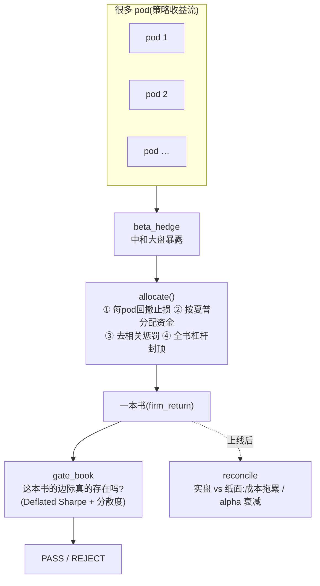

# 多策略平台:很多小团队拼成一台机器(Citadel 式)

!!! note "落地状态(与当前分支代码核对)"
    **本页提到的代码都已落地:** `allocate` / `pod_stopout` / `cap_gross` / `rolling_sharpe_weights` / `correlation_penalty` 在 `quant.portfolio.allocation`;`beta_hedge` 在 `quant.portfolio.factor_risk`;`gate_book` 在 `quant.experiment.book`;`reconcile` 在 `quant.experiment.reconcile`;`stress_correlation` 在 `quant.portfolio.sleeves`。**唯一路线图项**是页末"诚实的局限"里点名的**换 pod 闭环**(被 kill 的 pod 目前永久 latch,连续上新 pod 顶替尚未做)。

顶级量化基金(以 Citadel 为原型)怎么组织:为什么不押一个大策略,而是养**很多互不相关的小策略**,再用**中央风控** + **动态分配资金**拼成一台机器。对应本仓库 `quant.portfolio.allocation` / `factor_risk` / `experiment.book`。

## 一个比喻:不是一个明星厨师,而是一个美食广场

押注一个"明星基金经理"很危险——他状态好时赚翻,状态差时能把整个基金拖垮。Citadel 的做法相反:开一个**美食广场**,里面有几十个独立摊位(叫 **pod**,一个 pod = 一个基金经理 + 几个分析师),每个摊位做自己的一道菜(一个策略)。总部只负责:给摊位**场地、资金、和一个严格的食品安全员**(中央风控)。摊位负责出菜(alpha),总部负责别让任何一个摊位把整个广场烧了。

> 一句话(被所有公开资料反复印证的组织原则):**"总部提供基础设施、资金和风险监督;pod 提供 alpha。一切从这个分工出发。"**

## 为什么"很多互不相关"比"一个很强"好

这是整套打法的数学核心,叫**主动管理基本定律**:`信息比率 = 技能 × √(独立下注数)`。直觉版:

- 一个胜率 50.75% 的赌注,单看毫无意义;但**重复几百万次**、且每次**互相独立**,微弱优势会累积成稳定收益(文艺复兴 Medallion 就是这么干的)。
- 把 N 个**等质量、互不相关**的策略等权拼起来,组合的夏普 ≈ 单个 × √N。3 个就 ≈1.7 倍,9 个就 ≈3 倍。**前提是"互不相关"**——相关的策略拼在一起没有这个红利。

所以 Citadel 会刻意**制造去相关**(甚至把股票部门拆成 Surveyor / Ashler 等几个半独立小单元,就是为了降相关)。本仓库把这条做成了代码:[`correlation_penalty`](../architecture/citadel-pod-book.md)——一个和大盘书雷同的 pod 会被**降低资金权重**,资金流向真正能分散风险的 pod。

> **实测(`research/citadel_book_e2e.py`,committed 美股数据 2008–2022,过框架自己的闸门):**
> 3 个**互相相关**的股票 sleeve(低波/动量/反转)拼成的书 → `div_ratio` 1.01、Sharpe 0.55 →
> **REJECT**(Deflated-Sharpe 没过)。**只加一个和股票几乎零相关的黄金趋势 sleeve**(单看最弱,
> Sharpe 才 0.34、回撤 −34%)→ `div_ratio` 1.10、Sharpe 0.70 → **PASS**。最弱的 sleeve 反而把书
> 救活了——因为它**不相关**。这就是"分散才是产品"`IR = IC·√Breadth`,在真实数据上被框架自己证出来。
> (PASS 是**擦边**的,见脚本同名 note 的诚实警告——重点是判决**朝对的方向动**,不是说这本书可部署。)

> ⚠️ **陷阱:平时不相关 ≠ 危机时不相关。** 很多策略平时像是独立的,一到崩盘(强制去杠杆、risk-off)集体奔向 +1 相关——恰恰在最需要分散时失效。本仓库 `quant.portfolio.sleeves.stress_correlation` 专门测这个"相关性崩溃"。详见[危机凸性 vs 做空溢价](crisis-convexity-vs-short-premium.md)。

## 中央风控:独立、两层、自动止损

Citadel 的风控组(PCG)**直接向 CEO 汇报**、独立于交易台——这样风控能不带情面地否决基金经理。它同时跑**两层**:

1. **每个 pod 一层**:回撤到一定幅度自动**砍资金**,再深一点**直接关停**(行业公开的标杆是 Millennium 的 ~5% 砍一半、~7.5% 关停——自动、不讲情面,这正是去掉"舍不得割肉"的人性弱点)。
2. **全公司一层**:总杠杆、净敞口、以及对**系统性因子**(大盘 beta、规模、动量)的总暴露,实时盯着、超了就降。目标是**最大化特异性风险(选股本事),最小化因子风险**。

本仓库把这两层做成了[`pod_stopout`](../architecture/citadel-pod-book.md)(每 pod 回撤止损,5% 降档 / 7.5% 永久关停)+ `cap_gross`(全书总杠杆封顶)。"中和因子暴露"那条是 [`factor_risk.beta_hedge`](../architecture/citadel-pod-book.md):估出一个收益流对大盘的 beta,把这部分减掉,留下纯粹的特异性收益(就是"用指数/期货对冲掉 beta"的收益流版本)。**全部严格因果**(今天的决策只用昨天及以前的信息),所以整本书还能再过一遍[防过拟合闸门](why-backtests-lie.md)。

**一个常见困惑:为什么因子研究没有回撤闸门?** 5%/7.5% 的止损作用在 **pod 收益流 → book 分配**这一层,不作用在因子研究上;`run_experiment` 的闸门(数据质量 / DSR / 拥挤 / trade_mode)确实没有 MaxDD——**这是故意的分层**。研究层问的是"边际是否统计上真实",回撤不是真实性的证据:一个 raw MaxDD 很大但与 book 低相关的因子,组合之后完全可能是好资产,在研究层就按回撤淘汰反而会漏掉它。回撤控制属于组合层的 sizing 工作(vol-target、止损),而且 `pod_stopout` 是**因果实现**的——回测 book 时止损规则的影响已经算进数字里,不是实盘才生效的纸面规则。

## 动态分配资金:钱流向表现好、又不相关的 pod

资金不是固定的。中央会按**滚动夏普、回撤、相关性**不断重新分配——赚钱的高夏普 pod 加码,触限的减码或清盘。本仓库:[`rolling_sharpe_weights`](../architecture/citadel-pod-book.md) 按近期夏普给资金,叠加上面的去相关惩罚。

## 整张图(本仓库怎么实现)

- **出菜**:`Factor` / `Strategy`(每个 pod 的信号)
- **拼书**:[`allocate`](../architecture/citadel-pod-book.md)(两层风控 + 动态资金 + 去相关)
- **质检这本书**:`gate_book`——把"边际是否真实"的统计关卡用在**整本书**上(一堆单看不错的策略拼起来不一定真有分散红利,这里用 `div_ratio` 把它证伪)
- **上线后盯梢**:`reconcile`——实盘收益对照当初的纸面收益,负的 `mean_drift` = 没算到的成本,负的 `sharpe_decay` = 边际在衰减

## 研究组织也可以 pod 化(方向军团)

pod 不只是资金分配的单位,也可以是**研究组织**的单位:把自动化研究 routine 按方向分成小队(A 股微盘/PEAD、US 横截面、宏观 overlay、执行/成本各一个 direction),ledger 按 direction 记试验数。这和[多重检验](multiple-testing.md)的累计 DSR 是**同一个设计**:军团越大、试验累计 N 涨越快、闸门越严——扩张研究面的同时机械收紧标准,正是诚实研究该有的形状。落地上不必一步开满常驻小队:给现有 routine 加"方向轮换"、scoreboard 按 direction 分组即可;以小资金 book 而言 3–5 个低相关方向就足够把回撤压下来,pod 数量本身不是目标。

## 诚实的局限

"关停"目前是**永久 latch**(被关的 pod 不再复活,对齐"pod terminated")。真实平台靠**持续上新 pod 顶替**被关掉的来维持,本仓库这个「换 pod」闭环还没做(见 beads epic `qs-1yp` / allocate 相关票,勿写 markdown checkbox)。所以长样本上一篮子高波动 pod 会逐个被关、把书跑空——研究时可调高 `kill_drawdown` 或缩短样本来隔离观察。

## 想动手 / 看细节

- **工程细节 + 设计图 + API/类定义**:[Pod book(中央风控+资金分配)](../architecture/citadel-pod-book.md)
- **蓝图、缺口分析、来源**:[Citadel 式框架 PRD](../architecture/citadel-framework-prd.md)(含 `research/citadel_framework_research.md` 的全部出处)
- **为什么需要那些统计闸门**:[为什么回测会撒谎](why-backtests-lie.md) · [多重检验](multiple-testing.md)

## 相关页面

| 方向 | 页面 |
|---|---|
| 上游 | [0 · 研究总览](../quant/index.md) · [playbook](../playbook.md) |
| 下游 | [研究总账](../research-log.md) · [深入理解](../deep/index.md) |
| 同域 | [策略家族图谱](../reference/strategy-families.md) · [想法库](../ideas/index.md) |
| 验证 | [为什么回测会撒谎](why-backtests-lie.md) · [多重检验](multiple-testing.md) |

## 深入阅读 / 学习 / 拓展

- **站内:** [能力速查](../reference/capabilities.md) · [给 AI Agent](../for-agents.md)
- **源码:** 页内模块路径均在 `src/quant/`;先 `rg` 再写文档
- **注:** pod 机制
