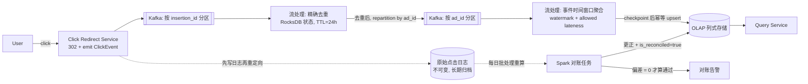

# 设计题解：广告点击聚合（Ad Click Aggregation）

## 题目与范围

面试官通常这样开场："设计一个广告点击聚合系统：用户点击广告后，系统要统计每个广告/
campaign 的点击量和花费，用于给广告主计费。" 这句话里真正的分量在最后半句——**用于计费**。
这道题表面上和 [[solution-top-k]] 一样是"流式统计一个数"，但那道题允许有界误差换性能，
这道题不允许：**算错一个数会变成一笔真实的钱**，所以每一处会引入不确定性的地方（网络重
试、乱序、迟到、进程重启）都必须有一个明确、可审计的处理规则，而不是"近似就好"。

值得当场问清楚的澄清问题，以及它们各自改变的设计决策：

- **"实时"到底要多实时？** 如果广告主只需要按天对账的报表，这退化成一个批处理问题；本题
  假设广告主需要近实时的花费仪表盘（分钟级）**同时**需要一份按天出的、可审计的计费终版，
  两者都要——这决定了必须是"流式先给出临时结果，批处理给出最终结果"的两层架构（见「深入
  探讨」第 6 节），而不是二选一。
- **点击价格在哪一刻确定？** 本题假设 CPC（每次点击成本）取决于点击发生那一刻的竞价结果，
  必须和点击事件一起记录下来，而不是查询时按"当前价格"去算——这条直接决定了点击事件本身
  必须携带 `click_price` 字段，价格是不可变历史的一部分，不是聚合时才查出来的维度。
- **同一次广告展示的重复点击算几次？** 假设同一个 `insertion`（一次广告展示实例）在一个
  去重窗口内的重复点击只计一次；这个去重窗口本身是产品定义的一个数字，决定了去重状态要
  保留多久（见「深入探讨」第 1 节）。
- **要不要处理点击欺诈（bot 刷量）？** 不处理——反欺诈是独立的风控/机器学习问题，本题只
  处理"同一个真实点击因为网络重试被多次上报"这一类技术性重复，不处理"同一个人/程序真的
  点了很多次"这一类业务性重复。

**范围内**：点击事件的精确去重、事件时间与到达时间的区分、乱序与迟到数据的窗口语义、
流式聚合写入 OLAP 存储的精确一次语义、热门广告的负载倾斜、流式结果与批处理重算的对账。
**范围外**：点击欺诈检测、广告竞价/排序本身、广告主自助报表 UI、退款/申诉流程。

## 需求

**功能需求（驱动设计的 5 条）**

1. 记录每一次广告点击，归因到正确的 `ad_id`/`campaign_id`/`advertiser_id`，用于计费。
2. 同一个广告展示实例（`insertion`）在指定去重窗口内的重复点击只计一次。
3. 提供多档时间粒度（1 分钟、1 小时、1 天）的点击量与花费统计查询，近实时更新。
4. 每天为前一天的数据产出一份与原始点击日志完整对账过的"计费终版"，可审计、不可静默
   更改。
5. 点击的计费价格取自点击发生那一刻的出价，聚合时只做加总，不重新计算单价。

**非功能需求（数字化）**

- **新鲜度**：流式（临时）聚合结果 P99 < 1 分钟内可查询；计费终版（对账后）在事件发生后
  24 小时内产出。
- **正确性目标**：对账后的计费终版与批处理重算的偏差必须为 0（这是设计目标，不是"容忍
  多少误差"——下面会算出为什么哪怕万分之一的偏差在这个量级下也是一笔不能忽略的钱）。
- **可用性**：点击摄入路径 99.99%——点击丢失直接等于广告主被少计费、平台少一笔可审计的
  收入凭证；查询路径 99.9%。
- **一致性/可审计性**：计费终版数据一旦对账确认写入，不可被静默覆盖，任何更正都必须留痕
  （日期、原值、新值、原因）。这与 [[solution-top-k]] 里"近似、有界误差即视为正确"的一致性
  目标完全不同——同一个"流式计数"骨架，因为多了"钱"这一条非功能需求，所有中间决策都要
  往"可证明精确"而不是"内存可控"上偏。

## 容量估算

**流量：** 假设该广告网络日均 5 亿次点击（假设，非真实平台数据）。

```
avg_qps = 5e8 / 86400 ≈ 5,787/s
peak_qps = avg_qps * 4（广告流量的峰值系数比一般 C 端应用更高，
                        大促/热点事件会在短时间内集中触发点击）≈ 23,148/s
```

每条点击事件约 150 字节（`click_id` 16B、`insertion_id` 16B、`ad_id/campaign_id/
advertiser_id` 各 8B、`user_id` 8B、`event_time` 8B、`click_price` 8B、地理/设备/来源等
约 60B）：每天原始摄入 `5e8 * 150 = 7.5×10^10B ≈ 75GB`。

**去重带来的额外流量：** 假设客户端重试/网络抖动导致 3% 的点击事件是同一次点击的重复
上报（假设），则摄入层实际收到的原始事件数是 `5e8 / (1-0.03) ≈ 515,463,918`，其中约
`15,463,918` 条是需要被去重逻辑识别并丢弃的重复事件——**这个数字本身就是"为什么去重不能
是可选项"的证据**：如果不去重，每天多算 1546 万次点击，按下面算出的平均单价，这一项就是
一笔六位数美元的多计费。

**去重状态存储：** 去重窗口设为 24 小时（"同一个 insertion 一天内只计一次"，这是一个产品
定义的数字，来自去重范围的假设）。去重 key 用 `insertion_id + action + click_price` 的
哈希（16 字节），值存最小必要的标记信息（约 24 字节）：`515,463,918 * 40B ≈ 20.6GB`——
这是一天的滚动状态，24 小时后 TTL 过期。按 `insertion_id` 哈希分成 32 个分片，每个分片
承担峰值 `23,148/32 ≈ 723 次/s` 的去重检查、约 `20.6GB/32 ≈ 644MB` 的状态——这个量级下
单分片一个 RocksDB 实例綽綽有余，不需要任何近似结构（见「深入探讨」第 1 节，为什么这里
不能像 [[solution-top-k]] 一样上 sketch）。

**这笔钱有多大，决定了"精确"这个非功能需求不是唱高调：** 假设平均 CPC（每次点击成本）
$0.35，日均广告花费 `5×10^8 * 0.35 = $1.75×10^8`（1.75 亿美元/天，这是本设计的假设，不是
任何真实平台的数据）。如果允许 0.01%（万分之一）的计费偏差，对应的每日误差预算是
`$1.75×10^8 * 0.0001 = $17,500`——**这笔钱不是抽象的"一点误差"，是需要写进事故报告的数字**，
这就是为什么本题所有的"要不要精确"决策都会倒向精确，而不是像 [[solution-top-k]] 那样倒向
"内存可控、误差有界即可"。

**OLAP 存储：** 假设日均 200 万个活跃 `ad_id`（假设）。1 分钟粒度的实时层保留 24 小时：
`2×10^6 * 1440 分钟 = 2.88×10^9` 行，每行 `ad_id(8B)+campaign_id(8B)+window_start(8B)+
click_count(4B)+spend(8B)=36B`，列式存储按 4 倍压缩比估算：`2.88×10^9 * 9B ≈ 25.9GB`——
1 分钟粒度只保留 24 小时用于实时仪表盘，更长期的历史只保留对账后的小时/天粒度汇总，道理
和 [[solution-top-k]] 的分层窗口汇总完全一样。

## 核心实体与 API

**核心实体**

- `ClickEvent`（不可变，摄入后追加进原始日志，永不删除）：`click_id`（本次点击的幂等 id，
  客户端或重定向服务在点击发生时生成）、`insertion_id`（标识这是哪一次具体的广告展示）、
  `ad_id`、`campaign_id`、`advertiser_id`、`user_id`、`event_time`（点击发生的真实时间）、
  `received_time`（服务端收到的时间，二者之差就是本题要处理的"迟到"程度）、`click_price`
  （点击那一刻的出价，随事件一起落盘，之后永不重算）。
- `AggregateRow`（OLAP 里的一行）：`ad_id`、`campaign_id`、`window_start`、
  `window_granularity`（`1m|1h|1d`）、`click_count`、`spend`、`is_reconciled`（对账过的
  终版标记）。
- `ReconciliationReport`：`date`、`ad_id`、`streaming_count`、`batch_count`、`delta`、
  `delta_pct`、`corrected`（本次是否触发了更正）。

**API**

- `GET /ad/click?insertionId=&adId=&sig=&dest=` → 302 重定向到 `dest`，**同时**在服务端
  发出 `ClickEvent`。用服务端重定向而不是客户端埋点上报，是因为客户端上报可以被广告拦截
  插件/隐私设置直接屏蔽掉，而重定向是完成"跳转到广告主页面"这个用户明确想要的动作的必经
  之路，天然不可绕过（`sig` 是对 `insertionId+adId` 的签名，防止伪造点击）。
- `GET /v1/stats?adId=&campaignId=&granularity={1m|1h|1d}&start=&end=` → 返回
  `click_count`、`spend`、以及这段区间内每个粒度桶的 `is_reconciled` 状态，让调用方知道
  拿到的是"实时临时值"还是"对账终版"。
- **故意不做的**：没有广告主可写的"调整点击数"接口——计费数字只能来自服务端观测到的点击
  事件加上对账流程，杜绝一个显而易见的计费欺诈入口；没有删除单条点击记录的接口——原始
  日志不可变，任何更正都通过「深入探讨」第 6 节的对账流程留痕产生，而不是物理删除历史。

## 高层设计



- **摄入**：`Click Redirect Service` 先把 `ClickEvent` 写入不可变的原始日志（对账的唯一
  真相来源），再发 302 重定向，二者顺序不能反——如果先重定向再异步写日志，进程崩溃会丢
  一条永远追不回来的点击。
- **去重阶段**：`Kafka` 按 `insertion_id` 哈希分区（不是按 `ad_id`！），保证同一次点击
  的所有重复上报都落在同一个分片，去重检查才有意义（见「深入探讨」第 1 节）。
- **聚合阶段**：去重之后的事件要按 `ad_id` 重新分区（一次 shuffle）才能做"每个广告的点击
  聚合"——这是 [[async.streaming.processing|Stream Processing]] 里 stream-stream / 
  stream-table join 都要求的"co-partitioning"的同一个道理：**一份数据流不可能同时按两个
  不同的 key 天然分区**，去重要按点击身份分区，聚合要按广告分区，中间必须有一次显式的
  repartition。
- **写入 OLAP**：聚合结果按 `(ad_id, campaign_id, window_start, window_granularity)` 做
  幂等 upsert，这个 key 完全由事件本身的确定性字段构成（见「深入探讨」第 4 节，为什么
  这一点是精确一次语义成立的前提）。
- **对账**：每天对前一天的原始日志跑一次批处理重算，和流式结果逐 `(ad_id, day)` 比较，
  见「深入探讨」第 6 节。

## 深入探讨

### 1. 精确去重：为什么这里不能用近似结构（与 Top-K 的对比）

[[solution-top-k]] 为了在无界基数下把内存控制住，接受了 Count-Min Sketch/Space-Saving
带来的有界误差——多算一点、少算一点都不影响"哪些内容是热门的"这个结论。计费场景不能这样：
**去重是一个二元判断（这条点击算不算钱），任何近似结构的假阳性（把一次没重复的点击误判为
重复而丢弃）都是直接漏计一笔真实的钱，且没有办法事后从摘要本身反推出丢的是哪一条**——不
像 Count-Min Sketch 的误差是"某个计数偏高一点"，Bloom filter 式去重的误判是"某条记录彻底
消失，且不可追溯"，这个代价对广告主是不可接受的。

因此去重必须用**精确**的 key-value 存储：以 `insertion_id + action + click_price` 的哈希
作为 key，检查存在性、写入、TTL 过期（24 小时窗口）都要求强一致的读后写。本设计选
RocksDB 类的本地状态存储（Flink 的 keyed state 后端本身就是这个模型），而不是过一遍
Redis——原因是「容量估算」里算出的规模（32 个分片，单分片 644MB、峰值 723 次/s）完全在
单机本地状态可以承受的范围内，本地状态省掉了一次网络往返，且随流处理的 checkpoint 机制
（见第 4 节）一起持久化，不需要单独运维一个外部去重服务。

（Pinterest 工程博客描述过一个类似定位的去重服务 Aperture：用 RocksDB 存储引擎，按
`insertion_id + action + viewtype` 识别一次展示、以完整事件字节去重，报告的 SLA 是峰值
20 万 QPS 下个位数毫秒的 P99——这个量级和本题算出的规模同一数量级，可以作为"用 RocksDB
类存储做精确去重在这个量级下可行"的一个佐证。需要注意 Aperture 的去重时机和本题不同：
它把原始事件按时间桶存下来，在**查询时**才做去重聚合，而不是本题选择的"摄入时**流式**
去重"，这是两种不同的设计取舍，见「来源与延伸」。）

### 2. 事件时间 vs 处理时间：水位线如何权衡时延与完整性

一次点击的 `event_time`（用户实际点击的时刻）和 `received_time`（服务端收到的时刻）之间
的差距，来自移动端弱网重试、客户端本地缓冲后批量上报等场景，可能是几秒到几分钟。如果
按 `received_time` 分桶统计（**处理时间**窗口），同一分钟内的"1 分钟点击量"在不同的重放/
重启场景下会得到不同答案，不可重现——对计费系统这是不可接受的：同一段历史数据无论算
多少次都应该得到同一个答案。因此必须按 `event_time` 分桶（**事件时间**窗口），这是
[[async.streaming.processing|Stream Processing]] 里讲的基础判断，本题的特殊之处在于：
因为要计费，"结果必须可重现"从一条最佳实践变成一条硬约束。

事件时间窗口天然带来一个问题：什么时候能确定"这一分钟的数据都到齐了，可以把结果发出去"？
这正是水位线（watermark）存在的原因，也是 Google 的 Dataflow 论文里用来定义模型的核心
概念之一——论文明确指出**水位线只是"系统认为这个时间点之前的数据大概率都已经到齐了"的
一个启发式估计，不是一个正确性保证**（"we won't rely on watermarks as such"）。本设计
用 Flink 的 bounded-out-of-orderness 策略：水位线 = 当前观察到的最大 `event_time` 减去
一个容忍延迟（本设计取 2 分钟，一个基于典型移动端网络抖动的假设），多输入算子的水位线取
各输入水位线的最小值，确保不会因为某一路数据滞后就提前关闭窗口。

### 3. 迟到数据：多晚算迟到，迟到之后怎么办

水位线关闭一个窗口之后才到达的事件就是迟到数据。本设计分三层处理，越往后代价越高：

- **窗口关闭后的宽限期（allowed lateness）**：额外保留 15 分钟（假设），这个区间内到达
  的迟到事件会让该窗口重新计算并覆盖之前发出的临时结果——这是 Dataflow 论文里的
  **Accumulating & Retracting** 触发模式：重新触发时先对下游发出一次"撤回上次的值"，再
  发出新值，而不是直接覆盖，这样下游如果基于这个聚合结果又做了一次分组聚合（比如"按
  advertiser 汇总"这种二级聚合），也能正确处理值的变化，而不是把新旧两个值都算进去。
- **超过宽限期、但在对账截止时间之前**：不再触发流式重算（避免无限期地把已经"关闭"的
  窗口悬而不决），而是侧输出到一个"迟到事件"流，等第 6 节的每日批处理对账时一并算入。
- **超过对账截止时间**（本设计设为事件发生后 48 小时）：视为异常，走人工/风控介入的旁路
  流程，不再自动更正计费终版——一个点击两天后才姗姗来迟，本身就值得怀疑，不应该被当成
  正常的网络延迟自动处理。

### 4. 精确一次（exactly-once）聚合写入 OLAP：checkpoint + 幂等 sink

[[async.delivery.exactly-once|Effectively Exactly-Once]] 讲过，端到端精确一次从来不是
单一组件的特性，而是"可重放的 source + 有 checkpoint 的状态 + 可去重的 sink"三件事拼出来
的组合。本题把这个组合具体钉死成：

- **可重放的 source**：`Kafka` 保留期覆盖最坏情况下的重启加追赶时间，聚合阶段的输入
  `ad_id` 分区 topic 可以从任意历史 offset 重新消费。
- **有 checkpoint 的状态**：聚合算子的窗口累加状态定期做一致性快照（`barrier` 机制），
  故障恢复时只重放"最近一次 checkpoint 之后"的那一小段，而不是整个窗口从头累加。
- **可去重的 sink（这是本题的关键决策点）**：写入 OLAP 时用 `(ad_id, campaign_id,
  window_start, window_granularity)` 作为幂等 upsert 的 key。恢复后重放的这段输出会用
  同一个 key 再写一次，**只要这个 key 完全由事件的确定性字段构成、且同一批输入总是算出
  同一个聚合值，重复写入就是无害的覆盖**，而不是像 `uuid4()` 主键那种非确定性 key，重放
  会写出一行新记录而不是覆盖旧的（这正是既有卡片讨论过的"重放路径里的非确定性会同时破坏
  幂等 sink 和两阶段提交 sink"的具体案例）。这里选幂等 upsert 而不是两阶段提交 sink，是
  因为本设计的 OLAP 存储原生支持按主键 upsert，不需要额外接入一套事务协议。

### 5. 热门广告（hot ad id）的偏斜

一次成功的营销活动（比如限时促销、热点事件营销）可以让极少数 `ad_id` 在短时间内占据远
超均值的点击量。因为聚合阶段按 `ad_id` 分区（第 2 节的 repartition），一个爆量的 `ad_id`
会让承担它的那个分区处理器成为热点，做法和 [[solution-top-k]] 的热点 item 处理完全一致：
探测到热点后，对该 `ad_id` 加盐（`ad_id + rand(0,N)`）打散到多个子分区分别聚合，写入
OLAP 前再把子聚合结果按原始 `ad_id` 相加合并——区别只在于这里的"合并"就是普通的加法求和
（因为聚合的是同一个 `ad_id` 的子计数，不存在 [[solution-top-k]] 里"候选集合可能遗漏"的
问题，合并总是精确的）。

### 6. 对账：流式结果与批处理重算的分歧处理，以及"账本"的终局

流式聚合给出的是**尽力而为的临时结果**：受限于水位线的启发式本质（第 2 节）和有限的
宽限期（第 3 节），它永远有可能因为极端迟到数据而和"把这一天所有点击都收集齐之后重新算
一遍"的结果有出入。因此本设计从不把流式结果直接当成计费终版，而是每天对前一天的数据跑一
次批处理重算（对整份不可变原始日志做一次没有水位线约束的精确聚合，等价于 Dataflow 论文
里描述的"经典批处理"语义：水位线在开始时停在时间起点，处理完所有数据后跳到无穷），逐
`(ad_id, day)` 和流式结果比较：

- **偏差为 0**：把该 `(ad_id, day)` 标记 `is_reconciled=true`，作为计费终版对外结算。
- **偏差不为 0**（通常是超过宽限期的迟到事件，或极少数处理故障）：用批处理的精确值覆盖
  OLAP 里的行，同时写一条 `ReconciliationReport` 记录旧值、新值、偏差原因，供审计——**
  这是本设计里唯一允许"改数字"的路径，而且改的动作本身也是可追溯的事件，不是静默更新**。

这套"流式先出结果、批处理最终纠正"的组合就是业内常说的 **lambda 架构**在计费场景下的
具体形态：不是因为流处理天然不可靠，而是因为水位线本身的启发式性质决定了"流式结果何时
真正完整"永远无法在流处理内部自证，需要一个不受时延约束的批处理去做最终确认。这和
[[solution-top-k]] 的关键区别：top-k 的"正确性"目标本身就是"有界误差"，近似结构给出的
结果就是终局；这里的"正确性"目标是"零偏差"，流式结果无论多准都只是候选，批处理对账才是
终局。

## 瓶颈、故障与演进

**去重阶段热点：** 一个被大量重复点击攻击（或客户端 bug 导致疯狂重试）的单个 `insertion_id`
理论上也会造成去重分片的局部热点，但因为去重状态只做存在性检查（`O(1)`），单个 key 的
反复命中不会像聚合阶段的求和状态那样线性增长，风险远小于第 5 节的热门广告问题。

**流处理器故障：** 依赖 [[async.streaming.processing|Stream Processing]] 的 checkpoint
恢复（第 4 节），恢复期间该 `ad_id` 分区的实时查询会短暂看到落后的计数，`is_reconciled`
标记始终为 `false` 直至次日对账补齐，调用方不会被静默给一个错误但看起来正常的数字。

**OLAP 写入热点：** 幂等 upsert 本质上是对同一行的高频覆盖写，如果窗口粒度选得太细（比如
直接按秒聚合），每个 `ad_id` 每秒一次 upsert 会让写放大失控；本设计选 1 分钟为最细实时
粒度正是这个权衡的结果，粒度选择直接来自「容量估算」里 OLAP 存储量的计算，而不是随手定的。

**10 倍演进（日点击量 50 亿）：** 去重存储和 OLAP 存储都随点击量线性增长，`20.6GB` 和
`25.9GB` 的量级涨到 10 倍后依然是单机可管理的规模（约 206GB、259GB），真正的压力在批处理
对账任务——重算 50 亿条记录的批处理窗口如果还想在"次日"这个时间预算内跑完，需要从单一
每日全量重算改成增量式对账（只重算被标记为"有迟到事件落入"的 `(ad_id, day)` 组合，而不是
无差别重算所有组合），这需要第 3 节的侧输出迟到事件流额外记录"哪些 `(ad_id, day)` 值得
重算"这份索引。

**100 倍演进：** 需要跨地域部署时，同一个 `insertion_id` 的重复点击理论上可能从不同地域
发起（比如点击后网络切换），去重必须能跨地域识别同一个 `insertion_id`——不能像
[[solution-top-k]] 那样满足于"每个地域先出本地结果、最后轻量合并"，因为去重是强一致性
要求，需要要么把去重状态按 `insertion_id` 做全局路由（牺牲本地性换正确性），要么接受
"同城/同地域优先去重、跨地域重复走对账兜底"的折衷（把一部分正确性负担从流式阶段转移到
第 6 节本来就存在的批处理对账上）。

## 面试官会追问什么

**中级：** "为什么不能直接用数据库的唯一索引（unique constraint）做去重？" ——如果聚合
和去重共用同一个事务性数据库，唯一索引确实可行，但那个方案没法承受本题算出的峰值 QPS
（23,148/s）做同步事务写入；把去重下沉到流处理的本地 keyed state，是为了让去重检查这一步
不需要跨节点网络往返。

**高级：** "如果广告主要求'点击后立刻看到扣费'，而不是分钟级，怎么改？" ——这会把非功能
需求里的"新鲜度 P99 < 1 分钟"收紧到秒级甚至单条事件级，第 4 节的窗口聚合思路仍然成立
（把窗口粒度缩小），但第 6 节的"计费终版要等对账"这个产品语义必须向广告主讲清楚：更快看到
的永远是临时值，"这笔钱最终确认"这件事的延迟不会因为把窗口缩短而消失，因为它来自水位线
的启发式本质，不是窗口大小本身。

**资深/Staff：** "这套设计假设点击是唯一的计费事件，如果未来要同时计费展示（impression）
和转化（conversion），架构要怎么变？" ——去重、事件时间窗口、exactly-once sink、对账，
这四个机制对"哪种事件类型"是不敏感的，可以直接复用；真正要变的是聚合的 key 从单一
`ad_id` 扩展成 `(ad_id, event_type)`，以及第 6 节对账报告需要按 `event_type` 分别出，
因为不同事件类型的迟到分布和容忍窗口可能完全不同（转化事件的归因窗口通常比点击去重窗口
长得多）。

## 常见错误

- **用近似结构做计费去重**：把 [[solution-top-k]] 的 Count-Min Sketch/Bloom filter 直接
  搬过来做点击去重，省了内存，但假阳性会造成不可追溯的漏计费——见第 1 节，这是这道题和
  top-k 最容易被面试官盯上的分界线。
- **按处理时间而不是事件时间分桶**：结果不可重现，重放同一段历史数据会算出不同的"1 分钟
  点击量"，对计费系统是硬伤（第 2 节）。
- **窗口触发后直接覆盖而不发撤回（retraction）**：如果下游还有二级聚合（比如按
  advertiser 汇总每个 ad 的结果），直接覆盖会让下游的二级聚合把新旧两个值都算进去，第 3
  节的 Accumulating & Retracting 模式正是为了避免这个问题。
- **幂等 sink 的 upsert key 里混入非确定性字段**：比如把 `received_time` 或一个每次生成
  的 `uuid4()` 塞进 upsert key，会让 checkpoint 恢复后的重放写出新行而不是覆盖旧行，
  悄悄把同一批点击算了两次（第 4 节）。
- **把流式结果当成计费终版直接结算，不做批处理对账**：水位线是启发式估计，不是正确性
  保证（第 2、6 节），跳过对账等于把"这笔账到底对不对"这件事寄托在一个从未被证明过完备
  的估计上。
- **对账发现偏差后静默覆盖旧值**：不留痕的更正在审计时等于没有解释——第 6 节强调对账
  更正本身也要产生一条可追溯的记录。

## 五分钟讲法

I'd frame this as the same streaming-aggregation skeleton as a Top-K design, but with one
requirement — money is on the line — that pushes every single decision from "bounded error
is fine" to "must be exact and reproducible." I capacity-plan clicks per second and, from an
assumed duplicate rate and average CPC, compute the actual dollar exposure of even a tiny
error rate, which is what justifies the extra machinery. For deduplication I use an exact
keyed store, not a probabilistic sketch, because a false positive there silently drops a
real, unrecoverable charge — this is the explicit contrast with the Top-K design's Count-Min
Sketch. I partition ingestion by insertion ID so duplicate deliveries of the same click always
hit the same dedup shard, then repartition by ad ID before aggregation, since dedup and
aggregation need different partition keys and no single partitioning satisfies both. I window
on event time, not processing time, because results have to be reproducible on replay, and I
use a watermark — explicitly a heuristic, not a correctness guarantee, per the Dataflow
paper's own framing — to decide when to emit a window, with a bounded allowed-lateness
extension and retractions for anything that arrives after a window has already fired. For the
sink, I make the OLAP upsert key fully deterministic from the event's own fields so replayed
output after a checkpoint restore is a harmless overwrite instead of a duplicate row. And
because the watermark can never *prove* completeness, I never treat the streaming result as
final — a nightly batch recount over the immutable raw log is the actual source of truth, and
any correction it makes is itself a logged, auditable event, never a silent overwrite.

## 来源与延伸

- [Ad Click Aggregator problem breakdown](https://www.hellointerview.com/learn/system-design/problem-breakdowns/ad-click-aggregator)
  —— 覆盖了服务端重定向上报点击、按 ad id 分片、Flink 窗口聚合、批流结合校验的整体路线；
  本题在此基础上把"为什么去重不能用近似结构"单独拿出来和 [[solution-top-k]] 对照论证，并
  把 exactly-once sink 的幂等 key 确定性要求和 Accumulating & Retracting 触发模式的机制
  讲得更细。
- [Building a real-time user action counting system for ads](https://medium.com/pinterest-engineering/building-a-real-time-user-action-counting-system-for-ads-88a60d9c9a)
  （Pinterest Engineering）—— 描述了一个类似定位的去重服务 Aperture 及其报告的延迟/QPS
  数量级；本题只把这篇文章报告的数字作为"这类系统的延迟预算是可行的"的一个佐证，未验证其
  内部架构细节是否和本题设计一致，标注为二手信息。
  <!-- no-archive: n/a，工程博客，非商业备考网站 -->
- [The Dataflow Model: A Practical Approach to Balancing Correctness, Latency, and Cost in Massive-Scale, Unbounded, Out-of-Order Data Processing](https://www.vldb.org/pvldb/vol8/p1792-Akidau.pdf)
  （Akidau et al., Google, VLDB 2015）—— 本题「深入探讨」第 2、3 节关于水位线是启发式而
  非正确性保证、以及 Accumulating & Retracting 触发模式的论证直接来自这篇论文；论文本身
  开篇用的动机案例就是"给广告计费"，和本题场景高度一致，论文覆盖的窗口合并/触发器组合
  比本题用到的更完整。
- [Generating Watermarks — Apache Flink Documentation](https://nightlies.apache.org/flink/flink-docs-master/docs/dev/datastream/event-time/generating_watermarks/)
  —— 本题采用的 bounded-out-of-orderness 水位线策略和多输入算子取最小值的机制描述来自
  这份官方文档。
- [Message Delivery Guarantees for Apache Kafka — Confluent Documentation](https://docs.confluent.io/kafka/design/delivery-semantics.html)
  —— 本题「深入探讨」第 4 节引用的幂等 producer（序列号去重）与事务（`read_committed`
  隔离级别、offset 和输出原子提交）机制描述来自这份文档；这与
  [[async.delivery.exactly-once|Effectively Exactly-Once]] 的既有卡片内容一致，本题在此
  基础上把幂等 sink 的 upsert key 确定性要求落到了具体的表结构上。
