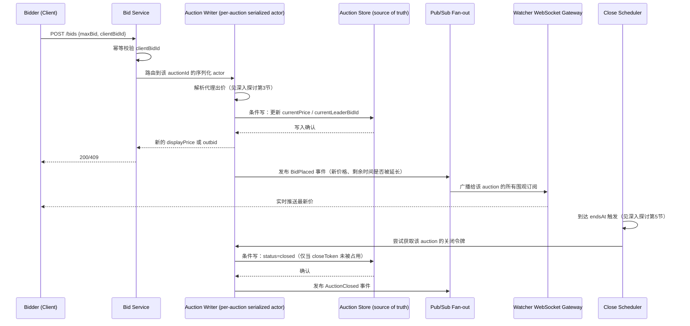

# 设计题解：在线拍卖（Online Auction，eBay）

## 题目与范围

面试官通常这样开场："设计一个在线拍卖系统——卖家发布商品和起拍价，买家竞价，出价最高者
在截止时间赢得商品。" 这道题表面上看像是[[problems.commerce.ticket-booking|Ticket
Booking]]的近亲——都是"高并发写同一份稀缺资源"——但两者的并发模型本质不同：抢票题里，
一万人抢的是一万个**不同**的座位，每个座位的竞争在写入层面是相互独立的；拍卖题里，
一件热门商品的**所有**竞价者在最后几秒竞争的是**同一行**数据（当前最高价），写入本身就
是全局串行的瓶颈，不能靠"分散到不同的行"来缓解。这个差异决定了两道题在并发控制上必须
给出不同的答案，也是本题真正的难点所在。

值得当场问清楚的澄清问题，以及它们各自改变的设计决策：

- **只支持简单出价，还是要支持代理出价（proxy bidding，即用户设一个心理价位上限，系统
  自动帮你加价）？** 决定要不要做「深入探讨」第 3 节的代理出价解析逻辑——本题按 eBay 的
  真实产品形态支持代理出价，因为这是本题公开来源里普遍会问到的深入点。
- **拍卖截止时要不要防止"最后一秒抢拍"（sniping）？** 决定是硬关闭（hard close，到点
  就结束）还是软关闭（soft close，临近结束时的出价会延长截止时间）——本题采用软关闭，
  因为这是本题的核心难点之一（见「深入探讨」第 4 节）。
- **围观者（watcher，只看不出价的用户）要不要实时看到别人出价？** 决定要不要做独立于
  出价写路径的读侧实时推送——本题需要，因为这是本题标题明确列出的范围。
- **出价失败（比如别人抢先一步）要不要允许重试？** 决定 API 是"提交一个新出价"还是
  "尝试把出价提升到某个值失败就返回最新价重试"——本题采用后者的语义，因为它更贴近真实
  用户体验（不需要用户自己算清楚当前最高价是多少）。
- **要不要支持"一口价"（buy-it-now）这种非拍卖的固定价成交？** 不做——一口价本质上是
  普通电商下单流程，不是这道题的并发难点所在，见[[problems.commerce.e-commerce|E-Commerce
  Platform]]。

**范围内**：竞价的并发正确性（同一时刻只有一个"当前最高出价"）、出价实时推送给围观者、
代理出价的自动加价解析、软关闭防狙击、拍卖到点后恰好关闭一次并确定唯一赢家。**范围外**：
支付与发货（拍卖结束后的收款流程属于[[problems.commerce.payment-system|Payment
System]]）、商品搜索与推荐、卖家信誉评分体系、纠纷仲裁（买家收货后的售后流程）。

## 需求

**功能需求（驱动设计的 4 条）**

1. 卖家发布拍卖：商品信息、起拍价、最小加价幅度、结束时间。
2. 买家出价，系统保证同一时刻只有一个"当前最高出价"被所有人看到，出价低于当前最高价
   加最小加价幅度必须被拒绝，绝不能出现两个并发出价都被接受为"最高价"。
3. 买家可以设置代理出价（一个上限），系统自动帮他在被超过时按最小加价幅度加价，直到
   达到上限。
4. 拍卖结束时，恰好确定一个赢家（当前最高出价者），且这个"结束"动作对整个系统只发生
   一次，不会因为多个后台任务同时触发而产生冲突的结果。

**非功能需求（数字化）**

- **出价确认延迟**：用户点击"出价"到收到"成功"或"被超过"的响应，目标 P99 < 500ms——
  这个数字比一般电商写路径更紧，因为用户在最后几秒竞价时对反馈延迟极度敏感。
- **围观者新鲜度**：一次出价发生后，正在观看这场拍卖的围观者看到新的当前最高价，目标
  P99 < 2 秒。
- **一致性**：当前最高价这一件事必须**强一致**——任意时刻查询到的"当前最高价"必须是
  已经被系统接受的出价里最高的那一个，不允许任何两个客户端在同一时刻看到不同的"当前最高
  价"这种分裂视图；围观者的实时推送允许最终一致（允许比强一致的写路径晚几百毫秒到达）。
- **可用性**：出价路径目标 99.95%——拍卖临近结束时如果系统不可用，会直接影响谁赢得商品，
  这是这道题里"不可用"代价最高的路径。
- **恰好关闭一次**：一场拍卖的关闭动作（确定赢家、通知双方）必须恰好执行一次，重复执行
  或完全不执行都是不可接受的错误。

## 容量估算

这道题的容量估算要说明两件事：**为什么并发写的争用集中在极少数"热门拍卖"上**，以及
**围观者的实时推送量级如何被"一场拍卖有多少人在看"这一个维度放大**。

**假设**（本设计的假设，不代表 eBay 真实运营数字）：平台同时在线的拍卖 500 万场；按幂律
倾斜，最热门 0.1%（5,000 场）的拍卖在临近结束的最后几秒集中了不成比例的出价流量。

**热门拍卖的出价争用**：假设一场热门拍卖在结束前最后几秒的出价到达速率为 50 次/秒
（本设计假设），单行条件更新的提交延迟（含网络往返和数据库确认）取 5ms：

```
单次提交窗口内的期望并发出价数 μ = 50/秒 × 0.005秒 = 0.25
P(该窗口内 0 个出价) = e^(-0.25) ≈ 0.7788
P(该窗口内 1 个出价) = 0.25 × e^(-0.25) ≈ 0.1947
P(该窗口内 ≥2 个出价互相冲突) = 1 - 0.7788 - 0.1947 ≈ 0.0265

一秒内有 1/0.005 = 200 个这样的提交窗口
期望冲突窗口数/秒 = 200 × 0.0265 ≈ 5.30
```

**这是第一个决定架构的数字**：在最后一秒内，平均每秒约有 5.3 次"两个出价撞在同一个
5ms 提交窗口内"的情况——这不是罕见的边缘情况，而是热门拍卖最后几秒的常态。如果用纯乐观
并发控制（每次出价都是一次条件更新，冲突了就返回失败让客户端重试），意味着相当一部分用户
在最关键的最后几秒会经历一到多次"提交失败-重新读取当前价-重新提交"的往返，每一次往返都在
消耗那紧张的 500ms 出价确认延迟预算——这正是[[solution-ticket-booking]]里"座位状态机"
一节采用的单语句条件更新模式在**票务场景**下够用、但在**拍卖的最后一秒**这个更极端的争用
密度下会开始让用户体感变差的地方（见「深入探讨」第 1 节，这是本题和抢票题分道扬镳之处）。

**围观者扇出**：假设一场热门拍卖在结束前有 50,000 个并发围观者（本设计假设）：

```
一次出价的朴素扇出消息数 = 50,000 条（每个围观者收一条）
```

**这是第二个决定架构的数字**：50,000 这个数字本身对单个推送节点不算夸张，但如果 5,000
场热门拍卖同时进入最后几秒的白热化阶段，且每场都在用独立的推送路径，系统需要同时维持
5,000 × 50,000 = 2.5 亿个"活跃关注中"的围观关系——这决定了围观者的订阅关系必须用一个
可以按拍卖 id 高效路由的发布订阅层，而不是给每个围观者单独维护一条到出价服务的直连状态
（见「高层设计」）。

**软关闭的时间开销**：假设一场热门拍卖在临近关闭时，出价到达速率为平均每 20 秒一次
（λ = 0.05/秒，本设计假设——这是比争用高峰期低得多的速率，用来估计"软关闭还要拖多久"这
个问题），软关闭窗口取 eBay 公开的 60 秒（见「来源与延伸」）：

```
P(60秒窗口内没有新出价，可以自然结束) = e^(-0.05×60) = e^(-3) ≈ 0.0498
期望需要经历的 60 秒窗口数 = 1/0.0498 ≈ 20.09
期望总延长时间 = 20.09 × 60 ≈ 1,205 秒 ≈ 20.1 分钟
```

**这是第三个决定架构的数字**：在这组假设下，一场持续被竞价的热门拍卖平均会被软关闭机制
额外拖长约 20 分钟——这说明"临近结束时出价就重置倒计时"这条规则理论上可以无限延长，必须
在产品设计上给出一个绝对上限（例如"最多延长 30 分钟"）或者在超过一定次数后收紧延长窗口，
否则极端热门的拍卖可能被恶意刷单长期"钓着"不结束。

## 核心实体与 API

**实体**

- **Auction**：`id, sellerId, itemId, startPrice, minIncrement, endsAt, status(active/
  closing/closed), currentPrice, currentLeaderBidId, version`——`version` 是乐观并发
  控制（或路由到单一写者时的日志位点）的依据，见「深入探讨」第 1 节。
- **Bid**：`id, auctionId, bidderId, maxBid, displayPrice, placedAt, status(leading/
  outbid/winning)`——`maxBid` 是代理出价的心理价位上限（对其他用户不可见，只有
  `displayPrice` 可见），见「深入探讨」第 3 节。
- **Watch**：`auctionId, userId`——围观关系，用于实时推送的订阅路由，不是权威数据，
  可以从零重建。
- **AuctionClose**：`auctionId, closedAt, winnerBidId, closeToken`——关闭动作的幂等
  记录，`closeToken` 保证关闭这个副作用只被应用一次，见「深入探讨」第 5 节。

**API**

```
POST   /auctions               {itemId, startPrice, minIncrement, endsAt}
                                → {auctionId}
POST   /auctions/{id}/bids      {maxBid, clientBidId}
                                幂等 on clientBidId；请求语义是"尝试把我的出价提到 maxBid"
                                而不是"提交一个固定金额的出价"：
                                → 200 {displayPrice, status: "leading"} 或
                                → 409 {currentPrice, status: "outbid"}（附带最新价，
                                  客户端据此决定要不要立刻重试更高的 maxBid）
GET    /auctions/{id}           → {currentPrice, endsAt, bidCount, ...}
WS     /auctions/{id}/stream    订阅式实时推送当前最高价与剩余时间变化
POST   /auctions/{id}/watch     加入围观（不出价）
```

**故意不做的**：不支持撤回已提交的出价（撤回会破坏"当前最高价只增不减"这个对所有围观者
可见的不变量，真实拍卖平台也普遍不允许随意撤回）；不在 API 层暴露除当前最高价之外的历史
出价明细（历史出价的可见性是产品策略问题，不是本题的并发难点）；不支持修改已设置的代理
出价上限为更低的值（只能提高，逻辑上等同于撤回部分出价意愿）。

## 高层设计



**出价写路径**：出价不是直接对 Auction 表做无协调的条件更新，而是先路由到**按
`auctionId` 分区的单一序列化 actor**（技术选型对齐[[solution-stock-exchange|Stock
Exchange]]里"每支股票一个撮合引擎"的思路，但这里分区键是 `auctionId` 而不是股票代码）：
同一场拍卖的所有出价请求被投递到同一个 actor，由它串行地做"这个出价能不能成为新的
最高价"的判断，再写入权威存储。这个选择的理由在容量估算里已经给出——热门拍卖最后一秒的
冲突密度高到纯乐观重试会让相当一部分用户经历多次往返，把冲突判断收敛到一个地方可以让
每个出价只需要一次写，不需要重试（见「深入探讨」第 1 节的完整对比）。

**权威存储**：Auction 表的技术选型是**支持单行条件写的关系型数据库**，因为它的读写
模式是"对单一实体的强一致更新"，不需要跨行事务，且需要写后立刻能被强一致读到（下一个
出价判断依赖上一次写入的结果）。

**围观者推送路径**：出价写入确认后，异步发布一个事件到**按 `auctionId` 分片的发布订阅
层**，再广播给挂在 WebSocket 网关上的围观订阅——这条路径和写路径完全解耦，允许最终一致
和几百毫秒的延迟，呼应
[[caching.strategies|Write & Read Strategies]]里"推送层不是权威数据源"的原则。

**关闭路径**：由一个独立的调度器在 `endsAt` 触发关闭尝试，通过同一个按 `auctionId`
序列化的 actor 和幂等的 `closeToken` 保证恰好执行一次，见「深入探讨」第 5 节。

## 深入探讨

### 并发出价的正确性：条件写、单一写者、还是队列

**问题**：容量估算算出热门拍卖最后一秒里平均每秒约 5.3 次冲突窗口——这不是罕见情况，
是常态。三种候选方案在这个争用密度下的行为差异很大。

**方案一：乐观并发控制（optimistic concurrency control，OCC）/ 条件写，冲突就让
客户端重试**。即
[[solution-ticket-booking]]"座位状态机"一节采用的单语句条件更新模式：`UPDATE auctions
SET current_price=:new, version=version+1 WHERE id=:id AND version=:expected`。这个
模式在抢票题里够用，是因为抢票的争用发生在**一万个不同座位**之间，任意两个请求大概率
根本不碰同一行；但拍卖的争用是**同一行**反复被并发写，容量估算已经算出热门拍卖最后一秒
里存在实打实的冲突密度——用 OCC 意味着一部分用户的出价请求需要"失败→重新读取最新价→
重新计算是否还要出价→重新提交"这个完整往返，在最紧张的最后一秒里，这个额外往返直接挤占
本就只有 500ms 的确认延迟预算。

**方案二：把每次出价都塞进一个 FIFO 队列，由后台异步逐条处理**。保证串行，但用户提交
出价后拿不到即时确认（不知道自己是不是领先），对一个"最后一秒决胜负"的场景来说，异步
确认的体验是不可接受的——用户需要在提交的那一刻就知道自己是否暂时领先。

**方案三（本设计采用）：按 `auctionId` 路由到单一序列化 actor，同步处理，条件写只作为
落盘手段而非并发协调手段**。每场拍卖的出价请求全部路由到同一个内存中的 actor（可以是
一个按 `auctionId` 哈希分片的无锁单线程处理单元，思路上和
[[solution-stock-exchange|Stock Exchange]]里"每支股票一个撮合引擎"同构），由它串行地
做出价判断——因为所有决策已经在同一个地方发生，落盘时的条件写永远不会因为"别的请求抢先"
而失败，只会因为这次出价本身不够高而被业务逻辑直接拒绝，不需要重试写入本身。这个方案把
"判断谁赢"这件事从"写层的乐观重试"搬到了"应用层的显式串行化"，用一次内存判断换掉了
潜在的多次数据库往返，代价是需要维护"同一 `auctionId` 必须路由到同一个 actor 实例"这条
路由不变量，一旦某个 actor 崩溃需要重建路由表并从最后一次确认写恢复状态。

### 出价语义：提交固定金额还是"尝试提到某个上限"

**问题**：如果 API 语义是"提交一个固定金额的出价"，用户在提交前必须先读一次当前最高价、
在脑子里算好自己要出多少，两次操作之间存在窗口——读的时候看到的价格可能在提交前就已经
被别人超过，用户的出价意图（"我愿意出到 X"）和实际提交的金额（"当前价+一个加价幅度"）
是脱节的。

**方案（本设计采用）**：出价 API 的语义是"尝试把我的最高愿付价格设为 `maxBid`"，而不是
"提交金额 X 的出价"。这样用户不需要自己计算当前价，也不需要在提交前后重新读取——这个
语义天然地和「深入探讨」第 3 节的代理出价机制是同一件事，简化了 API 的心智模型：无论是
"随手出一次价"还是"设置一个自动出价上限"，服务端处理的都是同一种输入。

### 代理出价（proxy bidding）：自动加价的解析逻辑

**问题**：eBay 公开的自动出价机制是——用户设一个 `maxBid`，系统在被超过时自动帮用户加价，
但只加到刚好压过第二高出价一个最小加价幅度，而不是直接跳到 `maxBid`（这样用户不会因为
系统"帮太多忙"而多付冤枉钱）。要在服务端正确实现这套逻辑，需要处理"新出价者的
`maxBid`"和"当前领先者的 `maxBid`"之间的比较。

**方案（本设计采用，对齐 eBay 公开的价位递增规则）**：eBay 官方帮助页披露了固定的价位
递增表（按当前价格区间给出对应的最小加价幅度，例如 5.00–24.99 美元区间的加价幅度是
0.50 美元，100.00–249.99 美元区间是 2.50 美元，见「来源与延伸」）。用这张真实的价位表
可以精确复现代理出价的解析：新出价者提交 `maxBid` 后，系统比较新 `maxBid` 与当前领先者
的 `maxBid`——

- 若新 `maxBid` **低于**当前领先者的 `maxBid`：当前领先者维持领先，`displayPrice`
  在新出价者的 `maxBid` 基础上加一个价位递增单位（因为领先者的系统只需要压过新出价者
  一个增量，不需要暴露自己的真实上限）。
- 若新 `maxBid` **高于**当前领先者的 `maxBid`：领先权转移给新出价者，
  `displayPrice = min(新maxBid, 原领先者maxBid + 该价位对应的递增单位)`。

用这张真实的递增表可以算出一个具体例子：假设当前展示价 19.99 美元（对应原领先者的
`maxBid` 恰好是 20.50 美元），一个新出价者提交 `maxBid=45.02`：新 `maxBid` 高于原
领先者的 20.50，领先权转移；20.50 所在的价位区间（5.00–24.99）对应的递增单位是
0.50 美元，所以新的 `displayPrice = min(45.02, 20.50+0.50) = 21.00` 美元——领先者
只需要付到刚好压过对手一个增量的价格，而不是自己设的上限，这正是"代理"这个词的含义：
系统代替用户出价，但只出到必要的最小值。**这条解析逻辑必须运行在「深入探讨」第 1 节
的同一个单一序列化 actor 内部**，因为它依赖"读取当前领先者的 `maxBid`、比较、写入新
状态"这一整套操作的原子性，拆成多次独立的读写会重新引入竞态。

### 防狙击的软关闭：无界延长与产品上限

**问题**：eBay 公开测试过的软关闭规则是"临近结束的 60 秒内出现新出价，就把倒计时重置到
60 秒，如此循环直到没有新出价"（见「来源与延伸」）。这条规则理论上没有自然的时间上界——
容量估算已经算出，在持续有人以平均 20 秒一次的频率出价的假设下，一场热门拍卖平均会被
额外拖长约 20 分钟。

**方案一：不设上限，完全按规则执行**。逻辑简单，但给了恶意参与者（比如卖家的托）用
"接力出价"无限期拖延拍卖的空间，也让"拍卖什么时候真正结束"变得对用户不可预测。

**方案二（本设计采用）：软关闭 + 产品层面的绝对上限**。倒计时重置规则不变，但给
`endsAt` 设一个不可再延长的硬上限（例如原定结束时间之后最多延长若干分钟），一旦触达
硬上限，即使窗口内仍有新出价，拍卖也立刻进入关闭流程。这把"防止狙击"（软关闭的核心目的）
和"防止无限期拖延"（恶意场景）两个诉求分开处理，而不是指望单一规则同时满足两者。

### 恰好关闭一次：调度触发、幂等令牌与和撮合题的分工

**问题**：拍卖关闭动作（确定赢家、把状态改为 closed、触发后续通知）必须恰好执行一次。
触发关闭的调度器本身可能有多个实例（高可用需要），如果两个调度器实例都在 `endsAt` 附近
尝试触发同一场拍卖的关闭，必须只有一个真正生效。

**方案（本设计采用）**：关闭动作复用「深入探讨」第 1 节的同一个按 `auctionId` 序列化
的 actor 作为唯一入口——多个调度器实例都可以尝试发起"关闭这场拍卖"的请求，但它们都要
路由到同一个 actor，由 actor 用一条条件写（`UPDATE auctions SET status='closed',
close_token=:token WHERE id=:id AND status='active'`）来保证只有第一个到达的请求真正
把状态从 `active` 改成 `closed`，其余请求收到"已经被关闭"的响应，直接短路返回而不产生
第二次副作用（通知、写入 `AuctionClose` 记录）。这个模式和[[solution-stock-exchange|
Stock Exchange]]里"序列化 actor 是所有决策的唯一入口"是同一个思路的复用：把"谁先到"
这件事收敛到一个地方去判断，而不是让多个独立的调用方各自竞争同一行数据。

## 瓶颈、故障与演进

**热点与倾斜**：热点集中在容量估算里算出的头部 0.1% 热门拍卖——它们的出价争用密度和
围观者规模都远超普通拍卖。按 `auctionId` 路由到序列化 actor 的方案天然要求"一场热门
拍卖的全部出价负载压在一个 actor 实例上"，这个 actor 本身不能再水平拆分（因为它的
职责就是串行化），所以热门拍卖的处理能力上限是单个 actor 实例的处理能力，需要在「10 倍
演进」里重新审视。

**故障域**：

- **某场拍卖的序列化 actor 崩溃**：只影响这一场拍卖，新的 actor 实例接管前必须先从
  权威存储读回 `currentPrice` 和 `currentLeaderBidId` 重建内存状态（不同于
  [[solution-stock-exchange|Stock Exchange]]撮合引擎靠重放日志重建，这里的状态量小到
  直接从存储读一行就够），恢复窗口内到达的出价请求排队等待，不丢失也不乱序。
- **发布订阅/围观推送层不可用**：不影响出价的正确性（写路径完全独立），只影响围观者
  能不能实时看到最新价，退化为客户端轮询 `GET /auctions/{id}` 快照接口。
- **调度器（关闭触发器）不可用**：拍卖到点后无法被自动关闭，需要一个独立的兜底扫描
  任务定期检查"`endsAt` 已过但 `status` 仍是 `active`"的拍卖并补触发关闭——这条兜底
  路径复用同一个幂等关闭令牌机制，不会因为迟触发而产生第二次关闭。
- **权威存储不可用**：该拍卖既不能出价也不能被关闭，是唯一真正的"写不可用"故障域。

**10 倍演进**：同时在线的拍卖从 500 万到 5,000 万，头部 0.1% 热门拍卖的绝对数量从
5,000 场增长到 5 万场。单个序列化 actor 实例的处理能力有上限，如果头部热门拍卖数量
增长但每个 actor 只服务一场拍卖，需要的 actor 实例数线性增长，这本身不是问题（无状态
水平扩展）；真正要重新设计的是围观者的发布订阅层——2.5 亿活跃围观关系在 10 倍后到 25
亿，扇出树需要按 `auctionId` 做更细粒度的分片，避免单个发布节点承担过多热门拍卖的
广播负载。

**100 倍演进**：同时在线拍卖 5 亿场（纯粹推演）。这个规模下，"一场拍卖一个序列化
actor"仍然成立，但 actor 的**生命周期管理**成为新问题——大多数拍卖在多数时间里没有
任何出价活动，为每一场拍卖始终维持一个常驻 actor 实例是浪费，需要引入"按需激活、空闲
后休眠、下一次出价到达时快速从存储恢复状态并重新激活"的机制，把"序列化"这个属性和
"常驻内存进程"这个实现解耦开。

## 面试官会追问什么

**中级（mid）**
- "为什么不能简单地用数据库的行锁（`SELECT ... FOR UPDATE`）来处理并发出价？" 行锁
  会在锁持有期间阻塞其他请求，持有时长如果跨越了网络往返（比如锁在应用层逻辑执行完才
  释放），会在高争用下把请求排队时间推得更长，而且容易因为客户端异常而长期持有锁不释放。
- "围观者的推送丢了一条会怎样？" 不要紧——围观推送路径本来就允许最终一致，下一次推送
  会携带最新的完整状态，围观者最终会看到正确的当前价。

**高级（senior）**
- "如果一场拍卖的出价争用远低于容量估算的热门拍卖假设，还需要为它单独分配一个序列化
  actor 吗？" 不一定——可以在低争用拍卖上退化为直接对存储做乐观条件写（不经过专属
  actor），只对检测到高争用（比如临近结束且出价速率超过阈值）的拍卖动态升级到专属
  actor 路径，这是「10 倍演进」里 actor 生命周期管理思路的自然延伸。
- "代理出价的最大值对其他用户可见吗？" 不可见——只有 `displayPrice`（当前需要付到的
  价格）对外暴露，`maxBid` 是用户的私密上限，这是代理出价"不会让用户多付冤枉钱"这个
  产品承诺的前提。

**参谋级（staff）**
- "如果同一个用户同时对同一场拍卖发起两次并发出价（比如客户端重复点击），会发生什么？"
  两次请求携带不同的 `clientBidId`（如果客户端没有正确去重）会被当作两次独立的出价
  意图，都路由到同一个序列化 actor，actor 按到达顺序处理，后一次会覆盖前一次的
  `maxBid`（如果更高）或被直接忽略（如果更低）——正确性不受影响，但产品体验上应该在
  客户端层面做去抖动，避免用户困惑于"我到底出了几次价"。
- "如果拍卖的序列化 actor 所在的整个可用区故障，恢复期间到达的出价请求应该怎么处理？"
  不能静默丢弃——出价请求需要在客户端或网关层排队重试（带指数退避），一旦 actor 在
  别处重建完成、状态恢复完毕，排队的请求按到达顺序补上，这和撮合引擎故障切换期间"新
  订单该不该被接受"是同一类"正确性优先于可用性"的权衡（见
  [[solution-stock-exchange|Stock Exchange]]"瓶颈、故障与演进"一节）。

## 常见错误

- 把这道题当成抢票题的复制粘贴，用单语句乐观条件写处理所有出价，答不出"为什么这道题
  的争用密度和抢票题不同"——没有意识到拍卖的争用集中在同一行，而不是分散在多个不同
  的资源上。
- 忽略代理出价，只处理"提交固定金额出价"这一种语义，被追问"用户怎么不用一直盯着页面
  手动加价"答不上来。
- 软关闭规则写死成"最后一分钟出价就无限重置"，没有意识到这在理论上可以被无限拖延，
  给不出产品层面的上限。
- 把围观者的实时推送和出价的写路径耦合在同一个事务里，导致推送层的抖动直接拖慢出价
  确认延迟——没有分清哪条路径需要强一致、哪条路径可以最终一致。
- 关闭逻辑没有做幂等保护，被追问"如果两个调度器实例同时触发关闭会怎样"答不上来，或者
  给出的方案会导致赢家通知被发送两次。

## 五分钟讲法

The core tension in this problem is different from a ticket-booking-style contention
problem: there, ten thousand people are competing for ten thousand different seats, so
the contention is spread across many independent rows; here, everyone bidding on one
popular auction is racing to update the same single row in its last few seconds, so plain
optimistic retries start to bite — my estimate puts roughly five conflicting write
attempts per second on a hot auction's final second alone. So instead of relying purely
on conditional writes with client-side retry, every bid for a given auction routes to one
serialized per-auction actor, the same shape as a per-symbol matching engine in an
exchange design, which resolves who's leading in memory before a single durable write,
so a bid never needs to retry the write itself. Proxy bidding reuses that same actor: a
bidder submits a maximum they're willing to pay, and the actor resolves the new display
price against the current leader's maximum using a real, publicly documented increment
table, raising the price only as far as needed to stay ahead rather than jumping straight
to either party's ceiling. Soft-close extends the countdown whenever a bid lands in the
last sixty seconds to defeat last-second sniping, but that rule has no natural end, so I
cap it with a hard ceiling on total extension time. Watchers get updates through a
completely decoupled pub/sub fan-out that's allowed to be eventually consistent, since
only the write path itself — the actual determination of the current highest bid — needs
to be strongly consistent. Closing an auction exactly once reuses the same per-auction
actor as the single entry point, so multiple scheduler instances racing to trigger the
close all funnel through one conditional write, and only the first one actually flips the
auction's status. At 10x scale the fan-out layer needs finer sharding as the number of
simultaneously hot auctions grows, and at 100x the per-auction actor itself needs to
become on-demand rather than always-resident, since most auctions have no contention most
of the time.

## 来源与延伸

- [eBay — 自动出价（Automatic bidding）帮助页](https://www.ebay.com/help/buying/bidding/automatic-bidding?id=4014)：
  eBay 官方帮助文档，披露了完整的价位递增表（按当前价格区间给出对应的最小加价幅度，
  从 0.01–0.99 美元区间的 0.05 美元一直到 5,000 美元以上区间的 100 美元）和代理出价
  "只加到刚好压过对手一个增量"的机制说明。本文「深入探讨」第 3 节直接用这张真实的表
  复现了一个具体的代理出价解析例子（19.99 美元展示价 + 45.02 美元新上限 → 21.00 美元
  新展示价），这个具体计算是本文自己做的，原文只给出规则和表格，没有给出这类端到端的
  计算示例。
- [eBay — 竞拍规则（How bidding works）帮助页](https://www.ebay.com/help/buying/bidding/bidding?id=4003)：
  披露了 eBay 正在测试的"延长竞拍（Extended Bidding）"软关闭规则——最后 60 秒内的出价
  会把倒计时重置到 60 秒，循环直到没有新出价为止。本文「容量估算」用这个真实的 60 秒
  窗口数字，结合本设计自己假设的出价到达速率，计算出了"一场持续被竞价的热门拍卖平均会
  被拖长约 20 分钟"这个具体数字，原文只说明规则本身，没有给出这类时长期望的量化分析。
- [Hello Interview — Design an Online Auction (eBay)](https://www.hellointerview.com/learn/system-design/problem-breakdowns/online-auction)
  （`no-archive`，商业备考网站）：把"竞价的强一致性"列为本题最核心的深入探讨点，并
  提出要支持"千万级并发拍卖"的规模目标。本文采纳了同样"竞价强一致、围观推送最终一致"
  的一致性划分，但没有采用它自设的并发拍卖数字（那是这个网站自己的估算示例），本文的
  容量估算完全独立重新计算，并额外给出了它没有展开的代理出价解析和软关闭时长两个量化
  分析。
- [System Design School — Auction System Design](https://systemdesignschool.io/problems)
  （`no-archive`，商业备考网站）：列出了在线拍卖题目的基本功能范围（发布商品、出价、
  查看当前最高价）和强一致性、容错性、实时更新、大规模并发拍卖这四个核心深入探讨方向，
  但对"为什么这道题的并发模型和票务预订不同"没有展开对比。本文用「深入探讨」第 1 节
  和票务预订题解的显式对比补上了这一块，这是本文与它最大的分歧所在。
