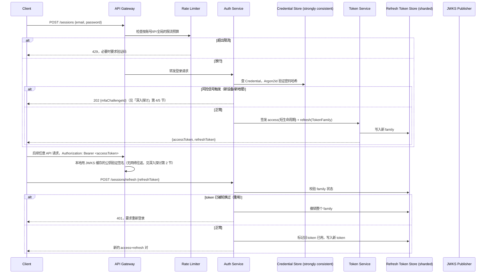

# 设计题解：身份认证服务（Authentication & Identity Service）

## 题目与范围

面试官通常这样开场："设计一个供公司内部所有产品线复用的身份认证服务：用户注册、登
录、保持会话，第三方应用能接入单点登录（SSO）。" 这道题和其他设计题最大的不同在于——
它的正确性标准不是"扛住多少 QPS"，而是**每一个设计选择同时是一个性能决策和一个安全
决策**，两者经常互相拉扯：密码哈希越慢越安全，但也越贵；令牌活得越久用户体验越好，但
泄露后的暴露窗口也越大。候选人在这道题上最常见的失败，是只谈安全机制(哈希算法、
MFA)却给不出任何数字，或者只谈吞吐却完全不提"如果这个令牌被偷了会怎样"。

值得当场问清楚的澄清问题，以及它们各自改变的设计决策：

- **这个服务是只服务自家产品，还是要对外提供 OIDC/SAML 联邦身份给第三方？** 决定「深
  入探讨」第 6 节要不要做——纯内部场景不需要完整的授权服务器实现，只需要一个简化的会
  话/令牌系统。本题按"既服务自家全部产品线、又对外提供联邦登录"设计，因为这是这道题
  真正的难点所在。
- **要不要支持无密码登录(passkey)作为首选而不是备选？** 决定「深入探讨」第 5 节的
  优先级——本题假设密码仍是多数账号的主路径，passkey 是并行提供的更强选项，而不是唯
  一路径，因为要求 5 亿账号全部迁移到 passkey 在可预见的时间内不现实。
- **令牌验证是不是要在没有网络往返的前提下完成?** 决定「深入探讨」第 2 节 session
  vs JWT 的取舍——本题假设是，因为这是这道题在超大规模下真正独特的地方。
- **恢复账号要不要考虑账号被盗后攻击者也想通过恢复流程夺回控制权这类对抗场景?** 决
  定「深入探讨」第 8 节——本题假设要，因为这是这道题里最容易被面试候选人忽略的一环。
- **要不要设计权限系统本身(RBAC/ABAC)?** 不设计——这属于 `security.authz` 的范围，
  本题只设计"你是谁"(认证)，不设计"你能做什么"(授权)，两者是有意分开的两层。

**范围内**：注册、登录、密码存储、会话与令牌、刷新与撤销、登录防滥用、MFA 与
passkey、SSO/联邦、令牌验证热路径与密钥轮换、多区域凭证一致性、账号恢复。**范围
外**：细粒度权限模型(RBAC/ABAC，属于 [[security.authz|Authorization & API Security]])、
支付/计费、用户画像与风控评分系统内部实现(登录防滥用只设计到"识别并限速"，不设计完
整的风控模型)。

## 需求

**功能需求(驱动设计的 5 条)**

1. 用户可以用邮箱/用户名 + 密码注册和登录，也可以用 passkey(WebAuthn)登录。
2. 登录成功后，用户在后续请求里保持"已登录"状态，不需要每次请求都重新输入密码；用户
   可以主动登出当前设备或登出全部设备。
3. 系统支持多因素认证(MFA)，并能在风险信号出现时(新设备、新地理位置)要求二次验证。
4. 第三方应用能通过标准协议(OIDC/SAML)接入，让用户用同一个账号登录多个产品/合作方
   应用。
5. 用户能在丢失设备/忘记密码的情况下找回账号，同时这条路径本身不能成为比正常登录更
   弱的攻击入口。

**非功能需求(数字化)**

- **令牌验证延迟**：这是全平台每一个 API 请求都要经过的路径，目标 P99 < 10ms，且**不
  依赖跨服务网络往返**——这个约束直接决定了「深入探讨」第 2 节的选择。
- **登录延迟**：`POST /sessions` 目标 P99 < 400ms(包含密码哈希验证这一刻意昂贵的计
  算，见「深入探讨」第 1 节)。
- **可用性分层**：令牌验证热路径 99.99%(全平台依赖它)；登录/注册写路径 99.95%(短
  暂失败可以安全重试)。
- **一致性**：账号的核心凭证记录(密码哈希、锁定状态)是**强一致**的——一次密码修改
  必须在全球任何区域立刻生效，不能有"旧密码在另一个区域还能登录"的窗口；refresh
  token 的轮换状态**在单个 token family 内部强一致**(重用检测的前提)，但不同
  family 之间互不影响；登录尝试计数/限流状态允许**最终一致**，因为限流本身就是概率
  性防御，不是安全边界本身。
- **持久性**：账号凭证记录和 MFA/passkey 注册记录绝不能丢失；refresh token 记录丢失
  的代价是用户被迫重新登录，是可接受的降级，不是数据丢失事故。

## 容量估算

**基础假设**：注册账号 5 亿；日活(DAU)占注册账号 30%。

```
DAU = 5×10^8 × 0.30 = 1.5×10^8
```

**登录与密码哈希的算术，这是第一个决定架构的数字**：假设 DAU 中 5% 当天需要一次真正
的密码登录(其余大多数请求靠已持有的有效会话/refresh token 免密续期)。

```
logins/day = 1.5×10^8 × 0.05 = 7,500,000
login QPS(avg) = 7,500,000 / 86,400 ≈ 86.8
login QPS(peak, ×5 日间峰值) ≈ 434.0
```

密码哈希按 OWASP 基线调到 **Argon2id，约 150ms/次验证**(见「来源与延伸」，OWASP 建
议把单次验证调到约 100–250ms 区间，取中段):

```
verifies/sec/core = 1000ms / 150ms ≈ 6.67
cores(仅覆盖峰值,无冗余) = 434.0 / 6.67 ≈ 65.1
cores(2 倍冗余,应对突发和故障转移) ≈ 130.2
```

**这个数字直接决定了密码验证必须是一个独立、可水平扩展、按核心数显式容量规划的服务
——大约 130 核就能覆盖日常峰值，这个规模完全可控，但如果哈希参数不经计算直接调高"更
安全"的数值，核心需求会线性上升，必须先算再调参数。**

**令牌验证热路径的 QPS，这是第二个、也是规模最大的决定架构的数字**：假设日活用户平均
每天触发 40 次用户可见的 API 调用，而每次用户可见调用在后端平均再扇出到 5 个需要独立
校验调用者身份的内部服务(网关之后还有多层微服务各自校验):

```
verifications/day = 1.5×10^8 × 40 × 5 = 3×10^10
verify QPS(avg) = 3×10^10 / 86,400 ≈ 347,222
verify QPS(peak, ×5) ≈ 1,736,111
```

**这是全篇最关键的数字**：如果每次校验都要查一次中心化的会话存储，以一个 Redis 一类
存储单分片能持续承受的量级(数万 QPS，这个假设和本题库其它设计一致)计算:

```
shards_needed(peak) = 1,736,111 / 50,000 ≈ 34.7
```

峰值下单纯为了令牌校验就需要三十多个独立分片，而且这些分片除了校验请求外还要承担该
分片本来就有的其它读写——这个数字是「深入探讨」第 2 节选择无状态令牌(JWT，本地校
验、零网络往返)而不是纯服务端会话的直接依据。

**refresh token 轮换写入的 QPS，这是第三个决定架构的数字**：假设每个日活用户平均每
天触发 4 次 refresh(应用生命周期内的后台续期，不与具体 TTL 强绑定):

```
refresh/day = 1.5×10^8 × 4 = 6×10^8
refresh QPS(avg) = 6×10^8 / 86,400 ≈ 6,944
refresh QPS(peak, ×5) ≈ 34,722
```

这个峰值(≈34,722/秒)**远超**一个托管关系型主库在简单条件更新下的合理吞吐假设(约
2,000–3,000 行/秒，这个假设和 [[solution-flash-sale]] 一文一致)。结论是：**refresh
token 的轮换写入不能和账号核心凭证记录共用同一个关系型主库**——后者的写量小到可以
忽略(见下)，前者必须是一个按用户 id 分片的、专门为高频轮换写入优化的存储，这是「深
入探讨」第 7 节的核心论证。

**账号核心凭证记录的写量，作为对照**：注册 + 密码修改 + 锁定事件，假设合计约为 DAU 的
0.2%:

```
credential writes/day = 1.5×10^8 × 0.002 = 300,000
credential write QPS(avg) ≈ 3.47
```

这个数字比 refresh 轮换低了四个数量级——**核心凭证记录可以承受强一致、跨区域同步复
制的代价，因为它的写吞吐本来就很低；而 refresh token 存储必须为高吞吐设计，但可以承
受较弱的一致性(单 family 内部一致即可)**。这一低一高的对照，是「深入探讨」第 7 节
"两套存储、两种一致性"这个架构决策的数字依据。

**结论**：这道题的容量估算不是关于字节数，而是关于**三种截然不同的 QPS 量级**——密
码哈希验证(百级，受限于 CPU 成本)、令牌验证(十万到百万级，决定了必须无状态)、
refresh 轮换写入(万级，决定了凭证存储必须拆成两套)——每一级都对应一个独立的设计
决策。

## 核心实体与 API

**实体**

- **Account**：`id, email, status(active/locked/pending_verification), createdAt`——
  核心身份记录，写量极低(见容量估算)，可以承受强一致跨区域复制。
- **Credential**：`accountId, passwordHash, hashAlgo, hashParams, updatedAt`——和
  Account 分表，原因是密码哈希参数升级(重新哈希)是独立于账号本身的生命周期事件，分
  开存避免每次哈希参数升级触碰账号主记录。
- **WebAuthnCredential**：`credentialId, accountId, publicKey, signCounter, transports,
  createdAt`——一个账号可注册多个，凭证本身(不是账号)是注册和撤销的单位。
- **MfaFactor**：`accountId, type(totp/webauthn/sms-fallback), enrolledAt`。
- **RefreshTokenFamily**：`familyId, accountId, currentTokenId, deviceInfo, createdAt,
  revokedAt`——独立分片存储，见「深入探讨」第 7 节。
- **SigningKey**：`kid, publicKey, privateKeyRef(KMS), notBefore, notAfter`——JWKS 发
  布的公钥集合，见「深入探讨」第 7 节。
- **FederatedIdentity**：`accountId, provider, providerSubject, linkedAt`——用于"用
  Google 登录"这类外部身份和本地账号的绑定。

**API**

```
POST   /accounts                      {email, password, clientRequestId}
                                       幂等注册,触发邮箱验证
POST   /sessions                      {email, password}
                                       → {accessToken, refreshToken} 或 {mfaChallengeId}
POST   /sessions/mfa                  {mfaChallengeId, code}  完成二次验证后签发令牌
POST   /sessions/refresh              {refreshToken} → 新的 access+refresh 对(轮换)
DELETE /sessions/{familyId}           登出单一设备/会话
DELETE /sessions                      登出全部设备(撤销该账号全部 token family)
POST   /webauthn/registration/options → {challenge, rpId, ...}
POST   /webauthn/registration         完成 passkey 注册
POST   /webauthn/authentication/options
POST   /webauthn/authentication       完成 passkey 登录
GET    /.well-known/jwks.json         当前有效的公钥集合(供任何资源服务器验证)
POST   /account/recovery/start        {email} 发起恢复(见「深入探讨」第 8 节)
POST   /account/recovery/verify       {recoveryToken, newCredential}
GET    /oauth/authorize, POST /oauth/token   本服务作为 OIDC Provider 时的标准端点
```

**故意不做的**：不支持客户端指定 access token 的过期时间(TTL 由服务端策略统一控
制)；不在 access token 里携带任何比"我是谁、我被允许做的粗粒度范围"更多的业务数据
(细粒度权限属于 [[security.authz|Authorization & API Security]]，不属于这道题)；不
提供"查询某用户当前密码哈希"这类接口，哈希只在验证时在服务内部比对；不支持一次
API 调用同时修改密码和恢复邮箱(高风险操作必须分开、各自触发通知，见常见错误)。

## 高层设计



**登录路径**：Rate Limiter 挡在 Auth Service 之前(复用 [[solution-rate-limiter]] 的
设计，见「深入探讨」第 4 节),Credential Store 是**独立部署的强一致关系型/分布式
SQL 存储**，因为写量极低(容量估算给出约 3.47 QPS)但每一次密码修改都要求全局立刻可
见——这正是这类存储的强项，牺牲写吞吐换强一致完全划算。

**令牌路径**：Token Service 签发的 access token 是**无状态 JWT**，资源服务器/网关用
本地缓存的 JWKS 公钥校验签名，不发起任何网络调用——这是应对容量估算里那个 34.7 分片
的数字唯一现实的答案。refresh token 走**独立的、按 accountId 分片的高吞吐存储**
(NoSQL 宽列一类)，因为它的写量(轮换)比 access token 验证低，但比 Credential Store
的写量高出四个数量级，需要专门为写吞吐设计的技术选型，而不是和低写量的 Credential
Store 共用一套存储。

**联邦路径**：本服务同时是 OIDC Provider(对第三方应用发放身份)和(可选)OIDC
Consumer(允许用户用外部身份提供商登录)，两个方向共用同一套令牌签发机制，但走不同的
入口端点，见「深入探讨」第 6 节。

## 深入探讨

### 密码哈希的成本算术：每核心每秒能验证多少次登录

**问题**：密码哈希是这道题里少数"故意做慢"的计算——但慢多少、需要多少计算资源去覆
盖峰值，候选人经常给不出数字，只会说"用 bcrypt/Argon2 就行"。

**方案一：追求"越慢越安全"，不做吞吐核算**。理论安全性看起来更高，但如果调到比如
1 秒/次验证而不核算峰值登录 QPS 需要多少核心，大促或撞库攻击期间验证队列会迅速堆
积，反而造成登录服务整体不可用——安全性和可用性在没有算清楚吞吐之前互相冲突，而不是
互相独立。

**方案二：为了性能选一个快哈希(比如裸 SHA-256)**。吞吐问题彻底消失，但密码哈希的
唯一目的就是让暴力破解变慢——快哈希意味着数据库一旦泄露，攻击者能以 GPU/ASIC 级别的
速度(每秒数十亿次)离线破解，这不是吞吐和安全的权衡，是彻底放弃了这层防御。

**方案三(本设计采用)：按 OWASP 基线选 Argon2id，调参数到量化的目标区间(约
100–250ms/次验证)，再用峰值登录 QPS 反推需要多少核心**。如「容量估算」所示，调到约
150ms 时，峰值 434 QPS 大约需要 130 核(含 2 倍冗余)——这是一个完全可以按容量规划
处理的独立服务，和"要不要上更安全的哈希"这个问题本身无关；唯一的纪律是**任何一次调
高哈希参数，都要重新算一遍这个核心数**，而不是凭感觉调。

### 会话 vs JWT 在这个规模下：验证热路径与撤销代价

**问题**：[[security.authn.tokens|Sessions & Tokens]] 这张概念卡片已经讲清楚了会话
和 JWT 各自的取舍(即时撤销 vs 无查找验证)，这道题独特的地方在于：在 3×10^10 次/天、
峰值 1,736,111 QPS 的验证量级下，这个取舍不再是"看偏好"，而是**只有一个选项在数字上
可行**。

**方案一：纯服务端会话，每次请求查中心化会话存储**。撤销即时、实现简单，但如「容量
估算」算出的，峰值下需要约 35 个独立 Redis 分片**只为了**验证这一件事，而且这些分片
还要承担各自服务原本的其它职责——这个开销和信息流问题里的"读时全量聚合"是同一类错
误：把一个应该便宜的高频操作，做成了正比于总请求量的存储查询。

**方案二：纯 JWT，长生命周期，从不查任何存储**。验证是真正的 O(1) 本地计算，彻底解决
吞吐问题，但**撤销代价变成一句空话**——一旦签发，拿到令牌的人在过期前始终有效，员工
离职、账号被盗这类必须"立刻失效"的场景没有任何手段。

**方案三(本设计采用)：短生命周期(5–15 分钟)access token 用 JWT，本地验证；配合
refresh token 走服务端状态(校验、轮换、撤销)**。日常的验证热路径(网关、每一跳内部
服务)完全不碰任何存储，吞吐只受限于 CPU 上的签名验证，和峰值 QPS 无关；真正需要撤销
时(账号被盗、密码修改),**吊销 refresh token family**——access token 本身会在最多
15 分钟内自然过期，这把"立刻撤销"换成了"最多 15 分钟内撤销"，这个延迟对绝大多数场景
是可接受的，极高风险场景(比如检测到密码泄露)额外用一条"最小签发时间"策略强制该账
号此后签发的 access token 必须在某时间点之后签发才有效，把撤销延迟进一步压缩。

### Refresh token 轮换与重用检测

**问题**：容量估算给出的 refresh 峰值(≈34,722/秒)本身就要求这个存储单独设计，但更
重要的是轮换机制本身的正确性——它是唯一能让"令牌被偷"这件事变得**可检测**而不是永
远沉默的机制。

**机制(本设计采用，与
[[security-refresh-rotation-reuse|Refresh token 轮换与重用检测]] 概念卡片一致)**：
每次 `POST /sessions/refresh` 都让旧 refresh token 失效并签发新的——单次使用。如果
攻击者窃取了一个 refresh token 并先于合法客户端使用它，合法客户端下次尝试续期时会发
现自己持有的 token 已经"过时"(已被使用)，这本身就是失窃的信号，反之亦然。服务器一
旦检测到已轮换过的 token 被重复呈现，**撤销整条 token family**(该会话的全部谱系),
强制双方(合法用户和攻击者)都重新走一次完整登录——这把"检测到失窃"和"止损"合并成
了同一个动作，不需要额外的人工介入。这个机制之所以对浏览器/SPA 场景是强制的，是因为
那里长生命周期令牌没有安全的存储位置(见
[[security-oauth-browser-token-storage|OAuth 浏览器端令牌存储]])，短生命周期 +
轮换是唯一现实的缓解手段。

### 登录作为攻防面：填充攻击、按维度限流与锁定 vs 二次验证升级

**问题**：正常登录 QPS 只有个位数到几百(容量估算给出峰值 434)，但登录端点本身是撞
库(credential stuffing)、暴力破解、账号枚举的首要攻击目标——防护这个端点的设计，考
虑的不是"平时的吞吐"，而是"攻击流量的规模和特征"。粗略按"平时峰值的 50 倍"估算一场
中等规模撞库攻击的流量:

```
attack QPS ≈ 86.8(平时均值) × 50 ≈ 4,340
```

这个规模的攻击流量如果不做任何区分地和正常登录流量混在一起处理，会把密码哈希这层刻
意做慢的计算(130 核只按 434 QPS 峰值规划)直接打穿。

**方案一：按账号锁定(N 次失败后锁死该账号)**。对**暴力破解**(同一账号被反复猜测)
有效，但对**撞库**(同一账号只试一两次、但覆盖百万账号)完全无效——攻击流量从不触发
单账号的失败计数；更糟的是，如果攻击者明知账号锁定策略，反而可以把它当成对正常用户
的拒绝服务武器(用受害者的用户名故意触发几次失败登录，导致真实用户被锁在自己账号外)。

**方案二：只按来源 IP 限流**。能挡住来自少数 IP 的暴力破解，但撞库攻击通常来自大规
模住宅代理池，单 IP 请求量很低，不会触发限流，而合租办公网络的正常用户共享一个出口
IP，反而容易被误伤。

**方案三(本设计采用，与 [[solution-rate-limiter]] 组合)：多维度、舰队级信号，而不
是单一账号或单一 IP**。限流同时按账号、按 IP、按 ASN/设备指纹、以及**全局登录失败
率**这个舰队级信号联合判断(细节见
[[security-credential-stuffing|撞库 vs 暴力破解]]),`POST /sessions` 端点本身接入
[[solution-rate-limiter]] 的分层配额(见该题深入探讨的"多层配额"设计)，超限时**优先
要求二次验证(step-up，新设备/新地理触发 MFA)而不是直接锁定账号**——锁定是对用户的
拒绝服务，step-up 是把决定权交还给账号真正的所有者。

### MFA 与 passkey/WebAuthn:抗钓鱼的仪式设计

**问题**：短信/TOTP 一类的二次验证能防住"只知道密码"的攻击者，但对**实时中继钓鱼**
(fake site 把用户输入的验证码原样转发给真实网站)完全无效，因为验证码本身是一个用户
可以被诱导说出口的秘密。

本设计的选择遵循
[[security-passkeys-phishing|passkey 为何抗钓鱼]]和
[[security-webauthn-ceremony|WebAuthn 仪式的系统级细节]]两张概念卡片的结论，不重复
其机制细节，这里补充这道题特有的落地决策:**注册时鼓励(而非强制)passkey，同时保留
TOTP 作为过渡期的备选二次验证**——5 亿账号里相当一部分设备/场景短期内无法完成
passkey 迁移，一刀切要求 passkey 会把这部分用户挡在门外；账号维度存储 RP ID 时选用
可注册域后缀(比如 `example.com` 而不是 `app.example.com`)，避免未来域名调整时让已
注册的 passkey 集体失效——这是这道题规模下(几亿账号)一旦选错就几乎无法挽回的决
策，必须在设计阶段就定下来。

### SSO 与联邦:OIDC vs SAML,"用 Google 登录"为什么不能只用裸 OAuth

**问题**：第三方应用接入既要支持消费级"用 Google/本平台账号登录"这类场景，也要支持
企业客户常见的"用公司的 Okta/AD FS 单点登录"——这两类场景的主流协议不同，混为一谈会
导致给企业客户的方案缺了必要的元数据交换，给消费级场景的方案又过度复杂。

**方案一：统一只做 SAML**。企业身份提供商(IdP)生态支持好，断言(assertion)里能携带
丰富的企业属性(部门、职级)，但协议基于 XML、流程更重，消费级 OAuth 生态(几乎所有
面向个人用户的身份提供商)不原生支持 SAML，把它作为唯一协议会把大量消费级场景排除
在外。

**方案二：统一只做裸 OAuth2**。轻量、消费级生态原生支持，但正如
[[security-oauth-vs-oidc|OAuth vs OIDC]]卡片指出的:OAuth2 本身只回答"这个应用能不
能访问某资源"(委托)，不回答"这个用户是谁"——用一个 access token 当身份证明是可以
被跨应用重放冒充的安全 bug，这不是协议选型问题，是协议被用错了地方。

**方案三(本设计采用)：消费级/现代应用走 OIDC(OAuth2 + ID Token 身份层)，企业客户
走 SAML，两者在本服务内部归一化成同一份内部身份声明**。`FederatedIdentity` 实体统一
存储外部身份到本地账号的绑定，不区分协议来源；OIDC 端遵循
[[security-oauth-code-pkce|授权码 + PKCE]]流程签发/消费 ID Token，校验其 `aud` 和
`nonce`(见 OpenID Connect Core 规范，「来源与延伸」);SAML 端校验断言签名和
`Audience`/`Recipient` 限制，语义上与 OIDC 的 `aud` 校验对等，只是载体不同。企业客户
的 SSO 接入本质上比消费级 OIDC 多一层元数据交换(IdP 的证书、断言消费端点)，这是
SAML 在这道题里唯一但不可替代的价值。

### 令牌验证热路径与密钥轮换(JWKS)

**问题**：既然「深入探讨」第 2 节已经把验证路径做成了本地校验，新的问题变成：签名密
钥怎么在不停机、不让任何一个已签发的有效 access token 突然验证失败的前提下轮换。

**方案一：单一长期密钥，从不轮换**。实现最简单，但一旦私钥泄露，在其被替换之前签发
的**以及能被伪造**的全部令牌都不可信，而单一密钥意味着"替换"本身就是一次全平台的信
任重建，没有过渡期。

**方案二：轮换时直接切换，旧密钥立刻失效**。缩短了单一密钥泄露的影响窗口，但**峰值
1,736,111 QPS 规模下，网关和内部服务各自缓存的 JWKS 副本不可能在同一毫秒完成切换**
——切换瞬间，用旧密钥签发、尚未过期的 access token 会被那些已经切到新密钥的验证方拒
绝，制造大量误报的 401。

**方案三(本设计采用，与
[[security-secrets-rotation-live|活跃密钥轮换]]概念卡片一致)：重叠窗口轮换**。新签
名密钥生成后先只发布公钥进 JWKS(还不用于签名)，给所有验证方留出缓存刷新的时间；确
认新公钥已充分分发后，签发端切到用新私钥签名，但 JWKS 里**同时保留旧公钥**，直到用旧
密钥签发的全部 access token(最长 15 分钟，由 TTL 决定)自然过期。每个令牌的 header
携带 `kid` 标识用的是哪把密钥，验证方按 `kid` 查对应公钥，而不是假设只有一把。私钥本
身托管在 KMS/HSM 里，签名服务从不直接持有裸私钥文件。

### 多区域强一致凭证库与 refresh 存储的写路径

**问题**：容量估算给出两个数量级相差四个量级的写负载——核心凭证记录(≈3.47 QPS)和
refresh token 轮换(峰值≈34,722 QPS)——这两者如果用同一套存储和同一种一致性策略，
要么让凭证记录的强一致代价白白施加在不需要它的 refresh 轮换上，要么让 refresh 轮换
的高吞吐需求逼迫凭证记录放弃它真正需要的强一致。

**方案一：两者都用同一个跨区域强一致存储**([[distributed.consensus|Consensus]] 一
类，基于共识协议的分布式 SQL)。安全性最高，但共识协议的写延迟和吞吐上限，和 34,722
QPS 的 refresh 峰值量级不匹配——为了几十 QPS 的凭证写入选的存储技术，不该用来扛几万
QPS 的轮换写入。

**方案二：两者都用最终一致、无协调的多主复制**。吞吐问题解决了，但核心凭证记录(尤
其是"账号被锁定"这个状态)如果允许跨区域最终一致，会出现"账号在一个区域已被锁定，另
一个区域的登录请求读到的还是旧状态、允许通过"的安全窗口——对锁定/密码修改这类安全
关键写入，这个窗口本身就是漏洞。

**方案三(本设计采用)：按数据分类分别定级**。Credential/Account 走**单主(single-
leader)跨区域复制**(见 [[distributed.replication.leader|Leader-Based]])，所有写
入(密码修改、锁定)必须打到主区域并同步确认后才算成功，其它区域读到的是同步或近同
步的副本，读多写少且写量极低(≈3.47 QPS)完全负担得起这个代价；RefreshTokenFamily
走**按 accountId 分片的区域内存储**，不强求跨区域强一致——同一用户的 refresh
token 生命周期通常绑定在同一区域完成(用户登录和续期大概率发生在同一地理位置附
近)，真正跨区域漂移的场景走"缓存未命中→回落到就近区域的权威分片"这条路径，而不
是为全部用户的 refresh 记录支付全球强一致的代价。这正是容量估算那组四个数量级差
异的数字，直接推出的架构分层。

### 账号恢复：最弱的一环

**问题**：即使账号的主登录路径做到了 passkey + 强哈希 + 多维度限流，如果恢复流程是
一封邮件魔法链接或一条短信验证码，攻击者根本不需要攻破主路径——他们只需要跑"我丢了
设备"这条流程，而这条流程往往比登录本身审查更松。

本设计的具体机制遵循
[[security-account-recovery|账号恢复:最弱的一环]]卡片给出的原则(多因素注册、恢复
即重新认证而非"证明拥有收件箱"、恢复过程刻意放慢并通知全部注册渠道、恢复成功后撤
销一切)，不重复其细节，这里补充这道题在 5 亿账号规模下特有的落地约束:**恢复流程
和正常登录共用同一套限流基础设施**(见「深入探讨」第 4 节)——恢复端点同样按账号/
IP/全局维度限速，因为"批量尝试恢复大量账号"和"批量尝试登录大量账号"在攻击特征上是
同一类撞库问题，不能因为它叫"恢复"就绕开限流单独设计一套防护；客服/人工介入的恢复
路径(用于自动化流程覆盖不到的边缘情况)本身要求**可验证的带外身份证明**，并且这条
人工路径的操作要写入和自动化路径同等级别的审计日志——帮助台冒充是账号接管的常见入口
这一点在 [[security-account-recovery|账号恢复:最弱的一环]]卡片里已有说明，这里不再
重复展开，只强调它同样适用于这道题的规模：人工路径覆盖的账号越多，越不能自成一套弱于
自动化路径的例外。

## 瓶颈、故障与演进

**热点与倾斜**：读侧热点是令牌验证本身——但因为访问是无状态本地验证，不存在传统意义
的"热 key"；真正的热点在**签名密钥分发**，一次密钥轮换如果没有走「深入探讨」第 7 节
的重叠窗口，会在全平台所有验证节点上同时触发 JWKS 重新拉取，造成短暂的雷群
(thundering herd)。写侧热点是 refresh token 存储里极少数异常活跃的账号(比如被脚
本重复刷新的自动化客户端)，需要对单账号的 refresh 频率单独限速，而不只是限制登录本
身。

**故障域**：

- **JWKS 分发不可用**：验证方继续使用本地缓存的公钥(带足够长的软 TTL)，直到密钥被
  强制轮换前都不受影响——这是设计上刻意换来的降级路径，呼应「深入探讨」第 7 节。
- **Credential Store(强一致主区域)不可用**：该区域的新登录/密码修改暂停，但**已持
  有有效 access token 的用户不受影响**(验证路径完全独立于凭证存储)；其它区域的读
  副本可以继续服务只读校验类操作，直到主区域恢复。
- **Refresh Token Store 某分片不可用**：该分片对应账号的 refresh 操作失败，用户被迫
  重新完整登录一次——是用户体验的降级，不是安全问题(access token 仍在其自身 TTL 内
  有效)。
- **Rate Limiter 不可用**：这是唯一一个"宁可更严格也不能失败开放"的组件——降级策略
  是失败关闭(fail closed，对登录类端点收紧到更保守的默认限额)，而不是放开限流，因
  为放开意味着撞库防护整体失效。

**10 倍演进**：注册账号从 5 亿到 50 亿，令牌验证峰值从约 173 万到约 1,736 万 QPS。单
一 JWKS 发布端点本身需要多区域只读副本(公钥数据天然适合大范围缓存，不需要强一致);
Refresh Token Store 的分片数需要相应增长，但因为是按 accountId 无状态分片，水平扩展
没有架构瓶颈——真正需要重新设计的是「深入探讨」第 4 节的舰队级限流信号，在这个规模
下"全局登录失败率"这类信号的统计窗口需要做近似(流式草图算法)，不能再对每次登录同
步计算精确统计。

**100 倍演进**：注册账号 500 亿(纯粹推演)。单一的 Credential Store 即使是单主复
制，主区域的绝对写入量(即便仍然很低)和跨区域同步延迟本身也会成为全局密码修改的延
迟下限，可能需要按账号 id 范围做多个独立的"主区域"分组，而不是全局单一主区域——这和
这道题在小规模下"强一致换低吞吐完全划算"的假设不再成立，一致性分级本身需要再分一
层。

## 面试官会追问什么

**中级(mid)**
- "为什么不直接把密码哈希后的值存进 access token 里，省得每次都查数据库?" access
  token 是要在每一次请求里被验证方读取的，任何写进去的内容都要假设可能被观察者看
  到；而且这道题的验证热路径本来就不需要碰密码——密码只在登录那一刻验证一次，之后的
  请求靠短生命周期令牌，不是靠反复验证密码。
- "刷新令牌可以设计成永不过期吗?" 不应该——永不过期意味着一次泄露的影响窗口是无限
  的；轮换 + 重用检测的价值恰恰建立在"每个 refresh token 只能用一次"这个假设上，永
  不过期会让重用检测这个机制失去意义。

**高级(senior)**
- "如果攻击者拿到了一个有效的 access token(比如通过 XSS)，你的架构能做什么?"
  能做的有限——这正是无状态令牌的代价，15 分钟内令牌本身有效；真正的缓解是发送方约
  束令牌(sender-constrained，如 DPoP/mTLS 绑定，见
  [[security-sender-constrained-tokens|发送方约束令牌]])，让偷到令牌本身不再等于
  能够使用它，这是给高价值 API 单独加的一层，不是全平台默认成本。
- "撞库攻击和暴力破解在防护设计上最大的不同是什么?" 暴力破解是同一账号被反复猜
  测，按账号限流有效；撞库是海量账号各自只被尝试一两次，防护必须依赖舰队级信号(全局
  失败率、跨账号的来源集中度)，按账号维度的任何策略对撞库都近乎无效，见深入探讨第
  4 节。

**参谋级(staff)**
- "5 亿账号规模下，如果要把全部现有密码用户强制迁移到更强的哈希参数，你会怎么做，而
  不引发一次性的核心资源峰值?" 不做批量重哈希——旧哈希值本身无法被离线还原出明文，
  只能等用户下次登录、验证成功的那一刻，顺带用新参数重新哈希并覆盖存储的值(lazy
  re-hash)，这样重哈希的负载天然分摊在真实登录流量上，不会制造一次独立的核心峰值。
- "多区域强一致的 Credential Store 在网络分区期间，你会选择哪个区域继续接受写入?"
  这是本题「深入探讨」第 7 节故意避开的问题——单主复制在主区域不可达时，通常的选择
  是拒绝写入而不是允许多个区域各自接受写入后再合并(那会退化成多主复制，而账号锁定
  这类安全关键状态经不起"合并冲突")，这是本设计为强一致性支付的可用性代价，需要向
  面试官明确说出这个权衡，而不是假装两者都能同时拿到。

## 常见错误

- 只讲密码哈希用什么算法，给不出"峰值登录 QPS 下需要多少核心"这个数字，把安全参数的
  选择和吞吐规划当成两件互不相关的事。
- 把 session 和 JWT 的取舍讲成纯粹的个人偏好，而不是从这道题给出的验证 QPS 规模反推
  出"哪个方案在数字上可行"。
- 用"按账号锁定"防撞库，没有意识到撞库攻击的流量特征(每账号一两次尝试、覆盖海量账
  号)让按账号的任何防护都失效，还可能把锁定策略变成攻击者手里的拒绝服务武器。
- 只设计了 OIDC，被追问"企业客户要用他们自己的 Okta/AD FS 呢"答不上来，没意识到消费
  级和企业级 SSO 的主流协议生态并不相同。
- 只讨论"怎么保护登录"，完全没考虑账号恢复路径——而恢复路径往往是攻击者实际选择的
  入口，不是登录本身。

## 五分钟讲法

This is an identity service for a few hundred million accounts, and the core tension is
that almost every decision is simultaneously a performance decision and a security
decision. Password hashing is deliberately slow — tuned to roughly 150 milliseconds per
verify — so I size it explicitly: at peak login volume that works out to around 130 CPU
cores, a number I'd recompute any time the work factor changes rather than just picking a
"more secure" parameter. The much bigger number in this design is token verification, not
login — with internal fan-out, that can reach into the millions of checks per second, and a
centralized session store at that volume would need dozens of independent shards just for
lookups, which is why the hot path uses short-lived, stateless JWTs verified locally against
a cached public key, with revocation handled by a separate refresh-token store instead.
Refresh tokens rotate on every use, and reuse of an already-rotated token revokes the entire
token family — that turns token theft from something silent into something detectable. The
login endpoint itself is treated as an abuse surface first: credential stuffing shows up as
low-volume attempts spread across millions of accounts, so account-level lockout barely
helps and the real defense is fleet-level signals — global failure rate, IP and ASN
clustering — combined with step-up MFA rather than lockout. Passkeys are offered as the
strongest option without forcing migration, since phishing resistance there comes from the
credential being scoped to an origin rather than being something a user can be tricked into
typing. Federation splits by client type — OIDC for consumer-facing login, SAML for
enterprise identity providers — normalized into one internal identity record. Signing keys
rotate through an overlap window in JWKS so no token verifies against a key that's already
gone, and the credential-of-record store stays strongly consistent across regions because
its write volume is four orders of magnitude lower than the refresh-token store, which is
sharded instead for throughput. And the weakest link is almost never the login path itself
— it's account recovery, which has to be exactly as hard to abuse as login, not an easier
side door.

## 来源与延伸

- [OWASP Password Storage Cheat Sheet](https://cheatsheetseries.owasp.org/cheatsheets/Password_Storage_Cheat_Sheet.html)：
  给出 Argon2id 的具体基线参数(最低 19 MiB 内存、迭代次数 2、并行度 1)以及 bcrypt/
  scrypt/PBKDF2 作为不同场景下的备选，并建议把工作因子调到落在一个具体的耗时区间内。
  本文「深入探讨」第 1 节直接采用这个基线，并补充了这篇文章没有给出的部分——把耗时
  参数和峰值登录 QPS 联立，算出需要多少 CPU 核心，而不是停留在"应该多慢"这个定性建
  议。
- [NIST SP 800-63B](https://pages.nist.gov/800-63-3/sp800-63b.html)：
  要求验证方把连续失败登录尝试限制在不超过 100 次，并给出指数级退避(30 秒到一小
  时)等补充手段；同时明确反对传统的密码复杂度强制规则，只在检测到凭证已泄露时才要
  求改密码。本文的登录防滥用设计(深入探讨第 4 节)比这份文档更进一步的地方在于:
  它把"单账号限流"本身论证为对撞库无效，需要舰队级信号作为主要防线，而不是把账号级
  失败次数上限当作唯一的防护手段。
- [RFC 9700 — OAuth 2.0 Security Best Current Practice](https://www.rfc-editor.org/rfc/rfc9700.html)：
  要求公共客户端(浏览器/移动端)的 refresh token 必须是发送方约束的或者使用轮换机
  制，并把 PKCE 的 `S256` 方法列为强制。本文「深入探讨」第 3 节采用的正是这份 RFC
  要求的轮换机制，并补充了轮换本身如何和 refresh token 独立存储的容量设计(深入探讨
  第 7 节)结合，这部分是 RFC 本身不涉及的架构层面问题。
- [WebAuthn Level 3 (W3C Recommendation)](https://www.w3.org/TR/webauthn-3/)：
  规定公钥凭证按 RP ID 严格限定作用域，且签名计数器机制在同步(synced)多设备凭证下
  的语义已经弱化。本文「深入探讨」第 5 节在此基础上补充了这道题规模特有的落地约
  束——RP ID 必须选可注册域后缀，因为几亿账号规模下一旦选错域名归属，事后无法批量迁
  移已注册的 passkey。
- [Auth0 — Refresh Token Rotation](https://auth0.com/docs/secure/tokens/refresh-tokens/refresh-token-rotation)：
  描述了刷新令牌轮换与重用检测的具体行为——重用触发整个 token family 的即时撤销，
  不存在宽限期。本文「深入探讨」第 3 节采用同样的机制，并补充了这篇文档未涉及的部
  分：为什么这个存储必须和账号核心凭证记录物理分离(见深入探讨第 7 节给出的四个数
  量级 QPS 差异)。
