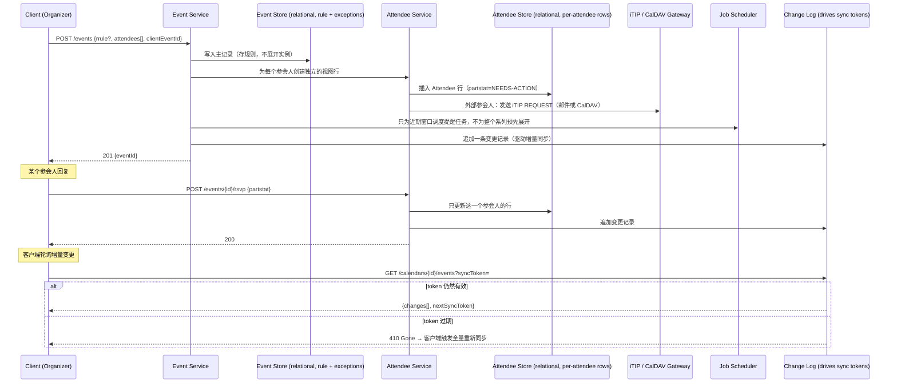

# 设计题解：日历与日程安排（Calendar & Scheduling，Google Calendar）

## 题目与范围

面试官通常这样开场："设计一个类似 Google Calendar 的日历应用：用户创建事件、邀请参会人、
设置循环规则和提醒，参会人能回复是否参加，系统能查询多人的空闲时间并建议会议时间。" 这句话
背后的真正难点不是"存事件"，而是**一个事件从来不是一份数据，而是组织者和每一个参会人各自
持有的一份视图**——组织者改了时间，所有参会人的视图都要跟着变；某个参会人改了自己的回复
状态，不该影响任何其他人的视图；而"这个事件"本身，如果是循环事件，甚至不是一行数据，而是
一条**生成规则**，具体某一天要不要发生、发生在几点，要在查询的那一刻才能算出来。

值得当场问清楚的澄清问题，以及它们各自改变的设计决策：

- **要不要支持循环事件的部分修改（这次改、这次及以后改、整个系列改）？** 决定 RRULE 展开
  和"从某一天起分裂出一个新系列"这套机制的复杂度——见「深入探讨」第 2 节。
- **要不要和不受本系统控制的其他日历产品（Outlook、Apple Calendar）互操作？** 决定要不要
  实现 iTIP/CalDAV 这类开放协议，而不是只用内部私有格式——见「深入探讨」第 5 节。
- **参会人的忙闲信息对组织者以外的人可见吗？** 决定 free/busy 查询只返回"忙/闲"两态还是
  连事件详情一起暴露——见「深入探讨」第 4 节。
- **提醒的时间精度要求多严格？** 决定提醒调度器的桶粒度，直接复用
  [[solution-job-scheduler|任务调度系统]]的机制而不是重新发明。
- **要不要支持多设备近实时同步，而不只是客户端定期拉取？** 决定客户端同步是纯拉取式的
  sync token 模式，还是要叠加推送——本题解以拉取式增量同步为主线，推送属于
  [[solution-notification-system|通知系统]]的范围。

**范围内**：事件与参会人的数据模型、循环事件的规则存储与展开、时区与夏令时处理、跨多个
参会人的 free/busy 查询与会议时间建议、邀请与 RSVP 状态及外部互操作、提醒作为调度任务、
并发编辑与客户端增量同步。**范围外**：视频会议链接的生成与信令（属于视频会议一类题目）、
邮件/推送本身的投递基础设施（属于 [[solution-notification-system|通知系统]]）、日历共享
权限模型的细粒度实现。

## 需求

**功能需求（驱动设计的 3–5 条）**

1. 用户创建事件，指定标题、开始/结束时间、时区、地点，可选邀请参会人。
2. 循环事件按规则周期性出现，用户能对"仅此次""此次及以后""整个系列"分别做编辑。
3. 参会人收到邀请后回复接受/拒绝/待定（RSVP），组织者能看到所有参会人的回复状态。
4. 用户能查询多个参会人在某个时间窗口内的忙闲状态，系统能给出共同空闲的候选会议时间。
5. 事件可以设置一个或多个提醒，系统在指定的提前量准确触发。

**非功能需求（数字化）**

- **日历视图加载延迟**：`GET /calendars/{id}/events` P99 < 300ms——用户每次打开日历都
  会触发，直接影响体验。
- **事件写延迟**：创建/编辑事件 P99 < 200ms。
- **提醒触发精度**：偏差 < 1 分钟——这是一条独立于其余路径一致性预算的强时间保证，走
  [[solution-job-scheduler|任务调度系统]]的调度精度,不能被"最终一致"稀释。
- **一致性分层**：事件的核心字段（时间、地点、RRULE）需要强一致——并发编辑不能产生"两个
  组织者的编辑请求都以为自己生效了、实际只有一个生效"这种静默丢失（见「深入探讨」第 6
  节）；但参会人自己的 RSVP 状态只需要对这个参会人自己强一致，完全不需要和其他参会人的
  视图在同一个事务里同步——这正是"事件与参会人是分离的每用户视图"这一核心数据模型带来
  的一致性语义（见「深入探讨」第 1 节）。
- **可用性分层**：读路径（视图查询、free/busy）目标 99.95%；写路径（创建/编辑/RSVP）
  目标 99.9%。
- **外部互操作性**：能和不受本系统控制、运行不同后端的日历产品交换邀请和回复,用开放标准
  （iCalendar/iTIP/CalDAV），不要求对方也接入本系统的私有协议。

## 容量估算

**基础假设（本设计的假设）**：注册账号 3 亿，日活用户（DAU）6,000 万，平均每个活跃用户
每天打开日历 App 10 次。

```
日历视图请求/天 = 6×10^7 × 10 = 6×10^8
视图 QPS(avg) = 6×10^8 / 86,400 ≈ 6,944
视图 QPS(peak, ×3 日间峰值系数) ≈ 20,833
```

**事件创建**：假设平均每个活跃用户每 2 天创建一个事件（0.5 个/天）。

```
事件创建/天 = 6×10^7 × 0.5 = 3×10^7
创建 QPS(avg) ≈ 347，(peak ×4，见下方说明) ≈ 1,389
```

**这里的峰值系数用 ×4 而不是前面读路径的 ×3**：日历是工作场景为主的应用，写操作（创建、
编辑会议、回复 RSVP）在工作日的上午 9 点到下午 6 点这个窗口内高度集中，比社交类应用"全天
24 小时分布在不同时区"的读流量更容易在本地工作时段内堆叠出更尖的峰值——这是本设计的假设，
不是某个真实产品的披露数据，但和读路径用统一的 ×3 会低估写路径的真实峰值,值得单独说明。

**参会人与 RSVP**：假设平均每个事件有 2.5 个参会人（含组织者自己），其中 60% 会做出
RSVP 回复（其余保持 `NEEDS-ACTION` 未响应状态）。

```
参会人行/天 = 3×10^7 × 2.5 = 7.5×10^7
RSVP 写入/天 = 7.5×10^7 × 0.6 = 4.5×10^7
RSVP QPS(avg) ≈ 521，(peak ×4) ≈ 2,083
```

**这是第一个决定架构的数字**：容量估算沿用本题解库的共享假设——单个关系型主库在简单
条件更新下的现实承受能力是每秒几千行（约 3,000/秒）。RSVP 峰值 2,083 相对这个上限的
安全边际只有：

```
安全边际 = 3,000 / 2,083 ≈ 1.44x
```

1.44 倍是一个很薄的边际——比约会应用匹配判定的 17.3 倍薄得多，接近秒杀设计里 1.8 倍的
危险区间。这直接论证了**参会人状态写入不能全部打向一个全局关系型主库**，必须按
`eventId`（或更细地按 `organizerId`）做分片，让每个分片各自独立地留有安全边际——这是
「深入探讨」第 1 节"事件与参会人分离存储"这个数据模型选择的容量依据，而不只是概念上
"看起来应该分开"。

**存储**：事件记录（含 RRULE 文本、标题引用、组织者 id 等，约 300 字节/行）：

```
事件/年 = 3×10^7 × 365 = 1.095×10^10
原始字节/年 = 1.095×10^10 × 300B = 3.285×10^12 B = 3.285 TB，三副本 ≈ 9.855 TB
```

参会人行（约 80 字节/行）：

```
参会人行/年 = 7.5×10^7 × 365 = 2.7375×10^10
字节/年 = 2.7375×10^10 × 80B = 2.19×10^12 B = 2.19 TB，三副本 ≈ 6.57 TB
```

**这是第二个决定架构的数字，也是循环事件"存规则不存实例"这个设计决策的直接依据**：
假设每天新创建的事件里 20% 是循环事件（`6×10^6/天`），一个典型的每日循环事件系列在被
取消或到达 UNTIL 之前平均持续约 2 年（730 次发生，这是本设计的假设）。如果按"实例化"
的反模式，把循环规则展开成一行一行具体的发生记录存下来，而不是只存一条规则：

```
按规则存储：每个系列 1 行 → 6×10^6 × 365 = 2.19×10^9 行/年
              字节/年 = 2.19×10^9 × 300B = 0.657 TB

按实例存储：每个系列约 730 行 → 2.19×10^9 × 730 ≈ 1.5987×10^12 行/年
              字节/年 ≈ 1.5987×10^12 × 300B = 479.61 TB

膨胀倍数 = 479.61 / 0.657 ≈ 730x
```

730 倍的存储膨胀，还只是"平均持续 2 年"这个保守假设下的数字——一个没有 `UNTIL`/`COUNT`
的"每天早会，永远重复"的循环事件，如果要实例化，理论上需要无限多行。这个数字是「深入
探讨」第 2 节"存规则、不存实例，查询窗口内按需展开"这一设计决策最直接的容量证据。

**Free/busy 与会议建议**：假设 2% 的事件创建会触发一次多人会议时间建议（scheduling
assistant），每次建议检查 10 个候选时间段、平均 8 个参会人：

```
建议请求/天 = 3×10^7 × 0.02 = 6×10^5
free/busy 子查询/天 = 6×10^5 × 10 × 8 = 4.8×10^7
子查询 QPS(avg) ≈ 556，(peak ×3) ≈ 1,667
```

**结论**：这道题里真正的瓶颈不是字节数（事件和参会人存储一年加起来不到 20 TB），而是
**两类结构性问题**——参会人状态写入的分片需求（1.44 倍的薄边际逼出按事件分片）和循环
事件"存规则还是存实例"的选择（730 倍的存储差异）。这两个数字，加上时区必须和本地时间
一起存储（见「深入探讨」第 3 节），共同决定了这道题和大多数"读多写少、瓶颈在 QPS"的题目
不同——**这里的瓶颈更多来自数据模型本身的形状，而不是原始吞吐**。

## 核心实体与 API

**实体**

- **Event（系列主记录）**：`id, organizerId, title, location, startLocal, endLocal, tzid,
  rrule(nullable), sequence, status`——`startLocal/endLocal` 存本地时间，`tzid` 存 IANA
  时区标识符（如 `America/New_York`），而不是预先换算好的 UTC（见「深入探讨」第 3 节）。
  `rrule` 为空表示这是单次事件。
- **EventException（例外/覆盖实例）**：`masterEventId, recurrenceId(originalStartTime),
  overriddenFields{...}, status(confirmed/cancelled)`——对应循环系列里被单独修改或取消的
  某一次发生，是 RFC 5545 里 `EXDATE`（纯排除）和 `RECURRENCE-ID`（排除并替换成一个
  修改过的实例）两种机制的落地。
- **Attendee（每用户视图行）**：`eventId, userId, role(organizer/attendee), partstat
  (NEEDS-ACTION/ACCEPTED/DECLINED/TENTATIVE), rsvpRequested`——这是"一个事件对每个参与
  者是一份独立视图"这一需求在数据模型上的直接体现，一行只属于一个用户,更新它不影响任何
  其他参会人的行。
- **FreeBusyIndex**（逻辑存在，不是独立可写实体）：每个用户的忙碌区间集合，按开始时间
  排序的区间索引，用于「深入探讨」第 4 节的批量忙闲查询，可以从 Event + Attendee 重建。
- **Reminder**：`eventId, userId, offsetBeforeStart, scheduledJobId`——具体的调度机制
  属于 [[solution-job-scheduler|任务调度系统]]，这里只存"提醒本身"的业务语义。
- **SyncCursor**（逻辑存在）：每个客户端设备持有的不透明同步游标，见「深入探讨」第 6 节。

**API**

```
POST   /events                {organizerId, title, startLocal, tzid,
                                endLocal, attendees[], rrule?,
                                clientEventId}
                               → {eventId}                       幂等 on clientEventId

PATCH  /events/{id}           {..., editScope:
                                "this" | "thisAndFollowing" | "all",
                                recurrenceId?}
                               根据 editScope 创建 EventException、
                               分裂出新系列，或直接改主记录（见
                               深入探讨第 2 节）

DELETE /events/{id}           ?scope=this|thisAndFollowing|all

POST   /events/{id}/rsvp      {userId, partstat}
                               → 200                             只更新该参会人自己
                                                                  的 Attendee 行，
                                                                  幂等

GET    /calendars/{userId}/events
                               ?start=&end=&syncToken=
                               → {items[], nextSyncToken}         窗口查询时展开循环
                                                                  事件；带 syncToken
                                                                  时走增量同步（见
                                                                  深入探讨第 6 节）

GET    /freebusy              ?attendees[]=&start=&end=
                               → {userId: busyIntervals[]}        只返回忙闲区间，不
                                                                  暴露事件详情

POST   /schedule-suggest      {attendees[], durationMinutes,
                                windowStart, windowEnd}
                               → {candidateSlots[]}
```

**故意不做的**：不支持不带时间窗口的"取某用户全部未来事件"查询（永远要求一个有界窗口,
循环事件的展开成本才是可控的，见「容量估算」）；参会人只能修改自己的 RSVP 状态,不能
修改事件的核心字段（时间、地点、标题）——这是组织者独占的权限,和 iTIP 里"组织者持有
master、参会人只能 REPLY"的模型一致；不支持跨多个参会人日历的单一全局事务式预订(每次
写入的一致性边界是"一个事件的核心字段"或"一个参会人自己的一行"，从不跨越到"同时锁住
所有参会人的日历")。

## 高层设计



**写路径**：`POST /events` 只写一条主记录（**关系型存储，Postgres 一类**），RRULE 以
文本形式整体存下，不做任何展开——这个选型直接来自容量估算里 730 倍的存储膨胀对比。事件
的核心字段需要按开始时间做范围查询（"这个用户下周有哪些事件"），这正是本题所依赖的
[[storage.relational.indexing|Indexing]]要解决的问题:一个按 `(userId, startLocal)`
或等价键建立的范围索引，让"取某个时间窗口内的事件"变成一次索引范围扫描,而不是全表扫描。
Attendee Service 为每个参会人写入一份独立的视图行,这些行按 `eventId` 分区（便于"谁参加
了这场会"这类查询）,同时需要一个按 `userId` 维度的次级索引或复制视图（便于"我的日历"
这类查询）——这和 news feed 题解里 Follow 表需要同时支持两个方向查询是同一类问题。

**外部互操作路径**：如果参会人列表里有不受本系统控制的外部邮箱（比如受邀者用的是另一家
日历产品），iTIP/CalDAV 网关把这次邀请封装成标准的 `METHOD:REQUEST` iCalendar 对象发出去
（见「深入探讨」第 5 节），对方的回复（`METHOD:REPLY`）被网关解析回来更新对应的 Attendee
行——这条路径完全绕开本系统内部的 RSVP API，因为外部系统根本不认识它。

**提醒路径**：Event Service 只为**近期窗口**内会发生的实例调度提醒任务，不会在事件创建
时就为一个"永远重复"的循环系列预先生成所有未来的提醒——这个"只调度近期窗口"的原则和
[[solution-job-scheduler|任务调度系统]]里按时间分桶、不提前物化远期任务的机制是同一个
思路的两次应用（一次用在"展开循环事件实例"，一次用在"调度提醒任务"）。

**同步路径**：客户端持有一个不透明的 `syncToken`，代表"上次同步时集合的状态"，每次轮询
带着这个 token 去问变更日志"从这个状态之后发生了什么"，只拿到增量变化，而不是每次都拉取
全部事件——见「深入探讨」第 6 节。

## 深入探讨

### 事件与参会人：一个事件的多份"每用户视图"

**问题**：一个事件被多个人看到，但每个人和这个事件的关系是不对称的——组织者能改时间、
地点，参会人只能改自己"去不去"这一个字段。如果把"参会人列表"直接存成事件记录内的一个
数组字段，每次某个参会人回复 RSVP，都要对整份事件记录做读-改-写，而这份记录同时也是
组织者在改时间地点时要写的同一份记录——两类完全不相关的写操作被迫竞争同一行的锁。

**方案一：事件记录内嵌参会人数组**（文档型存储，如 MongoDB 的内嵌数组）。读一个事件能
一次拿到所有信息，实现简单。但正如上面所说，参会人的 RSVP 更新和组织者的事件编辑会互相
阻塞在同一份文档上，而且"某个参会人的日历"这种查询（"我这周有哪些事）需要一个反向索引
才能从"事件包含参会人"反查到"参会人参与了哪些事件"，这个反向索引本身又是另一份需要
维护一致性的数据。

**方案二（本设计采用）：事件核心字段和参会人视图拆成两张表**，`Event` 只存组织者控制的
字段（时间、地点、RRULE），`Attendee` 每行代表"一个用户对一个事件的关系"，独立更新。
这样一个参会人回复 RSVP 只触碰他自己的那一行,不需要和事件核心字段的写入争用同一把锁;
"我的日历"这类查询直接按 `userId` 查 `Attendee` 表就是答案,不需要反向索引。这个拆分
也直接解释了「需求」一节里"事件核心字段强一致、参会人自己的 RSVP 只需要对自己强一致"这
条非功能需求——两种一致性要求分别落在两张表上,不是同一张表内被迫共享同一个一致性级别。

### 循环事件：存规则，不存实例

**问题**：一个"每周一 9 点站会，无限期重复"的事件，如果被展开成一行一行具体的发生记录
存下来，存储量随时间无限增长（「容量估算」算出即使按 2 年的保守平均寿命估计，实例化也
比存规则多花 730 倍存储）；但如果只存一条规则，"这个用户下周有哪些事件"这类窗口查询又
必须在读的那一刻现算——这要求展开算法本身足够快，而且要正确处理"这一次被单独改了"和
"这一次被取消了"这两种例外。

**方案一：完全实例化，把每一次发生都存成独立的行**。窗口查询变成普通的范围扫描,实现
简单,但存储代价如上所述随时间无界增长,而且"把整个系列的时间从周一改成周二"这种编辑,
需要批量改写可能已经存在的成千上万行——这个操作的代价和系列已经存在了多久成正比,而不是
和"改一条规则"这件事本身的复杂度成正比,明显不对称。

**方案二（本设计采用，对齐 RFC 5545 的 RRULE 模型）：只存一条循环规则，查询窗口内按需
展开，用两种机制表达例外**。规则本身（`FREQ`、`INTERVAL`、`COUNT` 或 `UNTIL`、`BYDAY`
等，见 RFC 5545）描述"正常情况下"这个系列在哪些时刻发生。两类偏离正常规则的情况分别
处理：

- **纯粹跳过某一次，不留痕迹**（比如这周的站会取消,不改期）：用 `EXDATE` 列出被排除的
  发生时间。
- **这一次被修改成了别的样子**（改了时间、改了地点，或者取消了但要保留"曾经存在过"的
  记录）：用一条带 `RECURRENCE-ID`（指向"如果没有这次修改,它本该发生的原始时间"）的
  独立例外记录,展开时用这条例外覆盖规则算出来的默认实例。

**窗口查询的展开成本是有界的，而且这个界只取决于查询窗口，不取决于系列存在了多久**：
查询"未来 90 天"这个窗口，对一个每天重复且没有 `UNTIL`/`COUNT` 的系列，无论这个系列已经
运行了 3 个月还是 30 年，展开出来的实例数量都不超过 90 个——这正是"存规则、按需展开"相对
"存实例"最根本的优势，也是「容量估算」里 730 倍存储差异背后的同一个数学事实换了一个
角度看。

**"这次及以后"的编辑**：用 `RECURRENCE-ID` 加 `RANGE=THISANDFUTURE` 参数（RFC 5545）
表达"从这一次开始，后面的都按新规则来"——实现上等价于把原系列在这个时间点截断（给原
`Event` 加一条有效的 `UNTIL`），再从这个时间点创建一个新的独立 `Event` 系列，带着新的
规则。这样"这次及以后"不需要一个特殊的"半系列"数据结构,而是复用了"截断旧系列 + 新建
系列"这两个已有的原语。

### 时区与夏令时：为什么只存 UTC 是错的

**问题**：一个循环事件"每周一上午 9 点站会"，如果创建时把 9 点换算成 UTC 存死，那么当
它所在时区未来因为政治决定改变了夏令时规则（这不是假设——IANA 时区数据库定期发布更新，
最新版本 2026d 于 2026 年 9 月 11 日发布，其中一项变更就是加拿大西北地区某地永久转为
UTC-06、不再切换夏令时,见「来源与延伸」），所有未来发生的这个事件,存下来的 UTC 时刻
就全错了——它们仍然会在"旧规则算出来的 UTC 时刻"触发，而不是用户真正期望的"每周一当地
时间上午 9 点"。

**方案一：创建事件时把开始时间换算成 UTC 存死**。对单次事件没问题（时区规则不会在几天
内改变），但对循环事件是错的——它把"当地时间 9 点"这个用户真正的意图,固化成了创建那一刻
恰好成立的一个 UTC 偏移量,而这个偏移量会随时区规则变化而过期。

**方案二（本设计采用，对齐 RFC 5545 的 `TZID` 参数）：存本地时间加时区标识符
（`DTSTART;TZID=America/New_York:...`），在需要展示或比较的那一刻,用当前的时区规则库
（IANA tz database）把本地时间换算成 UTC**。这样即使时区规则未来发生变化（就像
2026d 版本那样),已经创建好的"每周一上午 9 点"事件不需要被逐条修改——只要系统依赖的
时区规则库更新了,下一次换算自然就是对的,因为存的是"当地时间 9 点"这个语义本身,而不是
某一刻计算出来的 UTC 快照。单次事件也遵循同一套存储方式，保持模型统一,不需要为"循环"和
"非循环"两种事件分别设计时间字段。

### 多人 free/busy 查询与会议时间建议

**问题**：给 8 个参会人找一个共同空闲的会议时间,朴素的做法是对每个候选时间段、每个参会人
都单独查一次"这个人这段时间忙不忙"，「容量估算」算出这类请求峰值约 1,667 QPS，如果每次
查询都要对参会人的全部事件做一次全表扫描再判断有没有时间重叠,这个规模会直接拖垮读路径。

**方案一：对每个参会人的 `Attendee`/`Event` 表做实时范围扫描,判断查询窗口内有没有
重叠事件**。正确，但如深入探讨第 1 节强调的,这类查询的效率完全依赖有没有一个按开始时间
排序的索引——如果没有,退化成全表扫描,在参会人事件数量大的时候延迟不可控。

**方案二（本设计采用）：为每个用户维护一份按开始时间排序的忙碌区间范围索引（复用
[[storage.relational.indexing|Indexing]]这个概念本身）**，free/busy 查询变成对每个
参会人的索引做一次区间重叠查询（"这段时间内有没有任何一个忙碌区间与查询窗口相交"），
这是范围索引最擅长的查询形状。会议时间建议在此基础上多做一步：对若干候选时间段（比如
未来一周内每半小时一个候选槽）逐个跑这个区间重叠查询,过滤出所有参会人都空闲的槽位,
按某种偏好（比如尽量靠近当前时间、避开午休）排序返回。**只返回忙/闲两态,不返回具体事件
内容**——这是 CalDAV 的 free-busy-query 明确和 calendar-query（会返回完整事件数据）
区分开的两种权限,本设计沿用同一个边界：`GET /freebusy` 的响应只有区间,不暴露事件标题
或参会人列表,避免通过"查你忙不忙"这个动作间接泄露事件详情。

### 邀请与 RSVP 状态：外部互操作

**问题**：如果组织者用的是本系统,但某个参会人的邮箱属于一个完全不同的日历产品,系统不能
假设对方也在运行同一套 RSVP API——邀请必须以一种任何标准日历客户端都能理解的格式发出,
回复也必须能从任何标准客户端发回来的格式里解析出来。

**方案（本设计采用，对齐 RFC 5546 iTIP）**：组织者发出邀请时,系统生成一个带
`METHOD:REQUEST` 的 iCalendar 对象（包含事件的完整字段和参会人列表,每个参会人的
`ATTENDEE` 属性带 `PARTSTAT=NEEDS-ACTION` 和 `RSVP=TRUE`),通过邮件（作为 iMIP,即
iTIP over 邮件）或 CalDAV 发给外部参会人。外部参会人的客户端识别这个标准格式,展示"接受
/拒绝/待定"的交互,回复时生成一个带 `METHOD:REPLY` 的对象发回来,携带更新后的
`PARTSTAT`。系统收到 REPLY 后,只更新这一个参会人对应的 `Attendee` 行的 `partstat`
字段——不需要理解对方日历产品的内部实现,只需要认识这个标准协议格式。组织者修改已发出的
邀请（比如改时间）时,重新发送一个 `SEQUENCE` 递增的 `REQUEST`,携带更新后的字段;外部
客户端凭 `SEQUENCE` 判断这是对已有邀请的更新,而不是一个全新的邀请。这套协议的价值正在
于它把"和外部系统互操作"这件事,从"需要和每一家日历产品分别对接",降级成"只需要正确
实现一套开放标准"。

### 并发编辑与客户端增量同步

**问题一：并发编辑**——两个有编辑权限的人（比如两个组织者，或者组织者和一个有编辑权限的
参会人）几乎同时修改同一个事件的时间，如果后写入的一方直接覆盖前一个,前一个编辑者会
在不知情的情况下丢失自己的修改,且没有任何提示。

**方案（本设计采用，对齐 iTIP 的 `SEQUENCE` 机制）**：每次对事件核心字段的编辑都要求
客户端带上它编辑前读到的 `sequence`（或等价的乐观并发版本号/ETag）,写入时做一次
"当前存储的 sequence 是否等于客户端提交的 sequence"的条件更新,不相等就拒绝并让客户端
重新拉取最新版本、提示冲突。这是标准的乐观并发控制（optimistic concurrency control）,
选它而不是悲观锁的原因是：编辑事件核心字段的写入频率（「容量估算」里创建+编辑合计约
每秒几百到一千出头）远低到不需要为"两个人几乎同时编辑同一个事件"这种低概率场景预留
持有锁的开销,冲突时代价可控（客户端重试一次)，用不着悲观锁在写路径上带来的额外延迟。

**问题二：客户端增量同步**——一个用户在多个设备上打开同一份日历,每个设备需要知道"自从
我上次同步之后,发生了什么变化",而不是每次都把全部事件重新拉一遍。

**方案（本设计采用，参照 CalDAV 的 sync-collection REPORT 和 Google Calendar API 的
`syncToken` 机制，二者协议细节不同，分别说明）**：每个客户端持有一个不透明的同步游标,
代表"这份日历在上次同步时的状态"。服务端维护一份变更日志（「高层设计」里的 Change
Log),每次同步请求带着游标去问"这之后有什么变化",服务端返回增量变化（新增、修改、删除)
和一个新的游标。两种协议在"游标失效"时的行为不同,不能混为一谈：CalDAV 的
sync-collection（RFC 6578）在游标过期或服务端无法维护变更历史时,返回一个
`DAV:valid-sync-token` 前置条件失败,要求客户端用空游标重新发起一次全量同步；Google
Calendar API 的做法是让请求直接返回 HTTP `410 Gone`,同样要求客户端清空本地状态、做
全量同步。本设计的增量同步端点遵循后者的做法（`410 Gone` 触发全量重同步)——两种设计
的共同点是**都不假设变更日志能无限保留历史**,服务端可以出于存储或性能考虑清理旧的
变更记录,只要能明确告知客户端"你的游标太旧了、请全量重来",而不是静默返回不完整的
增量结果。

## 瓶颈、故障与演进

**热点与倾斜**：极少数事件会有远超平均值的参会人数量（比如全公司大会,几千个参会人),这
类事件的 `Attendee` 表写入会在事件创建的瞬间产生一次集中的批量写入尖峰——这类"大群体
事件"的参会人写入应该走批量、异步的 fan-out（类似 news feed 题解里对普通账号的推送
fan-out),而不是同步等待几千行全部写完才返回事件创建成功。

**故障域**：

- **Change Log（驱动同步）不可用**：新的写入仍然可以正常发生（Event/Attendee 写入和
  Change Log 写入解耦),只是客户端的增量同步暂时拿不到最新变化,过后可以补上,不影响
  正在使用中的日历视图（视图查询直接读 Event/Attendee,不依赖 Change Log)。
- **iTIP/CalDAV 网关不可用**：内部参会人之间的邀请和 RSVP 完全不受影响(走内部 API),
  只有涉及外部日历产品的邀请/回复暂时无法投递,需要队列重试。
- **Job Scheduler 不可用**：提醒可能被延迟或错过——这是「需求」里"提醒精度 < 1 分钟"
  这条强时间保证真正依赖的单点,需要参照
  [[solution-job-scheduler|任务调度系统]]自身的高可用设计,不在本题重复展开。
- **Event Store 某分片不可用**：该分片上的事件既不能查看也不能编辑——这是唯一真正的
  "写不可用"故障域,需要秒级自动故障转移。

**10 倍演进**：日活从 6,000 万到 6 亿。RSVP 写入峰值从 2,083 增长到 20,833,相对单个
关系型主库假设上限（3,000）的安全边际从 1.44 倍变成约 0.14 倍——单个主库此时已经完全
不够用,必须把 Attendee 表按 `eventId` 哈希分片到多个独立的关系型集群上,每个分片各自
独立承担一部分写入。Free/busy 子查询峰值从 1,667 增长到约 16,667,每用户的忙碌区间
索引同样需要按 `userId` 分片,保证一次 free/busy 查询只命中该用户自己的分片,不需要跨
分片聚合。

**100 倍演进**：日活 60 亿（纯粹推演）。全局的 Change Log 不能再是一份单一的、可以被
完整遍历的日志——需要按日历/用户维度做分区,每个客户端的 `syncToken` 天然只关心自己
那个分区的变化,这和 10 倍演进里 Attendee 表的分片方向是一致的。更重要的是,循环事件
展开的计算量会随查询量线性增长——在这个规模下,对高频访问的热门循环事件（比如订阅人数
很多的公共日历里的固定活动),值得为查询窗口内的展开结果加一层短 TTL 缓存,用"展开是
纯函数、给定规则和窗口结果确定"这个性质安全地缓存,而不是每次查询都重新算一遍 RRULE。

## 面试官会追问什么

**中级（mid）**
- "为什么参会人和事件要拆成两张表，而不是把参会人列表存在事件里？" 拆开是为了让参会人
  自己更新 RSVP 状态的写入,不和组织者编辑事件核心字段的写入互相阻塞——见「深入探讨」
  第 1 节。
- "循环事件的一次例外（比如这周请假,单独改了时间）怎么存？" 用带 `RECURRENCE-ID` 的
  独立例外记录覆盖规则算出来的默认实例,不需要改动规则本身——见「深入探讨」第 2 节。

**高级（senior）**
- "为什么不能只存 UTC 时间？" 因为时区的夏令时规则本身会随时间变化（IANA 时区数据库
  会更新),循环事件如果固化了创建时算出的 UTC 偏移量,规则变化后所有未来实例的触发时刻
  都会是错的——必须存本地时间加时区标识符,在使用的那一刻用最新规则换算,见「深入探讨」
  第 3 节。
- "free/busy 查询为什么不直接查事件表？" 因为它需要给多个参会人各自维护一份按时间排序
  的区间索引才能高效做"这段时间有没有重叠",而且只应该暴露忙闲两态,不能连事件详情一起
  返回——见「深入探讨」第 4 节。

**参谋级（staff）**
- "如果要支持一个用户同时属于多个组织的日历系统（比如员工在公司日历系统之外还有一个
  个人 Google Calendar,两者需要互相看到忙闲状态)，架构上要改什么？" 这本质上是把"外部
  互操作"（深入探讨第 5 节)从"偶尔邀请一个外部邮箱"升级成"两个系统之间持续同步 free/
  busy 数据"——需要在两个系统之间建立一条常驻的 CalDAV 订阅或定期轮询通道,并且要考虑
  当两边对同一个事件的理解产生分歧（比如一边显示忙、一边显示闲）时如何呈现给用户,而不是
  简单地假设某一边永远是权威来源。
- "循环事件规则本身能不能被恶意构造成展开代价极高（比如 `FREQ=SECONDLY` 且窗口很宽)？"
  可以,这是一个需要在写入时就做校验的问题——对 `FREQ` 和查询窗口的组合设置一个展开实例
  数的硬上限,拒绝会产生远超合理范围实例数的规则,而不是假设所有客户端提交的规则都是
  善意的。

## 常见错误

- 把参会人列表内嵌在事件记录里，被追问"1000 人的全公司会议,每个人回复 RSVP 会发生
  什么"答不上来,说明没有意识到这会让参会人更新和事件编辑争抢同一行的锁。
- 循环事件直接展开成一行一行存下来，被追问"存储会怎么增长"给不出量化答案——见「容量
  估算」里 730 倍的具体对比。
- 只存 UTC 时间，没有意识到夏令时规则本身会变化，循环事件的正确性会随时间劣化而不是
  一直正确。
- 把"邀请外部参会人"想象成需要和每一家日历产品单独对接,不知道有 iTIP/CalDAV 这类开放
  标准可以复用。
- 设计客户端同步时假设服务端能无限期保留完整的变更历史,没有为"游标太旧"这种情况设计
  全量重同步的兜底路径。

## 五分钟讲法

This is a calendar system where the core insight is that an event is never one row of
data — it's a rule the organizer controls plus a separate, independently-updatable view
for every attendee, and I split those into two tables so that an attendee replying to an
invitation never contends with the organizer editing the event's core fields. Recurring
events are the other defining problem: storing every future occurrence as its own row
would inflate storage by roughly seven hundred times over just storing the recurrence rule
and expanding it on demand for a bounded query window, so I store the rule plus targeted
exceptions for individually modified or cancelled occurrences, and the expansion cost for
any query is bounded by the query window, not by how long the series has existed. Time
zones follow the same 'store the rule, compute on demand' philosophy — a recurring meeting
is stored as local time plus a time zone identifier rather than a precomputed UTC instant,
because daylight-saving rules themselves change over time, and a fixed UTC offset baked in
at creation time would silently become wrong for every future occurrence once the rule
changes. Free/busy queries across many attendees run against a per-user range index of
busy intervals rather than scanning each attendee's full event history, and they
deliberately return only busy/free intervals, never event details, matching the
permission boundary CalDAV draws between a free-busy query and a full calendar query.
Invitations to attendees outside the system go out as standard iTIP objects over email or
CalDAV rather than assuming every recipient runs the same backend, and concurrent edits to
an event are resolved with an optimistic sequence check rather than a lock, since conflict
is rare enough that a client retry is cheaper than holding a lock on every edit. Finally,
clients sync incrementally with an opaque sync token against a change log, and when that
token goes stale, the server doesn't try to reconstruct partial history — it tells the
client to fall back to a full resync.

## 来源与延伸

- [RFC 5545 — Internet Calendaring and Scheduling Core Object Specification (iCalendar)](https://www.rfc-editor.org/rfc/rfc5545) ——
  定义了 RRULE 循环规则语法、`EXDATE`/`RECURRENCE-ID` 例外机制、`TZID` 参数和
  `VTIMEZONE` 组件。本题解「深入探讨」第 2、3 节的"存规则不存实例"和"本地时间+时区
  标识符"两个核心设计都直接对齐这份规范，不是本设计自创的约定。
- [RFC 5546 — iCalendar Transport-Independent Interoperability Protocol (iTIP)](https://www.rfc-editor.org/rfc/rfc5546) ——
  定义了 `METHOD:REQUEST`/`REPLY`/`CANCEL` 等调度方法、`PARTSTAT`/`RSVP` 参数语义。
  本题解「深入探讨」第 5 节的外部互操作设计直接对齐这份规范。和多数题解文章不同的地方
  在于：本文明确区分了"内部 RSVP API"和"外部 iTIP 网关"是两条不同的路径，而不是假设
  所有参会人都走同一套内部协议。
- [RFC 4791 — Calendaring Extensions to WebDAV (CalDAV)](https://www.rfc-editor.org/rfc/rfc4791) ——
  定义了日历作为 WebDAV 资源集合的访问协议、`calendar-query` 和 `free-busy-query` 两种
  REPORT 方法。本题解「深入探讨」第 4 节"free/busy 只返回忙闲两态、不暴露事件详情"这条
  权限边界直接来自这份规范对两种 REPORT 的区分。
- [RFC 6578 — Collection Synchronization for WebDAV (sync-collection)](https://www.rfc-editor.org/rfc/rfc6578) ——
  定义了 `sync-token` 增量同步机制和游标失效时的 `DAV:valid-sync-token` 前置条件失败
  语义。本题解「深入探讨」第 6 节的同步设计参照了这个机制，并在游标失效的具体行为上
  明确说明本设计选择了和 Google Calendar API 更接近的做法（见下一条），而不是把两种
  协议的失效语义混为一谈。
- [Google Calendar API — Synchronize resources efficiently](https://developers.google.com/workspace/calendar/api/guides/sync) ——
  定义了 `syncToken`/`nextSyncToken` 增量同步和游标失效时返回 HTTP `410 Gone`、要求
  客户端全量重同步的机制。本题解「深入探讨」第 6 节的同步端点具体行为对齐这份文档,而
  不是 RFC 6578 的 `DAV` 前置条件失败——两者语义相近但协议细节不同,本文特意没有把它们
  当作同一回事。
- [Google Calendar API — Events resource reference](https://developers.google.com/workspace/calendar/api/v3/reference/events) ——
  确认了循环事件的一个具体实例被修改后如何表示（`recurringEventId` 指回主系列、
  `originalStartTime` 记录"如果没被修改本该在哪个时刻发生"、所有发生共享同一个
  `iCalUID` 但各自有独立的 `id`）。本题解「核心实体与 API」里 `EventException` 的
  `recurrenceId` 字段设计参照了这个模型。
- [IANA Time Zone Database](https://www.iana.org/time-zones) ——
  「深入探讨」第 3 节引用的"2026d 版本（2026 年 9 月 11 日发布）包含加拿大西北地区
  转为永久 UTC-06"这一具体变更,用作"时区规则确实会随时间变化、不能被固化成一个创建时刻
  算好的 UTC 偏移量"这一论点的真实例证。
