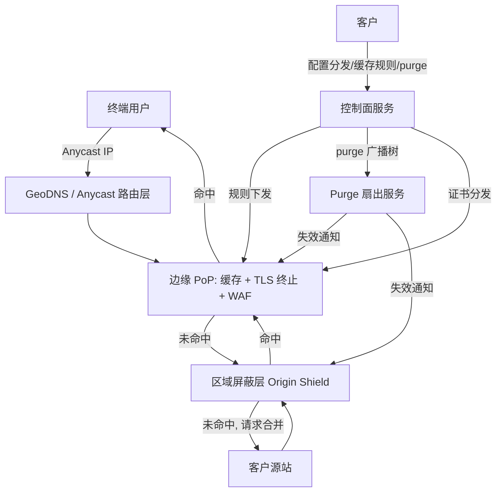

# 设计题解：内容分发网络（Content Delivery Network，CDN）

## 题目与范围

面试官通常这样开场："设计一个 CDN：把源站（origin）的内容分发到离用户更近的边缘节点
（edge PoP，Point of Presence），让全球用户都能低延迟地拿到静态资源和大文件。"这句话
背后的难点不是"加一层缓存"，而是**这一层缓存有成百上千个物理独立、地理分散的副本，
它们必须在请求路由、内容一致性、失效传播三件事上表现得像一个整体**，同时源站本身
永远不能被直接暴露在全网的请求量之下。

这道题是站在 CDN **运营商**（Cloudflare / Akamai / Fastly 这一类公司）的视角设计整
个分发网络本身，而不是站在使用某个 CDN 的网站开发者视角。这个视角区分很重要：它把
「DNS 该怎么配」变成「PoP 该怎么建、该怎么互相协作」的系统设计问题。

值得当场问清楚的澄清问题，以及它们各自改变的设计决策：

- **服务的是哪一类客户内容？** 纯静态资源（图片/JS/CSS）、用户各自不同的动态 API
  响应，还是大文件/视频点播（VOD）分段？本题三者都覆盖，因为它们分别决定「深入探讨」
  第 2、3、4 节的设计。
- **客户能不能接受最终一致的失效？** 决定 purge（清除）要不要追求"全球瞬间生效"，
  还是可以让版本化 URL 承担大部分发布场景（见「深入探讨」第 3 节）。
- **单个客户的流量能不能压垮另一个客户？** 决定源站抓取、边缘缓存容量要不要做多租户
  隔离——本题假设需要隔离，因为这是多租户 CDN 的真实约束。
- **要不要支持自定义边缘逻辑（edge functions）？** 不做——这是把 CDN 变成一个边缘
  计算平台的独立子问题，本题只处理缓存与路由。

**范围内**：请求路由（DNS 与 anycast）、分层缓存与源站屏蔽（origin shield）、缓存键
与 purge 传播、大文件/分段下载、单 PoP 故障的降级。**范围外**：边缘计算/edge
functions、WAF 规则引擎的具体实现、证书自动化颁发（ACME）细节、计费与用量统计管道。

## 需求

**功能需求（驱动设计的 4 条）**

1. 客户配置一个"分发"（distribution）：源站地址 + 域名 + 缓存规则，之后该域名下的
   请求经由 CDN 提供服务。
2. 终端用户的请求被路由到（网络意义上）最近的健康边缘节点，由它决定命中缓存还是回源。
3. 客户可以按 URL、路径前缀或标签（tag/surrogate key）发起 purge，使相应内容在所有
   边缘节点上失效。
4. 大文件（视频、安装包）可以被分段/按字节范围（Range）请求，支持断点续传与并行下载。

**非功能需求（数字化）**

- **首字节延迟**：缓存命中时 P99 < 50ms（边缘到用户的物理延迟主导）；缓存未命中且
  需要回源时 P99 < 300ms。
- **缓存命中率**：静态资源边缘命中率 ≥ 95%；这是本设计容量估算的核心杠杆。
- **purge 传播**：目标 P99 < 2s 内使全网边缘节点对新请求不再返回旧内容（"最终一致
  失效"，不是跨节点原子提交）。
- **可用性**：边缘服务 99.99%——这是产品的核心承诺；源站保护（即源站请求量的上限）
  优先级高于单个边缘节点的可用性，因为源站过载会拖垮所有客户。
- **单 PoP 故障**：任意一个边缘节点（或其所在城市）下线，不能造成用户可感知的服务
  中断，只能造成局部延迟上升。

## 容量估算

估算的核心不是"存多少数据"，而是**峰值请求率如何分解到数百个边缘节点，以及分层缓存
把"到达源站"的请求量压缩了多少倍**——这两层杠杆决定了源站需要多大规模，以及要不要
做源站屏蔽。

**请求量与带宽**（假设：全网日请求 5×10¹¹ 次，82% 为可缓存静态资源（平均 80KB）、
13% 为大文件/视频分段（平均 2MB）、5% 为不可缓存的动态响应（平均 5KB），峰值/均值
比 3×）：

```
平均 QPS = 5e11 / 86400 ≈ 5,787,037
峰值 QPS = 平均 QPS × 3 ≈ 17,361,111

静态请求 = 5e11 × 0.82 = 4.1e11 次/日 → 33,587 TB/日
分段请求 = 5e11 × 0.13 = 6.5e10 次/日 → 136,315 TB/日
动态请求 = 5e11 × 0.05 = 2.5e10 次/日 → 128 GB/日
合计 ≈ 170,030 TB/日 ≈ 170 PB/日

平均出口带宽 = 170,030 TB × 8 / 86400s ≈ 15.7 Tbps
峰值出口带宽 ≈ 15.7 × 3 ≈ 47.2 Tbps
```

这两个数字**分别驱动不同的决策**：峰值 QPS（1,736 万）决定要多少边缘节点才能把单
节点请求率压到可接受范围；峰值带宽（47.2 Tbps）决定每个 PoP 的上联网络容量和与源站
之间的专线容量。

**PoP 与分层缓存规模**（假设网络铺设 300 个边缘 PoP，按地理分组为 15 个区域，每区域
20 个边缘节点共享一个区域屏蔽层/origin shield）：

```
单 PoP 峰值 QPS = 17,361,111 / 300 ≈ 57,870

若边缘命中率 95%（miss 率 5%）：
  不做源站屏蔽时到达源站的 QPS = 17,361,111 × 0.05 ≈ 868,056

若区域屏蔽层对"边缘未命中流量"再吸收 80%（因为它汇聚了 20 个边缘节点的未命中请求，
同一热点对象的重复请求在这一层被合并）：
  做源站屏蔽后到达源站的 QPS = 868,056 × (1 − 0.80) ≈ 173,611（降低到 1/5）
```

**为什么区域屏蔽层能吸收 80%**：一个新发布的热点对象，在没有屏蔽层时，300 个边缘
节点各自独立回源，等价于源站被 300 次并发请求同一个 500MB 对象命中——300 × 500MB
≈ 146.5GB 源站出口流量；有屏蔽层后，只有 15 个区域屏蔽节点各自回源一次——15 ×
500MB ≈ 7.3GB，减少到 1/20。这个 20 倍的差距**恰好等于每个屏蔽层覆盖的边缘节点数**，
这不是巧合：屏蔽层的价值就是把"边缘节点数"个独立的首次回源，合并成"屏蔽层数"个。
这就是源站保护杠杆的来源，细化见「深入探讨」第 2 节。

**边缘缓存容量**（假设全网活跃唯一静态对象 2×10⁹ 个，平均 80KB，遵循重尾分布，前
2% 的对象覆盖 95% 的请求量）：

```
唯一静态对象总量 = 2e9 × 80KB ≈ 0.164 PB
热点子集（前 2%）= 0.164 PB × 0.02 ≈ 3.28 TB（能覆盖 95% 命中率所需的最小工作集）
单 PoP 缓存容量（按区域再细分至 1/5，只需缓存本地区域热门内容）≈ 655 GB
```

655GB 是一台边缘服务器配几块 NVMe SSD 就能满足的量级——这决定了边缘节点可以用通用
服务器而不需要专门的存储阵列。

## 核心实体与 API

**核心实体**

- **Distribution（分发）**：`id`, `hostnames[]`, `origin`, `tls_cert_id`,
  `cache_rules[]`, `status`。一个客户域名到源站的映射，是本设计里"客户看到的配置
  单元"。
- **CacheRule（缓存规则）**：`path_pattern`, `ttl`, `cache_key_vary[]`
  （见「深入探讨」第 3 节）、`stale_while_revalidate`, `stale_if_error`。
- **Origin（源站）**：`addresses[]`, `health_check`, `weight`（支持多源站与权重）。
- **PurgeJob（清除任务）**：`id`, `mode`（url / prefix / surrogate-key）,
  `targets[]`, `status`, `pops_acked / pops_total`——purge 不是同步操作，而是一个
  可轮询的异步任务，这是它的正确抽象（见「深入探讨」第 3 节）。
- **PopNode（边缘节点，内部实体，不对客户暴露）**：`pop_id`, `region_shield_id`,
  `anycast_prefixes[]`, `health`。

**控制面 API**（客户用来配置分发，不是终端用户的数据面请求）

```
POST /v1/distributions
  body: {hostnames, origin, tls_cert_id}
  → 201 {id, cname_target}         # 幂等键: 客户提供的 client_request_id

PUT /v1/distributions/{id}/cache-rules
  body: {rules: [{path_pattern, ttl, cache_key_vary, swr, sie}]}
  → 200                            # 全量替换该分发的缓存规则，非增量 patch

POST /v1/purge
  body: {mode: "surrogate-key", targets: ["product-1234"]}
  → 202 {job_id}                   # 异步；purge 本身对同一 targets 是幂等的
                                    # （目标状态相同），但每次调用都开新 job

GET /v1/purge/{job_id}
  → 200 {status, pops_acked, pops_total}

GET /v1/distributions/{id}/analytics?window=1h&cursor=...
  → 200 {hit_ratio, bandwidth, top_urls[], next_cursor}   # 游标分页
```

**刻意不在 API 里的东西**：没有"同步等待 purge 全网生效"的接口——这个保证本身在
物理上不存在（见「深入探讨」第 3 节），API 只承诺可轮询的最终一致；没有边缘节点级
别的读写接口——`PopNode` 对客户完全不可见，是运维内部状态。

## 高层设计



**请求路径走查**：

1. 用户发起请求，DNS 解析（或直接连接 anycast IP，取决于路由策略，见「深入探讨」
   第 1 节）把用户导向拓扑最近的健康边缘 PoP。
2. 边缘节点计算缓存键（见「深入探讨」第 3 节），命中则直接返回，走完整个请求；这条
   路径完全不涉及源站，是 95% 请求量应该走的路径。
3. 未命中时，边缘节点不直接联系源站，而是把请求转发给它所属区域的屏蔽层节点；这一
   跳用的是 CDN 自己的内网/专线，而不是公网。
4. 屏蔽层节点自己也可能命中（因为它汇聚了整个区域的未命中流量，命中率天然更高）；
   仍未命中则由屏蔽层——且只有屏蔽层——向源站发起回源请求，用**请求合并**（同一
   对象的并发未命中只触发一次回源，其余请求挂起等待结果）避免重复穿透。
5. 控制面服务保存所有分发配置，规则变更、证书轮换以推送方式下发到相关的边缘节点；
   purge 请求经扇出服务以广播树的形式送达所有可能持有该内容副本的节点。

存储技术选型：边缘节点用**本地 SSD + 内存**做两级缓存（内存放最热对象，SSD 兜底扩
大容量，见「深入探讨」第 4 节的关系）；控制面配置用强一致的小规模 KV/文档存储（配置
变更频率低、正确性要求高）；purge 扇出用发布/订阅（pub/sub）广播树而不是逐节点轮询
（几百到几千个目标节点，轮询延迟不可接受）。

## 深入探讨

### 请求路由：DNS-based（GeoDNS/GSLB）与 Anycast 的取舍

**问题**：把用户导向"最近"的边缘节点，"最近"由谁决定、多快能变？

- **GeoDNS/GSLB**：权威 DNS 服务器根据查询来源的（推断）地理位置，为不同用户返回不
  同的边缘 IP。优点是细粒度可控——可以按客户等级、按 A/B 测试、按容量水位做流量调度；
  缺点是它看到的是**递归解析器**的位置而不是终端用户的位置（公共 DNS 如 8.8.8.8 会
  让全球用户看起来"来自"同一处），且每次调整都受 TTL 约束，切换是分钟级的
  （[[networking-anycast-vs-geodns]]、[[networking-dns-ttl-failover]]）。
- **Anycast**：多个 PoP 通过 BGP 宣告同一个 IP，由互联网路由自身把每个数据包送到
  AS-path 最短的节点。优点是故障切换是**撤路由**这个网络层动作，不依赖任何缓存 TTL，
  是真正的秒级甚至亚秒级；缺点是路由本身不受应用层控制，路由抖动可能让一条长连接中途
  改道。

真实系统的选择印证了这个权衡的两条不同路线：Cloudflare 以 anycast 作为默认的边缘寻
址方式，348 个城市的数据中心都宣告同一批外部 IP，路由完全交给 BGP（来源见「来
源与延伸」）；Akamai 的经典架构则以覆盖数万台服务器、遍布近千个网络的全球分布式 DNS
和一个独立的"映射系统"（mapping system）作为核心路由机制，综合拓扑、负载、健康状况
持续计算最优边缘节点，DNS 应答本身就是一次实时调度决策（Nygren et al., 2010，见「来
源与延伸」）。

本设计采用**anycast 作为主路径、GeoDNS 作为补充**的混合方案：anycast 覆盖绝大多数
流量，把故障切换的粒度做到网络层；对需要精细流量调度的场景（灰度发布、按客户合同做
容量隔离）叠加一层 GeoDNS 控制，接受它分钟级生效的代价，因为这类调度本来就不要求秒级。

### 分层缓存与源站屏蔽（Origin Shield）

**问题**：如果每个边缘节点独立向源站回源，源站要同时承受"边缘节点数量"倍的首次访问
压力，而这个数字（本设计里是 300）与源站的实际承载能力无关，纯粹是拓扑决定的。

两种做法：

- **不设中间层**，每个边缘节点各自维护到源站的连接池直接回源。实现简单，但源站看到
  的回源并发数 = 边缘节点数 × 每节点未命中并发数，且同一对象的"首次访问"会被重复触发
  300 次（一次一个节点）。
- **区域屏蔽层（origin shield / tiered cache）**：在边缘和源站之间插入一层数量少得
  多的"上级"缓存节点，所有边缘未命中先问屏蔽层，屏蔽层未命中才回源，并对并发到达的
  同一对象请求做**请求合并**。

容量估算已经算过这层收益：区域屏蔽层把到源站的 QPS 从 868,056 压到 173,611（降至
1/5），把单个热点对象的回源流量从 146.5GB 压到 7.3GB（降至 1/20，恰等于每屏蔽层覆盖
的边缘节点数）。这不是免费的——屏蔽层节点自己需要承受相当于"5 个边缘节点未命中总量"
的负载，需要独立扩容；而且它引入了一跳额外的延迟（边缘 miss 后先问屏蔽层再问源站，
比直接回源多一次 CDN 内网往返，但内网延迟通常 <5ms，远小于跨洲公网往返）。

真实系统的做法验证了"少数几个屏蔽节点吸收大部分回源"这个模型：Fastly 官方博客说明，
平均而言，配置了 shielding 的客户能把高达 99% 的请求挡在 Fastly 边缘、不触达源站；
Cloudflare 的 Smart Tiered Cache 会为每个源站动态挑选延迟最低的单一上级节点，而不是
固定拓扑（来源见「来源与延伸」）。本设计用固定的"区域→屏蔽层"分组（15 个屏蔽层，每
个覆盖 20 个边缘节点）而非完全动态选择，是为了让容量规划可预测，代价是牺牲了 Smart
Tiered Cache 那种按延迟动态调整的最优性。

### 缓存键与 purge 传播

**问题**：缓存键决定"两个请求算不算同一个对象"，purge 决定"这个对象什么时候不再算
新鲜"——两者一个管命中率，一个管正确性，做错任何一个都直接可见。

缓存键的构造规则是[[networking-cdn-cache-key|把每个改变响应的字节放进键，且仅此而
已]]：默认是 URL；把 Cookie 或完整 User-Agent 之类高基数的头也纳入键，会把缓存打散
成几乎"一人一份"，命中率归零。

purge 的两种模式各自适合不同场景（[[networking-cdn-purge-vs-versioning]]）：

- **按内容失效（purge by URL / prefix / surrogate-key）**：必须传播到网络里**每一
  个**可能持有该副本的节点，是一次多播/广播操作。本设计用发布/订阅广播树而不是逐节
  点轮询——300 个 PoP 分 15 组，控制面向 15 个组的"入口"发布一次失效事件，组内再扇出
  给 20 个边缘节点，两层扇出比顺序通知 300 个节点快得多，也比单层广播给 300 个节点
  更容易做限速和重试隔离。目标 P99 < 2s 全网确认；Cloudflare 公开的 Instant Purge
  架构把 P50 做到 150ms 以内（来源见「来源与延伸」），说明这个量级在工程上是可达的，
  本设计的 2s 目标留了更宽的安全边际，因为不假设有 Cloudflare 那样为 purge 单独优化
  的网络层。
- **按版本失效（内容指纹 URL）**：不需要广播——新内容用新 URL（如
  `app.3f2a1c.js`），旧 URL 永不变、可以设成永久不过期，"发布"变成"部署一份引用新
  URL 的 HTML"，是原子的、不依赖 purge 传播时延。

**purge 天生不是原子的**：即使全网 300 个节点都在 2 秒内确认，这 2 秒内不同地区的用
户看到的仍然可能是新旧混合的内容——网络传播需要时间是物理约束，不是实现缺陷。凡是需
要"用户读到的版本要么全新要么全旧、不能是过渡态"的场景（例如价格变更），正确做法是
版本化 URL 而不是指望 purge 足够快。

### 大文件与分段下载

**问题**：单个 HTTP 连接下载一个几百 MB 到几十 GB 的对象，会撞上两个物理限制：单连接
吞吐受带宽时延积（BDP）限制，以及一次失败要重传整个文件的代价太高。

单连接吞吐的量级：假设边缘到用户 RTT 40ms、路径可用带宽 100Mbps，带宽时延积
`100Mbps × 40ms ≈ 488KB`——这是 TCP 拥塞窗口打满前单连接能"in flight"的数据量上限，
真实吞吐还会被丢包、慢启动进一步拉低。用 6 条并行连接分段下载，即使每条只能跑到
30Mbps，聚合吞吐也能到 180Mbps，远超单连接的理论上限——**并行度弥补单连接的物理
限制**，这与对象存储的 multipart 上传是同一个原理
（[[storage-multipart-ranged-io]]）。

对视频点播，分段（segment）不只是为了下载并行，更是为了**自适应码率（ABR）**：把一
个视频编码成多档码率，每档切成固定时长的分段（例如 6 秒一段，25Mbps 码率对应约
18.75MB/段），播放器按实测带宽逐段切换码率，而不是提前锁定一个码率下载整个文件。这
带来一个对缓存友好的副作用：分段是不可变的小对象，天然适合用「深入探讨」第 3 节的
版本化缓存策略（分段 URL 里带上码率和序号，一旦生成永不改变），而不需要对一个几 GB
的大文件做整体的 purge/revalidate。

Range GET（`Range: bytes=...`）是这一切的基础协议能力：不管是并行分段下载还是 ABR
按需拉取某一分段，边缘节点都需要能对源站发起精确到字节范围的请求，并且缓存本身也要
支持按范围命中（而不是"要么整个对象命中要么整个未命中"），否则第一次 Range 请求就
会触发对整个大文件的回源。

### PoP 故障与优雅降级

**问题**：一个边缘 PoP（或它所在城市的网络）整体不可用时，它原本承担的
`peak_qps / 300 ≈ 57,870` QPS 流量必须被邻近节点接住，而不能表现为那部分用户的服务
中断。

因为路由层是 anycast（第 1 节的选择），失效检测和切换发生在**网络层**：故障 PoP 停
止宣告 BGP 路由，全球路由表在这条路由撤回后收敛，后续数据包自动被路由到 AS-path 次
短的节点——不涉及任何 DNS TTL 或客户端缓存，是这个方案相对 GeoDNS-only 方案最大的
优势。

负载重分布的量级是可控的：故障节点所在的屏蔽分组有 20 个边缘节点，它的流量近似均匀
分摊到剩下 19 个节点，每个节点只多扛 `57,870 / 19 ≈ 3,046` QPS，相当于自身峰值负载
的 5.3%——只要每个边缘节点按"扣除一个同组节点后仍有余量"（即 N+1 冗余）来配置容量
上限，这次故障对用户完全无感，只是理论上多了 5% 的负载而已。这也说明了屏蔽层分组大
小是一个真实的容量规划参数：分组越小（例如 5 个节点一组），单节点故障对组内其余节点
的冲击就越大（故障后每节点要多扛 25% 而不是 5.3%）。

## 瓶颈、故障与演进

**热点与倾斜**：

- **单对象超过单节点承载能力**：一次病毒式传播的内容，即使命中率 100%，单个边缘节点
  的网卡/CPU 仍然会被同一个 key 的海量并发请求打满。修复方式和「深入探讨」里源站保护
  的思路相反但同构：源站保护是把多个节点的请求合并成一个，热 key 保护则是把一个 key
  的请求复制到多个节点分摊（[[caching-hot-key-replication]]）——CDN 内部对突发热点
  对象也需要同样的"检测到超过阈值就临时多播到同 PoP 内的多台机器"机制。
- **屏蔽层分组不均**：如果某个区域的边缘节点数远多于其他区域（例如新兴市场快速铺设
  边缘但源站在另一大洲），该区域屏蔽层节点的负载会显著失衡，需要按流量而不是按地理
  行政区划来划分屏蔽分组。

**组件故障与降级**：

- **单 PoP 故障**：见「深入探讨」第 5 节，anycast 路由层秒级收敛，负载均摊到同组节点。
- **区域屏蔽层故障**：该区域全部边缘节点的未命中流量失去了屏蔽层的保护，短时间内直接
  回源——这时候必须有源站侧的限流/降级（拒绝超出配额的回源请求、对非关键内容返回
  `stale-if-error` 的过期副本）兜底，否则一个屏蔽层的故障会通过"直接回源"放大成源站
  过载。
- **源站故障或响应变慢**：靠 `stale-if-error` 继续提供过期副本
  （[[networking-cdn-stale-while-revalidate]]），把源站的可用性问题隐藏在用户体验
  之外；源站恢复后要用带抖动的退避重试，而不是所有屏蔽层节点同时发起"缓存刚失效+源站
  刚恢复"的重试洪峰。
- **purge 扇出服务故障**：purge 消息投递不出去，内容会"卡"在旧版本上——这是可接受的
  降级（内容陈旧，但仍可用），好于让 purge 服务的不可用连累到正常的读路径；purge 任务
  需要持久化并支持故障恢复后重放，而不是纯内存队列。
- **一次误操作触发全量 purge（purge 风暴）**：如果某次发布对整个目录发起了 purge 而
  不是针对变更的子集，效果等价于让全部边缘节点同时进入冷启动，回源流量瞬间逼近甚至
  超过「深入探讨」第 2 节里"无屏蔽层"的最坏情况。缓解手段是限制单次 purge 的目标范围
  、对大范围 purge 做限速、以及把版本化 URL 作为默认发布方式，把 purge 保留给真正的
  紧急场景（如泄露内容下架）。

**10 倍与 100 倍演进**：

```
10x：峰值 QPS ≈ 173,611,111；峰值带宽 ≈ 472 Tbps
100x：峰值带宽 ≈ 4,723 Tbps
```

10 倍规模下，单一"区域屏蔽层"已经不够：需要在屏蔽层之上再加一层跨区域的汇聚层，形成
三级缓存树（边缘 → 区域屏蔽 → 跨区域汇聚 → 源站），否则区域屏蔽层直接面对的源站回源
QPS 也会等比例增长到 170 万量级，重新变成源站的压力来源；purge 扇出树也要从两层变成
三层，否则控制面向所有分组"广播"这一步本身会成为瓶颈。100 倍规模下，源站与 CDN 之间
的私网/专线容量、以及跨大洲的骨干传输（而不是公网中转）成为决定性因素——这正是
[[networking-cdn-dynamic-acceleration|CDN 对不可缓存流量仍然有价值]]背后的同一个
原理：私网路径比公网中转更可控、更便宜。

## 面试官会追问什么

**中级（mid）**

- "缓存命中时如何保证不会把 A 用户的响应发给 B 用户？"——核心是缓存键必须完整覆盖
  响应会变化的所有维度；个性化响应要么不缓存，要么把公共部分（shell）和个性化部分
  拆开分别处理。
- "TTL 过期但源站暂时访问不到，用户会看到什么？"——`stale-if-error` 让边缘继续提供
  过期副本而不是直接报错，用陈旧换可用性。

**高级（senior）**

- "一个客户的流量暴涨会不会连累到共享同一屏蔽层/源站连接池的其他客户？"——需要按
  租户对回源并发、屏蔽层缓存容量做配额隔离，否则多租户共享的中间层会变成"noisy
  neighbor"问题的放大器。
- "purge 传播期间的短暂不一致，产品上能接受吗？"——取决于内容类型：营销页面能接受
  几秒不一致；价格、库存这类需要"读到即最新"的字段不应该依赖 CDN 缓存，应该直接不
  缓存或缓存极短 TTL。

**资深（staff）**

- "如果要同时用两家 CDN 服务商做多 CDN（multi-CDN）容灾，怎么设计流量调度？"——需要
  基于真实用户监控（RUM）数据做动态的按性能/成本调度，而不是固定权重分流；核心难点
  是两家供应商的 purge、缓存键语义不完全一致，业务侧要么统一到最小公共能力集，要么
  为差异写适配层。
- "给一个新客户上线时，如何在数百个边缘节点上做到 TLS 证书零停机分发？"——和 purge
  传播是同一类问题（配置变更需要到达所有节点），区别是证书生效前置条件更严格（不能
  出现"部分节点还没有新证书就切了流量"的窗口），通常需要"先全量分发确认、再切流量"
  的两阶段流程，而不是 purge 那种即时生效即可接受不一致的模型。

## 常见错误

- **把高基数的头（Cookie、完整 User-Agent）放进缓存键**：命中率直接归零，修复见
  「深入探讨」第 3 节（[[networking-cdn-cache-key]]）。
- **把 purge 当成日常发布机制**：每次发布都对整个路径做 purge，既慢（要等全网传播）
  又不能精确回滚到某个历史版本；应该默认用版本化 URL，purge 留给紧急下架
  （[[networking-cdn-purge-vs-versioning]]）。
- **不做源站屏蔽，让所有边缘节点各自回源**：小流量时看不出问题，一旦有热点内容或者
  大促发布，源站会被瞬间放大到"边缘节点数"倍的并发直接打垮。
- **混淆 anycast 故障切换和 DNS 故障切换的粒度**：以为把 TTL 调低就能获得 anycast
  级别的切换速度——DNS 切换永远受制于已缓存记录和忽略 TTL 的客户端，是分钟级；只有
  下沉到网络层（anycast/负载均衡 VIP）才能做到秒级
  （[[networking-anycast-vs-geodns]]、[[networking-dns-ttl-failover]]）。
- **大文件用单个 GET 请求整体下载**：受带宽时延积限制，吞吐上不去，一旦中途失败要
  从头重来；应该用 Range 分段 + 并行连接（[[storage-multipart-ranged-io]]）。
- **认为不可缓存的 API 流量走 CDN 没有意义**：即使完全不缓存，CDN 依然把 TLS 握手
  终止在离用户更近的边缘、用私网回源，能显著降低跨洲延迟
  （[[networking-cdn-dynamic-acceleration]]）。

## 五分钟讲法

I'd design this as a multi-tier system: an anycast routing layer gets each request to
the topologically nearest healthy edge PoP with zero DNS involvement, so failover is a
BGP route withdrawal, not a TTL-bound DNS change. At 17 million peak QPS across 300
PoPs, each node only has to handle about 58,000 QPS. On a cache miss, the edge doesn't
go straight to origin — it asks a regional origin shield first, which aggregates misses
from about 20 edge nodes and coalesces concurrent requests for the same object into one
origin fetch; that single design choice cuts origin QPS by roughly 5x in the steady
state and by 20x for a single viral object, because the shield count, not the edge
count, is what the origin actually sees. Cache keys have to include exactly the bytes
that change the response and nothing else, or hit rate collapses; purges are broadcast
through a fan-out tree to every PoP and are inherently eventually consistent, which is
why the default publish path is fingerprinted, immutable URLs rather than purge. Large
files use range requests and parallel segment fetches — single-connection throughput is
capped by the bandwidth-delay product, so parallelism is what actually moves the bytes,
and for video that segmentation also enables adaptive bitrate. When one PoP fails,
anycast reroutes its traffic to the remaining nodes in its shield group within seconds,
adding only about 5% load to each — a number that comes directly from choosing a shield
group size with N+1 headroom. At 10x scale, a single shield tier stops being enough and
the design needs a second, cross-regional aggregation tier above it, or the origin sees
the same overload problem one layer later.

## 来源与延伸

- [The Akamai Network: A Platform for High-Performance Internet Applications](https://www.usenix.org/legacy/publications/login/2010-06/openpdfs/nygren.pdf)
  （Nygren, Sitaraman, Sun, 2010）—— 真实大规模 CDN 用全球分布式 DNS + 独立映射系统
  做请求路由的第一手描述；本题的设计选择 anycast 作为主路径，与这篇论文里以 DNS
  映射为核心的路线不同，取舍差异见「深入探讨」第 1 节。
- [A Brief Primer on Anycast](https://blog.cloudflare.com/a-brief-anycast-primer/)
  （Cloudflare Blog）—— anycast 机制本身（同一 IP 多点宣告、BGP 决定路由、故障切换
  是撤路由这个网络层动作）的第一手解释，Cloudflare 网络规模的 348 个城市这一数字取自
  其官网 [Network](https://www.cloudflare.com/network/) 页面而非这篇博客；本题用
  它验证「anycast 优势=秒级切换」的论证，但没有采用 Cloudflare 那种以 anycast 为
  唯一路由手段、不叠加 GeoDNS 的更激进方案。
- [Tiered Cache Smart Topology](https://blog.cloudflare.com/tiered-cache-smart-topology/)
  （Cloudflare Blog）—— 说明 Smart Tiered Cache 按延迟动态选择单一上级节点；本题用
  固定分组（15 屏蔽层 × 20 边缘）简化容量规划，牺牲了这种动态最优性，差异见「深入
  探讨」第 2 节。
- [Let the edge work for you: How shielding improves performance](https://www.fastly.com/blog/let-the-edge-work-for-you-how-shielding-improves-performance)
  （Fastly 官方博客）—— 屏蔽 POP 汇聚未命中流量的机制说明，以及"平均而言配置
  shielding 的客户能把高达 99% 的请求挡在边缘"这一具体说法的来源；本题的源站保护
  倍数计算（5x/20x）建立在同一机制上，但用的是本题自己假设的边缘/屏蔽层数量，不是
  Fastly 的真实拓扑数字。
- [Instant Purge: invalidating cached content in under 150ms](https://blog.cloudflare.com/instant-purge/)
  （Cloudflare Blog）—— 真实系统把全网 purge P50 做到 150ms 以内的公开数字；本题
  设定更保守的 2s P99 目标，因为不假设拥有 Cloudflare 为 purge 单独优化的专用网络层，
  差异见「深入探讨」第 3 节。
