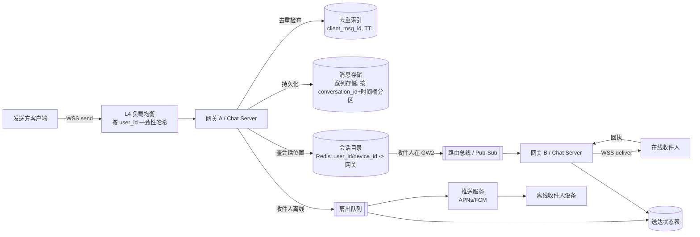

# 设计题解：聊天与即时通讯（Chat & Messaging，以 WhatsApp 为例）

## 题目与范围

面试官通常这样开场："设计一个类似 WhatsApp 的即时通讯系统，支持一对一和群聊。" 这句话背后藏着好几个分支，值得候选人主动澄清：

- **规模**：是一个全国性应用（几千万日活）还是全球级（几亿到十亿日活）？这决定了要不要讨论跨地域（multi-region）部署。
- **群聊上限**：群成员上限是 256 人这种"大群聊"，还是要支持成千上万人的"频道/社区"（channel）？后者的扇出（fan-out）机制完全不同，属于另一个问题（Slack/Discord 的频道广播），本题只覆盖到几百人的群。
- **消息是否端到端加密（end-to-end encryption，E2EE）**？如果是，服务器就无法做全文搜索或内容审核，这会影响存储和合规设计，需要明确声明为约束。
- **媒体消息**：图片、语音、视频是否在范围内？范围内的话，媒体存储与文本消息存储必须分离讨论。
- **是否需要多设备（multi-device）同步**？如果一个账号可以同时登录手机和桌面端，"已送达"的语义就要重新定义。

**本题明确范围**：一对一和群聊（≤500 人）消息收发，送达回执（delivery receipt：已发送/已送达/已读），会话内消息顺序，离线消息同步，在线状态（presence）。**明确排除**：超大规模公开频道/社区广播（那是 Live Comments / 频道广播的题）、端到端加密协议本身的密码学细节（只讨论它对架构的影响）、语音/视频通话、内容审核与合规细节。

## 需求

**功能性需求（3–5 条驱动设计的核心项）**

1. 用户可以给单个联系人或群组（≤500 人）发送文本和媒体消息。
2. 发送方能看到消息的三段式状态：已发送（sent，服务器已持久化）→ 已送达（delivered，至少一台接收方设备收到）→ 已读（read，接收方主动标记）。
3. 消息在同一会话（conversation）内必须保序（causal order within a conversation），跨会话不要求全局顺序。
4. 离线用户重新上线后必须能补齐所有未读消息，且不丢不重。
5. 用户可以查看联系人是否在线/最后上线时间（presence / last seen）。

**非功能性需求（数字化）**

- **延迟**：在线用户间端到端投递 P99 < 200ms（同区域），P99 < 500ms（跨区域）。
- **可用性**：消息收发链路 99.99%（约 52 分钟/年不可用）；presence 允许更低（99.9%），因为它是"锦上添花"而非核心功能。
- **一致性**：会话内消息顺序要求单调（monotonic），但允许"至少一次"投递（at-least-once），由客户端去重；presence 允许最终一致（eventual consistency），延迟几秒可接受。
- **持久性**：消息在服务器持久化之前绝不能返回"已发送"确认——这是设计里最容易被面试官抓住的一条红线。

## 容量估算

假设（本设计自行给出，不是真实 WhatsApp 的数据，实数见"来源与延伸"）：

- 日活用户（DAU）= 3 亿。
- 人均每天发送消息 = 50 条。
- 总发送量 = 3×10^8 × 50 = **150 亿条/天**。

**QPS**：150×10^8 / 86400 ≈ **17.4 万条/秒**（均值）。消息类应用有明显的晚间高峰，取 3 倍峰值系数 → **约 52 万条/秒（峰值写入）**。这个数字直接决定消息存储层必须是可水平扩展的宽列存储（wide-column store），单机关系型数据库在这个写入量级下无法支撑。

**并发连接数**：假设峰值时 15% 的 DAU 同时在线并保持长连接 → 3×10^8 × 0.15 = **4500 万并发 WebSocket 连接**。这是决定网关（gateway/chat server）机型和数量的关键数字：

- 用普通商用栈（Go/Netty，epoll，每连接约 5–10KB 状态）估算，单机可稳定维持约 **10 万条连接**；4500 万 / 10 万 ≈ **450 台网关**，再加约 30% 的多可用区（AZ）冗余和滚动发布余量 → **约 600 台**。
- 对比：WhatsApp 早年用 Erlang + 定制 FreeBSD 内核在单机做到 **100–200 万并发连接**（见"来源与延伸"的 HighScalability 数据），靠的是 BEAM 虚拟机里每进程约 300 字节的极低开销和抢占式调度。这不是本设计的默认假设——大多数团队不会为此重写整个网络栈，所以下文都按商用数字（10 万/机）估算，把"专用栈能把网关数量压低一个数量级"作为一个可选的深度优化方向。

**群聊扇出（fan-out）放大写入**：假设 15% 的消息发到群组，平均群大小 10 人（9 个其他收件人）。若为每个收件人都复制一份完整消息体：
150×10^8 × 0.15 × 9 ≈ **202.5 亿条额外副本/天**，按平均 200 字节/条 → 额外 **4.05 TB/天**，纯粹因为群聊放大。这个数字直接把设计推向"消息只存一份 + 每收件人一行送达状态"的模型（见"深入探讨"）：状态行只需 message_id（8B）+ user_id（8B）+ status（1B）+ timestamp（8B）≈ 25 字节，202.5 亿行 × 25B ≈ **506 GB/天**，比复制消息体省了约 8 倍存储。

**存储**：文本消息体（含加密开销与元数据）平均约 200 字节。150×10^8 × 200B = **3 TB/天**（未计副本）。按 3 副本、30 天在线保留窗口（消息在所有设备确认收到后即可从服务器删除，未确认的最多保留 30 天作为离线补发兜底）估算，热存储稳定态约 3TB × 30 × 3 ≈ 270TB，文本+协议开销经压缩后约 **135TB**。

**媒体**：假设 8% 的消息带媒体附件，平均压缩后 180KB（图片/语音混合）→ 150×10^8 × 0.08 × 180KB ≈ **216 TB/天**，比文本消息体大两个数量级。这个巨大差距是媒体必须走独立的对象存储（object storage，如 S3 一类，配合纠删码而非 3 副本，成本降到约 1.4 倍而非 3 倍）而不是塞进消息数据库的直接原因——同一张宽列表既要扛 17 万 QPS 的小行写入又要扛 216TB/天的大 blob，会让压缩（compaction）彻底跟不上。

## 核心实体与 API

**核心实体**

- `User(id, phone_hash, devices[], created_at)`
- `Device(id, user_id, push_token, platform, last_ack_seq)`——多设备同步的关键：每台设备各自维护一个已确认的会话内序号游标。
- `Conversation(id, type: direct|group, participant_ids[])`
- `Group(id, name, owner_id, member_ids[], created_at)`
- `Message(id, conversation_id, sender_id, client_msg_id, ciphertext, seq, server_ts)`——`id` 是全局唯一、时间可排序的（如 Snowflake ID）；`seq` 是**会话内**单调递增序号，只在该会话分区内有意义。
- `DeliveryStatus(message_id, device_id, status: sent|delivered|read, updated_at)`——不是每收件人一份消息体，而是每（消息, 设备）一行状态。
- `PresenceState(user_id, status: online|offline, last_seen_ts)`

**API**（以长连接帧为主，REST 为辅）

- `WSS /v1/connect?token=<jwt>&device_id=<id>` — 建立长连接；服务器回 `{session_id, resume_from_seq}`。
- 客户端帧 `SEND {op:"send", client_msg_id, conversation_id, ciphertext}` → 服务器持久化后回 `ACK {client_msg_id, message_id, seq, server_ts}`。**`client_msg_id` 是幂等键**：同一个 `client_msg_id` 重复发送，服务器只返回原始 ACK，不重新持久化、不重复投递。
- 服务器→客户端帧 `DELIVER {message_id, conversation_id, seq, sender_id, ciphertext, server_ts}`。
- 客户端→服务器帧 `RECEIPT {message_id, status: "delivered"|"read"}`。
- `GET /v1/conversations/{id}/messages?since_seq=<n>&limit=200` — 游标分页（基于会话内单调 `seq`，而非 offset），用于离线补发和历史滚动加载；天然幂等，重复调用不会跳过或重复消息。
- `POST /v1/groups {name, member_ids}`；`POST /v1/groups/{id}/members {add:[...], remove:[...]}`。
- `GET /v1/presence?user_ids=<批量，上限约500>` 或 WS 订阅帧 `SUBSCRIBE_PRESENCE {user_ids:[...]}`——**限定为客户端当前打开的会话对应的联系人**，不是整个通讯录。

**故意不放进 API 的东西**：没有服务器端全文搜索接口（端到端加密下服务器看不到明文，搜索只能在客户端本地索引上做）；没有"广播给我不在连接中的 N 个用户"这种客户端可直接调用的扇出原语——群聊扇出完全是服务端内部机制，客户端只发一份；没有"等所有收件人都收到才返回"的同步调用——投递永远是异步的，通过回执事件观察，绝不阻塞发送方的 ACK。

## 高层设计

- **客户端 → L4 负载均衡**：连接建立时按 `user_id` 一致性哈希路由，同一用户的多次重连尽量落到同一台网关，减小会话目录（session directory）的迁移抖动。
- **网关（Chat Server）**：持有 WebSocket，是本系统里唯一的"有状态"层。收到 `SEND` 帧后先查去重索引（`client_msg_id`），再写消息存储——**必须先持久化、后 ACK**，这是需求里"绝不能假 ACK"的落地。这一步用到了 [[networking.realtime|Realtime Delivery]] 里讨论的长连接选型：WebSocket 而非长轮询/SSE，因为通讯是真正双向且高频的。
- **消息存储**：宽列存储（Cassandra/ScyllaDB 一类），分区键 `conversation_id + 时间桶`，聚簇键 `seq`（会话内单调、时间可排序）。选宽列存储而非关系型数据库，是因为 17 万 QPS 的均值写入、52 万峰值写入，加上按会话/时间范围的顺序读，正是宽列存储的强项，而不是关系型数据库擅长的强一致性多表事务。
- **会话目录（Session Directory）**：Redis 维护 `user_id/device_id → 网关实例` 的映射，网关据此判断收件人是否在线、在哪台机器。这是跨网关路由问题的核心数据结构，详见"深入探讨"。
- **路由总线（routing bus）**：收件人在线时，通过 Pub/Sub 把消息从发送方网关推到收件人网关；收件人离线时改走扇出队列——这正是 [[async.queues|Message Queues]] 发挥作用的地方：解耦"消息已持久化"和"消息已投递"两个阶段，避免推送服务不可用时拖慢发送路径。
- **推送服务**：调用 APNs/FCM 通知离线设备"有新消息"，但推送内容不是消息真身——真正的未读状态永远以服务端的送达状态表和客户端的 `since_seq` 游标为准，推送只是唤醒 App 去同步的信号。

## 深入探讨

### 跨网关路由：会话定位与消息投递路径

**问题**：发送方的 WebSocket 连在网关 A，收件人的 WebSocket 可能连在网关 B、C……成千上万台里的任意一台。A 怎么知道消息该往哪推？

三个真实方案：

1. **网关间全量 Gossip**：每台网关维护全局"用户→网关"表，靠 gossip 协议同步。问题是收敛延迟随集群规模增长，几百台网关规模下就可能出现秒级不一致，且每台机内存要装下全部在线用户的映射，浪费严重。
2. **每用户一个 Kafka Topic**：把每个用户当成一个 Kafka 分区/主题，天然按用户路由。问题是 Kafka 的每个分区都有固定的元数据与文件系统开销（Hello Interview 的题解估为每主题约 50KB——二手数字，未独立核实，但结论不依赖它的精确值），10 亿用户 × 50KB ≈ **50TB+**的纯元数据开销，且 Kafka 控制面对百万级主题的管理本身就是灾难。
3. **集中式会话目录 + Pub/Sub 总线**：Redis（或等价 KV）只存"谁在哪"，一条记录几十字节，10 亿在线用户量级也就几十 GB，Redis 单集群轻松承载；投递本身走一条按目标网关分区的 Pub/Sub（或者更简单：直接网关到网关的 RPC）。

**选择**：方案 3。会话目录只做"查找"，不做"传输"，职责单一，容量可控（几十字节/用户 vs Kafka 的 50KB/用户），且和 [[async.queues|Message Queues]] 里"离线走队列、在线走直连"的分层完全兼容——在线投递不需要队列的持久化保证，因为消息本体已经在消息存储里持久化过了，Pub/Sub 丢一次通知顶多是"没有实时推到但补发能兜底"，不是数据丢失。

### 消息顺序与因果一致性

**问题**：一条消息该按什么顺序展示？纯用客户端时间戳排序，会被设备间的时钟漂移打乱（两台手机时间差几秒很常见）；要全局强一致排序又需要跨分区协调，代价太高而且没必要——用户只关心"这一个会话里谁先说的话"。

两个真实做法的对比：

- **纯客户端时间戳**：简单，但时钟漂移导致乱序,尤其在弱网重发时更明显；无法去重（两条时间戳相同的消息无法区分先后）。
- **逻辑时钟（Lamport/Vector Clock）**：如 systemdesign.one 对 Slack 架构的描述，用逻辑时钟而非物理时间戳排序，能在分布式写入下给出因果序，但实现和调试复杂度高，向量时钟随会话参与者数增长而增长。
- **单分区单调序号（本设计选择）**：每个会话固定路由到消息存储的一个逻辑分区，由该分区的写入路径（类似 Kafka 单分区内的 offset）分配严格递增的 `seq`。因为一个会话的所有写入本就要落到同一分区（否则时间分桶和范围查询都做不到），"单分区=单一写入序"是免费获得的，不需要额外的协调服务。

**代价与边界**：这只保证**会话内**全序，不保证跨会话全序——这恰好匹配需求："会话内保序，跨会话不要求"。群消息的 `seq` 由该群会话所在分区统一分配，因此不同成员看到的消息顺序完全一致，不会出现"你看到 A 在 B 之前，我看到 B 在 A 之前"的分歧。

### 精确送达语义：幂等、确认与去重

**问题**："发送成功"到底意味着什么？如果只在收到客户端 `SEND` 帧时就 ACK，网络抖动导致的客户端重试会造成同一条消息被写入两次；如果 ACK 依赖收件人确认，弱网或对方离线时发送方会长时间看不到任何反馈。

**选择**：三段式状态机 sent（服务器已持久化）→ delivered（至少一台接收方设备收到）→ read（用户主动标记已读），且发送方的 ACK **只对应 sent**，绝不等待收件人。去重靠客户端生成的 `client_msg_id`（通常是 UUID）：服务器维护一个 `(conversation_id, client_msg_id) → message_id` 的去重索引，TTL 与离线保留窗口一致（30 天）。重试时，无论网络层重传了几次，服务器只持久化一次、只返回同一个 `message_id`，客户端凭这个映射自己去重展示。这把交付语义从"精确一次"（exactly-once，分布式系统里几乎不可能免费拿到）降级为更诚实的"**至少一次网络传输、精确一次持久化和展示**"，这个区分是回答面试官追问时最容易讲清楚、也最容易被问倒的地方。

### 离线同步、多设备与群聊扇出的存储代价

**问题**：一个用户可能同时登录手机、平板、桌面端（多设备）；也可能几天不上线（离线同步）；群消息要发给几十上百人（群聊扇出）。三件事表面不同，但都指向同一个存储决策。

**方案对比**：

- **每收件人一份消息体副本**：实现简单（推给谁就复制一份到谁的"信箱"），但如容量估算所示，群聊场景下会把写入放大 9 倍、存储放大约 8 倍（4.05TB/天 vs 506GB/天）。
- **单份消息体 + 每（消息,设备）一行状态**（本设计选择）：消息体只在会话分区里存一份，每个收件设备只需一行约 25 字节的状态记录（`message_id, device_id, status, updated_at`），配合客户端的 `since_seq` 游标做增量拉取。离线用户重新连接时携带自己最后确认的 `seq`，服务器返回 `seq` 之后的所有消息——这是 `GET /v1/conversations/{id}/messages?since_seq=` 存在的原因，也是为什么它必须幂等（断网重连多次调用同一个 since_seq 不会产生副作用）。

**多设备**：每台 `Device` 独立维护 `last_ack_seq`，"delivered" 的判定是"至少一台设备确认"，"该用户所有设备都读完"则是另一个更弱的可选状态（多数产品不强求）。这样加一台新设备（比如新增桌面客户端）不需要改消息存储的写路径，只需要该设备携带 `since_seq=0` 走一次历史回放。

**群聊扇出的同步/异步边界**：群成员数较小（本设计设一个阈值，比如 <100 人）时，网关可以在持久化后同步地把消息推给所有在线成员的网关；一旦群规模变大，同步扇出会拖慢发送方的响应尾延迟（要等对最后一个收件人网关的 RPC 返回）。因此超过阈值后扇出必须转异步：发送方拿到 ACK 后立刻返回，真正的"给每个在线成员推送"和"给每个离线成员建投递状态行"下放到 [[async.queues|Message Queues]] 里的一个扇出队列消费者池去做，用有界并发（比如每个消费者一次处理 50 个收件人）避免瞬时打爆会话目录和路由总线。

### 在线状态（presence）的扇出成本与在离线判定

**问题**：presence 看起来简单（在线/离线），但天真实现（每次心跳都广播给全部联系人）在十亿级用户下是灾难性的写放大。

**两种反例和一种正解**：

- **每次心跳广播给所有联系人**：假设一个用户有 200 个联系人，心跳间隔 10 秒，等于每个在线用户每 10 秒制造 200 次扇出写入——4500 万并发在线时，这是每秒近 9 亿次的量级，远超任何合理预算。
- **每次心跳写一次全局状态表**：仍然是每 10 秒 4500 万次写入（约 450 万/秒），比广播好，但绝大多数写入根本没有人在看。
- **本设计选择：只在状态变化时写、只对"当前打开该会话"的订阅者推**。`LastSeen` 只在用户**断开连接时**写一次（而不是每次心跳），这把写入量从"心跳频率 × 在线人数"降到"断线事件频率 × 在线人数"，量级小一到两个数量级。查询在线状态则走"客户端主动订阅当前打开的会话对应联系人"（`SUBSCRIBE_PRESENCE`），把扇出范围从 O(联系人数) 收窄到 O(当前打开的会话数)，后者通常个位数到几十。

## 瓶颈、故障与演进

**热点与倾斜**：即使把上限设在几百人的群聊内，"活跃大群"仍然比"两人小群"活跃一到两个数量级，落在消息存储同一个 `conversation_id` 分区上会形成热分区（hot partition）——这正是 Discord 官方博客记录过的真实教训：按 `channel_id + 时间桶` 分区时，一个几十万成员频道产生的写入量远超普通频道，导致该分区所在节点延迟飙升，进而因为法定人数（quorum）读写拖慢整个集群。缓解办法是**时间桶要足够细**（比如按小时而非按天分桶），把单个热会话的写入摊到更多物理分区上，而不是指望"分区键选对了就一劳永逸"。

**组件故障与退化**：

- **网关进程崩溃**：客户端通过心跳/半开连接检测（约 30 秒内）发现连接失效，经负载均衡重连到健康网关；未确认的 `SEND` 用同一个 `client_msg_id` 重试，服务端去重索引保证不重复持久化；已经持久化但未及推送的消息在重连后通过 `since_seq` 补齐——用户感知到的是"消息晚了几十秒"，而不是丢消息。
- **会话目录（Redis）不可用**：网关仍能本地接受并持久化发送（持久化路径不依赖它），但跨网关的实时路由失效，投递退化为"离线补发"路径——延迟从毫秒级劣化到"对方下次拉取 since_seq 时"，是一次体验事故但不是数据事故。
- **消息存储分区/整体不可用**：对应分区的写入应直接返回可重试错误，绝不能假装持久化成功后再 ACK；如果是整体不可用，网关应拒绝新发送（而不是把消息攒在内存里假装成功），因为内存态在网关本身重启时也会丢失。
- **推送服务（APNs/FCM）中断**：离线设备收不到唤醒通知，但消息在服务端队列/存储里依然安全；推送恢复后靠客户端下次前台唤醒时的常规 `since_seq` 同步补齐——这也是"推送只是提示，不是数据通道"这一设计选择的直接收益。

**10 倍演进（3 亿 DAU、4500 万并发 → 30 亿 DAU、4.5 亿并发）**：网关数量大致线性增长（并发连接数瓶颈而非 CPU 瓶颈），从约 600 台到约 6000 台；此时单一全局会话目录会成为新瓶颈，需要按用户 ID 区间或地域分片，同区域内路由走本地会话目录，跨区域会话才回源到对方区域；消息存储从单一全局 keyspace 演进为按地域独立集群，跨地域会话异步复制，主动放弃"跨地域强一致顺序"以换取延迟（本来跨会话顺序需求里就没有全局序）；presence 进一步收紧为严格的"仅对当前打开会话订阅"模型，杜绝任何形式的联系人列表全量扇出。

**100 倍（数量级上更现实的说法是"10 倍再加上产品形态从纯 1:1/小群扩展到大规模社区/频道"）**：这时几百到几千人的"群"已经不够用，需要为"广播型频道"（成千上万只读/高扇出成员）单独开一条架构路径，本质上更接近发布订阅或 CDN 式推送而非本题的 1:1 聊天模型——这正是 Discord 从 Cassandra 迁移到 ScyllaDB 的真实背景：迁移前 177 个 Cassandra 节点撑万亿级消息、读写比约 10:1，GC 停顿和热分区把运维拖入"人工值守"的境地，迁移到 ScyllaDB 后节点数降到 72 个，P99 读延迟从 40–125ms 降到 15ms，P99 写延迟从 5–70ms 降到稳定 5ms（数据见"来源与延伸"）。

## 面试官会追问什么

**中级（mid）**

- "客户端断网重连后，怎么保证不丢消息也不重复？"——`since_seq` 增量拉取 + `client_msg_id` 去重两句话答完。
- "为什么用 WebSocket 而不是轮询？"——双向、高频、长连接下摊薄握手成本，长轮询在这个频率下等价于反复重建 HTTP 连接。
- "群消息怎么保证所有人看到的顺序一样？"——群会话固定路由到一个分区，`seq` 由该分区统一分配。

**高级（senior）**

- "群聊扇出从同步推送切换到异步队列的阈值怎么定？"——本质是"发送方能接受的尾延迟预算"除以"单次跨网关 RPC 的典型延迟"，比如 200ms 预算、5ms 单次 RPC，理论上限约 40 个同步扇出目标，实践中留安全余量设在更低（如上文的 100 人量级）。
- "会话目录用 Redis 单点，怎么避免它成为全系统的单点故障？"——分片 + 主从复制 + 客户端对连接目标做一致性哈希，目录不可用时降级到离线补发路径而不是整体不可用。
- "presence 精度和成本怎么权衡？"——只在断连时写、只对已订阅方推，接受几秒到几十秒的"在线状态延迟"以换取写入量下降一到两个数量级。

**资深（staff）**

- "跨地域部署下，消息顺序和数据本地化合规怎么两全？"——按会话首次创建时的参与者归属固定路由到一个主区域，跨地域参与者走异步复制读副本，合规上把"数据存储地"和"消息路由地"分开讨论。
- "端到端加密下怎么做垃圾/骚扰内容检测？"——服务器只能基于**元数据**（发送频率、被举报次数、群创建速度）而非内容本身做异常检测，内容层面的检测只能在客户端本地进行并由用户主动举报密文摘要之外的信息，这是一条必须显式说明的权衡，而不是回避的问题。
- "把消息存储从 Cassandra 迁移到 ScyllaDB 这类不停机迁移怎么设计？"——双写（dual write）新旧存储一段时间、用高吞吐迁移工具回填历史数据（Discord 用 Rust 写的迁移器把原计划 3 个月的迁移压缩到 9 天）、灰度切读、最后下线旧集群。

## 常见错误

1. **把在线状态广播给整个联系人列表**——无界扇出，应改为仅对当前打开会话的联系人做订阅式推送。
2. **群消息为每个收件人复制一份完整消息体**——按本文的容量估算，存储和写入都会被放大近一个数量级；应只存一份 + 每收件人一行状态。
3. **用客户端时间戳做跨设备排序**——时钟漂移必然导致乱序；应由服务器/分区分配单调序号，且只承诺会话内有序。
4. **把"服务器已持久化"和"对方已收到"混为一条状态**——必须拆成 sent/delivered/read 三段，且发送方的 ACK 只对应 sent，不能等待网络另一端。
5. **忽视幂等性**——网络重试若没有 `client_msg_id` 去重，会产生看得见的重复消息，这是候选人最容易在深入探讨环节被现场问倒的点。
6. **假设存储可以无限增长而不做时间分桶**——超大群/热会话会撑爆单一分区，需要按时间细分分桶（这是 Discord 的真实生产教训，而不是理论担忧）。
7. **把推送通知当成可靠传输通道**——推送只是"有新消息，请同步"的信号，真正的未读状态和消息内容永远以服务端游标/存储为准。
8. **只设计发送路径，忘了显式讨论离线补发和多设备同步的游标机制**——这两块恰恰是本题区别于"设计一个聊天框"的核心难点，跳过它们等于没有回答这道题。

## 五分钟讲法

I'd frame this as designing a real-time, persistent-connection messaging system for one-on-one and group chat, scoped at roughly 300 million daily active users sending 50 messages a day each — about 15 billion messages a day, 174,000 per second on average and roughly half a million at peak. The two numbers that shape everything are concurrent connections, around 45 million at peak, which sizes the stateful gateway fleet at commodity throughput of about 100,000 sockets per box; and group fan-out, which — if you naively copy the message body to every recipient — multiplies writes by nine and storage by roughly eight times, so instead I store the message body once per conversation and only a narrow delivery-status row per recipient device. Gateways hold the WebSocket, persist a message before ever acknowledging it, and use a lightweight session directory to find which gateway holds the recipient's socket, routing online deliveries directly and falling back to an async fan-out queue plus push notifications for offline recipients. Ordering is scoped to a single conversation, assigned by whichever storage partition owns that conversation, rather than trying to get a global order I don't actually need. Delivery status is a three-stage state machine — sent, delivered, read — and every send carries a client-generated idempotency key so retries never duplicate a message. The two failure stories I'd walk through unprompted are a hot partition from one unusually busy group, which pushes me toward finer time-bucketing, and the session directory going down, which degrades real-time delivery to offline-style resync rather than losing anything. At ten times the scale, the gateway fleet scales roughly linearly with connections, the session directory has to shard by region, and presence has to be strictly subscribe-based rather than broadcast to avoid an unbounded fan-out cost.

## 来源与延伸

- [Hello Interview — WhatsApp problem breakdown](https://www.hellointerview.com/learn/system-design/problem-breakdowns/whatsapp)：给出了很清晰的"需求→容量→API→高层→深入"框架和具体吞吐量估算（约 4 万消息/秒基线、10 万写/秒含群聊放大），也讨论了 Redis Pub/Sub 而非按用户建 Kafka 主题的路由方案。本文与它的分歧在于：它把消息存储笼统放在 DynamoDB，本文进一步论证了为什么需要显式的时间分桶分区键（这是 Discord 真实教训，而非该文讨论范围）。
- [algomaster.io — Design WhatsApp](https://algomaster.io/learn/system-design-interviews/design-whatsapp)：更接近 Alex Xu 一书的结构，用 Cassandra 存消息、PostgreSQL 存关系数据，并明确提出"每收件人一行送达状态"而非复制消息体。本文认同这个存储切分，但补上了具体的字节级数学（202.5 亿行×25 字节 vs ×200 字节的对比），把"为什么"落到数字上而不只是结论。
- [HighScalability — How WhatsApp Grew to Nearly 500 Million Users, 11,000 Cores](https://highscalability.com/how-whatsapp-grew-to-nearly-500-million-users-11000-cores-an/)：记录了 WhatsApp 早期用 Erlang + 定制 FreeBSD 内核做到单机百万级连接、11,000+ 核心支撑约 500M 用户的真实数字。本文把这组数字当作"专用栈能达到的上限"，但默认架构按商用数字（约 10 万连接/机）估算，因为多数团队不会重写整个网络栈去复刻这个结果——这是本文与该文隐含立场（"这就是该有的做法"）的主要分歧。
- [Discord — How Discord Stores Trillions of Messages](https://discord.com/blog/how-discord-stores-trillions-of-messages)：记录了 Cassandra 到 ScyllaDB 的真实迁移过程与数字（177→72 节点，P99 读延迟 40–125ms→15ms），以及大频道导致的热分区问题的第一手描述。本文的"瓶颈与演进"一节直接建立在这组真实数据上，比多数面试向文章只泛泛提"考虑分区"要具体得多。
