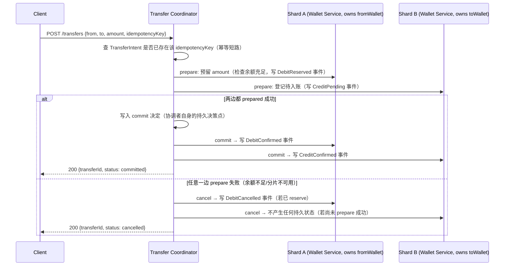

# 设计题解：数字钱包（Digital Wallet）

## 题目与范围

面试官通常这样开场："设计一个数字钱包：用户持有余额，可以互相转账，也可以从银行卡充值
或提现到银行卡。系统要保证余额既不会凭空消失，也不会凭空产生。" 这道题和[[solution-payment-system|支付系统]]
共享同一条底线——钱不能丢、不能重复——但难点完全不同：支付系统的难点是"如何安全地和
一个外部第三方（PSP）交互"，数字钱包的难点是**"两个账户各自的权威数据分别存放在我们
自己系统内部的不同分片上，一次转账天然需要跨两个分片原子地完成，而这几乎是每一笔转账的
常态，不是极端情况"**（见「深入探讨」第 1 节的计算）。PSP 集成、幂等发起收款、双录账本
的记账细节，本题不重复，统一交给 [[solution-payment-system|支付系统]]。

值得当场问清楚的澄清问题，以及它们各自改变的设计决策：

- **转账只发生在钱包之间，还是也包括银行卡充值/提现？** 两者都在范围内，但走完全不同的
  协调机制——钱包间转账的两个参与者都是"我们自己"的分片（内部协调，见「深入探讨」第 2
  节）；充值/提现的一端是外部银行/PSP（不受我们控制的参与者），这一段直接复用
  [[solution-payment-system|支付系统]]的幂等发起模型，本题只讨论它作为协调协议边界的
  影响。
- **转账要不要支持"部分成功"（比如批量红包）？** 不支持——每一次 `POST /transfers` 是
  单笔、原子的转账，批量场景是把多次单笔转账编排起来的上层问题，不在本题范围。
- **允不允许余额透支？** 不允许——这是贯穿整个设计的硬约束，决定了「深入探讨」里协调
  协议的选择必须能在提交前就拒绝会导致透支的转账，而不是先提交再补偿。
- **账户能不能在不停机的情况下从一个分片迁移到另一个分片？** 能，这是大账户量增长后
  必须支持的运维能力，见「深入探讨」第 5 节。
- **要不要支持多币种钱包？** 不支持——假设所有钱包使用同一结算币种，跨币种是双录记账
  和汇兑损益账户的问题，属于 [[solution-payment-system|支付系统]] 的范围扩展，本题不
  重复讨论。

**范围内**：钱包间转账的跨分片原子性、事件溯源的余额状态机、分片再平衡。**范围外**：
PSP 集成细节、双录记账的具体分录结构、多方对账（均见 [[solution-payment-system|支付
系统]]）、多币种、欺诈风控。

## 需求

**功能需求（驱动设计的 3–5 条）**

1. 用户可以把自己钱包里的余额转给另一个用户的钱包，转账要么完全生效，要么完全不生效，
   不存在"钱从 A 扣了、B 没收到"的中间状态被外部看到。
2. 转账后任意一方查询余额，都能看到与转账状态相符的余额——不能一个账户已经扣款、另一个
   账户还没收到的情况被永久卡住。
3. 用户可以从绑定的银行卡/PSP 充值到钱包，或从钱包提现到银行卡。
4. 并发的多笔转账不能让同一个账户的余额变成负数，即使这些转账几乎同时到达。
5. 任意一笔转账都可以追溯到它经过的每一个状态转移，用于客服排查和事故复盘。

**非功能需求（数字化）**

- **正确性是唯一不可协商的非功能需求**：宁可拒绝一笔转账、让用户重试，也不能让余额算错——
  这条和[[solution-payment-system|支付系统]]一致，是这一类题目共同的出发点。
- **延迟**：钱包间转账 P99 < 1s（用户在应用内发起转账后期望近乎实时看到结果，比银行卡
  收款的 3s 目标更紧，因为参与者都在我们自己的系统内部，没有外部网络调用）。
- **一致性**：转账落地（余额扣减与增加）必须**线性一致**，绝不允许最终一致——如果查询
  在转账完成后仍读到旧余额，用户会认为钱丢了；这直接排除了"先返回成功、后台异步同步两个
  分片余额"这一类设计。
- **可用性**：转账路径目标 99.95%，与账户可用性分层一致——某一个分片故障时，未涉及该
  分片的转账应继续正常工作（见「瓶颈、故障与演进」）。
- **持久性**：每一次余额变化都要能从事件日志重放复原，日志本身零容忍丢失（见「深入探讨」
  第 4 节）。

## 容量估算

本设计假设这是一个中等规模的 P2P 钱包产品，**假设 5000 万月活钱包用户，日均每个活跃
用户发起 0.5 笔转账**（这是本设计的假设，不是任何真实公司的披露数据）：

```
transfers/day = 50,000,000 × 0.5 = 25,000,000
avg QPS = 25,000,000 / 86,400 ≈ 289.4
peak QPS(×5，日内高峰系数) ≈ 1,446.8
```

**这不是这道题第一个决定架构的数字**——真正决定架构的是账户如何分片、以及一次转账
落在几个分片上：

```
假设按 account_id 一致性哈希，分 256 个分片
P(两个账户落在同一分片) = 1/256 ≈ 0.39%
P(两个账户落在不同分片，即这笔转账是跨分片的) ≈ 99.61%
```

**这是第一个、也是最关键的一个决定架构的数字**：256 个分片下，几乎每一笔随机的钱包间
转账都是跨分片的——这和很多"按某个自然维度分片后大多数事务天然同分片"的系统（比如按
`user_id` 分片、大多数操作只涉及一个用户自己的数据）完全不同。数字钱包的核心难点不能
靠"把热点数据搬到同一分片"绕开，跨分片原子性是**转账这个操作本身的常态**，不是需要特殊
处理的边界情况。这个结论直接排除了"先努力做同分片路由优化，再考虑跨分片"这类思路的
优先级——跨分片路径必须从第一天就是主路径，而不是补丁。

**存储**：本设计把钱包状态建模为事件溯源（event sourcing），每笔转账在发起方和接收方
各产生 2 个事件（reserve/confirm 或 credit-pending/credit-confirm)，共 4 个事件：

```
events/day = 25,000,000 × 4 = 100,000,000
每条事件约 200 字节（walletId + transferId + eventType + amount + seq + timestamp）
bytes/day = 100,000,000 × 200 = 2×10^10 B = 20 GB/天
bytes/year ≈ 7.3 TB，三副本 ≈ 21.9 TB
```

**这是第二个决定架构的数字**：7.3 TB/年不算小，但更重要的是**单个账户自己的事件流长度
会随账户寿命无限增长**——一个日均 20 笔转账的重度用户，5 年后自己一个账户的事件数：

```
events(heavy, 5y) = 20 × 365 × 5 × 2 = 73,000
```

73,000 条事件如果每次查余额都要从头重放，延迟会随账户年龄线性变差——这个数字直接决定
「深入探讨」第 4 节里快照（snapshot）的必要性和频率，而不是留到生产环境延迟劣化了才
补救。

## 核心实体与 API

**实体**

- **Wallet**：`id, ownerId, shardId, currency`——余额本身不作为可变字段存储，只是从
  `WalletEvent` 推导出的投影。
- **WalletEvent**：`walletId, seq(该 wallet 内单调递增), type(DebitReserved/
  DebitConfirmed/DebitCancelled/CreditPending/CreditConfirmed), transferId, amount,
  createdAt`——追加写、不可变，是这个账户唯一的权威数据源(与
  [[correctness.ledger|Ledgers & Reconciliation]]"balance 是推导值"同一原则，应用在
  事件流而不是账本分录上)。
- **TransferIntent**：`id, fromWalletId, toWalletId, amount, status(initiated/
  reserved/committed/cancelled), idempotencyKey, coordinatorShardHint`——一次转账的
  协调记录，由发起转账的协调者维护，是决定"这笔跨分片操作到底算成功还是失败"的单一
  权威判据。
- **ExternalLinkTransfer**：`id, walletId, direction(topup/withdraw), pspChargeId,
  status`——充值/提现记录，`pspChargeId` 指向 [[solution-payment-system|支付系统]]
  里发起的那一次收款/打款，本题不重复其内部结构。

**API**

```
POST   /transfers                {fromWalletId, toWalletId, amount, idempotencyKey}
                                  按 (fromWalletId, idempotencyKey) 幂等
                                  → {transferId, status}      # 同步等到 committed/cancelled
GET    /transfers/{id}           → 当前状态（用于超时后客户端查询真实结果）
POST   /topups                   {walletId, amount, pspPaymentMethodToken, idempotencyKey}
                                  → 转发到支付系统发起收款,收款成功后回调本服务记
                                    CreditConfirmed 事件
POST   /withdrawals               {walletId, amount, bankAccountToken, idempotencyKey}
GET    /wallets/{id}/balance     → 推导余额（快照 + 增量重放,见「深入探讨」第 4 节）
```

**故意不做的**：不支持一次调用转多个收款方（批量转账是编排层问题，不在本题范围）；不
支持客户端直接指定要不要走 2PC/TCC/saga 中的哪一种（协调机制由服务端按参与者类型
自动选择，见「深入探讨」第 2 节，不暴露这一实现细节给调用方）；`GET /transfers/{id}`
不支持长轮询，客户端超时后应主动查询而不是一直挂着连接等待(呼应
[[solution-payment-system|支付系统]]"超时当作未知，查询而不是盲目重试"的同一原则)。

## 高层设计



**协调路径**：Transfer Coordinator 对两个分片跑的是**内部两阶段提交（2PC）**——之所以
可行而不是像跨异构系统的 XA 那样"臭名昭著"，是因为 Shard A、Shard B 和 Coordinator
本身都活在**同一个强一致存储系统内部**（分片 = Paxos/Raft 复制组)，这正是
[[distributed.transactions.distributed|Distributed Transactions]] 里"内部 2PC 可行、
异构 2PC 是架构异味"这条判断标准的具体应用（见「深入探讨」第 2 节的展开）。存储技术类
选型是**支持跨分片强一致事务的分布式关系型存储（Spanner/CockroachDB 一类）**，因为需要
在 prepare 阶段原子地检查"余额是否充足"并锁定，checkAndReserve 必须和写入 `DebitReserved`
事件在同一个原子操作里完成。

**充值/提现路径**：`POST /topups` 不走内部 2PC——它的另一端是 PSP，一个我们无法要求它
参与我们协调协议的外部系统，这段协调完全交给 [[solution-payment-system|支付系统]] 的
幂等发起模型，钱包这一侧只在 PSP 收款确认后记一条 `CreditConfirmed` 事件，是纯粹的
单分片本地操作。

**读路径**：`GET /wallets/{id}/balance` 不重放全部历史，而是从最近一次持久化的快照开始
重放该快照之后的事件(见「深入探讨」第 4 节)，这与
[[correctness.ledger|Ledgers & Reconciliation]] 中"balance = snapshot + delta replay"
的原则完全一致，只是把它应用在事件溯源的领域对象上，而不是双录账本的分录上。

## 深入探讨

### 为什么几乎每一笔转账都是跨分片的

**问题**：多数需要水平扩展的系统会假设"大多数操作只涉及一个分片"，跨分片操作是少数
需要特殊处理的边界情况。数字钱包的转账天然涉及**两个不同的账户**，如果按 `account_id`
哈希分片，这个假设完全不成立。

**计算**：按 256 个分片、账户均匀哈希分布，任意两个账户落在同一分片的概率是
`1/256 ≈ 0.39%`，也就是说**99.61% 的转账是跨分片的**。更反直觉的是，分片数量增加不会
缓解这个问题，反而会让它更严重——分到 2,560 个分片（10 倍演进，见「瓶颈、故障与演进」）
后，跨分片概率升到 `99.96%`，几乎不再有"同分片"这个特例值得优化。

**这个数字决定的设计取舍**：既然跨分片是常态而不是特例，「深入探讨」第 2 节讨论的协调
协议就不能被当作"性能优化路径之外的兜底方案"，而必须是转账这个操作的**默认路径**、被
当作第一等公民设计和压测——按峰值 1,446.8 QPS 全部走跨分片协调来做容量规划，而不是假设
"大部分请求走更便宜的同分片快路径、只有少数走慢路径"。

### 2PC、TCC、Saga、事件溯源：按参与者是否"内部"选择协调协议

**问题**："转账要不要用分布式事务"这个问题问错了——真正该问的是"这次转账涉及的每一个
参与者，是不是都活在我们自己能够统一协调的系统内部"，答案不同，可用的协议集合完全不同。

**钱包间转账（两端都是我们自己的分片）**：[[distributed.transactions.distributed|
Distributed Transactions]] 里已有的结论——"内部系统里参与者是复制的 shard，一次参与者
故障是亚秒级 leader 切换而不是无限期悬置；一个团队掌控整个协议栈，可以协同优化"——直接
适用：两个钱包分片都是我们自己运维的同一套分布式存储的两个 Raft/Paxos 组，本设计对
钱包间转账采用**内部 2PC**（见「高层设计」），因为它能在 prepare 阶段就原子地检查并
拒绝会导致透支的转账，不需要事后补偿——这对"绝不允许负余额"这条硬约束是最直接的实现。

**充值/提现（一端是外部 PSP 或银行）**：外部系统不可能参与我们的 2PC 协调（它甚至不知道
我们的协调者存在），这正是 TCC（Try-Confirm-Cancel）存在的场景——**Try** 阶段只在我们
自己这一侧预留（钱包侧写 `DebitReserved` 或挂起提现请求，不真正扣款到账），**Confirm**
在 PSP 确认收/付款后才把预留转成最终状态，**Cancel** 在 PSP 失败时释放预留——TCC 不
要求外部系统参与我们的协调协议，只要求它自己的操作本身是幂等、可查询的，这一点和
[[solution-payment-system|支付系统]] 里"永远不要盲目重试 PSP 调用，而是查询真实状态"
是同一个约束的两种表现。

**更长的编排工作流（转账之外还有通知、积分、审计等非事务性副作用）**：这些步骤根本不是
支持 ACID 的资源，2PC/TCC 都不适用，只能用 **saga**——[[distributed.transactions.
distributed|Distributed Transactions]] 已有的结论"saga 放弃隔离性，中间状态可见，需要
语义锁"同样适用；本设计把它限定在转账**之外**的副作用编排上，核心的资金移动本身不使用
saga，因为 saga 天生允许"钱已经扣了、还没到账"这一中间态被外部读到，这违反本题「需求」
第 1 条。

**事件溯源不是协调协议的替代品，而是每个参与者内部的实现**：无论走 2PC 还是 TCC，钱包
自己这一侧记录状态变化的方式都是同一套——追加事件、余额从重放推导（见第 4 节）。协调
协议决定"跨参与者怎么达成一致"，事件溯源决定"单个参与者自己怎么记录和重建状态"，两者
是正交的，不是二选一。

### TCC 的三个经典陷阱：幂等、悬挂与空回滚

**问题**：TCC 把"提交"拆成 Try/Confirm/Cancel 三个独立的网络调用，任何一个都可能超时
重试或乱序到达——这比单次调用的幂等问题更复杂，因为 Confirm 和 Cancel 可能根本不知道
对应的 Try 有没有真的发生过。

**问题一：幂等**——协调者收不到 Confirm/Cancel 的确认会重试，如果分支操作本身不是幂等
的，重试会重复扣款或重复退款。

**问题二：空回滚（empty rollback）**——如果 Try 阶段因为网络问题从未到达某个分支，但
Cancel 却先到了（比如协调者判定整体失败，广播 Cancel），这个分支要在一个"从未 Try 过"
的状态上执行回滚。

**问题三：悬挂（dangling/suspension）**——Cancel 先于延迟的 Try 到达并执行完毕后，那个
姗姗来迟的 Try 才真正抵达，把资源重新预留了起来，而这次预留永远不会再被确认或取消，
变成一笔永久挂起的资源锁定——这是三个问题里最隐蔽的一个，因为它在正常压力下几乎不出现，
只在网络延迟抖动时才触发。

**方案（本设计采用，对齐 Apache Seata 的 TCC Fence 设计）**：给每个分支操作维护一张
独立于业务表的日志（`status ∈ {TRIED, COMMITTED, ROLLBACKED, SUSPENDED}`），且这张
日志的写入和业务操作本身在**同一个本地事务**里提交：Confirm/Cancel 执行前先按条件
更新这张日志的状态（`WHERE xid=? AND status=?`），已经是终态的直接返回而不重复执行
（解决问题一）；Cancel 执行前如果发现日志里**没有** Try 的记录，说明 Try 从未发生，
直接跳过业务回滚（解决问题二）；如果 Cancel 先到达且日志里也没有 Try 记录，则不是
简单跳过，而是**插入一条 `SUSPENDED` 状态的记录**，之后姗姗来迟的 Try 因为主键冲突
而被拒绝执行（解决问题三——用"抢先占位"而不是"事后检测"来防止悬挂）。这三条规则的
共同点是：**永远让后到达的操作查一次本地状态再决定要不要执行，而不是假设消息按发出
顺序到达**。

### 事件溯源与确定性状态机：余额如何从日志重放，快照多久打一次

**问题**：如果钱包的余额是通过重放 `WalletEvent` 序列推导的，这个推导过程必须是
**确定性**的——同一段事件序列，无论在哪个副本、哪个时间点重放，必须永远得到同一个
余额，否则一个分片故障后从事件日志重建状态，得到的余额可能和故障前不一致，这比丢数据
更危险，因为它不会报错，只会悄悄算错。

**方案一：把重放函数写成依赖外部状态的过程（比如查询当前时间、调用外部汇率服务）。**
两次重放同一段事件序列可能得到不同结果——这正是"确定性"被破坏的方式，而且很难在代码
审查里发现，因为它在正常运行时（只重放一次）完全不会暴露问题。

**方案二（本设计采用）：重放函数是一个纯函数（pure reducer）：`balance = reduce(
events)`，只依赖事件序列本身，不读取任何外部或可变的全局状态。** 任何时间、任何副本
重放同一段事件序列都得到相同结果，这是分片能够安全崩溃恢复、迁移（见第 5 节）、以及
被审计复核的前提。事件溯源社区的公开讨论（event-driven.io，见「来源与延伸」）特别
拿银行账户举例指出这个模式的一个真实陷阱：一个日均 3 笔交易的账户运行 17 年会累积约
18,600 个事件，如果不加节制地全量重放，账户越老读取越慢——这不是事件溯源本身的缺陷，
而是提醒"重放"和"存储"必须分开优化。本设计按第 3 节算出的数字（重度用户 5 年 73,000
个事件）设定：**每 500 个事件为该账户持久化一次余额快照**，当前余额 = 最近快照 +
快照之后的事件重放，快照本身允许丢失、随时可从完整事件历史重新计算——这和
[[correctness.ledger|Ledgers & Reconciliation]] 的账本快照设计是同一个模式，只是应用
在按账户聚合的事件流而不是全局账本分录流上。

### 分片再平衡：账户如何在不停机的情况下换分片

**问题**：随着账户数增长，某些分片会因为账户分布不均（比如某类高频用户集中）而变热，
需要把部分账户迁移到新分片；但一个账户在迁移期间如果正好有转账在途（已经 prepare、
还没 commit），迁移绝不能让这笔转账的状态在源分片和目标分片之间产生分歧。

**方案一：直接把账户数据复制到新分片，切换路由表。** 简单，但如果切换发生在一笔转账的
prepare 和 commit 之间，协调者可能对旧分片发 commit、而权威数据已经在新分片上，造成
状态永久不一致。

**方案二（本设计采用）：借助事件溯源的确定性重放，把迁移做成"冻结 → 排空 → 重放 → 
切换"四步。** 先把该账户标记为冻结（只拒绝新的转账 prepare 请求，不影响其他账户）；
等待该账户所有在途（已 prepare 未 commit/cancel）的转账全部结束（committed 或
cancelled）——这一步依赖协调者本身对每笔转账都有明确的终态记录（`TransferIntent.
status`），不会无限期等待；把该账户完整的事件序列复制到新分片，在新分片上用同一个
确定性 reducer 重放出相同的余额（重放结果和源分片重放结果必须逐字节相等，作为迁移
正确性的验证）；最后原子地切换路由表，解冻账户。整个过程里，唯一的不可用窗口是"排空
在途转账"的这一小段时间，而不是整个复制过程。

## 瓶颈、故障与演进

**热点与倾斜**：即使 256 个分片让绝大多数转账跨分片，单个分片依然可能因为**分片内**
某个高频账户（比如一个被大量小额转账指向的热门商户钱包）而产生和
[[solution-payment-system|支付系统]]"平台手续费账户"同样结构的热点——每一笔指向它的
转账都要在它的事件序列上追加写，这个热点的解法同样是 Uber 式短窗口批处理（见
[[solution-payment-system|支付系统]]「深入探讨」第 4 节，此处不重复其数字）。

**故障域**：

- **一个分片不可用**：只有涉及该分片账户的转账受影响——未涉及它的转账（跨越其他分片对
  的、或完全落在健康分片内的）继续正常处理，这是分片架构比单体账本更好的可用性隔离。
- **Transfer Coordinator 崩溃在 prepare 之后、commit 决定写入之前**：等价于
  [[distributed.transactions.distributed|Distributed Transactions]] 里 2PC 的"悬置
  参与者"问题——两个分片各自持有已 `Reserved`/`Pending` 的事件，等待协调者恢复后
  按其持久化的决策日志继续；协调者本身跑在 Raft/Paxos 复制组上，恢复是秒级选举而不是
  人工介入，这正是"内部 2PC 可行"的前提（见深入探讨第 2 节），如果协调者本身是单机、
  没有复制，这条故障处理就不成立。
- **TCC 的 Confirm 长期收不到确认（PSP 侧充值卡在处理中）**：钱包侧保持
  `DebitReserved`/挂起状态，不假装成功也不假装失败，直到 PSP 侧给出确定性结果（复用
  [[solution-payment-system|支付系统]]"超时当作未知，主动查询"的机制）。
- **事件日志存储不可用**：整个写路径 fail closed——没有事件日志就没有任何可以事后核实
  的依据，不能靠内存状态假装转账已完成。

**10 倍演进**：月活从 5,000 万到 5 亿，转账峰值 QPS 从 1,446.8 升到 14,467.6，分片数
相应从 256 增加到 2,560 左右以维持单分片负载不变——但如第 1 节算出的，跨分片概率不降
反升，到 99.96%，进一步确认"几乎所有转账都跨分片"这个假设在更大规模下只会更加成立，
不会随规模增长而缓解。Transfer Coordinator 本身如果是无状态的（决策日志下沉到复制
存储），水平扩展没有架构瓶颈；真正的压力落在跨分片 2PC 的绝对调用次数上。

**100 倍演进**：月活 50 亿（纯粹推演）。此时单一个全局路由表和统一的 Transfer
Coordinator 集群可能成为新的协调瓶颈——需要引入**协调者本身的分片/分区**（不同的
账户对由不同的协调者集群负责，类似 Spanner 论文里"跨越更多副本组的事务在物理上离得
更远、协调延迟真实增加"这一现实约束），并重新评估：当协调延迟因为地理分布而显著增长时，
是否要为"同城/同区域"的转账保留一条更快的内部路径，而把跨地域转账降级为异步确认——这
触及本题范围之外的地理分布式一致性问题，值得作为追问方向提出，但完整方案超出这道题。

## 面试官会追问什么

**中级（mid）**
- "如果两个账户恰好在同一个分片上，还需要走 2PC 吗？" 不需要——同分片转账可以在一次
  本地事务里原子完成，2PC 的两阶段网络往返完全可以跳过；但因为跨分片是常态（见深入
  探讨第 1 节），这只是一个局部优化，不能作为主设计路径。
- "为什么不能先扣钱、后台异步确认对方收到？" 这违反「需求」里"线性一致"的非功能需求——
  会出现一段时间里发起方已扣款、接收方还查不到钱，用户会认为钱丢了。

**高级（senior）**
- "TCC 的 Try 阶段预留资源，和直接同步 2PC 里的 prepare 阶段有什么本质区别？" 2PC 的
  prepare 要求参与者能被协调者统一驱动 commit/abort，隐含参与者理解并遵守这一协议；
  TCC 的 Try 只要求参与者提供三个独立、自成一体的业务接口（Try/Confirm/Cancel），
  参与者不需要知道自己在参与一个分布式事务——这正是为什么外部 PSP 只能走 TCC 式的
  交互，而不能被拉进我们自己的 2PC。
- "事件溯源的确定性 reducer 具体怎么测？" 用同一段历史事件序列在不同环境（不同时区、
  不同副本）重放两次，断言产出的余额逐字节相等；任何依赖 `now()`、随机数或外部查询的
  重放逻辑都应该在这类测试里被抓到。

**参谋级（staff）**
- "分片数量选多少合适？" 第 1 节的计算说明分片数越多，跨分片概率越趋近于 100%，所以
  "多分片=更少跨分片开销"这个直觉是错的；分片数的选择应该只由"单分片能扛住多大负载"
  决定，而不是指望靠分片数控制跨分片比例。
- "如果监管要求某些账户对之间的转账必须支持事后审计意义上的强顺序（不能乱序重放），
  怎么在保留事件溯源的同时满足?" 需要在事件本身里携带一个全局可比较的顺序号（而不
  是仅有账户内部的 `seq`），通常来自协调者的 commit 决定本身自带的全局时间戳或逻辑
  时钟，重放时按这个全局序而不是单账户内的到达顺序排序——这是事件溯源模型里"每个
  参与者自己的日志是本地全序，但全局因果序需要额外机制"这一经典问题在本题场景下的
  体现。

## 常见错误

- 只会说"用分布式事务"，说不清楚是内部 2PC 还是要跨外部系统的 TCC——这道题的核心判断
  力恰恰在于分清这两者，见深入探讨第 2 节。
- 假设"大部分转账在同一分片，跨分片是少数情况"，被要求算一下具体概率就说不出来——见
  深入探讨第 1 节，这个假设在按账户哈希分片的场景下几乎总是错的。
- 讲事件溯源只讲"存事件不存状态"，说不出重放函数必须是确定性纯函数这一约束，被问
  "如果重放逻辑依赖了当前时间会怎样"答不上来。
- 讲 TCC 只讲 Try/Confirm/Cancel 三个词，遇到"如果 Cancel 先于 Try 到达怎么办"（悬挂
  问题）完全答不上来。
- 把分片迁移想成纯粹的数据复制问题，忽略了迁移窗口内正在进行的转账需要被显式排空，
  而不是假设"复制得够快就不会有问题"。

## 五分钟讲法

This is a digital wallet where the defining fact, easy to miss, is that a transfer between
two random accounts is cross-shard almost all the time — with 256 shards hashed by account
id, the odds two accounts land on the same shard are about 1 in 256, so roughly 99.6% of
transfers cross a shard boundary, and that fraction only goes up as you add more shards for
scale. That single number means cross-shard coordination has to be the default path, not a
rare edge case bolted on later. For wallet-to-wallet transfers, both participants are shards
of the same internally-operated, strongly-consistent store, which is exactly the case where
two-phase commit is architecturally sound rather than the notorious XA-style failure mode —
the coordinator and both shards recover from a leader election, not an indefinitely stuck
transaction. Top-ups and withdrawals are different: the other participant is an external PSP
or bank that can't join our internal protocol, so that boundary uses Try-Confirm-Cancel
instead, where a fencing log keyed by transaction and branch id prevents the three classic
TCC failure modes — double-executing a retried confirm, rolling back a branch whose try
never happened, and a late try reserving a resource that will now hang forever. Inside each
shard, a wallet's balance is never stored directly — it's derived by replaying an append-only
event log through a pure, deterministic function, which is what makes it safe to rebuild a
shard's state after a crash and to migrate a single account to a new shard by freezing it,
draining its in-flight transfers, replaying its event history on the target, and only then
cutting over routing — verified by checking that the replay produces byte-identical balances
on both sides. Because a long-lived heavy account can accumulate tens of thousands of events,
balances are read from a periodic snapshot plus replay of only the events since, rather than
replaying from the beginning every time.

## 来源与延伸

- [Pat Helland — Life beyond Distributed Transactions: An Apostate's Opinion (CIDR 2007)](https://www.ics.uci.edu/~cs223/papers/cidr07p15.pdf)
  （学术论文，一手来源）：解释了为什么实践中放弃通用分布式事务、转而把实体作为原子
  更新的单位。本文与它的分歧在于：Helland 的论点是"完全避免跨实体的分布式事务"，本文
  认为钱包间转账无法回避——两个钱包账户本来就是两个不同的实体，本文的应对不是回避，
  而是区分"内部参与者可以用 2PC"和"外部参与者只能用 TCC"这两种场景分别处理。
- [Apache Seata — Alibaba Seata Resolves Idempotence, Dangling, and Empty Rollback Issues in TCC Mode](https://seata.apache.org/blog/seata-tcc-fence/)
  （开源项目官方博客，一手来源）：披露了 TCC Fence 方案的具体机制——一张独立的
  `tcc_fence_log` 表、按条件更新的状态机（`TRIED/COMMITTED/ROLLBACKED/SUSPENDED`）、
  与业务操作同事务提交。本文「深入探讨」第 3 节直接采用了这一机制来解释三个经典
  TCC 陷阱，并补充了"为什么这三个问题的根源是同一件事——后到达的操作没有查询本地
  状态就执行"这一结构性总结，原文分别描述了三个问题和三个对策，没有指出它们共享
  同一个根因。
- [Oskar Dudycz — Why a bank account is not the best example of Event Sourcing?](https://event-driven.io/en/bank_account_event_sourcing/)
  （事件溯源社区知名从业者的技术博客，一手来源）：指出银行账户是教学事件溯源的一个
  容易误导的例子——具体给出一个日均 3 笔交易的账户运行 17 年累积约 18,600 个事件这一
  真实计算，用来说明重放性能问题会掩盖事件溯源本身的价值。本文没有回避金融领域这个
  "困难例子"（数字钱包本身就是金融领域），而是直接把原文提醒的快照必要性用在了
  「深入探讨」第 4 节的具体快照频率设计上（每 500 个事件一次），原文停留在"这是个
  真实问题"的提醒层面，没有给出具体的快照策略。
- [Google — Spanner: Google's Globally-Distributed Database (OSDI 2012)](https://research.google.com/archive/spanner-osdi2012.pdf)
  （学术论文，一手来源）：披露了跨 Paxos 组的分布式事务由各组 leader 协同完成两阶段
  提交、协调者状态本身也是一个持久化的 Paxos 组这一真实架构，以及"跨越更多副本组的
  事务因为物理距离增加而拉高协调延迟"这一现实约束。本文「瓶颈、故障与演进」的 100
  倍演进部分引用了后一点作为地理分布式场景下协调者可能需要分区的论据；与原文的分歧
  在于本文额外讨论了协调者分区可能带来的"同区域快路径 vs 跨区域降级"这一权衡，原文
  没有涉及产品层面的路径分级设计。
