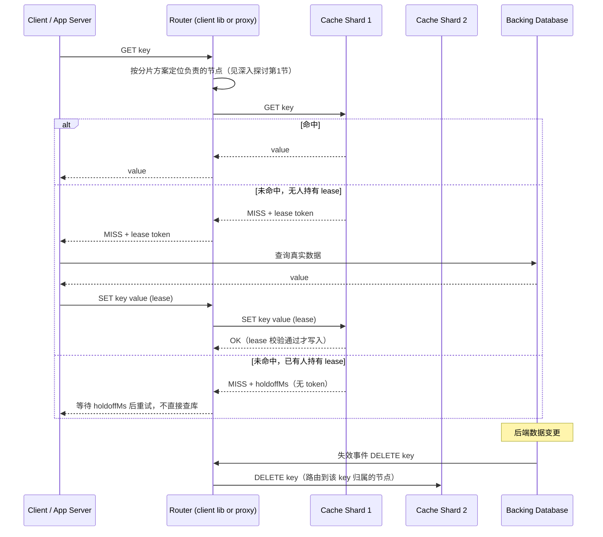

# 设计题解：分布式缓存（Distributed Cache，Memcached/Redis 风格）

## 题目与范围

面试官通常这样开场："在一个读多写少的应用前面设计一个分布式缓存层：应用先查缓存，命中
直接返回，未命中再查数据库并回填缓存。缓存节点数以百计，要求几十毫秒内返回，并且能在
不冲垮数据库的前提下水平扩展。"这句题看起来像[[solution-key-value-store|键值存储]]的
简化版——确实，分片、路由这些基础机制是共享的——但真正的难点恰恰在于缓存**不是**一个
更简单的键值存储：它明确放弃了持久性（数据丢了可以从数据库重建），却因此获得了一整套
键值存储不需要处理的新问题：读放大（一次页面请求触发几十上百次缓存查询）、驱逐
（内存有限，什么时候淘汰谁）、热键（一个 key 被打爆而其余节点空闲）、以及冷启动
（一个空的新节点/新集群怎么安全地开始接流量而不把数据库打垮）。

值得当场问清楚的澄清问题，以及它们各自改变的设计决策：

- **缓存丢失数据可以接受吗？** 可以——这是这道题和键值存储题最根本的区别，直接排除了
  quorum 写、hinted handoff、Merkle 树反熵这一整套为持久性服务的机制（这些机制及其
  取舍见 [[solution-key-value-store]]，本题解不重复），换来的是缓存节点可以做得更薄、
  更快。
- **是旁路缓存（look-aside/cache-aside）还是写穿（write-through）？** 本题按旁路缓存
  设计，这是 Memcached/Redis 在生产环境里最常见的用法——应用代码显式管理"先查缓存，
  未命中查库回填"的逻辑，缓存本身对数据来源一无所知。
- **要不要支持复杂数据结构（有序集合、哈希、计数器），还是只要 `get`/`set`/`delete`
  这类字节缓存？** 两者都要讨论，因为这直接决定 Memcached 还是 Redis 是更合适的技术
  选型（见「深入探讨」第 5 节），本题不预设答案，把这个选择本身当作核心讨论点。
- **可以接受短暂的驱逐抖动（thundering herd）吗？** 不可以——一个热点 key 过期的瞬间
  如果几百个请求同时穿透到数据库，会造成数据库侧的雪崩，这决定了 API 必须内建防击穿
  机制（见「核心实体与 API」）。
- **要不要跨数据中心复制缓存内容？** 只讨论单区域内的多可用区部署；跨区域复制（比如
  Netflix EVCache 那种全球复制）作为「来源与延伸」提及的真实案例，不展开具体拓扑。

**范围内**：分片路由（client-side / proxy-based / cluster 内建）、内存驱逐策略、热键
探测与缓解、节点/集群冷启动、Memcached 与 Redis Cluster 的架构差异。**范围外**：
持久化存储本身的复制与冲突处理（见 [[solution-key-value-store]]）、CDN 边缘缓存
（属于 [[solution-cdn]]）、应用层的缓存失效策略选型这一更通用的话题（属于
[[caching.invalidation|Invalidation & Eviction]]，本题只讨论驱逐，不重复失效策略本身）。

## 需求

**功能需求（驱动设计的 3–5 条）**

1. `GET key` 命中返回值；未命中返回明确的"未命中"信号，并给调用方一个凭证用于安全地
   回填（见「核心实体与 API」的 lease 机制）。
2. `SET key value [ttl]` 写入或更新一个 key，可选带过期时间。
3. `DELETE key` 移除一个 key（通常由后端数据变更触发的失效调用）。
4. 内存不足时，缓存按某种策略自动驱逐旧数据，而不是拒绝新写入或者让进程 OOM。
5. 集群可以在线增减节点，且单个节点故障只影响它负责的那部分 key 的命中率，不影响其余
   节点。

**非功能需求（数字化）**

- **延迟**：`GET` 的 P99 < 5ms——缓存存在的意义就是比数据库快一个数量级以上，这个数字
  比键值存储题的 300ms SLA 严格得多，因为缓存的价值恰恰体现在尾延迟上。
- **命中率**：目标稳态命中率 ≥ 98%——命中率不是锦上添花的优化指标，而是直接决定后端
  数据库承受多少流量的核心数字（见「容量估算」）。
- **可用性**：单个缓存节点或整个分片不可达时，系统可以短暂退化（命中率下降、延迟上升），
  但绝不能整体不可用——因为缓存从不是唯一数据源，即使全部缓存节点同时消失，请求也应该
  能（付出更高延迟的代价）直接回源到数据库。
- **一致性**：不保证缓存内容和数据库实时一致，只要求失效消息最终传播到所有节点，容忍
  P99 < 1 秒的失效延迟窗口。
- **内存效率**：目标每个节点的可用内存至少 90% 用于实际存储数据，元数据（key 索引、
  LRU 链表指针等）开销控制在 10% 以内。

## 容量估算

**基础假设**：一个日活（DAU）2 亿的应用，平均每个日活用户每天触发 15 次页面/接口请求，
每次请求平均读取 40 个不同的缓存 key（页面由多个独立组件拼装，每个组件各自查询自己的
缓存条目）。

```
total GET/day = 2×10^8 × 15 × 40 = 1.2×10^11
avg GET QPS   = 1.2×10^11 / 86,400 ≈ 1,388,889
peak GET QPS(×3) ≈ 4,166,667
```

**这是第一个决定架构的数字，也是缓存题和键值存储题容量估算的根本区别**：键值存储的
QPS 由"用户直接触发多少次操作"决定；缓存的 QPS 由"用户触发的每次操作，被页面组装逻辑
放大成多少次缓存查询"决定——这个放大倍数（本例中是 40 倍）本身就是这道题最重要的输入。
作为交叉验证：Facebook 公开披露过一次热门页面的加载平均会触发 521 次不同的 memcache
条目查询（见「来源与延伸」），比本题 40 倍的假设高一个数量级——这提醒我们放大倍数
高度依赖页面/接口的组合复杂度，是需要向业务方具体询问的数字，不能凭空假设。

**写入/失效流量**：缓存的写入主要来自两类——未命中后的回填，和后端数据变更触发的
主动失效。采用 Facebook 论文披露的真实读写比数量级（读比写高两个数量级，即约 100:1）
作为本设计的假设：

```
write/invalidate peak ≈ 4,166,667 / 100 ≈ 41,667
total ops peak        ≈ 4,166,667 + 41,667 ≈ 4,208,333
```

**命中率如何决定数据库侧负载，这是第二个、也是最该向面试官强调的决定架构的数字**：

```
DB QPS(hit rate = 98%) = 4,166,667 × (1 − 0.98) ≈ 83,333
DB QPS(hit rate 退化到 90%) = 4,166,667 × (1 − 0.90) ≈ 416,667
退化倍数 = 416,667 / 83,333 = 5.0×
```

命中率从 98% 掉到 90%——只掉了 8 个百分点——数据库侧负载暴涨 5 倍。这不是线性关系，
是"未命中率"这个小分母的倒数关系，[[caching-hit-rate-outage-math]] 这张卡片给出的正是
同一个数学结构。这个非线性放大直接决定了「瓶颈、故障与演进」一节里"缓存大规模失效为什么
是这套系统最危险的故障模式"。

**节点规模：技术选型本身改变了瓶颈所在**。假设一个 Redis 风格的单线程/核节点能稳定
承受 10 万次操作/秒，一个 Memcached 风格的多线程节点能稳定承受 50 万次操作/秒（两者
都是本设计的假设，量级上符合"Memcached 单实例吞吐通常比单个 Redis 分片高一个数量级"
这一业界共识，具体倍数因硬件而异）：

```
nodes(Redis 风格，按 QPS)      = 4,208,333 / 100,000 ≈ 42.1 → 43 台
nodes(Memcached 风格，按 QPS)  = 4,208,333 / 500,000 ≈ 8.4  → 9 台
```

再看内存：假设热数据工作集（working set）是后端总数据量 5TB 中最常访问的 20%，即 1TB，
每个节点提供 64GB 可用内存：

```
nodes(按内存，无副本)   = 1×10^12 / (64×10^9) = 15.6 → 16 台
nodes(按内存，1 副本)   = 16 × 2 = 32 台
```

**结论**：Redis 风格集群（43 台）是 QPS 主导——加内存对它没用，真正的瓶颈是单线程
CPU 吞吐；Memcached 风格集群（9 台按 QPS 计算）反而是内存主导（16–32 台）——同一个
工作负载，换一个技术选型，"容量估算里哪个数字才是真正的瓶颈"这个问题的答案会反过来。
这正是「深入探讨」第 5 节要具体展开的选型依据。

## 核心实体与 API

**实体**

- **CacheEntry**：`key, value, ttl, casToken`——一份缓存条目；`casToken`（compare-and-swap
  令牌）在每次值变化时递增，用于乐观并发的条件写。
- **Lease**：`key, token(64bit), issuedAt, holdoffMs`——`GET` 未命中时签发给第一个请求方
  的凭证，用于协调"谁有资格去数据库取数并回填"，见下方 API 和「常见错误」。
- **ShardMap**：`key range/slot → nodeId`——key 到物理节点的路由表，具体结构因分片方案
  （client-side 一致性哈希 / 代理 / Redis Cluster 哈希槽）而异，见「深入探讨」第 1 节。
- **HotKeyStat**：`key, requestsPerSec, fractionOfNodeTraffic`——客户端或代理侧采样统计
  的单 key 流量占比，用于触发「深入探讨」第 3 节的热键缓解。

**API**

```
GET    /cache/{key}
       → 200 {value, casToken}                      -- 命中
       → 210 {lease: token, holdoffMs}                -- 未命中，你是第一个请求方，
                                                          持有这个 token 去查库并回填
       → 210 {holdoffMs}（无 token）                  -- 未命中，但已有人持有 lease，
                                                          请等待 holdoffMs 后重试
                                                          （thundering herd 防护，见「常见错误」）

SET    /cache/{key}   {value, ttl, lease?}
       → 200                          -- 无 lease 的普通写；带 lease 的写只有在
                                          该 lease 仍然有效（未被更晚的写作废）时才生效，
                                          否则静默丢弃——这是 leases 解决"脏写盖新值"
                                          （stale set）问题的机制

DELETE /cache/{key}
       → 200   -- 幂等；对不存在的 key 也返回 200，用作后端数据变更后的主动失效
```

**故意不做的**：不支持跨 key 的事务或批量原子写（缓存条目彼此独立失效）；不在 API 层
暴露驱逐策略的调节旋钮给调用方（驱逐策略是集群级配置，见「深入探讨」第 2 节）；不支持
`SCAN` 类全量遍历作为常规操作路径（管理/调试用途走独立的低优先级接口，避免影响在线
延迟）。

## 高层设计



**路由层**：路由（router）把 key 映射到具体的缓存节点，具体是跑在客户端库里
（client-side sharding）、独立代理进程（如 Twitter 的 twemproxy、Facebook 的
mcrouter）、还是像 Redis Cluster 那样内建在节点协议里，是「深入探讨」第 1 节的核心
讨论。无论哪种形态，缓存节点本身都是**纯内存键值存储（Memcached/Redis 一类）**，
不写磁盘（或只做可选的、非关键路径的持久化）——这正是缓存和 [[solution-key-value-store]]
最根本的技术选型差异：后者用 LSM-tree 做持久化存储引擎，本题的存储层只是一张哈希表
加内存分配器。

**读路径**：应用先查缓存；命中直接返回；未命中时，第一个到达的请求拿到一个 lease
token 去数据库取数再回填，后续到达的请求看到"已被占用"的未命中状态后主动等待而不是
各自都去查库——这是「常见错误」里"没有 lease 机制会导致数据库被同一个 key 的重复请求
打垮"这个真实故障模式的直接对策。

**写路径/失效路径**：后端数据变更后，触发一次对应 key 的 `DELETE`（而不是 `SET` 新值），
理由见「深入探讨」第 2 节末尾的删除优先于更新原则；失效请求同样经过路由层，只需要
到达真正持有该 key 的那一个（或极少数几个）节点，不需要广播给全部节点。

**节点内部**：每个节点内部维护一个哈希表加一个驱逐结构（LRU 链表 / 近似 LRU 采样 /
按 slab class 划分的独立驱逐单元，见「深入探讨」第 2 节），当内存达到上限时，驱逐
结构决定牺牲哪些条目为新写入腾出空间。

## 深入探讨

### 分片与路由：client-side 哈希、代理，还是集群内建协议

**问题**：容量估算给出的结论是集群规模在几十台节点量级，且要求在线增删节点、单节点
故障只影响它自己负责的那部分 key。路由层要决定"谁知道 key 到节点的映射，以及这个映射
怎么随集群变化更新"。

**方案一：客户端内嵌一致性哈希（client-side sharding）**，每个应用进程自己持有分片
映射，直接连接目标缓存节点，这也是经典 Memcached 部署的做法（Memcached 服务端节点
之间完全不通信，彼此互不感知）。代价：集群拓扑变化（加减节点）必须推送给**所有**客户端
进程并保证它们及时更新，映射不一致的客户端会把请求发给错误的节点，产生短暂的伪未命中；
好处是没有额外的网络跳数，延迟最低。

**方案二：独立代理层（proxy-based sharding）**，如 Twitter 的 twemproxy 或 Facebook
的 mcrouter，客户端只需要知道代理的地址，分片逻辑和拓扑变化都由代理集中处理。代价：
多了一跳网络往返，代理本身要做到无状态、可以水平扩展，否则会变成新的单点瓶颈；好处是
客户端逻辑极简，拓扑变化对应用完全透明，这也是 mcrouter 在 Facebook 内部承担的真实
角色（同时还兼顾失效广播的路由，见下方「常见错误」）。

**方案三（本设计针对 Redis Cluster 部署采用）：协议内建的分片与重定向**。Redis Cluster
把整个 key 空间切成固定的 16384 个哈希槽（hash slot，`CRC16(key) mod 16384`），每个
主节点负责一部分槽位；客户端可以把请求发给集群中任意节点，如果这个节点不负责对应的
槽位，会返回一个 `-MOVED` 重定向错误告诉客户端真正的目标节点，客户端更新本地槽位表后
直接联系正确节点（见「来源与延伸」Redis 官方文档）。这既不需要中心化代理，也不要求
客户端预先知道完整拓扑——启动时只需要连接任意一个节点，靠重定向逐步学习完整的槽位
映射。

三者的本质区别在于**"谁为拓扑变化的收敛付出代价"**：客户端方案代价在应用侧（多进程
同步映射），代理方案代价在多一跳网络延迟，Redis Cluster 方案代价在短暂的重定向往返
（迁移期间的 key 需要 `-ASK` 二段式重定向，见来源文档)。本设计对 Memcached 风格的纯
字节缓存采用代理层（复用 Facebook/Twitter 验证过的路径），对需要复杂数据结构的场景
采用 Redis Cluster 的内建方案（避免额外引入并维护一层代理）。

### 内存压力下的驱逐：为什么不能用一个全局 LRU 链表

**问题**：容量估算给出 1TB 工作集、16–32 台节点的内存需求；一旦某个节点的内存打满，
必须有一个足够快的机制决定驱逐谁，而这个决定不能拖慢在线请求路径的延迟。

**方案一：全局精确 LRU（一条链表，每次访问都要移动节点）**。语义最精确——总是淘汰
真正最久未访问的条目——但每次 `GET` 都要在链表上做一次 O(1) 但需要加锁的移动操作，
在多线程节点上，这条链表本身会成为全局锁竞争点，直接违反 P99 < 5ms 的延迟需求。

**方案二（Memcached 采用）：按 slab class 分区驱逐**。Memcached 把内存预先划分成
固定大小的 slab（如 96B、120B、...一路到 1MB 的若干个 size class），每个到来的 value
被放进恰好能装下它的最小 slab class；驱逐只发生在**同一个 slab class 内部**，各个
class 各自维护独立的近似 LRU，天然避免了全局锁。代价是内部碎片（internal
fragmentation）——一个 100B 的 value 如果落进 120B 的 class，浪费的 20B 永远无法被
其他 class 借用，除非重启或触发昂贵的 slab 重分配。

**方案三（Redis 采用）：近似 LRU 采样**。不维护任何链表，`OBJECT` 的访问时间戳内嵌在
每个 key 的元数据里；驱逐时随机采样一小撮 key（默认几个），淘汰采样里最久未访问的一个，
反复几轮直到腾出足够空间。代价是"近似"——采样量越小，越可能淘汰到实际上不是全局最久
未访问的 key；好处是不需要任何全局锁定结构，采样的计算量和内存占用都是常数级。

本设计对两种技术都保留各自的默认驱逐策略而不强行统一，因为这个决策和存储引擎本身
（slab 分配器 vs 通用内存分配器）是耦合在一起的，与 [[caching-lru-vs-lfu]] 卡片讨论的
"该用 LRU 还是 LFU 这个访问模式层面的选择"是两个独立的维度：本节讨论的是"选定 LRU 之后，
分布式场景下怎么低成本地近似实现它"。

### 热键：单 key 流量集中到一个节点，分片再多都没用

**问题**：分片（无论哪种方案）保证的是**不同 key** 被打散到不同节点，但保证不了
**同一个 key** 的流量只会落在恰好负责它的那一个节点上——[[distributed.partitioning.skew|Hot Keys & Skew]]
描述的正是这类和分片总数无关的单点过载。有二手资料称 Facebook 见过单个 key 占到所在节点
请求量两成的情况（未在论文原文中核实）；无论具体比例是多少，结论都一样——这不是靠加节点
能解决的问题。

**方案一：不做特殊处理，依赖足够多的分片稀释概率**。分片再多，这个热 key 依然只落在
它所在的那一个节点上，节点数量和"这一个 key 会不会被打爆"毫无关系，这是最容易被
误判为"已经解决"的方案——日常流量下节点负载看起来均匀，直到某个 key 突然爆红才暴露。

**方案二（本设计采用）：客户端侧探测 + key 复制**。路由层或客户端库持续采样每个 key
的请求频率（[[distributed-hot-key-detection]]），一旦某个 key 的流量超过阈值，把它的
值复制成 `key#1`...`key#R` 若干份后缀变体分别存到不同节点上，读请求随机选择一个后缀
读取，把这个热 key 的读流量摊到 R 个节点上（[[caching-hot-key-replication]]）；代价是
失效时要广播给全部 R 个副本，且短暂时间内 R 个副本可能不完全一致。对于访问频率没高到
需要跨节点复制、但明显集中的次热 key，退而求其次用「深入探讨」第 1 节路由层前面的
一层进程内 L1 缓存吸收（[[caching-local-vs-remote]]），代价是多了一层需要独立失效的
状态。

### 冷启动：一个空节点或空集群怎么安全地开始接流量

**问题**：无论是扩容新增节点，还是整个集群重建，新节点在开始接流量的第一刻，命中率
是 0%——按容量估算的数学，命中率从 98% 掉到 0% 会让原本 83,333 QPS 的数据库负载瞬间
逼近未经缓存保护的原始 QPS 量级，这对任何数据库都是灾难性的冲击。

**方案一：让它硬扛未命中风暴（cold miss storm），逐步依靠正常读流量自然预热**。实现
最简单，不需要额外机制；代价是预热期间（可能长达数十分钟到数小时，取决于访问模式的
时间局部性）数据库持续承受远高于正常水平的压力，如果这台新节点恰好是在故障恢复场景下
紧急扩容的，这个代价发生在系统最脆弱的时刻，风险最高。

**方案二（本设计采用，对齐 Facebook 的区域池设计与 Netflix EVCache 的思路，见「来源
与延伸」）：从对等节点/区域预热**。新节点或新集群启动后，未命中时不直接查询数据库，
而是先查询一个已经暖机的对等节点或对等区域的缓存——Facebook 的做法是让冷集群的客户端
在未命中时先向一个指定的暖集群发起"远程查询"，命中则用它的值回填本地并返回，只有对方
也未命中才真正查库；Netflix EVCache 采用跨区域异步复制，让新区域的缓存内容尽量在接
生产流量前就已经和其他区域趋同。代价是这条"跨节点/跨区查询"路径本身需要独立的容量
规划和降级开关——预热完成后必须切换回正常路径，否则这条本该是临时的路径会变成长期
的隐藏延迟来源。

### 缓存不需要持久性，但仍然需要可用性：两种不同的故障应对哲学

**问题**：[[solution-key-value-store]] 里的 quorum、hinted handoff、反熵机制，整套
存在的理由都是"写入一旦确认成功就不能丢"；缓存明确放弃了这个约束（数据可以从数据库
重建），但仍然需要「需求」里"单节点故障不能拖垮整体"这条可用性要求——只是达成它的
手段完全不同。

**方案一（经典 Memcached 部署）：不做任何跨节点复制，节点故障 = 直接丢失它持有的那
部分缓存内容**。节点恢复或被替换后，它负责的 key 范围经历一次「深入探讨」第 4 节的
冷启动过程重新预热。代价是故障期间对应 key 范围的命中率归零，收益是节点本身极其简单
（没有复制协议、没有一致性问题）、内存利用率最高（不需要为副本预留一倍空间）。这个
选择背后的假设是：既然数据本来就允许丢失，复制换来的"故障时命中率不掉"这个好处，
不值得双倍的内存成本。

**方案二（Redis Cluster 默认部署）：每个主分片配一个异步复制的从节点，主节点故障后
自动选举从节点接管**。代价是双倍内存开销（本设计容量估算里"按内存、1 副本"的 32 台
就是这个代价的具体数字），故障转移期间仍有一个短暂的不可用窗口（Redis Cluster 官方
文档给出的经验值是节点超时时间加上一两秒的选举时间，见「来源与延伸」）；好处是命中率
在单节点故障时几乎不受影响，不需要依赖冷启动路径重新预热。

两者不是谁绝对更优，而是"内存成本 vs 故障期间命中率"这条取舍线在不同技术选型下画在
了不同的位置——这也是「容量估算」里 Memcached（QPS 主导，内存有富余空间做双倍副本
代价较低）和 Redis（本身已经是 QPS 瓶颈，双倍内存的边际成本更值得纠结）在这个决策上
经常得出不同结论的根本原因。

## 瓶颈、故障与演进

**热点与倾斜**：单 key 热点见「深入探讨」第 3 节；此外还存在"节点级倾斜"——如果分片
函数本身不够均匀，或者某个节点恰好被分到了系统性更热门的一批 key（比如按字母序切分
导致某个前缀段更热门），会造成某个节点持续过载而其余节点空闲，这和单 key 热点的区别
是需要靠重新分片而不是靠 key 复制解决。

**故障域**：

- **单个缓存节点不可达**：取决于「深入探讨」第 5 节的选型——Memcached 风格直接丢失
  该节点负责的命中率，等冷启动预热；Redis Cluster 风格由从节点接管，短暂不可用窗口后
  恢复。
- **命中率断崖式下降**（大规模缓存失效、批量重启、或错误的 TTL 配置导致大批 key
  同时过期）：按容量估算的数学，命中率每降 8 个百分点，数据库负载放大约 5 倍——这是
  这套系统里最危险的故障模式，因为它把"缓存层的问题"直接转嫁成"数据库层的问题"，而
  数据库通常没有为承受未缓存的原始流量做容量规划。缓解手段是给 TTL 加随机抖动
  （jitter）避免同批 key 同时过期，以及给数据库前加一层熔断/限流，防止缓存失效直接
  压垮数据库。
- **路由层（代理或客户端库）本身故障**：如果是代理架构，需要代理本身水平扩展加健康
  检查；如果是客户端内嵌方案，退化为单个应用实例的问题，不会波及其他应用实例。
- **数据库对新节点/新集群的冷启动失去保护**：见「深入探讨」第 4 节，如果没有对等
  预热路径，等同于直接把原始流量打向数据库。

**10 倍演进**：日活从 2 亿到 20 亿。峰值总操作数从约 420 万增长到约 4,200 万，Redis
风格节点数从 43 台增长到约 421 台，Memcached 风格从 9 台增长到约 84 台——单一分片
命名空间（无论是一致性哈希环还是 16384 个固定哈希槽）在这个规模下依然可行，但
Redis Cluster 的固定 16384 槽位数开始成为限制：槽位数不变而节点数增长到数百台，
平均每个节点负责的槽位数下降，单槽位承载的 key 数量相应增加，重分片时单次迁移的粒度
变粗——这是 Redis 官方文档里建议集群规模控制在千台量级以内的原因之一。

**100 倍演进**（纯粹推演，日活 200 亿）：单一缓存命名空间的运维复杂度本身成为主要
负担，通常的应对是按业务域或数据类型拆分成多个独立集群（会话缓存、内容缓存、计数器
缓存各自独立），而不是让所有类型的数据挤在一个无限增长的单一集群里——这和键值存储题
"按 user_id 物理隔离"是同一个思路，只是本题的隔离维度通常是业务域而不是用户分片。

## 面试官会追问什么

**中级（mid）**
- "缓存和数据库的数据不一致了怎么办？" 旁路缓存模式下永远存在短暂不一致的窗口，靠
  TTL 兜底收敛；对写后立刻要读到最新值的路径，绕开缓存直接读数据库，而不是想办法让
  缓存"永远一致"。
- "为什么失效用 DELETE 而不是 SET 新值？" DELETE 是幂等的——不管收到几次、顺序如何，
  结果都是"没有这个 key"；如果用 SET 广播新值，多个并发的失效事件之间可能因为到达
  顺序不同而让某个节点上残留一个过期的旧值，且这个错误无法通过重试自愈。

**高级（senior）**
- "客户端拿到 lease token 后一直不回来写怎么办？" `holdoffMs` 过期后，lease 失效，
  下一个到达的请求会重新拿到一个新 token 去查库，不会永久卡死在"等待第一个请求方"
  这个状态。
- "热键复制之后，怎么保证 R 个副本的失效不会有先后不一致的窗口？" 承认这个窗口存在
  （这正是「深入探讨」第 3 节里承认的代价），只能靠给热键复制配一个比普通 key 更短的
  TTL 来缩小窗口，而不是假装消除它。

**参谋级（staff）**
- "如果要把这套缓存从旁路模式改成写穿（write-through），最本质的变化是什么？" 缓存
  从"对数据来源一无所知"变成"是写路径的一部分"——一致性保证的责任从应用代码转移到
  缓存层本身，缓存节点故障对写路径可用性的影响会变得和键值存储一样直接，这实际上是
  在往 [[solution-key-value-store]] 的方向靠拢，需要重新引入它放弃掉的那套持久性
  机制。
- "怎么判断一个业务场景到底该用缓存还是该直接用一个可持久化的键值存储？" 看能不能
  承受"缓存全部清空后系统还能通过重新预热恢复正确状态"这个假设——如果某个 key 的
  权威值只存在于缓存里、丢了就永久丢失，那从需求上就不该叫它"缓存"，应该按
  [[solution-key-value-store]] 的持久性模型设计。

## 常见错误

- 把这道题当成"键值存储换个名字"，直接照搬 quorum/vector clock 那一套，却说不出
  为什么缓存不需要它们——没有识别出"允许丢数据"这个前提带来的整个设计空间的简化。
- 没有 lease 或等价的防击穿机制，被追问"一个热门 key 过期瞬间，一千个并发请求会
  发生什么"答不上来（一千次并发查库，而不是一次查库加回填）。
- 只讨论驱逐策略选 LRU 还是 LFU，却讲不清楚分布式场景下"怎么低成本地近似实现"这个
  真正的工程难点，把这道系统设计题答成了一道算法题。
- 忽略冷启动，被追问"新扩容的节点怎么安全地开始接流量"时才发现自己默认了"缓存一直
  是热的"这个不成立的假设。
- 混淆"缓存节点内部驱逐"和"缓存失效"两个概念，把"内存满了自动淘汰旧数据"和"数据变了
  主动通知缓存"当成同一件事描述。

## 五分钟讲法

This is a distributed cache sitting in front of a database, and the core difference from
a durable key-value store is that losing cached data is acceptable — which strips away
quorum writes and conflict resolution and replaces them with a different set of problems:
read amplification, eviction, hot keys, and cold start. My capacity estimate starts from
a fan-out multiplier — each user page load triggers around 40 distinct cache lookups, not
1 — which is why cache QPS at scale (around 4.2 million peak in my estimate) dwarfs the
underlying user action rate, and why hit rate, not raw throughput, is the number that
matters most: dropping from 98% to 90% hit rate multiplies database load 5x, because it's
the miss rate in the denominator that's shrinking. Routing keys to shards can live in the
client library, in a proxy layer like mcrouter, or inside the protocol itself the way
Redis Cluster's 16384 hash slots and MOVED redirects work — each pushes the cost of
topology changes to a different place. Eviction under memory pressure can't use one
global LRU list without becoming a lock bottleneck, so Memcached partitions eviction per
slab class and Redis approximates LRU via random sampling instead. A single hot key
overwhelms one node no matter how many shards exist, so I detect it and replicate it
under key suffixes to spread its read load. And a cold node or cold cluster with a 0%
hit rate would otherwise slam the database with the full miss storm, so instead of
warming purely from the database, it warms from an already-hot peer node or region first
— the same approach Facebook and Netflix use in production. Finally, because durability
isn't required, availability itself is achieved differently than in a key-value store:
either accept that a failed node's data is simply gone and re-warms naturally, or pay
double the memory for an async replica that fails over automatically — a trade-off whose
right answer depends on whether the cluster is already throughput-bound or has memory to
spare.

## 来源与延伸

- [Scaling Memcache at Facebook](https://www.usenix.org/system/files/conference/nsdi13/nsdi13-final170_update.pdf)
  （NSDI 2013 论文原文，一手来源）：本文的读写比两个数量级、单次热门页面加载触发约
  521 次不同 memcache 查询、gutter pool 约占集群 1% 节点、lease 机制解决 stale set
  和 thundering herd、mcsqueal 通过解析数据库提交日志做失效广播，均直接对齐这篇论文
  披露的真实机制。本文与它的分歧在于：论文描述的是 Facebook 单一真实部署的具体数字，
  本文把同样的机制套进一个假设的 2 亿日活场景重新推导了一遍容量估算，并额外加入了
  论文没有展开的"Redis 风格 vs Memcached 风格，同一工作负载下谁是 QPS 瓶颈、谁是内存
  瓶颈"这个对比。
- [Redis cluster specification](https://redis.io/docs/latest/operate/oss_and_stack/reference/cluster-spec/)
  （Redis 官方文档，一手来源）：给出了 16384 哈希槽、`MOVED`/`ASK` 重定向、gossip
  心跳故障检测和基于 epoch 的从节点选举这套协议内建分片机制的权威细节，本文「深入
  探讨」第 1 节和第 5 节直接引用了这份文档的机制描述。本文与它的分歧在于：文档本身
  是协议规范，不涉及容量规划；本文把"集群规模到千台量级时槽位数固定带来的限制"这个
  运维层面的推论加了进去，文档只是提到建议的节点数量级。
- [Caching for a Global Netflix](https://netflixtechblog.com/caching-for-a-global-netflix-7bcc457012f1)
  （Netflix 官方工程博客，一手来源）：披露了 EVCache 跨多个 AWS 区域的复制架构，用
  于让每个区域都能就近、以内存级延迟服务任意用户，是「深入探讨」第 4 节"从对等区域
  预热"这个冷启动方案的真实案例来源之一。本文与它的分歧在于：这篇文章的重点是
  "服务任意用户"的全球一致性体验，本文借用的只是它"新区域从已热的区域复制而不是从零
  预热"这一个具体机制，未涉及它更大篇幅讨论的跨区域路由和流量切换话题。
- [Caching with Twemcache](https://blog.x.com/engineering/en_us/a/2012/caching-with-twemcache)
  （Twitter/X 官方工程博客）：披露 Twitter 当年用数百台专用缓存节点、内存中约 20TB
  数据、服务超过 30 个业务方，每天承载接近两万亿次查询——本文将这组数字作为"缓存
  集群在大型社交类产品里的真实规模量级"的交叉验证，和本文自己容量估算里推导出的
  几十台节点规模不是同一家公司、不构成对同一事实的分歧，只是提醒读者真实生产环境
  的规模上限可以比本文的假设场景高出一到两个数量级。
