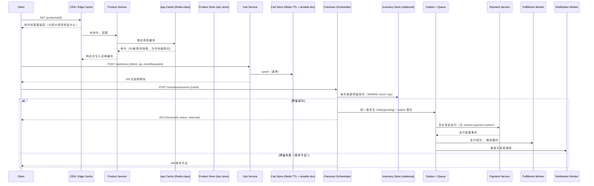

# 设计题解：电商平台核心购物流程（E-Commerce Platform，Amazon 一类）

## 题目与范围

面试官通常这样开场："设计一个电商平台的核心购物流程：用户浏览商品、加入购物车、结账
下单；商家维护自己的价格和库存。" 这句话听起来像是把好几道熟悉的子题（目录、购物车、
库存、支付、通知）拼在一起，但真正的难点恰恰在"拼"这个动作本身——**这几个子系统对"正
确"的定义互不相同、甚至互相冲突**：目录页允许价格过时几秒钟没人在意，库存扣减却必须
不多不少，订单一旦确认几乎不可撤销。候选人常犯的错误就是把整条链路当成一个数据库事
务来设计，而这在这道题给出的规模下从一开始就不成立。

值得当场问清楚的澄清问题，以及它们各自改变的设计决策：

- **单一自营商家，还是允许第三方商家入驻的市场（marketplace）？** 决定「深入探讨」第
  6 节要不要做——单一自营时价格/库存就是一份权威数据；市场模式下同一件商品可能有多个
  商家各自报价，需要额外一层"buy box"选择逻辑。本题按市场模式设计，因为这是 Amazon
  的真实产品形态，也是这道题真正的难点所在。
- **库存能不能接受轻微超卖、事后走补偿退款，还是绝对零容忍？** 决定「深入探讨」第 3
  节的库存预占时机——零容忍逼出更早、更强的锁定；容忍超卖换来更好的浏览体验和更简单
  的加购路径。本题假设"结账时刻不能超卖，但加购到购物车不是承诺"，这是绝大多数真实
  电商平台的选择。
- **要不要设计支付网关内部机制？** 不设计——幂等发起、账本、对账是一整道独立的题，
  见 [[solution-payment-system]]，本题只设计订单如何**调用**支付并处理它的成功/失败/
  超时结果。
- **要不要设计商品搜索的相关性排序？** 不设计——倒排索引、多阶段排序见
  [[solution-search-engine]]，本题的"商品页读路径"只覆盖**已知商品 id 的详情页**，不
  覆盖关键词搜索。
- **退款、仅退款与逆向物流走不走这次设计？** 不展开逆向物流本身，但订单失败时的补偿
  动作（库存释放、已扣款退款）属于本题范围，见「深入探讨」第 4 节。

**范围内**：目录只读展示、购物车、结账、库存预占与扣减、订单作为跨系统 saga、商品页
读路径的缓存分层、多商家市场的价格/库存归属。**范围外**：支付网关内部（见
[[solution-payment-system]]）、全文检索与推荐排序（见 [[solution-search-engine]]）、
逆向物流细节、客服工单系统、欺诈风控评分。

## 需求

**功能需求（驱动设计的 5 条）**

1. 用户可以浏览商品详情页，看到价格与库存状态（多商家时看到"当前最优报价"）。
2. 用户可以将商品加入购物车，购物车内容跨会话保留；未登录用户也能使用购物车，登录
   后与账号购物车合并。
3. 用户结账时，系统必须预留库存、发起支付，成功后生成订单；任一步失败要能安全回退
   ——不能出现"扣了库存却没收到钱"或"收了钱却没有订单"的状态。
4. 一个订单会驱动多个下游动作（库存扣减确认、履约通知、卖家通知、买家通知），这些
   动作必须最终全部完成，或者在任一步不可恢复失败时全部撤销到位。
5. 同一订单可能包含来自不同商家的商品，每个商家独立维护自己名下的价格和库存，退款
   与结算必须能按商家拆分。

**非功能需求（数字化）**

- **商品详情页读延迟**：`GET /products/{id}` 目标 P99 < 150ms——这是用户每天触发几十
  次的核心浏览交互，是本设计投入缓存分层最多的一条路径。
- **结账提交延迟**：`POST /checkout` 目标 P99 < 800ms（只到"订单已受理、saga 已启动"
  为止，不等待支付最终确认——那一段属于 [[solution-payment-system]] 的范围）。
- **可用性分层**：浏览路径（目录、商品页）99.99% 可用——这是流量入口，任何抖动都直接
  影响转化；结账路径 99.95%——短暂失败可以安全重试，但不能长时间不可用。
- **一致性分层，这是本题的核心**：库存在结账那一刻的扣减是**强一致**的（不能超卖）；
  商品页上展示的价格/库存允许**秒级陈旧**（最终一致，走缓存）；购物车是**最终一致**
  的（登录合并容忍短暂冲突）；订单一旦创建**绝不允许丢失**（durable，通过
  [[correctness.saga|Sagas]] 与 [[correctness.outbox|Dual Writes & Outbox]] 保证下游
  最终全部执行或全部补偿）。这四种保证分别对应四套不同的存储技术选型，见「高层设计」。

## 容量估算

**基础假设**：日活用户（DAU）5,000 万；平均每天访问 1.2 次，每次访问浏览 20 个商品
详情页。

```
product_views/day = 5×10^7 × 1.2 × 20 = 1.2×10^9
read QPS(avg) = 1.2×10^9 / 86,400 ≈ 13,889
read QPS(peak, ×3 日间峰值) ≈ 41,667
```

**购物车与结账漏斗**：假设 5% 的日活当天有加购行为（cart-active users），平均每人加
购 3 件；其中 40% 会真正进入结账流程，结账中 85% 完成支付并生成订单（其余在支付这一
步失败或放弃）。

```
cart-active users/day = 5×10^7 × 0.05 = 2,500,000
checkout starts/day = 2,500,000 × 0.40 = 1,000,000
orders/day = 1,000,000 × 0.85 = 850,000
order QPS(avg) = 850,000 / 86,400 ≈ 9.84
order QPS(peak, ×6 结账集中在晚间高峰) ≈ 59.0
```

**这是第一个决定架构的数字**：`read : write ≈ 13,889 : 9.84 ≈ 1,412 : 1`。和信息流类
问题一样，这个比例意味着商品页读路径必须几乎完全靠缓存/CDN 吸收，任何一次商品页请求
落到权威库存行上都是设计失败——这是「深入探讨」第 5 节的出发点。

**第二个决定架构的数字是库存扣减本身的 QPS**，而不是订单 QPS——一个订单平均包含 2.3
个商品行：

```
inventory decrement ops/day = 850,000 × 2.3 ≈ 1,955,000
decrement QPS(avg) ≈ 22.6
decrement QPS(peak, ×6) ≈ 135.8
```

这个数字（peak ≈ 136 QPS）**远低于**一个托管关系型主库在简单条件更新下的合理吞吐假
设（约 2,000–3,000 行/秒，这个假设和 [[solution-flash-sale]] 一文一致）。结论是：**普
通商品的库存扣减完全不需要 [[solution-flash-sale]] 里的 Redis 原子递减方案**，直接对
关系型库存表做一次 `UPDATE ... WHERE stock >= qty` 条件更新就够了——Redis 一类的原子
方案只在某个单一 SKU 的瞬时争用远超这个平均值时才需要（比如一场限时秒杀活动，此时这
个 SKU 的行为完全退化成 [[solution-flash-sale]] 那道题，直接复用它的方案而不是重新发
明）。

**存储**：多商家目录假设 5,000 万个"标准品"（canonical product，按 UPC/型号聚合），
每个平均有 3 个商家报价（seller offer）：

```
seller offers = 5×10^7 × 3 = 1.5×10^8
catalog metadata ≈ 5×10^7 × 3KB ≈ 153.6 GB，三副本 ≈ 460.8 GB
seller offers ≈ 1.5×10^8 × 200B ≈ 30 GB，三副本 ≈ 90 GB
orders ≈ 850,000/天 × 2KB ≈ 1.74 GB/天，一年 ≈ 635 GB，三副本 ≈ 1.9 TB
```

**结论**：和信息流类问题一样，这道题的字节数从来不是瓶颈（目录 + 一年订单加起来也就
TB 级），真正驱动设计的是**读写比例决定的缓存策略**和**库存扣减这个热点操作的吞吐
上限**——容量估算里最值得向面试官强调的正是这两点，而不是"一年存多少 GB"。

## 核心实体与 API

**实体**

- **Product**：标准品，`id, title, attributes{}, canonicalImageRefs[]`——多商家共享同一
  个 Product，各自的价格/库存是独立的 Offer。
- **Offer**：`id, productId, sellerId, price, quantity, condition(new/used), status`——
  市场模式下真正的"可购买单元"是 Offer，不是 Product。
- **Cart**：`id, ownerId(userId 或 anonymousId), items[], updatedAt, version`——匿名
  购物车和登录购物车是同一实体的两种归属，登录时触发合并（见「深入探讨」第 2 节）。
- **CartItem**：`offerId, quantity, priceSnapshot`——加购时快照价格，避免购物车里显示
  的价格和后续结账价格不一致造成困惑（最终成交价仍以结账时刻重新校验为准）。
- **Order**：`id, buyerId, items[], status(pending/reserved/paid/fulfilling/completed/
  compensating/cancelled), totalAmount, createdAt`——是本设计里唯一"绝不能丢"的实体，
  也是 saga 的状态机载体。
- **OrderItem**：`offerId, sellerId, quantity, priceAtOrder, fulfillmentStatus`——按
  商家拆分，因为同一订单要能各自结算、各自退款。
- **InventoryReservation**：`offerId, orderId, quantity, expiresAt, status`——结账时
  的软预留记录，不是最终扣减，见「深入探讨」第 3 节。

**API**

```
GET    /products/{id}                商品详情 + 聚合后的最优 offer（buy box）
GET    /products/{id}/offers         该商品的全部商家报价列表
POST   /cart/items                   {offerId, qty, clientRequestId}
                                      按 clientRequestId 幂等的加购
DELETE /cart/items/{itemId}
GET    /cart                         返回匿名或登录用户当前购物车
POST   /checkout/sessions            {cartId, clientRequestId} → {checkoutId, status}
                                      幂等创建结账会话，启动 saga（见「高层设计」）
GET    /checkout/sessions/{id}       轮询 saga 当前状态（不是同步等待完成）
GET    /orders/{id}
POST   /orders/{id}/cancel           只在 saga 尚未走到不可逆步骤时允许
```

**故意不做的**：不支持客户端提交最终成交价（价格永远由服务端在结账时刻重新校验，防
篡改）；不支持"给已提交订单追加商品"（必须取消重下，避免给状态机引入回退边）；不在
商品详情接口里同步聚合全部商家报价的库存（那是「深入探讨」第 6 节要解决的问题）；不
把购物车做成跨设备实时同步（合并只发生在登录这个动作上，不是持续同步，见「深入探
讨」第 2 节）。

## 高层设计



**读路径**：商品详情页请求绝大多数在 CDN 边缘直接命中返回，未命中才回源到 Product
Service，后者先查应用层缓存（Redis 一类），缓存里存的是"价格/库存快照"，允许落后权
威数据几秒——这正是容量估算里 1,412:1 读写比推出的必然结论。Product Store 本身用
**文档型存储（NoSQL doc store 一类）**，因为商品属性是半结构化、按品类差异很大的字
段集合，不需要跨商品的关系型约束。

**购物车路径**：Cart Service 把匿名购物车写入**内存数据结构存储（Redis 一类，带
TTL）**，登录用户的购物车额外持久化到一份耐久存储，写路径走 `clientRequestId` 幂等
（复用 [[correctness.idempotency|Idempotency]] 的模式）。

**结账路径**：Checkout Orchestrator 先对**关系型库存表**做一次条件更新完成预留(不是
最终扣减)，预留成功后在**同一本地事务**里写入 Order(状态 pending)和一条 outbox 事
件——这就是 [[correctness.outbox|Dual Writes & Outbox]] 模式，避免"库存已预留但订单
事件丢失"。此后所有跨系统动作(调用支付、通知履约、通知卖家)都由消费 outbox 事件的
worker 异步驱动，由 Checkout Orchestrator 承担的是**编排型 saga**的协调者角色(见「深
入探讨」第 4 节)——用**日志式消息队列(Kafka 一类)**承载事件，因为需要多个独立消费
者(支付触发、履约触发、通知触发)各自按自己的节奏消费同一份事件，并在故障后从 offset
重放。

## 深入探讨

### 五个一致性域：目录、购物车、结账、库存、订单，各自要什么保证

**问题**：把这五个子系统当成一个数据库事务来设计，是候选人最常见的失败模式——它们对
"正确"的定义根本不同，统一成一种一致性模型要么在读路径上过度昂贵，要么在写路径上过度
宽松而丢正确性。

**方案一：全部强一致**(单一关系型数据库，商品页也走 DB 实时读)。正确性上最简单，但
容量估算给出的 13,889 QPS(峰值 41,667)读流量直接打穿任何单机数据库的读吞吐——这不
是"能不能扩展"的问题，是同一份数据在同一时刻既要服务几万 QPS 的宽松读，又要服务几十
QPS 的严格写，用同一套机制维护是南辕北辙。

**方案二：全部最终一致**(库存也走异步扣减，失败后靠退款补偿)。读路径问题解决了，但
库存扣减一旦允许"先确认订单再校验库存"，会在流量突增时产生大量超卖，而这道题的需求
2 明确要求结账时刻不能超卖。

**方案三(本设计采用)：按子系统分别定级**。目录/商品页是**最终一致**(缓存优先，允许
秒级陈旧)；购物车是**最终一致**(登录合并容忍冲突，见下一节)；库存预占-扣减是**强一
致**(关系型条件更新，不能超卖)；订单一旦创建是**持久且不可丢失**，但驱动下游的具体
时序是**最终一致的 saga**(通过 outbox 保证"事件不丢"，通过幂等保证"重复执行不错")。
这五种保证映射到「高层设计」里五种不同的存储技术选型——这正是这道题和单一子系统题目
(比如只设计购物车，或只设计库存)最大的不同：**没有一种存储能同时高效满足全部五种
保证，分层本身才是设计**。

### 购物车：匿名 vs 登录，登录时合并，放哪、耐久性有多强

**问题**：未登录用户也要能用购物车(否则强制注册会直接损失转化率)，但匿名身份没有一
个稳定的账号 id 可以长期关联；登录后，用户在这台设备匿名积累的购物车和账号已有的购物
车(可能来自另一台设备)需要合并成一份，而合并本身没有唯一正确答案。

**方案一：不支持匿名购物车，强制先登录**。实现最简单，没有合并问题，但直接把"随便逛逛"
的用户挡在加购这个转化漏斗最外层——这是产品决策上通常不可接受的代价。

**方案二：匿名购物车用浏览器本地存储(client-side only)，完全不落库**。零后端成本，但
换设备/清缓存直接丢失购物车，也无法在登录后与账号购物车合并——对多设备用户体验很差。

**方案三(本设计采用)：匿名购物车用一个短生命周期的匿名 id(cookie/设备指纹)作为
key，写入**内存数据结构存储(Redis 一类)**,TTL 设为 30 天；登录购物车持久化到账号维
度的耐久存储。登录动作触发一次**显式合并**，而不是持续同步——这是关键简化，合并只发
生一次，不需要处理两份购物车实时并发修改的一般情况。合并策略：同一 offerId 取数量较
大者(倾向于不丢失用户的加购意图)，不同 offerId 取并集。这个设计选择呼应 Dynamo 论文
里"购物车服务必须在网络分区下依然可写"的动机(见「来源与延伸」)——本题的匿名购物车
走 TTL 缓存而不是 Dynamo 论文里的向量时钟(vector clock)多版本方案，因为购物车丢失
的代价(用户重新加购几件商品)远低于 Dynamo 论文描述的规模和写可用性要求，一个会在
TTL 内因缓存驱逐而丢失的匿名购物车是这道题可以接受的权衡，不需要为它引入多版本合并
的复杂度。

### 库存预占：加入购物车时占，还是结账时占——超卖与"假库存"的权衡

**问题**：库存预占得太早(加购时就锁)，会在购物车里躺着不结账的商品上白白占用库存，
制造"假库存"(phantom out-of-stock)——别的想买的用户看到无货，实际上只是有人加购了
没付钱；预占得太晚(支付成功后才扣)，又会在结账瞬间出现两个用户同时抢最后一件库存都
显示"可购买"的超卖。

**方案一：加购时就预占库存**(占用直到用户主动移除或购物车过期)。彻底消灭结账时的
超卖，但购物车平均停留时间往往是几十分钟到几天，乘以峰值加购量，长期占用的"假库存"
规模会显著大于真实在途库存——尤其对热门商品，伤害比超卖更普遍。

**方案二：完全不预占，支付成功那一刻才扣减**(依赖支付本身的原子性兜底)。加购和浏览
体验最好，但两个用户同时对最后一件库存发起支付，都可能收到"支付成功"的确认，之后才
发现库存不够——这时补偿手段只有事后退款，对用户体验的伤害(先收钱又取消订单)比"结账
时提示库存不足"严重得多。

**方案三(本设计采用)：结账发起时做一次**有 TTL 的软预留**(见核心实体 InventoryReservation)，而不是加购时或支付成功后。`POST /checkout/sessions` 对库存做一次条件更新
(`stock -= qty WHERE stock >= qty`)，成功则把这部分库存"锁"给这个 checkout 会话，
TTL 通常设为 10–15 分钟(覆盖正常的支付表单填写时间);TTL 到期或用户放弃支付，预留自
动释放，库存归还。这把"假库存"的窗口从"购物车停留的几十分钟到几天"压缩到"支付表单
填写的十几分钟"，同时结账那一刻依然是强一致的条件更新，不会超卖。代价是极端情况下
(用户填了很久支付表单，预留刚好过期)会出现"结账中途库存被别人抢走"的体验，需要在
UI 上明确提示并允许重新加入购物车——这比"支付成功后才发现超卖"是可以接受的降级。

### 订单作为跨库存-支付-履约-通知的 saga：编排、outbox 与补偿

**问题**：一个订单确认后要驱动至少四个独立系统的动作(库存最终扣减确认、支付、履
约、通知)，这些系统分属不同的团队、不同的数据库，没有办法用一个分布式事务把它们绑在
一起——这正是 [[correctness.saga|Sagas]] 存在的原因，本题不重新论证编排(orchestration)
vs 编舞(choreography)的选择，直接采用编排(理由见该概念卡片)，这里聚焦这道题特有的
两个问题。

**第一个问题：补偿的顺序性**。如果支付先成功、库存扣减后失败，补偿动作是"退款"；如
果库存扣减先成功、支付后失败，补偿动作是"释放库存预留"——顺序不同，补偿的代价也不
同，退款涉及资金，比释放一个内存里的预留记录代价高得多。**本设计的选择**：让代价最
高、最难补偿的动作排在最后——库存预留(可逆，前一节的 TTL 机制本身就是补偿)在支付之
前完成，支付(涉及真实资金移动，补偿即退款)放在库存已经锁定之后；履约(一旦发货几乎不
可逆)必须等支付真正确认成功才触发。这是"pivot 放在最后"的具体应用。

**第二个问题：事件不能丢，也不能重复触发不可逆动作**。Checkout Orchestrator 对
Order 的状态写入和 outbox 事件写入在**同一本地事务**里完成，这就是
[[correctness.outbox|Dual Writes & Outbox]] 要解决的"写库和发消息不能各自成功一半"
的问题；下游 worker(支付触发、履约触发)按 outbox 事件的 id 做幂等消费(复用
[[correctness.idempotency|Idempotency]] 的去重窗口机制)，这样即使 outbox relay 重复
投递，也不会对同一个订单发起两次支付调用或触发两次发货。

### 商品页读路径：极高读写比下的缓存分层与价格/库存新鲜度

**问题**：13,889 平均 QPS、41,667 峰值 QPS 的商品页读流量，如果每次都查权威库存/价格
数据，会把结账路径本该独享的关系型主库读写配额挤占殆尽——但商品页展示的价格/库存又
不能陈旧到用户下单时发现价格对不上。

**方案一：商品页直接查权威库存表**。数据永远新鲜，但如「容量估算」所示，峰值读 QPS
是权威库存写 QPS(peak ≈136)的三百倍以上，任何为写路径优化的关系型主库都扛不住这种
读放大。

**方案二：商品页完全走静态 CDN 缓存，TTL 设置为几分钟到几十分钟**。读延迟和吞吐都最
优，但价格/库存变化后用户可能看到过时几十分钟的信息——对秒杀/限时折扣类场景会造成
"页面显示有货，点进去却提示无货"的糟糕体验。

**方案三(本设计采用)：分层新鲜度**。商品的静态部分(标题、描述、图片)走 CDN,TTL 可
以设得很长(小时级)，这部分几乎不变；价格与库存这两个易变字段单独走应用层缓存(Redis
一类),TTL 收紧到几秒到几十秒，缓存失效策略采用**写穿透(write-through)**——库存或
价格在权威表变更时同步更新这份缓存，而不是被动等 TTL 过期，这样正常情况下的新鲜度远
好于 TTL 本身允许的上限，TTL 只是故障时的兜底上限(呼应 AWS Builders' Library 里"软
TTL 触发刷新、硬 TTL 兜底可用性"的双 TTL 思路，见「来源与延伸」)。最终真正的权威判定
只在「深入探讨」第 3 节的结账条件更新那一刻发生——商品页上看到的"有货"永远只是一个
承诺，不是保证，这个语义需要在产品文案层面向用户传达清楚，而不是假装商品页的库存数字
是实时权威值。

### 多商家市场：buy box、库存隔离与跨商家订单拆分

**问题**：市场模式下同一个标准品可能有 3 个(平均)商家各自报价，商品详情页要展示一个
"最优推荐"(buy box)，但"最优"不是单纯比价——价格相同时发货速度、卖家评分、库存充
足程度都要考虑；更麻烦的是，一个订单里的商品行可能分属不同商家，退款、结算、履约通知
都要能按商家独立拆分，不能把整单当成一个原子单位处理。

**方案一：完全实时聚合**——每次商品详情页请求都查询该 Product 下全部 Offer，实时排序
选出 buy box。逻辑最简单、数据最新鲜，但排序需要读取全部商家的实时库存和评分数据，这
把「深入探讨」第 5 节好不容易压下去的读放大问题重新引入——一次商品页请求变成对多个
Offer 行的扇出查询。

**方案二：完全预计算**——后台定期(比如每小时)批量重算全部标准品的 buy box，写入商品
详情的缓存文档里。读路径重新变成单次查询，但价格战、库存售罄这类需要**立刻**反映的变
化会延迟到下一次批处理周期，对"限时降价"类场景不可接受。

**方案三(本设计采用)：预计算 + 事件驱动的增量刷新**。buy box 结果作为商品详情缓存
文档的一部分预先算好(解决读路径问题)；但当某个 Offer 的价格或库存发生变更时，由该
Offer 所属的写路径直接发一个事件触发**这一个商品**的 buy box 重算，而不是等下一次
全量批处理——这把"数据多新鲜"从"批处理周期"降级成"单次事件处理延迟"(通常秒级),
同时避免了方案一的读扇出。**订单拆分**：Order 在核心实体里已经按 `OrderItem.sellerId`
存了归属，结账 saga 在履约和通知阶段按商家分组触发，退款也按商家各自的
`OrderItem` 集合独立计算——这样一个订单在用户看来是一次购物体验，在后台却是若干个可
以独立追踪状态的子订单，这个"一次结账、多个独立履约单元"的模式和
[[solution-hotel-reservation]] 里"预订路径与库存权威来源分离"的思路同源：都是把用户
可见的单一动作，拆成多个各自独立的一致性单元来实现。

## 瓶颈、故障与演进

**热点与倾斜**：读侧热点是爆款商品的详情页(几十万人同时查看同一个商品，解决方式和信
息流的"名人热帖"是同一个问题——冗余复制到多个缓存实例，按请求而不是按商品 id 路由，
见 [[solution-payment-system]] 姊妹篇 solution-news-feed 的对应小节)；写侧热点是限时
促销 SKU 的库存扣减，这时不再是普通商品的几十 QPS，而是退化成
[[solution-flash-sale]] 描述的单 key 争用问题，直接复用它的准入控制 + Redis 原子递
减方案，而不是让这类 SKU 继续走普通商品的关系型条件更新路径。

**故障域**：

- **CDN/应用缓存不可用**：商品页读路径退化为直接查 Product Store，读延迟从
  P99<150ms 劣化到数百毫秒，吞吐能力也随之下降，但功能不整体不可用——这是唯一一个"降
  级而不是拒绝"的故障域。
- **购物车存储不可用**：加购功能暂停，已有购物车内容按最后一次持久化状态展示；结账路
  径不受影响(结账时会重新读一次购物车，如果购物车存储部分可用，读得到的用户可以正常
  结账)。
- **库存存储不可用**：结账路径必须整体拒绝新的预留请求(fail closed，而不是假装预留
  成功)——这是唯一"宁可不可用也不能出错"的组件，因为放行意味着直接超卖。
- **Payment/履约/通知任一下游不可用**：saga 在该步骤重试，订单停留在对应的中间状态
  (比如 `reserved` 但迟迟到不了 `paid`)，库存预留的 TTL 机制会在超时后自动释放，避
  免下游长期不可用时库存被无限期锁死。

**Black Friday(大促)流量**：假设大促当天订单总量是平常日的 5 倍，其中 60% 集中在 4
小时的主推窗口内：

```
orders_day(BF) = 850,000 × 5 = 4,250,000
orders_in_window = 4,250,000 × 0.6 = 2,550,000
QPS_in_window(avg) = 2,550,000 / (4×3600) ≈ 177.1
QPS_in_window(×2 doorbuster 突发) ≈ 354.2

views_day(BF) = 1.2×10^9 × 4 = 4.8×10^9
read_QPS_peak_window = (4.8×10^9 × 0.6) / (4×3600) ≈ 200,000
```

关键发现：**即使在大促窗口内，订单侧的突发 QPS(≈354)依然远低于关系型主库几千行/秒
的条件更新上限**，常规商品的结账路径不需要为大促单独扩容；真正需要提前准备的是读侧
的 20 万 QPS 峰值——这要求 CDN 和应用缓存在大促开始前**预热**(避免冷启动时全部回
源)，以及对被重点营销的"doorbuster"单品提前识别、单独接入
[[solution-flash-sale]] 的准入控制路径，而不是让它们和普通商品共用同一套库存扣减机
制被瞬时流量打垮。

**10 倍演进**：DAU 从 5,000 万到 5 亿，标准品从 5,000 万到 5 亿。商品详情缓存单一集
群不再现实，需要按 `productId` 哈希做物理分片的多个独立缓存集群；库存表本身也需要按
`sellerId` 或 `offerId` 分片，因为"一个关系型主库扛住全平台库存写"的假设在这个规模
下不再成立，不同商家的库存互不相关，天然可以水平切分，不需要跨分片事务。

**100 倍演进**：DAU 50 亿(纯粹推演)。全局单一的 Order 表按买家 id 分片已经不够，需
要同时支持"买家查自己的订单"和"商家查自己的销售记录"两个查询维度，这和信息流问题里
Follow 表需要双向高效查询是同一类问题；更重要的是，商品页的"分层新鲜度"策略本身要变
成**按商品热度动态调整 TTL**——热门商品需要秒级新鲜度并承受更高的写穿透开销，长尾商
品可以把 TTL 放宽到分钟级以减轻缓存集群压力，静态统一 TTL 在这个规模下会在两端都不
是最优解。

## 面试官会追问什么

**中级（mid）**
- "购物车能不能直接存在客户端(比如 localStorage)？" 能，对匿名用户是一个更便宜的选
  项，但换设备/清缓存会丢失，且无法在登录后跨设备合并——见深入探讨第 2 节的取舍。
- "为什么不在加购的时候就把库存锁定？" 会在热门商品上制造"假库存":购物车平均停留
  时间是几十分钟到几天，乘以加购量，长期占用的库存会显著大于真实在途量。

**高级（senior）**
- "库存条件更新失败(并发扣成负数)怎么处理？" 条件更新本身(`WHERE stock>=qty`)在
  数据库层面保证了不会出现负库存——失败的请求收到 409，不是先扣后回滚，靠的是这个
  WHERE 子句本身的原子性，不依赖应用层加锁。
- "如果一个商家把库存改成 0 但恰好有一个 checkout 正在这个商品的预留期内，该怎么
  办？" 已经完成的预留不受影响(预留记录独立于当前库存字段，只在创建时校验一次)；新
  的预留请求会读到最新库存并被拒绝——这是"预留是一次性判定，不是持续锁"的自然结果。

**参谋级（staff）**
- "多商家场景下，如果两个商家对同一标准品的库存字段各自独立扣减，怎么保证 buy box
  排序不会在极短时间内反复跳变(一个商家刚售罄又被选中)？" 需要给 buy box 结果本身
  加一个短暂的**稳定窗口**(比如几秒内不重新计算)，用极小的新鲜度代价换排序结果的
  视觉稳定性，否则用户会看到页面上的"推荐商家"反复闪烁。
- "如果结账 saga 卡在'支付已发起、结果未知'这个状态(PSP 超时)，而库存预留 TTL 即将
  到期，怎么办？" 不能简单地让预留过期释放库存——如果支付其实成功了，释放库存会导致
  "收了钱却告诉用户没货"。这类"结果不确定"的中间态需要单独的超时策略：先查询 PSP 的
  幂等状态接口确认真实结果(见 [[solution-payment-system]] 的超时歧义小节)，而不是让
  通用的 TTL 机制代替业务判断。

## 常见错误

- 把目录、购物车、库存、订单当成一个数据库事务设计，被追问"商品页 QPS 这么高你打算
  怎么扛"时才意识到读写路径需要完全不同的一致性模型。
- 加购时就预占库存，却算不出"假库存"在热门商品上积累的规模有多大——这道题需要把
  "购物车停留时间"和"库存预占窗口"这两个数字联系起来才能发现问题。
- 只讨论"如何防止超卖"，完全没考虑与它对称的"如何防止漏卖"(该扣的库存因为某个环节
  失败没扣，导致系统认为库存充足，买家却买不到)。
- 混淆多商家场景下"标准品(Product)"和"可购买单元(Offer)"这两个概念，把加购/下单
  写成对 Product 直接操作，忽略了到底是从哪个商家买的。
- 把订单的下游动作(支付、履约、通知)写成同步调用链，一个环节慢就拖垮整个结账请求
  的延迟，没有意识到这正是 saga + 异步事件驱动要解决的问题。

## 五分钟讲法

This is an e-commerce checkout flow, and the hard part isn't any single component — it's
that catalogue, cart, checkout, inventory, and orders each need a different consistency
guarantee, and forcing them into one model breaks something. Product pages are read
roughly 1,400 times for every order placed, so they have to be served almost entirely from
CDN and application cache with the price and stock fields refreshed on a short, write-through
TTL, while inventory itself stays strongly consistent through a conditional update at
checkout time. Carts split into an anonymous, TTL-bound copy in a fast key-value store and a
durable per-account copy, merged once, explicitly, at login — not kept in continuous sync,
which sidesteps the harder multi-writer merge problem entirely. The inventory question that
actually matters is timing: reserving stock at add-to-cart creates phantom stock-outs because
carts sit for a long time, while waiting until payment succeeds risks overselling the last
unit to two concurrent buyers, so I reserve with a short TTL — roughly the time it takes to
fill out a payment form — right when checkout starts, and only that reservation is strongly
consistent. Once an order is created it drives inventory confirmation, payment, fulfillment,
and notification as a saga, written through the same local transaction as an outbox event so
the event can never be silently lost, with compensations ordered so the hardest thing to undo
— fulfillment — only fires after payment is confirmed. A marketplace adds one more twist:
the buy box has to be precomputed for read performance but refreshed by an event the instant
a seller's price or stock changes, and every order line carries its own seller so refunds and
settlement split per seller instead of treating the order as one atomic unit. At Black Friday
scale the order-side burst stays comfortably inside a single relational primary's throughput,
so the real preparation is warming the read caches ahead of time and routing any deliberately
promoted "doorbuster" SKU into the flash-sale admission-control path instead of letting it
compete on the ordinary inventory path.

## 来源与延伸

- [Amazon Dynamo — SOSP 2007](https://www.allthingsdistributed.com/files/amazon-dynamo-sosp2007.pdf)：
  论文明确把购物车服务作为"必须始终可写、哪怕网络分区也不能拒绝用户操作"的动机案例，
  并用向量时钟做多版本合并、把冲突解决推迟到读时进行。本文购物车一节的分层与它的动
  机相同，但方案不同：本设计的匿名购物车走 TTL 缓存(丢失即重新加购)，登录购物车走一
  次性显式合并，而不是 Dynamo 论文的多版本向量时钟——因为这道题假设的购物车丢失代价
  远低于 Dynamo 论文描述的规模和可用性要求，不需要为它引入多版本合并的复杂度。
- [Amazon Builders' Library — Caching challenges and strategies](https://aws.amazon.com/builders-library/caching-challenges-and-strategies/)：
  提出用**软 TTL 触发刷新、硬 TTL 兜底可用性**的双 TTL 思路，以及"命中率不好的数据不
  值得缓存"的判断标准。本文「深入探讨」第 5 节的分层新鲜度策略(静态字段长 TTL、价
  格/库存字段短 TTL + 写穿透)直接采用了这个双 TTL 框架，并补充了一个这篇文章没有覆
  盖的具体问题：结账那一刻的权威判定如何和这层"允许陈旧"的缓存共存而不互相矛盾(见
  深入探讨第 3 节)。
- [donnemartin/system-design-primer](https://github.com/donnemartin/system-design-primer)
  （MIT 协议的开源社区仓库，非商业课程）：给出了缓存、分片、消息队列这些通用构件各自
  的基础权衡，但没有专门针对电商场景的方案。本文和它的差异在于：本文把这些通用构件按
  五个不同一致性域的具体需求重新组合(哪个域用哪种存储、哪种一致性)，而不是停留在
  "缓存能加速读、队列能解耦写"这一层通用结论。
