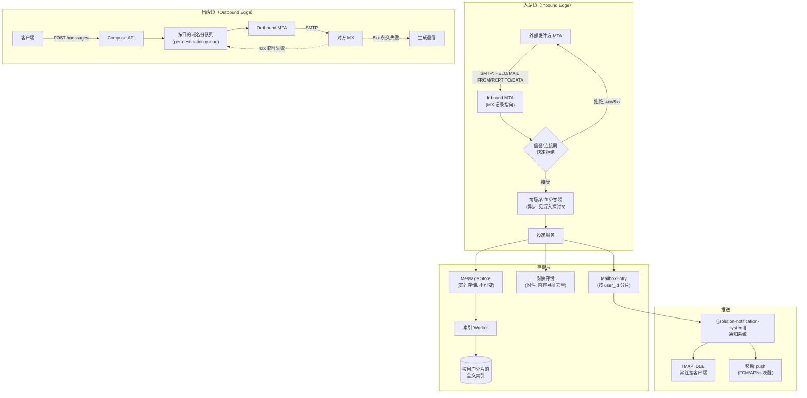

# 设计题解：邮件服务（Email Service，Gmail）

## 题目与范围

面试官通常这样开场："设计一个类似 Gmail 的邮件服务：用户可以收发邮件、组织收件箱、
搜索历史邮件。" 这句话背后真正的难点不是"存一封信"，而是**邮件服务同时是一个必须遵守
一份四十多年前设计、且你不能修改的公共协议（SMTP）的联邦系统，又是一个要在自己域内
把"列出收件箱""标记已读""全文搜索"做到毫秒级的存储系统**——协议层的约束（谁都可以给
你发信、你也发不出对方一定收）和存储层的自由度（收件箱内部结构完全由你设计）必须被
分开处理，混为一谈是这道题最容易踩的坑。

值得当场问清楚的澄清问题，以及它们各自改变的设计决策：

- **要不要自己实现 SMTP 服务器，还是只设计"收发信之后"的部分？** 决定入站边（inbound
  edge）和出站边（outbound edge）要不要展开讲；本题按"自己运营 SMTP 边缘"设计，因为
  这正是这道题区别于普通消息系统的地方（见「深入探讨」第 1、2 节）。
- **收件箱要不要支持全文搜索？** 决定要不要引入独立的搜索索引管道（见「深入探讨」
  第 5 节），以及它和站内搜索的分片策略有什么本质不同。
- **附件多大、要不要去重？** 决定附件走不走对象存储、以及容量估算里谁才是真正的存储
  瓶颈（见「容量估算」）。
- **垃圾邮件/钓鱼过滤要不要做？** 决定入站路径要不要插入一层内容分类（见「深入探讨」
  第 6 节），这也是这道题里"发送成功"和"对方真的收到并放进收件箱"之间的鸿沟所在。
- **要不要支持自定义域名收发（企业邮箱）？** 不做——本题只设计单一消费者域名下的邮箱
  服务，多域名路由、按域名的独立信誉体系不在范围内。

**范围内**：入站/出站 SMTP 边缘、邮箱存储模型（消息体、标签/文件夹、已读态）、会话
线索化（threading）、按用户的全文搜索、垃圾邮件与滥用过滤、推送到客户端、配额、可
送达性（deliverability）作为一等失败模式。**范围外**：富文本渲染引擎、日历/联系人等
邻接产品、企业级路由与合规存档、防病毒引擎内部实现细节。

## 需求

**功能需求（驱动设计的 3–5 条）**

1. 用户可以从任意发件人接收邮件（入站），也可以给任意收件人发送邮件（出站），双方
   不需要使用同一个邮件服务商。
2. 用户可以列出收件箱、按标签/文件夹组织邮件、标记已读/未读/星标，这些操作要快且
   不触碰邮件正文本身。
3. 相关的往返邮件在界面上聚合成一个会话（thread），而不是零散的独立条目。
4. 用户可以对自己全部历史邮件做关键词全文搜索。
5. 已知的垃圾邮件/钓鱼邮件在进入收件箱前被识别并分流到垃圾邮件文件夹，而不是要求
   用户逐条甄别。

**非功能需求（数字化）**

- **投递延迟**：同服务商内部用户之间，发送到对方收件箱可见，目标 P99 < 5 秒；跨
  服务商投递依赖对方 MTA 的响应速度，目标是"我方处理环节" P99 < 5 秒，不对全链路
  时延做承诺——这是本题和站内消息系统最大的非功能性差异，见「深入探讨」第 1 节。
- **列表/标记延迟**：`GET /mailbox` 与"标记已读"类操作 P99 < 150ms——这是用户每天
  触发几十次的核心交互。
- **搜索延迟**：`GET /search` P99 < 300ms，与站内搜索题的目标一致（见
  [[storage.search|Search Indexes]]），因为都是交互式操作。
- **可用性**：入站接收路径（决定"别人发给我的信会不会被拒收"）目标 99.99%——拒收
  在 SMTP 语义下是不可逆的，一旦对方收到永久性 5xx，邮件不会重投；发送路径与收件箱
  读路径目标 99.9%。
- **耐久性**：一封信一旦被我方 SMTP 边缘用 `250 OK` 确认接受，等同于对发送方承诺
  "由我方负责后续投递"（这是 SMTP 协议本身的语义，见「深入探讨」第 1 节），因此
  接受之后的耐久性要求等同标准对象存储/宽列存储的多副本耐久标准，不能丢。
- **一致性**：邮箱内的已读/标签状态是强一致（用户自己看自己邮箱不能有陈旧问题）；
  搜索索引和跨设备的收件箱视图允许最终一致，容忍落后新鲜度目标一个数量级以内。

## 容量估算

**基础假设**（本设计的假设，不代表任何真实邮件服务商的数字）：日活用户（DAU）
15 亿；人均每天收到 20 封信（含通知、营销、正常通信），人均每天发出 3 封。

```
收/天 = 1.5×10^9 × 20 = 3.0×10^10
收 QPS(均值) = 3.0×10^10 / 86,400 ≈ 347,222
收 QPS(峰值，×4) ≈ 1,388,889

发/天 = 1.5×10^9 × 3 = 4.5×10^9
发 QPS(均值) ≈ 52,083
发 QPS(峰值，×4) ≈ 208,333
```

**这个 ×4 的峰值系数不是拍脑袋的**：和「通知系统」一题的推理一致——真正陡峭的尖峰
不是个体用户的作息波动（那只会带来 2–3 倍的日间峰谷），而是批量发信方（新闻邮件、
营销活动）在几分钟内对上百万收件人发起的突发投递，这个突发同时体现在对方的"发"侧
和我方的"收"侧，所以两边采用同一个系数。

**存储：两类完全不同的数据，两种不同的副本策略**

邮件正文的**元数据与纯文本/HTML 部分**走宽列存储（Cassandra 一类），和「信息流」
一题的 Post Store 走同一种技术选型和副本约定（应用层三副本）：

```
每封信元数据 ≈ 3KB（头部 + 正文文本，不含附件）
元数据字节/天 = 3.0×10^10 × 3KB = 92.16 TB/天
元数据字节/年（1 份）≈ 33.6 PB
元数据字节/年（3 副本）≈ 100.9 PB
```

**附件**走对象存储（S3 一类），和「图片分享」一题的媒体存储走同一种技术选型——
**对象存储自身的纠删码/多副本机制已经提供耐久性，不再由应用层额外乘以副本系数**
（与 [[solution-instagram]] 的容量估算采用同一约定）。附件按内容哈希寻址
（content-addressed），这意味着去重发生在"发送事件"这一层，而不是"收件人数量"这
一层——同一封信抄送给一万人，附件字节只在对象存储里存一份，一万个收件人的邮箱条目
只是一万个指向同一对象的引用：

```
假设 15% 的发件事件带附件，平均附件（去重前）1.4MB：
原始附件字节/天 = 4.5×10^9 × 0.15 × 1.4MB ≈ 990.9 TB/天

假设其中 20% 的字节是内容哈希已存在的重复内容（病毒式转发、常见签名图片、
群发通知的相同素材）：
新增唯一附件字节/天 ≈ 990.9TB × 0.8 ≈ 792.7 TB/天
新增唯一附件字节/年 ≈ 289.3 PB
```

**这是第一个决定架构的数字**：附件的新增存储（289.3 PB/年）是元数据存储
（33.6 PB/年，1 份）的将近 9 倍，说明这道题的存储瓶颈几乎全部来自附件字节，而不是
邮件本身的文本——这直接决定了"附件必须走对象存储并做内容寻址去重"不是可选项，而是
容量估算逼出来的硬约束。

**配额该定多大，对谁才有意义**：

```
人均年存储增长 ≈ (元数据 33.6PB/年 + 附件 289.3PB/年) / 15 亿用户
             = (33.6×10^15 + 289.3×10^15) / 1.5×10^9 ≈ 215.3 MB/年
按 15GB 免费额度计算，普通用户填满配额需要 ≈ 71.3 年
```

这个数字说明：**对中位数用户而言，15GB 配额几乎从未成为约束**，配额存在的真正原因
是长尾——假设附件量排前 1% 的重度用户，附件产出是平均值的 20 倍，其年增长约
4.2GB，填满同样的 15GB 配额只需要约 3.6 年。配额是一个**保护存储成本长尾、而不是
约束中位数用户**的设计变量，见「深入探讨」第 7 节。

**搜索索引**：假设平均每个邮箱保留 5 万封可搜索邮件、每封信平均 15 个可索引词项、
每条倒排表条目（含位置/词频压缩）约 10 字节：

```
索引条目/邮箱 = 50,000 × 15 = 750,000
索引字节/邮箱 = 750,000 × 10B = 7.5 MB
全量索引字节（1.5×10^9 邮箱，1 份）≈ 11.25 PB
全量索引字节（3 副本，对齐「搜索引擎」一题的副本约定）≈ 33.75 PB
```

7.5MB/邮箱远小于一个分片能轻松容纳的量级——这是「深入探讨」第 5 节"按用户分片"
和「搜索引擎」一题"按语料分片"本质不同的数字基础。

## 核心实体与 API

**实体**

- **Message**：`id, fromAddr, toAddrs[], subject, bodyRef, headers{}, attachmentRefs[],
  receivedAt， sizeBytes`——不可变（immutable）的消息内容本体，一旦写入不再修改，是
  source of truth；`bodyRef`/`attachmentRefs` 指向对象存储中按内容哈希寻址的 blob。
- **MailboxEntry**：`userId, messageId, threadId, labels[], flags{seen, starred,
  deleted}， insertedAt`——每个用户对某封信的**可变视图**，是一份物化视图，可从
  Message + 用户操作日志重建；"标记已读"只改这一行的 `flags`，从不触碰 Message 本体。
- **Thread**：`threadId, userId, messageIds[], lastActivityAt`——会话聚合索引，见
  「深入探讨」第 4 节。
- **OutboundQueueEntry**：`messageId, destDomain, attempt, nextRetryAt, lastError`——
  按目的域名分队列的投递重试状态，见「深入探讨」第 2 节。

**API**

```
POST   /messages                  {toAddrs[], subject, body, attachmentRefs[], clientRequestId}
                                   按 clientRequestId 幂等 → {messageId}（进入出站队列，不等待对方 ACK）
GET    /mailbox?label=&cursor=    → {entries[], nextCursor}（列表，只读 MailboxEntry，不碰 Message）
POST   /mailbox/{messageId}/flags {seen: true}   单行 flag 更新，不重写消息体
GET    /threads/{threadId}        → 会话内全部 messageId，按时间排序
GET    /search?q=&cursor=         → {messageIds[], nextCursor}
POST   /attachments/upload-url    → {presignedUrl}（客户端直传对象存储，参考
                                   [[solution-instagram]] 的直传上传路径，本题不重复展开）
```

**故意不做的**：不在 API 层暴露 SMTP 协议细节给客户端（客户端只通过应用层 API 收发，
SMTP 只存在于服务端与外部 MTA 之间）；不支持撤回已经离开我方出站边缘的邮件（协议
语义上一旦对方 MTA 返回 `250`，这封信的所有权已经转移，见「深入探讨」第 1 节）；
不支持对附件本身做全文索引（只索引正文与主题，附件内容搜索是更大范围的功能）。

## 高层设计



**入站路径**：外部 MTA 按 DNS 里我方域名的 MX 记录发起 SMTP 连接。信誉/连接期检查
（见「深入探讨」第 6 节）在 `DATA` 命令之前就能拒绝掉相当一部分连接，省下解析正文
的成本；通过的邮件先被我方 MTA 用 `250` 确认接受（从这一刻起，投递责任转移到我方，
见「深入探讨」第 1 节），再异步交给垃圾邮件分类器和投递服务写入 Message Store、
对象存储和该用户的 MailboxEntry。索引 Worker 消费同一份写入事件，异步更新该用户
的搜索索引分片——这个模式和「信息流」一题里 Fanout Worker 消费 `PostCreated`
事件是同一个异步解耦思路，差别在于这里不需要"扇出给粉丝"，只需要写一个用户自己的
视图。

**出站路径**：`POST /messages` 只对 Compose API 做一次幂等写入就返回确认，不等待
对方 MTA 的响应——这把"发送成功"（我方已接受待投递）和"对方已收到"彻底解耦，后者
是「深入探讨」第 2 节要处理的异步重试问题。Outbound MTA 按目的域名分队列
（per-destination queue）发起真正的跨域 SMTP 会话，收到对方的 `4xx` 就把这条记录
放回本域名的重试队列，`5xx` 则生成退信通知发件人。

**存储技术选型**：Message Store 是**宽列存储**（Cassandra 一类），因为写入模式是
简单的按内容哈希/消息 id 追加，从不需要跨消息事务；MailboxEntry 同样是宽列存储但
按 `user_id` 分片，因为"列出收件箱"是对单一用户的范围扫描；附件走**对象存储**
（S3 一类），因为附件是不可变大二进制对象，天然符合"写一次、多次读"；搜索索引是
**倒排索引**（Elasticsearch 一类），按用户分片，见「深入探讨」第 5 节。

## 深入探讨

### SMTP 双向边：谁对"投递成功"负责，以及出站为什么必须按目的域名分队列

**问题**：SMTP（RFC 5321）本身不保证端到端的投递确认，它只定义"一跳的责任转移"——
一旦下一跳 MTA 对 `DATA` 结束符返回 `250`，责任就从发送方转移到接收方；如果发送方
自己就是最后一跳但暂时不可达，它必须自己排队重试，而不是简单地重发一次就放弃。这
意味着出站边缘天然是一个**每个目的域名独立的、有状态的重试系统**，而不是一次性的
RPC 调用。

**方案一：单一全局重试队列，先进先出重试所有失败投递**。实现简单，但一个响应缓慢
或临时故障的目的域名（比如对方 MTA 正在限流）会让排在它后面、发往健康域名的邮件
一起被延迟——这是经典的队头阻塞（head-of-line blocking），对方的问题变成了我方
全体用户的延迟问题。

**方案二（本设计采用）：按目的域名（destDomain）分队列**，每个队列独立维护自己的
退避（backoff）状态。一个域名的临时故障只影响这一个队列，其余域名的投递不受影响。
退避策略采用与 RFC 5321"必须支持排队重试"要求相容的常见做法：首次重试间隔 15
分钟，之后每次翻倍，上限 4 小时，累计重试窗口 5 天后放弃并生成永久退信——5 天不是
协议强制的数字，是本设计在"给临时故障足够恢复时间"和"不无限期占用队列资源"之间
选的一个假设值。

**这个设计需要多大的队列**：假设 2% 的发送在首次尝试时遇到临时（`4xx`）失败进入
重试队列，平均在队列里停留 6 小时（多次重试的加权平均）：

```
延迟入队/天 = 4.5×10^9 × 0.02 = 9.0×10^7
入队速率 ≈ 9.0×10^7 / 86,400 ≈ 1,041.7 条/秒
按 Little's Law，稳态队列深度 ≈ 1,041.7 × 21,600秒 ≈ 2.25×10^7 条
```

2,250 万条"在途"的重试记录说明这个队列必须是一个持久化的、可按 `destDomain` 高效
索引的存储，而不是内存里的一个列表——单机内存放不下，节点重启也不能丢失重试状态。

### 发件人信誉与 SPF/DKIM/DMARC：三者分别证明了什么，缺一个会出什么问题

**问题**：SMTP 协议本身（如上一节所说）不做任何发送者身份认证——`MAIL FROM` 里的
地址可以是任何字符串，没人会在协议层拦你。这意味着"这封信真的来自它声称的域名吗"
必须由 SMTP 之外的一整套机制来回答，而候选者不止一个，各自证明的东西完全不同，
混淆它们是这道题面试时最常见的错误。

- **SPF（RFC 7208）证明的是"这个 IP 有权代表这个域名发信"**：域名在 DNS 里发布一条
  TXT 记录列出被授权的发信 IP，接收方检查的是**信封发件人**（envelope `MAIL FROM`
  和 `HELO` 域名），**不是用户在邮件客户端里看到的 `From:` 头**。这意味着 SPF 通过
  不代表"用户看到的发件人"可信——一封信可以 SPF 通过，同时 `From:` 头伪造成任意
  地址。SPF 还有一个结构性弱点：**不能穿越转发**，因为转发者用自己的 IP 重新发出
  这封信，原始域名的 SPF 记录里不会包含转发者的 IP。
- **DKIM（RFC 6376）证明的是"这封信的这些字段自签名之后没有被篡改"**：发送域名用
  私钥对选定的头部字段和正文哈希签名，公钥发布在 `selector._domainkey.域名` 的 DNS
  TXT 记录里。规范明确要求 `From:` 头**必须**被纳入签名——这是它比 SPF 更强的地方，
  签名直接覆盖用户看到的发件地址。但 DKIM 同样不保证"签名域名"等于"用户看到的
  `From:` 域名"是同一个——规范原文明确说明签名标识符不要求匹配其他头字段；一个
  合法域名可以给伪装成另一个域名的邮件签上自己真实的、有效的 DKIM 签名。DKIM 签名
  在邮件正文被中间环节修改（例如某些邮件列表软件会在正文末尾追加内容）时会失效。
- **DMARC（RFC 7489）填的正是上面两者共同留下的空当**：它要求 SPF 或 DKIM 通过时
  验证的域名，与用户实际看到的 `From:` 头域名做"对齐"（alignment）——SPF 通过不够，
  通过时验证的域名还必须和 `From:` 一致；DKIM 签名有效不够，签名域名也必须和
  `From:` 一致。域名所有者据此发布策略（`none`/`quarantine`/`reject`），并通过
  聚合报告拿到"谁在冒充我的域名发信"的可见性——这是 SPF、DKIM 单独都给不了的东西。

**结论**：三者不是递进关系里"越新越强"，而是各自证明一个独立命题——SPF 证明
"传输路径合法"，DKIM 证明"内容完整性 + 签名者身份"，DMARC 证明"签名/传输身份和
用户看到的身份是同一个"。一封网络钓鱼邮件完全可能 SPF 和 DKIM 同时通过（攻击者
注册了一个新域名，给自己的新域名配好 SPF/DKIM），却因为 `From:` 头域名和 DKIM
签名域名不对齐而被 DMARC 拦下——这正是 DMARC 存在的理由。

### 发件人信誉如何变成一个可执行的入站过滤信号

Google 官方的批量发件人指南（见「来源与延伸」）给出了两个可以直接搬进设计的数字：
批量发件人（每天向该服务发送超过 5,000 封信）必须同时配置 SPF、DKIM、DMARC；被
Postmaster Tools 报告的垃圾邮件举报率必须低于 0.3%（建议控制在 0.1% 以下以承受
偶发波动）。这给了本设计入站边缘一个可执行的分层策略：新域名/新 IP（没有历史
举报率数据）默认进入"低信任"车道，邮件内容必须经过更严格的分类器复核；举报率长期
低于 0.1% 且通过完整 SPF/DKIM/DMARC 的发件人进入"高信任"车道，跳过部分内容检查，
直接投递——信誉不是一个二元的"允许/拒绝"标签，而是一个决定内容检查强度的连续变量。

### 邮箱存储模型：为什么一封信是"不可变内容 + 每用户可变视图"

**问题**：如果把"这封信是否已读""贴了什么标签"这些经常变化的状态和邮件正文存在
同一行记录里，每次标记已读都要重写包含大段正文的整条记录——写放大和正文大小成正比，
而实际变化的只有几个字节的 flag 位。

**方案一：单表存储，一行代表一封信在一个用户视角下的完整状态**（正文 + flags 同表）。
实现直观，但如上所述，标记已读这种高频、小改动的操作要付出重写大对象的代价；而且
同一封信抄送给多个收件人时，每个收件人各自一份完整正文副本，浪费存储（附件问题
在容量估算里已经通过对象存储 + 内容寻址解决，这里是同样的思路用在消息体本身）。

**方案二（本设计采用）：拆成 Message（不可变）+ MailboxEntry（每用户可变视图）
两张表**。Message 只在收到时写一次，此后永不修改；MailboxEntry 只存 `messageId`
引用加上这个用户视角下的可变字段（flags、labels、threadId），"标记已读"只是对
MailboxEntry 一行做一次几十字节的原地更新，完全不touch Message。这正是
[[storage.search|Search Indexes]] 所在域里"缓存/视图不是权威数据源"同一原则在
存储层的应用——MailboxEntry 本质上是可以从 Message + 用户操作日志重建的物化视图。
抄送给多个收件人的邮件，Message 只存一份，N 个收件人只是 N 行几十字节的
MailboxEntry，而不是 N 份完整正文。

**"列出收件箱"为什么便宜**：`GET /mailbox` 只需要在 MailboxEntry 上按
`(userId, insertedAt)` 做一次范围扫描，完全不读取 Message 表——分页返回的是
messageId 和摘要字段，正文只在用户真正点开一封信时才单独按 `messageId` 读取一次
Message。这个"列表页只读元数据、详情页才读大对象"的拆分，是这道题延迟目标
（列表 P99 < 150ms）能达成的根本原因。

### 会话线索化（threading）：一个可重建的索引，而不是重写历史消息

**问题**：用户期望看到的是"这一串往返邮件"而不是散落的独立条目，但把新回复插入到
一个会话时，不能去修改这个会话里已经存在的历史 Message（它们是不可变的）。

**方案（本设计采用）**：邮件头部本身携带线索化所需的信息——`In-Reply-To` 和
`References` 头（标准邮件头字段）记录了这封信是对哪封信的回复、以及整条回复链的
`Message-ID` 序列。收到一封新信时，投递服务检查它的 `References`/`In-Reply-To`
是否命中某个已存在的 `threadId`；命中则把新 `messageId` 追加进该 Thread 记录的
`messageIds[]`列表并更新 `lastActivityAt`；没有历史头信息可匹配时（比如老客户端
不发送这些头），退化为按规范化后的主题（去掉 "Re:"/"Fwd:" 前缀）加时间窗口做
启发式匹配。Thread 表和 MailboxEntry 一样是一份可重建的索引——它只是指针的集合，
真正的内容仍然只在 Message 里存一份，这个设计选择和上一节"不可变内容 + 可变视图"
是同一个原则的延伸，不是另一套独立机制。

### 按用户分片的全文搜索：和全局搜索引擎的分片策略本质不同

这一节建立在 [[solution-search-engine]] 的倒排索引机制之上（构建、近实时更新、
多阶段排序的具体原理不在此重复），只讲这道题里"每个用户的语料互相隔离"这一个
假设，把分片问题从根本上改变成了什么样子。

**全局搜索引擎的分片方式**（如「搜索引擎」一题所设计）：语料是全体用户共享的单一
集合，任何一个词项理论上可能出现在任意分片上，一次查询通常需要**扇出到多个分片**
再合并结果，长尾延迟由最慢的那个分片决定——这正是它需要专门处理"尾部放大"问题的
原因。

**邮件全文搜索的分片方式（本设计采用）**：每个用户的邮件语料互相隔离——你永远不会
搜到别人的邮件，这是产品语义本身的约束，不是优化。这意味着索引可以直接按
`user_id` 分片，而**一次查询天生只需要落在一个分片上**，不存在扇出和长尾合并的
问题。容量估算算出的 7.5MB/邮箱远小于任何一个分片的容量上限，这进一步确认了"一个
用户的索引完整放在一个分片"是可行的默认选择，不需要像全局搜索那样把一个用户的
语料本身再拆到多个分片。

**这个假设改变的不是"要不要做分片"，而是"分片要解决的问题类型"**：全局搜索引擎的
分片要解决的是"语料太大，一个节点放不下、一个查询要扇出很多分片"；按用户分片的
邮件搜索的分片要解决的是**热用户问题**——极少数邮箱（自动化脚本账号、长期归档
所有邮件的重度用户）的语料远超平均值的 7.5MB，如果按 `user_id` 直接哈希分片，
这些热用户会让所在分片的存储和查询负载显著失衡。解法是对分片使用一致性哈希
（consistent hashing）加虚拟节点（virtual nodes），并对单个分片持有的邮箱数设置
软上限，超出时把最重的少数邮箱整体迁移到专门的分片——这是"热 key"问题在"按实体
分片"场景下的变体，而不是「信息流」一题里"单个热帖被高并发读取"那种热 key。

### 入站过滤：两阶段防线与"分类器不可用时是否放行"的权衡

**问题**：每天 3.0×10^10 封信里，真正被投递到收件箱的只是其中一部分；如果对每一个
入站 SMTP 连接都跑一次完整的内容分类模型再决定要不要接受 `DATA`，连接期的计算和
延迟成本会随着"垃圾流量"的规模线性增长，而垃圾流量恰恰是这个成本里最大的一块。

**方案一：只做连接期的快速拒绝**（IP/域名信誉黑名单、连接速率限制），完全不检查
内容。便宜，但绕过已知信誉列表的新型钓鱼/垃圾邮件会畅通无阻地进入收件箱。

**方案二：对每个通过连接期检查的邮件都跑重量级内容分类模型再决定接受还是拒绝**。
准确率高，但拒绝必须在 `DATA` 阶段完成——SMTP 语义要求响应码在会话内同步返回，这
会让入站边缘的连接保持时间和重模型推理延迟绑死，在峰值 QPS 下不可行。

**方案三（本设计采用）：两阶段防线**。第一阶段在连接建立/`RCPT TO` 阶段做轻量检查
（IP 信誉、SPF 结果、连接速率），能在读取正文之前就拒绝掉一部分连接——假设 35%
的入站连接尝试在这一阶段被拒绝：

```
若 3.0×10^10 封/天是通过 DATA 阶段、真正进入投递流程的邮件数，
且这只占全部连接尝试的 (1 - 35%)：
总连接尝试/天 = 3.0×10^10 / 0.65 ≈ 4.615×10^10
被拒绝/天 ≈ 1.615×10^10，均值约 186,966 次/秒
```

第二阶段是**异步**的：邮件先被接受（`250`）并写入 Message Store，垃圾分类器在
投递服务写入之后并行判定，判定为垃圾的信只是被打上标签路由进垃圾邮件文件夹，而不
是同步阻塞在 SMTP 会话里。**分类器不可用时的权衡**：本设计选择"失败即放行"（fail
open）而不是"失败即拒绝"（fail closed）——因为拒绝路径会中断合法邮件的投递
（违反 99.99% 的入站可用性目标），而放行路径只是暂时降低了垃圾邮件过滤的准确率，
可以在分类器恢复后对滞留在低置信度队列里的信重新打分并补发到垃圾邮件文件夹，属于
可挽回的降级。

### 推送到客户端：常连接与唤醒式推送的边界，以及配额作为设计输入而不是事后限制

**推送**：邮件送达 MailboxEntry 后触发一个事件，具体的多渠道分发（去重、限速、
提供商故障转移、送达状态追踪）复用 [[solution-notification-system]] 的设计，本题
不重复展开。这里只讲邮件场景特有的两条通道：IMAP `IDLE`（常连接的桌面/第三方
客户端，服务器在有新信时主动推送未标记响应）与移动 push（应用不常驻连接，靠系统
推送服务把它从休眠唤醒，唤醒后客户端自己拉取增量，增量协议可以是传统 IMAP，也可以
是为移动场景设计的 JMAP——用状态号做增量同步而不是重新拉取整个文件夹，更省电、
更省流量）。假设 5% 的 DAU 同时保持 IMAP `IDLE` 常连接（其余走移动 push 唤醒），
沿用「聊天与消息」一题里"单机可稳定维持约 10 万条连接"的同一容量假设（同样是
Go/Netty 一类的常规商用长连接网关，没有理由假设这里的单机连接容量数量级不同）：

```
IMAP IDLE 并发连接 = 1.5×10^9 × 0.05 = 7.5×10^7
所需网关机器数 ≈ 7.5×10^7 / 100,000 = 750 台
```

**配额**：容量估算已经算出，配额对中位数用户几乎不构成约束（71 年才填满），真正
受配额约束的是产出附件远超平均值的长尾账号。这意味着配额不应该被当作"存储写满后
再拒绝新邮件"的事后兜底，而应该是投递路径上的一个**前置检查**——`MailboxEntry`
写入前先检查该用户的存储用量是否超过配额；超过时，新邮件仍然被 SMTP 边缘接受
（不能对外部发件人造成投递失败，那不是他们的责任），但转入一个"待清理"状态并提醒
用户清理，而不是静默丢弃或对外返回拒收——把配额当成前置的写入门槛而不是存储层的
被动溢出，才能保证"配额超限"这个用户自己的问题不会变成"外部发件人收到莫名其妙的
退信"这个协议层的问题。

## 瓶颈、故障与演进

**热点与倾斜**：写侧热点是极少数产出附件远超平均值的重度账号（见「深入探讨」第 7
节配额讨论），和极少数被大量群发/抄送命中的公共邮箱（比如一个客服邮箱地址）；读侧
热点是少数长期归档大量邮件的邮箱在全文搜索索引上的倾斜（见「深入探讨」第 5 节的
一致性哈希 + 软上限方案）。

**故障域**：

- **入站 MTA 集群不可用**：不是我方独有的灾难——SMTP 协议本身就假设接收方可能
  暂时不可达，外部发件方的 MTA 会按各自的重试计划（通常几天量级）反复尝试，这段
  时间内邮件既不会丢也不会立刻退信。这是这道题相对普通在线服务一个天然的缓冲优势，
  值得在设计里明确讲出来。
- **出站队列/Outbound MTA 不可用**：用户的"发送成功"确认不受影响（已经在「高层
  设计」里解耦），只是外发邮件积压在队列里，恢复后按各自 `destDomain` 队列继续
  投递。
- **垃圾分类器不可用**：见「深入探讨」第 6 节，选择 fail open，靠事后重新打分
  补救。
- **搜索索引 Worker 不可用**：索引落后于 Message Store 的写入，用户"刚收到的信
  搜不到"，但收发信本身不受影响——和「信息流」一题里 Ranking Service 不可用时
  退化为按时间排序是同一类"核心路径不受影响，只有增值功能降级"的故障域。
- **对象存储不可用**：新邮件仍可接受（正文元数据独立写入 Message Store），但带
  附件的邮件在附件上传/下载环节失败，需要让附件引用先以"待上传"状态存在，客户端
  重试上传，这和 [[solution-instagram]] 处理媒体上传失败的方式是同一个模式。

**10 倍演进**：DAU 从 15 亿到 150 亿。元数据存储（100.9 PB/年）和附件存储
（289.3 PB/年）都还是线性增长，真正需要重新设计的是搜索索引的热用户问题会更频繁
出现——需要把「深入探讨」第 5 节里"软上限触发迁移"从人工/定期任务变成实时自动化
的分片再平衡。出站边缘的按目的域名队列数量也线性增长，但队列本身无状态可水平
扩展，不是架构瓶颈。

**100 倍演进**：DAU 150 亿（纯粹推演）。入站信誉检查不能再只依赖静态 IP/域名
黑名单——在这个规模下，恶意流量本身也会规模化伪装成大量"看起来正常"的新域名，
连接期的信誉判断需要从"查表"升级成"实时行为异常检测"（短时间内同一网段发起
异常多的新连接、大量使用刚注册的域名等信号），这是「深入探讨」第 3 节"信誉是
连续变量"这个思路在更大规模下的自然延伸，而不是另起一套机制。

## 面试官会追问什么

**中级（mid）**

- "用户在客户端点击'发送'之后，多久能确定对方真的收到了？" 答不上"不确定，这
  取决于对方 MTA"就说明没理解 SMTP 是逐跳责任转移而非端到端确认——本题的出站
  设计只对"我方是否已尽力投递"负责，见「深入探讨」第 1 节。
- "'标记已读'为什么不能直接更新邮件正文那张表？" 考察是否理解不可变内容与可变
  视图分离带来的写放大差异（见「深入探讨」第 3 节）。

**高级（senior）**

- "SPF 都通过了，为什么还会收到钓鱼邮件？" 考察是否能准确说出 SPF 只验证信封
  发件人、不验证用户看到的 `From:` 头，需要 DMARC 才能把两者绑在一起（见「深入
  探讨」第 2 节）。
- "如果附件对象存储的某个区域不可用，正在写的这封信该怎么办？" 期待"元数据和
  附件分离写入，附件引用可以处于待上传状态并重试"，而不是"整封信写入失败"。

**参谋级（staff）**

- "为什么这道题的搜索分片策略和普通全文搜索引擎不一样？" 期待候选人主动指出
  "语料按用户隔离"这个产品语义本身就改变了分片要解决的问题类型——从"扇出到多
  分片、合并结果、处理长尾延迟"变成"极少数热用户的容量倾斜"，而不是简单地说
  "按 user_id 哈希分片"就结束。
- "如果要在不改变协议的前提下把入站接受延迟从秒级降到百毫秒级，权衡在哪？" 期待
  候选人指出这意味着连接期检查必须更激进（更多依赖静态信誉、更少依赖内容），
  会牺牲一部分准确率换延迟，需要用第二阶段异步分类补回来（见「深入探讨」第 6
  节），而不是无成本的免费午餐。

## 常见错误

- 把 SMTP 的"投递确认"和站内消息系统的"已读回执"混为一谈，说"发送后 5 秒对方
  一定收到"，没意识到对方 MTA 本身的可用性不在本方控制之内。
- 只说"用 SPF/DKIM 防钓鱼"，说不清楚这两者各自验证的是信封域名还是签名域名，也
  说不出为什么还需要 DMARC 做对齐。
- 把邮件正文和已读/标签状态放在同一张表、同一行，答不上"标记已读代价多大"这类
  追问。
- 把邮件全文搜索的分片策略直接照搬通用搜索引擎的方案，忽略了"语料按用户天然隔离"
  这个前提把问题从"扇出与长尾延迟"变成了"热用户容量倾斜"。
- 把配额设计成存储写满后的被动拒绝，而不是投递路径上的前置检查，导致外部发件人
  因为收件人自己存储超限而收到本不该由协议层承担的失败。

## 五分钟讲法

I'd frame Gmail-class email as two very different problems bolted together: a public,
forty-year-old protocol I don't control on the edges, and a storage system I fully
control in the middle. On the inbound side, SMTP only guarantees one-hop responsibility
transfer — once I return 250, the sending server's job is done and mine begins — so
authentication has to happen out-of-band through SPF, DKIM and DMARC, and those three
prove three genuinely different things: SPF proves the connecting IP is authorized for
the envelope sender, DKIM proves specific headers and the body weren't tampered with
after a domain signed them, and DMARC is the piece that forces the domain verified by
either of those to actually match the From: address the user sees — without DMARC, a
phishing email can pass SPF and DKIM cleanly using its own freshly-registered domain. On
the outbound side, since SMTP itself expects me to queue and retry rather than fire-and-
forget, I partition retry state per destination domain so one slow mail provider doesn't
head-of-line block delivery to everyone else, and a quick Little's-law estimate shows
that queue alone needs to durably hold on the order of twenty million in-flight retries
at any moment. Storage splits into an immutable Message store and a separate, per-user
mutable MailboxEntry view, so marking something read is a tiny row update that never
touches the message body, and capacity math shows attachments — deduplicated by content
hash at the object-storage layer — dominate storage by almost a 9-to-1 ratio over
metadata, which is why quotas matter for the long tail of heavy senders and are
essentially irrelevant for the median account. Search is sharded per user rather than
globally, which changes the problem from fan-out-and-long-tail-latency into a much
narrower hot-shard problem for the rare oversized mailbox. And the inbound spam pipeline
runs in two stages — a cheap synchronous reputation check before I even accept the
message, and a heavier asynchronous classifier after, fail-open on the async stage
because rejecting a legitimate sender is worse than a temporarily under-filtered inbox.

## 来源与延伸

- [RFC 5321 — Simple Mail Transfer Protocol](https://www.rfc-editor.org/rfc/rfc5321)：
  定义了 MX 路由、信封语义（`MAIL FROM`/`RCPT TO`）、以及最关键的"一旦返回 250，
  责任转移给接收方"这条规则。本题解「深入探讨」第 1 节的出站按目的域名分队列设计，
  以及「瓶颈、故障与演进」里"入站不可用不等于邮件丢失"的结论，都直接建立在这条
  规则之上；RFC 本身没有给出具体的重试时间表，本题解的 15 分钟起始、5 天放弃是
  本设计自己的假设。
- [RFC 7208 (SPF)](https://www.rfc-editor.org/rfc/rfc7208)、
  [RFC 6376 (DKIM)](https://www.rfc-editor.org/rfc/rfc6376)、
  [RFC 7489 (DMARC)](https://www.rfc-editor.org/rfc/rfc7489)：三份规范分别定义了
  「深入探讨」第 2 节里逐一拆解的三种证明。本题解与常见的"配置了就安全"式讲法不同
  的地方在于：明确指出 SPF 验证的是信封域名、DKIM 的签名域名可以和 `From:` 不一致，
  DMARC 存在的唯一理由就是把这两个域名和用户看到的域名强制对齐。
- [Google — Email sender guidelines](https://support.google.com/mail/answer/81126)：
  给出了本题解「深入探讨」第 3 节直接使用的可执行数字——5,000 封/天的批量发件人
  阈值、0.3% 的举报率硬上限（建议控制在 0.1% 以下）。本题解与这份文档的差异在于：
  文档本身是合规要求清单，没有把它转化成一个"信誉决定检查强度"的分层入站过滤
  设计，这一步是本题解自己做的。
- [RFC 9051 (IMAP4rev2)](https://www.rfc-editor.org/rfc/rfc9051) 与
  [RFC 8620 (JMAP)](https://www.rfc-editor.org/rfc/rfc8620)：分别定义了传统的
  UID/flag 邮箱模型与 `IDLE` 推送机制，以及为移动场景设计的状态增量同步协议。
  本题解「核心实体与 API」的 MailboxEntry 模型呼应了 IMAP 的 flag 设计但不照搬其
  按文件夹的层级结构；「深入探讨」第 7 节区分 IMAP `IDLE` 常连接与移动 push 唤醒
  两条通道，直接对应这两份 RFC 划分的历史/现代两种客户端连接模式。
