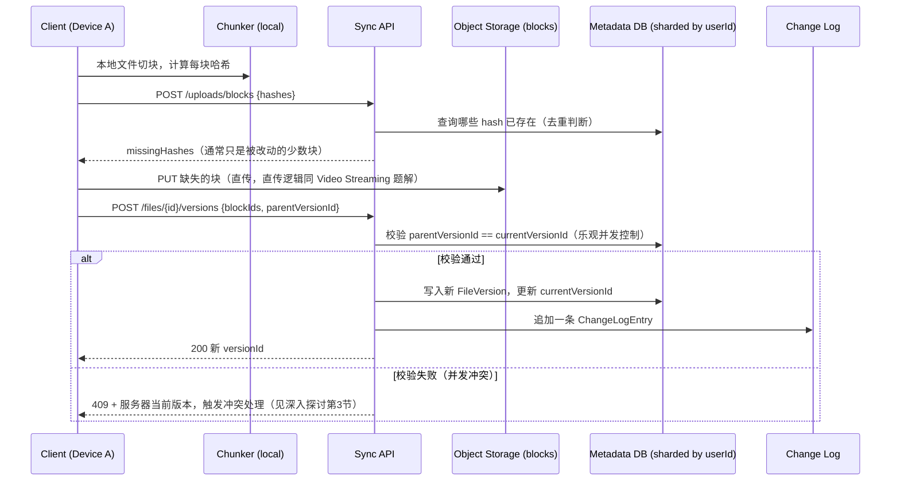
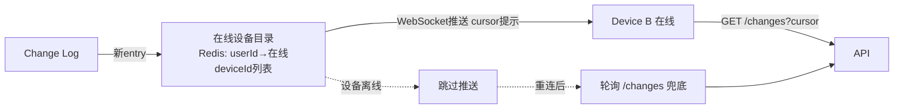

# 设计题解：文件同步系统（File Sync / Dropbox & Google Drive）

## 题目与范围

面试官通常这样开场："设计一个像 Dropbox 一样的文件同步系统：用户在一台设备上改了
一个文件，几秒钟内其他所有登录同一账号的设备都要看到同样的内容，网络断了也不能丢
改动。" 这句话背后有四个几乎独立的子问题——大文件如何高效传输、同一份内容如何跨用户
去重、两台设备同时改同一个文件怎么办、以及"文件树"这种层级结构的元数据怎么保持跨设备
一致——候选人最常见的失分点是只设计了"上传下载"，把冲突处理和元数据一致性当成事后
补充，而不是从一开始就纳入数据模型。

值得当场问清楚的澄清问题，以及它们各自改变的设计决策：

- **同步的是个人文件还是团队共享文件夹？** 团队共享把"元数据热点"从"极少数超大文件"
  变成"极多协作者同时写同一个目录"，是本题「深入探讨」第 5 节专门处理的场景。本题两者
  都覆盖，但假设团队共享文件夹是压力更大的那一半。
- **要不要做端到端加密（zero-knowledge encryption）？** 如果做，服务器再也看不到明文
  块哈希，跨用户全局去重收益直接消失——这是本题「瓶颈、故障与演进」里 10 倍演进最值得
  展开的权衡，本题默认不做端到端加密（服务器侧加密即可），但会在追问里讨论这个权衡。
- **文件版本历史（version history）要不要支持任意回滚？** 决定 Block 的引用计数能不能
  简单地"没人引用就删除"，还是要为历史版本永久保留。本题假设支持有限期（如 30 天）的
  版本历史，过期版本引用的 Block 才允许被垃圾回收。
- **离线编辑之后的冲突，要不要做语义合并（如 Google Docs 的 OT/CRDT）？** 那是
  Collaborative Editing 那道题的范围；本题的"文件"是不透明的二进制/文档 blob，冲突处理
  只到"保留两个版本"这一层，不做内容级合并。

**范围内**：分块（chunking）与内容寻址存储、跨用户去重、增量同步（delta sync）、多
设备间的冲突检测与处理、文件树元数据的一致性。**范围外**：文档内容的语义合并（OT/
CRDT）、端到端加密的密钥管理、团队权限模型的精细化设计（本题只做"能不能访问"这一层）、
客户端 UI/本地文件系统监听的实现细节。

## 需求

**功能需求（驱动设计的 3–5 条）**

1. 用户在任意一台设备上传/修改/删除文件，改动能被同一账号的其他设备发现并同步下来。
2. 大文件（数百 MB 到数十 GB）上传/下载支持断点续传，网络中断不用从头再来。
3. 只改动文件的一小部分时，同步只传输变化的部分，不重传整个文件。
4. 两台设备在断网期间对同一文件做了不同的修改，重新联网后系统能检测到冲突并保留
   双方的改动，不能静默丢弃任意一方。
5. 文件可以共享给其他用户，共享后的变更对所有有权限的协作者可见。

**非功能需求（数字化）**

- **同步延迟**：一台在线设备的改动，另一台在线设备感知到变更（而非下载完成）的延迟
  目标 P95 < 5 秒。
- **一致性模型**：**优先可用性，接受短暂的跨设备不一致**——本题采用
  [[distributed.consistency|Consistency Models]] 里的最终一致性（eventual
  consistency）作为跨设备视图的默认保证，单设备本地视图则要求读己之写
  （read-your-writes），否则用户在同一台设备保存后立刻刷新会看到旧内容，体验上不可
  接受。
- **数据耐久度**：文件内容存储在对象存储上，耐久度看齐 11 个 9（与 Video Streaming
  题解对
  [[storage.object|Object Storage & Separation]] 的假设一致）；元数据/版本历史至少
  三副本同步复制，避免单点丢失导致"文件在但历史没了"。
- **块大小（真实数字，非本设计假设）**：Dropbox 官方工程博客披露文件按 **4MB** 定长
  切块，最后一块不足 4MB 时补齐到文件真实大小，每块用 SHA-256 寻址（见「来源与延伸」）。
  这个数字是本题容量估算里增量同步收益计算的基础，而不是自己拍的。
- **带宽效率**：单次局部编辑触发的上传量应远小于整份文件——这是这道题的核心非功能
  要求，具体倍数见容量估算。

## 容量估算

**写路径：变更数据量与增量同步收益**

- 假设平台日活用户（DAU）5,000 万，人均每天产生约 50MB（十进制，50×10⁶ 字节）的
  新增/修改数据（本设计假设，覆盖文档、代码、设计稿等典型办公场景），则每天原始变更
  数据量 = 50,000,000 × 50×10⁶ 字节 = 2.5×10¹⁵ 字节 = **2.5 PB/天**（本节全程用十进制
  单位——1MB=10⁶ 字节、1PB=10¹⁵ 字节——计算，不与二进制 MiB/GiB 混用），一年约
  2.5 × 365 ≈ **912.5 PB**。这是"如果每次编辑都重传整份改动文件"的上界，是后续增量
  同步收益要对比的基准线。
- **块级增量同步的收益**：按 4MB 定长分块（Dropbox 真实数字），一个 200MB 的典型大
  文件（如一份设计稿或一个数据库导出）约含 200 ÷ 4 = **50 个块**。假设一次局部编辑只
  改动其中 2 个块（本设计假设，符合"编辑一份大文件的一小部分"这个常见场景），增量同步
  只需要上传 2 × 4MB = 8MB，而不是整份 200MB，带宽节省倍数 = 200 ÷ 8 = **25 倍**。
  **这一个数字直接决定了本设计必须做块级增量同步，而不是整文件重传**——如果不做增量
  同步，912.5 PB/年的写带宽在大文件占比高的团队场景下会再乘以数十倍，任何 CDN/对象
  存储出口成本都扛不住。
- **跨用户全局去重**：本设计**假设**语料库里约 30% 的块与其他用户已存储的块字节完全
  相同（常见安装包、公司模板、公开数据集等——这是本设计的假设，不是任何厂商披露的
  行业数字），启用跨用户内容寻址去重后，实际需要新写入的存储量 = 912.5 ×
  (1 − 0.30) ≈ **638.75 PB/年**，节省约 **273.75 PB/年**。这个节省是"以内容哈希做
  存储键"这个数据模型决定（见「核心实体与 API」）的直接收益，但也带来一个安全权衡
  ——**且这个收益只体现在磁盘存储上，不体现在网络带宽上**（见深入探讨第 2 节：账号
  范围限定的存在性检查会让客户端仍要把这些字节实际传一遍）。

**元数据路径：变更事件与多设备推送**

- 假设人均每天产生约 40 次会触发一次元数据写入的操作（保存、重命名、移动，本设计
  假设），平均元数据写 QPS = 50,000,000 × 40 ÷ 86,400 ≈ **23,148 QPS**。工作时段
  集中效应按 4 倍估算（本设计假设），峰值元数据写 QPS ≈ **92,593 QPS**——这个数字
  比任何单一关系型数据库实例的合理写吞吐都高一个数量级，直接论证了元数据存储必须
  按用户或文件树分片（见「高层设计」），而不能是一个单体数据库。
- **多设备扇出**：假设人均 3 台在线设备（本设计假设），峰值元数据写会触发的推送通知
  峰值 = 92,593 × 3 ≈ **277,778 条/秒**。这个量级和 Chat & Messaging 那道题的会话
  路由问题同构——都是"用一个轻量的在线设备目录做扇出，而不是把推送和持久化存储耦合
  在一起"，见「高层设计」。
- **目录树差异检测的成本**：一个含 20 万文件的团队共享文件夹，若每次同步都全量比对
  两端 20 万个文件的哈希，需要 20 万次比较；若改用按目录分层的默克尔树（Merkle
  tree），树高约 log₂(200,000) ≈ 17.6 层，假设一次同步只有 1% 的文件（2,000 个）
  发生变化，遍历这些变化路径的比较次数约 2,000 × 17.6 ≈ 35,219 次，相对全量比对
  节省约 5.7 倍——**且这个节省倍数会随文件树增大而增大**，是本题在"大目录如何快速
  发现差异"这一问题上量化的核心论据（见深入探讨第 4 节）。

## 核心实体与 API

**实体**

- **File**：`id, ownerId, path, name, size, currentVersionId, deletedAt`——用户看到的
  逻辑文件，`currentVersionId` 指向最新版本。
- **FileVersion**：`id, fileId, blockIds[], createdBy(deviceId), createdAt,
  contentHash`——一次成功的编辑对应一条不可变的版本记录，`blockIds` 是有序的块引用
  列表，同一份内容的不同版本可以共享大量相同的 `blockId`。
- **Block**：`hash(SHA-256, 主键), sizeBytes, refCount, storageLocation`——**内容
  寻址（content-addressed）存储单元**，是这道题最核心的建模决定：块以内容哈希为主键，
  天然去重（相同内容只存一份），`refCount` 决定何时可以垃圾回收（见「需求」里的版本
  历史假设）。
- **ChangeLogEntry**：`cursor(单调递增), userId, fileId, versionId, deviceId,
  eventType(create/update/delete/move)`——增量同步的游标日志，是"设备怎么知道自己
  错过了什么"这个问题的唯一真相来源。
- **ShareEntry**：`fileOrFolderId, granteeUserId, permission(read/write)`——共享关系，
  独立于 File 本身，一次查询"我能看到哪些文件"不需要扫描全部 File 记录。
- **Device**：`id, userId, lastSeenCursor, pushToken`——每台设备记录自己同步到了哪个
  游标位置，是断线重连后"从哪里继续"的状态。

**API**

```
POST /uploads/blocks               {hashes:[...]} → {missingHashes:[...]}
                                    客户端先声明块哈希，服务器只要求上传本地没有的块
                                    （去重发生在这一步，见深入探讨第2节）
PUT  /blocks/{hash}                上传单个块内容，按 hash 幂等（重复上传同一哈希直接丢弃）
POST /files/{id}/versions          {blockIds:[...], parentVersionId}
                                    提交一个新版本；parentVersionId 用于冲突检测
                                    （见深入探讨第3节），成功返回新 versionId
GET  /changes?cursor={c}           → {entries:[...], nextCursor}
                                    增量拉取自 cursor 以来的变更，是主动轮询兜底通道
GET  /files/{id}/versions/{vid}    → 元数据 + blockIds，客户端据此下载缺失的块
POST /files/{id}/share             {granteeUserId, permission}
DELETE /files/{id}                 逻辑删除，版本历史按保留期继续保留
```

**幂等性**：块上传按 `hash` 天然幂等；版本提交携带 `parentVersionId`，服务器只在
`parentVersionId` 等于 `File.currentVersionId` 时接受为线性更新，否则视为并发冲突
（见深入探讨第 3 节），提交本身失败不会产生脏状态。**增量而非分页**：`changes`
接口用单调递增的 `cursor` 而不是页码分页，因为变更是持续追加的流，游标天然支持"从
上次停下的地方继续"，页码在并发写入下会因为插入而错位。

**故意不做的**：不提供"服务器端语义合并"API（合并逻辑留给客户端或用户手动处理，见
「题目与范围"排除项）；块上传不支持修改已存在的块内容（内容寻址下"修改"即产生新哈希
新块，旧块的 `refCount` 递减）；`changes` 接口不支持任意时间点回放，只支持"从某个
游标继续"，历史全量回放走单独的版本历史查询。

## 高层设计

**上传与增量提交路径**



**多设备推送路径**



**块存储**用对象存储承载实际字节，元数据（File/FileVersion/Block 索引）用**按
`userId` 分片的关系型/文档型数据库**承载——选它是因为版本提交需要"校验
parentVersionId 匹配"这种带条件的原子写，这与 Ticket Booking 题解里"座位状态单语句
条件更新"是同一类正确性需求（同一行/记录上的条件写），关系型数据库的行级原子性天然
提供这个保证；块本身没有这种条件写需求，直接用对象存储的键值语义（以 hash 为键）就
足够，不需要事务能力。

**变更日志（Change Log）**是一个独立的、只追加（append-only）的组件，游标单调递增，
是所有设备"我错过了什么"的唯一真相来源。它和「在线设备目录」（类似 Chat & Messaging
题解的会话路由）职责分开：变更日志负责持久化和可重放，在线设备目录只负责"现在该推给
谁"这一层薄路由，设备离线时变更日志继续追加不受影响，设备重连后靠轮询 `/changes`
补齐，不依赖推送这条不持久化的通道。

## 深入探讨

### 分块策略：定长分块 vs 内容定义分块（CDC）

**问题**：Dropbox 官方公开的方案是固定 4MB 定长分块（见「来源与延伸」），实现简单，
但定长分块有一个结构性缺陷——如果编辑在文件靠前的位置插入或删除了几个字节（而不是
原地覆盖），从插入点之后的所有块边界都会整体偏移，导致后面每一块的哈希都变了，即使
内容本身没有实质变化，也会被误判成"全部需要重传"。

**方案一（Dropbox 的真实选择）：固定 4MB 定长分块**。实现和实现成本最低，块边界完全
由偏移量决定，寻址简单；代价正是上面说的"插入式编辑级联失效"，对文本文件、代码这类
频繁在中间插入删除的内容类型格外不友好。

**方案二：内容定义分块（content-defined chunking, CDC），用滚动哈希（rolling hash，
如 Rabin 指纹）在字节流上寻找满足某个模式的位置作为块边界**。边界由内容本身决定，
插入几个字节只影响插入点附近的 1–2 个块，之后的块边界能自动"追上"内容、恢复对齐，
不会级联失效；代价是滚动哈希本身要对文件的每个字节做一次计算，客户端 CPU 开销比按
固定偏移切块更高，而且平均块大小是概率意义上的（需要调整哈希掩码位数逼近目标平均
值——本设计计算：若目标平均块大小仍取 4MB 以对齐 Dropbox 的经验值，掩码位数约取
log₂(4×1024×1024) ≈ **22 位**）。

**方案三（本设计采用，与真实 Dropbox 不同）：对大文件（如超过 50MB 的设计稿、数据库
导出、虚拟机镜像）使用 CDC，对小文件和已知不支持局部编辑的格式（如已压缩的媒体文件、
zip 包）退化为定长分块**。理由是 CDC 的收益只在"文件很大 + 编辑是局部插入删除"这个
组合下才明显，对本来就小的文件，切块开销的相对成本反而更高；对已压缩格式，插入几个
字节会导致整个压缩流全部变化，CDC 和定长分块在这类文件上收益相近，不值得多付 CDC 的
计算成本。**本设计在这里与 Dropbox 的真实工程选择不同**：Dropbox 官方博客描述的是
统一定长分块，本设计认为按文件类型分流更能兼顾"大文件插入编辑"这个 CDC 真正解决的场
景和"避免对不需要的场景多付计算成本"。

### 跨用户全局去重：存储收益、它不是免费的带宽收益，以及"确认文件存在"的安全权衡

**问题**：容量估算按 30% 这个**本设计的假设比例**（不是任何厂商披露的行业数字）算出
跨用户去重能省约 273.75 PB/年，但"以内容哈希判断块是否已存在"这个机制本身会泄露
信息——如果客户端可以问服务器"这个哈希的块存在吗"，攻击者理论上可以用一份已知明文
文件计算出的哈希去试探，从服务器的"已存在/需要上传"响应里反推出"某个特定文件是否已经
被别人上传过"，这是学界和业界都讨论过的 "confirmation of a file" 侧信道风险。

**方案一：完全不做跨用户去重，每个用户的存储命名空间独立**。没有这个侧信道风险，但
放弃了容量估算里约 273.75 PB/年、假设 30% 的存储节省，在存储成本敏感的场景下不划算。

**方案二：做跨用户去重，但对`POST /uploads/blocks` 的"块是否已存在"判断不做任何
限流或审计**。拿到了全部存储收益，但暴露了完整的侧信道——理论上可以被脚本化地批量
探测。

**方案三（本设计采用）：做跨用户去重，但把"块是否已存在"的判断限定在同一账号或同一
共享空间内可见的范围，跨账号去重只在存储层（block 是否已经在对象存储里）生效，不
通过任何面向客户端的 API 直接暴露"这个哈希全局是否存在"这个布尔值**。具体机制：客户端
只能对自己账号/共享空间已经见过的哈希发起"是否已存在"查询；对于服务器存储里确实已经
存在、但请求方账号从未接触过的块（典型的跨用户重复内容，如公共安装包），服务器**不会
把它当成"已存在"直接告诉客户端**，而是把它当成缺失块要求客户端照常把字节上传一遍——
上传到达后，服务器在写入对象存储时按内容哈希发现物理上已经有一份，实际只增加一条引用
（refCount +1），不重复写盘。**这里必须明说这个方案的代价**：本设计因此保留的只是
「磁盘」层面的去重收益（273.75 PB/年的物理存储节省依然成立），但放弃了「网络带宽」
层面本可以省下的收益——凡是与其他账号重复但自己账号从未见过的内容，客户端依然要把
这部分字节完整传一次，容量估算里"30% 的块可以跨用户去重"不再意味着"这部分上传流量也
能省 30%"，这是关闭"确认文件存在"侧信道必须付出的、明确存在的成本，不是一个没有代价
的选择。

### 冲突检测与处理：乐观并发控制 + 双版本保留

**问题**：两台设备断网期间各自基于同一个 `parentVersionId` 修改了同一个文件，重新
联网后两个 `POST /files/{id}/versions` 请求都携带着已经过期的 `parentVersionId`，
系统必须能检测出这是一次真正的并发冲突，而不是静默地用后到达的一方覆盖先到达的一方
（这正是许多"简化版"设计里隐含的最后写入胜出，last-write-wins, LWW，风险）。

**方案一：最后写入胜出（LWW），按服务器接收时间戳排序，后到的覆盖先到的**。实现最
简单，不需要额外的数据结构，但会静默丢弃先到达设备的改动——用户可能几天后才发现自己
的修改"消失了"，这对文件存储系统是不可接受的数据丢失。

**方案二：为每个文件维护完整的版本向量（vector clock，每个设备一个计数器分量）**，
精确判断两个版本是并发（concurrent）还是有因果序（happens-before）。精确，但本题
容量估算显示，一个有 1,000 台在线设备的团队共享文件夹，如果给每个设备都保留一个
向量分量，单个文件的向量时钟开销就有 1,000 × 8 字节 = 8,000 字节，且这个开销随
协作设备数线性增长，对元数据存储是不小的持续负担。

**方案三（本设计采用）：以本题「核心实体与 API」里的 `parentVersionId` 做乐观并发
控制（optimistic concurrency control）——每次提交必须声明自己基于哪个版本修改，服务
器只接受 `parentVersionId` 等于当前 `currentVersionId` 的提交为线性更新；一旦检测到
不匹配，不覆盖，而是把冲突方的改动存成一个并列的"冲突版本"（conflicted copy），提示
用户或客户端做手动合并**。这只需要在 File 记录上维护一个单调递增的版本号（而不是
每设备一个分量），检测成本是 O(1) 的比较，不随协作设备数增长；代价是无法精确区分
"真正并发"和"因果上落后但顺序提交"，只能保守地把所有 `parentVersionId` 不匹配的情况
都当冲突处理，可能比完整的向量时钟产生更多"其实不冲突却被当冲突"的假阳性——但这个
假阳性的代价只是多一次用户可见的手动合并提示，远好过向量时钟的存储开销随团队规模
线性膨胀，也远好过 LWW 静默丢数据。

### 增量同步协议：游标式变更日志（稳态）与默克尔树比对（安全网），不是二选一

**问题**：一台设备断线重连后，要弄清楚"云端在我离线期间发生了哪些变化"，如果每次都
把本地文件树的全部哈希发给服务器做全量比对，容量估算显示 20 万文件的目录一次全量
比对需要 20 万次哈希比较，且这个成本不随"实际变化了多少"而减少——哪怕只改了一个文件，
比对成本依然是全量。

**方案一：设备每次重连都上传本地全部文件的路径+哈希列表，服务器逐一比对返回差异**。
实现简单、不需要服务器维护额外的历史结构，但比对成本 O(N)，且客户端要先扫描本地整
个文件树计算全部哈希，扫描本身在大目录下也不便宜。

**方案二：服务器为文件树维护一棵默克尔树（Merkle tree），设备每次比较根哈希，不
匹配则递归比较子树，直到定位到具体变化的叶子（文件）**。容量估算显示，20 万文件的
目录里只有 1% 变化时，这个方法只需要约 3.5 万次比较，比全量比对省约 5.7 倍，且这个
节省倍数会随目录增大、变化比例降低而进一步扩大——但需要服务器端维护并增量更新这棵
树的结构，写入路径多了一层"沿路径向上更新祖先哈希"的开销。

**方案三（本设计采用，作为方案一的稳态替代，不是方案二的替代）：用单调递增的游标式
变更日志（Change Log）承担日常的"设备重连后该同步什么"**——每次变更都在日志里追加一条
`(cursor, fileId, versionId)` 记录，设备只需要记住自己上次同步到的游标，重连后一次
`GET /changes?cursor=` 就能拿到所有遗漏的变更，不需要比较任何哈希，也不需要服务器
维护树结构。**必须说清楚：游标日志和默克尔树比对解决的不是同一个问题，两者不等价**——
游标日志回答的是"服务器认为发生了哪些变更"，它假设日志本身完整、设备此前严格按顺序
应用了每一条记录、本地文件没有被同步机制之外的方式（如用户绕过客户端直接改了本地磁盘
文件、客户端 bug 漏应用了某条日志、日志存储本身发生过静默数据损坏）动过手脚；一旦这
些假设中的任何一个不成立，游标日志无法发现问题，因为它从不比较"本地实际状态"和"远端
实际状态"，只比较"游标位置"。默克尔树比对回答的是一个更强的问题——"本地文件树和远端
文件树现在是否真的一致"，它直接对内容做校验，能发现游标日志发现不了的三类问题：日志
遗漏的条目、客户端未正确应用的变更、以及本地磁盘上不经过同步系统发生的篡改或损坏。
**因此本设计采用分层策略**：日常同步全部走游标日志（低成本、高频、覆盖绝大多数场景），
但**定期**（如每天一次，或用户手动触发"检查一致性"时）对文件树做一次默克尔树比对，
作为兜底的正确性校验——容量估算给出的"20 万文件、1% 变化时省 5.7 倍"仍然成立，但这
5.7 倍省的是"定期校验"这个安全网本身的开销，不是拿它去替换日常同步机制。把游标日志
当成默克尔树比对的等价替代品、从而完全省掉周期性校验，是这道题里一个容易被面试官
识破的简化——两者的职责本质不同：一个负责"高效地同步"，一个负责"确认真的同步对了"。

### 大型共享文件夹的元数据热点与推送风暴

**问题**：一个有 500 个协作者、人均 2 台在线设备（共 1,000 台设备）的团队共享文件夹，
任何一次编辑都需要通知全部在线设备——如果这类文件夹很多且编辑频繁，「在线设备目录"
的扇出压力和"变更日志"的写入压力都会显著高于个人文件夹场景，容易成为热点。

**方案一：把共享文件夹的变更日志和个人文件夹共用同一条日志、同一个分片键
（如按 `userId` 分片）**。实现简单，但一个热门共享文件夹的高频编辑会全部打到拥有该
文件夹的那个用户的分片上，与该用户毫不相关的其他个人文件的读写也会被这个热点拖慢。

**方案二：为每个共享文件夹单独分配一条变更日志和独立的元数据分区，按
`folderId` 而不是 `userId` 分片**。避免了热门共享文件夹拖累其所有者的个人数据分片，
但需要客户端在"我的个人变更"和"我参与的各个共享文件夹变更"之间做多路合并，增加了
客户端同步逻辑的复杂度。

**方案三（本设计采用）：小规模共享（协作者数低于某阈值，如 20 人）沿用方案一的简单
模型；超过阈值的大型共享文件夹升级为方案二的独立分区，由后台任务在协作者数跨过阈值
时自动"迁移"该文件夹的变更日志到独立分区**。这把复杂度只留给真正需要它的少数大型
协作场景，绝大多数个人和小团队场景保持方案一的简单实现，是这道题里"不要为长尾场景
支付头部场景才需要的复杂度"的又一个例子（呼应 Video Streaming 题解深入探讨里"长尾
内容不该和头部内容用同一套转码策略"的同一类论证结构）。

## 瓶颈、故障与演进

**热点与倾斜**：大型团队共享文件夹是本题最主要的热点来源（见深入探讨第 5 节）；另
一个容易被忽视的热点是"同一个块被极多文件引用"（如公司统一模板、常见安装包），这类
块的 `refCount` 更新在高并发覆盖写时可能成为单行热点，缓解手段是把 `refCount` 的
更新做成异步批量合并（如定期从对象存储的访问日志重新计算，而不是每次引用变化都同步
更新一行计数器）。

**故障域**：
- **变更日志服务不可用**：新的变更无法追加，写路径直接失败告知客户端稍后重试——这是
  唯一真相来源，不能静默丢弃；已经确认的变更不受影响，只是设备之间的"感知延迟"会
  增大。
- **在线设备目录（Redis）不可用**：实时推送失效，退化为纯轮询模式（客户端定期
  `GET /changes`），同步延迟从秒级退化到轮询间隔（如分钟级），但不会丢数据，因为
  变更日志本身不依赖这个组件。
- **对象存储不可用**：块的上传/下载完全停摆，是硬故障，需要秒级到分钟级的自动故障
  转移；元数据层可以继续接受"声明变更"但客户端拿不到实际块内容，本质上是"知道变了
  什么，但拿不到内容"的降级态，好于完全不可用。
- **元数据分片主库不可用**：该分片下用户/文件夹的写路径停摆，读路径可用只读副本
  兜底；跨分片的其他用户不受影响，这是"按 userId/folderId 分片"这个决策带来的故障
  隔离收益。

**10 倍演进**：从个人云盘规模到企业级部署，团队共享文件夹的数量和平均协作者数都上
一个数量级，深入探讨第 5 节的"按需升级到独立分区"策略需要更早触发（阈值下调），元数据
层要为"文件夹级独立分区"这个模式做更系统化的支持，而不是一个后台迁移任务的补丁。

**100 倍演进**：端到端加密成为默认（而不是可选项）。这是对本设计影响最大的单个假设
反转——一旦客户端在上传前就把内容加密成用户专属密钥下的密文，服务器再也看不到明文
内容，跨用户全局去重（深入探讨第 2 节，本设计假设占存储节省约 30%）直接失效，因为
两份相同明文
在不同用户密钥下加密出的密文完全不同，服务器无法判断它们本来是同一份内容。这时候要
么放弃跨用户去重换取隐私（多数端到端加密产品的真实选择），要么引入更复杂的"收敛加密"
（convergent encryption，用内容本身的哈希派生加密密钥）来保留部分去重能力，但那本身
又带来一种较弱形式的"确认文件存在"风险（深入探讨第 2 节讨论的同一类问题，在收敛加密
下更难完全消除）——这是这道题里最值得在 staff 级追问中展开的权衡，因为它没有免费的
答案，只有"选哪边"的问题。

## 面试官会追问什么

**中级（mid）**
- "为什么要分块而不是整个文件当作一个单位存储/传输？" 分块让"只改了文件一小部分"这
  种最常见的编辑场景只需要传输变化的块，容量估算给出的量级是能省下约 25 倍带宽，而
  且分块本身也是断点续传的基础——上传中断只需要补传缺失的块。
- "两台设备同时编辑同一个文件会发生什么？" 服务器用 `parentVersionId` 做乐观并发
  控制检测冲突，检测到冲突后保留两个版本（冲突副本），不静默用其中一个覆盖另一个。

**高级（senior）**
- "全局去重会不会有安全问题？" 会——如果直接把"这个哈希是否已存在"当作一个可自由
  查询的 API 暴露给客户端，理论上可能被利用做"确认某份内容是否已被人上传过"的侧信道
  探测，本设计把这个判断收窄在同账号/同共享空间内，不做成全局可查询的布尔预言机。
- "内容定义分块和定长分块该怎么选？" 定长分块实现简单但插入式编辑会导致后续块边界
  级联偏移；内容定义分块用滚动哈希让边界跟着内容走，插入编辑只影响局部，但对小文件
  和已压缩格式收益不明显，本设计按文件大小和类型分流两种策略。

**参谋级（staff）**
- "如果要上端到端加密，这个设计要推倒哪些部分重来？" 跨用户全局去重直接失效（服务器
  看不到明文块），是影响面最大的单点；退而求其次可以讨论收敛加密，但要同时讨论它
  重新引入的侧信道风险，这是一个没有免费选项的权衡，见「瓶颈、故障与演进」10倍/100倍
  演进部分。
- "一个上千协作者的共享文件夹，元数据设计要怎么专门优化？" 讨论从"共用个人分片"升级
  到"独立按 folderId 分区"的迁移策略，以及扇出通知从"逐设备推送"退化到"批量聚合推送
  + 客户端主动拉取"的降级路径，避免推送风暴打垮在线设备目录。
- "版本历史要保留多久、什么时候可以真正删除一个块？" 讨论 `refCount` 归零和版本历史
  保留期（如 30 天）之间的关系——一个块只有在没有任何未过期版本引用它时才能进入垃圾
  回收，垃圾回收本身应该是异步批量的后台任务，不能在写路径上同步执行引用计数扫描。

## 常见错误

- 把"文件同步"简化成"文件上传下载"，完全没有设计冲突检测，被追问"两台设备同时改
  怎么办"时才想起要处理，通常给出的答案是静默的最后写入胜出，这在这类系统里是数据
  丢失级别的缺陷。
- 分块只提到"分块能省流量"，说不出具体数字，也分不清"定长分块"和"内容定义分块"在
  插入式编辑下的行为差异。
- 把跨用户去重当作纯粹的存储优化，完全没意识到它有安全侧信道的权衡，被追问"这样不
  会泄露别人是否上传过某份文件吗"时答不上来。
- 元数据设计成一个单体表，没有考虑大型共享文件夹会成为热点，被问"1000 人的共享文件
  夹会不会拖垮别的用户"时才现场想起要分片。
- 用轮询作为唯一的同步机制，说不出为什么还需要一条实时推送通道，或者反过来只设计
  推送、没有轮询兜底，说不出设备断线重连后怎么保证不丢变更。
- 版本历史和"块什么时候可以删除"完全没有关联，垃圾回收逻辑要么设计成同步扫描拖慢
  写路径，要么干脆没有设计。

## 五分钟讲法

This is a file sync system, and I treat it as four mostly independent sub-problems that
share one data model: chunking for efficient large-file transfer, content-addressed
storage for cross-user deduplication, optimistic concurrency control for conflict
detection, and a cursor-based change log for multi-device propagation. Every file is
split into content-addressed blocks — Dropbox's own real block size is a fixed 4MB, and
I discuss content-defined chunking as an alternative for large files that see localized
edits, since fixed-size chunking cascades a hash change through every following block
once bytes are inserted mid-file. Deduplication happens because blocks are keyed by their
SHA-256 hash rather than by owner, which under this design's own assumption — about 30%
of blocks duplicated across users, not an industry figure — saves that fraction of raw
storage growth. I'm careful to note two things about it: the security trade-off, where
exposing a raw "does this hash already exist" check to clients is a confirmation-of-a-file
side channel, so that check stays scoped to what the requesting account can already see;
and the resulting cost, that scoping the check this way means a client still has to
upload bytes the server already physically holds from another user, so the disk-space
saving survives but the corresponding cross-user bandwidth saving does not. Conflicts are
the part most designs skip: every version submission carries the version id it was based
on, and the server only accepts a submission as a linear update if that parent still
matches the current version — a mismatch means true concurrent edits, and rather than
silently picking a winner, the system keeps both as a conflicted copy for the user to
resolve. Multi-device propagation runs on an append-only, monotonically increasing change
log for the steady state — a device reconnecting after being offline just asks for
everything since its last cursor, which is cheap but only as trustworthy as the log and
the device's own history of applying it; it is not equivalent to a Merkle-tree directory
diff, which instead verifies that the local and remote trees actually match and catches
missed entries, unapplied changes, or local corruption that a cursor alone can't see, so
this design runs a periodic Merkle reconciliation as a safety net rather than treating the
change log as a full substitute for it. A thin online-device directory handles real-time
push on top of the durable log, falling back to polling when push is unavailable. At 10x
scale, large shared folders get migrated off the per-owner metadata shard into their own
partition to avoid one hot team folder degrading everyone else's personal sync latency; at
100x, if end-to-end encryption becomes the default, cross-user deduplication stops working
entirely because the server can no longer see plaintext block hashes, which is the single
assumption reversal this design would most need to revisit.

## 来源与延伸

- [Hello Interview — Design Dropbox](https://www.hellointerview.com/learn/system-design/problem-breakdowns/dropbox)
  （`no-archive`，商业备考网站）：给出了完整的分块/断点续传/CDC 框架，把内容定义
  分块作为"高级优化"提出，但没有展开固定分块和 CDC 的具体收益对比。本题解与它不同
  的地方在于：本文用块数和触发比例算出了具体的带宽节省倍数（25 倍），并进一步论证
  了按文件大小/类型分流两种分块策略，而不是无差别全部换成 CDC（见「深入探讨」第 1
  节）。
- [Dropbox — Streaming File Synchronization](https://dropbox.tech/infrastructure/streaming-file-synchronization)：
  Dropbox 官方工程博客披露文件按固定 4MB 分块、以 SHA-256 寻址的真实工程实现，是本
  题解「需求」「容量估算」和「深入探讨」第 1 节里块大小数字的直接来源，而不是猜测。
  本文在这一点上与它的分歧是明确标注的：本设计认为对大文件采用内容定义分块更适合
  局部编辑场景，这是本文自己的设计选择，不代表 Dropbox 的真实实现。
- [Dropbox — Scaling to exabytes and beyond (Magic Pocket)](https://dropbox.tech/infrastructure/magic-pocket-infrastructure)：
  披露了 Magic Pocket 存储系统在 2016 年已经承载超过 500PB 用户数据、年数据耐久度
  超过 99.9999999999%、可用性超过 99.99% 的真实运营数字，本题解「需求」一节的耐久度
  假设参考了这个数量级，但本题解的容量估算是独立按假设 DAU 重新推导的，不直接照搬
  这篇文章的绝对数字（Magic Pocket 的数字是 Dropbox 全站的真实运营结果，本题解的
  数字是一个假设规模下的自建计算）。
