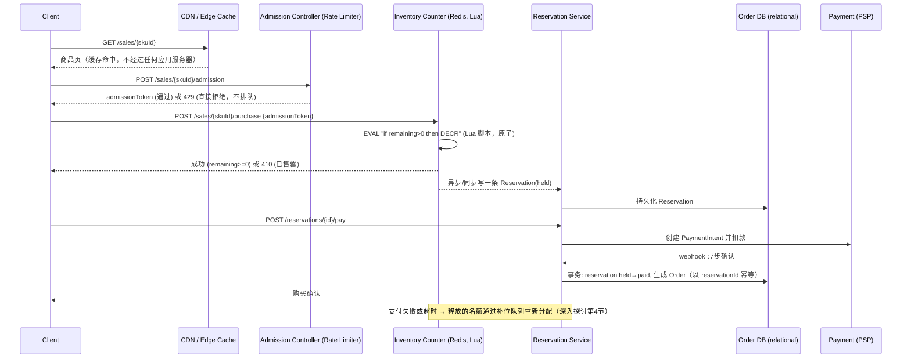

# 设计题解：秒杀与高竞争库存（Flash Sale & High-Contention Inventory）

## 题目与范围

面试官通常这样开场："设计一场秒杀（flash sale）：某个热门商品只有 1,000 件库存，开售瞬间
涌入 100 万买家，10 秒内决出胜负，绝不能超卖。" 这句话表面上和「Ticket Booking」「Hotel &
Marketplace Reservation」都在讲"高并发下的库存正确性"，但驱动这道题的核心难点是完全不同的
维度——不是"座位"或"日期区间"这种有结构的资源，而是**一个几乎没有身份、可以任意互换的整
数库存**，而且供需比达到极端悬殊的 1,000:1，全部压力集中在**一个商品**、**一个数字**上，
在**十秒钟**内决出胜负。这道题真正的难点不在"怎么保证不超卖"（这其实是最容易做对的部分），
而在**"挡在库存之前的每一层，能不能扛住那一瞬间的洪峰"**——库存本身的正确性机制，一旦真正
被执行到的请求量降下来，反而是这道题里最简单的一环。

值得当场问清楚的澄清问题，以及它们各自改变的设计决策：

- **是单一商品的秒杀，还是平台级同时有成千上万个商品在秒杀（如双十一）？** 决定「深入探讨」
  第 3 节"单个热 key 能扛多少"这个问题的答案是"够用"还是"必须分片"。本题按单一商品设计
  （100 万买家抢 1,000 件），因为这是题目给出的具体场景，也是"极端热点集中在一个 key 上"
  这个难点最纯粹的体现；平台级多商品同时秒杀在「瓶颈、故障与演进」的 100 倍演进里展开。
- **购买是否需要立即支付，还是先"占坑"再给一个窗口去付款？** 决定「深入探讨」第 4 节保留
  有效期（reservation TTL）怎么设，以及失败后库存怎么回收。本题假设需要一个短暂的支付窗
  口（多数秒杀场景买家已经绑定了支付方式，但支付网关本身仍有真实的失败率和延迟）。
- **要不要处理黄牛/脚本刷单？** 决定入口层要不要做设备指纹、验证码、单账号限购。本题假设
  要防，但不展开具体的机器学习检测模型，只设计限流和准入框架（见「深入探讨」第 6 节，复用
  [[solution-rate-limiter]] 的结论）。
- **售罄之后要不要支持"候补"（等有人取消再补位）？** 不需要——本题假设售罄即结束，不做候
  补队列，取消的库存归还给下一批已经在排队但还没决出胜负的准入窗口（见「深入探讨」第 4
  节），而不是重新对外开放。
- **是否需要支持"限时降价"这种时间维度的多阶段秒杀（比如价格随时间下降直到卖光）？** 不需
  要——本题假设单一固定价格，价格随时间变化属于另一个课题（动态定价），不影响本题的并发
  模型。

**范围内**：开售前后的入口流量整形（限流、排队/抽签、静态化与 CDN 卸载）、库存的原子扣
减、支付失败后的保留回收、防超卖与防漏卖、基础的防刷框架。**范围外**：具体的黄牛检测算法
（只设计限流框架，检测模型本身是另一个课题）、支付网关内部实现（复用一次性扣款、幂等键这
类通用结论，见 [[solution-ticket-booking]]，不重新设计 PSP）、动态定价与多阶段降价、物流
与发货、售后与退款。

## 需求

**功能需求（驱动设计的 3–5 条）**

1. 买家在开售时刻发起购买请求，系统必须保证成功售出的件数不超过库存总量（绝不超卖），也
   不能因为并发控制过于保守而在库存明明还有时拒绝本该成功的请求（不漏卖）。
2. 系统必须在入口层就挡住绝大多数注定失败的请求，不能让全部 100 万个请求都真正打到库存这
   一层。
3. 成功抢到名额的买家有一个有限的时间窗口完成支付；超时或支付失败，名额必须自动回收给还在
   等待的买家，不需要人工介入。
4. 系统要能识别并限制明显的自动化脚本/刷单行为，不能让脚本占据不成比例的库存份额。
5. 售罄后，后续所有请求都应该在尽可能靠前的层级（最好是 CDN/静态层）就得到"已售罄"的响
   应，不应该让这些注定失败的请求继续消耗任何有状态组件的资源。

**非功能需求（数字化）**

- **绝不超卖**：任意时刻，成功确认的订单数不超过库存总量——这是唯一不能妥协的正确性约
  束。
- **不漏卖（no undersell）**：只要库存还有剩余，一个合法的购买请求不应该被系统内部的保守
  设计（比如过度限流或过窄的准入窗口）错误拒绝——这是容易被候选人忽略、但和"绝不超卖"同
  等重要的另一半正确性约束。
- **响应延迟**：购买结果（成功/已售罄/重试）P99 < 200ms——用户在这十秒钟里对"卡住不响
  应"的容忍度几乎为零，模糊的等待比明确的"没抢到"更伤体验。
- **准入延迟**：从请求到达边缘节点到进入或被挡在库存判断之外，目标 P99 < 100ms。
- **可用性分层**：静态资源（商品页、CDN 内容）目标 99.99% 可用；库存判断这条写路径宁可返
  回明确的"已售罄"（410）也不能牺牲正确性。
- **保留有效期**：抢到名额到完成支付的窗口设为 3 分钟——比 [[solution-ticket-booking]] 的
  10 分钟短得多，原因在「深入探讨」第 4 节展开（买家已预置支付方式、队列后面还有大量在等
  的人，快速周转的收益更大）。
- **峰值弹性**：入口层要能承受 1,000:1 供需比、10 秒决出胜负这个量级的洪峰，这个比例本身
  就是题目给出的场景假设，不是拍脑袋——它决定了"必须有准入控制"这件事本身不需要论证，需要
  论证的是准入控制具体怎么做（见「深入探讨」第 1 节）。

## 容量估算

估算的核心是画出"洪峰在哪一层被削掉"这条曲线——**从 10 万 QPS 的购买尝试峰值，到最终打
在库存那一个 key 上的攻击性 QPS，中间要经过几个数量级的削减**，这条削减曲线本身就是整个
架构。

**场景假设**：`buyers = 1,000,000`，`units = 1,000`，`window_s = 10`。

- **裸购买尝试峰值（未经任何准入控制）**：每个买家在十秒内最多发起一次真正的购买提交，
  `1,000,000 / 10 = 100,000` QPS——这是如果完全不做任何入口保护，直接打到库存判断这一层
  的理论峰值。
- **站内浏览/刷新流量峰值**：买家在抢购瞬间通常不止提交一次请求——商品页加载、库存状态轮
  询、失败后的手动或自动重试，假设人均 3 次请求集中在同一个 10 秒窗口内，
  `1,000,000 × 3 / 10 = 300,000` QPS。这条流量和上面的"购买提交"是两类完全不同的流量：
  前者是幂等的只读请求，后者是必须精确决出胜负的写请求，必须用不同的手段分别处理（见「深
  入探讨」第 1 节）。
- **不做 CDN 缓存时的源站带宽**：假设商品页单次响应约 150KB，`300,000 QPS × 150KB × 8 ≈
  360Gbit/s`——这个数字本身就足以说明"静态页面必须走 CDN/边缘缓存，不能打源站"是这道题里
  第一个、甚至不需要论证的架构决策：360Gbit/s 远超绝大多数源站集群的出口带宽，而这层流量
  里 99.9% 以上的内容（商品图片、价格、库存徽章的粗粒度展示）在十秒窗口内几乎不变，是教
  科书级的可缓存内容。
- **单个热 key 的真实吞吐需求 vs 单实例上限**：如果完全不加准入控制，10 万 QPS 的购买尝试
  会全部争抢同一个库存 key（同一个 SKU）。Redis 官方基准测试文档给出的数字是：一台裸机服
  务器上，不开启 pipelining、50 个并发客户端时，`SET` 命令吞吐约 **180,180 请求/秒**，
  `LPUSH` 约 **188,324 请求/秒**（见「来源与延伸」）。`180,180 / 100,000 ≈ 1.8`——单个
  Redis 实例的官方基准吞吐只比裸露的购买尝试峰值高 1.8 倍，**这个安全边际薄得完全不能接
  受**：任何服务抖动、网络重传、慢查询都可能把这 1.8 倍的余量吃光。这正是准入控制不是"锦
  上添花"而是"没有它系统会在开售瞬间被自己的合法流量打垮"的精确论证。
- **准入控制削峰后的目标速率**：假设库存判断成功后，每一次都要同步写一条持久化的订单/预
  留记录到关系型数据库，而假设单个托管关系型主库实例在简单条件更新下能承受约 **2,000–
  4,000 行/秒**（和 [[solution-ticket-booking]]、[[solution-hotel-reservation]] 采用的
  同一类假设一致），取 **3,000/秒**作为准入控制放行的目标速率——`180,180 / 3,000 ≈
  60.1`，这时候 Redis 层还有 60 倍的余量，真正的瓶颈约束来自下游持久化写入，而不是原子
  递减本身。
- **支付失败率与净售数**：假设支付失败/放弃率 6%（[[solution-ticket-booking]] 用了同一类
  假设），要净售出 1,000 件，第一批至少要放行 `1,000 / (1 - 0.06) ≈ 1,063.8`，取整数放
  行 1,100 个名额作为第一波（第一波预期约 66 个名额因支付失败被回收，进入下一波补位）。
- **热 key 的真实决赛承压**：如果第一波 1,100 个名额都在 10 秒窗口内发起决赛请求，
  `1,100 / 10 = 110` QPS——这就是准入控制生效后，真正打到库存这个热 key 上的攻击性流
  量，比裸露峰值的 10 万 QPS 低了**约三个数量级**。这条从 10 万到 300,000（站内流量）到
  360Gbit/s（带宽）再到最终 110 QPS（热 key）的曲线，就是这道题容量估算要交付的核心产
  物——每一层该做什么，完全由上一层削峰之后剩下多少流量决定。

## 核心实体与 API

**实体**

- **Sale**：`skuId, totalUnits, startAt, endAt, status(scheduled/live/soldOut/ended)`。
- **InventoryCounter**：`skuId, remaining`——Redis 里的一个整数，是本设计的准入判定真相
  来源（见「深入探讨」第 2 节）。
- **Reservation**：`id, skuId, buyerId, status(held/paid/expired/released),
  createdAt, expiresAt, idempotencyKey`——**先在 Redis 里原子递减成功，才允许创建这一条
  记录**，`Reservation` 是通往持久化订单的中间态。
- **Order**：`id, reservationId, buyerId, amount, paymentIntentId, status`——只有支付确
  认后才生成，是这道题里唯一需要长期保留、和财务对账相关的记录。
- **AdmissionTicket**（可选，抽签模式下使用）：`buyerId, skuId, issuedAt, rank`——如果准
  入策略是"抽签"而不是"先到先得"，用它记录中签结果。

**API**

```
GET  /sales/{skuId}                       商品页，CDN + 边缘缓存，弱一致，允许秒级过时
POST /sales/{skuId}/admission              {buyerId}
                                           准入判定：限流/排队/抽签，通过则发一个短期令牌
                                           → {admitted: true, admissionToken} 或 429/503
POST /sales/{skuId}/purchase               {admissionToken, clientRequestId}
                                           需要有效 admissionToken；按 clientRequestId 幂等
                                           → {reservationId, expiresAt} 或 410（已售罄）
POST /reservations/{id}/pay                {paymentMethodToken}
                                           按 reservationId 幂等，绝不重复扣款
GET  /reservations/{id}                    轮询保留/订单状态
POST /webhooks/payment                     PSP 异步回调，按事件 id 去重
```

**幂等性**：`POST /sales/{skuId}/purchase` 用 `clientRequestId` 防网络重试重复递减库存
（语义和 [[solution-ticket-booking]] 的 `POST /holds` 一致）；`POST /reservations/{id}/
pay` 用 `reservationId` 做幂等键，防止支付回调重复触发第二次扣款。

**故意不做的**：`admissionToken` 不是库存保留，只是"允许尝试一次库存判定"的资格，和
[[solution-ticket-booking]] 的虚拟队列通过资格一样，不代表一定能
买到；不支持一次请求购买多件（每个 `buyerId` 每场秒杀最多一次成功购买，简化了"数量"这一
维度，让整个模型退化成纯粹的"抢名额"问题）；不提供候补队列（见「题目与范围」）；准入判定
和库存判定在数据结构上完全分离，准入层的失败不会消耗任何库存层的资源。

## 高层设计



**静态/浏览路径**：商品页、库存的粗粒度展示（"库存紧张"这类文案，不是精确数字）全部走
CDN，源站几乎不参与——360Gbit/s 这个容量估算数字本身就否决了任何让这条路径打源站的方案。

**准入路径**：Admission Controller 是一个独立于库存判定的限流/排队层（复用
[[traffic.rate-limiting|Rate Limiting]] 的结论，见「深入探讨」第 1 节），存储技术类是**内
存数据结构（Redis 计数器或 Sorted Set）**，因为它只需要做速率判断，不需要事务性保证，允
许在极端情况下丢失重建（用户重新发起一次准入请求）。

**库存判定路径**：Inventory Counter 是**一个内存数据存储上的单个整数，用 Lua 脚本做"读-
判断-减"的原子操作**（见「深入探讨」第 2 节）。选它而不是直接对关系型数据库做条件更新，
是因为容量估算给出的裸露峰值（10 万 QPS）已经逼近关系型数据库单行更新吞吐的上限（几千行/
秒），Redis 单实例官方基准的 18 万 QPS 量级才勉强够用；即便如此，真正扛住峰值靠的还是准
入控制把流量削到 110 QPS 这个量级，Redis 的高吞吐只是提供了必要的安全边际，不是唯一的保
护手段。

**持久化路径**：库存判定成功后，`Reservation` 立刻同步写入关系型数据库（Order DB），这
是整条链路里唯一需要长期持久化、参与财务对账的部分——它的写入量已经被准入控制削减到目标
3,000/秒以内，一个托管关系型主库实例完全能承受。

## 深入探讨

### 准入控制：在库存之前先挡流量

**问题**：容量估算给出 100,000 QPS 的裸购买尝试峰值和 300,000 QPS 的站内浏览峰值，而库
存判定这一层（无论用什么技术）都不该直接暴露给这个量级的原始流量。挡在库存之前的这一层该
怎么设计？

**方案一：只做限流，超额直接拒绝（429）**。简单，但如果限流阈值设置得和真实容量不匹配，
用户体验是"疯狂刷新硬闯"——每次 429 换来更快的重试，制造惊群效应（thundering herd），而
且手快的脚本天然占优，对普通用户不公平（[[solution-ticket-booking]] 的虚拟队列一节详细
讨论过同一个问题）。

**方案二：把所有请求排进一个先进先出队列，按数据库能承受的速率逐个放行**。保证公平和顺
序，但用户看不到自己的排队位置，纯 FIFO 队列在座位这种"多个稀缺资源"场景下还合理，但秒杀
只有一个 SKU、一个整数库存，用完整的排队系统（如 Ticketmaster 式的虚拟候机厅）有点杀鸡用
牛刀——大部分排队中的用户注定抢不到，让他们持有一个"位置"的心理预期反而不如明确的"参与抽
签"设定诚实。

**方案三（本设计采用）：静态化 + 边缘限流 + 抽签式准入的组合，而不是单一手段**。第一层，
商品页和库存粗粒度展示完全走 CDN（削掉 300,000 QPS 里几乎全部的浏览流量，不进任何应用服
务器）。第二层，边缘节点对"购买提交"这类写请求做令牌桶限流，直接把超出瞬时容量的请求拒绝
掉，而不是排队等待——因为十秒窗口太短，排队本身的等待时间比商品被抢完的时间还长，排队没有
意义。第三层（可选，供应远小于需求达到 1,000:1 这种极端比例时更合适）：与其做"先到先得"
（天然利好网络延迟低、手速快的脚本），改成一个短暂窗口内的抽签——所有在窗口内提交请求的
买家都记录下来，窗口结束后随机抽取 `units` 名中签者，进入真正的库存判定。抽签模式的关键
价值是**把"手速"从决定因素里去掉**，弱化了脚本相对真人用户的先天优势（脚本仍然可能靠批量
小号占多个抽签名额，需要配合「深入探讨」第 6 节的防刷手段）。Shopify 自己应对高写入流量突
发时选择的正是类似的组合——不是单纯限流，而是给客户端一个排队/等待状态页，并用反馈控制
（下节展开）动态调整放行速率（见「来源与延伸」）。

### 原子递减：Redis Lua、数据库条件更新与预分配令牌池

**问题**：无论前面的准入控制削减了多少流量，最终决出胜负的那一步必须保证"读取剩余库存、
判断是否大于零、扣减"这三个动作原子地发生，否则会出现两个并发请求都读到"剩余 = 1"、都扣
减成功，导致超卖。有三种常见实现，该怎么选？

**方案一：Redis `DECR` 加事后判断**。`DECR inventory:sku123`，如果返回值 < 0 再想办法把
它加回去。问题在于"扣减"和"判断"是两条独立的命令，中间有窗口——多个并发请求都可能把计数
器减到负数，之后再靠应用层判断"负数就失败、加回去"来补救，这个"加回去"的操作本身又需要额
外的并发保护，等于把原本一步能做完的事拆成了两步还要擦屁股。

**方案二（本设计采用）：Redis Lua 脚本，把"读-判断-减"包进一次 `EVAL`**：
```lua
local remaining = tonumber(redis.call('GET', KEYS[1]))
if remaining and remaining > 0 then
    redis.call('DECR', KEYS[1])
    return 1
else
    return 0
end
```
Redis 官方文档明确保证脚本的原子执行："Redis 保证脚本的原子执行——脚本执行期间，服务器
所有其他活动都被阻塞，这意味着脚本产生的所有效果，要么全部尚未发生，要么已经全部发生"（原
文见「来源与延伸」）。这正是方案一缺失、方案二天然具备的保护：不存在"两个请求都读到正数、
都判断可以减"的窗口，因为整个"读+判断+减"在 Redis 的单线程事件循环里是不可分割的一步。这
也正是阿里云工程团队自己公开的秒杀库存扣减模式——"用商品 ID 作为 Redis 实例的键，可用库存
作为值，用 Lua 脚本的事务特性实现'读取剩余库存后扣减'的逻辑"（原文见「来源与延伸」），本
设计采用的是同一个模式，不是凭空发明。

**方案三：数据库条件更新**（`UPDATE inventory SET remaining = remaining - 1 WHERE
remaining > 0`，和 [[solution-ticket-booking]]、[[solution-hotel-reservation]] 的座位/
库存条件更新是同一个机制）。正确性上完全没问题，问题在吞吐——容量估算给出裸峰值 10 万
QPS，而关系型数据库单行更新的合理吞吐假设只有几千行/秒，方案三单独扛不住裸峰值；但一旦准
入控制把流量削到本设计估算的 110 QPS，方案三其实绰绰有余。**本设计的实际选择是两者分
工**：Redis Lua 脚本做第一道原子判定（因为它必须直面还没被完全削峰的流量、需要更高的吞
吐余量），判定成功后**立刻同步写一条持久化的 `Reservation` 记录到关系型数据库**（此时的
写入量已经是削峰后的 110 QPS 量级）——库存的"是否还有"这个高频判定问题交给 Redis，"这次
成交是否真实发生过、能不能对账"这个持久化问题交给数据库，两者不是互相替代的关系。

**方案四：预分配令牌池**。开售前把 1,000 个不重复的令牌预先写入一个 Redis Set，购买请求
用 `SPOP`（原子弹出一个随机成员）直接领取；`SPOP` 返回空即代表售罄，不需要额外的"读-判
断"逻辑，天然杜绝了"读到正数但库存实际已经是零"这类由判断逻辑写错导致的边界 bug。这个方
案在纯粹的"整数库存、无身份"场景下和方案二在正确性和吞吐上几乎等价（`SPOP` 本身就是一条
原子命令，不需要额外包 Lua），但预分配的代价是回收逻辑要显式地把令牌 `SADD` 放回集合（见
「深入探讨」第 4 节），并且不像计数器那样能被人工运营直接读出"剩余数字"这种直观的监控指
标，多商品同时秒杀时也需要为每个 SKU 单独维护一个令牌集合，管理成本比一个整数计数器更高。
本设计仍以方案二为主，方案四作为"如果连 Lua 脚本本身的正确性都想进一步简化"时的备选。

**Redis 作为库存判定的真相来源，和 Ticket Booking 的取舍不同**：[[solution-ticket-booking]]
明确选择只让关系型数据库做座位状态的唯一真相来源、Redis 只做展示层缓存，避免
两套存储互相不一致；本设计恰恰相反，让 Redis 直接承担库存判定的真相来源。两者选择不同并
非矛盾，而是场景不同：座位有几万个、每个都要精确追踪状态并支持复杂查询（哪些座位还空
着），关系型数据库天然适合；秒杀库存只是一个整数，Redis 原生支持的原子操作已经完全覆盖了
需要的语义，且吞吐要求高出一个数量级，让数据库直接承担第一道判定会先于其他任何组件被打
垮。**代价**是 Redis 默认不保证磁盘持久化立刻生效（AOF 按 `everysec` 刷盘，最坏丢失一秒
的写入），如果 Redis 在扣减成功但还没来得及被下游持久化记录之前崩溃重启且丢失了这次扣
减，理论上会让 `remaining` 的值比真实已售数偏高——本设计用一个低频对账任务定期核对 Redis
计数器和 Order DB 里真实确认订单数之间的差值，发现漂移就主动修正 Redis 里的值，把"极小概
率丢一次扣减"的风险兜底在对账层，而不是假装它不会发生。

### 单个热 key 能扛多少：精确计算，以及什么时候需要分片

**问题**：这道题里全部 1,000 件库存对应**同一个** Redis key，Redis 是单线程处理命令的，
这个 key 的吞吐上限就是单个 Redis 实例的吞吐上限，不能像"多个 key 分布在多个分片"那样靠
增加节点数来分摊——加多少个 Redis 节点，这一个 key 永远只能落在其中一个节点上。这个 key
到底能扛多热？

**计算**：Redis 官方基准文档给出的数字——裸机服务器、不开 pipelining、50 并发客户端时，
`SET` 约 180,180 QPS，`LPUSH` 约 188,324 QPS；文档同时给出一个可执行的优化路径："使用
pipelining 聚合 16 条命令，在一台 MacBook Air 上，`SET` 达到约 1,536,098 QPS，`GET` 约
1,811,594 QPS"（原文见「来源与延伸」）。本设计的裸露峰值 100,000 QPS 对不开 pipelining
的单实例只有约 1.8 倍余量（前面容量估算已算出），这个余量在生产环境（网络抖动、GC 暂
停、慢查询）里并不安全；但本设计并不依赖单纯堆 Redis 吞吐来解决问题——准入控制已经把真正
打到这个 key 的流量削到约 110 QPS，此时哪怕不做任何 pipelining 优化也有超过 1,600 倍的
余量。**pipelining 在这道题里几乎用不上**：pipelining 的前提是同一个客户端连续发送多条
命令再一次性收结果，而这里的请求天然来自成千上万个独立用户各自发一条命令，不存在"一个客
户端攒够 16 条命令再发"的自然批次——除非在应用层做请求合并（攒够一小批不同用户的扣减请
求，用一次 Lua 脚本循环处理），这是当准入控制本身也扛不住时才需要考虑的进一步优化，本设
计的量级下不需要。

**什么时候真的需要给这一个 key 分片**：如果场景换成"5,000 万买家抢 1 万件库存"（数量级远
超题目给定场景），裸峰值会达到 `50,000,000 / 10 = 5,000,000` QPS，即使按 pipelining 后
的官方数字（约 153.6 万 QPS）也只有 `1,536,098 / 5,000,000 ≈ 0.31` 倍——**单实例哪怕做
了 pipelining 优化也扛不住**，这时候才需要考虑"key 分片"：把 1 万件库存预先切成 N 个子
桶（比如 10 个子桶各 1,000 件），每个子桶是独立的 Redis key，可能落在集群的不同分片上，
购买请求按用户 ID 哈希路由到某个子桶——代价是子桶之间的库存消耗速度可能不均匀（某个子桶
先卖完，用户体验上出现"部分用户能买、部分不能"的不一致观感），需要一个收尾阶段把没卖完的
子桶重新合并开放。**但这个分片手段解决的是"单一商品热到一个实例扛不住"这个极端情况**，正
常量级下（本题给定的场景），真正解决问题的还是准入控制把流量削下来，而不是分片——这个区
分本身就是这道题里最容易被过度设计的地方：候选人经常一上来就设计 key 分片，却没有先算清
楚到底需不需要。

### 支付失败后的保留回收与保留有效期

**问题**：库存判定成功只代表"抢到了名额"，不代表交易完成——支付本身有真实的失败率和延
迟。名额如果被无限期占用，会让本该失败的买家挡住后面真正想买的人；回收得太快，又会让正在
认真填支付信息的用户白白错过。

**方案一：不设过期，人工/客服介入处理支付失败**。等于放弃了"名额及时回收给下一批等待者"
这个需求，在 1,000:1 这种供需比下完全不现实——不可能靠人工在十秒决出胜负的场景里介入任何
一单。

**方案二（本设计采用）：3 分钟保留有效期，惰性判断 + 补位放行**。名额（`Reservation`）
带 `expiresAt` 字段，任何后续操作（支付确认、状态查询）都顺带检查是否已过期，过期的名额
不需要主动清理也不会被当作"仍然有效"；一个低优先级后台任务定期扫描过期未支付的
`Reservation`，把它们标记为 `expired`，这部分数量重新计入"可放行的名额"，供准入控制的补
位队列（还在等待、但还没被放行的买家）使用。**为什么 3 分钟比 [[solution-ticket-booking]]
的 10 分钟短**：座位预订的支付表单往往需要用户现场填写持卡信息，10 分钟是给这
个填写过程留出的合理窗口；秒杀场景的买家绝大多数已经在平台上绑定过默认支付方式（一键支
付），真正需要的只是网关确认扣款的时间，加上"队列后面还有几十倍于库存的人在等"这个现实，
更快的回收周转能让更多买家有机会参与，短窗口的收益明显大于座位场景。容量估算已经算出，按
6% 的假设失败率，第一波放行 1,100 个名额预期能净成交约 1,034 件，还差约 34 件时用同一套
补位逻辑放出下一小批——这个"波次放行"的节奏本身也是准入控制的一部分，不是库存判定该操心
的事。

### 防超卖与防漏卖：两个方向都要守住

**问题**："绝不超卖"是这道题最显眼的约束，但"不漏卖"——库存明明还有、却因为系统设计过于
保守而拒绝了本该成功的请求——同样是正确性问题，只是不那么显眼，容易被只顾着防超卖的设计
忽略。

**超卖的根源**：几乎总是"读-判断-写"被拆成了非原子的多步（见「深入探讨」第 2 节方案
一），或者是多个独立的库存判定点各自为政（比如同时给"网页"和"App"两个客户端各开一个独立
的计数器，本该共享同一份库存却各扣各的）——本设计通过"唯一一个 Lua 脚本、唯一一个 key"从
根本上排除了后一种错误：无论买家从哪个客户端发起请求，最终都打到同一个 `inventory:
{skuId}` key 上。

**漏卖的根源**：常见于两类设计失误。第一类是准入控制设得过于保守——比如令牌桶的速率设成
了 110 QPS 里的一个更小的保守值（比如只给 50 QPS），会导致明明库存和数据库都还有余量，
但合法买家在准入层就被大量误拒，10 秒窗口结束后库存却还没卖完。第二类是保留有效期设置和
回收逻辑之间的时序漏洞——如果补位逻辑的扫描周期太长（比如每分钟才扫一次过期名额），会让
已经确定不会成交的名额白白占着库存"看起来卖完了"，直到下一次扫描才被回收，这段时间内的合
法请求会被错误地判定为"已售罄"。**本设计的应对**：准入控制的放行速率必须按容量估算里算出
的下游真实承受能力（本题是数据库的 3,000/秒目标）设定，而不是随意取一个更保守的数字；保
留有效期的回收扫描频率要显著快于保留有效期本身（比如 3 分钟的保留配秒级或十秒级的扫描周
期），把"库存看起来卖完但其实没有"这个窗口压缩到可以忽略的量级。

### 防刷（bot/脚本）：限流的维度选择

**问题**：1,000:1 的供需比意味着即便是很小比例的自动化脚本，也可能占用不成比例的库存份
额，挤占真实用户的机会。这道题不设计具体的机器学习检测模型，但准入控制层的限流维度选择本
身就是第一道防线。

**只按 IP 限流的问题**：和 [[traffic.rate-limiting|Rate Limiting]] 的通用结论一致——住宅
NAT/公司出口会把大量真实用户挤在同一个 IP 后面（限了真人），而分布式脚本又能轻易摊到成
千上万个 IP 上（限不住脚本），单一维度的 key 选择两头都错。

**本设计采用的限流维度组合**：复用 [[solution-rate-limiter]] 的分层配额思路——认证用户
ID 作为主限流键（每个 `buyerId` 每场秒杀最多一次准入尝试，超过直接拒绝，不给二次机会）；
叠加设备指纹/浏览器指纹作为第二层键（同一设备短时间内切换多个账号申请准入，触发风控人工
审核队列而不是直接放行）；未登录或刚注册的新账号，在准入层强制走一次额外的挑战（验证码或
类似机制）再进入排队/抽签环节。这些手段没有一个能单独根除脚本，组合起来的目标是提高脚本
的边际成本，让"1,000:1 supply 里有意义的一部分留给真人"，而不是承诺一个不存在的"完美识
别"。

## 瓶颈、故障与演进

**热点**：整场秒杀的全部写压力集中在一个 Redis key 上，这是设计里唯一无法通过"加机器"稀
释的热点（见深入探讨第 3 节）；真正缓解它的不是分片，而是准入控制把流量提前削下来——这个
认知本身是这道题最重要的洞察。

**谁先扛不住（按容量估算的余量从小到大排序）**：

1. **源站带宽**（如果静态资源没有走 CDN）：360Gbit/s 对多数源站集群是瞬间过载，第一个倒
   下。
2. **未受保护的单 Redis 实例**（如果裸露峰值直接打进来，没有准入控制）：1.8 倍余量，几
   乎没有缓冲。
3. **关系型数据库主库**（如果每次库存判定都同步写数据库，而不是先过 Redis 这道关）：几
   千行/秒的假设吞吐对 10 万 QPS 完全不够看。
4. **准入控制生效后的 Redis 热 key**：60 倍以上余量，基本安全。
5. **CDN/边缘层**：为大促场景设计的 CDN 本身就是为这种脉冲流量而生，是全链路里最不用担
   心的一环。

这个排序直接决定了架构投入的优先级：源站带宽和准入控制是必须第一时间做对的，Redis 本身
的吞吐优化（pipelining、分片）在本题的量级下反而是投入产出比最低的一环。

**故障域**：
- **Redis（库存判定）不可用**：整条购买链路必须 fail closed——暂停接受新的库存判定请
  求，宁可让买家看到"系统繁忙，请稍后重试"，也不能退化成不做原子判定直接写数据库（吞吐
  扛不住）或者干脆"假装成功"（导致超卖）。
- **准入控制层（限流器）不可用**：也应 fail closed 而不是 fail open——如果限流器本身挂
  了却选择放行全部流量，等于把未经削峰的 10 万 QPS 直接倒给下游，会连锁打垮 Redis 和数据
  库。
- **PSP 抖动**：复用 [[solution-ticket-booking]] 的结论——保留卡在待支付状态靠超时对账
  任务兜底，超时后自动释放名额并进入补位队列。
- **CDN 源站回源风暴**：CDN 节点如果同时因为 TTL 到期而回源，可能瞬间产生远超预期的源站
  流量——用较长的 TTL 加上"过期后先返回旧内容、后台异步刷新"（stale-while-revalidate）
  避免这种同步回源的尖峰。

**10 倍演进**：买家从 100 万涨到 1,000 万，库存仍是 1,000 件（供需比从 1,000:1 涨到
10,000:1）。裸峰值涨到 100 万 QPS，但**这一层的增长完全被准入控制吸收，不会传导到 Redis
热 key**——放行速率仍然按下游数据库的承受能力（3,000/秒）设定，不因为排队的人更多而改
变，真正需要扩容的只是准入控制层本身（限流器、CDN、排队/抽签服务），这是无状态、可以线性
横向扩展的一层。这正好呼应了容量估算部分的核心论点：热 key 的压力从来不取决于买家总数，
只取决于准入控制放行的速率。

**100 倍演进**：从单一商品秒杀，变成平台级同时有成千上万个商品在秒杀（如双十一）——阿里
云自己公开的数字是，某年天猫双十一开场 26 秒，峰值达到**每秒 58.3 万笔交易**，是 2009 年
第一届双十一峰值的 1,457 倍（原文见「来源与延伸」）。这个数字本身说明：平台级的洪峰不是
"同一个 key 变得更热"，而是"成千上万个不同商品各自的 key 同时变热"——Redis 集群天然按
key 哈希把不同商品分布到不同分片，单个 SKU 的热点问题不会被放大，真正的瓶颈转移到共享的
前门基础设施：边缘限流网关和 CDN 需要按平台整体流量而不是单个商品的流量来规划容量，且要
对"热点商品"（`hotspot rule`）单独识别限流规则（阿里云的公开资料里提到用 AHAS 对超过阈
值的热点参数排队限流），因为即便每个商品自己都不算极端热点，几千个商品叠加起来仍然需要一
个统一的入口保护层来防止相互挤占。

## 面试官会追问什么

**中级（mid）**

- "如果不用 Lua 脚本，只用一条 `DECR` 命令，会发生什么？" `DECR` 本身是原子的，但缺少
  "判断是否已经到零"这一步会让计数器减到负数，超卖判断被推迟到事后补救，比在写入前判断
  更脆弱；这个问题在考察候选人是否理解"原子递减"和"原子的条件递减"是两回事。
- "限流层返回 429 之后，客户端应该怎么处理？" 客户端应该有指数退避加随机抖动的重试策略，
  而不是立刻重试制造惊群；更好的设计是让 429 响应本身带一个"下次可重试时间"的提示。

**高级（senior）**

- "Redis 崩溃重启、AOF 丢了最后一秒的写入，会发生什么？" 可能出现 `remaining` 的值比真
  实已售数偏高的漂移，本设计用低频对账任务比对 Redis 计数器和数据库真实确认订单数，发现
  差异后修正——这是"承认小概率数据丢失会发生，设计补救机制"和"假装它不会发生"的区别。
- "准入控制层本身会不会成为攻击面？" 会——如果限流键选得不好（比如只按 IP），准入控制层
  自己反而可能被脚本用来耗尽正常用户的准入名额；这正是「深入探讨」第 6 节要组合多个限流
  维度而不是单一维度的原因。

**参谋级（staff）**

- "如果要把这套系统复用给平台级的双十一场景（成千上万个商品同时秒杀），架构要改哪里？"
  单个商品的 Redis Lua 扣减模式不需要改，但准入控制、CDN、网关这些共享基础设施必须按全
  平台流量重新做容量规划，并且需要一层"热点商品识别"把个别异常火爆的商品单独限流，防止它
  挤占其他商品的共享资源——本质上是把"防止单个 key 过热"的问题升级成"防止单个租户/商品过
  热"的多租户资源隔离问题。
- "抽签模式和先到先得模式，从产品和工程两个角度分别怎么取舍？" 先到先得实现简单、用户心
  智熟悉，但系统性利好网络延迟低和自动化程度高的参与者；抽签在小窗口内收集所有请求再随机
  选择，公平性更好、对脚本的先天速度优势免疫，但需要多等一个"收集窗口"的固定延迟，且中签
  通知本身要处理"通知发出后买家不来支付"这类和先到先得模式相同的回收问题——这不是纯技术
  决策，需要产品明确"最大化转化"还是"最大化公平感"哪个优先。
- "如果这场秒杀本身就是一次真实的压测事件，怎么验证准入控制的放行速率设置是否正确？" 结
  合历史同类大促的真实 QPS 曲线做混沌工程式压测，在非高峰期用影子流量重放，并对放行速率
  做闭环反馈校准（类似 Shopify 用 PID 控制器动态调整节流阈值，而不是依赖一次性手工估算的
  静态值，见「来源与延伸」），因为容量估算里 2,000–4,000 行/秒这类关键假设本身需要被真
  实压测验证，不能只停留在纸面计算。

## 常见错误

- 把全部力气花在"怎么防止 Redis 计数器出现负数"这一个点上，却完全没有设计准入控制层，被
  追问"如果不限流直接放 10 万 QPS 打过去"时说不出这一层为什么必须存在。
- 一上来就设计"key 分片"来应对热点，却没有先算清楚准入控制削峰之后真正打到这个 key 的流
  量到底有多少——在本题给定的量级下这是过度设计。
- 只讨论"防超卖"，完全没意识到"漏卖"也是正确性问题，被追问"限流设得太保守会怎样"答不上
  来。
- 保留有效期设计成"一次性占用直到用户主动放弃"，没有过期机制和补位逻辑，导致大量名额被
  已经放弃的买家长期占用。
- 把"抽奖/抽签"和"先到先得"混为一谈，说不清楚两者在防脚本能力和实现复杂度上的具体差异。
- 完全没有讨论静态资源和 CDN，只关注库存判定这一个组件，对"360Gbit/s 源站带宽"这类第一
  层就会倒下的瓶颈毫无意识。

## 五分钟讲法

This is fundamentally a traffic-shaping problem, not an inventory-correctness problem — the
atomic decrement itself is the easiest part once I know how much load actually reaches it. I
start from the raw numbers: a million buyers in a ten-second window is a naive 100,000
purchase-attempt QPS against a single hot key, and Redis's own published single-instance
benchmark of roughly 180,000 ops/sec leaves only about an 1.8x margin against that — far too
thin to trust in production. So the architecture's real job is shedding load before it ever
reaches inventory: static content and coarse stock indicators go through a CDN so the origin
never sees the browsing traffic, and a separate admission-control layer — rate limiting, or a
short collection window followed by a lottery when demand is this lopsided — throttles the
purchase-submission traffic down to whatever the downstream durable store can actually sustain,
around a few thousand requests per second in this design. Only after that shaping does the
actual decrement happen, as a single Lua script that reads the remaining count, checks it, and
decrements atomically — Redis guarantees the whole script runs as one uninterruptible unit, so
there's no window for two concurrent buyers to both see a positive count and both succeed. A
successful decrement creates a short-lived reservation, three minutes here rather than the ten
minutes a seat-booking system would use, because most flash-sale buyers already have a stored
payment method and a much longer queue is waiting behind them; failed or expired reservations
feed back into a second wave of admission rather than being lost. Undersell matters as much as
oversell: an admission rate set too conservatively, or a reservation-expiry sweep that runs too
slowly, both leave real stock unsold while legitimate buyers are wrongly turned away. At 10x
buyer scale none of this changes at the hot key, because admission control absorbs the growth
entirely; at 100x scale — many SKUs selling simultaneously — the bottleneck moves away from any
single key and onto the shared front-door infrastructure that has to protect thousands of
independently hot keys at once.

## 来源与延伸

- [Redis — Scripting with Lua](https://redis.io/docs/latest/develop/programmability/eval-intro/)：
  官方文档明确保证 Lua 脚本在 Redis 里的原子执行——"脚本执行期间，服务器所有其他活动都被
  阻塞"。本文「深入探讨」第 2 节"为什么 Lua 脚本能防止超卖"这一论证直接依据这句话，而不
  是凭经验断言"Lua 脚本是原子的"。
- [Redis — Benchmarks](https://redis.io/docs/latest/operate/oss_and_stack/management/optimization/benchmarks/)：
  官方基准测试给出的具体吞吐数字（不开 pipelining 时 `SET` 约 180,180 QPS；开 16 条
  pipelining 后 `SET` 可达约 153.6 万 QPS），是本文「容量估算」和「深入探讨」第 3 节"单
  个热 key 能扛多少"这两处计算的直接依据。本文和只会说"Redis 很快"的题解不同的地方，是
  把这个"很快"量化成了和裸露峰值直接对比的具体倍数。
- [Alibaba Cloud Community — System Stability Assurance for Large Scale Flash Sales](https://www.alibabacloud.com/blog/system-stability-assurance-for-large-scale-flash-sales_596968)：
  阿里云工程团队自己公开的秒杀库存扣减模式——"用商品 ID 作为 Redis 键、可用库存作为值，
  用 Lua 脚本的事务特性实现读取后扣减"，以及天猫双十一峰值每秒 58.3 万笔交易（是 2009 年
  首届的 1,457 倍）的真实数字。本文「深入探讨」第 2 节的核心方案、以及「瓶颈、故障与演
  进」100 倍演进一节的真实数字，都以此为依据。本文与它的差异在于：本文额外论证了 Redis
  作为库存判定真相来源时的持久化风险和对账兜底，原文没有展开这一点。
- [Shopify Engineering — Surviving Flashes of High-Write Traffic Using Scriptable Load Balancers (Part I & II)](https://shopify.engineering/surviving-flashes-of-high-write-traffic-using-scriptable-load-balancers-part-i)：
  Shopify 自己因为 2016 年 Kylie Cosmetics 一场秒杀打垮了所在数据库分片的真实事故，演化
  出的边缘限流+排队页方案，以及后续用 PID 控制器动态调整放行阈值以解决"排队时间方差过大"
  问题的改进。本文「深入探讨」第 1 节和「面试官会追问什么」参谋级问题里"用反馈控制动态校
  准放行速率"的思路，直接借鉴这篇文章，但本文的准入控制额外加入了抽签模式作为先到先得之
  外的选项，这是 Shopify 文章没有涉及的部分。
