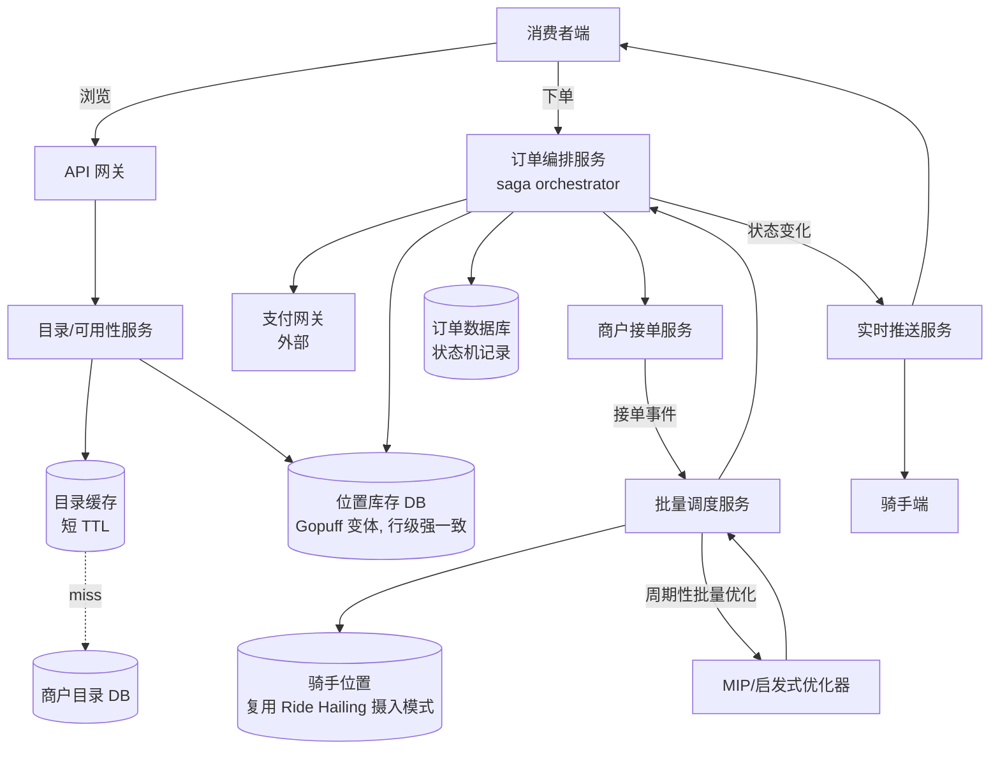

# 设计题解：外卖与生鲜配送（Food & Grocery Delivery，DoorDash/Gopuff）

## 题目与范围

面试官通常这样开场："设计一个类似 DoorDash 的外卖平台：用户浏览附近商户的菜单下单，
商户接单备餐，骑手（courier）取餐并送达，全程可追踪。" 这句话背后其实盖住了两种在真实
世界里长得完全不同的生意：**DoorDash 这类三方市场（three-sided marketplace）**——平台
不拥有商品也不拥有骑手，只是撮合独立的消费者、商户、骑手三方，商品是否有货取决于商户
自己（一份菜是否卖完，平台并不直接掌握库存数字）；以及 **Gopuff 这类本地库存服务
（local-inventory service）**——平台自己拥有仓储（微仓，micro-fulfillment center）和
库存，本质上是一个"在几公里半径内做快速履约的迷你电商仓库"，商品数量是可数、可超卖的
真实库存。两者共享"按位置匹配供给和需求、指派骑手、实时追踪"这一层，但"库存到底是谁的、
精确到什么颗粒度"这个问题的答案完全不同，这正是这道题比表面上难的地方——把两种模型
当成同一个问题来设计，会在容量估算和一致性这两节上出系统性错误。

值得当场问清楚的澄清问题，以及它们各自改变的设计决策：

- **平台自己持有库存（Gopuff），还是撮合独立商户的库存（DoorDash）？** 决定"防止超卖"
  这件事发生在哪一层——Gopuff 里是平台自己对精确数量做原子扣减；DoorDash 里商品数量
  对平台通常不可数（一道菜"还有多少份"商户自己也未必精确知道），防超卖更多依赖商户
  主动标记"售罄"和订单在商户端的接受/拒绝——见「深入探讨」第 1 节。
- **骑手指派是贪心就近匹配，还是批量优化？** 决定调度服务是一个无状态的即时匹配函数，
  还是一个按周期运行、同时处理一批订单和一批骑手的组合优化问题——见「深入探讨」第 3
  节，这是任务范围明确要求覆盖的重点。
- **下单后，支付、商户接单、骑手指派这三件事的失败要不要能互相撤销？** 决定订单流程
  要不要显式建模成一个带补偿动作的工作流（saga），还是可以简化成一次性的分布式事务——
  见「深入探讨」第 2 节。
- **配送时效承诺是"尽快"还是一个明确的时间窗口（比如 Gopuff 的"15–30 分钟"）？** 决定
  批量调度的周期要多短，以及库存查询要不要按"配送窗口内可达"过滤候选仓/候选商户。
- **要不要处理支付本身的清结算细节？** 不处理——本题假设订单流程调用一个外部支付网关
  完成授权（authorize）和扣款（capture），支付系统内部如何处理对账、分账，是完全独立
  的一道题（Payment System）。

**范围内**：商户/本地仓的商品目录与库存查询、下单后跨支付/商户/调度的订单编排、骑手
批量指派、实时订单追踪。**范围外**：支付网关内部实现、骑手/顾客的地理定位与路径规划的
底层机制（高频位置摄入与匹配下的强竞争见 [[solution-ride-hailing|Ride Hailing]]，路线
与 ETA 的计算见 Maps & Navigation，本题解直接复用两者的结论，不重新推导）、商户/骑手的
准入审核、拼单与多商户购物车。

## 需求

**功能需求（驱动设计的 3–5 条）**

1. 用户按当前位置查询附近商户的菜单（DoorDash 变体）或本地仓的商品可用性（Gopuff
   变体），下单前看到的"有货"信息要足够可信，不能大比例地在下单后才发现缺货。
2. 用户提交订单后，系统要依次完成支付授权、商户/仓库确认接单、骑手指派——任意一步
   失败，之前已经执行的步骤要能被正确地撤销或补偿，而不是留下一个不一致的中间状态。
3. 骑手指派要在满足时效的前提下，尽量提高单个骑手每小时能完成的订单数（不是让每一单
   都指派给"当前最近"的骑手，见「深入探讨」第 3 节）。
4. 用户和骑手都能在订单履约的全过程中看到准实时的状态和位置更新。
5. （Gopuff 变体特有）同一件商品在同一个仓的库存是精确可数的，两个几乎同时提交的订单
   不能都成功买到最后一件库存。

**非功能需求（数字化）**

- **可用性查询延迟**：菜单/库存查询 P99 < 200ms——这是下单前的首屏交互，直接决定转化率。
- **下单延迟**：订单提交到返回"已受理"状态 P99 < 1s，即使内部要串行调用支付、商户
  确认、调度三个下游。
- **超卖容忍度**：Gopuff 变体里必须为零——同一库存不能被两个订单同时扣减成功；DoorDash
  变体里容忍非零但要低（商户偶尔会因为信息滞后而拒单，属于设计里已经建模的正常失败
  路径，不是系统缺陷）。
- **调度延迟**：从商户/仓库确认订单到指派出一个骑手，目标 P99 < 2 分钟——这个数字比
  [[solution-ride-hailing|Ride Hailing]] 撮合的 10 秒宽松得多，因为食品/商品需要备餐/
  打包的时间本身就有若干分钟，调度不需要在乘客等待撮合那种紧迫感下运行，这个差异正是
  「深入探讨」第 3 节"批量优化而不是贪心"能够成立的前提。
- **追踪新鲜度**：用户看到的骑手位置允许落后真实位置几秒到十几秒，这条路径完全复用
  [[solution-ride-hailing|Ride Hailing]]"高频位置摄入 + 短 TTL 缓存"的结论。
- **一致性**：库存/可用性查询是最终一致（允许缓存带来的短暂过期）；下单时对精确库存
  的扣减是强一致（见「深入探讨」第 1 节）；订单状态机的每一步转移需要至少一次交付并
  可重复安全执行（幂等）。

## 容量估算

这道题的容量估算必须分开算三件事——**订单本身的流量**、**浏览/查询库存的流量**（比
下单流量大得多，这决定了库存查询路径该怎么设计缓存）、以及**骑手批量调度一个周期要
处理多少订单**（这个数字直接决定调度算法能不能用贪心）。

**订单流量（真实数据锚定 + 显式假设）**：DoorDash 在 2025 年第四季度财报中披露：该
季度总订单 9.03 亿单，月活跃用户（MAU）超过 5,600 万，平台上有超过 61.5 万个合作
商户（餐厅与生鲜零售商，来自其 2025 年度 10-K 文件，见「来源与延伸」）。本题解取这组
真实数字作为设计锚点，后续换算全部是**本设计的假设**：

```
Q4 2025 总订单数        = 903,000,000
Q4 天数                = 92
日均订单数              = 903,000,000 / 92          ≈ 9,815,217
订单写 QPS(avg)         = 9,815,217 / 86,400          ≈ 114
```

**晚餐高峰的集中度**：假设晚餐时段（18:00–21:00，3 小时）集中了全天 35% 的订单
（**本设计的假设**），峰值分钟相对该时段均值再有 1.5 倍的进一步集中：

```
晚餐时段(3h)订单 QPS(avg) = (9,815,217 × 35%) / (3×3600)     ≈ 318
峰值分钟订单 QPS          = 318 × 1.5                          ≈ 477
峰值:全天均值 比例        = 477 / 114                          ≈ 4.2倍
```

**这是这一节第一个改变设计决策的数字**：477 QPS 的全国峰值订单写入本身不难扛，但订单
不是均匀分布在全国——**批量调度是按地理市场（market）独立运行的**，需要的是单个稠密
市场（比如一个大城市）在峰值分钟的订单量，而不是全国总量。假设单个最稠密市场占全国
峰值的 5%（**本设计的假设**）：

```
单市场峰值订单 QPS       = 477 × 5%                            ≈ 23.9
```

**批量调度窗口的订单规模**：假设调度服务每 5 秒运行一次批量指派（见「深入探讨」第 3
节）：

```
单次批量窗口内的待指派订单数 = 23.9 × 5                        ≈ 119
```

**这是这一节第二个、也是最关键的数字**：即使在全国最繁忙的市场、一天里最繁忙的分钟，
一次批量调度窗口里也只有约 120 单需要和当前在线骑手做匹配——这个规模完全在一次混合
整数规划（MIP）求解器的实时求解能力之内（见「深入探讨」第 3 节），这正是"批量优化在
计算上可行"这个决策的量化依据，而不是拍脑袋假设。

**库存/可用性查询流量**：假设每次下单之前，用户平均要经过若干次浏览（查看菜单、比较
商户、查看库存），下单转化率取 5%（**本设计的假设**，简化为一次会话触发一轮可用性
查询、以 5% 概率最终转化为一次下单）：

```
浏览会话/天             = 9,815,217 / 5%                     ≈ 196,304,348
可用性查询 QPS(avg)     = 196,304,348 / 86,400                ≈ 2,272
读:写 比例              = 2,272 : 114                          = 20 : 1
```

**这一步的结论比数字本身重要**：可用性/菜单查询的读流量是订单写流量的 20 倍——这个
比例论证了「深入探讨」第 1 节的核心决策：可用性数据必须走一条以缓存为主、容忍短暂
过期的读路径，真正需要强一致性保护的只是"提交订单那一刻，针对具体库存行的扣减"这个
窄得多的操作，把二者混为一谈会让整条读路径都被不必要的强一致性开销拖慢。

**商户/目录规模**：61.5 万个商户，假设人均菜单 50 个 SKU（**本设计的假设**）：

```
DoorDash 侧目录行数     = 615,000 × 50                         = 30,750,000
```

**Gopuff 变体的规模**：Gopuff 官方披露其微仓（micro-fulfillment center）"数以百计"，
每个微仓库存约 3,000 件商品，能在下单后 90 秒内完成拣货打包（见「来源与延伸」）。取
"数百"里的一个具体假设值 400 个微仓（**本设计的假设**，官方只说"数百"没有给精确数字）：

```
Gopuff 侧(位置,商品)库存行数 = 400 × 3,000                      = 1,200,000
```

这个规模（120 万行库存）比 DoorDash 侧的目录行数小一个数量级，但**每一行都是需要
被强一致保护的精确数量**，而不是 DoorDash 侧那种"商户自己标记有没有"的粗粒度可用性
标志——这个数量级差异和一致性颗粒度的差异共同决定了两个变体在「深入探讨」第 1 节里
应该采用不同的实现。

## 核心实体与 API

**实体**

- `Merchant`：`id, name, location, category, accepts_orders(bool), avg_prep_time_min`
- `CatalogItem`：`id, merchant_id, name, price_cents, available(bool)`——DoorDash
  变体，`available` 是商户手动/POS 同步的粗粒度标志，不是精确数量。
- `LocationInventory`：`item_id, location_id(micro-fulfillment center), qty_available,
  updated_at`——Gopuff 变体，精确可数的库存行，是唯一需要行级强一致更新的实体。
- `Order`：`id, consumer_id, merchant_or_location_id, items[], state, payment_intent_id,
  courier_id, created_at, state_history[]`——`state` 是订单状态机当前状态（见「深入
  探讨」第 2 节），`state_history` 支持补偿动作回溯。
- `DispatchBatch`：`batch_id, market_id, window_start, window_end, order_ids[],
  courier_ids[], assignments[]`——一次批量调度周期的输入输出快照，用于事后分析批次
  质量和回放。
- `Courier`：`id, current_location, status(offline/online/assigned), updated_at`——
  和 [[solution-ride-hailing|Ride Hailing]] 的 `DriverStatus` 是同一类实体，复用同一套
  高频位置摄入路径。

**API**

```
GET  /v1/catalog/{merchant_id}
  → { items: [{item_id, name, price_cents, available}] }
  走缓存为主的读路径，短 TTL；DoorDash 变体。

GET  /v1/availability?location=&items=
  → { location_id, items: [{item_id, qty_available}] }
  Gopuff 变体；返回的数量本身允许有几秒到几十秒的陈旧，真正的强一致检查发生在下单时
  （见「深入探讨」第 1 节），这个端点只用于"值不值得让用户点下单按钮"的展示判断。

POST /v1/orders
  { consumer_id, merchant_or_location_id, items[], delivery_address, idempotency_key }
  → { order_id, state: "pending_payment" }
  幂等键必需——这是整条订单编排（saga）的入口，网络重试绝不能创建两个订单。这一步
  立刻返回，不等待商户确认或骑手指派完成，客户端通过订阅订单状态变化获知后续进展。

POST /v1/orders/{id}/merchant-response   （内部/商户端）
  { accept: bool, reason? } → { order_id, state }
  只有商户自己能推进这个状态转移；拒绝时触发「深入探讨」第 2 节的补偿动作。

POST /v1/orders/{id}/cancel
  { reason } → { order_id, state: "cancelled" }
  只在订单状态机允许取消的状态下有效（比如骑手已取餐后不能取消），非法状态转移返回
  409，语义和 [[solution-ride-hailing|Ride Hailing]] 的行程状态机一致。

GET  /v1/orders/{id}/tracking
  → { state, courier_location?, eta_seconds? }
  轮询兜底；正常路径走长连接推送，复用 [[solution-ride-hailing|Ride Hailing]] 的实时
  下发结论，不重新论证。
```

**明确不做的**：不在 API 层面暴露批量调度周期的内部批次 ID 给消费者端；不做支付方式
本身的管理（银行卡、钱包余额）——订单编排只调用一个抽象的"支付网关"接口；不做商户
菜单编辑器的完整 CRUD（假设由独立的商户后台服务提供，本题只消费它产出的只读目录）。

## 高层设计



**浏览路径**：客户端查询目录/可用性 → 优先命中缓存（DoorDash 侧目录缓存、Gopuff 侧
库存缓存，都是短 TTL）→ 未命中回源到各自的数据库。这条路径的读写比高达 20:1（见
「容量估算」），架构上刻意让它和下单路径完全解耦——目录/库存的"展示层"允许陈旧，
"扣减层"不允许。

**下单路径**：订单编排服务收到请求后，立刻创建一条 `pending_payment` 状态的订单记录
并返回 `order_id`（这一步需要事务保证，见「深入探讨」第 2 节），随后异步推进 saga
的每一步：调用支付网关做授权 → （Gopuff 变体）对 `LocationInventory` 做原子条件扣减
→ 通知商户/仓库确认接单 → 确认后触发调度。任何一步失败都触发对应的补偿动作，订单
状态机记录每一次转移，供追踪和事后审计。

**调度路径**：商户/仓库确认接单的事件不会立刻触发"为这一单找骑手"，而是进入一个按
市场分区、周期性运行的批量优化器（见「深入探讨」第 3 节）——同一个周期内所有已确认、
尚未指派骑手的订单和当前在线骑手一起，作为一次组合优化问题求解，而不是逐单贪心匹配。

**追踪路径**：骑手位置摄入和实时推送直接复用 [[solution-ride-hailing|Ride Hailing]]
已经论证过的架构（高频、无事务保证的位置摄入 + 长连接推送 + 断线重连兜底轮询），本题
解不重复展开。

## 深入探讨

### 库存与目录一致性：为什么 DoorDash 和 Gopuff 需要两种不同粒度的"防超卖"

这是任务范围里最容易被简化掉的一点：候选人经常默认"外卖类系统的库存一致性"是一个
单一的问题，但 DoorDash 和 Gopuff 的"库存"根本不是同一种东西。

**DoorDash 侧**：商户卖的是"一道菜今天还能不能做"，这个数字对平台通常不可数——多数
商户没有精确的原料库存系统，"还剩几份"这个概念本身在餐饮场景里往往不存在（食材是
共享的，一道菜卖不卖得出取决于备餐能力而不是可数库存）。平台能拿到的信号只有商户
自己主动标记的粗粒度"售罄"（`available: false`），这个标志的更新延迟天然存在（POS
系统同步、店员手动点击都有滞后），所以防超卖不能完全依赖"下单前查询到的可用性"，还
必须有一层兜底：商户在接单确认这一步可以拒绝订单（见「深入探讨」第 2 节的 saga），
"确认接单"本身就是对可用性的最终确权，而不是下单那一刻的查询结果。

**Gopuff 侧**：商品是可数的真实库存（包装食品、日用品），平台自己运营仓储，"还剩几件"
是一个精确的整数，两个几乎同时提交的订单绝不能都成功买到最后一件——这是一个和
[[correctness.saga|Sagas]]要解决的"跨服务编排"完全不同层面的正确性问题：编排关心的
是"这一步失败了怎么撤销前面几步"，这里关心的是"同一行数据的并发写怎么保证只有一个
赢"。做法是对 `LocationInventory` 表的扣减操作用条件更新（conditional update）：
`UPDATE inventory SET qty = qty - 1 WHERE item_id = ? AND location_id = ? AND qty >= 1`,
返回受影响行数为 0 即代表库存已经不足，订单在这一步就应该失败并触发补偿，而不是先
返回"下单成功"再在后台发现缺货。这个模式和票务/秒杀类问题里防止超卖的核心手法是
同一个（原子条件写），本题解不在此重复展开该手法本身，只强调它在这道题里被限定在
"库存扣减"这一个非常窄的操作上，绝不能被误用来保护整条下单流程——如果把这个强一致
检查放大到整个下单请求的粒度（比如对每个用户的每次下单请求都加锁），会不必要地把
「容量估算」里 20 倍于写流量的读路径也拖进强一致的开销里。

### 订单编排：一个跨支付、商户接单、调度的 saga

一次下单要依次触发至少三个独立的下游动作——支付授权、商户/仓库确认、骑手调度——这
三者不可能被塞进一个跨服务的 ACID 事务里（支付网关是外部系统，商户确认可能要等待
真人操作几十秒到几分钟）。这正是 [[correctness.saga|Sagas]] 要解决的问题：把一个
逻辑上的大事务拆成一串本地事务，每一步失败都有对应的补偿动作，而不是指望底层平台
提供分布式事务。

这道题的 saga 是一个由订单编排服务显式维护的状态机，而不是靠各服务之间事件驱动的
隐式协调（见「常见错误」）——因为失败模式需要明确的先后顺序：`pending_payment` →
`payment_authorized` → `awaiting_merchant` →（`merchant_accepted` 或
`merchant_rejected`）→ `awaiting_courier` → `courier_assigned` → `picked_up` →
`delivered` /（任意早期状态可转移到 `cancelled`）。每一步的补偿动作：

- **支付授权失败**：订单直接终止在 `pending_payment`，不产生任何需要撤销的下游影响，
  这是最便宜的失败路径，所以放在第一步。
- **商户拒绝接单**（缺货、太忙）：撤销支付授权（void authorization，尚未 capture 的
  情况下几乎零成本），订单转入 `cancelled`，通知用户重新选择商户——这正是「深入探讨」
  第 1 节里"DoorDash 侧防超卖依赖商户接单确认"这个结论在状态机上的体现。
- **调度超时**（在 SLA 内找不到骑手）：这时支付可能已经 capture（因为商户已经开始
  备餐，产生了真实成本），补偿动作是**部分退款**而不是完全撤销——是否已经产生不可
  逆成本，决定了补偿动作能撤销到哪一步，不是所有失败都能"完全当作没发生过"。
- **骑手取餐前放弃**：触发重新调度而不是取消订单（如果还在 SLA 允许的时间窗口内），
  这个失败模式和 [[solution-ride-hailing|Ride Hailing]] 撮合失败后"跳到下一个候选人"
  是同一类处理，只是这里的候选人池是下一次批量调度周期而不是即时重试。

### 骑手指派：为什么是周期性批量优化，而不是逐单贪心最近匹配

「容量估算」算出，即使在全国最繁忙的市场、一天最繁忙的分钟，一次 5 秒的批量窗口也
只有约 120 个待指派订单——这个规模本身就在论证"批量"这条路是可行的，但可行不等于
必要，真正的理由是贪心最近匹配在这道题里系统性地不是最优的。

**贪心最近匹配的问题**：为每个新确认的订单立即指派"当前最近的空闲骑手"，逐单是局部
最优的，但对整个市场不是——一个骑手可能因为被指派去送一单，错过了几分钟后出现、离
他更近的另一单，导致这个骑手要么绕路回来，要么这一单被指派给一个更远的骑手。更重要
的是，贪心匹配完全忽略了"一个骑手顺路带两单"（batching，批量取送）这个能大幅降低
每单履约成本的机会——如果两个订单的商户或收货地址相近，同一个骑手一趟取送两单，比
两个骑手各跑一单节省了近一半的骑手时间。

**DoorDash 公开的做法**（DeepRed 系统，见「来源与延伸」）分两层：一层机器学习模型
预测"如果把这一单指派给某个骑手，取餐时间、送达时间、骑手接单的可能性各是多少"；另
一层是一个混合整数规划（mixed-integer program, MIP），在一个批量窗口内对"订单 ×
骑手"的所有候选配对同时求解，决定哪些订单应该被打包给同一个骑手（batching）、哪些
订单应该被有意延迟几十秒到几分钟再指派（如果预判几分钟后会出现一个更优的骑手或
可打包的另一单）。这里"批量率"（batch rate，同一趟被打包给同一骑手的订单占比）本身
是一个需要权衡的指标——提高批量率能降低骑手总成本，但可能让部分订单的送达时间变长，
这个权衡不是写死的常量，而是优化目标里的一个可调权重。

Uber Eats 的工程博客（见「来源与延伸」）从另一个角度印证了"不能简单化"这件事：他们
的调度不只是"匹配"，还要解决"什么时候派骑手去取餐"这个时机问题——用手机的 GPS、
加速度计、陀螺仪信号加上 Android 的活动识别 API，推断骑手当前处于"已到店""停车中""
在店内等待""走向车辆""前往顾客"五种状态中的哪一种，用条件随机场（Conditional Random
Field, CRF）从带噪声的传感器序列里识别状态切换的时间点，目标是让骑手"恰好在餐做好的
那一刻"到店，而不是提前很久到店干等，或者派晚了让餐在后厨等骑手变凉——这个时机问题
和"指派哪个骑手"同样重要,且只有在系统对"这家商户平均备餐要多久"有历史统计的前提下
才能做，这也是为什么调度不能是一个无状态的即时匹配函数，而需要持续消费商户历史数据。

**这道题的选择**：调度服务按市场分区，每个分区运行一个周期性（本题解取 5 秒，一个
在"够及时响应"和"攒够订单让批量优化有意义"之间的假设性折中）批量优化器，输入是这个
周期内新确认待指派的订单加上当前在线骑手，输出是一组（可能包含打包单的）指派方案；
贪心最近匹配只在没有其他候选骑手、或批量优化器超时降级时作为兜底路径使用，而不是
默认路径。

### 实时追踪：为什么这道题不重新设计位置摄入，只在它之上加一层订单语义

用户和骑手在订单履约期间都需要持续看到彼此的状态，这条底层能力——高频位置写入不经过
事务路径、短 TTL 存储、长连接推送、断线重连兜底轮询——和
[[solution-ride-hailing|Ride Hailing]] 里网约车的行程追踪没有本质区别，本题解直接
复用其结论，不重新推导容量或存储选型。这道题在追踪之上多出来的一层，是**把骑手的
原始位置和订单状态机的当前状态结合起来呈现**：用户看到的不只是"骑手在哪"，还有"骑手
现在处于取餐前还是取餐后"（这个状态直接来自「深入探讨」第 2 节的订单状态机），以及
一个结合了骑手位置和剩余路线的 ETA（这条 ETA 计算复用 Maps & Navigation 设计里"路线
规划 + 实时路况"的结论，本题解同样不重复展开）。真正值得强调的是**这一层不应该引入
自己的一致性保证**——它是一个纯读的聚合视图，聚合的两个输入（位置、订单状态）各自
已经有自己的新鲜度语义，追踪层没有必要、也不应该试图让两者"看起来同步"到超出各自
本身保证的程度。

### 两种变体的根本差异：撮合问题 vs 履约问题

把这两个变体放在一起看，能看清这道题真正的教学点：DoorDash 本质上是一个**撮合和
编排**问题——平台不控制任何一方的产能（商户的备餐速度、骑手的空闲状态都是外生变量），
系统的价值在于用信息（预测、优化）让三方的匹配效率高于三方各自线下自己找。Gopuff
本质上是一个**履约**问题——平台自己控制供给端（仓储、库存、拣货速度），系统更接近
一个分布式的迷你电商仓库网络，防超卖、库存分配这类问题的答案（原子扣减、强一致行级
更新）在传统电商库存系统里早有定论，这道题里"新"的部分只是"仓库数量多、每个仓覆盖
半径小"带来的位置查询这一层（见「深入探讨」第 1 节和 Proximity 分享的空间索引结论）。
一个设计如果想同时服务两种业务模式（很多真实公司确实两者都做），需要在目录/库存层
显式支持两种数据模型（粗粒度可用标志 + 精确库存行）共存，而不是强行用一套 schema
覆盖两种语义完全不同的"有没有货"。

## 瓶颈、故障与演进

**晚高峰商户确认延迟**：饭点时段商户备餐繁忙，接单确认（`awaiting_merchant`）的
延迟本身会拉长，调度服务应该只对"已确认"的订单做批量指派，绝不能为了赶时间对"还
没确认"的订单预先指派骑手——这会导致骑手到店空等，而空等时间正是 Uber Eats 那篇
工程博客提到骑手反馈"等待超过 20 分钟"的真实痛点来源。

**支付网关不可用**：订单编排必须在支付这一步快速失败并给出明确错误，不能允许订单
跳过支付授权直接进入商户确认——宁可让用户重试下单，也不能让一个未授权支付的订单
消耗商户和骑手的真实产能。

**调度服务不可用**：已确认但未指派的订单应该排队等待恢复，而不是退化成无差别的
贪心匹配——贪心匹配作为超时降级路径是可以接受的（见「深入探讨」第 3 节），但"服务
完全不可用"和"批量优化器暂时降级为贪心"是两种不同严重程度的故障，架构应该分别设计：
短暂不可用重试优先，只有超过某个等待阈值才降级。

**热门库存商品的写竞争**（Gopuff 变体）：促销中的爆款商品在同一个微仓的库存行会
成为热点，大量并发的条件更新请求打到同一行，即使每次更新本身很快，行级锁竞争仍然
会成为瓶颈——这和秒杀/抢购类问题里"热点行"的处理是同一个问题，可以用分段库存
（把一行库存拆成多个子分片、各自独立扣减，查询时求和）来分散写竞争，代价是查询
库存总量需要聚合多个分片。

**10 倍演进**（订单量涨到当前的 10 倍）：单市场峰值调度窗口的订单数从约 120 涨到
约 1,200，这时候 MIP 精确求解可能开始逼近批量窗口时间预算的上限，需要从"精确求解"
退化为"高质量启发式"（比如先用规则粗筛候选配对，再对缩小后的子问题做精确求解），
这是组合优化问题在规模增长下的标准演进路径。

**100 倍演进**（Gopuff 变体的微仓数量增长到覆盖全国绝大多数邮编）：库存查询从"当前
最近几个微仓"扩展成"一个更大候选集里选出配送窗口内可达的那些"，这时候候选微仓的
筛选本身需要复用 [[solution-proximity|Proximity]] 的空间索引结论（先用空间索引圈出
候选集，再在候选集内部按配送时效和库存排序），而不是对每次查询都线性扫描所有微仓。

## 面试官会追问什么

**中级**：为什么 `POST /orders` 要求幂等键，而 `GET /availability` 不需要？（回答
要点：下单是一个会产生真实副作用——扣库存、授权支付——的写操作，网络重试如果没有
幂等保护会创建重复订单；可用性查询是纯读操作，重复执行没有副作用，天然幂等。）

**高级**：如果一个用户的购物车里同时包含 Gopuff 微仓的商品和 DoorDash 商户的商品
（混合订单），架构要怎么变？（回答要点：订单编排的 saga 需要拆成两个几乎独立的子
saga 并行推进——一个走"确认库存扣减"路径，一个走"等待商户接单"路径，两者可能有
完全不同的完成时间，调度也要分别指派（甚至可能是不同骑手取送两部分），这本质上是把
一个订单拆成多个独立履约的子订单，只在最终配送阶段可能合并。）

**资深（staff）**：批量调度的窗口长度（本题解取 5 秒）应该固定，还是应该随当前订单
密度动态调整？（回答要点：订单密度低时，固定的短窗口可能攒不到几个订单就要出结果，
批量优化相对贪心的优势体现不出来；订单密度高时，窗口可以适当缩短而不牺牲批量优化的
质量，因为单位时间内本来就有更多候选可以组合。动态窗口本质是用"当前候选池大小"而不是
"固定时间"作为触发批量求解的条件，这类设计在批处理系统里是常见模式，但引入了"如果
订单密度突然很低，窗口会不会拖太长"这个新问题，需要一个最大等待时间上限兜底。）

## 常见错误

- **把两种业务模型的库存一致性当成同一个问题设计**：DoorDash 侧的"商户标记售罄"和
  Gopuff 侧的"精确库存行原子扣减"是完全不同颗粒度和一致性要求的机制，混为一谈会导致
  要么给 DoorDash 侧不必要的强一致开销，要么给 Gopuff 侧不够用的弱一致保护。
  Hello Interview 关于 Gopuff 的公开题解把整个查询和下单都放进同一个共享 Postgres
  实例的 ACID 事务里处理超卖问题（见「来源与延伸」）——这在小规模下确实简单可靠，但
  没有区分"展示层查询"和"扣减层写入"两种完全不同的负载特征，会让「容量估算」里 20
  倍于写流量的读路径也被绑进强一致事务的开销里；本题解把两者拆成读路径走缓存、写
  路径走窄粒度的条件更新，是和它的主要分歧点。
- **用事件驱动的隐式协调代替显式状态机**：让支付服务、商户服务、调度服务各自监听
  对方的事件、自行决定下一步该做什么，短期看起来解耦，但没有一个地方能回答"这个订单
  现在到底卡在哪一步、下一步该谁负责"，排查问题和补偿失败都会异常困难——显式的 saga
  编排器承担这个职责，是故意的集中化。
- **调度逐单贪心，不考虑批量打包**：见「深入探讨」第 3 节，逐单贪心会系统性地错过
  "一个骑手顺路带两单"的机会，在履约成本上不是最优的。
- **把追踪层做成一致性来源**：试图让追踪展示的位置和订单状态"看起来同步"，引入了
  追踪层本不需要的协调开销——它应该只是一个聚合读视图。
- **支付先 capture 再确认商户接单**：如果商户随后拒单，已经产生了一笔需要退款的
  真实资金流动，而不是一次几乎零成本的授权撤销——支付两阶段（authorize/capture）
  的分界点应该卡在"商户确认接单"这一步之后，而不是下单提交的那一刻。

## 五分钟讲法

I'd start by separating this into two different problems that share a delivery layer: a
three-sided marketplace like DoorDash, where the platform doesn't control merchant prep
capacity or courier availability and the core value is matching, versus a single-party
local-inventory service like Gopuff, where the platform owns the warehouse and inventory is
a real countable number. That distinction drives the whole consistency story — DoorDash's
"is this available" is a coarse flag the merchant sets, with the merchant's order-acceptance
step acting as the real backstop against overselling, while Gopuff needs a strongly
consistent, conditional decrement on a specific inventory row so two concurrent orders can't
both win the last unit. I'd model checkout as an explicit saga with its own state machine
rather than implicit event-driven coordination, because every step — payment authorization,
merchant acceptance, courier dispatch — can fail independently and needs a specific
compensating action, and whether payment has already been captured determines whether the
compensation is a cheap authorization void or an actual refund. For courier assignment, I'd
avoid greedy nearest-match and instead run a periodic batched optimizer per geographic
market, because greedy assignment systemically misses the chance to have one courier pick up
two nearby orders in a single trip, and because even at peak, a single dense market's
five-second dispatch window only has on the order of a hundred open orders — well within
range for a real optimization solver rather than a heuristic. Live tracking reuses the same
high-frequency, no-transaction location ingestion pattern as ride-hailing, with the order
state machine's current step layered on top as a read-only aggregation, not a new source of
consistency guarantees. At ten times the order volume, the batching optimizer has to shift
from exact solving to a pre-filtered heuristic as the per-window candidate pool grows past
what a solver can handle inside the dispatch cycle.

## 来源与延伸

- [DoorDash Q4 2025 Financial Results (SEC 8-K exhibit)](https://www.sec.gov/Archives/edgar/data/1792789/000179278926000012/prodq4dashex991-pressrelea.htm)
  ——DoorDash 官方财报文件，Q4 2025 总订单 9.03 亿单、月活超 5,600 万，本题解「容量
  估算」的订单量锚点。
- [DoorDash 2025 10-K annual report](https://www.sec.gov/Archives/edgar/data/1792789/000179278926000013/dash-20251231.htm)
  ——61.5 万商户数字的官方出处（年度报告披露"合作餐厅与生鲜零售商超过 61.5 万个"）。
- [DoorDash Engineering: Next-Generation Optimization for Dasher Dispatch](https://careersatdoordash.com/blog/next-generation-optimization-for-dasher-dispatch-at-doordash/)
  与 [Using ML and Optimization to Solve DoorDash's Dispatch Problem](https://careersatdoordash.com/blog/using-ml-and-optimization-to-solve-doordashs-dispatch-problem/)
  ——DoorDash 官方工程博客，DeepRed 系统的两层结构（ML 预测 + MIP 批量优化）、"批量率"
  这一权衡指标的出处，本题解「深入探讨」第 3 节的主要依据。
- [Uber Eats Engineering: How Trip Inferences and Machine Learning Optimize Delivery Times](https://www.uber.com/en-US/blog/uber-eats-trip-optimization/)
  ——Uber 官方工程博客，骑手五种行程状态、传感器融合、条件随机场识别状态切换点、
  "恰好在餐做好时到店"的调度时机问题，是本题解「深入探讨」第 3 节里"调度不只是匹配"
  这一论点的直接依据，和 DoorDash 的批量匹配论点互补而不重复。
- [Instacart Engineering: Item Availability Architecture — Solving for Scale and Consistency](https://tech.instacart.com/instacarts-item-availability-architecture-solving-for-scale-and-consistency-f5661acb20a6)
  ——Instacart 官方工程博客，描述用周期性全量同步加按需懒刷新（lazy refresh）维护
  跨界面库存展示一致性的做法，印证了本题解"展示层可用性数据走缓存、容忍陈旧"这一
  决策，是比 DoorDash/Uber Eats 更贴近 Gopuff 场景（平台自持库存）的参照对象。
- [Gopuff Newsroom: A Peek Behind the Curtain — Gopuff's Unique Business Model](https://www.gopuff.com/newsroom/company-news/a-peek-behind-the-curtain-gopuffs-unique-business-model)
  ——Gopuff 官方新闻稿，"数百个微仓、每仓约 3,000 件商品、90 秒内完成拣货打包"的
  官方出处，本题解「容量估算」Gopuff 侧规模的唯一一手依据；官方只给出"数百"这个
  区间，本题解取 400 作为落地假设，明确标注为本设计的假设而非官方数字。
- [Hello Interview: Design a Local Delivery Service like Gopuff](https://www.hellointerview.com/learn/system-design/problem-breakdowns/gopuff)
  ——商业刷题站的深度题解，本题解在「常见错误」一节明确指出主要分歧：它把所有库存
  查询和下单都放进同一个共享 Postgres 实例的 ACID 事务里解决超卖问题，没有区分
  「容量估算」里读写流量 20:1 这个差异，本题解认为这会让缓存友好的展示层查询也承担
  不必要的强一致开销。
