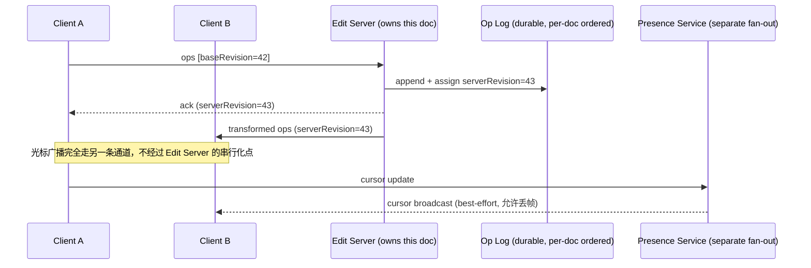

# 设计题解：协同文档编辑（Collaborative Editing / Google Docs）

## 题目与范围

面试官通常这样开场："设计一个像 Google Docs 一样的协同文档编辑器：多个用户可以同时打开同一
篇文档，实时看到彼此的修改，光标和选区也能互相看到，网络抖动或短暂离线后重新上线要自动补
齐。" 这句话里藏着这道题真正的难点——不是"多人能编辑同一个文件"（那只是加个写锁），而是
"多人可以在同一时刻、同一段文字上敲键盘，系统必须让所有人的屏幕最终收敛到同一个结果，且不
丢字、不错序、不需要谁等谁"。

值得当场问清楚的澄清问题，以及它们各自改变的设计决策：

- **是纯文本还是富文本（rich text，含加粗、字号、图片、评论）？** 如果只是纯文本，字符序
  列一种数据结构就够了；富文本要求格式（format）作为独立于字符序列的一层数据，且两者的合
  并策略必须联动，这是本题「深入探讨」里最容易被面试官用来考察候选人深度的一节。本设计按
  富文本场景设计。
- **是否需要支持长时间离线编辑（几小时到几天）后再同步？** 决定合并算法要不要处理"客户端
  的操作历史已经远远落后于服务端"这种大跨度冲突，还是只需要处理秒级到分钟级的网络抖动。
- **版本历史要保留到什么粒度？任意时刻回滚，还是只保留命名的里程碑版本？** 直接决定存储成
  本的数量级（见「容量估算」），也决定是否需要压缩/快照策略。
- **协作规模是几个人的小团队文档，还是可能出现几百人同时编辑的公司级公告文档？** 决定单篇
  文档内部的扇出（fan-out）设计要不要单独优化热点文档。
- **权限与分享（谁能看、谁能编辑）在不在范围内？** 权限模型本身是另一个课题，本设计假设已
  有独立的权限服务返回"这个用户对这篇文档是否有编辑权"，编辑引擎只消费这个结果。

**范围内**：文档的并发编辑收敛算法、光标与在线状态（presence）广播、版本历史与快照存储、
短暂网络抖动后的重连补齐、长时间离线编辑后的合并。**范围外**：权限与分享模型、评论/建议模
式（suggesting mode）的审批流程、富媒体（图片/表格）的存储管线细节（只讨论它们如何挂载到
文档结构上，不展开对象存储的设计）、离线优先的移动端本地存储引擎实现细节、搜索与全文索引。

## 需求

**功能需求（驱动设计的 3–5 条）**

1. 多个用户同时打开同一篇文档，任意一人的编辑操作（插入、删除、格式变更）几秒内可见地反映
   在所有其他人的屏幕上。
2. 每个用户能看到其他在线协作者的光标位置和选区（presence），并在用户离开、切换标签页或
   网络断开时准确消失。
3. 编辑操作离线产生也不丢失：网络恢复后自动与服务端合并，不需要用户手动解决冲突。
4. 文档保留版本历史，用户可以浏览并恢复到任意一个历史时间点。
5. 所有客户端最终收敛到完全一致的文档内容和格式，不存在"我这边看到的和你那边不一样"的永
   久分歧。

**非功能需求（数字化）**

- **收敛性（convergence）是唯一不能妥协的正确性约束**：无论并发操作以什么顺序到达、无论
  网络延迟差异多大，所有副本应用完相同的操作集合后必须得到逐字节相同的文档状态——这比"最
  终一致"更强，因为最终状态本身必须是确定的，不能是"任选一个胜出"。
- **编辑操作端到端延迟**：本地敲键盘到屏幕更新，P50 < 50ms（必须是本地乐观应用，不能等服
  务器往返）；本地操作广播到其他协作者屏幕，P99 < 300ms。
- **光标广播延迟**：可以比文本操作宽松，P99 < 500ms——光标位置错一次的代价只是视觉上的轻
  微滞后，不是数据错误，这个区分决定了两条路径可以有不同的一致性和持久化要求（见「深入探
  讨」第 4 节）。
- **离线容忍窗口**：客户端应能容忍至少数小时的离线编辑并在重连后正确合并，而不是只处理秒
  级抖动。
- **可用性**：编辑路径目标 99.9%（协作场景比单纯浏览更依赖实时通道，但可以短暂降级为"只读
  快照 + 本地暂存待重连提交"而不是完全不可用）。
- **持久性**：一旦某个操作被服务端确认（acknowledge），就不能在任何情况下丢失，这是后续
  「深入探讨」第 5 节存储分层设计的核心约束。

## 容量估算

估算分两条完全不同量级的路径：**编辑操作路径**（少数并发协作者产生，延迟敏感、正确性要求
最高）和**在线状态/光标路径**（量级更大，但可容忍丢失）。这个区分本身就是容量估算阶段最重
要的产出。

**场景假设**（Google 未公开这些数字，以下是本设计做估算用的假设，不是真实数据）：DAU
（每日与文档发生交互的用户）1 亿，人均每天打开 4 篇文档。

- **文档打开次数/天** = 1 亿 × 4 = **4 亿次**；其中约 40% 是编辑会话（而非只读浏览）= **1.6
  亿次编辑会话/天**。
- **平均同时打开的编辑会话数**（Little's Law：会话数/天 × 平均时长 ÷ 一天秒数，平均会话时
  长按 6 分钟 = 360 秒估算）= 1.6 亿 × 360 ÷ 86400 ≈ **66.7 万个并发编辑会话**（平均）；按
  峰值是平均的 3 倍（假设，未经真实流量验证）估算，**峰值约 200 万个并发编辑会话**。
- **真正需要合并算法介入的协作会话**：多数编辑会话是单人编辑（不需要合并），假设仅 5% 的
  并发会话有 ≥2 人同时编辑，平均每个协作会话 3 人在线：峰值协作场景内的并发编辑者约
  **30 万人**。这个数字直接决定了合并算法服务器需要承受的操作吞吐，而不是全部 200 万并发
  会话——**这是本节最容易被面试官考察出破绽的地方：绝大多数"并发用户"根本不产生合并冲突**。
- **编辑操作 QPS**：假设一个正在协作编辑的用户只有 15% 的时间在真正敲键盘（其余时间在阅读、
  思考），敲键盘时客户端把按键批量打包，每 300ms 向服务器发一次操作（避免逐字符往返），则
  单个协作编辑者的操作速率 ≈ 0.15 × (1/0.3) ≈ 0.5 次/秒；30 万并发协作编辑者 × 0.5 ≈
  **peak 约 15 万 QPS 的编辑操作**。经服务器转换（transform）后要广播给同一文档内的其他协
  作者（平均每个操作要发给 2 个其他人），**广播发送 QPS 峰值约 30 万**。
- **光标/在线状态 QPS**：光标移动比敲键盘更频繁，假设活跃协作者持续以 5Hz 广播光标位置，
  非活跃但仍在场的协作者以 1Hz 心跳广播，峰值光标更新 QPS 约 **30 万**——量级上和编辑操作
  广播相当，但**允许丢失、不需要持久化、不需要严格顺序**，这个差异决定了它必须走一条完全
  独立于文档操作日志的轻量广播通道（见深入探讨第 4 节）。
- **存储——新文档内容**：假设每天新建 500 万篇文档，平均每篇 50KB（纯文本+格式元数据，不
  含图片），一年新增内容存储 ≈ 500 万 × 365 × 50KB ≈ **91.25 TB/年**。
- **存储——操作日志（oplog）**：假设 1.6 亿次编辑会话中，每次会话平均产生 180 次操作（会
  话时长 360 秒 × 15% 打字占比 × 3.33 次/秒），则全平台每天产生的操作总数 ≈ 1.6 亿 × 180 ≈
  **288 亿条操作/天**；每条操作记录（类型+位置+内容增量+作者+逻辑时间戳）约 100 字节，若
  永久保留全部原始操作，一年的操作日志存储 ≈ **约 1.05 PB/年**——**是文档内容本身存储量
  （91.25 TB/年）的约 11.5 倍**。这是本题容量估算里最关键的一条：**如果版本历史设计成"无
  限保留每一次按键"，存储成本会比文档内容本身高一个数量级**，这直接决定了必须做快照压缩
  （见深入探讨第 5 节），而不是无脑保留全部操作。
- **带宽**：峰值编辑操作广播 30 万 QPS × 约 200 字节/操作 ≈ 60MB/s；这个量级用普通应用服
  务器的出向带宽完全可以承受，不是这道题的瓶颈——存储和"单文档内部必须保持全局顺序"这个约
  束才是。

## 核心实体与 API

**实体**

- **Document**：`id, title, latestRevision, createdAt, ownerId`——文档元数据；实际内容不直
  接存在这张表里。
- **Snapshot**：`documentId, revision, content(富文本树/字符序列+格式), createdAt`——某个
  历史时刻的完整文档状态，是压缩后的版本历史锚点（见深入探讨第 5 节）。
- **Operation**：`id, documentId, baseRevision, clientId, clientSeq, opType(insert/
  delete/format), payload, serverRevision, appliedAt`——操作日志的一条记录，`serverRevision`
  是服务器分配的全局单调序号，是收敛性的根基。
- **Session**：`connectionId, documentId, userId, cursorPos, selectionRange, color,
  lastSeenAt`——纯在线状态，不落盘到主存储，只存在于内存/缓存。

**API**

```
GET  /documents/{id}                      → {latestRevision, snapshotUrl}
GET  /documents/{id}/revisions?since=R     分页拉取自修订版本 R 之后的操作，用于重连补齐
POST /documents/{id}/snapshot              内部：由压缩任务调用，生成新快照并允许截断旧操作日志

WS   /documents/{id}/edit                  主编辑通道
     客户端 → 服务器: {clientId, clientSeq, baseRevision, ops[]}
     服务器 → 客户端: {serverRevision, transformedOps[]}（广播给同文档其他连接）
                     或 {ack, serverRevision}（回给发起者）

WS   /documents/{id}/presence              独立的光标/在线状态通道，与 /edit 完全分离
     客户端 → 服务器: {cursorPos, selectionRange}（不需要 baseRevision，无序也无妨）
     服务器 → 客户端: 广播其他协作者的光标状态，允许丢帧
```

**幂等性**：`clientSeq` 是每个客户端连接内的单调递增序号，服务器按 `(clientId, clientSeq)`
去重——网络重试导致同一批操作重复到达时，服务器只应用一次；`baseRevision` 告诉服务器这批
操作是基于哪个历史版本产生的，是转换（transform）算法定位"需要对抗哪些并发操作"的关键输入。

**故意不做的**：不提供"锁定某一段落禁止他人编辑"的 API（这与实时协作的产品前提冲突）；不
在编辑通道里夹带权限校验逻辑（权限由独立服务前置校验，编辑服务只信任已通过校验的连接）；
不提供跨文档的批量操作 API；评论/建议模式的审批流放在另一个服务，不复用这条操作日志。

## 高层设计



**编辑路径**：每篇文档在任意时刻只归属**一个** Edit Server 实例负责排序（类似
[[networking.realtime|Realtime Delivery]] 中长连接状态即扩容成本的原则，这里状态就是"这篇
文档的操作历史"）。客户端通过 WebSocket 提交基于某个 `baseRevision` 的操作，服务器把它与
自 `baseRevision` 之后、已经提交的并发操作做转换（transform），分配全局单调的
`serverRevision`，追加到该文档专属的持久化操作日志，再把转换后的结果广播给同文档的其他连
接。存储技术类是**按文档 id 分片的顺序追加日志（append-only log）**，因为这条路径唯一需要
的保证是"同一文档内的操作有严格全局顺序"，这正是单一归属节点 + 追加日志天然提供的能力，不
需要分布式共识。

**在线状态路径**：完全独立于编辑路径的轻量广播服务，键是 `documentId`，值是一组连接的光
标/选区，采用内存态发布订阅（如 Redis Pub/Sub 或应用内的连接分组广播），不写入任何持久化
存储，连接断开即状态消失，不需要顺序保证。选它是因为这条路径允许丢失（见容量估算），任何
为了持久化或顺序化而付出的成本都是浪费。

**存储路径**：Snapshot 服务周期性（或按操作数阈值）把 Edit Server 内存中的文档状态落盘为
一个新快照，并允许把该快照之前、超出保留窗口的细粒度操作从热存储迁移到冷存储或直接丢弃（
见深入探讨第 5 节）；文档冷启动/新连接加入时，先加载最近快照，再重放快照之后的操作追平到
最新版本。

## 深入探讨

### OT、CRDT、Differential Synchronization：三种收敛算法的真实取舍

**问题**：多个用户并发编辑同一段文字，必须保证所有副本最终收敛到相同结果，且尽量不牺牲本
地编辑的即时响应（本地操作必须先乐观应用，不能等服务器确认）。

**方案一：操作转换（Operational Transformation, OT）**。每个操作携带它产生时所基于的文档
版本；当服务器收到一个操作，把它与该版本之后已经提交的并发操作依次做"转换"（例如一个插入
操作如果发生在另一个并发插入之后的位置，转换函数要把插入位置往后平移相应字符数），转换后
的结果被应用并广播。代价：转换函数必须满足两个正确性条件（TP1：不同顺序应用两个操作对结果
无影响；TP2：转换本身在不同应用顺序下也要保持一致），手写的转换矩阵覆盖插入/删除/格式变更
的交叉组合极其容易出现未被发现的边角案例——这正是历史上多个 OT 实现出现过难以复现的收敛性
bug 的根源（Google Wave 的 OT 白皮书为此专门设计了以服务器为唯一权威、要求客户端等待确认
后才能发送下一批操作的架构，见深入探讨第 2 节）。

**方案二：CRDT（Conflict-free Replicated Data Type）**。把文档字符序列建模为一种数据结构
（如 RGA/Logoot 这类序列 CRDT），每个字符插入时被赋予一个全局唯一、可比较大小的位置标识
符，使得任意两个副本无论以什么顺序应用同一组操作，都能按位置标识符的偏序关系收敛到相同序
列——不需要一个中心节点做转换裁决，数学上保证收敛。代价：为了支持"删除后仍需保留位置信息
以便后续并发插入能正确定位"，通常需要给已删除字符保留墓碑（tombstone）标记，长期编辑的文
档元数据可能显著膨胀；富文本格式（不只是纯字符序列）的 CRDT 设计直到近几年才有成熟方案
（见深入探讨第 3 节），比纯文本 CRDT 复杂得多。

**方案三：差分同步（Differential Synchronization, Fraser）**。不传输细粒度操作，而是客户
端和服务器各自维护一份"影子副本"，周期性地对本地当前版本和影子副本做文本 diff，把 diff 打
包发给对方，对方 patch 到自己的版本，如此循环。代价：本质上是一个轮询/周期性同步循环，不
是真正的操作级实时广播，同一位置的并发编辑丢失"谁先谁后"的操作语义，也更难自然地携带结构
化的富文本格式元数据（diff 是对扁平文本做的，格式是叠加信息，两者的合并顺序容易打架）。

**本设计的选择：中心化 OT**——这也是 Google Docs 团队 2010 年公开描述的真实做法：文档存成
一个由插入文字、删除文字、应用样式三种变更组成的修订日志（revision log），显示文档时从头
重放这份日志，服务器用操作转换裁决并发变更（见「来源与延伸」Google Drive Blog 三篇系列文
章）。理由：一篇文档本来就需要一个权威节点来维护严格的操作全局顺序（用于版本历史、权限校验前置），
既然权威节点已经存在，就应该让它承担转换裁决的职责，换来比"无中心 CRDT"更简单的存储模型
（操作日志本身就是唯一真相来源，不需要额外的墓碑/位置标识符膨胀）；正确性风险通过工程手段
缓解，而不是回避——大规模基于生成随机并发操作序列的收敛性测试（property-based testing），
比试图手工证明转换矩阵正确更可靠。

### 服务器权威的 OT 控制回路：为什么客户端要等确认

**问题**：如果每个客户端都可以随时发送新操作而不等待服务器确认，服务器需要针对任意两个客
户端之间可能存在的、尚未被确认的操作组合做转换，转换的复杂度会随并发深度指数增长。

**方案一：允许客户端连续发送，无需等待确认**。理论上响应更快，但服务器必须维护"每个客户端
分别看到过哪些操作"的独立状态空间，任意两个客户端之间的转换路径都可能不同，正确性证明和
实现复杂度急剧上升。

**方案二（本设计采用，与 Google Docs 团队 2010 年公开描述的协议一致，Google Wave 项目的 OT
架构也采用同样原则）：客户端在收到服务器对上一批操作的确认之前，本地缓存新产生的操作，不
发送**——客户端只维护"已发送但未确认"和"本地产生但未发送"两个列表，从不同时把第二批未确认
的操作发出去。这样服务器只需要维护一份状态空间——它自己应用过的操
作历史——任何客户端发来的操作都是"基于服务器历史上的某个版本"，服务器只需要把这批操作与该
版本之后、自己历史里新增的操作做转换即可，不需要考虑"其他客户端各自看到了什么"。代价是本
地产生的操作在确认到达前会在客户端排队合并（多个本地操作可以被组合成一个操作，减少确认后
需要转换的操作数），略微增加了本地到远端确认之间的延迟感知，但换来服务器实现和正确性验证
的巨大简化——这是"用架构约束换正确性简单性"的典型例子。

### 富文本格式与交错异常（interleaving anomaly）

**问题**：如果文档只是字符序列，OT/CRDT 都可以只处理"在某个位置插入/删除字符"；但富文本还
有"这一段是粗体""这个词是超链接"这类跨越一个字符区间的格式属性，且两个用户可能同时在同一
位置各自插入一段文字——如果算法只按字符逐个交替应用两边的插入，会产生"两段本应各自连续的
文字被拆散、字符级交替穿插"的乱码结果（这被形式化地称为交错异常）。格式还有"续写规则"的语
义要求：在粗体文字末尾继续打字，新字符应该继续加粗；但在超链接或评论范围末尾继续打字，新
字符不应该被自动纳入超链接。

**方案一：格式作为字符流内的内联标记（inline marker）**，与富文本编辑器早期实现类似。转换
逻辑必须同时处理字符位置偏移和格式标记的位置偏移，两者纠缠在一起，正确处理并发格式操作与
并发插入操作的组合极其容易出错。

**方案二（本设计采用）：格式作为独立于字符序列的区间层，通过锚定到字符的稳定标识符（而不
是数值下标）来定义区间边界，并显式声明每种格式属性在区间末尾插入新字符时是否"扩展"**。这
是 CRDT 阵营近年的研究成果（Peritext 一类方案）形式化解决交错异常和续写语义的方式，其核心
思想——格式绑定稳定字符标识而不是易变的数值位置——同样适用于 OT 实现：本设计的转换函数只
处理字符位置，格式区间通过字符的稳定 id 引用，插入/删除只需要平移或收缩区间端点，天然避免
了格式和字符位置计算纠缠在一起的复杂度。

### 光标与在线状态：为什么它不能走文档操作日志的那条路

**问题**：协作者的光标位置和在线状态变化频率（峰值约 30 万 QPS，见容量估算）与文档编辑操
作广播量级相当，如果和文档操作走同一条串行化、持久化的通道，会让这条对正确性要求最高的路
径承受双倍并非必要的负载。

**方案一：光标位置也作为一种"操作类型"混入文档操作日志，复用同一套转换和广播逻辑**。实现
简单（只需要多加一种 op type），但污染了操作日志的语义——版本历史里会混入大量与文档内容
无关的光标移动记录，且光标丢帧或乱序在文档操作的语境下会被误认为需要转换裁决，浪费转换器
的计算。

**方案二（本设计采用）：光标/在线状态完全独立于编辑通道**，走一条不持久化、不要求顺序、允
许丢帧的发布订阅广播（见「高层设计」），可以横向扩展成与 Edit Server 无关的一层，故障时
只影响体验（协作者暂时看不到彼此光标），不影响文档内容的正确性。这个决策直接对应本文在
「需求」一节强调的原则：**读一次错误信息的代价只是一次视觉滞后，不是数据错误，凡是这种数
据就不该占用为强一致性/持久性付费的那条路径**，这与 [[networking.realtime|Realtime
Delivery]] 里"连接状态本身就是扩容成本"的结论一致——这里进一步把"需要持久化的状态"和"可
丢弃的状态"拆成两条完全独立的连接，而不是共享一条连接、共享一套保证。

### 版本历史存储：无限操作日志 vs 快照压缩

**问题**：容量估算给出的数字很扎眼——如果无限期保留每一次按键产生的原始操作，一年的操作日
志存储（约 1.05 PB/年）会比文档内容本身（约 91.25 TB/年）高出一个数量级以上。这不是"存储
便宜就无所谓"的问题：这是全平台所有文档共享的同一类日志，增长速度只会随用户规模线性上升。

**方案一：永久保留全部原始操作，不做任何压缩**。用户可以精确回放到任意一次按键，理论上最
灵活；代价是存储成本随时间无界增长且增速远超文档内容本身，绝大多数用户从未使用过这种按键
级粒度的历史回溯能力。

**方案二：固定周期截断，只保留最近 N 天的操作日志，更早的直接丢弃**。存储成本可控，但用户
彻底失去查看更早版本历史的能力，不符合"版本历史应保留到什么粒度"这条需求。

**方案三（本设计采用）：两层保留策略**——为最近的保留窗口（如 30 天）保留细粒度操作日志，
支持精确到操作级别的撤销和历史浏览；超出窗口的部分，由后台压缩任务把操作日志折叠成若干个
命名快照（既可以是系统按操作数/时间阈值自动生成的检查点，也可以是用户主动命名的里程碑版
本），只保留快照本身和快照之间的差异摘要，丢弃中间的细粒度操作。恢复任意历史版本时，先定
位到最近的快照，如果目标版本落在保留窗口内则继续重放细粒度操作追平，否则只能恢复到最近的
命名快照。这个方案用一个和文档内容量级（91.25 TB/年）相当、而不是操作日志量级（1.05
PB/年）相当的存储成本，换来"绝大多数版本回溯需求"的满足，只在近期精细回溯能力上做了明确
声明的取舍。

## 瓶颈、故障与演进

**热点与倾斜**：由于单篇文档的操作必须有全局顺序，**一篇文档内部的编辑流量无法再被切分到
多个节点**——这与大多数"按 key 分片就能线性扩容"的设计不同。一篇几百人同时编辑的公司级公
告文档，全部操作流量集中在归属它的那一个 Edit Server 实例上，水平分片（按文档 id 分片）
只解决了"不同文档之间"的负载均衡，解决不了"同一篇热文档内部"的热点。缓解手段是限制单篇文
档的实际并发编辑人数上限（超出后新加入者进入只读模式，实时看更新但不参与操作合并），把这
类极端热点变成产品层面的显式限制，而不是假装架构能无限扩容单文档吞吐。

**故障域**：
- **归属某文档的 Edit Server 实例宕机**：该文档编辑立即不可用，需要另一个实例接管；由于
  操作日志是持久化的唯一真相来源，接管节点只需要加载最近快照 + 重放快照之后的少量操作即
  可恢复到宕机前状态（这正是深入探讨第 5 节压缩策略存在的另一个理由：如果没有快照，接管
  节点要重放该文档自创建以来的全部操作，恢复时间随文档年龄增长）。
- **持久化操作日志存储不可用**：编辑路径必须整体降级为只读——绝不能在操作未确认持久化前
  就向客户端返回确认，这是「需求」一节持久性约束的直接体现；本地客户端仍可继续乐观编辑并
  暂存，等存储恢复后重放补交。
- **在线状态/光标广播服务不可用**：不影响文档内容的正确性，只是协作者暂时看不到彼此光标，
  按 fail open 处理（不阻塞编辑），因为它本来就是允许丢失的数据。
- **客户端长时间离线后重连**：如果离线时长超过操作日志保留窗口，无法再用"基于某个
  baseRevision 做转换"的常规路径追平，需要退化为整体三方合并（客户端本地版本、断开时的服
  务器版本、重连时的最新服务器版本），这是比正常 OT 转换更重的路径，只在长时间离线这一少
  数场景触发。

**10 倍演进**：从千万级 DAU 到亿级，压缩策略的保留窗口和快照频率需要按文档热度分层（热门
协作文档更频繁快照，冷门几乎不再编辑的文档可以在首次压缩后长期不再触碰），避免压缩任务本
身的吞吐成为新瓶颈。

**100 倍演进**：如果要支持地理上分布在两个大洲的用户以毫秒级延迟同时编辑同一篇文档，单一
归属节点的中心化 OT 架构会让远端用户始终承受跨区域往返延迟——这时候需要重新评估方案一开始
被放弃的 CRDT 路线（用无中心的合并换掉"必须有一个权威排序节点"这条约束），代价是接受更复
杂的富文本格式合并语义和更大的文档元数据（位置标识符、墓碑），这是一个需要重新权衡整个方
案一决策的架构级变化，不是加机器能解决的。

## 面试官会追问什么

**中级（mid）**
- "客户端网络断开几秒后重连，怎么补齐错过的编辑？" 客户端记住最后收到的 `serverRevision`，
  重连后调用 `GET /documents/{id}/revisions?since=` 拉取该版本之后的全部已提交操作并依次
  应用，这条路径复用的是常规转换逻辑，不需要特殊处理。
- "为什么本地敲键盘不能等服务器确认了才显示？" 那样 P50 延迟会退化成一次完整网络往返，协
  作编辑最基本的"手感"要求本地乐观应用，服务器确认只用来处理与其他人的并发冲突。

**高级（senior）**
- "两个用户同时对同一段文字一个加粗、一个删除，怎么处理？" 转换函数需要显式定义这类跨类型
  操作的优先规则（例如删除操作对被删除区间内的格式变更具有覆盖优先级，格式操作如果发现目
  标区间已被删除则退化为空操作），这类规则必须写进转换矩阵并被收敛性测试覆盖，不能临场决
  定。
- "文档内容和光标广播用同一条 WebSocket 连接会有什么问题？" 两者的持久化、顺序、丢失容忍
  要求完全不同，混在一条连接和一套广播逻辑里，会让为光标这种可丢弃数据设计的降级手段被迫
  牵连到文档内容的正确性保证（见深入探讨第 4 节）。

**参谋级（staff）**
- "如何验证你的转换函数不会在某些并发操作组合下导致不同客户端永久分歧？" 手工证明转换矩阵
  的 TP1/TP2 性质在覆盖插入/删除/格式交叉组合时极易遗漏边角情况，更可靠的做法是写一个基于
  随机生成并发操作序列的收敛性测试框架，持续跑几百万组随机操作组合，断言所有模拟客户端最
  终收敛到同一状态，把正确性验证从"证明"变成"大规模抽样检验"。
- "如果要支持跨大洲的多主编辑，你会怎么改这个架构？" 中心化 OT 的单一归属节点本质上要求所
  有编辑者向同一个权威排序点收敛，跨区域延迟无法通过加机器消除；需要重新评估 CRDT 路线，
  接受序列位置标识符和墓碑带来的元数据膨胀，换取真正的无中心多主编辑能力——这是方案选择层
  面的取舍，不是简单的扩容。

## 常见错误

- 把这题当成"聊天消息广播"来做，以为只要把每个人的按键事件原样广播出去、客户端各自按到达
  顺序应用就行，没意识到不同客户端网络延迟不同会导致收到操作的顺序不同，从而产生永久分歧。
- 说"用 CRDT 解决"却说不出具体用哪种数据结节构（如 RGA/Logoot）、如何处理富文本格式的交
  错异常，只是把 CRDT 当成一个免检的万能词。
- 把光标/在线状态当成和文档内容同等重要的强一致数据，浪费本该用在文档正确性上的持久化和
  顺序保证。
- 版本历史设计成"无限保留每一次操作"，没有意识到存储会以远超文档内容本身的速度增长，也没
  设计快照压缩策略。
- 只考虑了几秒到几分钟的网络抖动重连，没考虑客户端离线数小时甚至数天后重新上线时，常规基
  于 `baseRevision` 转换的路径可能已经因为日志被压缩而失效，需要退化到更重的三方合并。
- 假设文档可以像其他资源一样任意按更细粒度分片，忽略了"同一篇文档内部的编辑必须有全局顺
  序"这条根本约束，导致误判热点文档也能通过分片线性扩容。

## 五分钟讲法

This is a collaborative document editor, so the central problem is convergence: every replica
must end up with byte-identical content no matter what order concurrent edits arrive in, while
local typing still feels instant. I model each document as owned by exactly one edit-authority
server at a time, because a document's edits fundamentally need one global order — that's not a
sharding-unfriendly accident, it's the actual constraint the whole design serves. Clients apply
their own edits locally right away, then send them to that server tagged with the revision they
were based on; the server transforms incoming operations against whatever concurrent operations
already landed since that revision, assigns the next global revision number, and broadcasts the
transformed result. I chose centralized operational transformation over CRDTs because the
document already needs one authority for ordering and permissions, so letting that authority also
resolve conflicts is simpler than paying for CRDT's tombstones and position identifiers just to
avoid having a center that already exists. Rich text formatting is the trickiest part: formatting
spans are anchored to stable character identifiers rather than numeric offsets, which sidesteps
the interleaving anomaly where two concurrent insertions at the same position get corrupted into
character-by-character garbage. Presence and cursors get a completely separate, lossy, unordered
broadcast channel, because a stale cursor costs a visual flicker while a stale text operation would
be data corruption — those two failure costs should never share one pipe. Version history is the
place raw numbers bite hardest: keeping every keystroke forever costs roughly ten times more
storage than the documents themselves, so I keep fine-grained operations only for a rolling
window and compact everything older into named snapshots. Under 100x scale, cross-continent
multi-master editing would break the single-authority assumption entirely and force a real
architectural pivot back toward CRDTs, which is a decision I'd surface explicitly rather than
patch around with more servers.

## 来源与延伸

- [Google Drive Blog — "What's different about the new Google Docs" (2010 年三篇系列：Working
  together even apart / Conflict resolution / Making collaboration fast)](https://drive.googleblog.com/2010/09/whats-different-about-new-google-docs_22.html)：
  Google Docs 工程师 John Day-Richter 撰写的一手技术博客，三篇依次说明了协同编辑的核心难
  题、操作转换算法本身（InsertText/DeleteText/ApplyStyle 三种变更组成修订日志，重放日志得
  到文档状态）、以及客户端-服务器协议（客户端只维护"已发送未确认"和"本地未发送"两个列表，
  从不同时发出第二批未确认操作，服务器只需维护自己的修订日志一份状态空间）。本文「深入探
  讨」第 1 节对 Google Docs 使用 OT 这一事实的引用、以及第 2 节的控制回路设计，都直接依据
  这三篇文章，是本题解里唯一直接来自 Google 一手技术资料的来源。
- [Figma — How Figma's multiplayer technology works](https://www.figma.com/blog/how-figmas-multiplayer-technology-works/)：
  真实工程博客，记录了 Figma 评估完整 CRDT 理论后，认为大部分复杂度是为了满足"去中心化环
  境"，而 Figma 本来就有一个中心服务器，于是选择了更简单的"属性级最后写入胜出（last-writer-
  wins）+ 服务器校验树结构合法性"的模型——这篇博客本身只讨论画布上的对象属性（如颜色、位
  置），完全没有提到文本编辑或字符级并发插入。**以下是本文自己的推论，不是 Figma 博客说
  的**：Figma 的画布对象模型天然是属性级的（每个对象的每个属性独立取"最后一次写入"），但
  文本编辑的核心难点恰恰是"同一位置的并发字符插入"不能简单地按属性取最后写入胜出——两个人
  同时在同一个字符位置插入不同文字，不存在一个"属性"可以只取其中一次写入而丢弃另一次，必
  须显式排序或转换。本文据此推断这是 Google Docs 选择 OT 而不是 Figma 式简化模型的合理原
  因，在「深入探讨」第 1 节展开，但这是本文的推理，Figma 从未公开讨论过文本编辑场景。
- [Kleppmann, Wang, Beresford — Peritext: A CRDT for Collaborative Rich Text Editing](https://www.inkandswitch.com/peritext/)：
  学术论文（Ink & Switch / 剑桥大学），系统化定义了富文本 CRDT 必须处理的交错异常
  （interleaving anomaly）和格式续写语义（扩展 vs 非扩展样式）。本文虽然选择 OT 而不是
  CRDT 作为主算法，但在「深入探讨」第 3 节直接借用了这篇论文对交错异常问题本身的形式化定
  义，并说明同样的"格式锚定到稳定字符标识"思路在 OT 实现里同样适用——这是本文与它的分歧
  点：论文本身只在 CRDT 语境下给出解法，本文将其思路迁移到中心化 OT 架构。
- [Google Wave Operational Transformation whitepaper (Apache Wave)](https://svn.apache.org/repos/asf/incubator/wave/whitepapers/operational-transform/operational-transform.html)：
  同属 Google 的另一个协同编辑项目（Wave，与 Docs 是不同产品）在其算法白皮书里给出的更形
  式化的转换函数说明，包含 wavelet 上操作组合（composition）的机制。本文用它补充 Google
  Docs 2010 年博客未展开的形式化细节，两者描述的客户端等待确认再发送这一控制回路原则一致。
- [ByteByteGo — How to Design Google Docs](https://bytebytego.com/guides/how-to-design-google-docs)（`no-archive`，商业备考网站）：
  给出了一个五层高层架构（客户端→WebSocket 服务器→消息队列→文件操作服务器→存储）的概览，
  并提到"Google Docs 根据维基百科使用 OT"这一转引自维基百科的说法，未展开具体的转换算法、
  富文本格式处理或容量数字。OT 这一点的一手依据是 Google Docs 团队自己 2010 年发布的
  技术博客（见上），而不是这类转引；本文的容量估算、转换控制回路和富文本深入探讨也都是这份指南完
  全没有覆盖的部分。
