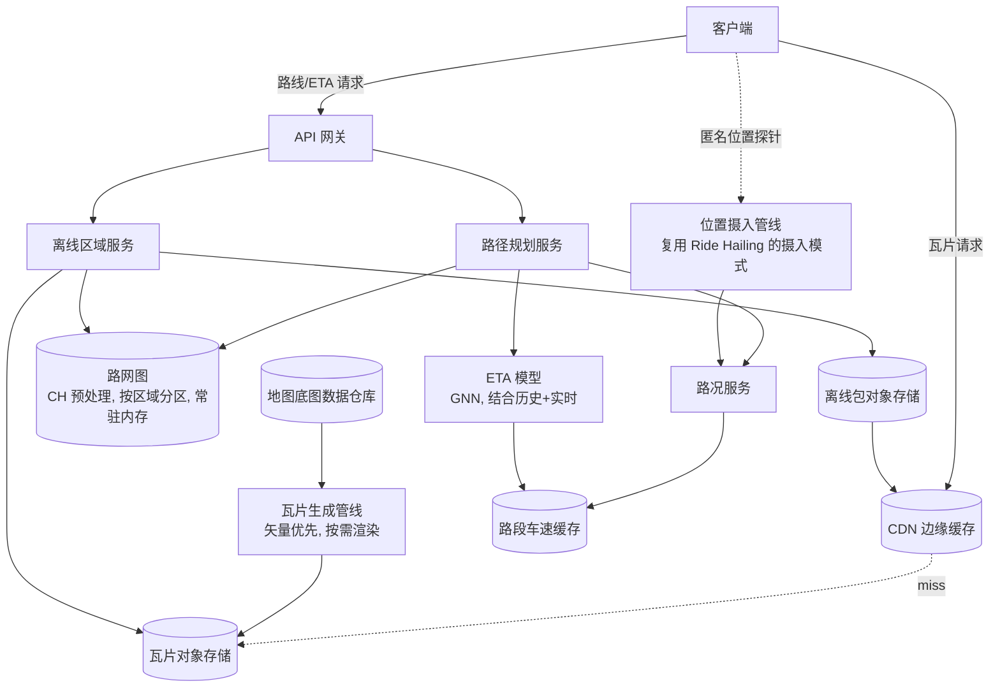

# 设计题解：地图与导航（Maps & Navigation，Google Maps）

## 题目与范围

面试官通常这样开场："设计一个类似 Google Maps 的地图与导航系统：用户能在地图上任意平移
缩放，能规划一条从 A 到 B 的路线并得到到达时间（ETA），行驶过程中路况变化时能重新规划，
没有网络时也能继续导航。" 这句话背后叠着三道彼此独立又互相牵连的题：**怎么把整个地球的
地图数据分块传给客户端并且传得快**（瓦片，tile）、**怎么在一张几千万到几亿条边的路网图上
秒级甚至毫秒级算出最短/最快路径**（路径规划）、**怎么把千百万部手机的位置流变成一个可信的
"现在这条路有多堵"的估计，并让 ETA 跟着它实时变化**（实时路况）。三道子问题的数据结构和
更新节奏完全不同，这正是这道题比看上去更难的地方。

值得当场问清楚的澄清问题，以及它们各自改变的设计决策：

- **地图渲染优先级是矢量瓦片（vector tile）还是栅格瓦片（raster tile）？** 决定瓦片管线
  产出的是可由客户端本地渲染的几何数据，还是服务端预渲染好的位图——见「深入探讨」第 1 节。
- **路径规划只服务驾车，还是要覆盖步行/骑行/公交多种出行方式？** 多模式意味着路网图要按
  出行方式切分成不同的可达性子图，且换乘涉及时刻表这一完全不同的领域（本题解不展开，
  假设只做驾车路径规划，这也是任务范围明确排除的部分）。
- **路况要不要实时反映到还没出发的路线报价（ETA）上？** 决定 ETA 是查询时现算还是有一条
  独立的流式管道持续把"路段当前车速"写进一个供查询直接读的存储——见「深入探讨」第 3 节。
- **离线地图要不要支持完整的路径规划和重新规划，还是只支持看地图？** 决定离线包里要不要
  打包一份路网子图，而不只是瓦片图片——见「深入探讨」第 5 节。
- **要不要处理地图数据本身的采集与更新（卫星图、实地测绘、道路施工上报）？** 不处理——
  本题假设路网和地图底图数据已经存在于一个"地图数据仓库"里，只设计怎么把它变成可服务的
  瓦片和路网图，数据采集是完全独立的一道题。

**范围内**：地图瓦片的生成与分发、单一出行方式（驾车）的路径规划、基于实时路况的 ETA、
偏离路线后的重新规划、离线地图。**范围外**：地图数据本身的采集/标注/审核、多出行方式与
公交换乘、地点/兴趣点搜索（附近商户按位置检索是 [[solution-proximity|Proximity]] 的
题目）、车辆高频位置摄入与撮合调度（那是 [[solution-ride-hailing|Ride Hailing]] 的题目，
本题解在「实时路况」一节直接复用它对"高频位置写入应该走独立、无事务保证的摄入路径"这个
结论，不重新推导）。

## 需求

**功能需求（驱动设计的 3–5 条）**

1. 用户可以在地图上任意平移、缩放，看到当前视口范围内的地图内容（道路、建筑、地名）。
2. 用户输入起点和终点（可带途经点），系统返回一条驾车路线，包含逐段路径、总距离和 ETA。
3. 导航过程中，系统持续根据实时路况更新 ETA；用户偏离既定路线时，系统能检测到并给出
   一条新路线，而不需要用户手动重新发起请求。
4. 用户可以预先下载某个区域的地图，在完全没有网络连接的情况下继续查看地图并导航。
5. 路线的 ETA 要把"当前路况"和"历史同一时段的常见路况"结合起来，而不是只用道路限速反推。

**非功能需求（数字化）**

- **瓦片加载延迟**：视口内瓦片 P99 < 100ms——这是每一次平移缩放都会触发的高频交互，
  延迟直接决定"地图是否流畅"这个第一印象。
- **路线计算延迟**：一次点对点路径规划 P99 < 500ms，即使起点和终点相距上千公里、横跨
  一个大洲——这个数字不宽松是因为它逼出了「深入探讨」第 2 节的全部讨论：朴素算法在这个
  延迟预算内根本算不完一次洲际查询。
- **ETA 新鲜度**：导航过程中的 ETA 应该在路况发生明显变化（比如前方出现拥堵）后的
  一两分钟内反映出来，而不是要等到下一次用户主动发起路线请求。
- **可用性**：瓦片读路径目标 99.99%（地图打不开约等于产品不可用）；路径规划目标 99.9%；
  离线地图在无网络场景下不依赖任何服务端可用性，这正是离线设计存在的意义。
- **一致性**：瓦片内容和路网数据都是最终一致——道路新开通或限速变更，允许几小时到几天的
  延迟才反映到服务端，这不是产品短板，而是"道路本身变化的频率"决定的合理目标；实时路况
  的一致性要求完全不同（见容量估算和「深入探讨」第 3 节），需要分钟级甚至更短的新鲜度。

## 容量估算

这道题的容量估算比大多数题目多一层：**同一个用户会话里，产生的是三种量级完全不同的
负载**——浏览地图产生的瓦片请求、发起一次导航产生的路线请求、以及导航过程中持续刷新 ETA
产生的请求。三者的比例直接决定架构该在哪个环节做重优化。

**基础假设**：Google 在 2024 年第三季度财报电话会上披露 Google Maps 月活跃用户
（MAU）突破 20 亿（见「来源与延伸」）。本题解取 20 亿 MAU 作为设计锚点，后续全部是
**本设计的假设**：

```
MAU                     = 2,000,000,000
假设 DAU/MAU 比例        = 40%（地图类工具型 App，比社交类低，但比纯工具类高——
                                通勤、找路、被动查地址天天都会用到）
DAU                     = 2,000,000,000 × 40%        = 800,000,000
假设 人均每日打开会话数   = 1.5
每日会话数              = 800,000,000 × 1.5            = 1,200,000,000
```

**瓦片流量**：假设一次典型会话（用户打开地图看一眼、平移几下）平均触发 25 次瓦片请求
（包含视口内瓦片和预取的相邻瓦片）：

```
瓦片请求/天             = 1,200,000,000 × 25            = 30,000,000,000
瓦片 QPS(avg)           = 30,000,000,000 / 86400        ≈ 347,222
瓦片 QPS(peak, ×3)      ≈ 1,041,667
```

**路线与 ETA 流量**：假设 15% 的会话会发起一次导航：

```
导航会话/天             = 1,200,000,000 × 15%           = 180,000,000
路线请求 QPS(avg)       = 180,000,000 / 86400            ≈ 2,083
路线请求 QPS(peak, ×4)  ≈ 8,333
```

这个数字如果到此为止会严重低估系统的真实负载——**每一次导航不是只请求一次路线，而是在
整段行程里持续刷新 ETA**。假设平均单次导航行程 20 分钟，ETA 每 30 秒刷新一次：

```
单次导航的 ETA 刷新次数  = (20 × 60) / 30              = 40
ETA 刷新事件/天         = 180,000,000 × 40              = 7,200,000,000
ETA 刷新 QPS(avg)       = 7,200,000,000 / 86400          ≈ 83,333
ETA 刷新 QPS(peak, ×4)  ≈ 333,333
```

**这是这一节里改变设计决策的关键数字**：ETA 刷新的平均 QPS（约 83,333）是初始路线请求
（约 2,083）的整整 40 倍。如果把"发起导航"和"导航中持续刷新 ETA"当成同一种请求、走同
一条重量级路径（每次都完整重算一次点对点路径规划），系统的真实瓶颈会被严重低估——正确
的架构必须让"持续刷新"走一条比"从零规划一条新路线"轻得多的路径（增量更新已知路线的
ETA，而不是重新做一次路径搜索），这正是「深入探讨」第 2、3 节共同的落脚点。

**瓦片存储**：标准瓦片金字塔（tile pyramid）从 0 到 20 级缩放，每级瓦片数是上一级的 4
倍（OpenStreetMap 与 Google Maps 官方文档一致，见「来源与延伸」）：

```
总瓦片数(0–20级) = Σ(4^z), z=0..20 = (4^21 - 1) / 3 ≈ 1.466 × 10^12
```

假设每张栅格瓦片平均 15KB（不同区域密度差异很大，这里只是用于说明量级的假设）：

```
全量预渲染存储(单一风格) ≈ 1.466×10^12 × 15KB ≈ 20 PB
```

**这一步的结论比数字本身重要**：20PB 只是**一种**地图风格（还没算卫星图、深色模式等
其他风格）、**全部**缩放级别的存储量，而这些瓦片里绝大多数对应的是海洋、沙漠、南极这类
几乎不会被任何用户请求到的区域。**没有任何系统会预先渲染并存储整个金字塔**——这个数字
直接论证了「深入探讨」第 1 节的结论：瓦片必须是按需生成 + CDN 缓存的模式，而不是离线
批量渲染后整体上传对象存储。

**路网图存储**：Contraction Hierarchies 论文（Geisberger et al.，见「来源与延伸」）披露
的美国路网基准规模约为 2,400 万个节点、5,800 万条边。取节点 16 字节（id + 坐标 +
层级）、边 20 字节（起止点 + 权重 + 标志位）估算：

```
美国基础路网存储        ≈ (24,000,000×16 + 58,000,000×20) / 1e9 ≈ 1.54 GB
CH 预处理后(增加约 1.2 倍边作为 shortcut)
                     ≈ (24,000,000×16 + (58,000,000×2.2)×20) / 1e9 ≈ 2.94 GB
```

假设全球路网规模是美国的 8 倍（**本设计的假设**，用于说明量级）：

```
全球 CH 图存储          ≈ 23.5 GB
```

**这一步的结论和「瓦片存储」正好相反**：23.5GB 小到可以完整放进一台大内存机器，这道题
的路网图**不是因为放不下才分片**，而是出于别的原因（见「深入探讨」第 2 节）——数据量
本身从来不是路径规划这道题的瓶颈，路径搜索的时间复杂度才是。

## 核心实体与 API

**实体**

- `Tile`：`z, x, y, format(vector/raster/webp), style_id, etag, byte_size`——瓦片本身
  是不可变对象，一旦底图数据变化就生成新版本，而不是原地修改。
- `RoadNode`：`id, lat, lon, contraction_level`（CH 预处理后的重要性排序，见「深入
  探讨」第 2 节）
- `RoadEdge`：`from_node, to_node, length_m, base_speed_kmh, road_class, one_way,
  is_shortcut`——`is_shortcut` 区分原始道路边和 CH 预处理添加的捷径边。
- `TrafficSpeedSample`：`edge_id, observed_speed_kmh, sample_count, updated_at`——
  聚合后的路段实时车速，不是单条探针数据本身。
- `Route`：`route_id, waypoints[], polyline, distance_m, eta_seconds,
  traffic_model_version, computed_at`
- `OfflineRegion`：`region_id, bounding_polygon, zoom_range, graph_subset_ref,
  size_bytes, expires_at`

**API**

```
GET  /tiles/{z}/{x}/{y}.{format}?style=
  → 瓦片二进制内容；走 CDN 边缘缓存，缓存键包含 z/x/y/style/版本；用 ETag 支持
  客户端条件请求，未变化返回 304。这是全系统里唯一直接暴露给 CDN 的端点。

POST /v1/routes
  { origin, destination, waypoints?, mode: "drive", depart_at? }
  → { route_id, polyline, legs[], distance_m, eta_seconds, traffic_model_version }
  只读计算，不需要幂等键；但同样的 (origin, destination, depart_at 取整到分钟,
  traffic_model_version) 组合可以安全复用缓存结果，见「深入探讨」第 3 节。

POST /v1/routes/{route_id}/eta-refresh
  { current_location, remaining_leg_index }
  → { eta_seconds, delay_seconds_vs_original }
  导航中的周期性调用，是轻量的增量更新，不重新做一次完整路径搜索——这条端点单独存在，
  和 `/routes` 的高延迟预算完全不同，直接对应「容量估算」里 40 倍的刷新比例。

POST /v1/routes/{route_id}/reroute
  { current_location }
  → { route_id(新), polyline, eta_seconds }
  客户端检测到自己偏离既定路线（见「深入探讨」第 4 节）时调用，语义上等价于用当前位置
  作为新起点重新调用一次 `/routes`，但保留原 `route_id` 的历史轨迹用于统计"重新规划率"。

POST /v1/offline-regions
  { bounding_box, zoom_range } → { region_id, size_bytes, download_url }
GET  /v1/offline-regions/{id}/manifest
  → { tile_list[], graph_subset_url, expires_at }
```

**明确不做的**：不在 API 层面暴露 CH 预处理用的节点重要性排序或路网图内部分区方案——
换路径规划算法不应该动到客户端契约；不做多出行方式的统一接口（步行/公交是完全不同的
图结构和数据源）；不在 `/routes` 里返回逐秒级的精确 ETA 分布，只返回一个点估计加一个
"相对原始 ETA 的延迟"信号，精确的不确定性区间是产品层面的呈现问题，不改变这道题的架构。

## 高层设计



**瓦片路径**：客户端请求特定 z/x/y 的瓦片 → 先打 CDN 边缘缓存，命中率极高（同一城市
同一缩放级别的瓦片在短时间内被大量用户重复请求）→ 未命中时回源到瓦片对象存储；对象
存储本身不存所有可能的瓦片，冷门区域的瓦片由生成管线按需渲染后写回，这条路径的存储
技术选对象存储（不可变、按 key 寻址、天然适合 CDN 回源），而不是数据库，是因为瓦片
一旦生成就不再修改。

**路线规划路径**：客户端提交起点终点 → 路径规划服务在常驻内存、按地理区域分区的
CH 预处理图上做一次双向搜索（见「深入探讨」第 2 节）→ 查询路况服务把静态限速权重
替换成"当前+预测"的时间权重 → ETA 模型基于图神经网络（GNN）产出最终 ETA（见「深入
探讨」第 3 节）→ 返回完整路线。路网图选内存常驻结构而不是关系型数据库，是因为
「容量估算」已经证明它小到能放进内存，而图遍历这种操作在关系型数据库里天然不适合
表达。

**实时路况路径**：这条路径完全独立于路线请求路径。客户端在导航或仅仅是保持位置共享
状态时，持续上报匿名位置探针（anonymized location probe）→ 位置摄入管线把探针聚合成
"某路段当前车速"的估计，这条摄入管线复用 [[solution-ride-hailing|Ride Hailing]]"高频
位置摄入"一节的结论：不经过任何强一致事务路径，直接写入一个短 TTL 的速度缓存 → 路况
服务和 ETA 模型读取这份缓存，而不是每次路线请求都重新聚合原始探针。

**离线地图路径**：用户选定一个区域 → 离线区域服务从瓦片存储和路网图里各自切出这个
区域对应的子集，打包成一个离线包写入独立的对象存储，同样通过 CDN 分发给客户端下载
（见「深入探讨」第 5 节）。

## 深入探讨

### 瓦片金字塔的算术：为什么缩放一级是 4 倍而不是 2 倍，以及矢量瓦片真正省在哪里

标准的瓦片方案（OpenStreetMap 的 Slippy Map、Google Maps 的瓦片坐标系统一致，见
「来源与延伸」）把世界地图用 Web Mercator 投影摊平成一个正方形，在缩放级别 `z`，
横纵各切成 `2^z` 份，瓦片总数是 `4^z`——每加一级缩放，横纵分辨率各翻一倍，覆盖面积
不变但精度翻两番，所以瓦片数量是指数增长而不是线性增长。每张瓦片固定 256×256 像素，
经纬度到瓦片索引的换算公式是：

```
n = 2^zoom
xtile = n × (lon_deg + 180) / 360
ytile = n × (1 − ln(tan(lat_rad) + sec(lat_rad)) / π) / 2
```

分辨率（每像素对应的地面距离）随纬度和缩放级别变化：
`156543.03 米/像素 × cos(纬度) / 2^zoom`——这也是为什么高纬度地区（比如北欧）在同一
缩放级别下，瓦片覆盖的实际地面距离比赤道地区小得多，Mercator 投影本身在极地会严重
形变，多数产品把可用缩放范围限制在纬度 ±85° 左右来避开这个问题。

**矢量瓦片和栅格瓦片的取舍**：栅格瓦片是服务端预渲染好的 PNG/WebP 位图，客户端拿到
就能直接显示，但换一个地图风格（比如深色模式）或换一种语言的地名标注，都需要重新
渲染并存一整套新瓦片；矢量瓦片（Mapbox Vector Tile 规范，Protobuf 编码的几何数据，
见「来源与延伸」）只传输道路/建筑/地名的几何数据和属性，由客户端本地渲染成图像。
一个常见的误解是"矢量瓦片文件本身更小"——Mapbox 自己的对比案例显示，单张矢量瓦片
（PBF）完全可能比对应的栅格 PNG 瓦片更大（示例中 PBF 35KB 对 PNG 16KB，见「来源与
延伸」）。**矢量瓦片真正的存储/传输优势不在单张瓦片的字节数，而在于同一份几何数据能
服务任意多种视觉风格**：栅格方案要为"日间/夜间/卫星底图叠加/深色模式"各存一整套
金字塔，矢量方案只需要一份几何数据，风格是客户端渲染时的参数，这才是"20PB 全量预渲染"
这个数字在矢量方案下能被大幅压缩的真正原因——不是单个文件变小，是文件的种类数不再
随视觉风格线性增长。这个权衡的代价是客户端渲染开销从服务端转移到了设备端，对低端设备
和电量是真实的成本，这正是为什么大多数地图产品对矢量瓦片仍然保留一层服务端预渲染的
栅格回退（比如打印场景、低端设备的降级路径）。

**CDN 在这里的角色**：瓦片是这道题里最适合被 CDN（[[networking.cdn|CDN]]）覆盖的
一类内容——不可变、按 key 寻址、同一份内容被海量用户重复请求，命中率天然就高。这也是
为什么整条瓦片路径的架构比路线规划路径简单得多：CDN 已经解决了大部分问题，真正的
设计难度在瓦片生成管线要不要预渲染、预渲染到哪一级、冷门区域怎么处理长尾请求。

### 路网上的路径规划：为什么朴素 Dijkstra 在洲际尺度失效，以及分层方案怎么修复它

朴素 Dijkstra 算法从起点开始，按距离从近到远逐个"结算"（settle）节点，直到结算到
终点为止。它的问题不是渐进复杂度本身有错——`O((V+E) log V)` 在理论上完全可以接受——
而是**结算的节点数在洲际尺度的路网上大到查询预算完全付不起**：起点和终点相距上千
公里时，最短路径途经的节点占整个图的比例很小，但朴素 Dijkstra 在找到终点之前，会
把起点周围"距离更近"的节点几乎全部结算一遍，包括大量和最终路径毫无关系、只是恰好
"按直线距离更近"的节点——在「容量估算」给出的美国路网规模（2,400 万节点）下，一次
洲际查询可能要结算掉相当比例的全部节点，这和 500ms 的延迟预算完全不在一个数量级上。

**Contraction Hierarchies（CH，收缩分层）**的做法是把计算成本从查询时挪到预处理时：
按某种"重要性"启发式给所有节点排序（越像高速公路枢纽的节点越重要），然后按重要性从低
到高逐个"收缩"（contract）每个节点——收缩一个节点时，如果通过它连接的两个邻居之间的
最短路径确实要经过它，就在这两个邻居之间直接加一条"捷径边"（shortcut），保存"经过
这个节点"的距离信息，然后把这个节点从图里摘掉。收缩完所有节点后，图里多了大量捷径边，
但查询时只需要做一次**双向**搜索，且只沿着"通向更重要节点"的方向扩展——搜索空间被
压缩到几乎只剩下高速公路层级的节点。Geisberger 等人 2008 年的原始论文在西欧路网
（约 1,800 万个节点、4,300 万条边）上的实验显示，预处理只需几十分钟量级，单次查询降到
一两百微秒量级，比同一张图上的 Dijkstra（秒级）快三到四个数量级（见「来源与延伸」）。
这不是常数级的优化，而是把"在线搜索"的大部分工作
提前搬到了离线预处理阶段。

**但 CH 有一个致命的前提假设**：捷径边和节点重要性排序都是基于图的**边权重**（这里是
道路通行时间）算出来的，一旦道路的时间权重因为实时路况整体改变，理论上需要重新做一遍
预处理才能保证捷径依然正确——而预处理是一个耗时可能到小时级的离线批处理，完全跟不上
「容量估算」里"路况一两分钟内要反映到 ETA"的新鲜度要求。这正是路径规划这道题和邻近
搜索、网约车都不一样的地方：**索引本身的正确性和一个高频变化的输入（路况）绑定在
一起**。OSRM（一个开源路径规划引擎）的工程文档明确记录了这个权衡（见「来源与延伸」）：
纯 CH 适合查询性能压倒一切、路网权重很少变化的场景（比如离线批量算距离矩阵）；他们
后续引入 Multi-Level Dijkstra（MLD，思路上接近 Customizable Route Planning，CRP）——
把图划分成多层级的"分区"（partition），只预计算每个分区边界节点之间的捷径，当路况
导致某些边的权重变化时，只需要重新"customize"（局部重算）受影响分区的边界捷径，而不是
把整个图重新收缩一遍。这道题的路径规划服务因此选择分区式方案而不是纯 CH：查询延迟比
纯 CH 略高（仍然是毫秒级，远在 500ms 预算之内），换来的是路况变化后能以分钟级而不是
小时级的频率把新权重吸收进索引——这正是「容量估算」里"ETA 必须分钟级新鲜"这条非功能
需求在路径规划算法选型上的直接体现。

### 实时路况与 ETA：把用户的位置流变成一张会呼吸的路网图

路网图的拓扑结构（节点和边的连接关系）几乎不变，但每条边的"权重"——通过这条路段需要
多长时间——每分钟都在变。这道题把这两者拆成两个更新节奏完全不同的系统：拓扑结构走
「深入探讨」第 2 节的分层预处理，边权重走一条独立的实时管道。

**输入**：客户端在导航或仅仅保持位置共享时，持续上报匿名位置探针（经纬度、速度、
时间戳）。这条摄入路径直接复用 [[solution-ride-hailing|Ride Hailing]] 已经论证过的
结论——高频位置写入不需要事务保证，不应该走关系型数据库，应该写入一个覆盖式更新的
短 TTL 存储；这里的差别只是聚合目标不同：网约车摄入的是"每个司机现在在哪"，这里聚合的
是"某条路段上一批探针的平均速度"，把个体位置流坍缩成一个路段级的统计量，这一步本身也是
对隐私的保护——单条探针一旦聚合进路段速度，就不再能反推出具体是谁经过了这里。

**ETA 模型**：如果只用聚合后的实时车速直接反推 ETA（距离 / 当前速度），会系统性地
低估长途路线的 ETA——当前拥堵大概率会在你实际到达那段路之前缓解或加重，纯"当前快照"
的外推对 10 分钟以上的路线误差很大。Google 与 DeepMind 合作的图神经网络（GNN）方案
（2020 年 9 月发布，见「来源与延伸」）把相邻的路段组合成"超级路段"（Supersegment），
将局部路网建模成一个图——路段是节点，同一条路上相邻或在交叉口相连的路段之间连边——用
消息传递（message passing）让"上游路段现在的状况"影响"下游路段几分钟后的预测状况"，
同时结合历史同期路况模式而不只是当前快照。该模型在柏林、雅加达、圣保罗、悉尼、东京、
华盛顿特区等城市把实时 ETA 准确率提升最多达 50%，个别城市（如台中）提升 51%，伦敦和
哥本哈根提升幅度较小（16%）——不同城市的提升幅度差异很大，这个事实本身也说明"路况的
可预测性"高度依赖当地路网结构和历史数据密度，不是一个可以全球统一调参的问题。

**架构含义**：ETA 计算因此分成两层——路径规划服务返回路线时调用一次较重的 ETA 模型
推理（结合路况快照 + 历史模式 + 图结构），得到一个初始 ETA；导航过程中的周期性刷新
（「容量估算」算出比初始请求高 40 倍的 QPS）不需要重新跑一次完整推理，只需要用"剩余
路段的最新路况增量"去修正已经算好的 ETA，这和 [[solution-proximity|Proximity]]"按
区域预计算、查询时只读缓存"是同一个道理——把高频查询和低频计算解耦。

### 重新规划路线：偏离检测与增量重算，而不是从零开始

客户端持续把当前 GPS 位置和既定路线做比对——如果连续若干个采样点都偏离既定路径
（比如超过某个横向距离阈值，或者已经驶入既定路径没有覆盖的道路），客户端判定"用户
偏离了路线"，调用 `/reroute` 端点。这个判断放在客户端而不是服务端做，是因为它只需要
比较"当前坐标"和"已经下发给客户端的既定路线折线"，不需要访问路网图或路况数据——
把这个轻量判断放在服务端，只会白白增加一次网络往返。

重新规划本身在计算上不是新问题——语义上就是把"当前位置"当作新的起点，重新调用一次
「深入探讨」第 2 节的路径规划管线，只是这一次不需要重新规划整条路线，只需要规划"当前
位置到原终点"这一段，通常比原始查询更短，延迟预算更宽松。真正容易被候选人忽略的是
**重新规划的触发节流（throttling）**：如果偏离检测过于敏感（比如横向偏移阈值设得太
小），用户在正常变道或短暂偏离车道时就会触发一次不必要的重新规划请求，在「容量估算」
已经证明 ETA 刷新本身就是全系统里最大的一块流量的前提下，一个过于敏感的偏离检测会把
这块流量进一步放大；实践中的做法是给偏离判定加一个"连续确认窗口"（比如连续 3 次
采样都确认偏离才触发），用几秒钟的重新规划延迟换取避免误触发的稳定性。

### 离线地图：从"瓦片的子集"到"能独立完成路径规划的子图"

离线地图如果只打包瓦片，用户能看地图但不能导航——这道题的功能需求 4 明确要求离线时
也能继续导航，这意味着离线包除了瓦片，还必须包含**这个区域内能完整闭合的路网子图**，
否则规划出的路线一旦需要经过区域边界外的一小段道路（哪怕只是绕过一个立交桥），就会
因为图不完整而失败或给出错误路线。离线区域服务因此要做两件事：按用户选定的边界框
从瓦片存储切出对应缩放范围的瓦片集合，同时从路网图里提取一个"边界外扩一圈"的子图
（多留一层缓冲区，覆盖穿过边界的路线），并对这个子图重新做一次「深入探讨」第 2 节的
分层预处理——离线包里的路网子图不能依赖在线服务的实时路况更新，所以离线路径规划只能
基于静态限速和历史平均车速，这也是为什么离线状态下无法做「深入探讨」第 3 节那种基于
实时探针的重新规划（这一限制在 Google 官方的离线地图说明里被明确列出，见「来源与
延伸」：离线状态下不提供路况和备选路线）。假设离线包覆盖一个中等城市大小的区域，
**本设计假设**其大小落在几百 MB 到 2GB 这个量级（未找到 Google 官方文档披露的精确
数字，这里只是用于说明量级的假设）——这个量级足够说明它不是简单地把在线瓦片管线的
输出原样打包——必须做裁剪、压缩和有意识的分辨率取舍，比如只保留主干道和常用兴趣点的
高精度数据，次要道路降低精度存储，才能把一个城市的完整地图和路网压进移动设备愿意
腾出来的存储空间里。
离线包还需要一个过期机制（Google 官方文档给出 15 天的自动更新窗口，见「来源与延伸」）
——道路和路况会变，一份从不过期的离线包会随时间逐渐偏离真实世界。

## 瓶颈、故障与演进

**热点**：机场、市中心枢纽周边的瓦片和路况查询量远高于郊区，CDN 边缘缓存天然能吸收
瓦片侧的热点；路况侧的热点在于这些区域的探针密度也最高，聚合计算量随之增加，但这正是
探针密度高、估计也更准的良性循环，真正的风险在探针密度低的偏远道路——样本太少时聚合出
的"实时车速"统计噪声很大，架构需要对低样本路段回退到历史平均车速，而不是用一两个探针
的瞬时速度冒充可信的实时路况。

**CDN/瓦片存储不可用**：瓦片是只读、不可变的，CDN 前面理论上可以叠加多层缓存，短暂
的源站不可用不会丢失已缓存的瓦片，用户能继续浏览已经看过的区域；真正的风险是用户平移
到一个从未被任何人请求过、也没有被缓存的冷门区域，此时需要一个明确的降级——展示上一
个可用缩放级别的瓦片放大显示，而不是空白。

**路网图服务不可用**：路径规划完全依赖内存常驻的图，一旦服务实例故障，需要能在秒级
从另一个持有相同区域分区图的实例接管，而不是重新从存储加载几十 GB 的图数据——这也是
为什么按地理区域分区本身还有一个额外好处：单个分区故障只影响该区域的路径规划请求，
不会波及全球。

**路况/ETA 模型不可用**：路径规划应该退化为使用静态限速和历史平均车速计算 ETA，
而不是整体拒绝请求——一个基于历史平均值、可能有 10-20% 偏差的 ETA，远好于完全无法
规划路线；这和 [[solution-proximity|Proximity]] 里"索引重建失败回退旧快照"是同一个
降级哲学：宁可精度下降，也不要整体不可用。

**10 倍演进**（路网规模涨到当前全球估计的 10 倍，比如把步行道、小径也纳入统一图）：
23.5GB 的图变成约 235GB，单机内存开始紧张，路网图分区需要变得更细，且分区边界的
选择要重新考虑跨区域路线的边界捷径缓存问题，这和「深入探讨」第 2 节里 MLD 分区方案
本身的分区粒度直接相关——分区太粗单个分区放不进内存，分区太细跨区域查询的边界合并
开销上升。

**100 倍演进**（ETA 刷新频率从 30 秒进一步压缩到接近实时，比如自动驾驶场景需要秒级
路况反馈）：「容量估算」里已经是全系统最大负载的 ETA 刷新流量会再涨一个数量级，这时候
"客户端周期性拉取"这种模型本身开始不合适，需要改成服务端主动推送——只在路况发生足以
影响 ETA 的变化时才推送，而不是无论路况是否变化都按固定周期轮询，这是把"轮询 to 推送"
这个在其他实时场景里常见的转变，用到路况刷新这个特定负载上。

## 面试官会追问什么

**中级**：为什么瓦片请求走 CDN 而路线请求不直接走 CDN？（回答要点：瓦片是不可变、
按 key 寻址、被海量用户重复请求的内容，天然适合缓存；路线请求的输入组合（任意起点
终点对）几乎不重复，且结果依赖实时路况，缓存命中率本身就低，直接暴露给 CDN 收益
有限。）

**高级**：如果要支持"未来出发"的路线规划（比如提前一天查明天早上 8 点从家到公司的
预计用时），架构要怎么变？（回答要点：不能用当前实时路况，需要一个基于历史同期路况
的预测模型，输入变成"目标出发时间"而不是"现在"，这是 ETA 模型的另一个模式，和依赖
实时探针的模式共享同一套 GNN 架构，但训练数据和特征完全不同——这也是为什么 ETA 模型
本身要明确建模"历史模式"和"实时偏差"两个分量，而不是一个端到端黑盒。）

**资深（staff）**：路网图的分区边界应该按行政区划分，还是按算法自动优化？（回答要点：
行政区划分边界稳定、易于运维（分区更新和数据来源对齐），但边界可能切在交通流量很大的
路段中间，导致大量查询要跨分区；算法自动优化的分区（比如最小化跨分区边的流量）查询更
高效，但分区边界会随路网演化而漂移，运维和缓存失效的复杂度显著上升。这本质是路径规划
架构里"稳定性换效率"的一个典型取舍，和「深入探讨」第 2 节 CH 选择"重要性排序"这个
启发式而不是精确最优排序是同一类工程判断——精确最优往往不值得为它付出的额外复杂度。）

## 常见错误

- **把"最短路径"和"最快路径"混为一谈**：候选人经常默认路径规划就是最小化距离，
  但真实产品几乎总是最小化时间（受限速、路况、路口延迟共同影响），两者在高速公路和
  城市道路混合的场景里给出的路线可能完全不同。
- **假设路网图可以直接用关系型数据库的邻接表做路径搜索**：在数据库里做图遍历需要
  反复的表连接（join），性能和内存里维护一份预处理过的图结构完全不是一个量级，
  多数候选人会先默认"用数据库存路网"，然后才意识到查询延迟撑不住。
- **认为 CH（或任何静态预处理索引）能直接支持实时路况**：忽略了预处理本身是权重
  相关的、耗时的离线操作，见「深入探讨」第 2 节——这是这道题最容易被简化掉的正确性
  陷阱。
- **把瓦片路径和路线规划路径当成同一个服务的两个接口**：两者的读写比例、延迟预算、
  缓存策略完全不同，混在一起会让缓存命中率高、几乎无状态的瓦片服务被有状态、计算重
  的路径规划服务拖累容量规划。
- **离线地图只打包瓦片，忘了路网子图**：能看地图但不能导航，直接违反了这道题的功能
  需求 4。

## 五分钟讲法

I'd split this system into three pieces with very different update rhythms: map tiles,
which barely change and are almost pure CDN caching; the road graph's topology, which
changes slowly enough to preprocess offline; and live traffic, which changes every minute
and has to flow through a completely separate pipeline. For tiles, I'd lean toward vector
tiles over raster, because the real win isn't a smaller file per tile, it's that one set of
geometry serves every visual style instead of needing a full rendered pyramid per style — and
CDN edge caching handles the read-heavy, immutable, key-addressable access pattern almost for
free. For routing, plain Dijkstra falls apart at continental scale because it settles a huge
fraction of the graph before reaching a distant destination, so I'd preprocess the graph with
a hierarchical method — contraction hierarchies collapse the search space by adding shortcut
edges and searching bidirectionally through increasingly important nodes, getting query times
down to microseconds — but pure contraction hierarchies assume edge weights barely change,
which breaks the moment live traffic needs to update them, so I'd actually reach for a
partitioned variant like multi-level Dijkstra that can locally recompute just the affected
partition's boundary shortcuts instead of rebuilding the whole hierarchy. Live traffic itself
comes from anonymized location pings aggregated into per-segment speed estimates, feeding a
graph neural network that combines that real-time signal with historical patterns to produce
ETAs, and I'd make sure the constant in-trip ETA refresh — which dwarfs the initial route
request rate by an order of magnitude — is a cheap incremental update against the existing
route rather than a full re-plan. Rerouting reuses the same route-planning path with the
current position as the new origin, with client-side deviation detection debounced so a
single lane change doesn't trigger a wasted replan. Offline maps need more than cached tiles —
they need a self-contained, pre-processed subgraph of the road network with a buffer past the
downloaded boundary, because navigation without a complete local graph produces wrong routes
at the edge.

## 来源与延伸

- [OpenStreetMap Wiki: Slippy map tilenames](https://wiki.openstreetmap.org/wiki/Slippy_map_tilenames)
  ——瓦片坐标换算公式、分辨率表的权威出处，本题解「深入探讨」第 1 节的算术直接引用它，
  和 Google Maps Platform 自己的坐标文档在瓦片数量/缩放关系上一致。
- [Google Maps Platform: Map and tile coordinates](https://developers.google.com/maps/documentation/javascript/coordinates)
  ——官方确认瓦片 256×256 像素、每级缩放瓦片数变为 4 倍；本题解在此基础上补充了
  Mercator 分辨率公式（该文档未直接给出）。
- [Mapbox: Vector tiles introduction](https://docs.mapbox.com/data/tilesets/guides/vector-tiles-introduction/)
  与 [mapbox/vector-tile-spec issue #53](https://github.com/mapbox/vector-tile-spec/issues/53)
  ——前者是矢量瓦片的官方概念说明，后者的实测对比（单张 PBF 可能比对应 PNG 更大）
  纠正了本题解草稿里"矢量瓦片总是更小"的错误假设，改写为"矢量瓦片省在风格复用，不是
  单文件体积"。
- [Wikipedia: Contraction hierarchies](https://en.wikipedia.org/wiki/Contraction_hierarchies)
  与 Geisberger, Sanders, Schultes, Delling, *Contraction Hierarchies: Faster and Simpler
  Hierarchical Routing in Road Networks* (WEA 2008,
  [KIT 出版页](https://publikationen.bibliothek.kit.edu/1000028701/142973925))
  ——CH 算法本身的权威出处；实验用的是约 1,800 万节点、4,300 万条边的西欧路网，预处理
  几十分钟、单次查询一两百微秒。本文只用它的量级（比 Dijkstra 快三到四个数量级）来论证
  "把在线搜索搬到离线预处理"为什么值得，具体数值取决于论文里选的节点排序策略。
- [Project-OSRM/osrm-backend Wiki: Traffic](https://github.com/Project-OSRM/osrm-backend/wiki/Traffic)
  ——开源路径规划引擎 OSRM 官方文档，明确记录 CH 与 MLD 在"查询性能 vs. 支持实时
  路况更新"上的权衡，是本题解「深入探讨」第 2 节从 CH 过渡到分区方案的直接依据。
- [Google DeepMind: Traffic prediction with advanced Graph Neural Networks](https://deepmind.google/blog/traffic-prediction-with-advanced-graph-neural-networks/)
  （2020 年 9 月）——Google 与 DeepMind 合作提升 Google Maps 实时 ETA 准确率的官方
  博客，Supersegment、消息传递、各城市提升幅度（最高 50%+，伦敦/哥本哈根仅 16%）均
  直接引自该文。
- [9to5Google: Google Maps now has over 2 billion monthly users](https://9to5google.com/2024/10/29/google-maps-2-billion/)
  ——报道 Alphabet 2024 年第三季度财报电话会上 Sundar Pichai 披露的 20 亿月活数字，
  本题解「容量估算」的 MAU 锚点。这是媒体对官方财报电话会的报道，不是 Alphabet 自己
  的文档页面，标记为二手但来源单一且直接引用官方发言，本题解认为可信度足够作为量级
  锚点，但仍与"本设计假设"的 DAU/会话数区分开。
- [Google Maps 帮助中心：下载区域地图并离线导航](https://support.google.com/maps/answer/6291838)
  ——官方说明离线地图不支持路况和备选路线、15 天自动更新窗口，本题解「深入探讨」
  第 5 节和「常见错误」的依据。和 Hello Interview、ByteByteGo 等商业刷题站的地图
  设计题笔记相比，这些站点大多略过了离线导航必须打包路网子图这一点，只讨论瓦片缓存——
  本题解认为这是它们共同的疏漏，也是这道题真正的难点之一。
