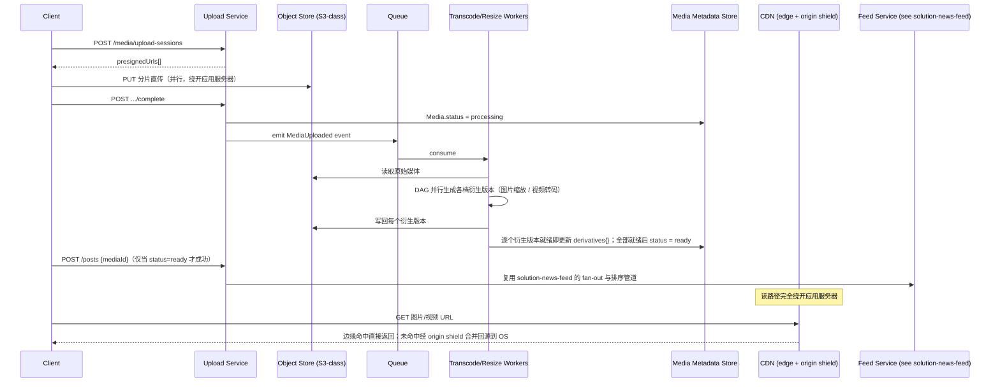

# 设计题解：图片分享（Photo Sharing，Instagram）

## 题目与范围

面试官通常这样开场："设计一个类似 Instagram 的图片/视频分享应用：用户上传照片或短视频，
关注其他用户，在信息流里看到他们的内容，图片要在全球范围内快速加载。" 这道题和
[[solution-news-feed]]（News Feed & Timeline）共享同一套关注关系与信息流生成机制——
如果你已经读过那道题，请直接跳到本篇的「深入探讨」：本篇不重复讲 fan-out 策略、名人
问题和排序漏斗，而是聚焦**这道题真正独有的难点——媒体本身怎么上传、怎么处理、怎么在全球
范围内被便宜地读出来**。

值得当场问清楚的澄清问题，以及它们各自改变的设计决策：

- **信息流的生成机制要不要展开讲？** 不展开——本题假设关注关系、fan-out（推/拉）、排序
  漏斗与 [[solution-news-feed]] 完全一致，只是候选内容从纯文本换成了媒体引用；本篇不
  重复论证，需要时直接引用那篇题解的结论。
- **视频要不要支持？多长？** 决定是否需要转码（transcoding）管道；本题按"支持，且以
  15 秒左右的短视频为主"设计，因为这决定了转码管道的目标延迟（用户等待发布的耐心比长
  视频短得多）。
- **图片/视频一旦发布还能不能编辑？** 决定要不要支持"替换某个尺寸的衍生图（derivative）"
  这种局部更新，还是删除重发；本题按"不能编辑正文，只能删除重发"设计，和
  [[solution-news-feed]] 保持一致。
- **是否需要全球多地域低延迟访问？** 决定 CDN 策略要不要做边缘预热（见「深入探讨」第 4
  节）——如果用户高度集中在单一地域，一个区域性缓存层就够了。
- **要不要处理版权/内容审核？** 不处理——本题假设媒体审核是独立的异步管道，不影响上传
  确认的主路径。

**范围内**：图片/视频的直传与转码管道、媒体的存储与衍生尺寸生成、全球范围的图片/视频
读取路径（CDN 与缓存）、媒体就绪状态如何和信息流生成对接。**范围外**：关注关系与
fan-out（见 [[solution-news-feed]]）、排序算法（同上）、内容审核、版权检测、评论与点赞
的存储模型（属于「Forum & Threaded Comments」一类问题）、私信。

## 需求

**功能需求（驱动设计的 3–5 条）**

1. 用户可以上传一张图片或一段短视频（连同文字说明），上传成功后系统在合理延迟内生成
   可供展示的多种尺寸/清晰度版本。
2. 用户和他关注的人能在信息流里看到已经**处理完成、可以正常播放/显示**的媒体——正在
   处理中的媒体不应该带着破损链接出现在任何人的信息流里。
3. 图片/视频在全球任意地域被请求时，都应该优先从离用户最近的边缘节点返回，而不是每次
   都回源到存储原点。
4. 用户可以删除自己发布的媒体，删除后所有已分发的表现层（包括边缘缓存）最终都不再提供
   访问。

**非功能需求（数字化）**

- **上传确认延迟**：客户端收到"上传成功，已进入处理队列"的确认，目标 P99 < 3 秒——这
  是用户体感"是否卡住了"的等待窗口，不等于媒体可以被别人看到的时间。
- **媒体可发布延迟**：从上传完成到该媒体在关注者信息流里可见（衍生尺寸就绪），目标
  P90 < 10 秒；短视频转码是这条路径上最慢的一环，是本设计重点优化的对象（见「深入
  探讨」第 2 节）。
- **读取延迟**：图片首字节时间（TTFB）从边缘节点返回时目标 P99 < 100ms；边缘未命中回源
  时目标 P99 < 500ms。
- **存储耐久性**：媒体原图/原始视频一旦确认上传成功，耐久度要求等同标准对象存储的
  多副本/纠删码保障，不接受因为存储节点单点故障而丢失用户媒体。
- **读写不对称**：读取（图片/视频被展示）流量远大于写入（上传）流量——这个比例本身是
  本设计里第一个决定架构方向的数字（见「容量估算」）。

## 容量估算

**基础假设**：日活用户（DAU）1.5 亿；5% 的日活每天至少上传一次媒体，其中 80% 是图片、
20% 是短视频（约 15 秒）。

```
uploads/day = 1.5×10^8 × 0.05 = 7,500,000
photos/day = 7,500,000 × 0.8 = 6,000,000
videos/day = 7,500,000 × 0.2 = 1,500,000
upload QPS(avg) = 7,500,000 / 86,400 ≈ 86.8
upload QPS(peak, ×4 晚间高峰系数) ≈ 347.2
```

**读侧**：假设日活平均每天打开 8 次，每次会话滚动浏览约 50 张图/条视频（图片类 App 的
单次会话浏览量天然比纯文字时间线更高）。

```
image view events/day = 1.5×10^8 × 8 × 50 = 6×10^10
view QPS(avg) ≈ 6×10^10 / 86,400 ≈ 694,444
view QPS(peak, ×3) ≈ 2,083,333
read : write ≈ 694,444 : 86.8 ≈ 8,001 : 1
```

**这个约 8,000:1 的读写比是本题最重要的数字**——比 [[solution-news-feed]] 里 1,200:1
的读写比还要极端一个数量级，原因是图片/视频类内容单次会话的浏览量天然更高。它直接决定了
一件事：**几乎全部的读流量必须由 CDN/边缘缓存吸收，应用服务器和存储原点连百分之一的直接
读流量都承受不起**（见「深入探讨」第 4 节）。

**存储：图片**。假设原图平均 2MB，为展示预生成 4 种衍生尺寸（缩略图 10KB、小图 30KB、
中图 80KB、大图 200KB）：

```
每张图片总存储 = 2,000,000 + 10,000 + 30,000 + 80,000 + 200,000 = 2,320,000 B ≈ 2.32MB
图片存储/天 = 6,000,000 × 2.32MB ≈ 13,920 GB/天
```

**存储：视频**。假设每条视频转出 3 档自适应码率（adaptive bitrate）版本（1080p @
8Mbps、720p @ 4Mbps、480p @ 1.5Mbps），平均时长 15 秒，另加一张封面缩略图：

```
1080p 版本 = 8×10^6 bit/s × 15s / 8 = 15,000,000 B
720p 版本 = 4×10^6 × 15 / 8 = 7,500,000 B
480p 版本 = 1.5×10^6 × 15 / 8 = 2,812,500 B
每条视频总存储 ≈ 15,000,000+7,500,000+2,812,500+20,000 ≈ 25.33MB
视频存储/天 = 1,500,000 × 25.33MB ≈ 37,999 GB/天
```

```
总存储/天 ≈ 13,920 + 37,999 ≈ 51,919 GB/天 ≈ 51.9 TB/天
总存储/年 ≈ 51.9TB × 365 ≈ 18,950 TB ≈ 18.95 PB/年
（假设走对象存储自身的纠删码/多副本耐久机制，不再额外乘以应用层复制系数）
```

**这是第二个决定架构的数字**：视频虽然只占上传量的 20%，却贡献了总存储的约 73%
（37,999 / 51,919），说明存储成本的主要杠杆在视频转码策略（编码几档、要不要为所有视频都
生成全部档位），而不是图片衍生尺寸——这个对比直接引出「深入探讨」第 2 节"能不能少转码"
的讨论。

**带宽**：边缘出口带宽与回源带宽的差距决定了 CDN 命中率的价值。假设图片/视频请求平均
返回 60KB（混合了缩略图、中图、视频封面帧的加权平均），边缘缓存命中率 98%（回源率 2%）：

```
边缘总出口字节/天 = 6×10^10 × 60,000B = 3.6×10^15 B = 3,600,000 GB/天
边缘总出口带宽(avg) ≈ 3,600,000×8/1e9/86,400 ≈ 333 Gbps
回源字节/天 = 3,600,000GB × 2% = 72,000 GB/天
回源带宽(avg) ≈ 72,000×8/1e9/86,400 ≈ 6.7 Gbps
回源 QPS(avg) = 694,444 × 2% ≈ 13,889
```

即使命中率高达 98%，回源 QPS 仍有近 1.4 万，这解释了为什么"回源路径本身也要能扛住万级
QPS"，不能假设 CDN 永远兜底住一切（见「深入探讨」第 4 节的 origin shield 设计）。

## 核心实体与 API

**实体**

- **Media**：`id, ownerId, type(photo/video), status(uploading/processing/ready/failed),
  originalRef, derivatives{size:objectKey}, createdAt`——`status` 是本设计和
  [[solution-news-feed]] 里的通用 `Post` 实体相比最重要的新增字段，用来防止半成品媒体
  出现在信息流里（见「深入探讨」第 5 节）。
- **Post**：`id, ownerId, mediaId, caption, createdAt`——复用 [[solution-news-feed]] 里
  Post 实体的语义，`mediaRefs` 具体化为这里的一个 `mediaId`。
- **UploadSession**：`id, ownerId, mediaType, expectedChunks, receivedChunks[],
  presignedUrls[]`——分片直传的会话状态，允许断点续传。
- **DerivativeJob**：`mediaId, targetSize/rendition, status, attempt`——转码/缩放管道里
  每个衍生版本的任务追踪单元，供 DAG 式流水线调度和重试。

**API**

```
POST   /media/upload-sessions        {mediaType, sizeBytes}
                                      → {sessionId, presignedUrls[]}（客户端直传对象存储）
PUT    <presignedUrl>                客户端直接向对象存储上传每个分片，不经过应用服务器
POST   /media/upload-sessions/{id}/complete
                                      → {mediaId}，媒体进入 processing，异步转码开始
GET    /media/{id}/status            → {status, derivatives{}}（客户端轮询或走推送获知就绪）
POST   /posts                        {mediaId, caption, clientRequestId}
                                      按 clientRequestId 幂等；仅当 mediaId 的 status=ready
                                      才允许发布成功，否则返回 409（见「深入探讨」第 5 节）
DELETE /posts/{id}                    标记删除，触发媒体的边缘缓存失效（见「深入探讨」第 4 节）
GET    /feed?cursor=&limit=           复用 [[solution-news-feed]] 的信息流生成与分页机制，
                                      返回的每个条目携带媒体的 CDN URL，而非媒体本身
```

**故意不做的**：不支持在应用服务器上代理转发媒体字节（直传对象存储，见「深入探讨」第 1
节）；不支持客户端指定任意像素尺寸的裁剪（只提供固定的一组预生成衍生尺寸，见「深入探讨」
第 3 节）；不在这层 API 暴露转码进度百分比，只暴露 `processing/ready/failed` 三态；`
POST /posts` 不接受还在处理中的 `mediaId`，避免把"允许发布但内容还没准备好"这种状态
泄漏给下游的 fan-out。

## 高层设计



**上传路径**：客户端向 Upload Service 申请预签名 URL（pre-signed URL），拿到后**直接向
对象存储分片并行上传**，完全绕开应用服务器——这是对 [[storage.object|Object Storage &
Separation]] 里"存储与计算分离"原则最直接的应用：应用服务器只负责签发凭证和记录元数据，
不经手媒体字节本身，避免成为上传带宽的瓶颈。技术选型是**对象存储（S3 一类）**存放原始
媒体和全部衍生版本，因为媒体是不可变的大二进制对象，天然符合对象存储"写一次、多次读、
按 key 寻址"的访问模式。

**处理路径**：上传完成事件进队列，转码/缩放工作节点池异步消费。图片走轻量的多尺寸缩放
（resize），视频走转码（transcode）成多档自适应码率版本，两者都建模成一个**有向无环图
（DAG）式的流水线**：每个衍生版本是一个独立节点，互不阻塞，某一档失败可以单独重试而不
拖累其他档位（见「深入探讨」第 2 节的具体优化）。

**读路径**：信息流生成完全复用 [[solution-news-feed]] 的 fan-out 与排序机制——区别只在
候选内容从纯文本换成了媒体引用。客户端拿到的时间线条目里，每张图片/每段视频不是数据本身，
而是一个 CDN URL；实际的字节传输**完全绕开应用服务器和 Feed Service**，由 CDN 边缘节点
直接返回。存储技术类是**拉取型 CDN（pull CDN）+ 源站保护层（origin shield）**，见「深入
探讨」第 4 节，因为容量估算给出的约 8,000:1 读写比意味着任何经过应用层的读路径都会在读
QPS 上第一个崩溃。

## 深入探讨

### 直传对象存储：绕开应用服务器的上传路径

**问题**：媒体文件（尤其是视频，单条可达数十 MB）如果先上传到应用服务器再转发到对象
存储，应用服务器要承担两倍的带宽开销（收一次、转发一次），并且应用服务器的水平扩展
能力被迫和上传带宽绑定在一起。

**方案一：客户端上传到应用服务器，应用服务器再转发到对象存储**。实现简单、方便在转发
前做同步校验，但应用服务器实例数要按上传带宽而不是按业务逻辑复杂度来配置，浪费计算
资源在纯粹的字节转发上。

**方案二：客户端直接携带对象存储的长期凭证上传**。彻底绕开应用服务器，但长期凭证一旦
泄漏，攻击者可以直接向存储桶写入任意内容，安全边界失控。

**方案三（本设计采用）：预签名 URL（pre-signed URL）+ 分片直传**。应用服务器只签发一个
限时、限权限（仅允许 PUT 到指定 key）的预签名 URL，客户端凭这个 URL 直接向对象存储分片
并行上传；应用服务器全程不接触媒体字节，只在上传完成后记录元数据、触发处理管道。凭证的
时效和权限都被收窄到"这一次上传、这一个 key"，既避免了转发开销，又避免了长期凭证泄漏的
风险面。

### 视频转码：减少重复编码而不是单纯堆算力

**问题**：为一条 15 秒视频独立生成 3 档自适应码率版本，如果每一档都从头重新转码，会
重复消耗大量 CPU——转码是这条"上传到可发布"延迟路径上最慢的一环。

**方案一：为每一档码率独立、完整地转码源视频**。逻辑最简单，但 CPU 成本和处理时间线性
叠加在 3 档编码上，是「容量估算」里视频存储占比（73%）之外，另一个隐藏的成本大头——真正
昂贵的不是存这些码率版本的字节，而是产生它们的计算过程。

**方案二：只生成一档最低分辨率版本，发布后按需转码更高档位**。能最快满足"可发布"的
延迟目标，但用户发布后立刻会有大量并发观看请求，"按需"意味着第一批观看者会撞上转码还
没完成的空窗，产生和方案一相反的问题——把延迟从发布前转移到了发布后的热身期。

**方案三（本设计采用，对齐 Meta 公开披露的真实优化）：优先生成一档"渐进式
（progressive）"编码供最快发布，用**复用帧数据重新打包（repackage）而不是重新转码**的
方式生成自适应码率版本。Meta 工程博客披露的真实数字：把一段 23 秒的视频独立转码到 720p
的 ABR 版本需要约 86.17 秒 CPU 时间，而用已有的渐进式编码帧数据直接重新打包成 ABR 文件
结构只需要约 0.36 秒——约 239 倍的速度差（见「来源与延伸」）。这说明"能不能复用已经算
出来的帧数据"比"用多快的机器转码"更能决定整体延迟和成本，是这道题里"转码"这个环节最
容易被面试者简化成一句"起个转码 worker"、却最值得深挖的地方。

### 小文件存储问题：为什么不能直接把每张图存成一个普通文件

**问题**：即便原始媒体已经在对象存储里，如果读一次图片背后要经过传统文件系统式的
"文件名 → inode → 文件内容"多级查找，海量小文件场景下每次读都要多次磁盘寻道，元数据
查找本身就会成为吞吐瓶颈——这正是 Facebook 在 Haystack 论文里明确指出的问题：传统
NAS/NFS 式存储读一张照片平均需要 3 次磁盘 I/O（文件名转 inode、读 inode、读文件内容），
在数十亿张照片的规模下，元数据查找而不是数据本身的读取才是瓶颈。

**方案一：直接用通用文件系统或简单的对象存储，一张图一个对象**。实现最简单，现代云
对象存储（S3 一类）内部已经用类似 Haystack 的思路解决了这个问题（大量小对象合并存储、
元数据索引常驻内存），所以对绝大多数系统而言，"直接用成熟的对象存储"已经足够——这也是
本设计在「高层设计」里的实际选择。

**方案二（自建时的备选，仅在极端规模或需要摆脱云厂商对象存储成本时才考虑）：Haystack
式自建存储**——把大量照片顺序追加写入一个个约 100GB 的大文件（物理卷），每个物理卷对应
一个精简的内存索引（photo id → 文件、偏移量、大小），读一张照片时不再需要访问磁盘上的
文件系统元数据，索引本身常驻内存，一次读退化到接近 1 次磁盘 I/O。用本设计自己的字节假设
估算：如果每张照片的内存索引只需要约 40 字节（对比传统文件系统一个 inode + 目录项约
256 字节的量级假设），一年 21.9 亿张照片（6,000,000×365）的索引占用约 87.6GB，而传统
按文件元数据估算约 560.6GB——约 6.4 倍的差距，即便前者也早已超出单机内存，但足以说明
"减少每张图片的元数据体积"这个杠杆的量级。**本设计的结论是**：默认直接用对象存储（方案
一），只有当自己的访问模式和规模逼近 Haystack 论文描述的场景、且已经验证对象存储的元数据
开销是实测瓶颈时，才值得自建 Haystack 式的存储层。

### 全球范围内服务图片与视频：拉取型 CDN + 源站保护层

**问题**：容量估算给出约 8,000:1 的读写比，意味着几乎全部读流量必须被 CDN 吸收；但
新发布的媒体在被推送的第一时间，全球各个边缘节点都还没有缓存副本，第一批请求必然回源。
如果回源请求集中在短时间内（比如一条高粉丝账号的帖子发布后被同时刷新），会在源站产生
瞬时热点——和 [[solution-news-feed]] 深入探讨里讨论的名人热帖读侧热点是同一类问题，
只是这里热的是媒体字节而不是帖子元数据。

**方案一：推送型 CDN（push CDN）**——媒体上传处理完成后，主动把每个衍生版本预先复制到
全球所有边缘节点。代价：绝大多数媒体的受众高度地域集中（比如仅在发布者所在地域被大量
观看），预先复制到全球所有 PoP 是巨大的带宽浪费，尤其是那些几乎没有观众的普通用户帖子。

**方案二：纯拉取型 CDN（pull CDN），无额外保护层**。边缘节点按需回源，避免了方案一的
浪费，但对同一个新发布对象，多个地理相邻的边缘节点几乎同时收到第一批请求时，会各自独立
回源，在源站产生和请求数成正比的瞬时压力——容量估算给出即使 98% 命中率下回源 QPS 仍有
约 1.4 万，一旦叠加热点事件的并发回源，这个数字会进一步放大。

**方案三（本设计采用）：拉取型 CDN + 源站保护层（origin shield）+ 按可预测热度选择性
预热**。在边缘节点和真正的对象存储源站之间加一层区域性的保护层，把同一时间对同一个对象
的多次并发回源请求合并成一次真正打到源站的请求（请求合并/coalescing），其余请求等待
这一次回源结果广播；同时，对预测会是热门内容的新发布（判定信号复用
[[solution-news-feed]] 里判断"名人账号"的粉丝数阈值——高粉丝账号发布的媒体大概率会被
大量并发观看），在发布时主动预热到少数几个区域性保护层，而不是全球所有边缘节点，把
"push 全量"的浪费收窄成"push 一小撮预测会热的内容到一小圈保护层"。

### 媒体就绪状态与信息流的衔接

**问题**：[[solution-news-feed]] 的 fan-out 假设一条帖子一旦发布就是完整可展示的；但
在图片/视频分享场景下，帖子创建（`POST /posts`）的时机和媒体衍生版本全部就绪的时机之间
存在处理延迟（见「容量估算」P90 < 10 秒的目标）。如果不做区分，粉丝的信息流里可能出现
一条已经 fan-out 出去、却指向还没转码完成的媒体的帖子——点开是破图或空白。

**方案一：发布 API 不等待媒体处理完成，立刻创建 Post 并触发 fan-out**。响应快，但会
系统性产生"帖子已出现在时间线上，媒体还没准备好"的破损体验，尤其在网络较慢、转码较慢
的场景下更明显。

**方案二：发布 API 同步阻塞，直到媒体全部衍生版本就绪才返回成功**。避免了破损体验，
但把媒体处理管道里最慢的一环（视频转码）直接串进了用户能感知的"发布"操作延迟里，违反
「需求」里"上传确认延迟 P99 < 3 秒"的目标——这条目标本身就是为了避免让用户等转码。

**方案三（本设计采用）**：`POST /posts` 只在 `Media.status == ready` 时才允许成功，
否则返回 409；客户端在收到"上传完成、进入处理中"的确认后，本地展示"处理中"的占位态，
待轮询或推送通知媒体 `status` 变为 `ready` 后，客户端自己发起 `POST /posts`，这时才真正
触发 fan-out。这把"媒体是否准备好"这个判断从"发布那一刻"移到了"媒体处理完成那一刻"，
保证任何被 fan-out 出去的帖子背后的媒体一定已经可以正常展示，代价是从用户按下"发布"到
关注者能看到之间多了一段处理等待，但这段等待本来就存在（转码需要时间），只是不再对外
呈现"已发布但是坏的"这种更差的中间状态。

## 瓶颈、故障与演进

**热点与倾斜**：读侧热点是高粉丝账号发布的新媒体（见深入探讨第 4 节，和
[[solution-news-feed]] 里名人帖子的读热点是同一类问题）；写侧/处理侧热点是转码工作节点
池——一条热门视频从上传到转码完成前，如果转码任务调度没有按优先级区分（比如高粉丝账号
的视频排到普通用户前面），会造成"越受关注的内容反而越慢可见"的反直觉延迟分布。

**故障域**：

- **对象存储不可用**：这是最严重的故障域——上传、处理、读取全部停摆，需要依赖对象存储
  自身的跨区域复制和厂商级 SLA，应用层很难在这一层做有效的自行降级。
- **转码工作节点池不可用**：新上传的媒体停留在 `processing` 状态无法转出衍生版本，
  已经 `ready` 的历史媒体不受影响，读路径完全正常——这是"写路径降级、读路径不受影响"
  的典型例子，恢复后从队列断点继续消费即可，不需要用户重新上传。
- **CDN 边缘节点不可用**：客户端回退到备用 CDN 供应商或直接回源，延迟从个位数毫秒级
  劣化到跨区域访问的量级，但功能不整体不可用——这是本设计里唯一建议采用多 CDN
  （multi-CDN）策略的组件，因为读路径承载了约 99% 以上的流量，单一 CDN 供应商是不可
  接受的单点。
- **源站保护层（origin shield）不可用**：退化为边缘节点直接回源到对象存储，回源 QPS
  失去合并保护，短时间内源站压力会明显上升，但对象存储本身仍能兜底，不是数据丢失风险，
  只是短暂的延迟劣化。

**10 倍演进**：日活从 1.5 亿到 15 亿。视频转码工作节点池需要按地域做物理隔离（就近处理，
避免跨区域传输未转码的原始大文件），衍生版本生成策略也要更激进地区分"预测热门"与"长尾"
内容——热门内容全部档位优先转码，长尾内容可以先只生成最低档位，更高档位按观看量增长再
补齐（呼应深入探讨第 2 节"减少重复编码"的思路，进一步做成"按需补齐更高档位"）。

**100 倍演进**：日活 150 亿（纯粹推演）。存储成本本身会从"能不能存下"变成"值不值得一直
存着"的问题——需要引入分层存储（hot/warm/cold tiering）：近期、高访问量的媒体留在标准
对象存储层，长期低访问量的历史媒体自动迁移到更便宜的归档存储层，读取时接受更高的延迟；
这一层的调度信号可以复用访问频率统计，而不需要单独设计新的判定机制。

## 面试官会追问什么

**中级（mid）**
- "如果客户端直接把图片上传到应用服务器会怎样？" 应用服务器要按上传带宽而不是业务
  逻辑复杂度来扩容，见深入探讨第 1 节的预签名 URL 方案。
- "视频处理失败了怎么办？" DAG 式流水线里每个衍生版本节点独立重试，不影响已经成功的
  其他档位；多次重试后仍失败则整体标记 `failed`，通知客户端重新上传或换编码参数。

**高级（senior）**
- "为什么不给每张图片的每种可能尺寸都实时按需生成？" 会把每一次读请求都变成一次计算
  任务，在约 8,000:1 的读写比下完全不可行；本设计固定预生成一组有限的衍生尺寸（见
  「深入探讨」第 3 节的取舍逻辑，以及「故意不做的」里对任意尺寸裁剪的排除）。
- "CDN 命中率从 98% 掉到 90% 会发生什么？" 回源 QPS 从约 1.4 万涨到约 6.9 万（按同样
  的读 QPS 基数重新计算），需要提前验证 origin shield 和对象存储本身在这个量级下的
  承受能力，而不是假设命中率永远稳定。

**参谋级（staff）**
- "如果要支持用户编辑已发布的照片（比如加滤镜）而不是删除重发，架构要怎么改？" 需要
  引入衍生版本的版本号（version）而不是原地覆盖 `derivatives{}`，CDN 缓存键要带上
  版本号而不是纯 `mediaId`，否则边缘缓存会长期返回旧版本，这本质上是把"编辑"变成了
  "生成一组新版本 + 缓存失效"，而不是真正的原地更新。
- "如果某个地区的网络运营商大规模封锁了你用的 CDN 厂商，怎么保证媒体还能被访问？"
  这正是「瓶颈、故障与演进」里 multi-CDN 策略要解决的问题——需要在应用层维护多个 CDN
  供应商的 URL 映射，按区域和实时可用性动态选择，而不是把 CDN 供应商硬编码进媒体 URL
  的生成逻辑里。

## 常见错误

- 把这道题当成"News Feed 换个皮"，只字不提媒体上传和转码管道，被追问"视频怎么处理"时
  只能临场编一个"起个转码 worker"糊弄过去。
- 认为对象存储天然免费解决一切小文件问题，说不出"为什么不能就用普通文件系统"这个问题
  背后的真实原因（见深入探讨第 3 节）。
- 只讨论存储容量而不讨论读写比，把这道题设计成一个纯存储系统，忽略了约 8,000:1 的
  读写比才是决定 CDN 策略的核心数字。
- 假设发布即完成，没有意识到媒体处理和帖子发布之间存在时间差，说不出如何避免"已发布
  但是坏图"的中间状态。
- 讨论 CDN 时只会说"加个 CDN"，给不出拉取型/推送型的取舍和回源保护层的设计。

## 五分钟讲法

This is a photo-and-video sharing app, and I treat the social graph and feed-ranking
machinery as identical to a generic news feed design — the real differentiator is
everything downstream of "a user has media to share." Clients upload directly to object
storage using short-lived, scoped pre-signed URLs, so the application tier never touches
media bytes and its scaling is decoupled from upload bandwidth. Once a chunk lands,
transcoding and resizing run as an asynchronous DAG-style pipeline that produces several
derivative sizes for photos and several adaptive-bitrate renditions for video, and I
specifically avoid re-encoding every rendition from scratch — reusing already-encoded frame
data and repackaging them into an ABR container, the way Meta's engineering team reported
doing, cuts the compute cost of that step by roughly two orders of magnitude. A post only
becomes eligible for fan-out once every derivative is ready, because letting a half-processed
post reach followers means broken media in their feed — so publishing waits on a status
field, not on the slow transcode step blocking the whole upload response. On the read side,
my capacity estimate gives a read-to-write ratio around eight thousand to one, which means
essentially all traffic has to be absorbed by a pull CDN, with an origin shield layer that
collapses concurrent cache misses for the same freshly-published object into a single
origin fetch instead of a stampede, and selective pre-warming only for content predicted to
go viral based on the poster's follower count. I deliberately don't reinvent a Haystack-style
custom storage layer from scratch, because modern object stores already solve the small-file
metadata problem internally — that's a fallback for when you're building the storage layer
yourself at extreme scale, not a default. At 10x scale, transcoding workers get regionalized
and derivative generation becomes tiered by predicted popularity; at 100x, storage itself
gets tiered from hot to cold based on access frequency, because the real cost driver stops
being "can we store it" and becomes "is it worth keeping hot."

## 来源与延伸

- [Engineering at Meta — Reducing Instagram's basic video compute time by 94 percent](https://engineering.fb.com/2022/11/04/video-engineering/instagram-video-processing-encoding-reduction/)：
  Meta 官方工程博客披露的真实优化——把一段 23 秒视频独立转码到 720p ABR 版本需要约
  86.17 秒 CPU 时间，改为复用已有渐进式编码帧数据重新打包只需约 0.36 秒，约 239 倍的
  速度差。本文「深入探讨」第 2 节直接引用了这组真实数字作为方案三的依据，并补充了
  "为什么方案一（每档独立转码）会隐藏在存储占比之外成为真正的成本大头"这一层原文没有
  展开的对比。
- [Instagram Engineering — Sharding & IDs at Instagram](https://instagram-engineering.com/sharding-ids-at-instagram-1cf5a71e5a5c)：
  Instagram 早期真实披露的 64 位自增 ID 方案——41 位毫秒时间戳（自定义 2011 年起的
  epoch）、13 位逻辑分片 id（预留 8,192 个分片，早期只启用约 2,000 个）、10 位序列号
  （每分片每毫秒最多 1,024 个 id），并说明了为什么放弃 Twitter Snowflake（额外引入
  ZooKeeper 等"活动部件"）和 ticket server（写入瓶颈和运维成本）。本文核对了这套方案
  的可寻址时间跨度：按 2^41 毫秒精确计算约为 69.7 年（Twitter Snowflake 同样是 41 位
  毫秒时间戳，给出的也是约 69 年）；Instagram 那篇文章里写的却是"41 年"，与算术不符——
  一手来源里的数字，引用之前也值得自己算一遍。
- [USENIX OSDI 2010 — Finding a Needle in Haystack: Facebook's Photo Storage](https://www.usenix.org/legacy/event/osdi10/tech/full_papers/Beaver.pdf)：
  学术论文，披露了传统 NAS/NFS 式存储读一张照片平均需要约 3 次磁盘 I/O（文件名转
  inode、读 inode、读文件），以及 Haystack 把每张照片的元数据压缩到可以常驻内存、从而
  把这个数字降到接近 1 次的设计。本文「深入探讨」第 3 节引用了这个真实的问题背景，但
  给出了和论文不同的结论：本文认为现代云对象存储已经在内部实现了类似的优化，多数系统
  不需要真的自建 Haystack，只有极端规模或特殊成本约束下才值得考虑。
- [Algomaster — Design Instagram](https://algomaster.io/learn/system-design-interviews/design-instagram)
  （`no-archive`，商业备考网站）：给出了另一组容量估算假设（5 亿日活、每天 1 亿次上传、
  每天 280TB 存储）以及推/拉混合 fan-out 的处理框架，是免费可读的完整走查之一。本文与
  它的分歧在于：它把 fan-out 和媒体处理放在同一篇里平铺展开，本文把 fan-out 完全交给
  [[solution-news-feed]]，只把容量估算和架构深度都投入到媒体上传、转码、存储和 CDN
  这几个真正独有的环节，覆盖得更深。
