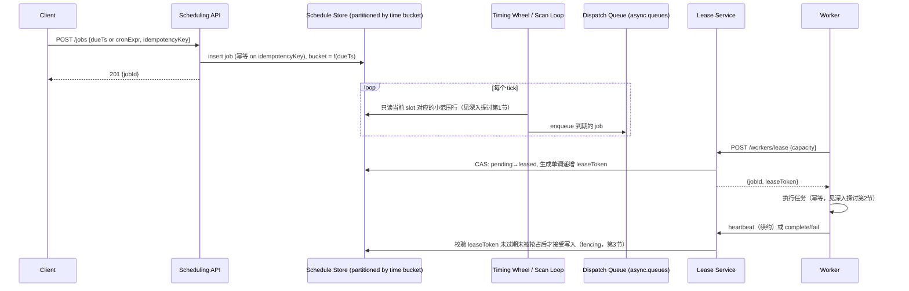

# 设计题解：分布式任务调度器（Distributed Job Scheduler）

## 题目与范围

面试官通常这样开场："设计一个分布式任务调度器：客户端可以注册在未来某个时间点执行的
任务，也可以注册按 cron 表达式周期性执行的任务，系统要在数百万个待定任务里准时找到
到期的那一批，触发执行，并保证同一个任务不会被同时执行两次。" 这道题的难点不是"存一张
任务表、每隔几秒查一次到期的行"，而是**待定任务的规模和查找到期任务的频率会把一次朴素
的全表扫描直接变成瓶颈，而"准时触发"和"不会被执行两次"这两个目标在分布式环境下天然
互相拉扯——租约会过期，worker 会在处理过程中失联，重试会制造重复触发的风险**，这些
才是把这道题和"写个 cron"区分开的地方。

值得当场问清楚的澄清问题，以及它们各自改变的设计决策：

- **任务是纯粹的定时一次性触发（fire-and-forget），还是需要支持任务之间的依赖关系
  （DAG）？** 决定了调度层要不要维护任务间的前后置关系，还是只负责"到点了就触发"这一层
  （见「深入探讨」第 5 节）。
- **执行语义要求多强——至少一次还是恰好一次？** 分布式环境下无代价的恰好一次不存在；
  本题按至少一次设计，把"不会产生副作用错误"的责任交给幂等的 worker（见「深入探讨」
  第 2 节）。
- **多个租户共享同一套调度基础设施吗？** 决定了要不要在任务队列层做按租户的公平调度
  （见「深入探讨」第 6 节），如果只服务单一租户这个维度可以省略。
- **任务执行本身失败了怎么办？** 决定重试策略和死信队列（dead-letter queue）的存在
  （见「深入探讨」第 4 节）。
- **要不要负责执行任务本身的计算资源编排（容器调度、资源隔离）？** 不负责——本题的
  调度器只负责"在正确的时间把任务分发给某个 worker"，worker 本身如何拿到 CPU/内存
  资源是容器编排平台（如 Kubernetes）的职责，这是完全独立的一道题。

**范围内**：调度存储与到期任务的发现机制、至少一次执行与幂等性、租约与 fencing、
重试与死信队列、cron 与 DAG 依赖、多租户公平性。**范围外**：worker 本身的资源编排、
任务执行环境的沙箱隔离、跨地域的调度器容灾（假设单一区域内的集群）、任务执行结果的
长期归档查询（只保留运行所需的近期执行历史）。

## 需求

**功能需求（驱动设计的 3–5 条）**

1. 客户端可以注册在未来某个绝对时间点触发一次的任务，也可以注册 cron 表达式描述的
   周期性任务。
2. 系统在任务到期后的一个有界延迟窗口内触发它，不需要轮询整个任务集合来做到这一点。
3. 一个任务在任意时刻最多被一个 worker 实际执行——即使调度器或 worker 发生故障、
   重试或网络分区。
4. 任务执行失败后按策略自动重试，多次重试仍失败的任务进入死信队列，等待人工介入而
   不是无限重试。
5. 多个租户共享同一套调度基础设施时，单个租户的任务洪峰不能让其他租户的任务被
   系统性地延迟。

**非功能需求（数字化）**

- **触发准时性**：一个到期任务从其预定时间到实际被分发给 worker 的延迟，目标
  P95 < 1 秒、P99 < 5 秒。
- **执行语义**：至少一次（at-least-once）——一个任务可能被执行超过一次，但绝不会
  一次都不执行（前提是调度器和存储本身存活）；由 worker 的幂等性吸收"多执行一次"的
  影响（见「深入探讨」第 2 节）。
- **互斥性**：在任意时间窗口内，同一个任务实例不会被两个 worker **同时**执行——这是
  和"至少一次"完全不同的另一条保证，见「深入探讨」第 3 节。
- **可用性**：调度服务本身目标 99.95% 可用；单个 worker 故障不应影响其他任务的
  调度或执行。
- **规模**：见「容量估算」——待定任务规模和到期任务发现的吞吐是这道题里唯一决定
  存储和调度算法选型的两个数字。

## 容量估算

**基础假设**（本设计的假设，不是某个真实平台的披露数据）：5,000 个租户，平均每个
租户每天产生 20,000 个任务的调度/触发（既包括一次性任务也包括周期性任务展开后的
触发次数）。

```
jobs/day = 5,000 × 20,000 = 1×10^8
avg trigger QPS = 1×10^8 / 86,400 ≈ 1,157
peak trigger QPS(×6，因为 cron 任务天然在整点/整分等边界扎堆) ≈ 6,944
```

**这是第一个决定架构的数字：峰值系数为什么是 6 倍而不是常见的 3–4 倍？** 因为定时
任务的到期时间不是均匀分布的——大量任务被设置成"每小时整点""每天午夜"触发，真实到期
时间在这些边界上会出现远高于均值的尖峰，这本身就是「深入探讨」第 6 节多租户公平性
要处理的问题的根源之一。

**待定任务的存储规模**：假设一个任务从被调度到实际到期，平均提前量（lead time）
为 3 天（既包含提前几分钟注册的一次性任务，也包含提前几周注册的周期性任务下一次
展开）：

```
outstanding rows = 1×10^8 × 3 = 3×10^8
每行约 200 字节（job_id, tenant_id, due_ts, cron/payload 引用, state, lease 字段）
storage = 3×10^8 × 200B = 6×10^10 B = 60 GB
```

**这是第二个、也是这道题真正的核心数字**：60 GB 本身完全不算大——如果只看存储字节数，
这道题看起来平淡无奇。真正的问题是**怎么在这 3 亿行里，每次都只花很少的时间找出"现在
到期的那一批"**。如果朴素地对全表做条件扫描（`WHERE due_ts <= now()`，哪怕有索引，
仍然要触达所有仍未到期但已经存在的行去判断），按保守的每行 1 微秒计算：

```
naive 全表扫描一次耗时 ≈ 3×10^8 × 1μs = 300s
```

而触发准时性要求 P95 < 1 秒——**这个数字本身就否定了"每隔 1 秒扫一遍全表"这个最直观
的方案**，逼出「深入探讨」第 1 节的时间分桶/时间轮方案。

**Worker 并发与容量**：假设单个任务平均执行时长 0.5 秒，峰值下同时在执行的任务数：

```
concurrent executions(peak) = 6,944 × 0.5s ≈ 3,472
假设单 worker 实例（异步 I/O，非 CPU 密集）可承载 50 个并发任务：
workers needed ≈ 3,472 / 50 ≈ 69.4 → 70 台（留冗余）
```

**结论**：这道题里存储字节数（60 GB）从来不是瓶颈，真正的瓶颈是**在海量待定任务里
以远低于全表扫描的成本反复找出"现在到期的一小撮"**，以及**峰值触发 QPS 下需要多少
worker 并发处理能力**——容量估算里最该向面试官强调的正是"存储小、查找频率和并发执行
量才是设计的驱动力"这个反直觉的结论。

## 核心实体与 API

**实体**

- **Job**：`id, tenantId, type(one-off|cron|dag-step), schedule(dueTs|cronExpr),
  payloadRef, state(pending|leased|running|succeeded|failed|dead-lettered),
  maxRetries, dagId?`——一次调度注册的定义，`schedule` 决定它属于哪种发现机制。
- **Execution**：`jobId, attemptNumber, leaseOwner, leaseToken, leaseExpiresAt,
  startedAt, result`——一次具体的执行尝试，`leaseToken` 是「深入探讨」第 3 节
  fencing 机制的核心字段。
- **DagRun**：`dagId, stepStates{stepId→state}`——一次 DAG 运行的整体状态，用于
  判断某个 step 的前置依赖是否已全部完成。
- **Tenant**：`id, fairnessWeight, rateLimitTokens`——多租户公平调度的配置单元。

**API**

```
POST /jobs                  {tenantId, dueTs | cronExpr, payloadRef, maxRetries,
                              idempotencyKey}
                             按 idempotencyKey 幂等 → {jobId}
DELETE /jobs/{id}           取消一个未来还未触发的任务
GET    /jobs/{id}           查询任务当前状态
POST   /dags                {tenantId, steps[{stepId, dependsOn[], payloadRef}]}
                             → {dagId}

# worker 侧（内部协议，不面向最终用户）
POST /workers/lease         {workerId, capacity} → {jobId, leaseToken, payloadRef}[]
                             租约获取，见「深入探讨」第 3 节
POST /workers/heartbeat     {jobId, leaseToken} → {ok} | 409（token 过期，需放弃执行）
POST /workers/complete      {jobId, leaseToken, result}
POST /workers/fail          {jobId, leaseToken, error}  触发重试或死信（见第 4 节）
```

**故意不做的**：不在 API 层暴露"立刻同步执行并等待结果"的语义（那是 RPC，不是调度器
的职责）；不支持对已经进入 `leased`/`running` 状态的任务做原地修改（只能取消未来的
调度，正在执行的任务只能等它完成或超时被重新调度）；不提供跨租户的任务依赖（DAG 的
`dependsOn` 只能引用同一个 `dagId` 内的 step，避免一个租户的任务被另一个租户的失败
拖住）。

## 高层设计



**写路径**：`POST /jobs` 只对 Schedule Store 做一次插入就返回，插入时按到期时间把
任务放进对应的时间分桶（见「深入探讨」第 1 节），不做任何同步的"查找到期任务"计算。
存储技术类是**按时间分区的持久化存储**（不是纯内存结构——待定任务要在调度器重启后
存活），本设计按 `due_ts` 的粗粒度分区键做水平分片，因为查询模式几乎全部是"给定一个
时间范围，找出这个范围内的任务"。

**发现与分发路径**：Timing Wheel / Scan Loop 每个 tick 只读取"当前时间槽"对应的一小
撮数据（而不是全表），把到期的任务推入 Dispatch Queue——这一层直接复用
[[async.queues|Message Queues]] 的设计（至少一次投递、消费者可水平扩展、持久化到
worker 消费为止）。用队列而不是让 worker 直接轮询 Schedule Store，是为了把"发现到期
任务"和"分发给具体 worker"这两个关注点解耦：前者只关心时间，后者只关心 worker 的
可用容量。

**执行路径**：Worker 从 Dispatch Queue 拿到任务后，先向 Lease Service 申请租约
（lease）——租约的持有者字段和单调递增的 fencing token 是保证"同一任务不会被两个
worker 同时执行"的关键机制（见「深入探讨」第 3 节）。Worker 执行完成后携带同一个
`leaseToken` 回报结果，Schedule Store 只接受携带当前有效 token 的写入，过期或被
抢占的 token 会被拒绝。

## 深入探讨

### 调度存储与"不扫全表也能找到到期任务"：时间分桶、分层时间轮与延迟队列

**问题**：容量估算已经证明，对 3 亿行待定任务做朴素的条件扫描单次就要 300 秒，而
准时性要求 P95 < 1 秒——查找到期任务的机制必须做到和"当前有多少到期任务"成正比，
而不是和"总共有多少待定任务"成正比。

**方案一：定期全表扫描（本设计不采用）**。实现最简单，但如容量估算所示，扫描耗时
随待定任务总数线性增长，任务积压得越多、找到期任务反而越慢，是一个会随规模恶化的
反模式。

**方案二：时间分桶（time-bucketed partitions）**。把 Schedule Store 按 `due_ts`
粗粒度分桶（比如按分钟或按 5 分钟窗口分区），扫描循环只需要查询"当前时间所在及
之前尚未清空的分桶"，代价和分桶内的行数成正比，而不是和全表行数成正比。本设计的
Schedule Store 采用这个方案作为**持久化层**的物理组织方式。

**方案三（分层时间轮 hierarchical timing wheel，本设计的内存侧发现机制采用）**：
Varghese 和 Lauck 1987 年的论文证明，用循环缓冲区（circular buffer）实现的时间轮
可以把定时器的插入、删除、到期检查都做到 O(1)，而不是排序链表的 O(n) 或优先队列的
O(log n)（见「来源与延伸」）。单层时间轮的槽位数量和时间跨度是固定的权衡：要覆盖
更长的时间跨度就要么增加槽位数、要么增大每个槽位代表的时间粒度（牺牲精度）。分层
时间轮的做法是级联多层不同粒度的轮子——比如秒级轮子覆盖未来 60 秒（60 个槽），
分钟级轮子覆盖未来 60 分钟（60 个槽），小时级轮子覆盖未来 24 小时（24 个槽）——一个
任务先被放进它所在时间跨度对应的那一层，随着时间推进被逐级"降级"到更细粒度的轮子里，
直到最终落进秒级轮子并被触发。这正是 Kafka 内部实现延迟操作（purgatory）时采用的
同一个数据结构（见「来源与延伸」），本设计把它用作**近期即将到期任务**（未来数小时内）
的内存侧索引，更远期的任务留在方案二的持久化分桶存储里，只在临近到期前才被加载进
时间轮。

**方案四：延迟队列（delay queue，如基于优先队列的最小堆）**。对"待触发任务数量不大"
的场景实现简单、语义清晰（堆顶永远是最近到期的任务），但插入和删除都是 O(log n)，
在 3 亿量级的待定任务规模下不如分层时间轮的 O(1) 操作划算；本设计把它保留作为**单个
调度器实例本地、短期窗口内**的辅助结构（时间轮把即将到期的任务批量取出后，用一个
小顶堆做本地的精确触发排序），而不是作为全局唯一的发现机制。

### 至少一次执行与幂等 worker：把"可能重复"的责任从协调层挪到执行层

**问题**：调度器在网络分区、自身重启、或者不确定"上一次分发是否真的送达"时，唯一
安全的选择是"宁可重复分发，也不能漏掉"——这意味着 worker 一定会在某些故障场景下
收到同一个任务的多次执行请求，如果任务本身不是幂等的（比如"给账户扣款一次"），
重复执行会造成真实的业务错误。

**方案一：追求端到端恰好一次（exactly-once）**。理论上最理想，但需要调度器和
下游被执行的操作（可能是任意外部系统）共同参与一个分布式事务或两阶段提交，而调度
器对任务实际做什么、连接什么下游系统是没有控制权的——这是消息队列设计题里"端到端
恰好一次依赖下游配合"同一个结论在调度器语境下的翻版。

**方案二（本设计采用）**：调度器只承诺至少一次投递，把"重复执行不产生错误后果"这个
责任显式地交给 worker，用 [[correctness.idempotency|Idempotency]] 描述的标准模式
实现：每个任务在 `POST /jobs` 时携带业务方提供的 `idempotencyKey`，worker 执行前
先用这个 key 查询一个去重存储（例如"这个 key 是否已经成功处理过"），已处理过的
直接返回上次结果、不重复执行副作用。这把幂等性设计的负担放在最了解业务语义的一方
（worker/业务逻辑），而不是让通用的调度器猜测每个任务的幂等边界。

**方案三：调度器层面做去重（在分发前检查"这个任务是否已经分发过"）**。能减少一部分
重复分发，但不能消除——去重检查本身和"确认分发成功"之间仍然存在竞态窗口，只能降低
重复概率、不能提供保证；本设计把它作为方案二的补充优化，而不是替代。

### 租约与 Fencing：保证同一任务不会被并发执行两次

**问题**：即使调度器只分发给一个 worker，那个 worker 也可能在处理过程中因为 GC
停顿、网络分区等原因被系统判定为"失联"，导致任务被重新分发给另一个 worker——如果
第一个 worker 只是暂停而不是真的死掉，它恢复后可能仍然认为自己持有任务所有权，
继续执行并写入结果，和第二个 worker 的执行产生冲突，这不是"重复执行"（至少一次
本来就接受这个），而是**两个执行同时在跑、互相踩踏**，是完全不同的另一种故障。

**方案一：只用租约超时，不加 fencing（本设计不采用）**。Lease Service 给 worker A
一个 30 秒的租约，超时后允许 worker B 抢占同一任务——但如果 A 只是暂停而非真正
死亡，A 醒来后不知道自己的租约已经过期，仍然按原计划完成执行并写回结果，这时 B
可能也在执行或已经执行完，两次写入互相覆盖，产生业务层面无法预知的后果。Martin
Kleppmann 对这个问题的经典分析（见「来源与延伸」）明确指出：锁/租约服务本身**不能**
单独解决这个问题。

**方案二（本设计采用，fencing token）**：Lease Service 每次发放租约时附带一个
**单调递增的 fencing token**（本设计用租约存储行上的自增计数器实现）。Worker 执行
完成后向 Schedule Store 写回结果时必须携带这个 token；Schedule Store（作为"资源"
一方）在接受写入前检查这个 token 是否仍然是该任务当前最新的 token——如果 worker A
的租约已经因超时被 B 抢占（B 拿到了更大的 token），A 恢复后带着旧 token 的写入会
被 Schedule Store **拒绝**，无论 A 自己是否认为执行已经"成功"。这把互斥性的保证
从"信任 worker 自己知道租约是否过期"转移到"让持久化层主动校验 token 单调性"，是
唯一能堵住"暂停的 worker 事后仍然写入"这个漏洞的机制。

**方案三：更短的租约超时 + 更频繁的心跳**。能缩小 A 和 B 同时认为自己持有任务的
时间窗口，但只是缩小窗口、不能消除——只要网络分区或 GC 停顿的时长可能超过心跳
间隔，这个竞态条件在理论上始终存在，必须靠方案二的 token 校验来兜底，本设计把
心跳间隔（heartbeat interval）设为租约时长的 1/3，作为方案二之外的额外保险，而
不是替代它。

### 重试与死信队列：区分"还值得再试"和"需要人来看"

**问题**：任务执行失败的原因五花八门——下游服务临时不可用（值得重试）、payload
本身格式错误（重试无限次也不会成功）——如果不加区分地无限重试，前者会制造无谓的
排队压力，后者会永远占着重试队列的位置，掩盖真正需要人工介入的问题。

**方案一：固定间隔无限重试（本设计不采用）**。简单，但对"永久性失败"的任务会无限
消耗系统资源，且不给运维任何"这个任务出问题了"的信号。

**方案二（本设计采用）**：指数退避（exponential backoff）+ 重试上限。第 n 次重试
前等待 `2^n` 秒（本设计取 1s、2s、4s、8s、16s，共 5 次重试，累计退避时长 31 秒），
超过 `maxRetries` 仍未成功的任务标记为 `dead-lettered`，投递进独立的死信队列
（dead-letter queue），停止自动重试、保留完整的失败上下文（错误信息、最后一次
`leaseToken`、执行历史），等待人工排查后选择性地重新入队——这个模式直接对应
[[async.delivery.guarantees|Delivery Guarantees]] 里"毒丸消息"（poison pill）的
标准处理方式，调度器场景下的死信队列就是这个概念在"任务"而不是"消息"上的应用。

**方案三：按错误类型区分重试策略（例如网络超时重试、参数校验错误直接死信）**。
本设计把这个判断权交给 worker 通过 `POST /workers/fail` 的错误分类字段显式声明，
而不是由调度器自己猜测错误是否"值得重试"，因为只有 worker 知道具体是下游服务的
瞬时故障还是任务本身的数据问题。

### Cron 与 DAG 依赖：调度层的两种不同"到期"定义

**问题**：一次性任务的"到期"就是一个绝对时间点，但周期性（cron）任务的"到期"是
一个无限序列，DAG 任务的"到期"甚至不是时间驱动的，而是"所有前置 step 都完成"这个
条件驱动的——三者如果用同一套机制处理，会把简单的时间轮结构复杂化成一个通用的
条件求值引擎。

**方案一（本设计采用，cron 任务）**：cron 表达式本身不直接进时间轮——调度器只
维护"下一次触发时间"这一个字段，每次触发后立刻计算并写回下一次的 `due_ts`，本质上
是把一个无限序列转换成"永远只有一个未来到期时间在等待"的一次性任务，复用同一套
发现机制，不需要为周期性任务单独设计数据结构。

**方案二（本设计采用，DAG 依赖）**：DAG 任务不放进时间轮——一个 step 的"到期"
条件是它的全部 `dependsOn` step 都进入 `succeeded` 状态，这是一个事件驱动的判断，
不是时间驱动的。本设计的做法是：每个 step 完成后，调度器查询 `DagRun` 里以它为
前置依赖的下游 step，如果某个下游 step 的全部前置都已完成，才把这个下游 step
作为一个"到期"任务推入 Dispatch Queue——这让 DAG 依赖复用了同一套"发现到期任务
→ 推入队列 → worker 租约执行"的下游机制，只是"到期"的判定从时间轮换成了依赖计数器。

**方案三：把 cron 和 DAG 都做成一个通用规则引擎，统一求值**。更灵活，但会让"到期"
这个核心概念失去清晰的语义边界，调试和容量估算都变得困难；本设计明确不采用，代价
是未来如果出现更复杂的触发条件（比如"外部事件 + 时间窗口"的组合），需要单独设计，
不能指望现有的两条路径自动覆盖。

### 多租户公平性：一个租户的 cron 洪峰不能拖慢另一个租户

**问题**：容量估算里峰值系数取 6 倍而不是 3-4 倍的原因——大量任务扎堆在整点/整分
触发——本身就是一个公平性问题的来源：如果某个租户注册了大量"每分钟整点"触发的
任务，它造成的尖峰会挤占 Dispatch Queue 和 worker 容量，导致同一时刻其他租户本该
准时触发的任务被延后。

**方案一：不做任何隔离，先到先服务（FIFO，本设计不采用）**。实现最简单，但任何
一个租户的流量突增都会直接传导成其他全部租户的延迟劣化，不满足"单租户洪峰不能
系统性拖慢其他租户"这条非功能需求。

**方案二（本设计采用，参考 Cadence 的多租户任务处理模型）**：给每个租户维护一个
基于令牌桶（token bucket）的速率限制器和一个动态优先级——持续超出自己配额的租户，
后续任务被打上"低优先级"标记；Dispatch Queue 内部按加权轮询（weighted round-robin）
处理不同优先级的任务，保证高优先级任务被更频繁处理的同时，低优先级任务也不会被
无限期饿死（只是处理得慢一些）。当某个租户的任务大量堆积到需要缓冲时，把它的任务
拆分到一个独立的虚拟队列（virtual queue）里单独控制加载节奏，避免这些积压任务
挤占其他租户所在的主队列——这让一个租户的洪峰只影响它自己的延迟，不外溢。

**方案三：给每个租户分配完全独立的调度器实例和 worker 池（硬隔离）**。彻底解决
互相干扰的问题，但放弃了共享基础设施带来的资源利用率优势，对 5,000 个租户里
绝大多数只有轻量调度需求的场景是巨大的浪费；本设计只在真正需要强隔离的大租户
（比如触发量占比过高的极少数租户）上使用这个方案，作为方案二的补充而不是默认。

## 瓶颈、故障与演进

**热点与倾斜**：cron 边界扎堆（见容量估算峰值系数）是时间维度上的热点；租户维度的
热点则是极少数大租户贡献了不成比例的任务量，两者分别由「深入探讨」第 1 节的分层
时间轮和第 6 节的公平调度处理，处理的是同一类"某个维度集中"问题在不同轴上的表现。

**故障域**：

- **调度器（时间轮/扫描循环所在的服务）宕机**：待触发任务仍然安全地留在持久化的
  Schedule Store 里，恢复后需要重建内存侧的时间轮索引（从持久化分桶里重新加载近期
  到期窗口内的任务），期间会有短暂的触发延迟，但不会丢失任务。
- **Dispatch Queue 不可用**：等效于消息队列设计题里"Queue 不可用"的故障域——到期
  任务的发现和入队暂停，一旦队列恢复，从最后确认的位置继续，不丢失已发现但未消费
  的到期任务。
- **Lease Service 不可用**：worker 无法申领新任务，正在执行中的任务如果租约在
  这期间到期，需要等 Lease Service 恢复后才能被安全地重新分配——这段时间内系统
  优雅降级为"停止分发新任务"而不是"任务被不安全地重复执行"。
- **Worker 集群大面积故障**：已分发但未完成的任务的租约会自然超时，Lease Service
  恢复分发时凭借 fencing token 保证不会和"假死后又恢复"的旧 worker 冲突。

**10 倍演进**：租户数从 5,000 到 50,000，任务量从每天 1 亿到 10 亿。

```
peak trigger QPS ≈ 69,444
outstanding rows ≈ 3×10^9
storage ≈ 600 GB
```

存储量级依然不大（600 GB），真正需要重新设计的是分层时间轮的分桶粒度和 Schedule
Store 的分片数——单一 Schedule Store 的写入路径（每个任务触发后 cron 类型要立刻
写回下一次 `due_ts`）在 69,444 QPS 下需要按 `tenantId` 或 `due_ts` 分桶做水平
分片，而不是依赖单一存储节点；调度发现循环本身也需要从单机的时间轮升级为按时间
分片、多个调度器实例各自负责一段时间范围的模型，这和消息队列设计题"分区数要按
两个独立下限的较大值预留"是同一类教训——决定分片粒度的不是当前规模，而是留出
未来继续水平扩展的余地。

**100 倍演进**：这个规模下多租户之间的硬隔离（深入探讨第 6 节方案三）会从"极少数
大租户的补充方案"变成常态——单一共享调度基础设施在这个规模下很难同时满足所有
租户的准时性 SLA，需要按租户分层（大租户独立集群，长尾租户共享集群）而不是试图
用更精细的公平调度算法在单一集群内解决所有问题。

## 面试官会追问什么

**中级（mid）**
- "任务执行失败一次就应该重试吗？" 不一定——取决于失败原因是瞬时的（下游超时，
  值得重试）还是永久的（参数错误，重试无意义），这个判断应该由 worker 而不是调度器
  做出，见深入探讨第 4 节。
- "cron 任务的下一次触发时间是提前算好存起来，还是每次都临时计算？" 提前算好存进
  `due_ts` 字段，复用一次性任务同一套发现机制，触发后立刻计算并写回下一次时间。

**高级（senior）**
- "为什么不能只靠租约超时来保证互斥，非要加 fencing token？" 因为租约超时只能
  控制"多久之后允许别人接管"，无法阻止原持有者在暂停后恢复时仍然带着过期的所有权
  认知写入结果——这个写入必须在数据层被拒绝，而不是寄希望于原持有者"自觉"知道自己
  已经出局，见深入探讨第 3 节 Kleppmann 的分析。
- "时间轮的槽位数量和粒度怎么选？" 这是精度和覆盖跨度之间的权衡：单层轮子槽位越多
  精度越高但覆盖跨度也越有限，分层时间轮通过级联多个不同粒度的轮子来同时兼顾"近期
  高精度"和"远期低精度即可"这两个不对称的需求。

**参谋级（staff）**
- "多租户公平调度和强隔离之间怎么选？" 取决于租户规模分布：长尾租户共享基础设施、
  用公平调度算法隔离足够；占比过高的极少数大租户即使公平调度做得再好，也可能因为
  绝对量级本身而需要独立的资源池，这是运维成本和隔离强度之间的权衡，不是纯技术
  问题。
- "如果要求调度器自己也具备跨地域容灾能力，这套设计要改哪里？" 需要在 Schedule
  Store 和 Lease Service 两层都引入跨区域复制，并重新定义"租约"在跨区域场景下
  谁是权威持有者——这和消息队列设计题"跨地域多活复制需要重新定义提交的含义"是
  同一类问题在调度器语境下的翻版，已超出本题范围。

## 常见错误

- 只设计了"每隔几秒扫一遍任务表找到期任务"的朴素方案，被追问"任务量涨到 3 亿行
  这个方案还成立吗"答不上来，说明没有意识到扫描成本和待定任务总量成正比这件事本身
  就是问题所在。
- 把"至少一次执行"和"不会被并发执行两次"混为一谈，以为解决了其中一个就自动解决了
  另一个——这是这道题里最容易丢分的一点，两者是完全独立的保证，分别对应深入探讨
  第 2 节和第 3 节。
- 只用租约超时保证互斥，被问"暂停的 worker 恢复后带着旧租约写入怎么办"答不上来，
  说明没有理解 fencing token 存在的必要性。
- 无限重试失败任务，没有死信队列和重试上限的概念，说不清"永久性失败"和"瞬时故障"
  该有不同的处理路径。
- 把 cron 和 DAG 两种完全不同性质的"到期"条件用同一套时间驱动的机制硬套，说不清
  DAG step 的触发条件本质上是事件驱动而不是时间驱动的。

## 五分钟讲法

This is a distributed job scheduler where the central tension is that the set of
outstanding scheduled jobs is large — hundreds of millions of rows — while finding the
ones due right now has to stay cheap regardless of how large that set grows, and where
"executed at least once" and "never executed concurrently by two workers" are two
completely independent guarantees that both have to hold. I rule out scanning the full
schedule table because its cost scales with total outstanding jobs rather than with how
many are actually due, and instead use a hierarchical timing wheel — cascading wheels of
increasing granularity, each an O(1) circular buffer — to find near-term due jobs, backed
by a time-bucketed persistent store for everything further out. Execution is
at-least-once by design, because guaranteeing true exactly-once would require the
scheduler to participate in a transaction with whatever arbitrary system each job's
side effect touches; instead I push idempotency down to the worker via a caller-supplied
idempotency key. Preventing double execution is a separate problem from at-least-once and
needs a separate mechanism: a lease alone can't stop a paused worker from writing after
its lease has already been reassigned, so every lease carries a monotonically increasing
fencing token, and the store rejects any write carrying a token older than the latest one
it has already seen for that job. Failures get exponential backoff up to a retry cap, then
move to a dead-letter queue instead of retrying forever, so a permanently broken job
doesn't quietly consume capacity indefinitely. Cron jobs are handled by always
precomputing and storing just the next due timestamp, reusing the same discovery path as
one-off jobs, while DAG dependencies are handled as an event-driven trigger — a step
becomes due when its dependencies complete, not on a timer. And because scheduled jobs
naturally cluster at boundaries like the top of the hour, multi-tenant fairness needs
per-tenant rate limiting and weighted scheduling so one tenant's burst doesn't delay
everyone else's on-time triggering.

## 来源与延伸

- [How we designed Dropbox's ATF — an async task
  framework](https://dropbox.tech/infrastructure/asynchronous-task-scheduling-at-dropbox) ——
  Dropbox 生产系统的真实设计：用索引查询（`assoc_status= AND next_timestamp<=now()`）
  代替全表扫描、`Enqueued→Claimed` 的状态机防止重复领取、心跳失败三次后 Executor
  自我终止；披露的规模数字（9,000 任务/秒、95% 任务在到期后 5 秒内开始执行、99.9%
  可用）本文用作和本题假设场景的量级交叉验证。本文的 fencing token 机制比 ATF
  披露的"状态机 + 心跳超时"更强一层，是本文与该文章的主要分歧点。
- [Hashed and Hierarchical Timing Wheels（Varghese and Lauck,
  1987）](https://www.cs.columbia.edu/~nahum/w6998/papers/sosp87-timing-wheels.pdf) ——
  分层时间轮数据结构的原始论文，证明了定时器的插入/删除/到期检查可以做到 O(1)，
  相比排序链表的 O(n) 和优先队列的 O(log n)；本文深入探讨第 1 节的分层时间轮设计
  直接基于这篇论文的方案七（hierarchical timing wheels），Kafka 内部的延迟操作
  purgatory 也采用同一个数据结构。
- [How to do distributed locking（Martin
  Kleppmann）](https://martin.kleppmann.com/2016/02/08/how-to-do-distributed-locking.html) ——
  fencing token 机制的经典分析：租约/锁服务本身无法阻止一个暂停后恢复的客户端带着
  过期的所有权认知继续写入，必须由被写入的资源本身校验单调递增的 token 才能堵住
  这个漏洞。本文深入探讨第 3 节的 fencing 设计直接采用这篇文章的方案，这不是关于
  某个具体公司系统的披露，而是这个机制本身的权威技术分析。
- [Cadence Multi-Tenant Task
  Processing](https://eng.uber.com/cadence-multi-tenant-task-processing/) ——
  Uber Cadence 用按租户的速率限制、动态优先级、加权轮询处理、多游标虚拟队列解决
  多租户公平性的真实实现，本文深入探讨第 6 节的方案二直接参考了这套模型；本文与
  这篇文章的差异在于本文把虚拟队列的拆分标准简化为"是否持续超出配额"，未涵盖
  Cadence 原文里更细的队列分裂深度限制等运维细节。
- [Orchestrating Data/ML Workflows at Scale With Netflix
  Maestro](https://netflixtechblog.com/orchestrating-data-ml-workflows-at-scale-with-netflix-maestro-aaa2b41b800c) ——
  Netflix Maestro 的时间触发调度服务采用"至少一次触发 + 下游去重实现恰好一次调度"
  的模型，和本文深入探讨第 2 节"至少一次执行、幂等性交给下游"的思路一致；该文披露
  Maestro 服务的量级是"数十万工作流、每天数百万任务"，其前身系统 Meson 在遇到规模
  瓶颈前是"7 万工作流、每天 50 万任务"，本文容量估算的假设场景与这两个量级处于同一
  数量级区间，用于校验本文估算的合理性。
- [Dynein: Building an Open-Source Distributed Delayed Job Queueing
  System（Airbnb）](https://medium.com/airbnb-engineering/dynein-building-a-distributed-delayed-job-queueing-system-93ab10f05f99) ——
  Airbnb 用 SQS + DynamoDB 构建的延迟任务队列，是「深入探讨」第 1 节里"延迟队列"
  这个候选方案在真实生产环境的一个例子；这篇文章更偏重具体的 AWS 组件选型，本文
  没有采纳它的具体存储选型，只借用了"延迟队列"作为设计空间里的一个对照方案。
