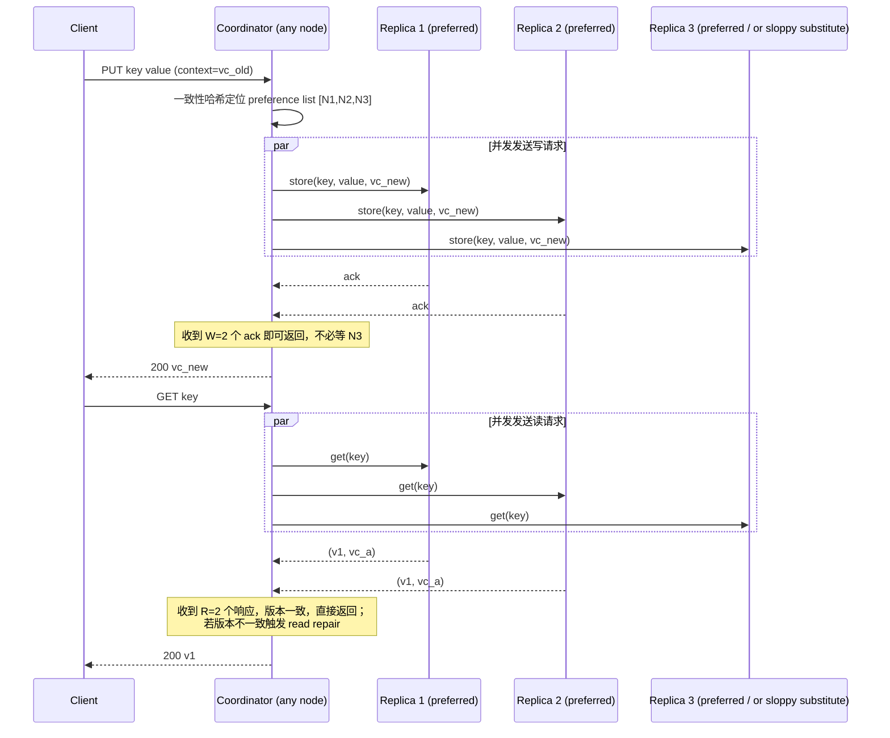

# 设计题解：分布式键值存储（Distributed Key-Value Store，Dynamo 风格）

## 题目与范围

面试官通常这样开场："设计一个高可用的分布式键值存储：只支持 `get(key)` / `put(key, value)`
两个操作，但要求在任意单个数据中心内，哪怕若干节点或整个可用区（availability zone）宕机，
写入也不能被拒绝。"这句话里真正的约束是**可用性优先于强一致性**——这不是一道"怎么让副本
永远保持一致"的题，而是一道"节点随时会挂、网络随时会分区，系统怎么在这种默认状态下持续
接受读写"的题。这正是 Amazon 2007 年发表 Dynamo 论文时要解决的问题：购物车服务不能因为
一个副本节点重启就告诉用户"暂时不能加购物车"。

值得当场问清楚的澄清问题，以及它们各自改变的设计决策：

- **值需不需要支持范围查询（range query）或二级索引？** 不需要——本题只做按 key 的点查
  （point lookup），这直接排除了范围分区（range partitioning）这条路（见「深入探讨」第 1
  节），也是 Dynamo 与 BigTable/HBase 类系统的根本分野。
- **一致性要求是什么？** 最终一致（eventual consistency），允许客户端在极端情况下读到
  同一个 key 的多个并发版本，由客户端或应用层决定如何合并——这决定了整套冲突处理机制
  （见「深入探讨」第 3 节），也是这道题和"设计一个分布式关系数据库"的本质区别。
- **值的大小量级？** 假设典型值在 1KB 以内（会话、购物车条目、用户偏好设置一类的小对象），
  不支持大文件/二进制块——这排除了需要专门处理大对象分块存储的复杂度，那是
  [[solution-object-storage]] 的范围。
- **可以为了可用性容忍读到脏读甚至旧数据吗？** 可以，只要系统最终收敛且从不无声丢弃写入——
  这是"sloppy quorum"这个核心设计决策成立的前提（见「深入探讨」第 2 节）。
- **要不要支持跨数据中心（cross-DC）复制？** 不在本题范围内讨论具体拓扑，只假设单一区域
  内的多可用区部署；跨区域是这套机制的自然扩展，但会引入的广域网延迟和拓扑感知路由不是
  本题的重点。

**范围内**：一致性哈希分区、N/R/W 可调quorum、冲突检测与版本合并、故障时的 sloppy quorum
与 hinted handoff、后台副本修复（anti-entropy）、去中心化的节点成员管理。**范围外**：
事务（transaction）、范围查询与二级索引、大对象存储、跨数据中心复制拓扑（属于更大的
多区域架构题）。

## 需求

**功能需求（驱动设计的 3–5 条）**

1. `PUT key value` 写入一个 key 的新版本，调用方可以带上一个先前读到的"上下文"
   （vector clock）来表明这次写建立在哪个历史版本之上。
2. `GET key` 返回该 key 当前的值；如果存在无法自动判定先后顺序的并发版本，返回全部
   版本供调用方合并。
3. `DELETE key` 逻辑删除一个 key（写入墓碑 tombstone），墓碑本身也参与复制和冲突处理，
   不能被静默地当作"没这个 key"处理。
4. 集群可以在线增删节点，数据重分布（rebalance）不需要停机，且只搬动必要的那一部分数据。
5. 任意少数节点（少于多数派）不可达时，读写都必须继续可用，而不是整体拒绝服务。

**非功能需求（数字化）**

- **可用性**：写路径目标 99.99% 可用——多数节点存活时写入永远被接受，这是这套系统存在的
  首要理由。
- **延迟 SLA**：对齐 Dynamo 论文披露的真实数字——在峰值 500 请求/秒的负载下，99.9% 的
  读写请求在 300ms 内完成（来源见「来源与延伸」）。本题采用同一数字作为设计的延迟目标，
  并且和该论文一样，**只看尾延迟（P99.9），不看平均延迟**——平均延迟掩盖了具体某个客户
  正在经历的真实体验。
- **一致性**：最终一致；不提供跨 key 的事务，单 key 内的多版本冲突交由客户端合并
  （见「深入探讨」第 3 节）。
- **持久性**：一旦写操作向调用方返回成功，数据必须在硬件级故障（单节点磁盘损坏）下不丢失，
  这要求"成功"的语义必须绑定在"至少写入 W 个独立节点"上，而不是"写入了协调节点的内存"。
- **弹性**：新增一个物理节点后，它应该只从"相邻"的节点分担数据，而不是让全集群所有节点
  都参与一次大规模重分布。

## 容量估算

**基础假设**：这套存储是多个内部服务共享的通用键值层（会话、购物车、用户偏好、
最近浏览等），支撑一个月活（MAU）3 亿的平台。

**请求量**：假设平均每个月活用户每天触发 40 次会经过这个存储的请求（每次页面加载都要
读一次会话/购物车状态，操作类事件才会写）。

```
total_req/day = 3×10^8 × 40 = 1.2×10^10
avg QPS       = 1.2×10^10 / 86,400 ≈ 138,889
peak QPS(×4 日间峰值系数) ≈ 555,556
```

**读写比**：会话状态在每次页面加载时都要读，但只在登录、加购物车、改偏好这类状态变更
动作时才写，假设读写比 9:1：

```
read avg  ≈ 138,889 × 0.9 ≈ 125,000     write avg  ≈ 138,889 × 0.1 ≈ 13,889
read peak ≈ 555,556 × 0.9 = 500,000     write peak ≈ 555,556 × 0.1 ≈ 55,556
```

**这是第一个决定架构的数字**：55.6 万的峰值 QPS 本身不算特别高，但下一步要看的是它如何
被"每次客户端请求要落到几个物理节点"这个复制因子放大。

**存储**：假设 3 亿月活用户平均每人有 5 个 key（购物车、会话、偏好、心愿单、最近浏览），
平均值大小 800 字节：

```
total_keys      = 3×10^8 × 5 = 1.5×10^9
raw bytes       = 1.5×10^9 × 800 B = 1.2×10^12 B = 1.2 TB
N=3 副本 bytes  = 1.2×10^12 × 3 = 3.6×10^12 B = 3.6 TB
```

年增长（假设 key 数以 15%/年增长）：

```
new_keys/year        = 1.5×10^9 × 0.15 = 2.25×10^8
new replicated bytes  = 2.25×10^8 × 800 B × 3 ≈ 5.4×10^11 B ≈ 540 GB/年
```

**这是第二个、也是更关键的决定架构的数字**：3.6TB 的总数据量，加上每年 540GB 的增量，
对任何一台现代存储节点都不构成压力——如果只看字节数，8 台节点（每台 500GB 容量）就能装下
全部数据外加三副本。但这套系统的真实约束不是字节，而是**每次客户端读写都要向多个物理节点
下发请求**：协调节点（coordinator）通常会把每次读写都发给全部 N=3 个副本节点（读等最快
返回的 R 个、写等最快确认的 W 个），所以物理节点承受的操作量是客户端 QPS 的 N 倍：

```
node-level ops/sec(peak) = 555,556 × 3 ≈ 1,666,667
```

假设单个存储节点（NVMe SSD、中等 CPU）能稳定承受 10,000 次混合读写操作/秒（这是本设计的
假设，不是某个真实系统的公开数字）：

```
nodes(QPS-bound)     = 1,666,667 / 10,000 ≈ 167 台
nodes(storage-bound) = 3.6×10^12 / (500×10^9) = 7.2 台
ratio                = 167 / 7.2 ≈ 23.1×
```

**结论，也是这道题容量估算里最该向面试官强调的一点**：集群规模由 QPS 乘以复制因子
决定（约 167 台），而不是由数据字节数决定（只需 7.2 台）——存储成本几乎可以忽略，
真正的设计杠杆是"如何把请求高效地路由到正确的少数几个节点，以及如何在节点增减时只
搬动尽量少的数据"，这直接引出「深入探讨」第 1 节的一致性哈希设计。

**后台反熵带宽**：假设稳态下每天有 0.1% 的 key 出现副本间分歧（网络抖动、临时节点下线
期间的写入积压）需要靠反熵（anti-entropy）修复：

```
diverged_keys/day = 1.5×10^9 × 0.001 = 1.5×10^6
repair bytes/day  = 1.5×10^6 × 800 B = 1.2×10^9 B ≈ 1.2 GB/天 ≈ 14 KB/s 均摊
```

这个量级远低于正常读写流量，说明反熵修复本身不是带宽瓶颈——它的代价在别处（见「深入
探讨」第 4 节：Merkle 树比较的计算和元数据开销，而不是同步的数据量）。

## 核心实体与 API

**实体**

- **KVEntry**：`key, value, vectorClock, tombstone(bool)`——一个 key 在某个节点上存储的
  一份物理记录；同一个 key 在不同副本上可能暂时持有不同的 `vectorClock`，这是设计允许的
  正常状态，不是 bug。
- **VirtualNode**：`token, physicalNodeId`——一致性哈希环上的一个分区边界；每个物理节点
  持有多个 VirtualNode（见「深入探讨」第 1 节），这是分区（partition）的实际最小单位。
- **PreferenceList**：`key → [physicalNodeId × N]`——由一致性哈希环推导出的、负责某个 key
  的 N 个物理节点的有序列表；列表里排在前面的是"偏好"节点，sloppy quorum 失败转移时按
  列表顺序跳过不可达的节点。
- **HintedHandoffEntry**：`targetNodeId, key, value, vectorClock`——某个节点代替暂时不可达
  的目标节点临时持有的一条写入，待目标节点恢复后异步转交。
- **MerkleTreeNode**：`rangeStart, rangeEnd, hash`——某个 key 范围内所有条目内容的层级哈希，
  用于两个副本间高效比较差异而不用传输全部数据。

**API**

```
GET    /kv/{key}
       → 200 {values: [{value, vectorClock}], ...}   -- 多个 value 表示存在未合并的并发版本
       → 404                                          -- key 不存在（区别于 tombstone）

PUT    /kv/{key}   {value, context: vectorClock?}
       → 200 {vectorClock}   -- context 缺省时视为全新 key；带 context 视为在该版本基础上更新
       幂等性见「常见错误」——PUT 本身不是幂等的，重复提交同一个 context 会产生新的并发分支

DELETE /kv/{key}   {context: vectorClock}
       → 200   -- 写入墓碑而非物理删除，见「深入探讨」第 3 节
```

**故意不做的**：不支持批量多 key 事务性写入（每个 key 独立复制、独立收敛）；不支持
`SCAN`/范围查询（一致性哈希把 key 打散到环上，相邻 key 物理上并不相邻）；不在 API 层暴露
`N`/`R`/`W` 让每次调用单独调节——这些是集群级配置，调用方只能选择"标准读"还是"强一致读
（R=N）"这类预设档位，避免误用导致悄悄降低持久性保证。

## 高层设计



**路由与协调**：客户端可以把请求发给集群中任意节点，接到请求的节点扮演协调者
（coordinator）角色——用一致性哈希（consistent hashing）加虚拟节点（virtual node）算出
这个 key 归属的 N 个物理节点组成的偏好列表（preference list），见「深入探讨」第 1 节。
存储引擎的技术选型是**本地 LSM-tree 类嵌入式存储（RocksDB/LevelDB 一类）**，因为工作负载
是随机点写 + 随机点读，LSM 把随机写变成顺序写，天然适合这种模式，而不需要 B-tree 那样
的原地随机 IO。

**写路径**：协调节点把新版本（连同基于客户端提交的 `context` 计算出的新 vector clock）
并发发给偏好列表上的全部 N 个节点，收到其中 W 个确认即可向客户端返回成功——不需要等待
最慢的节点，这是可用性和延迟的核心杠杆。如果某个偏好节点当前不可达，协调节点用 sloppy
quorum 把这份写入转发给列表之外的下一个健康节点暂存（hinted handoff），见「深入探讨」
第 2 节。

**读路径**：协调节点同样并发查询 N 个节点，收到 R 个响应后返回；如果这 R 个响应里的
vector clock 存在无法比较先后的并发版本，把这些版本原样返回给客户端做应用层合并
（见「深入探讨」第 3 节），同时在返回响应之余，异步向落后的副本发起 read repair，把
最新版本写回去，这样多数分歧在下一次读之前就已经自愈。

**后台修复**：每个节点周期性地和偏好列表上的其他副本交换各自维护的 Merkle 树根哈希，
自顶向下比较，只在哈希不一致的子树里继续往下比较，最终只对真正分歽的 key 范围做数据
同步（anti-entropy），见「深入探讨」第 4 节。

**成员管理**：集群没有中心化的成员列表服务，节点之间用 gossip 协议周期性地交换"我知道的
其他节点状态"，见「深入探讨」第 5 节，这也是 [[distributed.replication.leaderless|Leaderless & Quorums]]
一节里"无主复制不代表无协调，只是协调是去中心化的"这个原则在本设计里的具体体现。

## 深入探讨

### 分区方案：一致性哈希 + 虚拟节点，而不是范围分区或固定哈希分区

**问题**：容量估算给出的结论是集群要跑在约 167 台物理节点规模，且需要能在线增减节点。
分区方案必须同时满足"按 key 均匀分布"和"节点数变化时只搬动尽量少的数据"这两个目标。

**方案一：范围分区（range partitioning）**，像 BigTable/HBase 那样按 key 的字典序切分
成连续区间。代价：能做范围扫描，但本题的澄清问题已经排除了这个需求；更致命的是顺序写入
（比如按时间戳做 key）会导致最新区间成为写热点，需要额外的自动分裂（auto-split）机制，
而本题的 key 是任意购物车/会话 id，天然没有顺序性可利用，范围分区反而白白牺牲了均匀性。

**方案二：固定数量哈希分区（fixed hash partitioning）**，像 Kafka 的 partition 一样，
`partition = hash(key) % P`，P 在建集群时定死。代价：P 一旦选定，事后调整极其昂贵——
增加物理节点后，要么让新节点分担的分区数不均匀，要么必须重新计算全部 P 个分区到节点的
映射并搬动大量数据，`% P` 取模方式下几乎每个 key 的目标分区都会因为 P 变化而改变。

**方案三（本设计采用）：一致性哈希（consistent hashing）+ 虚拟节点（virtual node）**。
把 key 和物理节点都哈希到同一个环上，一个 key 归属于顺时针方向第一个节点；只加一个物理
节点时，只有它和顺时针前一个节点之间那一段区间的 key 需要迁移，其余节点的分区完全不受
影响。但如果每个物理节点只对应环上一个点，节点数少时负载会严重不均——所以每个物理节点
再映射到环上的多个"虚拟节点"（token），用更细的粒度平均负载。虚拟节点数量本身是个
方差 vs 开销的权衡（[[distributed.partitioning.schemes|Hash vs Range]] 下已有的
[[distributed-vnode-count]] 卡片给出了这个权衡的具体数字）：本设计对约 167 台物理节点
采用每节点 16 个虚拟节点、用确定性分配算法（而非纯随机）放置 token，而不是历史上
Cassandra 早期默认的每节点 256 个随机 token：

```
total virtual nodes = 167 × 16 ≈ 2,672
```

2,672 个虚拟节点足够把负载摊匀到几个百分点误差内，同时避免了随机高 token 数带来的
"修复和数据流迁移碎片化成大量小区间、Merkle 树重建变慢"的副作用。

### 可用性优先的写路径：Quorum、sloppy quorum 与 hinted handoff

**问题**：需求要求"少数节点不可达时读写都必须继续可用"。严格的 quorum（读写都必须真的
命中偏好列表上的节点，否则拒绝）能保证一致性，但不能保证需求里要求的写可用性。

**方案一：单主同步复制（single-leader, synchronous replication）**，类似传统主从关系型
数据库，所有写先落到 leader 再同步到 follower。代价：leader 不可达期间，写路径整体不可用，
直到完成一次 leader 选举——这和本题"可用性优先"的前提直接冲突。

**方案二：严格 quorum（strict quorum）**，读写都必须命中 preference list 上真实的 N 个
节点之一，凑不够 W 或 R 就直接失败。代价：只要 preference list 上有超过 N−W（写）或
N−R（读）个节点同时不可达——哪怕集群其余部分完全健康——这个 key 的读写就会被拒绝，
这在网络分区频发的真实环境下会造成远高于预期的失败率。

**方案三（本设计采用，对齐 Dynamo 论文的生产配置）：N=3, W=2, R=2 的 quorum，叠加
sloppy quorum + hinted handoff**。正常情况下，读写严格命中 preference list 上的 N 个
节点，满足 W+R > N（2+2 > 3）保证读写集合有交集（[[distributed-quorum-math]]）。当
preference list 上的某个节点不可达时，协调节点不拒绝写入，而是把这份数据写到列表之外
的下一个健康节点上，并标记"这本该属于某某节点"（sloppy quorum），故障节点恢复后，
持有该标记的节点会把数据异步转交给它、再删除本地的临时副本（hinted handoff）。这样
无论故障发生在哪，只要集群里还有 W 个可达节点（不要求是"对"的那 W 个），写入就能成功。

代价换算成一个具体数字：假设单个节点稳态可用性是三个九（99.9%），N=3、R=2/W=2 的读写
只要求 3 个节点中至少 2 个可达：

```
P(单节点可用) = 0.999
P(≥2/3 可用) = C(3,2)×0.999^2×0.001 + 0.999^3
             = 0.002994 + 0.997003 = 0.999997
```

三个独立的三九节点，组合成 quorum 后的可用性提升到约 99.9997%——换算成年停机时间，
单节点约 525.6 分钟/年，quorum 后降到约 1.58 分钟/年，缩短了约 333 倍。这是 quorum
复制本身（不叠加 sloppy quorum）就带来的可用性提升，sloppy quorum 进一步把"故障节点
必须是 N 个之外还有健康节点"这个更弱的条件也覆盖了。

### 冲突检测与合并：vector clock 而不是 last-write-wins

**问题**：sloppy quorum 意味着同一个 key 可能在网络分区期间被两个客户端分别写到不同的
节点子集上，恢复后这两次写谁也不是谁的"后续版本"——它们是**并发**的，不能用简单的
"谁的时间戳更大谁赢"来裁决。

**方案一：按墙钟时间戳的 last-write-wins（LWW）**。实现简单，但正如
[[distributed-lww-danger]] 指出的，不同节点的时钟本身就有偏差，一次真正更晚的写入可能
携带更早的时间戳而被悄悄丢弃——对购物车这种"丢一次写入=用户丢商品"的场景，这种静默数据
丢失是不可接受的。

**方案二（本设计采用，对齐 Dynamo 论文）：vector clock**。每次写入的 `context` 携带一个
`{(node, counter), ...}` 的版本向量；协调节点比较新写入的 context 和已有版本的 vector
clock——如果新版本的每个分量都大于等于旧版本（新版本"看见过"旧版本），判定为旧版本的
后继，直接覆盖；如果两个版本互不可比（各自有对方没见过的分量），判定为并发写入，两个
版本都保留为"兄弟版本"（siblings）一起返回给下一次 `GET`，由客户端决定怎么合并（例如
购物车场景下取并集）。这把"谁先谁后说不清楚"的判断权交还给唯一了解业务语义的一方——
调用方，而不是让存储层用一个物理上不可靠的信号（时钟）替业务做决定。

**代价与应对**：vector clock 会随着并发写入的节点数增多而增长。Dynamo 论文采用的做法
是给每个 `(node, counter)` 附带最近一次更新的时间戳，一旦分量数超过一个阈值（论文举例
为 10），丢弃时间戳最旧的那个分量——这是一个刻意的、有损的截断，换来元数据不会无限增长，
代价是极少数情况下会把一个真正的祖先版本误判成并发（产生多余的 sibling），论文报告这个
副作用在生产环境里没有造成实际问题（见「来源与延伸」）。

### 反熵修复：用 Merkle 树而不是逐条数据比较

**问题**：sloppy quorum 和短暂的节点不可达会让副本间产生分歧；read repair 只能修复
"恰好被读到"的那些 key，冷数据（长期没人读）的分歧会永远停留在磁盘上，直到下一次
偶然被读到——这不能作为收敛的保证机制，需要一个独立的后台修复过程。

**方案一：定期把两个副本的全部数据做逐条比较**（类似朴素的 rsync 全量扫描）。在 3.6TB
量级下，这意味着每次修复都要读取并传输双方全部数据做比较，即便两个副本 99.9% 的数据
完全相同，也要为了找出那 0.1% 的分歧付出扫描全部数据的代价——正是这种"全量比较"的成本
不随分歧比例下降而下降，使得频繁运行它不现实。

**方案二（本设计采用，对齐 Dynamo 论文）：Merkle 树**。每个节点为自己持有的每个 key
范围维护一棵 Merkle 树——叶子节点是某一小段 key 范围内所有条目内容的哈希，向上逐层
两两哈希合并到根。两个副本反熵时先比较根哈希：相同则整个范围数据一致，无需再看；不同
则各自把树往下展开一层，只在哈希不一致的子树里继续比较，直至定位到具体分歧的 key
范围。按容量估算里的假设（0.1% key 分歧），一棵覆盖 1.5×10^9 个 key 的 Merkle 树，
自顶向下的比较轮数是 `log2` 量级，而不是线性扫描全部数据——这正是[[distributed-anti-entropy-cost]]
卡片里指出的成本模型：Merkle 树把反熵的代价从"数据量"转移到"树的深度和分歧比例"，
容量估算里算出的 1.2GB/天修复流量正是建立在这个前提之上的。代价是节点增减导致 key
范围重新划分时，受影响范围的 Merkle 树需要整体重建，这也是虚拟节点数量不能定得过大
（进而导致范围过度碎片化）的另一个理由。

### 去中心化成员管理：gossip 协议而不是中心化协调服务

**问题**：一致性哈希路由要求每个协调节点都知道"环上现在有哪些节点、各自负责哪些
虚拟节点"；节点会加入、离开、临时故障，这份成员信息需要在全集群范围内传播并保持
最终一致。

**方案一：中心化协调服务**（Zookeeper/etcd 一类，见
[[distributed-coordination-service-primitives]]），由它保存权威的成员列表，节点变化
时更新它，其他节点订阅变化。代价：给本来追求"少数节点故障也不影响可用性"的系统引入了
一个新的关键依赖——协调服务本身的可用性和写吞吐成为整个集群成员变更速度的天花板，
与本题"去中心化容错"的设计哲学相悖。

**方案二（本设计采用，对齐 Dynamo 论文）：gossip 协议**。每个节点每秒随机选择另外几个
节点交换各自已知的成员状态（谁在环上、负责哪些虚拟节点、心跳时间），信息像流言一样
在节点间扩散，不存在单一的权威来源，也没有单点故障。收敛速度是对数级的：

```
convergence_rounds ≈ log2(N)
N=167  → log2(167) ≈ 7.4 → 约 8 轮
N=1700(10倍节点) → log2(1700) ≈ 10.7 → 约 11 轮
```

即使集群规模扩大 10 倍，收敛所需的轮数只从约 8 轮增加到约 11 轮——这正是 gossip 协议
在 Dynamo/Cassandra 这类系统里能扩展到成百上千节点而不需要中心化协调的原因：收敛时间
随节点数呈对数增长，而不是线性增长。代价是"最终一致"的成员视图本身——短暂的时间窗口内，
不同节点看到的环状态可能不完全一致，路由到错误节点的请求需要被转发到正确节点（类似
[[distributed-request-routing]]），而不能假设路由永远一次命中。

## 瓶颈、故障与演进

**热点与倾斜**：即使有虚拟节点打散负载，单个 key 本身依然可能成为热点（例如一次大促
期间某个热门商品的库存 key 被高频读写）——这和分区方案无关，见
[[distributed.partitioning.skew|Hot Keys & Skew]]，本题设计里对这类热 key 依赖客户端
本地短 TTL 缓存吸收读流量，而不是试图在存储层本身解决单 key 的写热点。

**故障域**：

- **单个物理节点宕机**：由 sloppy quorum + hinted handoff 吸收，写入照常成功；持有
  hint 的节点承担额外的临时存储和转交开销，节点恢复后这部分开销在数分钟到数十分钟内
  清零。
- **一个可用区整体不可达**：如果 preference list 恰好横跨多个可用区（部署时应当保证
  这一点），多数派仍在其余可用区内，读写继续可用；如果分区策略没有做到跨可用区分布
  偏好列表，这是设计缺陷而非算法缺陷。
- **网络分区把集群切成两半**：两边各自可能继续接受写入（sloppy quorum 不要求全局多数，
  只要求每次操作本地凑够 W/R），分区恢复后依赖 vector clock 检测出的并发版本和反熵
  修复收敛——这是"最终一致"里"最终"两个字的真实含义：不保证立刻收敛，只保证分区
  恢复后一定收敛。
- **协调节点本身故障**：因为任意节点都可以充当协调者，客户端只需要重试到另一个节点，
  不存在单一协调者的单点故障。

**10 倍演进**：月活从 3 亿到 30 亿。峰值 QPS 从 55.6 万增长到约 555.6 万，物理节点数从
约 167 台增长到约 1,667 台，虚拟节点总数相应增长到约 26,672 个——一致性哈希环的路由
和 gossip 成员管理机制本身不需要改变（gossip 收敛轮数只从 8 轮增加到 11 轮，见深入
探讨第 5 节），但 Merkle 树的重建成本和 hinted handoff 队列的積压都会随节点数增长而
增长，需要引入分层 gossip（按机架/可用区先局部收敛再跨域同步）来控制跨域流量。

**100 倍演进**（纯粹推演，月活 300 亿）：单一环上一千多个物理节点的运维复杂度和
Merkle 树重建成本开始成为主要负担，通常的应对是引入多个独立的环（按业务或数据集
物理隔离），而不是让所有 key 共享一个无限增长的单一环——这和信息流题里"按 user_id
物理隔离收件箱缓存集群"是同一个思路：物理隔离故障域比无限横向扩展单一集群更稳健。

## 面试官会追问什么

**中级（mid）**
- "为什么不干脆用一个 leader 来避免冲突？" 因为本题的首要需求是可用性优先于一致性——
  leader 不可达期间写路径整体阻塞，这和"少数节点故障也必须继续可用"的需求直接冲突。
- "R+W > N 保证的是什么，不保证什么？" 保证读写集合有交集，所以正常情况下读能看到最近
  的写；不保证线性一致性（linearizability）——sloppy quorum 生效时交集这个前提本身就
  被打破了，需要靠反熵最终收敛（[[distributed-quorum-not-linearizable]]）。

**高级（senior）**
- "hinted handoff 的数据在被转交前，算不算这次写入成功的三份副本之一？" 算——它已经是
  一份持久化的写入，只是暂存在错误的节点上；但它不会响应发往"正确"节点的正常读请求，
  这意味着 hint 存在期间，读到最新版本依赖凑够 R 个响应时是否恰好包含了持有 hint 的
  节点或已经完成转交的正确节点，这也是为什么 read repair 和反熵需要独立于 hinted
  handoff 存在。
- "vector clock 截断之后，系统还能保证发现所有真实的并发冲突吗？" 不能完全保证——截断
  是有损的，极少数情况下会把真正的祖先关系误判成并发，多出无害但需要客户端多合并一次
  的 sibling；这是用"元数据有界"换来的可接受代价，不是免费的。

**参谋级（staff）**
- "如果要把一致性从最终一致升级到读你所写（read-your-own-writes），最小改动是什么？"
  给客户端在写成功后记住这次写用到的节点集合或版本号，后续该客户端的读请求带上这个
  版本号做"至少要看到这个版本"的读，而不是升级全局的 R/W 配置——全局强一致会牺牲掉
  这套系统存在的意义。
- "gossip 协议在极端拜占庭（Byzantine）场景（节点撒谎）下会怎样？" 会失效——gossip
  的收敛性证明假设节点诚实地转发它们知道的信息，本设计的信任模型是"故障即停止"
  （fail-stop），不处理恶意节点，这是和拜占庭容错系统（如区块链共识）的根本区别，
  需要明确说明这是设计假设而不是遗漏。

## 常见错误

- 一上来就画"一个 leader 处理写、多个 follower 处理读"的架构，被追问"leader 挂了
  怎么办"才想起可用性需求，说明没有识别出这道题的核心矛盾是可用性优先。
- 把一致性哈希简化成"每个节点在环上一个点"，被追问节点数少时的负载不均问题答不上来，
  漏掉虚拟节点这个关键设计。
- 用时间戳做冲突解决（LWW）却说不清楚"为什么这样不会丢数据"，或者反过来选了 vector
  clock 却说不出元数据会无限增长这个副作用。
- 把 sloppy quorum 和严格 quorum 混为一谈，认为 W=2 总是意味着"两个正确的副本节点
  确认"，没意识到故障时这两个节点可能是被 sloppy quorum 临时借用的其他节点。
- 只讲反熵"定期同步数据"，说不出 Merkle 树到底省在哪——把它当成一个黑盒机制而不能
  解释它如何避免逐条比较全部数据。

## 五分钟讲法

This is a Dynamo-style key-value store where the core requirement is that writes must
never be rejected just because a minority of nodes are unreachable — availability wins
over strict consistency. Keys are placed on a consistent hash ring with each physical
node owning multiple virtual nodes, so adding or removing a node only moves the data
between its immediate neighbors on the ring instead of triggering a global reshuffle;
at my estimated scale that's around 167 nodes carrying roughly 2,700 virtual nodes.
Every write goes to the N=3 nodes in a key's preference list and returns success once W=2
acknowledge, and every read queries the same N nodes and returns once R=2 respond, so
reads and writes always overlap by at least one node under normal conditions. When a
preferred node is down, the coordinator doesn't block the write — it hands the data to a
substitute node under a sloppy quorum and tags it for hinted handoff back to the original
owner once it recovers, which is what keeps writes available through node failures and
short partitions. Because sloppy quorums can let two clients write concurrently to
different node subsets, conflicting versions are inevitable, so instead of trusting wall
clocks I use vector clocks to detect true concurrency and return both siblings to the
client to merge, accepting a bounded, lossy truncation of clock history in exchange for
metadata that doesn't grow forever. Background divergence between replicas is repaired by
comparing Merkle tree roots and only walking into subtrees that actually differ, so
anti-entropy cost scales with the fraction of data that's out of sync, not the size of
the dataset. And the whole thing runs without any centralized membership service — nodes
gossip their view of the cluster to a few random peers each round, converging in roughly
log2(N) rounds, which is why this stays viable even as the cluster grows by an order of
magnitude.

## 来源与延伸

- [Dynamo: Amazon's Highly Available Key-value Store](https://www.allthingsdistributed.com/files/amazon-dynamo-sosp2007.pdf)
  （SOSP 2007 论文原文，一手来源）：本文的 N=3/R=2/W=2 生产配置、99.9% 请求在 300ms
  内完成（峰值 500 请求/秒）的 SLA、vector clock 截断阈值（论文举例为 10 个分量）、
  sloppy quorum、hinted handoff 和 Merkle 树反熵机制均直接对齐这篇论文。本文与它的
  分歧在于：论文本身没有给出"某个具体规模下需要多少物理节点/虚拟节点"的量化推演，
  本文用一个假设的 3 亿月活场景把这些机制串成了具体的容量估算和节点数计算。
- [Redis Cluster Specification](https://redis.io/docs/latest/operate/oss_and_stack/reference/cluster-spec/)
  （Redis 官方文档，一手来源）：给出了另一种分区哲学的对照——固定 16384 个哈希槽
  （hash slot）而不是一致性哈希环，用 `MOVED`/`ASK` 重定向代替代理转发，gossip 心跳
  用于故障检测与 epoch 化的副本选举。本文与它的分歧在于：Redis Cluster 为了避免跨节点
  合并复杂数据结构的代价，选择了"最后一次故障转移获胜"（last failover wins）而不是
  vector clock，牺牲的正是本文「深入探讨」第 3 节里强调的、Dynamo 式设计要保留的并发
  写入语义——这个取舍差异被本文用作对比样本，具体机制见姊妹题解
  [[solution-distributed-cache]]。
- [donnemartin/system-design-primer](https://github.com/donnemartin/system-design-primer)
  （MIT 协议的开源社区仓库）：给出了一致性哈希、quorum 一致性和 CAP 权衡的基础科普
  框架。本文与它的分歧在于：它把这些概念作为独立小节罗列，没有把 sloppy quorum 之后
  必然产生的并发写入、vector clock 截断的副作用、以及虚拟节点数如何被 Merkle 树重建
  成本反向约束这几个环节串成一条完整的因果链——这条因果链是本文深入探讨部分的核心
  结构。
