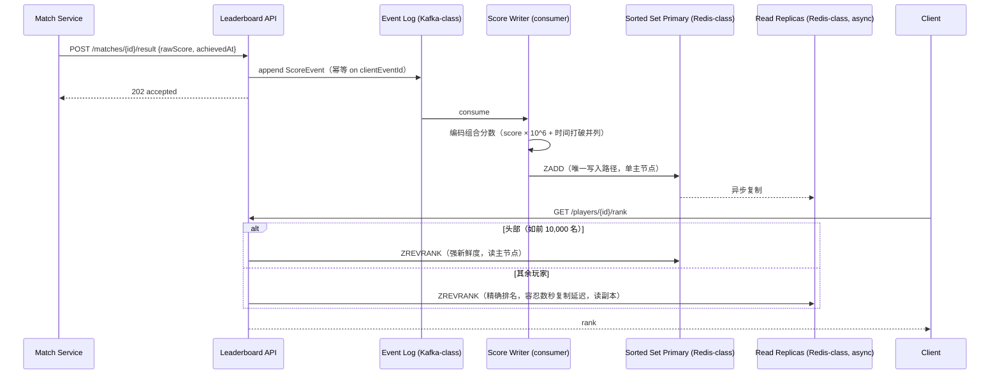

# 设计题解：实时排行榜（Real-Time Leaderboard）

## 题目与范围

面试官通常这样开场："设计一个游戏的实时排行榜：数百万玩家的分数持续更新，任何人都能
查看全球排名前列，也能查到自己当前排第几名。" 这道题看起来只是"给 Redis 有序集合
（sorted set）套一层 API"，但真正的难度在于两层容易被跳过的判断：**先要老老实实算清楚
当前规模到底逼不逼得出分片**（内存和单节点吞吐往往都比直觉里更宽裕，过早分片是这道题
里最常见的过度设计）；**一旦规模真的涨到需要分片，"我排第几名"这个全局属性天然跨
分片，反而是最难便宜地回答的问题**——这道题的深度都在这两句话上。

值得当场问清楚的澄清问题，以及它们各自改变的设计决策：

- **榜单是永久累积，还是按周期（日/周）重置？** 决定「深入探讨」第 5 节的键设计和
  归档策略；本题两者都做，永久榜和周期榜并存。
- **每个人都需要精确排名，还是"你比多少人强"这种大致排名就够？** 决定「深入探讨」
  第 3 节头部/长尾分流的设计；本题假设头部需要精确排名（有实际奖励），长尾只需要
  近似排名（纯展示）。
- **要不要支持好友榜？** 要，见「深入探讨」第 6 节，这也是决定不能给每个用户单独
  维护一份"好友专属有序集合"的关键约束。
- **分数怎么来——客户端直接上报最终分数，还是服务端根据比赛过程计算？** 决定「深入
  探讨」第 8 节作弊防护的设计基础；本题假设分数由受信任的后端比赛结算服务计算和
  提交，客户端不能直接写分数。
- **要不要支持多个独立榜单（按游戏模式、按地区）？** 不做——本题只设计单一维度的
  全球榜单，多维度榜单是同一套机制的水平复制，不引入新的难点。

**范围内**：有序集合的能力边界与单节点上限、按分数区间分片、跨分片排名查询、并列
打破、时间窗口榜单与重置、好友榜、耐久性与从事件日志重建、作弊防护。**范围外**：
比赛/对局本身的撮合与结算逻辑（属于 Online Multiplayer Game 一题）、好友关系的
增删查（假设已有一个好友服务可查询）、奖励发放。

## 需求

**功能需求（驱动设计的 3–5 条）**

1. 玩家完成一局比赛后，分数写入排行榜，写入应尽快对读路径可见。
2. 任何人可以查看全球榜单的前 N 名（如 Top 100）。
3. 任何玩家可以查到自己当前的全球排名，以及排名紧邻自己的其他玩家。
4. 支持按日/周重置的时间窗口榜单，同时保留永久累积榜单。
5. 任何玩家可以查看仅包含自己好友的排行榜。

**非功能需求（数字化）**

- **写入可见延迟**：一局比赛结束到分数反映在榜单上，目标 P99 < 2 秒——比赛结算后
  玩家几乎立刻会去看排名，延迟太高会被当作"榜单坏了"。
- **读延迟**：查排名、查 Top N，目标 P99 < 100ms——这是一个高频轮询/查看的只读
  接口，必须足够快才能支撑客户端频繁刷新。
- **可用性**：读路径 99.99%（榜单是核心留存功能，查不到排名比看到略微过时的排名
  伤害更大）；写路径 99.9%，短暂失败允许重试。
- **一致性**：最终一致，容忍榜单落后真实比赛结果最多几秒；但玩家自己刚打完的这一局
  分数，必须在自己的客户端上立刻反映（读己所写），不能等异步管道追上。
- **耐久性**：榜单数据丢失时必须能够无损重建，不接受"重启后排名对不上历史比赛记录"。

## 容量估算

**假设**：日活跃且有排名记录的玩家（DAU）3,000 万，累计注册账号 1.5 亿（绝大多数是
不再活跃的长尾账号）。

**写侧**：假设人均每天完成 5 局比赛，每局结束触发一次分数写入。

```
写入/天 = 3×10^7 × 5 = 1.5×10^8
平均写 QPS = 1.5×10^8 / 86,400 ≈ 1,736
峰值写 QPS(×6 晚间黄金时段峰值系数) ≈ 10,417
```

**读侧**：假设人均每天查看排名/榜单 15 次（打完一局看一眼排名、主动点开榜单页）。

```
读/天 = 3×10^7 × 15 = 4.5×10^8
平均读 QPS ≈ 4.5×10^8 / 86,400 ≈ 5,208
峰值读 QPS(×6) ≈ 31,250
读:写 比 ≈ 3:1
峰值总 QPS(读+写) ≈ 41,667
```

**内存：一个反直觉的结论**。有序集合的内存开销 = 跳表节点 + 哈希表条目的固定开销
（约 96 字节，量级估算）+ 成员本身（玩家 id，压缩编码约 8 字节）+ 分数（8 字节 double）：

```
每条记录字节数 ≈ 96 + 8 + 8 = 112 B
全部 1.5 亿账号的内存 ≈ 112 × 1.5×10^8 = 1.68×10^10 B ≈ 16.8 GB
仅 3,000 万 DAU 的内存 ≈ 112 × 3×10^7 ≈ 3.36 GB
```

**这是本题第一个容易被面试官带偏的地方**：把全部 1.5 亿账号（包括早已不活跃的长尾）
塞进一个有序集合，内存也只有 16.8GB——单台内存充裕的 Redis 主节点轻松装得下，*内存
本身在这个规模下不是必须分片的理由*。真正逼出分片的是下一条。

**单节点操作数上限——先算清楚，再决定要不要分片**：Redis 对命令执行是**单线程**的
（官方文档明确说明它不为利用多核设计，多核扩展靠多开实例而不是让一个实例吃满多核），
`redis-benchmark` 文档给出的数字是单实例、无持久化、无流水线条件下简单命令（`SET`/
`GET`）能跑到十几万甚至更高的 QPS；本题解姊妹题《Rate Limiter》对一个更贵的操作
（读状态+计算+写回的原子 Lua 脚本）给出的生产环境可持续上限是约 100,000 次/秒，本题
沿用同一个数量级作为简单命令的生产基线，但要为两点做折价：有序集合的 `ZADD`/
`ZREVRANK` 是 O(log N)（1.5 亿成员约需 27 次比较，比 `SET`/`GET` 的 O(1) 贵，但远
没有贵一个数量级），叠加主从复制和持久化（AOF/RDB）的常规开销。本题保守地打五折：

```
单节点可持续上限 = 100,000 × 0.5 = 50,000 op/s
（0.5 折价：O(log N) 排序操作相对 O(1) 简单命令的开销，加上复制/持久化的生产开销）
```

拿这个上限去对照容量估算给出的负载：

```
写路径耗时余量 = 单节点上限 / 峰值写QPS = 50,000 / 10,417 ≈ 4.8 倍
若读写都挤在同一个节点上 = 单节点上限 / 峰值总QPS = 50,000 / 41,667 ≈ 1.2 倍
```

**这是本题最该向面试官强调的对比，也是最容易被面试者自己跳过的一步**：无论是
16.8GB 的内存还是约 5 万 op/s 的单节点吞吐，在本题设定的规模下都**装得下、扛得住**——
把这道题一上来就设计成分片架构是过度设计。真正合理的基线是**一个主节点接收全部写入
（峰值写 QPS 距上限还有约 4.8 倍余量），若干只读副本承担绝大部分读流量**（Top N、
排名查询这类能容忍几秒复制延迟的场景不需要打主节点）——把读写都塞进同一个节点时
余量只剩约 1.2 倍，这也是为什么"主写从读"这一步本身就值得做，而不是等到必须分片才
考虑读写分离。分片（见「深入探讨」第 2 节）是这道题里当写入速率本身超过单节点上限
时才需要引入的机制，不是起手就要有的默认架构。

**并列打破所需的数值精度**：如果给分数和"达成时间"编码进同一个 Redis score（IEEE
754 双精度浮点数，精确整数范围到 2^53 ≈ 9.007×10^15），假设原始分数上限 10 亿
（10^9），要给同一分数内更早达成的玩家排在前面，需要给时间戳量级留出小数位：

```
组合分数 = 原始分数 × 10^6 + (86,400 - 本周期内已过秒数)
组合分数上限 = 10^9 × 10^6 = 10^15，小于 2^53 ≈ 9.007×10^15，精度足够
```

这个数字是「深入探讨」第 4 节并列打破方案的可行性依据。

## 核心实体与 API

**实体**

- **Player**：`id, displayName`。
- **ScoreEvent**：`eventId, playerId, rawScore, achievedAt, period(all-time/daily/
  weekly), clientEventId`——**唯一权威数据**，进入一条只追加的事件日志（Kafka 一类），
  Redis 里的有序集合是从这条日志派生出的、可重建的缓存视图（见「深入探讨」第 7 节）。
- **LeaderboardShard**：`shardId, period, scoreRangeLower, scoreRangeUpper, memberCount`
  ——**当前规模的基线设计里不存在这个实体**，因为容量估算已经证明一个主节点扛得住
  当前的写入速率；只有当写入速率真的超过单节点上限（见「深入探讨」第 2 节的 10 倍
  演进场景）才引入这份分片边界元数据，`memberCount` 到那时才用于跨分片求和算排名。
- **RankSnapshot**：`period, scoreBucket, approxPercentile, computedAt`——为长尾玩家
  周期性离线计算的近似排名查找表，在分片引入后接管长尾排名查询（见「深入探讨」第 3
  节）；基线设计下长尾排名走只读副本上的精确 `ZREVRANK`，还不需要这张表。

**API**

```
POST   /matches/{matchId}/result
       {playerId, rawScore, achievedAt, clientEventId}
       只能由受信任的比赛结算服务调用，不对最终客户端开放；
       按 clientEventId 幂等，重复提交不重复计分
GET    /leaderboards/{period}/top?limit=100
       → {entries: [{playerId, rank, score}]}，读主节点（前列名次竞争激烈、有奖励，
       值得付出主节点上的强新鲜度）
GET    /leaderboards/{period}/players/{playerId}/rank
       → {rank, isApprox, score}——当前规模下全员都是精确排名，只是数据来源不同：
       头部（如前 10,000 名）读主节点，其余读只读副本（容忍数秒复制延迟）；`isApprox`
       字段为分片引入后长尾切到 `RankSnapshot` 预留（见「深入探讨」第 3 节）
GET    /leaderboards/{period}/players/{playerId}/nearby?window=5
       → 排名紧邻该玩家前后 window 名的列表
GET    /leaderboards/{period}/players/{playerId}/friends
       → 只包含该玩家好友的榜单（见「深入探讨」第 6 节）
```

**故意不做的**：不允许客户端直接提交最终分数（见「深入探讨」第 8 节）；不在 API 层
暴露分片细节（分片边界、分片 id 对调用方不可见）；不支持任意区间的"第 N 到第 M 名"
批量导出（只支持 Top N 和"我附近"两种查询模式，避免暴露一个可以被滥用成整表扫描的
通用接口）。

## 高层设计



**写路径**：比赛结算服务调用 API 后，先追加一条 `ScoreEvent` 到事件日志再返回，不
等 Redis 写入完成——这把"分数被记录"和"分数出现在可查询的榜单上"解耦，事件日志是
**日志式消息队列（Kafka 一类）**，因为需要保证事件顺序、支持消费者从上次 offset
重放、并允许多个独立消费者（除了写榜单，反作弊分析、赛季统计等也能订阅同一条流）。
Score Writer 消费事件后计算组合分数（编码并列打破所需的时间戳，见「深入探讨」第 4
节），执行 `ZADD` 写入**唯一的 Redis 主节点（内存数据结构存储一类）**——容量估算
已经证明当前规模下一个主节点的写入余量还有约 4.8 倍，不需要按分片路由。

**读路径**：所有读请求在当前规模下都能拿到精确排名（有序集合的 `ZREVRANK` 是
O(log N)，1.5 亿成员约 27 次比较，天然便宜，和请求者是头部还是长尾无关），区别只在
读哪个副本：头部查询（竞争激烈、有实际奖励）直接读主节点，拿到写入后立刻可见的强
新鲜度；其余绝大多数查询读异步复制的只读副本，省下主节点的读容量、换取数秒量级的
复制延迟——这就是容量估算里"主写从读"结论在读路径上的落地。等到写入速率真的超过
单节点上限、必须引入分片之后，长尾排名查询才会改用离线预计算的近似路径，见「深入
探讨」第 2、3 节。

## 深入探讨

### 单主节点先扛，读写分离先做：分片不是这道题的起手式

**问题**：默认直觉是"数百万玩家、持续更新的排行榜"听起来就该分片，但容量估算已经
算清楚，这道题在 3,000 万 DAU 规模下，内存（16.8GB）和单节点吞吐上限（约 50,000
op/s，对比峰值写 QPS 10,417、峰值总 QPS 41,667）都还有数倍余量——真正的问题是
"要不要现在就分片"，而不是"该怎么分片"。

**方案一：一上来就按分数区间分片（下一节要讲的机制）**。机制本身是对的，但在这个
规模下引入分片纯属为未来的问题提前买单：多了一套分片路由、多了"我排第几名"要跨
分片求和的复杂度、多了分片再平衡的运维负担，而当前的写入速率距单节点上限还有约
4.8 倍余量——这是这道题里最容易犯的过度设计。

**方案二：只做读写分离（主写从读），不分片**。把读流量（占峰值总量 3/4）分散到
多个只读副本，缓解读路径压力；所有写入依然串行经过同一个主节点，但峰值写 QPS
（10,417）本身距单节点上限（约 50,000）还有约 4.8 倍余量，写路径并不吃紧——这正是
本设计在当前规模下的基线架构。

**方案三（本设计在当前规模下采用）：一个主节点接收全部写入，若干只读副本分担
绝大部分读流量**。主节点的写入余量（约 4.8 倍）远大于把读写都堆在同一节点上的余量
（约 1.2 倍），这个差距本身就说明"先做读写分离"比"先分片"划算得多——读写分离把
即将变紧张的资源（同一节点上读写抢占）拆开，而不引入分片带来的"排名是全局属性"
这个新问题。只有当写入速率本身（不是读流量，读可以无限加副本缓解）超过单节点上限
时，才轮到下一节的分片机制登场；本题在「瓶颈、故障与演进」的 10 倍演进场景给出了
这个临界点：约 4.8 倍于当前的写入量。

### 写入速率一旦超过单节点上限：按分数区间分片与"我排第几名"

**问题**：上一节算出，当前写入量距单节点上限还有约 4.8 倍余量——但这道题标题写的是
"数百万玩家"，一款成功的游戏完全可能在几个季度内把 DAU 再翻几倍。一旦峰值写 QPS
真的超过单节点约 50,000 op/s 的上限，必须把写入分散到多个 Redis 主节点，这时候"怎么
分片"就成了绕不开的问题：最直觉的做法是按玩家 id 取模或一致性哈希——这样写入均匀
分散，但破坏了"整个榜单按分数有序"这个全局属性：要回答"我排第几名"，必须知道全局
有多少玩家分数比我高，而这些玩家可能散落在任意一个分片里，等价于要查遍所有分片再
合并排序，读路径的代价随分片数增长而不是降低。

**方案一：按玩家 id 分片**。写入负载分布均匀，简单直接，但排名查询需要向所有分片
发起 scatter-gather 查询再合并——对于"查我的全局排名"这种高频操作，代价随分片数
线性增长，违背了分片本该降低单点负载的初衷。

**方案二（本设计在写入超限后采用）：按分数区间分片，每个分片维护自己的成员计数**。
把分数值域切成 K 个连续区间，每个区间对应一个分片，区间边界按当前人口分布动态划定
（不是等宽切分——真实的分数分布通常在中段密集、两端稀疏，等宽切分会让某些分片存
几乎全部玩家、另一些分片几乎空着）。每个分片的元数据额外维护一个 `memberCount`
（`ZCARD` 的缓存结果，O(1) 读取）。计算某玩家的全局排名时，只需要：把这名玩家所在
分片"之上"的所有分片的 `memberCount` 求和，加上他在自己分片内的排名（`ZREVRANK`，
O(log N_分片)）——只要分片数保持在个位数到十位数，这一步是几次内存读取的加总，代价
和分片数无关地保持很小，不随总玩家数增长。分片边界需要定期（例如每天）根据最新的
分数分布重新划定，防止某个区间随着玩家整体分数上移而变得异常拥挤。

**这个机制在什么规模下真正启用，需要用数字说话**：假设 DAU 从 3,000 万涨到 10 倍
即 3 亿，峰值写 QPS 也近似线性涨到约 104,167，此时已经超过单节点约 50,000 op/s 的
上限：

```
所需分片数(raw) = 104,167 / 50,000 ≈ 2.08，向上取整并取 2 的幂，得到 4 个分片
每分片写入负载 ≈ 104,167 / 4 ≈ 26,042 op/s
每分片相对单节点上限的余量 ≈ 50,000 / 26,042 ≈ 1.92 倍
```

4 个分片（而不是当前规模下算出来会显得"更保险"的更大数字）就足够把写入余量重新
拉回到接近 2 倍——分片数不是越多越好，够用、留有再平衡余地即可，分片数越多，"我
排第几名"这一步要跨的分片就越多，虽然单次代价仍然很小，但没必要为了不存在的负载
提前引入更多分片。

### 头部读主节点、长尾读副本、规模够大后读离线快照：排名新鲜度分层

**问题**：「高层设计」已经给出当前规模下的基线——头部（如前 10,000 名）读主节点
换取强新鲜度，其余玩家读只读副本、容忍数秒复制延迟——这个分层此时纯粹是新鲜度
换读容量的权衡，因为无论读主节点还是读副本，`ZREVRANK` 本身都是 O(log N) 的廉价
操作，不管排第几名。但一旦上一节的分片在高写入量场景下被引入，情况变了：长尾玩家
的精确排名需要"跨分片求和 `memberCount` + 分片内 `ZREVRANK`"这一整套逻辑，单次代价
依然很小，可数千万个长尾玩家里，绝大多数人查一次排名之后很久都不会再查（他们的
名次几乎不挪动，第 34,412,857 名和第 34,412,900 名对他们自己也没有区别），让这些
低价值、高频次的查询继续走实时的跨分片路径，只是在积累没有必要的负载。

**方案一：分片之后，所有人依然走一样的实时精确路径**。逻辑统一、实现简单，但为
数千万几乎没人关心精确名次的长尾玩家反复付出跨分片求和的开销，随着分片数和查询量
一起增长，这份不必要的负载会持续增大。

**方案二（本设计在分片引入后采用）：头部继续读主节点，长尾改走离线预计算的近似
排名**。头部（有实际奖励、玩家会反复刷新看自己是否掉出前列）继续保持读主节点的
强新鲜度不变；长尾玩家的排名查询改为查一张由离线任务（例如每 5–10 分钟运行一次）
扫描各分片算出的"分数分桶 → 近似百分位"查找表（`RankSnapshot`）——用户看到的是
"你比大约 78% 的玩家强"而不是精确到个位的名次，代价是这个百分位有几分钟的陈旧
窗口，换来的是长尾查询完全不用触碰实时的跨分片求和路径。这个权衡的本质是：**排名
的精确度应该和这个名次实际被谁、为了什么目的使用挂钩，且应该随着"维持实时精确"
的边际成本变化而重新评估**——当前规模下这个边际成本低到可以对所有人都给精确排名，
规模大到必须分片之后，这个边际成本变了，权衡的结论也该跟着变。

### 并列打破：把两个排序维度编码进一个分数里

**问题**：两个玩家分数相同时，"谁排前面"不能是未定义行为——Redis 有序集合在分数
相同时默认按成员字符串做字典序打破并列，这个顺序和"谁先达到这个分数"毫无关系，是
一个和玩家体验无关的、纯技术实现细节导致的排序，容易被玩家当作榜单不公平。

**方案一：接受 Redis 的默认字典序打破并列**。零额外实现成本，但语义上是错的——
两个玩家分数相同时谁排前面完全取决于玩家 id 字符串谁更小，和"先达成"这个玩家真正
关心的规则毫无关系。

**方案二（本设计采用）：把主排序指标和打破并列用的次要指标编码进同一个数值分数**。
容量估算已经验证了这个编码在精度上可行：`组合分数 = 原始分数 × 10^6 + (周期总秒数
- 本周期内已过秒数)`，即分数相同时，更早在本周期内达成该分数的玩家因为"已过秒数"
更小、被减出来的值更大，组合分数更高，自然排在前面；`×10^6` 的量级选择保证了
时间部分（最大到 86,400 秒的量级）不会溢出进分数部分的有效数字，同时 10^15 的
组合分数上限仍在 IEEE 754 双精度的精确整数范围（2^53 ≈ 9.007×10^15）之内，不会有
精度丢失导致的排序错误。这个方案的代价是分数字段不再是"看得懂的原始分数"，展示层
需要在读取时反解出真实分数（整除 10^6）。

这个编码需要按榜单的周期长度选用不同的量级，不能所有榜单共用同一套乘数：日榜、周榜
的"周期内已过秒数"天然有界（最大 86,400 或 604,800），`×10^6` 足够覆盖；但永久累积榜
没有自然的周期边界，如果直接套用"距今已过秒数"作为打破并列的次要指标，这个数字会
随产品运营时间不断增长（运营十年约 3.15×10^8 秒），乘数至少要放大到 10^9 才能容纳，
而 `原始分数(10^9) × 10^9 = 10^18` 早已超出双精度的精确整数范围（2^53 ≈
9.007×10^15），会产生排序错误。永久累积榜因此改用更粗的粒度——按"距产品上线的第几天
达成"而不是精确到秒来打破并列：

```
永久榜组合分数 = 原始分数 × 10^4 + (10,000 - 达成时的上线天数序号)
组合分数上限 = 10^9 × 10^4 = 10^13，仍在 2^53 精确整数范围内
```

代价是永久榜的并列打破只精确到"哪一天"，不区分同一天内谁更早——这个粒度损失是刻意
接受的：一个跨越多年的榜单里，"哪一天达成"已经是玩家会关心的精度上限，日内先后顺序
对这类长期榜单没有实际意义。

### 时间窗口榜单与重置：一个事件写两次，读两条独立的有序集合

**问题**：日榜、周榜需要在每个周期开始时"归零"，但归零不能是删除历史数据——上一天/
上一周的榜单结果本身是有价值的历史记录（战绩、赛季奖励结算），删了就无法回溯。

**方案一：复用同一个有序集合，周期开始时清空重来**。实现最简单，但清空即丢弃，
上一周期的排名结果无法回看，也无法在事后发现计分错误时重新核算。

**方案二（本设计采用）：每个周期用独立的键，到期后归档、设置宽限期过期**。
每天、每周分别用带日期的键（如 `lb:daily:2026-09-20`、`lb:weekly:2026-W38`）存
各自独立的有序集合，同一条 `ScoreEvent` 会被 Score Writer 同时写入所属的日榜键、
周榜键和永久累积键——一次事件、多次投影，而不是一份数据、多次读时聚合。日榜键设置
比如 48 小时的宽限期后过期（`EXPIRE`），宽限期内玩家仍能看到"昨天"的榜单；过期前
一步会把该键的最终状态归档写入冷存储（不是 Redis 的职责），供历史查询和赛季结算
使用。永久累积键不设过期，作为跨所有周期的整体名人堂。

### 好友榜：不给每个用户单独维护一份有序集合

**问题**：如果朴素地想"好友榜就是过滤过的全局榜"，容易想成"给每个用户维护一份只
包含其好友的专属有序集合"——但这样一份专属集合的数量和用户数同阶，而且好友关系
一变（加好友/删好友），维护成本也随之膨胀，这是一个和信息流场景"要不要给每个粉丝
推送"结构上相同的扇出困境。

**方案一：为每个用户预先维护一份"好友专属"有序集合，好友关系变化时同步更新**。
读取快，但存储和维护成本随用户数 × 平均好友数增长，好友关系频繁变动时的更新成本
可能远超实际读取这份数据的频率。

**方案二（本设计采用）：读时现算——查询好友列表（有限、通常几百人以内），批量
查询这些好友 id 在全局周期榜单里的分数（一次批量分数查询，代价随好友数线性而不是
随总玩家数），在应用层对这个小结果集排序后返回**。省去了维护海量专属集合的存储和
更新成本，用一次读时的小规模排序换取"从不需要为好友关系的变化同步任何东西"——好友
榜的数据永远是从最新的全局榜单实时派生出来的，天然保持新鲜，不存在"专属集合没跟上
好友关系变化"这种不一致状态。这正是把
[[caching.strategies|Write & Read Strategies]] 里"写时预计算 vs 读时现算"这个权衡
搬到了排行榜场景：好友榜选择读时现算，是因为一次好友榜查询的代价（几百个成员的
批量查询+排序）远低于全局榜单本身的写入放大问题。

### 耐久性与从事件日志重建：有序集合是可丢弃的缓存，不是权威数据

**问题**：如果把 Redis 里的有序集合当作唯一的数据存在形式，一旦某个分片的主从
同时丢失数据（部署错误、误操作、罕见的多重故障），这部分排名数据就无法恢复，
而排行榜牵涉真实的比赛结果和可能的奖励发放，"丢了就丢了"是不可接受的后果。

**方案一：只依赖 Redis 自身的持久化（RDB 快照 + AOF 日志）**。能应对单机重启和
主从故障转移，但如果需要因为一次计分逻辑的历史 bug 而重新核算某个时间段的排名，
RDB/AOF 只能恢复"当时写入的（可能是错的）结果"，没有能力用修正后的逻辑重新计算。

**方案二（本设计采用）：有序集合是可重建的派生视图，唯一权威数据是只追加的
`ScoreEvent` 事件日志**。Redis 的 RDB/AOF 仍然保留，作为快速恢复的性能优化（避免
每次都要从头重放全部历史），但真正的耐久性保证来自事件日志本身的多副本持久化。
重建时间是可以计算的：假设离线批量重放吞吐 20 万事件/秒（不受单个请求网络往返
限制，走批量流水线写入）：

```
重建一天的日榜（1.5×10^8 条事件） ≈ 1.5×10^8 / 2×10^5 = 750 秒 ≈ 12.5 分钟
重建一周的周榜（1.05×10^9 条事件） ≈ 1.05×10^9 / 2×10^5 = 5,250 秒 ≈ 87.5 分钟
```

十几分钟到一个半小时的重建时间，对应的是"发现计分逻辑有 bug，需要用修正后的规则
重新核算过去一天/一周的排名"这类真实会发生的场景——这正是把 Redis 当作缓存而不是
权威数据带来的直接收益：修 bug 之后重放，而不是无法挽回。

### 作弊：结构性防护比事后检测更根本

**问题**：一个允许客户端直接提交"我这局得了多少分"的排行榜，本质上是在信任一个
完全不可信的输入源——分数是可以被修改客户端、抓包重放、或者绕过客户端直接调用 API
伪造出来的。

**方案一：客户端提交最终分数，服务端只做基础校验（比如分数不能是负数）**。实现
最简单，但没有任何结构性防线——只要客户端能被逆向或者请求能被抓包重放，就能伪造
任意分数，事后再去逐条甄别只能不断追着新的作弊手法打补丁。

**方案二（本设计采用）：分数从不由客户端直接提交，只能由受信任的后端比赛结算服务
根据完整的比赛/对局状态计算后写入**（对应 API 设计里 `POST /matches/{id}/result`
只对内部服务开放，见「核心实体与 API」）。这不是消灭作弊（结算服务本身仍可能有
逻辑漏洞被利用），但把"能不能写分数"从"客户端说了算"变成"服务端根据它自己观测到的
权威比赛过程说了算"，堵死了"直接伪造一个请求就能改分数"这一类最低成本的作弊方式。
在此基础上叠加异常检测作为第二道防线——对每个玩家的分数增长速率维护历史基线，单局
分数或短时间内的分数增速显著偏离该玩家自己的历史分布时标记为可疑，先从公开榜单里
静默排除（玩家自己仍能看到、仍能继续游戏，但暂不出现在他人可见的榜单上）等待人工
或更严格规则复核，而不是立即封号——这避免了误伤正常的"突然打出高光表现"的玩家，也
避免过早暴露风控规则让真正的作弊者据此调整策略。

## 瓶颈、故障与演进

**热点与倾斜**：当前单主节点、单一 keyspace 的基线设计下，不存在"某个分片过热"
这类问题——所有写入天然落在同一个键上，没有分片间负载不均衡可言。这类热点只在写入
速率超过单节点上限、真正引入按分数区间分片之后才会出现：分数分布不是均匀的（赛季
初期大量玩家挤在相近的低分段），某个区间可能因此承受远高于平均的压力；缓解办法是
分片边界按人口密度动态划定并定期重新平衡（见「深入探讨」分片一节），而不是一次性
静态划定后不再调整。

**故障域**（当前单主节点 + 只读副本的基线架构）：

- **主节点不可用**：唯一的写入路径中断，一个只读副本被提升为新主节点期间写路径
  短暂不可用；读路径可以继续由其余副本提供服务（带着"可能已过期"的提示），不是
  整体不可用——这正是"主写从读"相对"单个不分离的节点"多出来的一层容错。
- **事件日志（Kafka 一类）不可用**：写路径暂停接受新的比赛结果，但已经成功写入
  日志的历史数据和已经反映到 Redis 里的当前榜单不受影响，恢复后从上次 offset
  继续消费，不丢数据只是延迟可见。
- **某个只读副本复制延迟异常增大**：读到该副本的玩家看到的排名陈旧窗口从数秒
  拉长，路由层监测到复制延迟超过阈值时把这个副本临时摘出读流量池，不影响写路径
  和其余副本。
- **（写入超限、分片已引入之后）离线近似排名任务失败**：长尾玩家的近似排名查找表
  停止刷新，读路径继续返回上一次成功计算的结果（带着一个更长的陈旧窗口），不影响
  头部精确排名和写入路径；分片再平衡过程中的短暂不一致同理——跨分片求和的排名在
  边界迁移窗口期可能短暂不准确，这是一个刻意接受的、有界的、自我恢复的不一致窗口，
  不是需要用分布式事务解决的正确性问题。

**10 倍演进**：DAU 从 3,000 万到 3 亿，峰值写 QPS 也近似线性涨到约 104,167——这正是
「深入探讨」分片一节算出的临界点：超过单节点约 50,000 op/s 的上限，必须引入按分数
区间分片（4 个分片，每片约 26,042 op/s，留有约 1.92 倍余量），长尾排名查询也在这一步
从"读副本的精确 `ZREVRANK`"切换到"读离线预计算的近似百分位"。10 倍演进的本质不是
"把已有的分片机制再扩大"，而是"第一次真正需要分片机制"。

**100 倍演进**：DAU 30 亿（纯粹推演），峰值写 QPS 约 1,041,667，所需分片数
`ceil(1,041,667 / 50,000) ≈ 21`，取 2 的幂即 32 个分片。在这个规模下，单一维度的
全局榜单对大多数玩家个人而言已经失去意义（"你是第 20 亿名"这种排名没有产品价值），
近似排名和分桶展示（"你在前 10% / 前 50% / 后 50%"这种粗粒度分类）会从"长尾的性能
优化"变成绝大多数用户实际看到的默认体验，精确排名收缩为只服务极少数头部玩家的
专属功能，这和 10 倍演进阶段"近似只是省掉跨分片开销的性能优化"的定位有本质区别。

## 面试官会追问什么

**中级（mid）**
- "3,000 万 DAU 的排行榜，为什么不需要分片？" 因为内存（16.8GB）和单节点吞吐上限
  （约 50,000 op/s，峰值写 QPS 只有 10,417）在这个规模下都有数倍余量，见「容量
  估算」；分片是留给写入速率真正超过单节点上限之后的机制，不是起手式。
- "有序集合分数相同怎么办？" 不能依赖 Redis 默认的字典序打破并列，因为它和玩家
  实际关心的"谁先达成"毫无关系，需要把打破并列的次要指标编码进同一个分数，见
  「深入探讨」并列打破一节。

**高级（senior）**
- "如果写入速率涨到必须分片，为什么不直接按玩家 id 取模？" 会让排名查询变成要
  查遍所有分片再合并，见「深入探讨」分片一节；按分数区间分片配合分片计数，可以把
  排名计算的代价和分片数解耦。分片边界本身要定期（比如按天）根据当前人口分布重新
  划定，而不是一次性静态划定——赛季初期的分数聚集和赛季末期的分数发散是两种完全
  不同的负载形状，静态划定跟不上。
- "近似排名的陈旧窗口对产品来说能接受多久？" 这不是一个纯技术问题——头部玩家（有
  奖励、竞争激烈）几乎不能接受陈旧，长尾玩家（纯展示）可以接受几分钟；本设计把
  这个判断权重直接编码进了"谁读主节点、谁读副本、规模够大后谁读离线快照"的分流
  规则里，而不是对全站统一一个陈旧窗口。

**参谋级（staff）**
- "如果发现过去一周的计分逻辑有 bug，怎么在不停服的情况下重新核算？" 用修正后的
  逻辑重新消费事件日志、写入一份新的周榜键（不覆盖旧键），验证无误后原子地切换
  读流量指向新键，旧键保留一段时间供审计和回滚，见「深入探讨」第 7 节的重建机制。
- "好友榜的读时现算方案在一个玩家有几万好友时会退化吗？" 会——批量分数查询和应用层
  排序的代价随好友数线性增长，几万量级已经明显偏离"几百人"的设计假设；这种极端
  账号需要单独识别（好友数超过阈值）并退化为分页返回、只排序当前请求的这一页，而
  不是对所有好友一次性排序。

## 常见错误

- 一上来就设计成分片架构，被追问"3,000 万玩家、41,667 峰值 QPS 为什么不能用一个
  主节点 + 几个只读副本扛住"答不上来——没有先把内存和单节点吞吐上限的数字算出来，
  就默认"排行榜=要分片"，这是这道题里最常见的过度设计。
- 就算认可了要分片，方案选了按玩家 id 哈希，被问"那怎么算全局排名"时才发现要查遍
  所有分片，没有在方案阶段就把"排名是个跨分片的全局属性"这个约束纳入分片键的选择。
- 忽略并列打破，或者假设 Redis 默认行为"够用"，没意识到默认的字典序打破并列和
  玩家实际关心的规则毫不相干。
- 好友榜设计成给每个用户维护一份专属有序集合，写放大和信息流的粉丝扇出问题是
  同一个结构性错误，只是换了一个场景。
- 把 Redis 里的有序集合当成权威数据源，被问"发现计分 bug 怎么修历史数据"答不上来，
  或者只能回答"没办法，历史数据就是错的了"。

## 五分钟讲法

This is a real-time leaderboard where the core discipline is not defaulting to sharding
before the numbers demand it. 150 million accounts only cost about 17 gigabytes as a
Redis sorted set, so memory never forces sharding here, and because Redis executes
commands on a single thread, I derated a documented ~100,000 simple-ops/sec baseline by
half for sorted-set operations being O(log N) rather than O(1) plus replication and
persistence overhead, landing on a conservative ~50,000 ops/sec ceiling per primary. At
my estimated peak of roughly 10,400 writes and 31,000 reads per second, that leaves
about 4.8x headroom on the write path, so the baseline is one primary taking all writes
with read replicas absorbing the read traffic that can tolerate a few seconds of
staleness — not a sharded cluster. Sharding only earns its keep once write throughput
itself outgrows that single-primary ceiling, at around 10x today's traffic, and it's
worth introducing carefully because it creates a genuinely harder problem: "what's my
rank" is a global property that naturally spans every shard, so instead of sharding by
player id I'd shard by score range and keep a cheap, O(1) member count per shard, making
global rank the sum of every shard's count above a player plus their local rank. Once
sharded, the long tail also shifts from live replica reads to an approximate,
periodically recomputed percentile, while the top of the board keeps reading the
primary for strong freshness, since real rewards ride on that position. Ties are broken
not by Redis's default lexicographic ordering, which has nothing to do with who actually
achieved the score first, but by encoding a secondary time-based tiebreaker into the
same numeric score, at a granularity chosen to fit within a double's exact-integer
precision for each board's period length. Time-windowed boards use one independent
sorted-set key per period so resets don't destroy history, friends-only boards are
computed by batch-scoring a player's friend list at read time rather than maintaining a
dedicated sorted set per friend group — the same fan-out trade-off a social feed faces
— and durability comes from treating the sorted sets as rebuildable caches over an
authoritative, append-only event log, which I can replay in under fifteen minutes for a
day's worth of events if a scoring bug ever needs correcting after the fact.

## 来源与延伸

- [Redis：Sorted sets（官方文档）](https://redis.io/docs/latest/develop/data-types/sorted-sets/) ——
  有序集合的实现（跳表+哈希表）与各命令的时间复杂度（`ZADD`/`ZRANK`/`ZINCRBY` 为
  O(log N)，`ZRANGE` 为 O(log N + M)）的权威出处，本题解容量估算与「深入探讨」
  第 1、2 节的复杂度论证直接依据这份文档；文档本身不讨论分片或排名的跨分片聚合，
  这是本题解在其基础上叠加的设计层。
- [Redis：Real-time leaderboards（Redis 官方产品/解决方案页）](https://redis.io/solutions/leaderboards/) ——
  官方给出的排行榜实践模式（`ZADD`/`ZINCRBY`/`ZUNIONSTORE` 的组合用法，用 Hash
  存玩家元数据、Sorted Set 存排名分离数据），本题解「核心实体与 API」的
  Player/元数据分离思路与之一致；差异在于该页面没有讨论单节点吞吐上限、分片、
  近似排名这些大规模场景才会遇到的问题，本题解补上了这一层。
- [Redis：redis-benchmark 与单线程架构说明](https://redis.io/docs/latest/operate/oss_and_stack/management/optimization/benchmarks/) ——
  官方明确说明 Redis 对命令执行是单线程的、不为利用多核设计，同时给出单实例在无
  流水线条件下跑简单命令（`SET`）能达到十几万 QPS 量级的数字；本题解「深入探讨」
  第 1 节的单节点上限估算以这个量级为基线，向下打五折（O(log N) 排序操作 + 复制/
  持久化开销）得到约 50,000 op/s 的保守可持续上限——这个折价系数本身是工程假设，
  文中已明确标注，不是文档给出的精确数值；同一个数量级（约 10 万次/秒）也是本
  知识库姊妹题 `problems.foundations.rate-limiter` 对一次更贵的原子 Lua 脚本操作
  采用的生产环境假设，两题的容量估算彼此不矛盾。
- [systemdesign.one：Leaderboard System Design](https://systemdesign.one/leaderboard-system-design/)
  （no-archive，商业刷题站）—— 用于横向核对分片策略（按分数/按玩家 id/一致性哈希）
  和好友榜设计思路是否遗漏了明显选项；该文给出的具体数字（如内存估算、QPS）是这个
  站点自己假设的场景，本题解没有沿用其数字，而是基于本题解自己的 DAU/QPS 假设
  独立计算，两者的容量估算结论不能直接对比。
