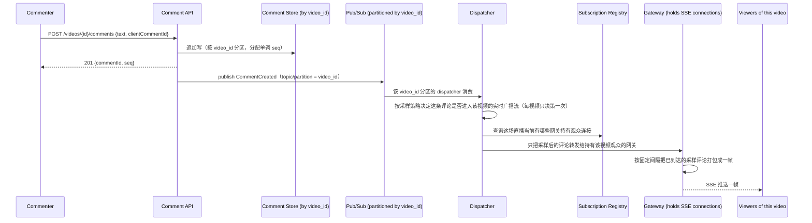

# 设计题解：直播评论广播（Live Comments）

## 题目与范围

面试官通常这样开场："设计一个直播评论系统：观众在观看直播视频时可以发评论，所有正在
观看同一场直播的观众都要实时看到新评论，一场直播可能同时有几百万到上千万观众在线。"
这句话背后真正的难点不是"发一条评论"，而是**一条评论从一个观众的浏览器写入，要在极短
时间内被推送给同一场直播下成千上万（极端情况下上千万）个完全不同的服务器连接持有的
观众，而且观众数和评论数都在同一场直播内实时剧烈波动**。

值得当场问清楚的澄清问题，以及它们各自改变的设计决策：

- **要支持多大的单场直播峰值观众数？** 决定要不要为"超大型直播"（mega-stream）设计
  专门的降级路径（见「深入探讨」第 3 节）——如果单场直播峰值只有几千观众，直接全量广播
  完全够用，不需要采样。
- **评论要不要严格全局有序，还是同一时刻的评论谁先到无所谓？** 决定用单分区强序还是
  多分区弱序（见「深入探讨」第 4 节）。
- **迟到观众（直播开始后才进入）要不要看到之前的评论？看多少？** 决定要不要做历史
  追赶（catch-up）以及追赶多深（见「深入探讨」第 5 节）。
- **评论要不要审核（敏感词、垃圾信息）？延迟多少可以接受？** 本题假设有一层同步的轻量
  审核（正则/词表），不涉及人工审核队列，人工复审是完全独立的一道题，不在范围内。
- **观众能不能看到自己发的评论立刻显示，即使还没被广播管道处理？** 决定客户端要不要做
  乐观本地渲染（见「常见错误」）。

**范围内**：评论的写入与持久化、按视频的实时广播（fan-out）、传输协议选择、千万级观众
场景下的广播降级、评论顺序保证、迟到观众的追赶。连接管理的通用机制（心跳、重连、连接
注册表路由）与 [[solution-chat-messaging]] 共享，这里不重复展开，只讲直播评论场景
特有的差异。**范围外**：视频流本身的编码/分发（CDN/RTMP，见 CDN 相关设计）、人工内容
审核队列、评论点赞/回复线程（属于「Forum & Threaded Comments」）、主播与观众之间的私信。

## 需求

**功能需求（驱动设计的 3–5 条）**

1. 观众可以对正在观看的直播视频发表评论，评论按视频关联。
2. 正在观看同一场直播的所有观众，都能在有限延迟内看到新评论，不需要手动刷新。
3. 观众中途加入直播时，能看到最近一段时间的评论作为上下文，而不是从一片空白开始。
4. 单场直播的观众数可以从几十到上千万剧烈波动，系统对任意一场直播的行为不能依赖"提前
   知道这场会火"。
5. 同一视频下的评论在合理范围内保持一个所有观众大体一致的顺序（不要求严格全局线性化）。

**非功能需求（数字化）**

- **广播延迟**：评论从发出到出现在其他在线观众屏幕上，目标 P99 < 2 秒——这是"实时"这个
  产品承诺的底线，超过这个量级用户会明显感觉到"卡"。
- **可用性**：读路径（接收广播）目标 99.9%——直播评论是增值体验而不是核心交易，短暂降级
  （比如切换成较低频率的轮询）比整体不可用更可接受。
- **一致性**：最终一致，且允许**不保证每个观众看到完全相同的一组评论**（见「深入探讨」
  第 3 节的采样/限速）——这是本设计一个明确的、需要在开场就和面试官说清楚的取舍。
- **弹性**：单场直播的观众数和评论速率都可能在几秒内暴涨两个数量级（一个热门时刻被
  转发），系统不能假设容量是提前预热的。

## 容量估算

**基础假设**：一场超大型直播事件峰值并发观众 1,000 万（本设计的假设，用于压力测试
架构，不是某平台真实数据）；观众里约 0.1% 的人在任意一分钟内会发一条评论（这是一个
偏保守的互动率假设，用于估算评论产生速率，而不是广播速率）。

```
comments/min = 10,000,000 × 0.001 = 10,000
comments/sec(avg) ≈ 10,000 / 60 ≈ 166.7
```

**这个数字本身不吓人**，每秒 167 条评论的写入量，任何持久化存储都轻松应付。**真正吓人
的是广播侧的放大**：每一条评论理论上要发给这 1,000 万观众中的每一个：

```
理论上的广播事件/秒 = 166.7 × 10,000,000 ≈ 1.67×10^9
```

**这是第一个、也是决定整个架构的数字**：16.7 亿次/秒的推送事件，不存在任何单一系统
能够以这个速率把消息写进网络连接——这个数字直接证明"每条评论都推给每个观众"这个朴素
方案在千万观众规模下不成立，逼出「深入探讨」第 3 节的采样/限速广播。

**连接容量**：假设单台网关（gateway）机器能稳定维持 5 万个长连接（本设计对 SSE/
WebSocket 连接密度的保守假设）：

```
需要的网关数量 = 10,000,000 / 50,000 = 200 台
```

**这是第二个决定架构的数字**：200 台网关不算多，水平扩展本身不是难点；难点是**这
200 台网关中的每一台，如果不加限制地把全量评论转发给自己持有的全部连接，单机推送速率
会是**：

```
单网关未限速推送速率 = 166.7 comments/sec × 50,000 conns ≈ 833 万次/秒
```

这个单机 833 万次/秒的数字远超任何一台机器能承受的推送吞吐（无论是 CPU 序列化开销还是
网卡出口带宽）——这再次印证了不能按评论到达就逐条推送。

**但真正绑死设计的不是网关吞吐，是人的阅读速度**：即使网关硬件足够强，把每一条评论都
实时推给一千万观众也没有产品意义——一个人同一时间能跟上的评论速度大约是每秒 3–5 条
（本设计假设 4 条/秒作为单个观众的目标送达速率），这个数字和网关一秒能执行多少次系统
调用完全无关，是"这个功能能不能用"的下限，必须先定下来，再去谈怎么把负载压到这个目标
以内。

达到这个目标的机制是**按固定间隔打包成帧（frame），而不是每条评论单独推一次**：每个
连接每隔一个固定间隔（本设计取 1 秒）收到一帧，帧里装着这段时间内为它采样出的评论。
网关侧的负载因此变成：

```
frames/sec/网关 = connections / interval = 50,000 / 1 = 50,000
```

这是网关的**持续负载**，关键在于它只取决于连接数和推送间隔这两个可控参数，和评论产生
速率无关——评论从 167 条/秒涨到 1,670 条/秒，这个 50,000 次/秒的帧发送频率不会变，
变的只是每一帧里塞进去的评论条数。这 50,000 次/秒是一个数量级远小于"833 万次/秒"的
持续负载，网关侧完全可以承受。

**存储与带宽**：假设全平台（不止一场直播）峰值总评论写入 5,000 条/秒，每条评论约
150 字节：

```
写入带宽 = 5,000 × 150 = 750,000 B/s = 0.75 MB/s
每天 = 0.75 MB/s × 86,400 ≈ 64.8 GB/天
```

**结论**：评论本身的写入和存储代价小到可以忽略（一天不到 65 GB），这道题的容量估算
最该讲清楚的不是"存多少"，而是**单条评论到大规模观众的广播放大系数**——从原始评论速率
到理论广播速率放大了 1000 万倍（等于并发观众数），这个放大系数是"不能逐条推送"的证据；
但真正决定"该怎么推"的是人的阅读速度这个和硬件无关的上限，把负载压到这个上限以内靠的
是「深入探讨」第 3 节的按帧批量推送 + 采样，而不是单纯扩容网关。

## 核心实体与 API

**实体**

- **LiveVideo**：`id, broadcasterId, status(live/ended), startedAt`——直播会话本身，
  评论的分区键。
- **Comment**：`id, videoId, authorId, text, seq(单视频内单调递增序号), createdAt`——
  `seq` 是同一视频内的相对顺序号，不是全局唯一 id 的替代品，专门用于广播和追赶时判断
  "我看到哪里了"（见「深入探讨」第 4、5 节）。
- **ViewerSession**：`connectionId, videoId, gatewayId, connectedAt`——一次观看会话到
  某台网关的绑定，是路由广播消息的依据，和 [[solution-chat-messaging]] 里的连接注册表
  是同一机制的复用。

**API**

```
POST /videos/{videoId}/comments      {text, clientCommentId}
                                      按 clientCommentId 幂等 → {commentId, seq}
GET  /videos/{videoId}/comments/recent?limit=50
                                      迟到观众拉取最近 N 条评论作为初始上下文
                                      （不是完整历史，见「深入探讨」第 5 节）
SSE  /videos/{videoId}/comments/stream
                                      观众建立的实时流连接，服务端持续推送新评论
                                      （或采样后的子集，见「深入探讨」第 3 节）
```

**故意不做的**：不支持观众在实时流里主动"拉取"某一段区间的历史评论（历史浏览是完全
不同的读模式，走独立的分页 API，不复用实时流连接）；不在广播层做逐观众的个性化过滤
（比如"只看关注的人的评论"），个性化过滤会破坏"同一视频的所有观众共享同一份广播管道"
这个让广播可以被批量优化的前提，如果要支持，应该在客户端渲染层做，而不是服务端广播层；
不保证观众断线重连后能拿到断线期间错过的**每一条**评论（只保证能拿到"最近 N 条"，见
「深入探讨」第 5 节），因为在千万观众规模下逐观众维护"未读位点"的存储和查询代价过高。

## 高层设计



**写路径**：`POST /videos/{videoId}/comments` 按 `clientCommentId` 幂等，追加写入
Comment Store（技术选型是**按 `video_id` 分区的宽列/日志存储**，因为写入模式是单视频
内的顺序追加，读取模式也天然按视频聚合），并分配一个视频内单调递增的 `seq`。写确认后
立刻返回，不等待广播完成——发帖确认和 fan-out 解耦的原则和 news feed、通知系统是同一
个，见 [[async.queues|Message Queues]]。

**Pub/Sub 层**：技术选型是**按 `video_id` 分区的发布订阅系统（Kafka 一类）**，而不是
一个全局广播总线——分区键选 `video_id` 而不是随机或按评论 id，是因为下游的 Dispatcher
和 Gateway 都需要"这场直播的所有评论"这个聚合视图，按 video 分区让同一场直播的评论
天然落在同一个逻辑分区上，保序也更容易（见「深入探讨」第 4 节）。

**Dispatcher 层**：Dispatcher 消费某个 video 分区的评论后，先按采样策略（见「深入探讨」
第 3 节）决定这条评论要不要进入这场直播的实时广播流——这个决策**对每场直播只做一次**，
发生在 Dispatcher 这一层，而不是让每台网关各自独立抽样，这保证了同一场直播的所有观众
看到的是同一份采样结果，而不是因为连到不同网关而看到不同的评论子集。被采样命中的评论
才会继续查询 Subscription Registry（一个记录"这场直播的观众连接分布在哪些网关上"的
注册表，技术选型是**内存数据结构存储 Redis 一类**），只转发给真正持有该视频观众连接的
网关——这是「深入探讨」第 2 节要展开的核心机制：**只把消息发给真正持有该视频观众连接
的网关**，而且从这一步开始，昂贵的扇出（fan-out）只需要承载采样后的评论，不是全量评论。

**Gateway 层**：网关收到 Dispatcher 转发的（已经采样过的）评论后，并不逐条立刻推送，而
是按固定间隔把这段时间内到达的评论打包成一帧（frame），整帧推给每个连接（见「深入探讨」
第 3 节）——这把网关的推送负载从"和评论到达速率成正比"变成"只和连接数、推送间隔这两个
可控参数成正比，和评论产生速率无关"。技术选型不变，仍是**有状态、按连接数水平扩展的
应用服务器**，每台网关的连接是一份不可共享的本地状态，这也是它和无状态的 Comment API
在部署与扩容策略上的本质区别。

## 深入探讨

### 传输协议选择：为什么是 SSE 而不是 WebSocket 或长轮询

**问题**：直播评论场景下，服务器到客户端（评论推送）的流量远大于客户端到服务器（观众
发评论——多数观众只看不发）的流量，这是一个高度不对称的方向性场景，和聊天应用里"双方
都频繁互发消息"的对称场景不同。

**方案一：长轮询（long polling）**。兼容性最好，但每次评论到达都会让当前这一批挂起的
请求同时完成、所有客户端立即重新发起下一次轮询——在几百万并发观众的规模下，这种"同步
请求波"本身就是一次自我制造的惊群，参见 [[networking-long-polling-costs|长轮询成本]]。

**方案二：WebSocket**。真正双向，但直播评论场景里观众到服务器方向的流量很稀疏（只有
主动发评论时才用到），为了这一点点用量维持一个全双工协议，换来的是连接注册表路由、
部署时连接迁移等 WebSocket 舰队特有的运维复杂度（见
[[networking-websocket-scaling-cost|WebSocket 扩展成本]]），性价比不高。

**方案三（本设计采用）：SSE 承担广播方向，评论提交走独立的普通 HTTP POST**。SSE 只需要
服务器到客户端一个方向，天然匹配"广播评论"这个需求；浏览器内建自动重连和 `Last-Event-
ID` 续传（见 [[networking-sse-mechanics|SSE 机制]]），断线后能从服务端明确知道客户端
上次收到到哪条；且 SSE 走普通 HTTP，能直接利用现有的反向代理和负载均衡基础设施，不需要
为 WebSocket 单独适配连接升级和亲和性路由。观众发评论这个低频、单向的动作完全不需要占用
广播通道，独立走一次普通的 `POST /comments` 更简单。

### 从一次写入到百万连接：按视频分区的 pub/sub 与 dispatcher 层

**问题**：一条评论写入后，怎么找到"正在看这场直播的所有观众"，而这些观众的连接分散在
可能几百台网关机器上，且这个分布本身随时间剧烈变化（观众不断加入和离开）？

**方案一：评论写入后直接广播给集群里全部网关，由每台网关自己判断要不要转发给自己的
连接**。实现简单，但集群里绝大多数网关此刻可能根本没有这场直播的任何观众（一个平台
同时有成千上万场直播在进行），给它们广播这条评论纯属浪费——网关数量越多，这种浪费
越严重，是一种和网关总数成正比的无谓开销。

**方案二（本设计采用）：Subscription Registry + 按需转发的 Dispatcher**。每台网关在
观众建立连接时，向 Subscription Registry 注册"我持有这场直播 video_id 的 N 个连接"；
Dispatcher 消费到某个 video 分区的评论后，先查询这场直播当前活跃在哪些网关上（通常是
几台到几十台，远小于集群总网关数），只把消息转发给这些网关。这把"广播成本"从"和集群
总网关数成正比"降低到"和这场直播实际覆盖的网关数成正比"——对于一场只有几千观众、只
覆盖两三台网关的普通直播，转发成本几乎可以忽略；对于覆盖全部 200 台网关的超大型直播，
退化到和方案一相近，但那正是流量确实需要触达的地方，不是浪费。

**协同定位（co-location）优化**：进一步地，把同一场热门直播的观众在接入层尽量路由到
同一小撮网关上（而不是均匀打散到全部网关），可以让 Dispatcher 需要转发到的网关数量
进一步收窄，代价是这一小撮网关的连接密度会高于集群平均水平，需要和「容量估算」里的
单机连接上限一起权衡——协同定位在"减少转发扇出"和"避免单机连接过载"之间是有张力的，
不能无限收窄到一台网关。

### 千万观众的直播：不是每条评论都能广播

**问题**：容量估算已经给出了两层理由——理论广播事件数达到每秒 16.7 亿次，证明不能
逐条转发；但即使假设硬件可以无限扩容把这 16.7 亿次/秒扛下来，把评论产生的每一条都
实时推给一千万观众**在产品层面也没有意义**：一个人同一时间能跟上的评论速度大约是每秒
3–5 条，超过这个速度只是屏幕上飞快滚动的文字，没有人能真正"看"到。所以约束不是"网关
扛不扛得住"，而是"人跟不跟得上"，这个上限不会因为加更多网关、用更快的网卡而改变。

**方案一：完全不做任何限制，指望硬件扩容跟上**。即使硬件真能扛住每秒 16.7 亿次推送，
观众也无法阅读这个速度的信息流——扩容解决的是一个不存在产品价值的问题。

**方案二：给单个观众设置客户端拉取频率上限（节流客户端）**。这只是把"人读不过来"这个
症状挪到了客户端，服务端仍然要产生、序列化、发送这些从未被读到的推送，没有降低服务端
的真实负载。

**方案三（本设计采用）：以观众的阅读速度为目标反推采样比例，并把多条评论打包成帧
（frame）批量推送**。目标不是"网关能扛多少"，而是"每个观众每秒应该收到多少条"——本设计
取 4 条/秒（3–5 条/秒假设区间的中值）作为单个观众的目标送达速率，独立于评论产生速率
或观众规模：

```
目标送达速率(单观众) = 4 条/秒
评论产生速率(容量估算里的 166.7 条/秒)
采样比例 = 目标送达速率 / 评论产生速率 = 4 / 166.7 ≈ 0.024 ≈ 1/42
```

也就是说，峰值时刻广播管道大约每 42 条评论挑 1 条进入实时流，量级是"十几分之一到
几十分之一"，不是"千分之一"——采样比例由"评论产生得有多快"和"人能读多快"这两个数字
的比值决定，和网关的硬件吞吐无关。如果评论速率涨到 10 倍（比如同时更多观众参与讨论，
产生 1,666.7 条/秒），阅读速度上限不变，采样比例相应收紧：

```
采样比例(10x 评论速率) = 4 / 1,666.7 ≈ 0.0024 ≈ 1/417
```

采样命中的评论按「容量估算」里算出的固定间隔（1 秒）打包成帧，每帧平均装 `4 条/秒 ×
1 秒 = 4` 条评论，推给每个连接——这样网关的推送次数（帧/秒）只取决于连接数和推送间隔，
和评论产生速率、采样比例都无关，帧里装几条评论只影响帧的字节大小，不影响推送次数。
未被采样进入实时流的评论仍然写入 Comment Store（不丢弃底层数据），可以在"查看全部
评论"这类非实时视图里看到，只是不会出现在这一轮实时广播里——这是一个需要在需求阶段
就和产品经理/面试官说清楚的产品取舍：超大型直播下，"实时看到的评论"本身就是全部评论
按阅读速度采样出的一个子集，不是完整视图。

**采样发生在哪一层、怎么选**：采样决策在 Dispatcher 层针对每个视频只做一次（见「高层
设计」），而不是每台网关各自独立抽样——这保证了同一场直播的所有观众看到的是同一份
采样结果，不会因为连接到不同网关而看到不同的评论子集；从这一步之后，Dispatcher 到
网关、网关到连接这两跳扇出承载的都只是采样后的评论，不是全量评论，进一步降低了下游的
实际负载。具体挑哪些评论，本设计默认按**均匀随机**采样（实现简单、不引入偏见），但
允许按业务需要换成**加权采样**——优先保留来自好友、已验证账号或近期获得较多点赞/回复
的评论，让实时流里出现的内容更"值得看"而不是纯随机；无论用哪种采样策略，**发帖人自己
提交的评论永远在客户端本地乐观渲染，不依赖是否被采样命中**（见「题目与范围」的澄清
问题和「常见错误」），这样采样只影响"看别人发了什么"，不会让用户觉得自己发的评论
"消失了"。

### 顺序保证：单视频内的评论顺序，而不是全局线性化

**问题**：不同观众通过不同网关、经过不同的网络路径接收同一场直播的评论，如果完全不
保证顺序，同一时刻发的两条评论可能在不同观众屏幕上以相反顺序出现，体验上会显得"很乱"，
但要求跨观众的严格全局线性化（所有人在完全相同的瞬间看到完全相同的顺序）又是一个远
超这道题需要的强一致性目标。

**方案一：不做任何排序保证，谁先到就先显示**。实现最简单，但同一场直播里几乎同时发出
的两条评论会在不同观众端呈现不同顺序，且这种乱序没有任何规律可循，用户能感知到明显的
不一致。

**方案二（本设计采用）：单视频内单调递增的 `seq`，客户端按 `seq` 重排显示，不追求
跨观众的绝对同步**。`Comment` 写入时由 Comment Store（因为按 `video_id` 分区，单分区
内可以廉价地维护一个单调计数器）分配一个该视频内单调递增的 `seq`；Pub/Sub 按
`video_id` 分区也保证了同一视频的评论在分区内部按写入顺序被消费和转发（分区内有序，
是消息队列的基本保证）。客户端收到评论后按 `seq` 做一个短窗口（比如 1–2 秒）的显示
缓冲和重排，吸收网络路径导致的到达顺序抖动。这不保证两个不同观众在同一物理时刻看到
的屏幕内容完全相同（网络延迟本身就有差异），但保证每个观众自己看到的评论顺序是内部
自洽、单调的，这对用户体验来说已经足够。

### 迟到观众的追赶：只补最近 N 条，不补完整历史

**问题**：一个观众在直播开始 20 分钟后才进入，如果按峰值评论速率（每秒 167 条）反推，
20 分钟内已经产生了约 20 万条评论。让新观众一次性拉取这 20 万条历史评论既没有意义
（没人会读完），也会在这个观众加入的瞬间对 Comment Store 造成一次没有必要的大查询。

**方案一：不做任何历史追赶，新观众只能看到自己进入之后的评论**。实现最简单，但会让
新观众有"这场直播好像没人在聊"的错误印象，尤其是在评论其实很活跃的时候。

**方案二（本设计采用）：`GET /videos/{id}/comments/recent?limit=50` 拉取最近固定
数量（比如 50 条）作为初始上下文，之后转为 SSE 实时流**。这把"追赶"从"补全断档期间
的所有内容"简化成"给一个有代表性的最近样本"，查询代价是对 Comment Store 按 `video_id`
分区、按 `seq` 倒序取常数条，不随直播已经进行了多久而增长。对于短暂断线重连的场景，
同样的机制复用：客户端记住自己最后收到的 `seq`，重连后用同一个 `recent` 接口（或按
`seq` 区间查询，如果断线时间很短）补齐，而不是尝试维护一份"每个观众到底看到哪里了"的
全局精确进度表——在千万观众规模下，逐观众维护精确已读位点的存储和一致性代价，远超过
"偶尔让断线观众错过几条评论"这个产品上完全可以接受的代价。

## 瓶颈、故障与演进

**热点与倾斜**：几乎所有热点都集中在单场爆款直播上——一场直播占用的网关、Dispatcher
转发量、Comment Store 单分区写入量，可能是平台上其他所有直播总和的几十倍。这是一种
**极端的单 key 倾斜**（`video_id` 这一个分区键上的热点），和 news feed 设计里名人帖子
的热点是同一类问题，但这里更极端：一场直播就是一个分区，没有"分散到多个 key"这个退路，
只能靠「深入探讨」第 3 节的采样和协同定位（co-location）来控制单点负载的绝对值，而
不是试图把负载打散到别的 key 上。

**故障域**：

- **某台网关宕机**：这台网关持有的连接全部断开，客户端按 SSE 的自动重连机制重连到
  其他网关，重连后走「深入探讨」第 5 节的追赶路径补上刚才可能错过的评论；不影响其他
  网关上的观众。
- **Dispatcher 不可用**：新评论无法被转发到网关，广播暂停，但 Comment API 的写入路径
  不受影响（写入和广播已经用 pub/sub 解耦），评论仍然被持久化，Dispatcher 恢复后可以
  从上次消费位点继续（如果 pub/sub 保留了积压）；用户体感是"评论区突然安静了几秒"，
  而不是丢数据。
- **Subscription Registry 不可用**：Dispatcher 无法判断该把消息转发给哪些网关，退化
  为广播给全部网关（这时候方案二退化回方案一），短期内可以接受，因为这是一个不常见的
  故障窗口，不是稳态。
- **Comment Store 某分区不可用**：该场直播既不能发表新评论，也无法追赶历史，是唯一
  真正的"这一场直播不可用"故障域；其他直播的分区不受影响，因为分区之间物理隔离。

**10 倍演进**：单场直播峰值观众从 1,000 万到 1 亿。网关数量从 200 台涨到 2,000 台，
每台网关的帧发送频率仍然是 `连接数 / 推送间隔 = 50,000 / 1 = 50,000` 次/秒不变——这个
数字只取决于单台网关的连接数和推送间隔，水平扩展网关本身没有架构瓶颈。真正变化的是
采样比例：如果评论产生速率按同样的互动率假设也跟着观众数涨到 10 倍（166.7 条/秒 →
1,666.7 条/秒），而单观众的阅读速度上限不变（仍是 4 条/秒），采样比例就要从约 1/42
收紧到约 1/417（同样用「深入探讨」第 3 节的公式：`4 / 1,666.7 ≈ 1/417`）——收紧的原因
是"更多人在讨论，产生更多评论，但每个人能读的速度没有变"，不是网关推送能力跟不上。
这时候"实时看到的评论只是全部评论的一个采样子集，而且这个子集比例会越变越小"这个产品
取舍会变得更明显，可能需要在客户端 UI 上显式提示"评论过多，仅展示部分"，而不是让用户
误以为自己看到了全部。

**100 倍演进**：单场直播峰值观众 10 亿（纯粹推演，超过任何真实直播平台的规模，用于
压力测试架构）。单一 Dispatcher 消费单个 video 分区会成为瓶颈，需要把一场超大型直播
的观众进一步做二级分片（比如按接入地域再分成多个子分区，每个子分区各自维护一份采样
后的评论子流），牺牲"全体观众看到完全相同采样子集"这个较弱的一致性保证，换取 Dispatcher
和网关层可以继续水平扩展。

## 面试官会追问什么

**中级（mid）**
- "为什么不直接用 WebSocket，反正以后可能要加评论以外的双向功能？" 见深入探讨第 1
  节——当前场景观众到服务器方向的流量稀疏到不值得为它引入 WebSocket 舰队的运维复杂度；
  如果未来确实需要双向高频交互（比如实时弹幕互动游戏），那是需求变化，应该重新评估，
  不该为"可能用得上"预先支付复杂度成本。
- "迟到观众为什么不干脆把断档期间的全部评论都发给他？" 见深入探讨第 5 节——20 分钟
  断档可能对应 20 万条评论，既没有阅读意义，也会对存储层造成不必要的大查询。

**高级（senior）**
- "既然采样决策在 Dispatcher 层对每场直播只做一次，会不会导致高价值的评论（比如来自
  验证账号或已经获得很多点赞的）被随机丢弃，观众抱怨'我怎么什么都没看到'？" 均匀随机
  采样确实不区分评论质量，一个可能的改进方向是把固定比例的随机采样换成加权采样——优先
  保留来自好友、已验证账号或短窗口内已获得较多点赞/回复的评论，代价是需要在广播前维护
  一个短窗口的热度打分，比纯随机采样多一次排序开销；无论哪种采样策略，因为决策只在
  Dispatcher 做一次，同一场直播的所有观众看到的始终是同一份结果，不存在"连到不同网关
  看到不同内容"这个问题。
- "Dispatcher 怎么知道该把消息转发给哪些网关，这个注册表本身会不会成为瓶颈？" 见深入
  探讨第 2 节——Subscription Registry 只在观众连接/断开时写入，读取（Dispatcher 查询）
  按 `video_id` 做的是一次性聚合查询，读写比在合理范围内；真正的风险是它变成单点故障
  （见「瓶颈、故障与演进」的降级路径）。

**参谋级（staff）**
- "如果要支持'只看某个语言的评论'这种按观众分组的过滤广播，架构要怎么变？" 这会打破
  "同一视频的所有观众共享同一份广播管道"这个让批量转发和采样都成立的前提，需要在
  Dispatcher 或网关层引入按分组的多路广播（每个语言分组各自一份采样后的子流），转发和
  采样的计算成本会随分组数线性增长，需要重新评估「容量估算」里的放大系数。
- "如果主播想要'置顶'某条评论，让它绕过采样保证触达全部观众，怎么在不破坏现有采样机制
  的前提下支持？" 置顶评论走一条独立的、不受采样影响的高优先级广播路径（类比通知系统
  设计里事务性通知和营销通知的物理隔离车道），普通评论流的采样逻辑完全不变。

## 常见错误

- 把这道题当成聊天系统的翻版，重新设计一遍连接管理和消息路由，没有意识到题眼是"一写
  多读的极端扇出"，和聊天里"多写多读但每个会话规模很小"的负载模式完全不同。
- 只讨论"用 WebSocket 还是 SSE"，没有算清楚千万观众规模下的广播放大系数，被追问
  "1,000 万观众、每秒 167 条评论，单机要转发多少次"答不上来。
- 假设可以给每个观众维护一份精确的"已读到哪条"状态来做完美的断线续传，没有意识到
  这个状态表在千万并发规模下本身就是一个新的存储和一致性问题，产品上完全没必要追求
  "一条不漏"。
- 把限速/采样理解成"丢弃数据"，没有说清楚采样只影响实时广播这一份视图，底层 Comment
  Store 仍然保留全部评论，历史查看和审计不受影响。
- 忽略同一视频内的顺序问题，假设"消息队列自然有序"就足够，没有说明这个"有序"是分区
  内有序、需要按 `video_id` 分区键才成立，如果分区键选错（比如按评论 id 哈希），同一
  视频的评论会散落到不同分区，顺序保证直接失效。

## 五分钟讲法

This is a live-comments system where the core difficulty is an extreme write-to-broadcast
amplification: at a peak of ten million concurrent viewers on one video and roughly a
hundred and sixty-seven comments a second, naively pushing every comment to every viewer
works out to about one point six billion delivery events a second, which no realistic
fleet can sustain — that single number is why this design cannot just be a bigger chat
system. I use SSE rather than WebSockets because the traffic is overwhelmingly one
direction, server to viewer, and SSE's built-in reconnect with a last-seen event id gives
me resumption for free over plain HTTP. Comments are partitioned by video id through the
pub/sub layer, and a dispatcher forwards each comment only to the handful of gateways that
actually hold connections for that video's viewers, tracked in a subscription registry, so
fan-out cost scales with how many gateways a given stream actually touches rather than
with total fleet size. The binding constraint on how fast to push, though, isn't gateway
throughput — it's how fast a person can read, roughly three to five comments a second, so
I anchor the per-viewer delivery target there (I use four a second) and derive the sampling
ratio as that target divided by the posted comment rate: at 166.7 comments/sec that's
about one in forty-two, not one in a thousand, and it tightens to about one in four hundred
if the comment rate itself grows tenfold. Sampling happens once per video upstream in the
dispatcher, so every viewer of that stream sees the same sampled comments, and gateways
batch whatever was sampled into one frame per connection per second rather than pushing
each comment individually — that makes a gateway's send rate a function of connection
count and batching interval, not comment volume, while the underlying comment log still
stores everything, sampled or not, for later viewing, and a poster always sees their own
comment rendered locally regardless of whether it was sampled into the broadcast. Ordering is scoped to a single video's
monotonic sequence number rather than any global linearizability, relying on partition-
level ordering in the pub/sub layer, and a late-joining viewer gets the last fifty
comments as context rather than a full replay of a twenty-minute, two-hundred-thousand-
comment backlog. The failure story mirrors that: losing a gateway just drops its
connections for a reconnect-and-catch-up, losing the dispatcher pauses broadcast without
losing writes, and losing the subscription registry degrades to broadcasting to every
gateway rather than failing outright.

## 来源与延伸

- [Live Commenting: Behind the Scenes (Meta Engineering)](https://engineering.fb.com/2011/02/07/core-infra/live-commenting-behind-the-scenes/) —
  Facebook（Meta）工程博客，讲真实生产系统当时的规模（每分钟超过 1 亿条内容可能收到
  评论、约 65 万条评论/分钟需要路由）和"write locally, read globally"的架构取舍：不
  做传统的跨数据中心复制，而是每个数据中心只处理本地写入，评论提交时再实时从各数据中心
  拉取观众信息、合并后推送。本文没有采用这个跨数据中心聚合模型（假设单区域部署），但
  借用了它"写入和广播分离、广播时才做聚合"的思路来设计 Dispatcher 层；这篇文章没有
  披露具体的 pub/sub 技术选型和延迟数字，属于本文没有验证的部分。
- [Scaling Live Video Streaming for Millions of Viewers (Meta Engineering)](https://engineering.fb.com/2020/10/22/video-engineering/live-streaming/) —
  Meta 工程博客，披露 2020 年欧冠决赛巴西/拉美赛区直播峰值并发观众达 720 万，以及用
  request coalescing 和 cache sharding 缓解"惊群"（thundering herd）问题、将里约热
  内卢的本地互联带宽从 20 Gbps 扩容到 120 Gbps 的真实案例。这篇讲的是视频流本身的分发
  （不涉及评论），本文引用它是为了用一个有源可查的真实并发观众数量级（720 万）校验
  「容量估算」里 1,000 万这个假设峰值处在同一数量级，而不是凭空拍出来的。
- [Twitch Engineering: An Introduction and Overview (Twitch Blog)](https://blog.twitch.tv/en/2015/12/18/twitch-engineering-an-introduction-and-overview-a23917b71a25/) —
  Twitch 工程博客，介绍其聊天系统 Edge（同时支持原始 TCP 上的 IRC 协议和 WebSocket）+
  Pubsub（在 Edge 节点间分发消息）的分层扇出架构，公开数据显示其聊天服务每天投递超过
  100 亿条消息。和本设计的差异：Twitch 聊天允许观众间高频互相可见的双向互动（更接近
  聊天室），本设计的直播评论场景观众到服务器方向流量稀疏得多，因此本文选择 SSE 而不是
  Twitch 这种保留双向协议支持的架构。
- [Live comment system design (systemdesign.one)](https://systemdesign.one/live-comment-system-design/) —
  商业刷题站对这道题的完整 walkthrough，包含网关连接数、dispatcher 吞吐等具体数字，
  仅作为架构思路参照，未采用其数字（这些数字来自单一二手来源，未经一手验证，本文的
  容量估算改用自己给出并标注为假设的连接密度和推送速率上限重新推导）。
- [Design Facebook's Live Comments System (Hello Interview)](https://www.hellointerview.com/learn/system-design/problem-breakdowns/fb-live-comments) —
  商业刷题站的付费题解，免费部分给出的需求和高层方案与本文一致（SSE、游标分页），
  仅作为思路参照，未引用付费部分的具体内容。
