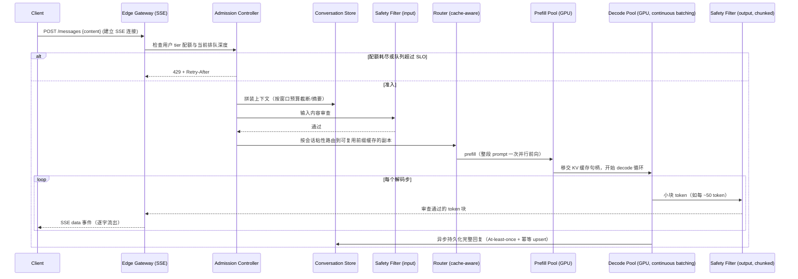

# 设计题解：LLM 对话服务（LLM Chat Service，ChatGPT 一类）

## 题目与范围

面试官通常这样开场："设计一个类似 ChatGPT 的对话产品：用户发一句话，模型逐字生成回复，
支持多轮对话、免费和付费两种额度。" 这道题表面看像一个普通的"发消息—收回复"应用，但它
和本书其他"存数据、算排序"的题不同——**它唯一的、真正稀缺的资源是 GPU 显存里的 KV 缓存
（KV cache），而不是磁盘字节数或网络带宽**，整道题的容量估算、路由策略、配额设计都要
围绕这一件事展开。

值得当场问清楚的澄清问题，以及它们各自改变的设计决策：

- **服务自己的模型还是转发到第三方模型 API？** 本题按"自己运营 GPU 推理集群"设计，因为
  这是题目要考察的核心难点——GPU 批处理、显存容量、成本核算；如果是纯转发第三方 API，
  这道题会退化成一个普通的网关+限流设计。
- **要不要支持工具调用（tool use）、检索增强（RAG）？** 不做——这属于 [[ai.rag|RAG
  Pipelines]] 的范围，本题假设对话是纯文本生成，模型本身不检索外部知识。
- **要不要支持多模态（图片/语音）输入输出？** 不做，范围限定在文本 token 流。
- **上下文窗口多大、要不要做长期记忆（跨会话记住用户偏好）？** 决定「深入探讨」第 4 节
  上下文预算管理的复杂度；本题假设不做跨会话长期记忆，只处理单个会话内的上下文。
- **免费用户和付费用户要不要用同一个模型？** 决定「深入探讨」第 5 节配额与公平性的设计；
  本题假设两者共享同一个模型和同一个 GPU 池，通过容量隔离而不是模型降级来区分服务质量。

**范围内**：token 流式传输（SSE）与断线语义、GPU 推理服务层（连续批处理、KV 缓存容量、
前缀缓存、prefill/decode 分离）、会话状态与上下文窗口管理、准入控制与按用户/按档位配额、
每请求成本、请求路径中的安全过滤、多区域 GPU 容量规划。**范围外**：模型训练/微调、RAG、
工具调用、多模态、计费账单系统本身（只讨论成本核算，不讨论发票和支付）。

## 需求

**功能需求（驱动设计的 3–5 条）**

1. 用户发送一条消息后，回复以 token 流的形式逐字返回，而不是等生成完毕后一次性返回。
2. 用户可以进行多轮对话，后续消息要能看到之前轮次的上下文。
3. 免费用户和付费用户使用同一套模型，但享受不同的速率配额和排队优先级。
4. 生成内容在返回给用户前经过安全过滤，违规内容不应该完整流出。
5. 用户断网重连后，能看到断线前已经生成的内容，而不是从头重新生成。

**非功能需求（数字化）**

- **首字延迟（TTFT, time-to-first-token）**：P99 < 2 秒——这是用户对"是否卡住了"的
  第一直觉判断点。
- **逐字延迟（inter-token latency）**：P99 < 100ms/token——低于这个值，流式输出在人眼
  看来接近连续文本，是"打字机效果"体感流畅的经验阈值。
- **可用性**：对话服务整体 99.9%；但"GPU 容量不足"导致的排队/拒绝不算作故障，是设计
  内的正常降级路径（见「深入探讨」第 5 节）。
- **安全过滤覆盖率**：100% 的输出内容必须经过审查后才允许离开服务边界，这是产品合规
  红线，不接受"大部分情况下过滤"。
- **一致性**：会话历史在同一用户的多设备间最终一致，容忍几秒延迟；但用户自己发送的
  消息必须立刻出现在自己当前设备的界面上（读己所写）。

## 容量估算

**这道题的容量估算分两条完全不同的线：一条是普通的请求 QPS，另一条是 GPU 显存里的 KV
缓存字节数——后者才是真正卡脖子的资源，前者只决定要转发多少流量。**

**请求侧**：假设日活用户（DAU）2,000 万，人均每天发 6 条消息。

```
requests/day = 2×10^7 × 6 = 120,000,000
avg QPS = 120,000,000 / 86,400 ≈ 1,389
peak QPS(×4 日间峰值系数) ≈ 5,556
```

**GPU 显存侧——KV 缓存字节数**：以一个公开披露架构的 700 亿参数模型（Llama 3 70B，
80 层、64 个注意力头、8 个 KV 头即分组查询注意力/GQA、每头维度 128、FP16 权重）为本题
的模型形状假设。KV 缓存每个 token 要为每一层存一份 key 和一份 value，每份的维度是
「KV 头数 × 每头维度」：

```
每 token 每层 KV 字节数 = 2(K和V) × 8(KV头数) × 128(头维度) × 2(FP16字节数) = 4,096 B
每 token 全部 80 层 KV 字节数 = 4,096 × 80 = 327,680 B ≈ 320 KiB/token
```

**这是本题最关键的一个数字**：一条正在生成中的会话，如果当前上下文（系统提示+历史
消息+已生成部分）平均在 2,000 token，它的 KV 缓存占用是：

```
单会话 KV 缓存 = 320 KiB × 2,000 ≈ 655,360,000 B ≈ 0.655 GB
```

单个对话会话为了"记住"自己的上下文，要在 GPU 显存里长期占用超过半个 GB——这个量级
和"一个 HTTP 连接几乎不占内存"的直觉完全相反，是这道题和其他 Web 服务题最根本的区别。

**一个推理副本能同时带多少个会话**：假设一个推理副本是 4 张 80GB 的 GPU（如 H100），
FP16 权重占用：

```
权重字节数 = 700亿 × 2B = 140 GB
副本总显存 = 4 × 80 = 320 GB
刨去权重与预留给激活值/框架开销的 10%，可用于 KV 缓存的显存 ≈ (320-140) × 0.9 = 162 GB
单副本可并发会话数 ≈ 162 GB / 0.655 GB ≈ 247 个
```

**这就是「GPU 批处理只能靠堆卡」这种直觉的反例**：一个 4 卡副本，无论算力多强，同时
能服务的会话数被显存死死锁定在约 247 个——这是「深入探讨」第 2 节连续批处理与显存
容量规划的数字依据。

**整个集群的 GPU 数量**：假设每条回复平均输出 500 token，用户感知的解码速度约
40 token/秒（这是本设计的假设，反映批处理下每个用户"看到"的逐字速度，不是单个 GPU
的原始吞吐），单次生成耗时：

```
单次生成耗时 = 500 / 40 = 12.5 秒
```

用 Little's Law（到达率 × 服务时间 = 系统内平均驻留数）估算峰值时刻同时"在飞"的会话数：

```
峰值并发会话数 = 峰值 QPS × 单次生成耗时 = 5,556 × 12.5 ≈ 69,444
所需副本数 = 69,444 / 247 ≈ 281
所需 GPU 数（仅解码，不含余量） = 281 × 4 ≈ 1,124
加 30% 容量余量 ≈ 1,461 张 GPU
```

**这是第三个决定架构的数字**：2,000 万 DAU、平均一天 6 条消息，看起来是个"中型产品"的
流量规模，但换算到 GPU 上需要一千多张高端卡的稳态解码容量——GPU 是这道题里唯一一个
"钱能买到但买不到足够多、还要按区域现货排产"的资源，这个数字直接决定「深入探讨」第 7
节多区域容量规划为什么不能像无状态 Web 服务那样弹性伸缩。

**每请求成本**：以云端 H100 现货价 $2/GPU-小时为假设，4 卡副本 $8/小时；解码阶段显存
带宽受限，假设一个副本在满批下聚合吞吐 3,500 输出 token/秒，prefill 阶段计算受限、吞吐
高得多，假设 20,000 输入 token/秒：

```
每千输出token成本 = 8/(3,500×3,600) × 1,000 ≈ $0.000635
每千输入token成本 = 8/(20,000×3,600) × 1,000 ≈ $0.000111
单次请求成本(500输出+1,500输入, 无缓存) ≈ 500×0.000635/1000 + 1,500×0.000111/1000
                                        ≈ $0.000317 + $0.000167 = $0.000484
```

这是这套 GPU 集群的**边际成本下限**，不是产品定价——真实 API 报价里包含利润、非 GPU
运营成本和风险缓冲，这道题里只需要证明「知道成本主要由谁决定（输出 token 数，而不是
输入）」。命中前缀缓存后（见「深入探讨」第 3 节），如果 1,500 输入 token 里有 500 是
可复用的共享前缀：

```
命中缓存后输入token成本 = (1,500-500)×0.000111/1000 ≈ $0.000111
命中缓存后单次请求成本 ≈ $0.000317+$0.000111 = $0.000429
成本下降 ≈ (0.000484-0.000429)/0.000484 ≈ 11.5%
```

**结论**：容量估算里最该向面试官强调的对比是——请求 QPS 这条线只有几千，普通网关轻松
应付；真正决定这道题架构形状的是 GPU 显存里的 KV 缓存字节数和它锁死的并发会话上限，
以及由此推出的物理 GPU 数量，这条线才是整个设计的瓶颈来源。

## 核心实体与 API

**实体**

- **User**：`id, tier(free/plus/enterprise), quotaState`——`tier` 决定准入优先级和
  GPU 容量配额（见「深入探讨」第 5 节）。
- **Conversation**：`id, userId, createdAt, modelVersion`——一次多轮对话的容器。
- **Message**：`id, conversationId, role(user/assistant), content, tokenCount,
  createdAt, status(streaming/complete/aborted)`——source of truth，是权威数据；
  发给模型的 prompt 是从这里动态拼装出的派生视图，不是权威数据本身（见「深入探讨」
  第 4 节）。
- **GenerationJob**：`id, conversationId, requestId, assignedReplica, kvCacheHandle,
  status`——一次生成任务在 GPU 副本上的运行时状态，会话断线重连靠它，而不是靠 HTTP
  连接本身。

**API**

```
POST   /conversations                     → {conversationId}
POST   /conversations/{id}/messages
       {content, clientRequestId}
       响应：text/event-stream（SSE），按 clientRequestId 幂等——
       重复提交同一个 clientRequestId 不会产生第二次生成，而是返回同一个
       GenerationJob 当前的流（见「深入探讨」第 1 节）
GET    /conversations/{id}/messages/{msgId}/stream?lastEventId=
       断线重连：从服务端的生成缓冲区里补发 lastEventId 之后的 token，
       而不是重新发起生成
POST   /conversations/{id}/messages/{msgId}/cancel
       显式中止一次仍在生成中的回复——区别于"客户端断开连接"，只有这个
       调用才会真正释放 GPU 上的 KV 缓存（见「深入探讨」第 1 节）
GET    /conversations/{id}?cursor=&limit= → {messages[], nextCursor}
DELETE /conversations/{id}
```

**故意不做的**：不支持编辑历史消息后原地重新生成（走"新建消息"语义，避免历史版本
分支的复杂度）；不在 API 层暴露采样参数（温度、top-p）给普通用户调节，只对企业档位
开放；不支持跨会话的长期记忆读写。

## 高层设计



**写路径**（准入）：请求先过 Admission Controller，按用户档位检查配额和当前排队深度，
超限直接拒绝而不是让请求挤进 GPU 队列——这把"GPU 忙不过来"的代价挡在集群门外，而不是
让所有用户一起排队变慢。安全过滤在 prefill 之前对输入做一次同步审查，因为输入体量小、
延迟可接受。

**生成路径**：Router 做会话粘性路由（同一对话的后续轮次尽量回到同一个副本，以命中
KV 前缀缓存），prefill 完成后把 KV 缓存句柄移交给 decode 循环。存储技术类上，
Conversation Store 是**宽列/NoSQL 存储**（按 conversationId 分区，写入模式是简单的
按会话追加），GenerationJob 的运行时状态用**内存数据结构存储（Redis 一类）**保存
断线重连所需的生成缓冲区——这正对应
[[caching.strategies|Write & Read Strategies]] 里"缓存承载可重建的运行时状态"的原则，
只是这里缓存的不是查询结果，而是一次进行中的生成过程。

**输出路径**：token 以小块（而不是逐 token）送到输出安全过滤器，过滤器异步审查每一块，
通过后才转发给 Edge Gateway 经 SSE 流给客户端；完整回复在生成结束后异步落库，落库失败
不阻塞已经流给用户的内容。

## 深入探讨

### Token 流式传输与断线语义：生成不因客户端断线而停止

**问题**：SSE 连接建立在一条普通 HTTP 长连接上，网络抖动、移动端切换基站、浏览器标签
切到后台都可能导致连接中断。天真的实现会把"客户端断开连接"等同于"用户不想要这个回复
了"，直接取消 GPU 上的生成——但 GPU 的 decode 循环已经消耗了实打实的计算和显存，一次
中途取消意味着这部分成本完全浪费，而用户很可能只是想重新连上来接着看。

**方案一：客户端断线即取消生成，重连即重新发起整个请求**。实现最简单，但代价是每次
网络抖动都要重新支付一次完整的 prefill+decode 成本，在移动网络环境下这个成本被反复
支付，GPU 利用率被网络质量拖累。

**方案二（本设计采用）：生成与客户端连接解耦**。`POST /messages` 触发的生成任务在
服务端持续运行，不感知、也不关心 SSE 连接当前是否存活；已生成的 token 同步写入一个
按 `requestId` 索引的服务端缓冲区（有限窗口，如最近生成的完整内容）。客户端重连时调用
`GET .../stream?lastEventId=`，服务端先从缓冲区回放 `lastEventId` 之后已生成但客户端
没收到的部分，再无缝切换到继续 tail 新生成的 token；如果重连时生成已经结束，直接从
Conversation Store 返回完整消息。只有客户端显式调用 `/cancel`，才真正释放 GPU 上的
KV 缓存句柄——这是**取消是一个业务动作，不是一个网络事件**的设计原则。

`Last-Event-ID`（SSE 标准里 `id:` 字段对应的重连语义）在标准浏览器 `EventSource` 实现
里是自动的：断线后浏览器按 `retry:` 字段指定的毫秒数自动重连，并把最后收到的事件 id
带在请求头里；但这个自动重连只能让浏览器发起新的 HTTP 请求，真正"接上之前生成到哪儿了"
必须由服务端的 `requestId` 缓冲区来实现，标准本身不提供跨新连接的服务端状态保证。

**另一个容易被忽略的限制**：HTTP/1.1 下浏览器对**同一域名最多维持 6 条并发 SSE 连接**
（Chrome、Firefox 均把这个限制标记为"不会修复"），用户开多个标签页同时对话会很快撞到
这个上限，表现为新标签页的流迟迟不开始；生产实现依赖 **HTTP/2**（默认支持上百条并发流
复用同一条 TCP 连接）来彻底绕开这个浏览器级限制。

### GPU 批处理与 KV 缓存容量：显存决定并发上限，而不是算力

（本节假设读者已了解 [[ai.inference|Inference Serving]] 里连续批处理和 KV 缓存的基本
概念，这里只讨论在对话产品里，这两个机制如何转化成具体的路由和容量决策。）

**问题**：容量估算已经算出，单副本可并发会话数被锁死在约 247 个——但对话产品里，
一个会话可能是"你好"（几个 token）也可能是粘贴一整段代码求 review（数千 token 上下文），
上下文长度差几个数量级。如果 KV 缓存按连续大块分配，长短不一的会话混在同一批里会产生
大量内部碎片，247 这个数字在实践中远远达不到。

**方案一：为每个会话预留固定大小的显存块（如按最大上下文长度分配）**。简单，但对
"你好"这种短会话也按最坏情况预留显存，实际可并发数远低于按平均值算出的 247。

**方案二：动态连续分配，随会话增长扩容**。避免了固定预留的浪费，但长会话的 KV 缓存
在显存里连续增长，容易产生外部碎片——两个会话之间腾出的碎片空间拼不出下一个会话需要
的连续块，即使总空闲显存够用也无法分配。

**方案三（本设计采用，对齐 PagedAttention/vLLM 的做法）：分页式 KV 缓存分配**，把
KV 缓存像操作系统虚拟内存一样切成固定大小的 block，会话按需申请离散的 block，不要求
物理连续。vLLM 论文报告这一设计相比 FasterTransformer、Orca 等此前的服务系统实现
2–4 倍吞吐提升，代价换来的是"KV 缓存内存浪费接近零"——这正是把估算里理论上的 247
并发会话数在工程上真正兑现出来的机制。

在此基础上，Router 的路由决策也要为容量服务：新会话优先路由到当前 KV 缓存占用率最低
的副本（而不是纯轮询），避免个别副本因为恰好接了几个长会话而提前打满显存、其余副本
却有空闲算力却无法接新请求。

### 前缀/提示缓存与 Prefill/Decode 分离：省掉重复计算，隔离两种不同的瓶颈

**问题**：多轮对话里，每一轮发给模型的 prompt 都包含同一段系统提示和全部历史消息，
只有最新一句话是新增内容；如果每一轮都对整个 prompt 重新做一次 prefill，等于每一轮
都在为已经算过无数次的前缀重新付费。同时，一个用户粘贴一大段长文本做 prefill、跟另一
个用户正在 decode 的短回复挤在同一批 GPU 计算资源上时，prefill 是**计算受限**、
decode 是**显存带宽受限**，两者的资源画像完全不同，混部会让 decode 中的用户感受到
明显的逐字延迟抖动（大段 prefill 插队进来，拖慢了这一批里其他会话的下一个 token）。

**方案一：全部重新计算，不做任何缓存**。正确性最简单，但每一轮对话都要为整个历史
重新付出一次 prefill 成本，随对话轮次增长，成本和延迟线性上升。

**方案二：前缀缓存（prefix / prompt caching），但仍然 prefill 和 decode 混部在
同一批 GPU 上**。Anthropic 与 OpenAI 的 API 文档都描述了同一个思路：只要新请求的
前缀（原样，逐字节）匹配此前请求写入的缓存，就复用那段前缀已经算好的 KV，跳过它的
prefill——Anthropic 的实现需要显式在 `cache_control` 处打断点，按最近 20 个断点向前
查找匹配，缓存读比未命中输入便宜约 90%，写入则比正常输入贵 1.25–2 倍（取决于 TTL，
5 分钟或 1 小时两档）；OpenAI 的实现是自动的、无需显式断点，对 1,024 token 以上的
前缀自动生效，缓存生命周期在几分钟到一小时量级。两家的机制细节不同（显式断点 vs
自动前缀匹配），但省的是同一件事——重复前缀的 prefill 计算。这一步解决了"重复计算"，
但没解决"prefill 和 decode 抢同一批资源"的问题。

**方案三（本设计采用）：前缀缓存 + prefill/decode 物理分离**。把 prefill 和 decode
分别调度到两个独立的 GPU 池：prefill 池针对吞吐和 TTFT 优化，decode 池针对显存
带宽利用率和逐 token 延迟稳定性优化；一次请求先在 prefill 池完成（命中前缀缓存时只需
计算新增部分），再把 KV 缓存通过高速互联搬到 decode 池继续。DistServe 论文报告这种
物理分离相比两阶段混部在同一批 GPU 上的服务系统，在满足同样 SLO 的前提下可以达到
7.4 倍吞吐，或者在同样吞吐下把延迟 SLO 收紧 12.6 倍——本质原因和方案二解决不了的问题
一致：一个长 prefill 请求不会再挤占正在 decode 的用户的资源，因为它们物理上就不在
同一批 GPU 上。

会话粘性路由（见上一节）和前缀缓存在这里是同一个杠杆的两面：粘性路由决定"新一轮请求
有没有机会命中前缀缓存"，命中率越高，prefill 池的有效负载越小。

### 会话状态与上下文窗口管理：谁是权威数据，谁是派生视图

（[[ai.foundations|LLM Foundations for Engineers]] 已经讲过上下文窗口是有限预算这件
事本身，这里讨论对话产品如何在存储层面落地这个预算。）

**问题**：完整的对话历史可能远超模型的上下文窗口（几十轮来回，几万 token），但客户端
每次只发一句新消息，不可能也不应该在协议层要求客户端每次都重发全部历史——服务端必须
自己拼出"这一轮该发给模型的 prompt"，而这个拼装结果和"这个会话真实发生过什么"是两件
不同的事。

**方案一：把发给模型的最终 prompt 当作权威数据存起来**。省去每轮重新拼装的开销，但
一旦升级模型、更换上下文窗口大小、或者调整摘要策略，历史记录里存的是旧策略拼出来的
prompt，无法用新策略重新生成——产品迭代能力被写死在存量数据里。

**方案二（本设计采用）：原始消息是唯一权威数据，发给模型的 prompt 是每轮动态拼装
的派生视图**。拼装规则：从最新消息往前把完整轮次塞进上下文，直到累计 token 数超过
「模型上下文窗口 × 80%」的预算线（预留 20% 给输出和系统提示，呼应容量估算里
"用多少上下文预算"这条设计决策）；超出预算的更早轮次不是直接丢弃，而是异步生成一段
摘要替换掉原文，摘要连同一个指向原始消息范围的引用一起存下来，下次拼装时优先使用
已有摘要而不必重新生成。这样即使产品换了默认模型（上下文窗口变了），也只需要用新的
预算线重新跑拼装逻辑，不需要改动已经发生的历史数据本身。

摘要生成本身跑在异步后台任务里、不占用主链路延迟；如果摘要还没来得及生成而预算已经
超限，本轮直接截断最老的原文轮次（牺牲一点上下文完整性换取不阻塞用户）。

### 准入控制与按档位配额：GPU 是稀缺资源时，公平不等于人人平等

**问题**：容量估算给出的 GPU 数量是按"稳态平均负载"规划的，真实流量会有突发；当某一
时刻的请求量超过当前集群的解码容量，必须有人排队或被拒绝——如果所有用户共用一个不分
优先级的队列，一波免费用户的突发流量可以把付费用户的延迟拖垮，这在按订阅收费的产品里
是不可接受的。

**方案一：全局单一限流，不区分用户档位**。实现简单，但没有隔离机制，等价于让最便宜的
免费档位决定所有付费用户的服务质量下限。

**方案二：只做速率限制（每用户每分钟请求数），不做容量隔离**。速率限制能防止单个用户
打爆系统，但不能防止"大量免费用户同时在线"这种群体性突发挤占付费用户的排队位置——
限流管的是单个源头的速率，管不住多个源头叠加后的总量分配。

**方案三（本设计采用）：容量按档位预留 + 队列内按优先级调度**。把 GPU 副本池按档位
预留比例切分——以 281 个副本的稳态解码容量为例，假设按 Free : Plus : Enterprise =
50% : 35% : 15% 预留：

```
Free 预留副本数 ≈ 281 × 0.50 ≈ 141
Plus 预留副本数 ≈ 281 × 0.35 ≈ 98
Enterprise 预留副本数 ≈ 281 × 0.15 ≈ 42
```

每个档位在自己的预留容量内竞争，互不挤占；档位内部再用令牌桶做速率限制（如 Free 档
桶容量 20、每 9 分钟回填 1 个，约束单用户的突发和长期速率）。当某个档位自己的预留
容量都不够用时——即使总集群还有空闲——也不借用其他档位的容量，而是对这个档位触发
准入拒绝（`429` + `Retry-After`）：这保证了"付费用户的延迟不会因为免费用户暴涨而
变差"这条产品承诺，代价是集群总体利用率不是理论最优（某个档位排队时，另一个档位的
预留容量可能空闲）。

准入控制还要管住另一件事：GPU 成本主要由**输出 token 数**决定（容量估算里已经证明），
而输出长度在请求发起时是未知的——所以除了速率限制，还要对每个档位设置单次回复的
`max_tokens` 硬上限，防止个别请求生成一篇几万字的内容，单方面占用一个解码槽位远超
平均时长，破坏 Little's Law 里"服务时间"这个假设的前提。

### 请求路径中的安全过滤：不能让审查变成阻塞流式输出的瓶颈

**问题**：内容必须经过安全过滤才能离开服务边界（需求里的硬性红线），但如果做法是
"生成完整回复→跑一遍分类器→整体通过才开始流给用户"，等于把 TTFT 从 2 秒的目标直接
拉长到整个回复生成完的时间——这和"流式传输"这个产品体验的初衷完全矛盾。

**方案一：完整缓冲后审查**。安全性最容易论证（永远不会有半截违规内容流出去），但
彻底放弃了流式的延迟优势，等价于把这道题的核心产品特性设计没了。

**方案二：逐 token 审查**。流式体验不受影响，但对每个 token 单独跑一次分类器调用，
频率和延迟开销都不现实——分类器本身也是一次模型推理，不可能以生成 token 的速度同步
跟上。

**方案三（本设计采用）：分块异步审查**。token 以小块（如每生成约 50 个 token，或
每隔一小段时间）攒批，每一块攒够后异步调用一次输出审查分类器，分类器和下一块的继续
生成并行进行；只有通过审查的块才转发给客户端，一旦某一块被判定违规，立刻中止后续
生成并向客户端补发一条策略说明，替代尚未发送的内容。代价是引入了大约一个"块"时长的
额外缓冲延迟（远小于整段回复的时长），换来的是审查不阻塞整体的流式体验。输入侧的
审查（用户这句话本身是否违规）体量小，走同步路径，在 prefill 开始前完成即可，不需要
分块。

## 瓶颈、故障与演进

**热点与倾斜**：单个"写一整本小说"式的超长生成请求会长时间占用一个解码槽位，如果
GPU 副本没有按会话长度做隔离，一个这样的长会话会拖累同批次其他短会话的调度公平性
（连续批处理本身缓解了这一点，但极端长度差异仍会造成显存分配的内部倾斜，见「深入
探讨」第 2 节的分页式分配）。

**故障域**：

- **GPU 节点在生成中途宕机**：该节点上所有正在飞的会话的 KV 缓存随之丢失（复制
  KV 缓存的代价远高于重新计算，不值得做），客户端的 SSE 流会直接中断且无法通过
  重连恢复——这是唯一一种"重连也救不回来"的断线，必须退化成客户端重新发起请求；
  服务端凭 `clientRequestId` 识别这是一次新的生成尝试而不是重复提交（幂等键区分
  的是"同一次用户意图"，不是"同一段已完成的输出"）。
- **安全过滤服务不可用**：不能直接放行未经审查的内容（违反硬性红线），但也不能
  让整个对话服务因为一个下游依赖挂了而全部停摆；降级为切到一个更保守、更便宜的
  兜底分类器（甚至是关键词规则），宁可误伤放大过滤强度，也不允许无过滤直接放行。
- **Conversation Store 不可用**：不阻塞正在进行的流式生成——用户仍能实时看到
  token，只是完整回复的持久化推迟到存储恢复后补写；代价是这段时间内如果用户刷新
  页面，会暂时看不到最新这一轮（不是数据丢失，是可见性延迟）。
- **GPU 集群整体容量不足**（大促、突发新闻等流量尖峰）：见「深入探讨」第 5 节，
  按档位预留容量分别触发准入拒绝，不做"降级到更小模型"这种对所有用户一刀切的
  隐性质量下降——质量下降必须是准入控制里可见、可选择的决策，不是被动出现的副作用。

**10 倍演进**：DAU 从 2,000 万到 2 亿。峰值并发会话数和所需 GPU 数近似线性增长到
约 11,000+ 张卡的量级，单一区域、单一集群不再现实（见下一节多区域容量）；同时，
容量估算里 500 输出 token 的平均值会被更多样化的使用场景拉宽，纯靠"加更多同款 GPU"
不再是唯一杠杆——需要引入模型路由（简单问题走小模型，只有复杂请求才升级到 70B 级
模型），这是把 GPU 数量的线性增长换成"每 GPU 服务更多请求"的杠杆，而不是无限堆叠
物理容量。

**100 倍演进**：DAU 20 亿（纯粹推演）。在这个规模下，"给每个请求都跑一次完整的
700 亿参数模型"在物理上不可持续——GPU 供给本身（不是钱）成为硬约束，模型路由从
"优化成本的手段"变成"能不能服务这么多用户的先决条件"；准入控制不再只是应对突发流量
的兜底机制，而要变成容量规划里的常态一环，长期地把一部分流量分流到更小、更便宜的模型
上，作为架构的默认状态而不是异常状态下的降级。

### 多区域 GPU 容量：GPU 是物理库存，不是可以随时弹性伸缩的云资源

**问题**：无状态 Web 服务可以在几秒到几十秒内自动扩容——新实例启动、拉镜像、加入
负载均衡即可服务流量。GPU 推理副本做不到这一点：700 亿参数、FP16 权重的模型体积
是 140GB，把这些权重加载进一张全新拉起的 GPU 需要真实的数据搬运时间。

```
本地 NVMe 缓存加载(≈10 GB/s)：140GB / 10 ≈ 14 秒
跨网络从远端对象存储冷拉取(≈1 GB/s)：140GB / 1 = 140 秒 ≈ 2.3 分钟
```

即使是最好情况下的 14 秒，也远超无状态服务的扩容速度；如果没有本地热缓存、需要冷拉
权重，单个副本的启动时间接近 2–3 分钟——在一次流量尖峰持续几分钟到十几分钟的场景下，
"等新副本起来"可能尖峰已经过去了。

**方案一：按需自动扩缩容，像无状态服务一样从零启动新副本**。云资源利用率理论上最优，
但如上所述，扩容速度跟不上真实流量尖峰的时间尺度，尖峰期间用户会先经历一段时间的
排队和拒绝，扩容完成后容量却可能已经过剩。

**方案二（本设计采用）：按区域预置常驻容量 + 跨区域溢出路由**。每个区域按该区域
自身的本地流量峰值（叠加时区效应——不同区域的高峰时段本就不完全重合）预置常驻的
GPU 副本池，不依赖临时扩容；当某区域容量在短时间内不够用时，把超出部分的请求路由到
临近区域的空闲容量，代价是接受这部分溢出流量多付出一段跨区域网络往返时延（作为设计
预算，接受额外约 150–300ms 的路由延迟换取不被拒绝服务）。GPU 容量规划因此更接近
"物理库存提前排产"，而不是"云资源按需伸缩"——采购周期以周或月为单位，不是以秒为单位，
这是这道题和绝大多数 Web 服务题在运维哲学上最大的差异。

## 面试官会追问什么

**中级（mid）**
- "客户端网络超时后重试 `POST /messages`，服务端会不会生成两条回复？" 不会——
  `clientRequestId` 幂等，重复提交返回同一个 `GenerationJob` 当前的流，而不是发起
  第二次生成，见核心实体与 API。
- "为什么不能对每个 token 单独跑一次安全审查？" 审查本身也是一次模型推理，跟不上
  token 生成的速度，见「深入探讨」第 6 节，答案是分块异步审查。

**高级（senior）**
- "免费用户暴涨时，为什么不干脆把所有人都降级到一个更小的模型？" 因为那是对所有档位
  一刀切的隐性质量下降，违反了付费用户应该获得更稳定服务质量的产品承诺；本设计选择
  按档位预留容量、分别触发准入拒绝，让质量下降只发生在做出这个选择的那个档位内，且
  是显式可见的拒绝而不是隐藏的降级。
- "会话粘性路由和负载均衡之间怎么权衡？" 粘性路由提高前缀缓存命中率、降低平均延迟和
  成本，但牺牲了纯轮询的负载均衡灵活性；缓解办法是新会话按当前 KV 缓存占用率最低的
  副本路由（在多个候选里挑负载最轻的，而不是固定映射），只对已经建立粘性的老会话
  保持路由稳定。

**参谋级（staff）**
- "如果模型升级导致上下文窗口从 32K 变成 128K，存量对话的拼装逻辑要不要迁移？"
  不需要迁移存量数据——原始消息是唯一权威数据，prompt 拼装是运行时按当前模型窗口
  动态计算的派生视图，见「深入探讨」第 4 节；只需要把预算线参数从 32K×80% 换成
  128K×80%，旧摘要如果覆盖范围仍然合理可以继续复用，不合理的会在下次拼装时被新
  预算线下的规则重新计算。
- "GPU 供给本身涨不动的时候，除了模型路由还有什么杠杆？" 量化（把权重和/或 KV
  缓存压到 8 位甚至 4 位）能直接扩大单卡可并发会话数，但要在四位量化质量悬崖出现的
  任务（长上下文、推理密集型任务）上单独做质量门禁，不能对所有请求无差别应用最激进
  的量化档位。

## 常见错误

- 把 SSE 连接中断等同于生成应该停止，实现里让 GPU 一断线就取消 decode——被追问
  "用户在电梯里断了两秒网怎么办"答不上来，正确答案是生成与连接解耦，只有显式
  `/cancel` 才真正释放资源。
- 容量估算只算请求 QPS，完全没有 KV 缓存/显存这条线，说明没有识别出这道题真正的
  瓶颈资源是显存字节数，不是网络吞吐。
- 把前缀缓存（prompt caching）和 KV 缓存当成同一个东西混着讲——前者是"跨请求复用
  已经算好的 KV"，后者是"单次请求内 decode 依赖的运行时数据结构"，一个是优化手段，
  一个是资源本身。
- 把安全过滤设计成同步阻塞整个回复生成完再返回，和"要做流式传输"的需求自相矛盾，
  却在设计里两条都写了却没意识到冲突。
- 配额只做一个全局 QPS 限流，没有按档位做容量隔离，被追问"免费用户暴涨会不会拖慢
  付费用户"答不上来。

## 五分钟讲法

This is a chat service where the entire architecture is shaped by one fact: the scarce
resource is GPU memory holding the KV cache, not network bandwidth or QPS. For a
70-billion-parameter model shaped like Llama 3 70B, every token in an active
conversation costs about 320 kilobytes of KV cache across all layers, so a single
four-GPU replica caps out around 250 concurrent sessions no matter how much raw compute
it has — that number, not request throughput, is what determines how many GPUs the
fleet needs. Streaming responses over SSE means a dropped connection can't be treated
as "stop generating": the GPU has already paid for the tokens it produced, so
generation runs decoupled from the client connection, buffered server-side and resumed
on reconnect, with explicit cancellation as the only thing that actually frees the KV
cache. On the GPU tier, I use paged, block-based KV cache allocation so sessions of
wildly different lengths don't fragment memory, session-sticky routing to maximize
prefix-cache hits across conversation turns, and physically separate prefill and
decode pools so a user pasting a long document doesn't stall other users' token
streams — published work on this disaggregation reports up to roughly 7x throughput
or 12x tighter latency SLOs versus running both phases on the same GPUs. Because GPUs
are the scarce, physically-provisioned resource, admission control reserves capacity
by subscription tier rather than sharing one global queue, so a surge of free users
can't degrade paying users' latency, and output safety filtering runs on small
streamed chunks in parallel with generation rather than buffering the whole response,
which would defeat the point of streaming. Finally, because loading 140 gigabytes of
weights onto a fresh GPU takes on the order of tens of seconds to a few minutes,
capacity has to be pre-provisioned per region like physical inventory rather than
autoscaled like a stateless web service.

## 来源与延伸

- [Efficient Memory Management for Large Language Model Serving with PagedAttention
  (vLLM 论文)](https://arxiv.org/abs/2309.06180) —— 分页式 KV 缓存分配的原始出处，
  本文「深入探讨」第 2 节的核心机制和 2–4 倍吞吐提升数字直接引自该论文；本文与它的
  差异在于把"分页分配"这一个机制放进了一个完整对话产品的路由和容量规划语境里，论文
  本身不讨论会话粘性路由或按档位配额。
- [Orca: A Distributed Serving System for Transformer-Based Generative Models
  (OSDI'22)](https://www.usenix.org/conference/osdi22/presentation/yu) —— 连续/
  迭代级批处理的原始出处，[[ai.inference|Inference Serving]] 的概念卡已经覆盖了
  这个机制本身，本文没有重复其内容，只引用其"36.9 倍吞吐提升"作为连续批处理价值的
  数量级参照。
- [DistServe: Disaggregating Prefill and Decoding for Goodput-optimized Large Language
  Model Serving](https://arxiv.org/abs/2401.09670) —— 「深入探讨」第 3 节
  prefill/decode 物理分离方案与 7.4 倍吞吐/12.6 倍 SLO 收紧数字的出处；本文认为这一
  取舍在对话产品里尤其值得做，因为对话场景的 prompt 长度方差（几个 token 到几千
  token）比论文评测的通用负载更极端。
- [Anthropic：Prompt caching 文档](https://platform.claude.com/docs/en/docs/build-with-claude/prompt-caching)
  与 [OpenAI：Prompt caching 指南](https://developers.openai.com/api/docs/guides/prompt-caching) ——
  两家对前缀缓存的实现细节不同（显式断点 + 20 块向前查找 vs 自动前缀匹配），本文
  「深入探讨」第 3 节两段都引用，用于说明"省去重复 prefill"这件事有不止一种工程实现，
  但解决的是同一个问题；两份文档都不讨论 prefill/decode 的物理资源分离，这是本文
  在其基础上叠加的额外设计层。
- [MDN：Using server-sent events](https://developer.mozilla.org/en-US/docs/Web/API/Server-sent_events/Using_server-sent_events) ——
  SSE 协议本身、`EventSource` 自动重连、`retry:`/`id:` 字段语义与 HTTP/1.1 下每域名
  6 条并发连接上限的出处；本文「深入探讨」第 1 节在这个协议事实之上，补充了"标准本身
  不提供跨连接的服务端生成状态保证，必须自己实现按 `requestId` 的缓冲区"这一层，这是
  MDN 文档不涉及的产品设计决策。
- [The Llama 3 Herd of Models](https://arxiv.org/abs/2407.21783) —— 本文用作 KV
  缓存字节数计算的模型形状假设来源（80 层、8 个 KV 头、头维度 128），论文本身是
  模型训练与评测报告，不涉及服务层设计，本文只借用其架构表做容量估算的输入参数。
