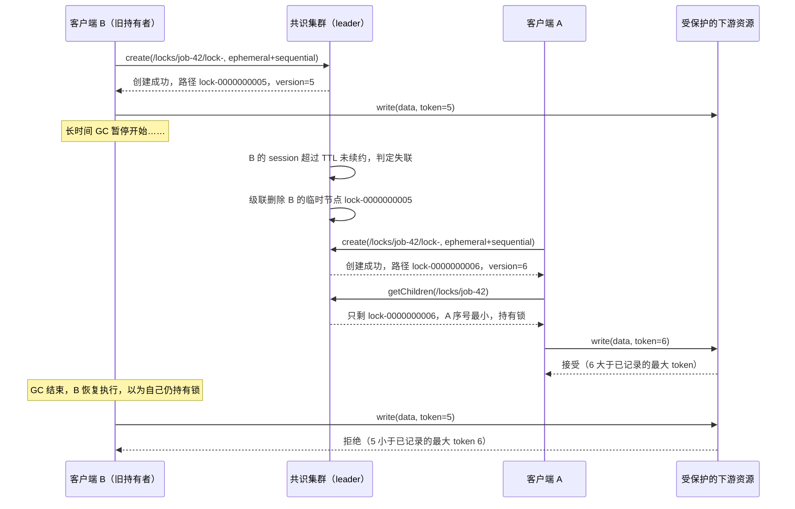

# 设计题解：分布式锁与协调服务（Distributed Lock & Coordination Service）

## 题目与范围

面试官通常这样开场："设计一个类似 Google Chubby、Apache ZooKeeper 或 etcd 的协调服务：它
要能提供分布式锁，还要支持 leader 选举、服务发现这类协调场景，任何客户端在崩溃或失联后，
它持有的锁必须能被自动释放。" 这道题和大多数"面向应用数据"的设计题（存文章、存订单、存
用户资料）有一个根本区别：这里要存的**状态本身很小，但正确性要求极高**——协调服务管理的
不是应用的业务数据，而是"谁现在是 leader"、"这把锁现在被谁持有"这类会被所有客户端共同
信任的、必须强一致的元数据。这决定了它必须建在 [[distributed.consensus|Consensus]] 之上，
而不能用为"扛大流量"优化的存储技术来解决。

值得当场问清楚的澄清问题，以及它们各自改变的设计决策：

- **要一个通用的协调原语服务，还是只要一个"加锁/解锁"API？** 决定核心接口的形状——本题按
  Chubby/ZooKeeper/etcd 的真实做法设计：服务端只暴露一组通用原语（节点的创建/读/写/删除、
  会话、watch），锁和 leader 选举是客户端用这些原语组合出来的**配方（recipe）**，不是服务端
  独立的 RPC（见「核心实体与 API」）。
- **锁只是效率优化（advisory），还是安全性依赖（mandatory）？** 如果下游资源不检查
  fencing token，这把锁就只是一个"大家愿意遵守的君子协定"，起不到真正阻止并发写入损坏数据
  的作用（见「深入探讨」第 3 节）。本题假设是后者——锁的存在是为了防止两个客户端同时写
  同一份下游资源。
- **客户端进程失联和客户端进程真的崩溃，服务要花多久才能分清（或者说，愿意付出多久的
  代价来避免分错）？** 决定 session 超时怎么选——这不是一个可以脱离
  [[distributed-failure-detection]] 单独回答的问题，超时选短了会把因为一次 GC 暂停而短暂
  失联的健康客户端误判为死亡、把锁提前转给别人；选长了会让真正崩溃的客户端占着锁没人能接管。
- **要不要跨区域部署？** 决定是用一个跨区域拉伸的共识组，还是每区域各自独立部署、只在少数
  真正需要全局协调的场景走一个小型跨区域集群（见「深入探讨」第 8 节）。

**范围内**：会话与租约（session/lease）、KeepAlive 续约、watch 通知、临时
（ephemeral）/顺序（sequential）节点、锁与 leader 选举配方、fencing token 的契约、读扩展性、
集群规模的量化、多区域部署。**范围外**：底层共识算法本身怎么实现（Raft/Paxos 的选举和日志
复制机制假设读者已经掌握，见 [[distributed.consensus|Consensus]]）；用这套服务存储应用程序
的业务数据——协调服务管理的是少量、必须强一致的元数据，不是给应用当通用数据库用，真正的
"存大量业务数据"问题是 [[solution-key-value-store|Distributed Key-Value Store]]；跨越多个
不相关应用数据的分布式事务（2PC/Saga）——那是一个独立的问题。

## 需求

**功能需求（驱动设计的 3–5 条）**

1. 客户端可以获取/释放一把有名字的互斥锁；持有锁的客户端崩溃或失联后，锁必须能在有界时间
   内被自动释放，不需要人工介入。
2. 客户端可以对某个键注册一次性的变更通知（watch），并基于此和其他原语组合出 leader 选举、
   组成员管理等经典协调配方。
3. 每次成功获取锁都必须返回一个单调递增的 fencing token，供下游资源在写入时校验，拒绝来自
   已经不再持有锁的客户端的迟到写入。
4. 持有锁的客户端遭遇任意时长的暂停（GC、缺页、VM 挂起）后恢复，其"我仍然持有锁"的过期
   信念绝不能被服务当作真的——安全性必须能在客户端完全不参与、完全不知情的情况下被下游
   资源独立验证。
5. 服务本身能容忍少数节点故障而不丢失已经确认的锁状态和不发生"脑裂"（同一时刻出现两个
   leader）。

**非功能需求（数字化）**

- **一致性**：所有写操作（创建/删除节点、CAS 写、锁授予）线性一致；读默认线性一致，可选
  降级为可串行化（本地读，可能读到略旧的值）以换取延迟和可用性——这不是本题自创的选项，
  etcd 的 `Range` API 就原生暴露了这个二选一（见「来源与延伸」）。
- **延迟**：同区域内，写（CAS/加锁/删除）p99 < 50ms；线性一致读（read index）p99 < 30ms；
  可串行化读（本地读）p99 < 5ms——三者分开定目标，因为它们的成本结构完全不同（见「深入
  探讨」第 6 节）。
- **会话与租约**：session TTL 15 秒，客户端每 5 秒（TTL/3）发一次 KeepAlive——这不是拍脑袋
  定的，是"故障判定延迟"和"误判健康客户端"之间的权衡，见「容量估算」和「深入探讨」第 2 节。
- **可用性**：5 节点集群，容忍 2 个节点同时故障（2f+1，f=2）不丢失可用性和已确认状态；
  目标 99.95%——协调服务故障的影响面是它协调的**所有**下游服务，所以可用性目标定得高，但
  "定得高"不等于"节点数要堆很多"，这一点在「深入探讨」第 7 节单独算清楚。
- **持久性/正确性边界**：已提交（多数节点确认）的写操作不丢失；节点值大小有硬上限（例如
  1KB），这是协调服务和通用数据存储之间刻意划的一条线——值变大只会让每次共识写的日志条目
  变大、拖慢所有写入的延迟，而这个成本是所有客户端共同承担的，不值得为了让个别客户端偷懒
  存点业务数据而牺牲。
- **规模定位**：这是一个**控制面**服务，不是数据面——为一个约 5,000 个客户端进程的机群提供
  会话保持、锁、选举、监听等协调原语，不用于存储应用程序的业务数据（这一点直接对应
  [[distributed-consensus-in-practice]] 里"共识用于协调和元数据，不用于承载大批量数据"这条
  结论）。

## 容量估算

**KeepAlive 是流量的主体，但它不占共识写吞吐。** 假设机群里有 5,000 个客户端进程维持会话，
每 5 秒续约一次：

```
KeepAlive QPS ≈ 5,000 / 5 = 1,000/秒
```

这个数字看起来不小，但**它几乎不占用真正需要经过共识复制日志的写吞吐**——Chubby 论文明确
记录了这一点："RPC 流量以 session KeepAlive 为主；读（多为缓存未命中）很少；写或加锁操作
则更少"（见「来源与延伸」）。续约本质上只是让 leader 本地推迟一个"这个会话何时超时"的计时
器，不需要每一次都写一条日志条目、等多数节点确认——只有会话真正创建、真正因为超时而被判定
死亡（进而级联删除其临时节点）这些**状态转换**才需要真正走一次共识写。

**真正需要走共识复制日志的写操作，加起来非常少。** 假设这套服务承载 200 个批处理作业调度器
（每个调度器平均每 30 秒获取并释放一次一把短锁，用来保证同一个任务不会被两个调度器实例同时
跑）、500 个微服务组的 leader 选举（正常运行下平均每 10 分钟发生一次换届，主要由滚动发布
触发，每次换届约 2 次 CAS 尝试）、以及运维侧平均每天 50 次的配置变更：

```
锁获取/释放：  200 × 2 / 30s     ≈ 13.33/秒
leader 换届：   500 × 2 / 600s    ≈  1.67/秒
配置变更：      50 / 86,400s      ≈  0.0006/秒
------------------------------------------------
平均共识写 QPS                    ≈ 15.0/秒
峰值（5× 峰值系数，滚动发布集中触发选举时）≈ 75.0/秒
```

**这个 15/75 QPS 的量级，正是这道题"低吞吐、高价值"这个定性判断的量化依据**——它比任何一个
中等规模数据服务的写吞吐都低两到三个数量级，但每一次写的正确性都被所有依赖它的下游服务
信任。这个反差直接决定了「深入探讨」第 7 节的结论：这套服务从来不是被吞吐量逼着扩容的。

**watch 与读**：假设每个客户端平均监听 3 个键（例如自己所属服务组的 leader 指针、自己负责
的分片配置、自己的锁节点）：

```
注册的 watch 数 ≈ 5,000 × 3 = 15,000 个
```

再假设除 KeepAlive 外，机群还会发起平均 2,000/秒的主动读（服务发现查找、"谁是当前 leader"
之类的查询），其中绝大多数可以接受可串行化的稍旧结果（见「深入探讨」第 6 节）。

**存储**：协调服务管理的是元数据，不是业务数据。假设机群里活跃的节点（锁、会话、配置项、
组成员条目）总数约 5 万个，平均每个节点（含路径、value、版本号等）约 1KB：

```
总元数据体积 ≈ 50,000 × 1KB ≈ 51.2 MB
```

——完全放得进单机内存，这不是巧合：Chubby 论文明确写道"Chubby 的数据放在内存里，因此大多数
操作都很便宜"，本题的量级和真实生产系统的量级是同一个数量级，不是刻意选小凑数字。

## 核心实体与 API

**核心设计决策：服务端只暴露通用原语，锁和 leader 选举是客户端配方，不是服务端 RPC。**
这不是偷懒，而是 ZooKeeper/etcd 真实采用、并且值得在面试里主动讲出来的架构选择——把"加锁"
这个高层语义拆解成"创建一个临时顺序节点 + 监听前驱节点"这几个通用原语的组合
（[[distributed-coordination-service-primitives]] 已经讲清楚了这几个原语怎么组合出配方，本
题在这个决策之上展开）：这样一来，服务端保持极简、无状态语义清晰、易于用共识证明其安全性；
客户端库可以按需实现不同的配方（排他锁、共享读写锁、屏障、队列）而不需要服务端为每一种
配方各开一个专门的 RPC。

**实体**

- **Session**：`session_id`、`ttl_seconds`、`last_renewed_at`、`client_identity`、
  `owned_ephemeral_paths[]`（这个会话拥有的所有临时节点路径，会话终结时它们被级联删除）。
- **Node**（协调原语的基本单位，路径式命名如 `/locks/job-42/lock-0000000007`）：`path`、
  `value`（小体积，硬上限如 1KB，见「需求」）、`version`（每次成功写操作单调递增，**同时
  就是这次授予对应的 fencing token**，不是另外发明的字段）、`ephemeral`（是否绑定 session
  生命周期）、`sequential`（创建时是否追加单调递增的序号）、`owner_session_id`（仅
  `ephemeral=true` 时有值）、`children[]`。
- **Watch**：`path`、`session_id`、一次性触发（触发后立刻失效，必须重新注册）——只通知
  "变了"，不携带变化后的内容，客户端要收到通知后自己重新读。

**API**（原语式 RPC，不是资源式 REST，但同样标注参数/响应/幂等性/分页）

| 方法 | 参数 | 响应 | 幂等性 | 分页 |
|---|---|---|---|---|
| `create(path, value, ephemeral, sequential)` | 路径、初始值、两个标志位 | 成功返回实际路径（`sequential=true` 时服务端会在路径后追加序号）和 `version` | 非幂等（重复调用在 `sequential=false` 时对已存在路径报错，`sequential=true` 时会创建多个节点——客户端必须自带幂等键去重，服务端不代为判断） | 无 |
| `delete(path, expected_version)` | CAS 删除 | 成功 `OK`；`version` 不匹配报错 `VersionConflict`；路径不存在报错 `NotFound`（刻意不静默成功，调用方需要知道自己是否真的持有过这个节点） | 幂等在"结果"意义上是（多次删除同一版本要么都成功要么都报 NotFound），但不是"无副作用"意义上的幂等 | 无 |
| `getData(path, watch)` | 路径、是否注册一次性 watch | `{value, version}` | 幂等 | 无 |
| `setData(path, value, expected_version)` | CAS 写 | 成功返回新 `version`；版本不匹配报错 | 非幂等（重试可能因为版本已变而失败，客户端需要重读后决定是否重试） | 无 |
| `getChildren(path, watch)` | 路径、是否注册一次性 watch | 子节点名称列表 | 幂等 | 无（子节点数量本身受控——它是元数据不是业务数据，不需要游标分页） |
| `keepAlive(session_id)` | session id | 新的 `ttl` 截止时间 | 幂等 | 无 |
| `multi(ops[])` | 一组有限数量（例如 ≤16）的上述操作 | 全部成功或全部失败（原子） | 由内部各操作的幂等性决定 | 无 |

**刻意不放进 API 的东西**：`lock()`/`electLeader()` 这类高层便捷 RPC——如上所述，它们是
客户端配方，放进服务端 API 会让服务端被迫对"配方的语义"（比如公平排队 vs 抢占）做出选择，
而不同应用需要不同的配方；跨路径的通用范围查询/扫描——`getChildren` 只列出一层子节点，
协调服务的路径树是给协调用的命名空间，不是一个可以任意查询的通用数据库；存储超过大小上限
的 value——这不是本服务的问题域，见「题目与范围」的范围外说明。

## 高层设计



**写路径（获取锁）**：客户端向 leader 发起 `create`（临时 + 顺序节点）；这次创建要经过共识
复制日志，被多数节点确认后才返回——返回的 `version`（在这次设计里等同于该路径的序号）就是
这次授予的 fencing token，不需要再单独维护一套令牌发放机制。客户端随后 `getChildren` 检查
自己是否是当前最小序号；如果不是，就只 `watch` 排在自己前面那一个节点（不是 watch 锁的根
节点，也不是 watch 所有其他等待者），见「深入探讨」第 4 节展开这个决策。锁释放（显式
`delete`，或者持有者的 session 超时导致临时节点被级联删除）会触发被 watch 的那个后继节点
收到一次性通知，重新检查、重新竞争。

**读路径（服务发现/状态查询）**：多数场景下客户端只是想知道"现在谁是 leader"或者"这个键的
当前值"，这类查询默认允许降级为可串行化读，由任意一个 follower 在本地直接回答，不需要
quorum 往返；只有像本流程图里"用 fencing token 做安全校验"这类必须绝对准确的读，才强制走
线性一致（见「深入探讨」第 6 节的取舍标准）。

**保护下游资源，是下游资源自己的责任，不是锁服务的责任。** 图里最后一步的拒绝逻辑发生在
`R`（下游资源）内部，不是发生在共识集群内部——协调服务只负责产生一个"谁在什么时候拿到了
哪个单调递增的令牌"的权威记录；真正阻止旧令牌写入生效的检查必须由资源自己实现（持久化
"已经见过的最大令牌"，拒绝更小的）。这一点和「深入探讨」第 3 节链接的
[[distributed-fencing-tokens]] 里讲的结论完全一致，此处不重复论证，只强调这是接口设计
上必须体现出来的一条契约：`version`/fencing token 是本服务返回给调用方的、供**下游系统**
使用的字段，不是本服务自己内部消费的字段。

## 深入探讨

### 为什么必须坐在共识复制的日志之上，而不是主从复制或 Redlock 式的多实例投票

**问题**：协调服务的核心诉求是"所有客户端对同一个问题（谁持有锁、谁是 leader）必须达成
完全一致的答案"——这正是 [[distributed-linearizability-when-needed]] 里明确点名的场景
（"锁和 leader 选举：所有节点必须就谁持有锁达成一致——一个陈旧的视图就意味着两个 leader"）。
用什么机制来保证这一点？

**方案一：单个数据库实例 + 行锁（如一行 MySQL 记录 + `SELECT ... FOR UPDATE`）。** 实现
简单，但这个单点本身的可用性就是整个协调服务的可用性上限；一旦这台机器不可达，要么整个
协调服务停摆，要么做主从故障转移——而没有共识参与的主从故障转移存在经典的脑裂风险：旧主
在网络分区后并不知道自己已经被替换，可能继续认为自己仍然是权威节点。

**方案二：Redlock 式的多实例投票（在 N 个独立 Redis 实例中的多数上都设置一个带 TTL 的
key）。** Martin Kleppmann 的分析（见「来源与延伸」）指出两个问题：其一，它的安全性建立在
一系列时序假设上（进程不会长时间暂停、网络延迟有界、时钟漂移有界），而这些假设在真实系统
里都不成立；其二，也是更根本的一点，**Redlock 这套协议本身产生不出一个可验证的单调递增
令牌**——这不是设计者忘了加一个字段，而是它的协议结构里没有一个所有参与者都认可的"逻辑
时钟"来源。Kleppmann 的结论是：Redlock 作为纯粹的效率优化（避免重复劳动，锁失败的代价只是
性能而非正确性）是可以接受的，但一旦锁的正确性本身是安全性依赖（本题的假设），就不应该用它。

**方案三（选用）：建在共识复制日志之上的服务，如 Chubby（Paxos）、ZooKeeper/etcd
（Zab/Raft）。** 每一次状态变更（节点创建/删除、CAS 写）都是复制日志的一条条目，只有被
多数节点确认的条目才算提交；[[distributed-epoch-numbers|epoch/term 号]]保证被取代的旧
leader 无法在事后偷偷提交任何东西（[[distributed-raft-guarantees]]）。这个方案结构性地
同时解决了 Redlock 的两个问题：选举本身是安全的（不会脑裂），而且每次授予天然携带一个来自
复制日志位置的单调递增值，直接就是 fencing token，不需要另外发明机制。
[[distributed-consensus-in-practice]] 里"共识用于协调和元数据，不用于承载大批量数据"这条
结论，本题就是那个"协调和元数据"的典型场景本身。

### 会话与租约：KeepAlive 机制和超时怎么选

**问题**：客户端持有的临时节点必须在客户端真正失联/崩溃后被自动回收，但"多久没消息才算
失联"本身是一个要权衡的设计参数，不是一个可以脱离 [[distributed-failure-detection]] 单独
回答的问题——那张卡片已经讲清楚了"没有任何超时能证明一个远端节点真的死了"和"实践中怎么
选超时"，本题只补充协调服务这个场景特有的机制细节。

**方案**：客户端创建 session 时协商一个 TTL（本题假设 15 秒）；客户端按 TTL/3（本题假设
每 5 秒一次）发送 KeepAlive，服务端每次收到都把这个会话的过期时间往后推；连续超过 TTL 没有
收到 KeepAlive，服务端判定该会话失联，级联删除它拥有的所有临时节点。TTL/3 这个比例不是本题
独创，而是给 KeepAlive 请求本身的网络延迟和丢包重试留出至少两次尝试的窗口——Chubby 的真实
生产参数印证了同一个思路：默认租约延长量是 12 秒，客户端在收到上一次 KeepAlive 回复后立刻
发起下一次，相当于持续续约；判定会话"危险"（本地租约到期但还没确认服务端已经终止会话）后
还有一个宽限期，默认 45 秒，客户端在宽限期内清空本地缓存但仍然尝试恢复连接，只有宽限期也
耗尽才真正认定会话已死——把"网络抖动导致的一次超时"和"会话真的终结"分成了两级判断，避免
单次超时就产生一次不必要的锁转移。

**这个参数没有免费的正确答案**：TTL 设得短，故障转移更快（别的客户端更快接管失联者的锁），
但增加了误判健康客户端（一次长 GC 暂停超过 TTL）的概率，白白引发一次不必要的锁转移和重新
竞争；TTL 设得长，误判更少，但真正崩溃的客户端会占着锁更久没人能接管。本题选择的 15 秒锚定
在这样一个判断上：本题的锁大多保护的是批处理任务和服务领导权这类"转移代价可以接受、但频繁
误转移会造成抖动"的资源，不是要求亚秒级故障转移的场景。

### 锁到底保证了什么：一旦有时钟和进程暂停

这部分是 [[distributed-fencing-tokens]]、[[distributed-process-pause-causes]]、
[[distributed-clock-error-sources]]、[[distributed-failure-detection]] 这几张卡片已经讲
透的内容——为什么任意时长的进程暂停让"先检查锁是否仍然有效、再写入"这种客户端自查不可靠，
为什么安全性必须由**资源端**强制执行而不是客户端自觉——这里不重复论证，只说本题特有的接口
落地方式：如「核心实体与 API」所述，本设计不单独维护一套令牌发放逻辑，而是直接复用每个节点
的 `version` 字段——它在共识复制日志里天然单调递增，创建/CAS 写入成功时返回的那个值，就是
这次授予的 fencing token。这意味着"要不要支持 fencing token"从来不是本设计需要额外决定的
一个功能开关，而是共识复制日志这个底层机制免费带来的副产品——真正需要设计决策的地方，是
「高层设计」里强调的那一条契约：下游资源必须自己持久化并校验"已见过的最大令牌"，协调服务
无法替它完成这一步。

### watch 与通知：一次性触发，以及"惊群"什么时候是 bug、什么时候是期望行为

**问题**：一个键发生变化时，可能有很多客户端在等待这个变化——但"通知所有等待者"是对是错，
取决于这些等待者到底在等什么。

**方案**：watch 机制本身保持极简——注册时绑定一次性触发，触发后立刻失效且**不携带变化后的
内容**（只是一个"变了，你需要重新读"的信号），需要新数据的客户端必须重新调用
`getData`/`getChildren`。这个"轻量信号 + 客户端自己重读"的设计，把"要不要广播给所有等待者"
这个策略完全交给了**客户端在哪个节点上注册 watch**，服务端不需要为不同场景各开一条特殊
逻辑：

- **锁排队场景（本题「高层设计」里的锁配方）**：如果所有等待者都直接 watch 同一个锁节点，
  持有者一释放，所有等待者会同时被唤醒、同时重新查询、同时重新竞争，但只有一个能真正拿到
  锁——这是一次纯粹浪费的 O(n) 惊群，且 n 越大越糟。本题的锁配方让每个等待者只 watch 排在
  自己前面那一个节点，锁释放只精确唤醒**恰好一个**客户端（前驱节点被删除时，只有紧跟在它
  后面的那个等待者在 watch 它），把 O(n) 的无谓唤醒降到 O(1)。
- **组成员/leader 指针广播场景**：假设某一个服务组内部有 200 个实例（在本题假设的 500 个
  服务组、5,000 个客户端里，这是一个明显大于平均规模的组，本身就说明组大小并不均匀），都在
  watch 同一个"当前 leader"指针，一旦这个指针变化，理想的行为恰恰是**所有 200 个实例都应该
  被唤醒**——它们都需要知道新状态才能正确路由请求，"只唤醒一个"在这里反而是错的。这种表面
  上看是"惊群"、实际上是期望行为的情况，在真实系统的读锁实现里也有先例：多个客户端同时持有
  共享读锁、等待同一个写锁节点被释放时，它们理应被一起唤醒，因为它们确实都可能现在有资格
  获得读锁。

区分这两种场景的关键不在服务端，而在**配方设计者**选择让等待者 watch"自己的前驱"还是"一个
共享的指针"。用本题的容量数字算一下量级：200 个实例同时收到通知后在短时间窗口内一起发起
`getData` 重新读取，会形成一次约 200 倍的瞬时读放大——这在设计上完全可以承受（这类读是无副
作用的可串行化读，可以分摊到所有 follower 上，见第 6 节）；但如果这 200 个实例同时唤醒后
去竞争的是同一把**互斥写锁**（不是被动读状态），就会形成真正的写竞争风暴——这正是"广播"
只该用于无副作用的状态感知、"排队"才该用于真正互斥的资源竞争这条设计边界的由来。

### ephemeral 节点：leader 选举与组成员管理配方

**问题**：怎么用「核心实体与 API」里那组通用原语，组合出"选出恰好一个 leader"和"实时知道
组里还有哪些成员存活"这两个经典协调场景，而不需要服务端专门为它们各开一条 RPC？

**leader 选举配方**：每个候选者创建一个临时+顺序节点（例如
`/election/group-X/candidate-`）；序号最小的那个节点对应的客户端就是当前 leader；其余
候选者不需要都盯着 leader 本身，只需要各自 watch 排在自己前面那一个候选者的节点——这正是
上一节讨论的"避免惊群"的排队写法在选举场景下的应用。leader 崩溃或失联后，它的临时节点因
session 超时被级联删除，紧跟在它后面的那个候选者的 watch 被触发，重新检查自己是否已经是
最小序号；如果是，它晋升为新 leader；如果不是（例如中间还有一个候选者的请求也刚好失败被
移除），它继续 watch 新的前驱——整个过程是一条逐跳的晋升链，而不是所有候选者同时冲上去抢。

**组成员管理配方**：每个存活进程创建一个临时（不需要顺序）节点，例如
`/group/members/<instance-id>`；任何时刻的组成员列表 = 对 `/group/members` 做一次
`getChildren`；进程崩溃或失联时，它的临时节点被自动删除，组成员列表随之更新——不需要任何
显式的心跳协议或注册/注销 API，"节点存在"本身就是"进程存活"的证明，这正是临时节点
（ephemeral node）这个原语的设计初衷：把存活性直接和数据绑在一起，而不是另开一套探活机制
去维护一份独立的成员表。

### 读扩展性：followers 本地读 vs 线性一致读

**问题**：本题「容量估算」里假设的 2,000/秒主动读加上 15,000 个 watch 的重读，如果每一次
都强制走 leader、走一次 quorum 往返，会不必要地把所有读流量都摊到 leader 一个节点上，
即使这些读大多数根本不需要绝对最新的结果。

**方案**：按调用方是否**依赖结果的绝对时效性**来分流，而不是一刀切。
[[distributed-raft-linearizable-reads]] 已经讲清楚了具体机制——leader 可能已经被废黜却
自己不知道，所以本地读不能天然保证线性一致，标准解法是 read index（用一轮心跳确认自己仍是
多数派认可的 leader，代价是一次 quorum 往返）或 lease read（心跳后假设自己在一个选举超时
窗口内仍是 leader，几乎零成本，但安全性依赖有界的时钟漂移）——本题不重复这个机制本身，只
回答"在这道题里，哪些读该用哪一种"：

- **可以接受可串行化（本地、可能稍旧）**：服务发现查找（"当前有哪些实例存活"）、非安全
  关键的状态展示（"现在大概谁是 leader，用来决定把请求路由去哪里试一下"）——路由错了，
  客户端会收到"我不是 leader"的拒绝然后重试，本身有兜底机制，不值得为它付 quorum 往返的
  成本，由任意 follower 本地回答即可。
- **必须线性一致**：任何用于**安全校验**的读——例如「高层设计」流程图里下游资源拿着一个
  fencing token 去确认"这确实是当前最新的令牌"，或者客户端在真正执行一次写之前要确认"我
  现在仍然持有这把锁"——这类读如果读到陈旧数据，后果和读到陈旧数据后直接去写一样严重，
  必须走线性一致读。[[distributed-linearizability-when-needed]] 把"锁和 leader 选举"明确
  列为需要线性一致的场景之一，本题在这里进一步把"同一个协调服务内部的读"也拆成了两类，不能
  笼统地说"这是协调服务，所以所有读都要线性一致"——那会不必要地放弃 followers 本地读带来的
  延迟和扩展性收益。

### 规模与不靠加投票节点扩容：一个 5 节点集群到底能扛多少

**问题**：「容量估算」算出来的真实写需求只有平均 15、峰值 75 次/秒，这个数字小到不像是一个
需要认真做容量规划的系统——那"5 节点"这个规模到底是怎么定出来的，值不值得加更多节点？

**先看一个真实系统自己测出来的上限。** ZooKeeper 论文报告了一组饱和吞吐量的实测数据（见
「来源与延伸」），在读写比例的两个极端下：

```
节点数   100% 读（次/秒）   100% 写（次/秒）
3        87,000             21,000
5        165,000            18,000
7        257,000            14,000
9        296,000            12,000
13       460,000             8,000
```

**读吞吐随节点数增加而上升，写吞吐却随节点数增加而下降**——这不是矛盾，而是同一个机制的
两面：更多节点意味着有更多副本可以各自在本地回答读请求，但也意味着每一次写都要复制给更多
节点、等更多确认，quorum 往返的开销随节点数增长。这正是本题标题里"为什么不靠加投票节点
扩容"的实测证据：**加节点从来不会让协调服务的写吞吐变得更好，只会更差**，它唯一换来的是
按 [[distributed-quorum-sizing]] 的 `2f+1` 公式多容忍一个节点同时故障（3 节点容忍 1 个，
5 节点容忍 2 个，7 节点容忍 3 个……），而不是更多吞吐。

**再看本题真实的写需求相对这条曲线的位置**：即使是曲线最低点（3 节点、100% 写、21,000/秒）
也比本题峰值需求（75/秒）高出约 280 倍；本题选用的 5 节点在其自身的 18,000/秒写上限面前，
平均写需求只占约 1/1200，峰值也只占约 1/240。**这套服务从头到尾都没有被吞吐量逼近过它的
上限**——选 5 节点而不是 3 节点，理由完全是可用性：3 节点只能容忍 1 个故障，一旦在做维护
时再赶上一次意外故障就整体不可用；5 节点能同时容忍 2 个，覆盖"计划内维护 + 一次意外故障"
这个常见的叠加场景，而多付出的这一点写延迟代价（多一个节点要等待确认）在本题这种远低于
上限的负载下完全无感。选 7、9 甚至更多节点在本题的场景下没有任何收益——既不需要更高的写
吞吐（反而更低），也不太需要容忍 3 个以上节点同时故障（多数团队的故障域覆盖到"一次维护 +
一次意外"就已经足够）。真正要扩展这类服务的吞吐或者服务更大规模的客户端群体，做法不是
在一个共识组里塞更多投票节点，而是**部署多个独立的协调集群**（按数据中心/按业务域拆分，
每个集群各自 5 节点），这也是真实的 Chubby/ZooKeeper/etcd 部署方式——Chubby 论文提到它
真实的生产实例"经常同时为几万个客户端提供服务"，量级和本题假设的 5,000 客户端同一数量级，
印证了单个协调集群本身并不需要靠堆节点来撑更大规模。

### 多区域布局：不要拉伸一个全局共识组

**问题**：如果机群本身是多区域部署的，协调服务要不要也把 5 个投票节点分散到不同区域去，
换取"整个区域故障也不影响协调服务"这个保证？

**先算跨区域拉伸的延迟代价。** 假设把 5 个节点按 2-2-1 分布在三个区域（美东 2 个、美西 2
个、欧洲 1 个），quorum 需要 3 个节点确认。如果 leader 在美东，它自己的确认是免费的，同
区域的另一个美东节点确认约需 1ms（同数据中心往返量级），但凑够 3 个确认还需要**再等
一个**来自美西或欧洲的节点——按同大洲 10–70ms、跨洲 100–150ms 这个量级估算，取同大洲这
一档里较快的一侧（美东到美西约 60ms），quorum 完成时间被这最后一个确认拖到约 **60ms**，
比同区域部署（约 1ms 量级）慢了近两个数量级。这不是本题可以优化掉的成本，而是"多数派必须
物理跨越那么远的距离"这件事本身的代价。

**方案：不要用一个全局拉伸的共识组覆盖所有区域协调需求，改成"每区域一个本地集群 + 一个
小型全局集群只服务真正的跨区域决策"。** 每个区域内部的协调需求（区域内的服务发现、区域内
批处理任务的互斥锁、区域内的 leader 选举）交给该区域自己的 5 节点集群处理，写延迟保持
同区域量级；只有真正**必须全局唯一答案**的场景（例如"多区域部署下，哪个区域当前是某个
租户的主区域"，见 [[reliability-active-active-vs-passive]] 讨论的主备切换决策）才交给一个
单独的小型跨区域集群仲裁——这类决策本身频率很低（故障转移不是日常操作），能够承受更高的
跨区域延迟。如果确实需要一个跨区域集群本身也要在故障时保持可写，
[[reliability-three-region-quorum]] 已经讲清楚了为什么要三个区域而不是两个、以及用一个
只存投票不存数据的"见证区域"降低成本这个技巧，本题的全局仲裁集群直接沿用这个结论，不再
重复推导。

## 瓶颈、故障与演进

**热点与倾斜**：本题的负载天然不存在"某个热点键被打爆"这类问题——真正的风险是「深入探讨」
第 4 节讨论的通知型惊群（大量等待者同时被唤醒后同时重新读），已经通过"广播用于状态感知、
排队用于互斥竞争"这条设计边界处理；另一个真实的倾斜风险是运维层面的"雷区操作"：一次覆盖
大批服务的配置全量下发，如果触发大量客户端几乎同时重新竞争同一批锁或者同时触发选举，会
在极短时间窗口内把共识写请求集中到一起——这也是「容量估算」里把峰值系数定到 5 倍而不是
更保守的 2–3 倍的原因，为这类运维触发的突发预留余量。

**各组件故障时怎么退化**：

- **少数节点（≤ f = 2）故障或失联**：集群继续正常提供服务，只是可容忍的下一次故障余量变小；
  这正是选 5 节点而不是 3 节点买来的"计划内维护 + 一次意外故障"的余量。
- **多数节点（≥ 3）同时不可用**：集群丧失写能力（无法达成 quorum），存量数据的
  serializable 读仍可能可用（视具体实现是否允许无 leader 时的本地读），但线性一致读和所有
  写都会阻塞，直到多数恢复——这是共识系统刻意的选择：宁可不可用，也不允许在无法确认多数
  的情况下继续接受写入而产生分裂的历史（[[distributed-flp-and-escape]] 讨论过这个"安全性
  永不依赖时序、活性依赖时序"的设计原则）。
- **leader 被网络分区、但自己还没意识到**：这正是「深入探讨」第 6 节要求关键读走 read
  index/lease read 而不是无脑信任本地状态的原因；[[distributed-election-disruption]] 额外
  处理了"一个抖动的链路让某节点反复递增 term、无谓地废黜健康 leader"这个活性问题，本题
  的集群应当按该卡片的建议开启 pre-vote/check-quorum。
- **真实生产系统的故障构成参考**：Chubby 论文记录了一个样本窗口——700 个"单元-天"里出现
  61 次中断，其中 52 次在 30 秒以内（大多数依赖它的应用感觉不到），剩下 9 次分别由网络
  维护（4 次）、疑似网络连通性问题（2 次）、软件缺陷（2 次）、过载（1 次）造成；同一份
  记录里，"几十个单元-年"的运行时间中只发生过 6 次真正的数据丢失，且全部由数据库软件缺陷
  （4 次）或操作员失误（2 次）造成，没有一次是硬件故障导致——这组真实数字说明这类系统在
  生产环境里的失败模式主要是运维和软件层面的，硬件级别的多数派同时失效反而是最不常见的
  故障来源，这也支持"5 节点已经给出足够的硬件故障冗余，真正要提防的是软件缺陷和误操作"
  这个优先级判断。

**10 倍演进（客户端从 5,000 增至 5 万，会话/KeepAlive 相应增至约 1 万/秒，共识写峰值增至
约 750/秒）**：共识写这个量级仍然远低于单个 5 节点集群 18,000/秒的实测上限，不需要拆分
集群；但 KeepAlive 这类leader本地操作的处理量本身开始值得关注——需要确认 leader 单机能否
撑住上万 QPS 的会话续约请求处理（这是纯 CPU/网络开销，不受共识写吞吐上限约束，但仍然是
单机资源），必要时把 KeepAlive 的接收和计时逻辑从 leader 单点下放到边车（sidecar）或者
让 follower 也能处理续约请求转发给 leader，避免 leader 因为纯粹的连接数/请求数而不是共识
写吞吐而过载。

**100 倍演进（客户端 50 万，接近或超过 Chubby 论文报告的真实单元规模上限）**：单个协调
集群不再合适，按业务域或数据中心拆分成多个独立的 5 节点集群（如「深入探讨」第 7 节所述），
每个客户端只和自己所属域的集群交互；需要一层轻量的目录服务告诉客户端"我的协调集群在哪"，
这个目录服务本身数据量极小、更新极少，可以是这些协调集群之一承载的又一组节点，不需要再
造一套独立的基础设施。

## 面试官会追问什么

**中级（mid）**

- "为什么不直接用一个 Redis 实例加 `SET NX EX` 实现分布式锁？" 答：单实例是单点，挂了整个
  锁服务停摆；即使多实例投票（Redlock），也无法产生一个可信的单调递增 fencing token，只
  适合把锁当效率优化而不是安全性依赖的场景。
- "watch 触发之后，服务端为什么不直接把新值一起推给客户端，省得客户端还要再读一次？" 答：
  一次性触发之间可能发生多次变化，推送最新值只能反映触发那一刻的状态，客户端仍然需要重新
  读来确认自己看到的是不是最新的；保持"只是一个信号"能让服务端实现更简单，也不用担心推送
  的内容和客户端重新读到的内容因为竞态而不一致。

**高级（senior）**

- "如果把 session TTL 从 15 秒改成 2 秒，会发生什么？" 答：故障转移变快，但代价是任何一次
  超过 2 秒的 GC 暂停或网络抖动都会被误判为客户端死亡，触发不必要的锁转移和重新竞争，在
  负载升高或网络本身不稳定时反而放大抖动——TTL 的选择要基于对客户端进程真实暂停时长分布
  的观察，不是越短越好。
- "5 个节点里，如果把其中 2 个换成只投票、不参与读服务的轻量见证节点，能带来什么？" 答：
  在保持同样 `2f+1=5` 容错能力的前提下，降低了硬件成本（见证节点可以配置更低），但读扩展性
  会下降，因为可以本地服务读请求的完整副本变少了；这本质上是「深入探讨」第 8 节里"见证
  区域只投票、不服务"这个技巧在单区域内部的翻版。

**资深（staff）**

- "5,000 个客户端全部把 session TTL 设成一样的 15 秒、KeepAlive 间隔也一样，会不会导致
  所有客户端的续约请求逐渐同步到同一个时刻集中爆发（类似 TCP 的同步重传问题）？" 答：
  会，如果客户端的续约调度完全确定、没有随机化；缓解方式是在每次续约间隔上加一个小的随机
  抖动（jitter），打散同步趋势，这是任何周期性心跳类协议都该有的标准做法，本题在「容量
  估算」里给出的 1,000/秒是均匀分布假设下的平均值，实际部署必须验证没有集中爆发的尖峰。
- "为什么不能用应用层的分布式事务（比如跨多个下游资源的 2PC）来代替 fencing token 这种
  单点校验？" 答：这两者解决的不是同一层的问题——fencing token 解决的是"同一把锁的两个
  持有者的写入谁该生效"，是协调服务和单个下游资源之间的契约；2PC/Saga 解决的是"跨多个
  相互独立资源的写入要么全部生效要么全部不生效"，是应用层的问题，且本题明确把它划在范围
  外——协调服务本身应该保持通用和简单，不应该被具体应用的事务语义绑定。

## 常见错误

- **把 leader 选举、加锁这类高层语义做成服务端的专门 RPC**，而不是让客户端用一组通用原语
  组合出来——这会让服务端被迫在不同应用需要不同配方语义（公平排队 vs 抢占、独占锁 vs
  共享读写锁）时反复做妥协，丧失了协调服务本该有的通用性。
- **设计了锁却不要求下游资源检查 fencing token**，把锁当成绝对安全的互斥保证——一旦客户端
  经历任意时长的暂停，这种"纯客户端自觉"的锁毫无安全性可言，见 [[distributed-fencing-tokens]]。
- **让所有等待者都 watch 同一个锁节点**，制造不必要的 O(n) 惊群，而不是用"只 watch 自己的
  前驱"这个排队写法把无谓唤醒降到 O(1)。
- **把所有读都当成必须线性一致**，白白放弃 followers 本地读带来的延迟和扩展性收益，同时也
  没有反过来的错误——把需要安全校验的关键读也降级成可串行化，那会让 fencing token 的校验
  本身依赖一份可能过期的数据，白白削弱了前面辛苦建立的安全保证。
- **靠不断增加投票节点数量来"提升"协调服务的处理能力**，而没有意识到写吞吐随节点数增加
  反而下降——真正要扩展规模应该部署多个独立集群，而不是让一个集群越长越大。
- **把 5 个节点跨越遥远区域拉伸成一个全局共识组**，让日常操作都要付出跨区域 quorum 往返
  的延迟税，而不是只让真正需要全局唯一答案的少数操作走跨区域路径。
- **把协调服务当成通用数据库使用**，往节点里塞应用的业务数据——协调服务里的每一次写都要
  经过全体投票节点的共识确认，这个成本模型和为大批量数据优化的存储完全不同，塞进去的业务
  数据越大，拖慢的是所有依赖这套服务做真正协调工作的客户端。

## 五分钟讲法

I'd frame this as a control-plane service, not a data-plane one: the state it manages —
who holds a lock, who is the current leader — is tiny, but every client has to trust it
completely, which is why it has to sit on a consensus-replicated log rather than a simple
primary-backup setup or an ad hoc multi-instance voting scheme like Redlock, which can't
produce a verifiable monotonic fencing token and depends on timing assumptions that don't
hold once you account for GC pauses and clock drift. The API itself stays deliberately
primitive — create, delete, read, watch, a session with keepalives — and locks, leader
election, and group membership are client-side recipes built out of those primitives using
ephemeral and sequential nodes, the same way ZooKeeper and etcd actually do it, rather than
baking recipe-specific semantics into the server. Every successful lock grant returns a
monotonically increasing version number as its fencing token for free, since that's just
the node's position in the replicated log — the design decision that actually matters is
the contract that the downstream resource, not the lock service, has to persist and check
the highest token it has seen. Watches are one-shot signals with no payload, and whether a
change should wake exactly one waiter or broadcast to everyone is a recipe-level choice, not
a server-level one — queueing on your immediate predecessor avoids a thundering herd for
mutex locks, while broadcasting to everyone is exactly right for something like a leader
pointer that every member needs to know about. On sizing: I computed the real coordination
write demand for a 5,000-client fleet at around 15 ops/second average, 75 at peak — two to
three orders of magnitude below what even a 3-node ensemble sustains in ZooKeeper's own
published benchmarks, and that benchmark data also shows write throughput actually drops as
you add more voting members, so five nodes is chosen for fault tolerance — tolerating two
simultaneous failures — not for throughput, and scaling this kind of service means running
more independent five-node ensembles, never growing one ensemble larger. And I wouldn't
stretch one ensemble across distant regions either, since every write would pay a
cross-region quorum round trip; instead each region runs its own local ensemble, with a
small separate global ensemble reserved only for the rare decisions that genuinely need one
answer everywhere.

## 来源与延伸

- **[Burrows — The Chubby Lock Service for Loosely-Coupled Distributed Systems
  (OSDI 2006)](https://research.google/pubs/the-chubby-lock-service-for-loosely-coupled-distributed-systems/)**：
  一手论文，本文的会话/KeepAlive 参数（12 秒默认续约量、45 秒宽限期）、真实规模（单元
  经常同时服务几万个客户端）、真实故障构成（700 单元-天里 61 次中断、6 次数据丢失的具体
  原因分布）全部引自这篇论文，用来给本题的设计参数提供真实的量级参照，而不是凭空取整数。
  和本文的主要分歧在于：Chubby 把锁和小文件存储绑在一个"类文件系统"接口里，本文按
  ZooKeeper/etcd 更晚近、更被广泛采用的做法，选择了更精简的路径式键值原语接口。
- **[Hunt, Konar, Junqueira, Reed — ZooKeeper: Wait-free coordination for Internet-scale
  systems (USENIX ATC 2010)](https://www.usenix.org/legacy/event/atc10/tech/full_papers/Hunt.pdf)**：
  一手论文，本文「深入探讨」第 4、5、7 节分别引用了它的 watch 一次性触发语义、临时+顺序
  节点的锁配方（只 watch 前驱节点以避免惊群）、以及不同集群规模下的饱和读写吞吐实测表——
  这张表是本文"为什么不靠加投票节点扩容"这个论证的核心证据，直接取自论文而非本文自行假设。
  和本文的分歧在于：论文的配方部分把"避免惊群"的写法作为一个更优化的版本单独给出，本文
  额外强调了"广播反而是期望行为"这个反例（共享读锁场景），论文原文也提到了这一点但没有
  展开讨论它和排队写法的适用边界。
- **[Kleppmann — How to do distributed locking](https://martin.kleppmann.com/2016/02/08/how-to-do-distributed-locking.html)**：
  一手分析文章，本文「深入探讨」第 1 节对 Redlock 的批评直接引自这篇文章的论证——Redlock
  的安全性依赖一系列时序假设、且协议本身产生不出可验证的单调递增令牌。本文认同它的核心
  结论（锁的正确性依赖必须用 fencing token，效率优化场景可以不用），但把落地方式放在了
  一个真正的共识系统里，而不是停留在"该不该用 Redlock"这个问题本身。
- **[etcd 文档 — Learning: API](https://etcd.io/docs/v3.6/learning/api/)**：一手产品文档，
  本文「需求」一节"读默认线性一致、可选可串行化"这条设计直接对应 etcd `Range` API 的
  `serializable` 选项；`keepAlive`/`lease` 的续约机制命名也参考了 etcd 的 Lease API。和本文
  的分歧在于：etcd 文档没有给出 TTL 的默认值（TTL 由调用方在建租约时协商），本文的 15 秒
  TTL、5 秒续约间隔是按本题自己的容量估算和故障判定权衡独立选定的，不是抄自 etcd 的默认值。
