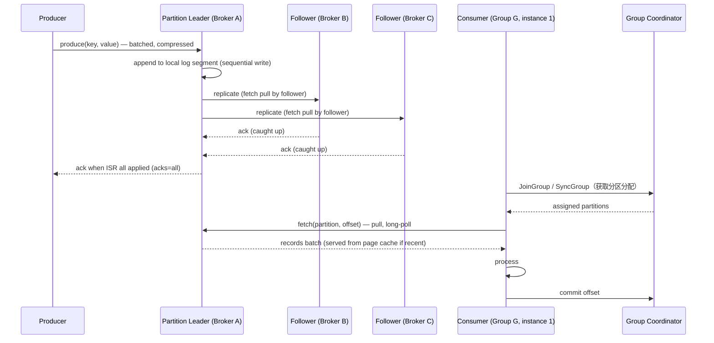

# 设计题解：分布式消息队列（Distributed Message Queue，Kafka 一类）

## 题目与范围

面试官通常这样开场："设计一个像 Kafka 那样的分布式消息队列：任意数量的生产者
（producer）写入，任意数量的消费者（consumer）以自己的节奏读取，数据要能水平扩展、
可持久化、可重放。" 这道题的难点不是"造一个队列"，而是**同一份日志要同时满足互相冲突
的目标：顺序性只在很窄的范围内成立，副本要在不牺牲吞吐的前提下保证不丢数据，消费者的
读取速度和生产者的写入速度必须解耦，而所有这些机制都要在磁盘和网络这两个物理资源的
真实带宽上跑通**，不能只停留在"用队列解耦"这句话。

值得当场问清楚的澄清问题，以及它们各自改变的设计决策：

- **是日志式（log-based，可重放、多消费者独立进度，即 [[async.log|The Log & Kafka]]
  描述的存储抽象）还是传统队列式（消息被消费后即删除、一条消息只投给一个消费者）？**
  决定了存储模型——本题按日志式设计，因为这是 Kafka 类系统的真实形态，也是多消费者组
  独立重放这一核心能力的来源（对比见「深入探讨」第 6 节）。
- **顺序保证的范围是什么？** 全局顺序在分布式系统里几乎不可能低成本实现；本题只承诺
  单分区（partition）内顺序，这决定了分区键（partition key）的选择如何直接影响下游
  能拿到什么顺序保证。
- **交付语义要多强？** [[async.delivery.guarantees|Delivery Guarantees]] 里区分的
  至少一次（at-least-once）、至多一次（at-most-once）还是「effectively-once」？
  决定了生产者重试策略、消费者提交 offset 的时机，以及要不要引入幂等生产者和事务
  （见「深入探讨」第 6 节）。
- **消息保留多久，是按时间/大小滚动删除，还是按 key 做日志压缩（compaction）？** 决定
  了这套系统是被当作「临时缓冲区」还是「某个数据集的权威副本」来用。
- **要不要支持跨分区的事务或恰好一次的端到端语义？** 本题支持到生产者幂等和消费-处理-
  生产的事务边界，但不承诺对下游任意外部系统的端到端恰好一次——那是组合出来的，不是
  单一组件的特性，这一点本身也是常见的追问点。

**范围内**：主题（topic）/分区/副本的存储与复制模型，生产者与消费者组的读写路径，
保留与压缩策略，几种交付语义的取舍与实现机制，分区分配与消费者组协调。**范围外**：
流处理引擎本身（窗口、join、状态存储，属于 Stream Processing 一题）、变更数据捕获
的业务语义（属于 CDC & Event Sourcing）、Schema Registry 之类的治理层、跨地域多活
复制（本题假设单一区域内的集群，跨区域复制是独立的一道题）。

## 需求

**功能需求（驱动设计的 3–5 条）**

1. 生产者可以把消息写入指定的主题；同一分区键的消息在同一分区内保持写入顺序。
2. 多个相互独立的消费者组可以各自以自己的进度读取同一份数据，互不影响，且支持从任意
   历史 offset 重放。
3. 单个消费者组内的多个消费者实例分摊同一主题的分区，实例增减时自动重新分配
   （rebalance）。
4. 数据在可配置的时间/大小窗口内持久保留，允许消费者故障恢复后从上次提交的 offset
   继续，不丢失已提交的数据。
5. 系统提供可配置的交付语义（至少一次为默认），并允许生产者选择更强的幂等/事务保证。

**非功能需求（数字化）**

- **持久性**：一条消息一旦被生产者判定为"已提交"（committed），只要不是全部副本同时
  永久性损坏，就不能丢失。
- **吞吐**：以下容量估算给出的峰值写入速率下，端到端 P99 写入延迟（生产者发出到 leader
  副本确认）< 10ms；这依赖顺序磁盘 I/O 和批量发送，见「深入探讨」第 3 节。
- **消费延迟**：正常运行时消费者组的滞后（consumer lag）目标 P99 < 1 秒；这个目标只
  在消费位置落在 page cache 覆盖的时间窗口内才成立（见「深入探讨」第 3 节的量化）。
- **可用性**：分层设计——写路径（producer→leader）目标 99.95%，单个 broker 故障不
  应导致整个主题不可写；读路径（consumer 消费）目标 99.99%，因为下游往往是在线服务
  的关键依赖。
- **顺序保证的边界**：只在单分区内保证顺序，不承诺跨分区、跨主题的全局顺序——这是一条
  必须写清楚的非功能约束，否则容量估算里"分区数"这个数字会被误判为纯粹的吞吐参数。

## 容量估算

**基础假设**（这是本设计的假设，不是某个真实平台的披露数据）：一个覆盖全公司点击流
（clickstream）事件的主题，日活用户（DAU）3 亿，平均每用户每天产生 200 条事件
（页面浏览、点击、曝光合并计），单条事件压缩后平均 400 字节。

```
events/day = 3×10^8 × 200 = 6×10^10
avg QPS = 6×10^10 / 86,400 ≈ 694,444
peak QPS (×4 日内峰值系数) ≈ 2,777,778
avg bytes/day = 6×10^10 × 400B = 2.4×10^13 B = 24 TB/day
```

**保留 7 天、复制因子（replication factor）3**：

```
storage = 24 TB/day × 7 × 3 = 504 TB
```

**这是第一个决定架构的数字**：504 TB 的存储需求和吞吐需求分别要求多少台 broker？

```
peak 集群写入字节数（含全部副本各写一次）
= peak QPS × 400B × replication = 2,777,778 × 400 × 3 ≈ 3,333 MB/s

按顺序磁盘写入 ~600MB/s/broker（JBOD 顺序写，来自 Kafka 设计文档，见「来源与延伸」）
brokers_for_throughput ≈ 3,333 / 600 ≈ 5.6 → 6 台

按每台 broker 可用 8TB 磁盘算：
brokers_for_storage ≈ 504,000 GB / 8,000 GB ≈ 63 台
```

**存储需求驱动的 broker 数（63 台）比吞吐驱动的 broker 数（6 台）高出约 11 倍**——
这个对比本身就是这道题最该向面试官强调的一点：对于这一类"保留期长、单条消息小"的
事件流主题，集群规模是被磁盘容量而不是网络/CPU 吞吐撑起来的，这直接决定了后面该往
"更大盘、分层存储"的方向演进，而不是"更多网卡"的方向（见「瓶颈、故障与演进」）。

**第二个决定架构的数字：分区数该按什么来定？** 如果只按吞吐算，"每分区顺序写
~10MB/s"是一个能让单分区仍然享受到顺序 I/O 收益的保守预算：

```
partitions_for_throughput = peak_bytes/s ÷ 10MB/s
= (2,777,778 × 400) ÷ 10,000,000 ≈ 111 → 向上取整到 150（留冗余）
```

但分区数还要满足另一个约束——**消费者组的最大并行度不能超过分区数**（一个分区在
同一时刻只能被同一消费者组里的一个实例消费）。假设这个主题下游最重的一个消费者组
（一个实时特征计算作业）里单实例吞吐 5,000 条/秒：

```
consumers_needed_at_peak = 2,777,778 / 5,000 ≈ 556 → 向上取整到 600（留冗余）
```

**消费侧并行度需要的分区数（600）远大于吞吐侧算出的分区数（150）**——这是这道题里
最容易被候选人漏掉的一步：分区数一旦确定，此后想再拆分区意味着同一分区键（partition
key）的消息会被打散到不同分区，破坏该 key 原有的顺序保证，所以分区数必须按**未来最大
可能的消费并行度**预留，而不是只按当前吞吐估算。本题取 **600 个分区**。

**单分区吞吐与 segment 文件行为**（用于「深入探讨」第 3 节的量化）：

```
per-partition peak B/s = (2,777,778 × 400) / 600 ≈ 1,851,852 B/s ≈ 1.85 MB/s
segment.bytes 默认 1 GiB（来自 Kafka 官方 topic 配置文档，见「来源与延伸」）
segment 滚动周期(峰值) = 1,073,741,824 / 1,851,852 ≈ 580s ≈ 9.7 分钟
segment 滚动周期(均值) ≈ 2,319s ≈ 0.64 小时
```

**结论**：这道题里存储字节数（504 TB）和吞吐（3.3 GB/s 集群写入）是两个量级完全不同
的约束，分别决定了 broker 数量该按磁盘容量算（63 台是下限）还是按顺序 I/O 带宽算
（6 台是下限）；而分区数则要同时满足吞吐并行度（150）和消费并行度（600）两个下限，
取更大者。

## 核心实体与 API

**实体**

- **Topic**：`name, partitionCount, replicationFactor, retentionMs|retentionBytes,
  cleanupPolicy(delete|compact)`——一个逻辑数据流的命名空间。
- **Partition**：`topic, id, leaderBrokerId, replicaBrokerIds[], isr[]`——顺序保证的
  最小单位，是分区键决定消息落在哪个分区的哈希/取模目标。
- **Record（消息）**：`key, value, headers, timestamp, offset`——`offset` 是这条消息
  在所属分区内的位置，一经写入永久不变，即使后续被压缩也不会被重新编号。
- **ConsumerGroup**：`groupId, memberIds[], partitionAssignment{partition→memberId},
  committedOffsets{partition→offset}`——一组共享同一逻辑消费进度的消费者实例。
- **Broker**：`id, rack, hostedPartitions[]`——存储和服务分区数据的物理/虚拟节点。

**API**

```
POST /topics/{name}                {partitions, replicationFactor, retentionMs, cleanupPolicy}
POST /topics/{topic}/records       {key, value, headers, partition?}
                                    → {partition, offset}
                                    不带 partition 时按 key 的哈希决定分区；
                                    key 为空则轮询分区（不保证顺序）
GET  /topics/{topic}/records?group=&maxRecords=&maxWaitMs=
                                    长轮询拉取（pull 模型，见「高层设计」），
                                    返回 {records[], partition, nextOffset}
POST /groups/{group}/offsets       {partition, offset}      提交消费进度（手动提交）
GET  /groups/{group}/lag           → {partition, lag}[]     消费者滞后监控
```

**故意不做的**：不在 API 层暴露同步请求-应答（request-reply）语义——这是发布订阅
（pub-sub）系统，不是 RPC 框架，调用方需要请求-应答请自行在业务层用关联 ID 拼装；
不支持对已写入消息做原地更新（只能靠 compaction 用同 key 的新消息覆盖旧值，见「深入
探讨」第 5 节）；不在这一层暴露跨主题、跨分区的分布式事务给任意客户端，只提供"生产者
幂等 + 单事务内的多分区原子写"这一受限形式（见「深入探讨」第 6 节）。

## 高层设计



**写路径**：Producer 按分区键把消息路由到目标分区的 leader broker，同一分区的写入在
客户端侧先做批量（batching）和压缩，减少每条消息的网络往返开销。Leader 把数据顺序
追加到本地的日志分段（segment）文件，这一步是纯顺序 I/O；followers 通过**拉取
（pull）**而不是 leader 主动推送的方式复制数据——这一点和很多复制协议相反，好处是
follower 可以按自己的处理能力控制复制节奏，leader 不需要为每个 follower 维护复杂的
推送状态机。存储技术类是**日志结构的顺序文件存储**（不是 B-树索引数据库），因为写入
模式是纯追加，从不需要随机更新。

**复制与确认**：Leader 只有在 ISR（in-sync replicas，见「深入探讨」第 2 节）里的全部
副本都应用了这条消息之后，才会在 `acks=all` 下向 producer 返回确认——这是持久性
承诺的来源，细节和权衡在深入探讨第 2 节展开。

**读路径**：Consumer 以**拉取（pull）**模型主动向 broker 请求数据（长轮询避免空轮询
的浪费），而不是 broker 推送——这让消费者能按自己的处理能力控制消费速率，是背压
（backpressure）天然内建在协议里的原因，而不需要额外的流控层。同一消费者组内的
多个实例通过 Group Coordinator（一个被选出的 broker 角色）协调分区分配，读到的数据
如果落在 broker 的 page cache 覆盖范围内直接走内存，否则要回源磁盘（见「深入探讨」
第 3 节的量化）。

## 深入探讨

### 分区数与分区到 Broker 的分配：两个下限取更大者

**问题**：容量估算给出两个互相独立的分区数下限——按吞吐算是 150，按下游最大消费并行
度算是 600——而分区数一旦定下来，后续增加分区意味着同一分区键的消息会被重新哈希到
不同分区，破坏该 key 此前的顺序保证，代价极高。

**方案一：只按当前吞吐定分区数（150）**。上线时够用，但下游任何一个消费者组只要想用
超过 150 个实例并行消费就做不到，扩容消费者除了加实例什么都做不了。

**方案二：按估计的峰值吞吐和已知的最大消费者组规模的较大值定（600，本设计采用）**。
提前预留冗余，代价是空闲时每个分区的平均吞吐更低（本设计里均值场景下约每分区每秒
1157 条），但换来了消费侧扩容不受分区数卡死的自由度。分区到 broker 的分配采用
**轮询（round-robin）**策略，让每个 broker 承载的 leader 分区数和总分区数尽量均衡，
同时按机架感知（rack awareness）把同一分区的多个副本分散到不同机架/可用区，避免单个
机架故障导致某个分区的全部副本同时不可用。

**方案三：动态分区（运行时按流量自动拆分）**。理论上更优雅，但 Kafka 类系统里分区拆分
不是一个廉价的在线操作（涉及重新哈希和数据迁移），本设计不采用，而是用预留冗余的静态
分区数规避这个问题，把"什么时候需要真正扩容"这件事留给运维层面的手动决策。

### 复制协议与 ISR：durability 与可用性的连续权衡，不是二选一

**问题**：副本数量本身不是免费的持久性保证——如果只要求"至少一个副本写完就确认"，
延迟低但一台 broker 故障就可能丢数据；如果要求"全部副本写完才确认"，任何一个副本
变慢都会拖慢整个写路径。

**方案一：多数派投票（majority quorum，Raft/Paxos 一类系统的做法）**。要容忍 f 个
故障需要 2f+1 个副本，例如容忍 2 个故障需要 5 个副本，副本成本高。

**方案二（本设计采用，对齐 Kafka 的 ISR 模型）**：不用固定的多数派，而是维护一个动态
的"目前跟得上 leader"的副本集合——ISR。一条消息只有在 ISR 内**全部**副本都应用之后
才算已提交（committed）。好处是容忍 f 个故障只需要 f+1 个副本（例如本设计的复制因子 3
理论上可以容忍 2 个副本故障仍不丢已提交数据），比多数派模型省副本；代价是如果 ISR 收缩
到只剩 leader 自己，系统要在"暂停写入直到有 follower 追上"（本设计选择，`min.insync.
replicas=2`，即 ISR 少于 2 时拒绝 `acks=all` 写入）和"直接用一个没追上的副本顶上继续
提供服务但可能丢数据"（`unclean.leader.election.enable=true`，本设计不开启，Kafka
的官方默认值也是关闭，见「来源与延伸」）之间二选一——这是一条持久性与可用性的连续
权衡曲线，`min.insync.replicas` 的取值就是在这条曲线上选一个点，不是非黑即白的开关。

**方案三：不做同步复制，只做异步复制到远端后再确认（很多传统消息队列 / MySQL 异步
复制的做法）**。写延迟最低，但 leader 故障时已确认给 producer 的消息可能还没被任何
follower 应用，直接丢失——本设计的持久性非功能需求明确排除了这种做法。

### Segment 文件与 Page Cache：为什么"消费得够新鲜"比"存得下"更影响硬件选型

**问题**：容量估算算出单分区峰值吞吐约 1.85MB/s，`segment.bytes` 默认 1 GiB（Kafka
官方默认值，见「来源与延伸」）意味着每个分区大约每 9.7 分钟（峰值）到 38 分钟（均值）
滚动出一个新的 segment 文件——但这只是磁盘布局问题；真正决定读延迟的是数据能不能
命中 page cache。

**方案一：给 broker 配大内存作为进程内缓存（in-process cache）**。JVM 堆内缓存会和
垃圾回收（GC）竞争，大堆本身会拖慢 GC 停顿；对一个磁盘顺序写吞吐已经是瓶颈的系统，
再引入一层应用层缓存收益有限。

**方案二（本设计采用，对齐 Kafka 的设计）**：完全依赖操作系统的 page cache，不在
进程内重复缓存同一份数据。设 broker 有 64GB 内存，其中约 50GB 可用作 page cache，
按 63 台 broker 分摊峰值集群写入（3,333MB/s 中每台约 52.9MB/s）计算：

```
page cache 能缓冲的时长 = 50GB / 52.9MB/s ≈ 945s ≈ 15.7 分钟
```

**这个数字直接决定了消费者滞后（lag）的代价曲线不是线性的**：只要一个消费者组的
滞后小于约 15.7 分钟，它读到的数据几乎全部命中 page cache，走的是内存到网卡的
zero-copy（`sendfile` 系统调用，避免用户态到内核态的多次拷贝，见「来源与延伸」）；
一旦滞后超过这个窗口，读请求开始命中磁盘的随机/半随机 I/O，不仅这个慢消费者自己的
读延迟劣化，还会和 leader 正在进行的顺序写竞争同一块磁盘的 I/O 带宽，拖慢**所有**
生产者的写入延迟——这是一个孤立消费者的问题会外溢成全集群问题的具体机制。

**方案三：给落后太多的消费者单独路由到副本而非 leader 读取**。部分缓解磁盘竞争，
本设计在故障与演进部分作为一种缓解手段提及，但不能消除滞后消费者自身读延迟劣化的
问题，只能把它对其他生产者/消费者的外溢影响降低。

### Consumer Group 协调与 Rebalance：从"停下整个世界"到增量再平衡

**问题**：一个消费者组里任意一个实例加入或退出都需要重新分配分区，如果每次都要求
**全部**实例先释放全部已分配分区、协调者重新计算、再重新下发（eager rebalance），
那么消费者组规模越大，一次扩缩容造成的整体停顿就越长。

**方案一（传统 eager rebalance）**：协调者（Group Coordinator，由一个 broker 担任）
维护一个"世代号"（generation id），任何成员变更都会让世代号递增，所有成员必须在新
世代下通过 `JoinGroup`/`SyncGroup` 重新申领分配——这保证了任一时刻分配的一致性，但
Kafka Connect 在 900 个任务、3 个 worker 的场景下实测这个过程耗时 12–14 分钟（Confluent
官方博客数据，见「来源与延伸」），这段时间内所有分区都不被消费。

**方案二（增量协作再平衡 incremental cooperative rebalancing，KIP-429，本设计采用）**：
放弃"一次性算出全局最优分配"，改为"允许分配在几轮 rebalance 内逐步收敛到均衡"——
协调者只要求那些**真正需要被移动**的分区所在的成员释放它们，其余成员的分区分配
不受影响、持续消费。同样的 900 任务/3 worker 场景下，稳定所需时间从 12–14 分钟降到
约 1 分钟，聚合吞吐提升到原来的 2.13 倍（537.81 MB/s 对比 252.68 MB/s，Confluent
官方博客数据）。代价是需要两轮 `JoinGroup` 才能完成一次完整的再平衡（先声明保留哪些
分区，再由协调者裁决真正需要移动的部分），协议复杂度更高，但换来的是"绝大多数分区
在整个再平衡过程中从未停止被消费"。

### 保留与压缩：临时缓冲区和权威副本用的是同一份日志，但策略不同

**问题**：同一套日志存储要同时服务两类完全不同的用途——"事件流的临时缓冲区"（下游
消费完就不再需要旧数据）和"某个数据集的权威副本"（比如用户当前状态，需要每个 key
的最新值永久可查）——用同一种保留策略服务这两类用途，要么让第一类白白占用无限增长的
磁盘，要么让第二类丢失还没被下游消费到的历史状态。

**方案一：只按时间/大小删除（`cleanup.policy=delete`，Kafka 默认值，见「来源与延伸」）**。
适合事件流：超过 `retention.ms`（本设计取 7 天，对应容量估算里的 504 TB）或
`retention.bytes` 的旧 segment 被整体删除。简单，但如果直接套用在"key 的最新状态"
这类数据上，早于保留期的 key 会被整体删除，哪怕它的最新值仍然有效。

**方案二：日志压缩（`cleanup.policy=compact`，本设计对状态类主题采用）**。后台的
log cleaner 进程按 key 去重：对每个分区维护一张"每个 key 最后一次出现的 offset"的
哈希表，重新拷贝该分区、只保留每个 key 最新的一条记录，删除更早的旧值（用 value 为
空的墓碑消息标记该 key 被删除，墓碑本身在 `delete.retention.ms` 之后才最终清除）。
保证消费者从头读到当前位置，能看到**每个 key 的最终状态**，而不保证看到该 key 的
每一次中间变更——这正是"事件流"和"最新状态视图"这两类用途在压缩策略上的分野。

**方案三：两种策略都不选，业务层自己在消费端做状态归并**。把去重逻辑从存储层搬到
每一个消费者，等于让每个下游都重新实现一遍压缩逻辑，本设计明确不采用。

### 端到端的顺序与投递语义：把"恰好一次"拆解成可验证的组成部分

**问题**："恰好一次"（exactly-once）作为一个笼统说法经不起追问：生产者重试会不会
产生重复？消费者处理完但提交 offset 前崩溃会不会重复处理？系统本身宕机重启会不会
乱序？

**方案一：不做任何幂等/事务保护（早期设计，本题不采用）**。生产者网络超时后重试，
broker 端无法区分"这是一条新消息"还是"上一次请求其实已经成功、只是响应丢了"，
产生重复——这是默认的 at-least-once 语义的来源：不丢消息，但可能重复。

**方案二（本设计采用）**：生产者启用**幂等生产者（idempotent producer）**——每个
生产者实例分配一个 producer ID，每条消息附带单调递增的序列号，leader 端对
（producer ID，序列号）去重，天然消除"生产者重试"导致的重复，不引入用户可见的
性能代价。对需要跨多个分区原子写入的场景（比如"消费一条消息、处理、再写入另一个
主题"这类消费-处理-生产链路），启用**事务（transactions）**，把这一组写入和消费
offset 的提交绑定进同一个事务边界，要么全部可见、要么全部不可见。

**方案三：端到端恰好一次（覆盖到任意下游外部系统）**。本设计明确不承诺——这需要
下游系统本身也支持幂等写入或参与两阶段提交，是消息队列这一层单独无法保证的组合
属性，只有当下游也是这套日志系统（例如 Kafka Streams 把 offset 提交和输出写入
绑定在同一个事务里）时才能拿到端到端的 effectively-once；写往任意外部数据库的场景，
仍然依赖下游自身的幂等 upsert 语义。消费者侧的顺序保证同样只到分区级别：单个
消费者实例按分区内的 offset 顺序处理是有保证的，但同一消费者组内不同分区之间的处理
顺序没有任何保证，需要顺序的业务必须把有顺序依赖的消息路由进同一个分区键。

## 瓶颈、故障与演进

**热点与倾斜**：分区键选择不当会造成单分区热点——如果 1% 的分区（本设计 600 个
分区里的 6 个）因为某个大客户/大 ID 的 key 集中，吸收了 20% 的流量，这些分区的
单分区 QPS 会是均匀分布假设下的约 20 倍（本设计算例：均匀假设下每分区约 1,157
QPS，热点分区约 23,148 QPS）。这类热点无法靠加分区数缓解——同一个 key 永远哈希到
同一个分区——只能靠给该 key 加随机后缀做二次哈希打散（代价是丢失该 key 的严格顺序
保证），或者identify 后把该 key 单独路由到专门预留了更大吞吐余量的分区。

**故障域**：

- **单个 broker（某分区的 leader）宕机**：ISR 内选出新 leader（分钟级以内），期间
  该分区短暂不可写；如果 ISR 只剩 1 个成员且开启 `min.insync.replicas=2`，这个分区
  会拒绝 `acks=all` 写入直到有 follower 重新追上——用短暂的局部不可写换取不丢已提交
  数据。
- **Group Coordinator 所在 broker 宕机**：触发一次消费者组 rebalance（见「深入探讨」
  第 4 节），协作式再平衡下大部分分区的消费不中断。
- **磁盘满**：Kafka 没有内建的"优雅拒绝新写入"之外的自动清理，运维必须依赖告警和
  提前的容量规划（本设计的存储估算就是为了避免这种被动局面）；短期缓解手段是临时
  缩短保留期，让下一轮 segment 清理提前回收空间。
- **消费者组整体宕机**：offset 已提交部分不受影响，恢复后从上次提交位置继续，最多
  重复处理"已消费但未提交"的那一小段——这正是 at-least-once 语义的具体代价。

**10 倍演进**：DAU 从 3 亿到 30 亿。

```
events/day: 6×10^11，peak QPS ≈ 2.78×10^7
storage(7d×3): 5,040 TB
```

504 TB 到 5,040 TB 的存储增长下，"每台 broker 挂更大的盘"这条路会先撞上单机可用
磁盘槽位的物理上限，此时才真正需要引入**分层存储（tiered storage）**——把 segment
按年龄拆成"热"（本地磁盘，供 page cache 和消费追赶命中）和"冷"（卸载到对象存储）
两层，这正是 Pulsar/BookKeeper 那一类把存储层和服务层彻底分离的架构从一开始就具备、
而 Kafka 这种 broker 自带本地存储的架构需要后补的能力（见「深入探讨」及来源与延伸的
对比）。

**100 倍演进**：这个规模下单一集群内 600 个分区不再够用，需要重新走一遍「深入探讨」
第 1 节的两个下限计算，同时单一 Group Coordinator 承载的元数据量本身也会成为瓶颈，
需要把不同业务域的主题拆到多个独立集群，而不是无限扩大同一个集群的分区总数——这和
信息流题目"100 倍演进需要动态化静态阈值"是同一类教训：任何在当前规模下够用的常数
（分区数、单集群规模）本身都需要在架构里预留"按维度拆分"的退路，而不是假设可以无限
纵向扩展。

## 面试官会追问什么

**中级（mid）**
- "生产者写入之后多久算'安全'？" 取决于 `acks` 配置：`acks=1` 只要 leader 落盘就
  返回，`acks=all` 要等 ISR 全部确认——这是延迟和持久性的直接权衡，见深入探讨第 2 节。
- "消费者崩溃重启后从哪里继续？" 从最后一次成功提交的 offset 继续，这也是为什么
  offset 提交时机（处理前/处理后）直接决定是 at-most-once 还是 at-least-once。

**高级（senior）**
- "如果某个分区的 leader 和它的多数副本同时永久损坏怎么办？" 如果 ISR 全部丢失，
  已提交但未被任何存活副本持有的消息永久丢失——这是复制因子和 `min.insync.replicas`
  设定要覆盖到的真实故障场景，答案要给出具体数字而不是"应该不会发生"。
- "同一个 key 的消息永远进同一个分区，这个映射关系在增加分区数之后还成立吗？" 不
  成立——分区数变化后哈希取模的结果会变，这是深入探讨第 1 节里"分区数一旦确定就
  不该轻易改"的直接原因，追问的重点是候选人是否意识到这一点。

**参谋级（staff）**
- "怎么判断该建一个新集群还是继续往现有集群加分区？" 单集群的分区总数、Group
  Coordinator 的元数据规模、控制器（controller）在大量分区下的选主/故障转移耗时，
  都是会先于磁盘容量成为瓶颈的维度；本题 100 倍演进给出的答案是"按业务域物理拆分
  集群"而不是无限纵向扩展。
- "如果要支持跨地域的多活复制，这套设计需要改哪里？" 需要在这套单集群设计之外再加
  一层跨集群复制（通常本身也是用消费者组从源集群读、生产者往目标集群写实现），并且
  要重新定义"提交"在跨地域场景下的含义——这已经超出本题范围，但候选人能指出这一点
  说明理解了本设计的适用边界。

## 常见错误

- 把"分区数"当成一个只由吞吐决定的纯粹容量参数，答不出"为什么这个数字还要考虑消费
  并行度"，也答不出"为什么分区数一旦定下来不该轻易改"。
- 把复制因子等同于持久性保证本身，忽略 `min.insync.replicas` 和 ISR 动态收缩的
  影响，说不清"3 个副本"具体能容忍几个同时故障、在什么配置下能容忍。
- 只会说"消费者可以重放历史消息"，说不出这依赖 page cache 命中与否——落后太多的
  消费者不仅自己变慢，还会通过磁盘 I/O 竞争拖慢整个集群的写入。
- 把"恰好一次"当作一个可以简单打开的开关，回答不出幂等生产者、事务、和"端到端恰好
  一次依赖下游配合"这三者的区别。
- 混淆日志压缩（compaction）和常规的时间/大小保留删除（retention delete），把
  两者用错场景——给事件流主题配了压缩策略，或者给状态类主题配了会整体删除旧 key 的
  保留策略。

## 五分钟讲法

This is a distributed, log-based message queue where the central tension is that ordering
only holds within a single partition, replication needs to guarantee durability without
capping throughput, and consumers must be able to fall behind and catch back up without
destabilizing producers. I size the partition count from two independent lower bounds —
raw write throughput and the largest consumer group's parallelism — and take the larger,
because repartitioning later reshuffles which partition a given key lands on and breaks
whatever ordering downstream consumers depended on. For durability, I use an in-sync-
replica model rather than majority quorum: a write is committed once every replica in the
dynamic ISR set has applied it, which needs only f+1 replicas to tolerate f failures
instead of 2f+1, at the cost of the cluster choosing between blocking writes or risking
data loss when the ISR shrinks too far — that choice is exactly what min-insync-replicas
and unclean-leader-election control. Performance comes almost entirely from sequential
disk I/O and the OS page cache rather than an in-process cache, which means a consumer's
lag has a hard cliff: inside roughly the page-cache-covered window reads are nearly free,
and past it reads compete with the leader's own sequential writes for disk bandwidth,
turning one slow consumer into a cluster-wide problem. Consumer group rebalancing moved
from a stop-the-world protocol, where every member releases every partition on any
membership change, to an incremental cooperative protocol that only moves the partitions
that actually need to move, cutting stabilization time from over ten minutes to about one
in the benchmarks I know of. Delivery semantics default to at-least-once, upgraded to
effectively-once within this system via an idempotent producer and transactional writes,
but true end-to-end exactly-once against an arbitrary external system is a property of
that system's own idempotent handling, not something this queue can promise alone. At ten
times the scale, storage growth outpaces throughput growth for this kind of long-retention
event topic, which is the argument for tiered storage rather than just adding brokers.

## 来源与延伸

- [Kafka: a Distributed Messaging System for Log Processing（Kreps, Narkhede, Rao,
  2011）](https://grail.eecs.csuohio.edu/~sschung/cis611/KafkaDistributedMessagingSystemforLogProcessing.pdf) ——
  原始论文，给出了 pull 模型的设计动机和早期吞吐对比（单生产者线程 211,555 条/秒，
  对比 ActiveMQ 约 5 万、RabbitMQ 约 4 千）；论文成文时复制机制还是未来工作，本文的
  ISR 复制协议细节以后来的官方设计文档为准，这是两者的主要分歧点。
- [Apache Kafka Design Documentation](https://kafka.apache.org/22/design/design/) ——
  本文顺序 I/O 带宽、page cache、zero-copy、ISR/高水位、log compaction 的机制描述
  均以此为准；本文在此基础上补充了具体场景下的容量估算和数字换算，官方文档本身不
  给出面向具体流量规模的算例。
- [Apache Kafka Topic Configs](https://kafka.apache.org/41/configuration/topic-configs/) ——
  `segment.bytes`（1 GiB）、`min.insync.replicas`（默认 1）、`unclean.leader.election.
  enable`（默认 false）等默认值的出处；本文默认值与此一致，`min.insync.replicas=2`
  是本设计在这个默认值基础上做出的选择，不是官方默认。
- [The Log: What every software engineer should know about real-time data's unifying
  abstraction（Jay Kreps）](https://engineering.linkedin.com/distributed-systems/log-what-every-software-engineer-should-know-about-real-time-datas-unifying) ——
  日志作为统一抽象的论证角度本文未展开，是很好的补充阅读；LinkedIn 自己的 Kafka
  集群规模披露（见下一条）比这篇文章更适合作为具体数字的引用来源。
- [Reflecting on One Year (and 1 Trillion Messages) with Kafka at
  LinkedIn](https://engineering.linkedin.com/kafka/running-kafka-scale) ——
  LinkedIn 生产环境披露：日均超过 8,000 亿条消息、峰值每秒超过 1,300 万条消息、
  超过 1,100 台 broker、60 多个集群；本文容量估算中的日活/事件数是独立设定的假设
  场景，量级上比 LinkedIn 的真实规模小一个数量级左右，用于让算例的分区数、broker
  数保持在便于讲解的范围内。
- [Incremental Cooperative Rebalancing in Apache
  Kafka（Confluent）](https://www.confluent.io/blog/incremental-cooperative-rebalancing-in-kafka/) ——
  eager 与 cooperative rebalance 的实测对比数字（12–14 分钟 vs 约 1 分钟稳定时间、
  吞吐提升到 2.13 倍）出自这篇文章测的 Kafka Connect 场景（900 任务/3 worker），
  本文将其作为消费者组 rebalance 协议改进的量级参考，而非纯消费者组场景的原始测量。
- [BookKeeper Concepts（Apache Pulsar/BookKeeper 文档）](https://bookkeeper.apache.org/docs/getting-started/concepts/) ——
  用于「瓶颈、故障与演进」里和 Kafka 架构的对比：BookKeeper 把日志按 ledger 条带化
  存储在多个 bookie 上、服务层和存储层分离，与 Kafka 里 broker 直接拥有本地分区副本
  的模型是两种不同的取舍，本文只在分层存储的演进讨论里简要对比，未展开成独立的
  一整套设计。

