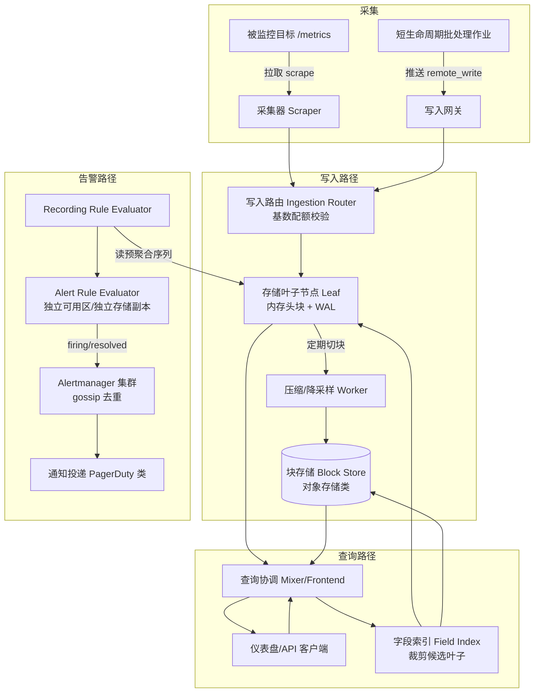

# 设计题解：指标监控与告警（Metrics, Monitoring & Alerting）

## 题目与范围

面试官通常这样开场："设计一个指标监控与告警（monitoring and alerting）系统：成千上万台主机和服务
上报数值型时间序列（time series），工程师能画图、查询，系统在条件满足时自动通知值班人员。"这句话
背后真正的难点不是"存一堆时间戳加数字"，而是**这个系统必须在它自己要监控的那类故障发生时依然可用
——它不能和被监控对象共享命运**，这个约束贯穿写路径、查询路径和告警路径的每一个决策。

值得当场问清楚的澄清问题，以及它们各自改变的设计决策：

- **指标只到主机/容器粒度，还是允许业务方自定义任意标签（label）？** 如果标签完全开放，某个标签
  意外携带了高基数（cardinality）字段（如 `user_id`），整个系统的规模天花板会被这一个标签决定，
  见「深入探讨」第 3 节——这决定了要不要在写入路径上做基数配额。
- **采集用拉（pull/scrape）还是推（push）模型，被监控方和采集方谁主动发起连接？** 决定"目标不可达"
  这件事谁先知道、多快知道，见「深入探讨」第 1 节。
- **告警评估的时延要求有多严格？** 决定评估路径能不能复用交互式查询引擎，还是必须有独立的低延迟
  路径，见「深入探讨」第 6 节。
- **要不要支持多个团队/产品线共享同一套系统（多租户）？** 决定要不要做资源隔离与配额，见「深入
  探讨」第 7 节。
- **历史数据保留多久，精度要求如何随时间衰减？** 决定分层降采样（downsampling）的窗口划分，见
  「深入探讨」第 4 节。

**范围内**：数值型时间序列（counter/gauge/histogram）的采集、写入、压缩存储、降采样、类
PromQL 的查询与聚合、告警规则评估与通知触发。**范围外**：结构化日志与分布式追踪的存储检索（这
两者与指标共同构成可观测性的三支柱，参见 [[reliability.observability|Observability]]，本题
只做 metrics 这一支）；异常检测模型的训练；容量规划与预测；on-call 排班和升级（escalation）策略
的产品细节（只讨论告警评估与通知投递本身的机制）。

## 需求

**功能需求（驱动设计的 3–5 条）**

1. 任意服务/主机能以标准协议上报数值型时间序列，数据在秒级延迟内可被查询。
2. 用户能写查询表达式，对指标做时间窗口过滤、跨序列聚合（按标签分组求和/平均/分位数）与运算，
   并在仪表盘上渲染。
3. 用户能定义告警规则（阈值或表达式），规则持续评估，条件持续满足超过设定时长后触发通知。
4. 历史数据按预定义策略自动降采样并最终过期，不需要人工介入清理。
5. 一个租户的异常查询或异常写入模式不能拖慢其他租户。

**非功能需求（数字化）**

- **写入可用性**：99.99%——监控系统本身故障发生的那一刻，恰恰是数据最重要的时刻，不能把它当成
  一个普通的内部工具来对待。
- **写入延迟**：样本从产生到可被查询，P99 < 15 秒（这是告警能否及时感知的前提）。
- **查询延迟**：仪表盘常见窗口（最近 1 小时、数十条序列）P99 < 500ms；跨天/跨周的大范围聚合查询
  可接受秒级。
- **告警评估延迟**：规则条件满足到通知发出，P99 < 1 分钟。
- **数据持久性**：原始精度数据至少保留 15 天不丢；降采样后的历史数据允许有损（近似），但不允许
  静默丢弃到查询返回错误结果而不报错。
- **一致性**：最终一致——同一时刻两次查询允许看到最新几秒数据的细微差异，但降采样/压缩过程必须
  幂等且保序，不能把已经写入的旧数据错误覆盖。

## 容量估算

估算的核心不是"一年存多少字节"，而是**基数（有多少条独立时间序列）如何独立于采样率决定成本，
以及分层保留能把存储压缩到什么量级**——这两个数字直接决定「深入探讨」里最重要的两个设计决策。

**基础假设**：5 万台主机/容器，每台平均暴露 2,000 条独立时间序列（CPU、内存、磁盘、网络等按核心/
挂载点/网卡展开），抓取（scrape）间隔 15 秒。

```
total_active_series = 50,000 × 2,000 = 100,000,000（1 亿）
ingest QPS(avg) = 100,000,000 / 15 ≈ 6,666,667
ingest QPS(peak, ×1.3，抓取本身可错峰调度，峰值系数远小于用户请求流量) ≈ 8,666,667
```

**这是第一个决定架构的数字**：1 亿条活跃序列、667 万样本/秒的写入速率，逼出写路径必须做到"每个
样本不能有一次随机磁盘 I/O"，否则任何磁盘都扛不住（见「深入探讨」第 2 节）。

**压缩后的字节/样本**（用 Gorilla 式 delta-of-delta 时间戳 + XOR 数值压缩，机制见「深入探讨」
第 2 节，具体数字来自本文对该算法的实现与模拟，不是照抄任何单一来源）：对稳定增长的计数器
（counter）类指标，模拟结果约 2.54 字节/样本；对持续小幅波动的仪表（gauge）类指标，模拟结果约
7.13 字节/样本。按 70% 计数器 / 30% 波动仪表的假设混合：

```
blended_bytes_per_sample = 0.7 × 2.5432 + 0.3 × 7.1279 ≈ 3.92 字节/样本
raw_bytes_per_day = 6,666,667 × 86,400 × 3.92 ≈ 2,257 GB/天
```

**分层保留**（原始精度 15 天，1 分钟降采样 90 天，1 小时降采样 730 天，机制见「深入探讨」第 4
节）：

```
raw 层（15 天）  ≈ 2,257 GB/天 × 15  ≈ 33.9 TB
1m 层降采样系数 = 60/15 = 4x   → 90 天 ≈ 50.8 TB
1h 层降采样系数 = 3600/15 = 240x → 730 天 ≈ 6.9 TB
分层合计 ≈ 91.5 TB
```

**这是第二个决定架构的数字**：如果不做分层，把原始精度一直保留 2 年，存储会膨胀到约 1,648 TB
（`2,257GB × 730 天`）——分层保留把这个数字压到 91.5 TB，降低约 18 倍。这也是为什么「常见错误」
里"只讨论存储容量"是一个不成立的简化——真正该展示给面试官的是这个 18 倍的杠杆从哪里来，而不是
一个孤立的 GB 数字。

**基数爆炸的对照**（说明为什么基数比采样率危险得多，完整推导见「深入探讨」第 3 节）：一个正常
设计的指标（按实例 × 接口 × 状态类分组）产生 `500 × 20 × 5 = 50,000` 条序列；如果误加一个
1000 万基数的 `user_id` 标签，序列数变成 `50,000 × 10,000,000 = 5×10^11`（5,000 亿）——是原
序列数的 1000 万倍。相比之下，把抓取频率从 15 秒改成 7.5 秒只会让成本线性翻倍。这个非对称正是
本设计在写入路径强制基数配额的理由。

## 核心实体与 API

**实体**

- **MetricDescriptor**：`name, type(counter|gauge|histogram), unit, help` ——一个指标名字的
  元信息，不含标签，用于查询时的自动补全和文档展示。
- **Series**：`series_id(hash of sorted labels), metric_name, labels{}` ——一条唯一的时间序列，
  由指标名加一组已排序的标签键值对唯一确定；`series_id` 是所有存储和索引的主键。
- **Sample**：`series_id, timestamp, value` ——最原子的数据点，从不单独更新，只追加。
- **Block**：`time_range, chunks[], index` ——一段固定时间窗口（默认 2 小时）内所有序列的不可变
  压缩数据，是压缩、查询、过期删除的基本单位。
- **RecordingRule**：`expr, output_metric_name, eval_interval` ——持续把一个查询表达式的结果
  写回成一条新的低基数序列，供告警规则读取（见「深入探讨」第 6 节），避免告警在评估时刻才现场
  扫描原始高基数数据。
- **AlertRule**：`expr, for_duration, labels, annotations, severity` ——条件表达式加上"必须持续
  满足多久才算真正触发"的去抖窗口。

**API**

```
POST /api/v1/write        {tenant, series[]:{labels{}, samples[]:{ts,value}}}
                           批量、幂等写入：同一 (series_id, timestamp) 重复提交同一 value 是
                           no-op；提交不同 value 视为迟到数据冲突，按乱序策略处理，不静默覆盖。
                           供无法被拉取的短生命周期批处理作业使用（见「深入探讨」第 1 节）。
GET  /targets/{id}/metrics 每个被拉取目标自己暴露的端点（文本或 protobuf 编码），
                           采集器周期性地对它发起 GET；本系统的采集器是调用方，不是这条路由的
                           实现方。
GET  /api/v1/query?query=&time=          即时查询，返回一个时间点上所有匹配序列的当前值。
GET  /api/v1/query_range?query=&start=&end=&step=
                           区间查询，按 step 生成等间隔的点序列，用于画图；step 越粗，命中
                           的降采样层级越粗（见「深入探讨」第 4 节）。
GET  /api/v1/series?match[]=              按标签匹配返回序列元数据（供自动补全），不返回数值。
POST /api/v1/rules        {tenant, recording_rules[], alert_rules[]}
                           声明式提交规则集合，按 tenant 隔离命名空间。
```

**故意不做的**：不支持对单个历史样本做 `DELETE`（只支持整段时间窗口按保留策略批量过期，避免为
每个样本维护可变状态）；不在查询语言里支持跨指标的关系型 JOIN（只支持按标签匹配的向量运算，复杂
关联查询应该导出到专门的分析系统）；不支持客户端指定任意标签名而不做基数配额校验（写入路径强制
校验，见「深入探讨」第 3 节）。

## 高层设计



**写路径**：采集器对已知目标发起 HTTP 拉取（默认路径），短生命周期批处理作业（生命周期短于一个
抓取间隔，无法被拉到）走写入网关的推送路径。两条路径汇合到写入路由，路由先做**基数配额校验**——
拒绝会让某租户超出配额的新序列（见「深入探讨」第 3 节）——再按 `series_id` 一致性哈希路由到存储
叶子节点。叶子节点技术选型是**内存驻留的时间序列存储引擎**（Prometheus TSDB / Gorilla 一类），
因为写入模式是海量小对象的追加写，需要把最近数据完全放进内存才能达到 15 秒可查询的延迟目标；每次
写入先落 WAL（顺序追加，见「深入探讨」第 2 节）再更新内存头块，保证进程崩溃后可以重放恢复。

**查询路径**：客户端的查询先到协调层（Mixer/Frontend），协调层查一个轻量的字段索引来裁剪出真正
可能持有匹配数据的叶子/存储块（见「深入探讨」第 5 节），只把子查询发给这些候选节点，最后合并结果。
近期数据来自内存叶子节点，历史数据来自对象存储上的压缩块，协调层对客户端屏蔽这个差异。

**告警路径**：Recording Rule Evaluator 持续把高基数原始序列预聚合成低基数的中间序列并写回存储；
Alert Rule Evaluator 只读这些预聚合序列，且部署在与主查询路径**独立的可用区**、走独立的存储读
副本（见「深入探讨」第 6 节），确保它不会和它要监控的那部分基础设施共享同一个故障域。触发的告警
状态发给 Alertmanager 集群，集群内多实例用 gossip 协议互相同步去重状态，任何单实例故障都不会让
通知整体消失。

## 深入探讨

### 采集：拉（pull）与推（push），以及各自撑不住的失效模式

**问题**：采集方式决定的不是"数据怎么传"这么简单，而是"目标不可达"这个信号谁先发现、多快发现、
以及被监控方要不要额外背一份"往哪儿发"的配置。

**方案一：纯推模型**（应用主动把指标推给收集端，StatsD/早期 push-agent 风格）。代价：应用需要
知道并维护收集端点地址——服务发现的方向反过来了，变成被监控方要发现监控方；收集端故障或过载时，
推送方对此完全无感知，只能盲目重试或静默丢弃，"收不到数据"这个现象背后可能是应用真的挂了、也
可能是网络丢了这次推送、也可能是收集端限流丢弃了——三种完全不同的原因，在纯推模型下从数据本身
无法区分。

**方案二（本设计默认路径）：拉模型**。收集端周期性地对已知目标发起 HTTP 拉取；连不上、超时本身
就是一等公民信号（自动生成一条 `up=0` 的序列），不需要额外设计心跳机制。抓取频率、超时时间的
调整只需要改收集端一处配置，不需要重新部署成千上万个被采集的服务——这正是 Prometheus 官方
FAQ 给出的核心论据（见「来源与延伸」）。代价是收集端必须掌握目标的服务发现列表，且对生命周期
短于一个抓取间隔的任务（如几秒钟跑完的批处理作业）根本来不及被拉到。

**取舍（本设计采用）**：拉模型为默认路径；只为"生命周期短于抓取间隔"这一类目标开一条例外的推送
通道（写入网关），并把它当作一个已知的可用性/扩展性风险来对待——它是单一的聚合入口，需要独立
限流和横向扩展，而不是把它当成和拉模型对等的默认方案。

**数字**：把抓取间隔从 15 秒减半到 7.5 秒，写入 QPS 从约 667 万线性翻倍到约 1,333 万——这只是
一次性的容量规划调整；而「深入探讨」第 3 节展示的基数问题是乘法级的，两者不在一个数量级上，这
正是本题"基数而非采样率才是天花板"这个论点的第一个佐证。

### 写路径：内存头块 + WAL + Gorilla 式压缩，实测字节数

**问题**：667 万样本/秒的写入速率下，任何"每个样本一次随机磁盘 I/O、每个样本一条索引更新"的
存储引擎都会被写放大拖垮；同时压缩比不是一个可以照搬别人论文数字的常量，它随指标的实际变化模式
剧烈波动。

**机制**：新样本先进入按 `series_id` 索引的**内存头块**（head block，默认窗口 2 小时——这个
时长同时对齐了 Prometheus TSDB 的默认块时长和 Facebook Gorilla 论文里"超过 2 小时块大小，
压缩收益边际递减"的实测结论，见「来源与延伸」），每次写入先顺序追加到 WAL（write-ahead
log）再更新内存状态，用一次廉价的顺序磁盘写换取崩溃后可重放的持久性，而不必为每个样本付一次
随机写代价。头块内部对同一序列的连续样本做流式压缩：**时间戳用 delta-of-delta 编码**——多数
指标以固定间隔上报，如果本次间隔和上次间隔相同（二阶差为 0），只需 1 个比特；**数值用相邻
样本的 XOR 编码**——数值不变则整个样本只需 1 个比特，变化时按变化的比特窗口是否落在上次窗口
内分两种情况，分别只需要 2 位头 + 有效比特，或 2+5+6 位头 + 有效比特。Facebook 的 Gorilla
论文报告，在其生产集群上这套方案把每个数据点从未压缩的 16 字节（8 字节时间戳 + 8 字节
float64）压缩到平均 1.37 字节，约 12 倍压缩比。

**但压缩比强烈依赖指标本身的变化模式**，不能直接套用 Gorilla 论文的生产集群平均数——本文用
Python 实现了上述算法（真实按位计算 delta-of-delta 分桶与 float64 XOR 的前导/尾随零游程），
在三种合成但有代表性的场景上跑出：

```
场景一：空闲/常量指标（值从不变化）        ≈ 0.70 字节/样本（约 23x 压缩比）
场景二：稳定计数器（每 15s 增加约 40±8）    ≈ 2.54 字节/样本（约 6.3x 压缩比）
场景三：持续小幅波动的仪表（均值 42，噪声标准差 0.4）  ≈ 7.13 字节/样本（约 2.2x 压缩比）
```

场景三压缩效果差的原因是浮点数值的低位尾数在连续噪声下基本随机，XOR 结果的有效比特窗口很少能
复用上一次的位置，大多数样本都要付 2+5+6 位的头部开销。这解释了为什么「容量估算」用 70%/30%
的计数器/波动仪表混合假设算出约 3.92 字节/样本，而不是直接照抄 Gorilla 的 1.37——**一个
容量预算必须按自己指标的真实构成算，而不是照抄另一家公司的生产均值**。

头块每隔固定窗口（2 小时）被压缩 worker 切成不可变块，写入对象存储类的块存储长期保存，索引
（倒排的标签到序列映射）与压缩后的数据块一起持久化，供查询路径直接按标签谓词定位。

### 基数才是扩展的天花板，不是采样率

**问题**：直觉上"数据量大"应该靠加机器、加采样间隔来缓解，但时间序列系统的成本结构不是这样
的——序列数（基数）是乘法维度，采样率只是线性维度，把配额和告警都设计在采样率上而不是基数上，
会在某次误操作里一次性打穿整个集群。

**数字**（承接「容量估算」的对照）：一个按实例 × 接口 × 状态类分组的正常指标产生 `500 × 20 ×
5 = 50,000` 条序列；一旦有人往这个指标上加了一个 1000 万基数的 `user_id` 标签，序列数变成
`50,000 × 10,000,000 = 5×10^11`，是原来的 1000 万倍。按本设计写路径的假设——每条序列在一个
2 小时头块窗口内需要约 480 个压缩样本（`2h/15s`）外加约 200 字节的标签/索引开销（这是本设计
自己的容量假设，不是某个真实系统披露的数字）——正常规模下头块内存约 104 MB，基数爆炸后的
理论内存需求约 1,040 TB（1 PB 级），在任何一台机器或任何合理规模的集群上都不可能实现。

**方案一：不做限制，靠监控和事后清理**。简单，但"事后清理"发生的时候，集群往往已经因为内存
耗尽而不可用——这正是"基数才是天花板"这句话变成真实故障的方式。

**方案二（本设计采用）：写入路径的准入时（admission-time）基数配额**。写入路由在接受一个新
`series_id` 之前，检查该租户当前活跃序列数是否已达配额；超出配额的新序列被拒绝并对调用方返回
明确错误（而不是静默丢弃采集到的数据），迫使问题在它被引入的那一刻就被发现，而不是几小时后靠
集群内存耗尽的故障来发现。这个机制同时也是「深入探讨」第 7 节多租户隔离的第一道防线——配额
本身按租户设定，一个租户的基数爆炸无法侵占另一个租户的预算。

### 降采样与分层保留

**问题**：把每一个 15 秒样本永久保留既昂贵又没有意义——没有人会去对比两年前某个具体 15 秒
时间点的原始数值，但完全删除历史数据又会丢失长期趋势。

**方案一：单一固定保留期**，超过 N 天直接整体删除。实现简单，但保留期设得短则丢失长期趋势
（容量规划需要看季度/年度曲线），设得长则「容量估算」算出的 33.9TB（仅 15 天原始精度）会随
保留期线性膨胀到不可持续的量级。

**方案二（本设计采用）：分层降采样**。原始精度保留 15 天；一个后台 rollup 任务把数据滚动
聚合成 1 分钟粒度（保留 count/sum/min/max，而不是只存均值——只存均值会把尖峰抹平，见「常见
错误」），再保留 90 天；更粗的 1 小时粒度保留 730 天（2 年）。Rollup 任务按固定窗口边界聚合、
以窗口起始时间为 key 做 upsert 而不是追加，这样任务崩溃重放后产生的结果和第一次运行完全一致
（幂等），不会因为重复消费同一段原始数据而重复计数。

**数字**（承接容量估算）：15 天原始层约 33.9TB，90 天 1 分钟层降采样系数 `60/15=4x` 约
50.8TB，730 天 1 小时层降采样系数 `3600/15=240x` 约 6.9TB，合计约 91.5TB；相比把原始精度
一路保留 2 年的 1,648TB，降低约 18 倍。查询路径按请求的 `step` 参数自动路由到能满足该精度
要求的最粗层级，`step` 越大命中越粗的层，天然省去了客户端自己决定"该查哪张表"的负担。

### 查询路径与扇出：避免一次刷新打爆全部存储节点

**问题**：当叶子节点数和总序列数都持续增长后，"协调层把每个查询广播给全部叶子节点、结果客户端
合并"的朴素方案不再可扩展——绝大多数查询按标签谓词本来就只可能命中一小撮叶子，但不做裁剪的
协调层不知道这件事，只能挨个问一遍。

**方案一：朴素全量广播**，协调层把每个查询发给集群里所有叶子节点。简单，但查询成本和集群总
节点数挂钩，而不是和查询本身的选择性挂钩——一个只查某个服务错误率的窄查询，依然要触达整个
集群。

**方案二（本设计采用，参考 Google Monarch 公开披露的架构）：轻量字段索引裁剪**。在每个 zone
和 root 两级各维护一个小体量（Google 披露其 FHI——field hash index——通常只有几 GB 或更小）
的标签哈希索引，记录"哪些叶子/zone 可能持有某个标签谓词的匹配"，查询在真正扇出前先过一遍这个
索引做候选裁剪。Google 公开的数据显示，这套索引能把 zone 级别的查询扇出减少约 99.5%，root
级别减少约 80%。把这两个比例套到本设计自己的拓扑假设上（20 个 zone，每个 zone 500 个存储
叶子，共 10,000 个叶子）：

```
root 层裁剪后触达的 zone 数 = 20 × (1 − 0.80) = 4
每个被选中 zone 内裁剪后触达的叶子数 = 500 × (1 − 0.995) = 2.5 → 约 3
全局裁剪后总共触达的叶子数 ≈ 4 × 3 = 12
朴素广播需要触达的叶子数 = 10,000
扇出降低倍数 ≈ 10,000 / 12 ≈ 833 倍
```

索引本身**不需要绝对精确**——多字段谓词组合可能产生假阳性（一个叶子分别持有满足字段 X 的
目标 A 和满足字段 Y 的目标 B，索引可能误判为该叶子对 `X && Y` 也有匹配，即使没有任何一个
目标同时满足两者），但绝不能有假阴性；真正的精确匹配仍由叶子节点在收到裁剪后的候选子查询时
现场校验，索引只负责把候选集从"全部"缩小到"可能"，正确性从不依赖索引本身精确。

### 告警评估必须在它所报告的那场故障中存活下来

**问题**：告警评估路径最不能失效的时刻，恰恰是它要监控的基础设施正在出故障的时刻——如果评估
读的是和交互式查询相同的存储集群、相同的可用区，那么一次存储区域级故障会让系统在最需要发声的
时候彻底沉默。

**方案一：告警评估复用交互式查询路径**（同一套存储、同一个 region）。实现简单，直接调用已有的
查询引擎，但把告警子系统的可用性和它要报告的那部分基础设施耦合在了一起——"存储区域故障导致没人
被叫醒"是一个真实的失效模式，不是假设。

**方案二（本设计采用）**：告警评估子系统对任何单一存储 region 都不能有硬性同步依赖——这是
[[reliability.observability|Observability]] 领域"依赖上限"这条通用规则（一个服务无法比它同步
调用的硬依赖更可靠）在告警场景下的具体体现：写路径已经把每个样本写入两个独立地理 region（呼应
Gorilla 论文自己的可靠性设计——每个数据点写两个不同区域的主机，节点故障时读请求自动切换到健康
region，见「来源与延伸」），Alert Rule Evaluator 复用同一套读侧故障切换，而不是只有面向用户的
查询路径才享受这个保护。同时，规则评估本身**不直接扫描原始高基数序列**，而是读 Recording
Rule Evaluator 持续预聚合出的低基数中间序列——评估成本因此不随集群总序列数增长。

**数字**：一条告警规则如果直接对「深入探讨」第 3 节的原始 50,000 条序列按 30 秒评估周期现场
扫描，成本约 `50,000/30 ≈ 1,667` 次序列扫描/秒；如果先用一条持续维护的 Recording Rule 把
实例维度聚合掉（按接口 × 状态类聚合成 `20 × 5 = 100` 条序列），评估成本降到
`100/30 ≈ 3.33` 次序列扫描/秒——降低 500 倍，且这个成本此后不再随主机/实例数增长而增长。
通知投递本身（Alertmanager）也是独立的第三个故障域，多实例间用 gossip 协议同步去重状态，
没有单一协调者，避免通知集群自己也变成单点。

### 多租户隔离：一个吵闹的租户不能让所有人变慢

**问题**："一个集群、多个团队共享"的系统会按一个可预测的模式出故障：某个团队的失控查询（超大
时间范围、无过滤条件、密集正则标签匹配）或写入突增（一次错误发布突然让某服务的序列数暴涨到平时
的百倍）会拖慢集群里所有其他租户，即使他们的负载完全正常。

**方案一：不做隔离，先到先服务**（默认线程池、默认连接池）。实现成本最低，但每个租户都要继承
"当前表现最差的那个租户"的尾延迟，一次基数爆炸会变成所有租户共同承担的事故——集群里没有任何
一个租户为此负责，却所有人一起买单。

**方案二（本设计采用，对齐 Google Monarch 公开披露的做法）**：写入侧用「深入探讨」第 3 节的
准入时基数配额，按租户而非全局设定预算；查询侧对每个查询的内存占用做本地和跨节点的双重追踪，
超出租户预算的查询直接被取消；查询执行线程被放进按租户划分的 cgroup，CPU 时间按份额公平分配
而不是先到先得。Google 公开说明 Monarch"作为共享服务运行，查询执行节点上的资源在不同用户
的查询之间共享"，因此需要显式的用户隔离机制——这与本设计选择的方案在机制上一致：配额挡写入侧
的基数爆炸，cgroup 和内存追踪挡查询侧的资源抢占，两条防线独立生效，一个租户的异常永远不会
因为"没有隔离边界"而扩散成全局事故。

## 瓶颈、故障与演进

**热点与倾斜**：读侧热点是一个被大量并发查看的热门仪表盘反复触发同一条聚合查询（几十个查看者、
几秒刷新一次）——给协调层加一层按 `(query, 取整到 step 的时间窗口)` 为 key 的短 TTL 结果缓存，
让同一刷新窗口内的重复查询不必每次都重新扇出。写侧热点是单个租户短时间内大量新增序列（一次
上线意外加了一个标签维度）——「深入探讨」第 3 节的配额天然限制了这类事故的爆炸半径，但一次
真正合理的容量增长（比如新功能确实需要更多序列）仍需要显式提高配额，而不是被配额默默拦住却
没人发现。

**故障域**：

- **采集器/写入路由所在区域不可达**：因为采集是拉模型、无状态，采集器在下一个抓取周期自动重试；
  短暂中断表现为数据出现空洞或 `up=0`，不会破坏已有历史，不需要任何补偿逻辑；中断超过本地缓冲
  窗口则是这段时间窗口内真实的数据丢失，但影响范围严格限定在故障时长内。
- **单个存储叶子节点不可用**：由于每个样本写入两个独立 region（呼应「深入探讨」第 6 节），
  受影响序列的查询自动切换到健康 region，但那个 region 要独自扛住原本由两个 region 分摊的读
  流量，直到故障恢复——这意味着容量规划必须按"整个 region 故障"预留冗余，而不是按稳态负载。
- **查询协调层（Mixer）不可用**：仪表盘无法渲染，但写入路径和告警评估路径（走独立的读侧故障
  切换，见「深入探讨」第 6 节）继续正常工作——告警绝不依赖交互式查询层，这正是那一节论证的
  直接后果。
- **Alertmanager/通知层不可用**：规则依然在内部正常评估、正常触发，但没有人被实际通知到——
  这是唯一一种"系统内部认为一切正常，但值班人员完全不知情"的故障，因此通知层最需要独立于存储
  层的多实例冗余（gossip 去重，无单一协调者），而不是像存储层那样可以靠 region 故障切换来
  兜底。

**10 倍演进**：总序列数从 1 亿到 10 亿。单个 zone 内叶子数量增长，但 zone 级字段索引大小按
Google 披露的经验仍能维持在"几 GB"级别，因为它只索引标签的存在性而不是完整基数，裁剪比例
（百分比）本身不随总量线性膨胀，「深入探讨」第 5 节的扇出降低倍数结构上仍然成立。头块内存需求
（本估算里量级为百 MB 级）会随总序列数同比例增长到 GB 级/租户，此时按 10 倍规模之前设定的
固定租户配额会在新规模下显得过紧，需要把配额从"一个全局常量"改成"按租户历史用量动态调整"，
否则合法的业务增长会被旧配额误伤。

**100 倍演进**：总序列数到百亿级。单一"root 查询层对所有 zone 保持权威视图"的假设不再成立——
不命中字段索引裁剪的宽泛全局聚合查询（没有标签过滤条件的跨 zone 汇总）必须从交互式查询 SLA
里剥离出去，走单独的批处理/流式聚合路径，而不是让交互式路径承诺"任何 PromQL 风格的查询都能在
500ms 内返回"；交互式路径只对"字段索引能有效裁剪的查询"维持这个承诺，这是范围而不是性能上的
让步。

## 面试官会追问什么

**中级（mid）**
- "如果一次抓取超时了，怎么判断是目标本身挂了还是网络丢包？" 从采集器的视角这两者都表现为同一个
  `up=0` 信号，无法仅凭指标本身区分；这正是指标只回答"是否/哪里"、日志和追踪回答"为什么"的
  分工边界，见 [[reliability.observability|Observability]]。
- "为什么不干脆把所有历史数据存进一张按时间戳建索引的大表？" 传统 B-tree 式索引在这个写入速率
  下每次插入都要付一次随机 I/O 和索引更新成本，「深入探讨」第 2 节展示的内存头块 + WAL + 流式
  压缩方案正是为了避开这个代价。

**高级（senior）**
- "如果某个租户的告警规则本身写错了、疯狂触发，会不会拖垮整个通知系统？" 需要在 Alertmanager
  层对每个租户做独立的通知限流/去重，这个防护和「深入探讨」第 7 节的查询/写入隔离是同一思路在
  通知层的延伸，必须独立配置，不能假设上游的配额已经覆盖了这种情况。
- "字段索引本身如果裁剪错了、漏掉了真正该查的叶子怎么办？" 索引在设计上只允许假阳性（多裁剪出
  不必要的候选，代价是稍微更大但仍然安全的扇出），绝不允许假阴性；真正的匹配始终由叶子节点自己
  精确校验，正确性从不依赖索引的精确度。

**参谋级（staff）**
- "两条业务线的指标负载天差地别（一条是每秒百万级高基数交易指标，另一条是低频但保留期极长的
  容量规划指标），要不要physically拆成两个系统？" 优先考虑单一控制面、多资源池加租户级 SLA
  差异化（不同的配额、不同的保留策略），只有当两类负载的资源画像连共享的准入控制都无法低成本
  兼容时，才值得承担拆分成两套独立系统的运维复杂度。
- "监控系统本身谁来监控？" 需要一个刻意做得更简单、独立运维的次级系统（甚至可以是第三方服务）
  盯着主监控系统自己的健康信号（写入延迟、评估延迟、通知成功率），可观测性系统不能把自己的可信
  建立在自己身上。

## 常见错误

- 把采样率当成扩展的主要旋钮，觉得加带宽加 CPU 就能扛住更多指标，没意识到基数才是真正会
  指数级增长的那个维度——「深入探讨」第 3 节的 1000 万倍就是这个误判的真实代价。
- 降采样只保留均值（avg），几个月后再回头查历史数据想确认某次尖峰是否真的超过了告警阈值，
  却发现均值早已把尖峰抹平——rollup 必须同时保留 min/max/count。
- 告警评估直接复用面向用户的查询路径和同一套存储 region，从未真正验证过"存储真的挂了的时候，
  告警到底还响不响"。
- 把推（push）和拉（pull）的选择当成纯技术偏好，没意识到它直接决定"目标不可达"这个信号谁先
  发现、多快发现。
- 只讨论存储容量（"一年存多少 TB"），却没有算清楚查询路径的扇出代价——一个本可以被索引裁剪到
  个位数节点的查询，被设计成广播给全部存储节点。

## 五分钟讲法

This is a metrics monitoring and alerting system where the core constraint is that the
alerting path can never share fate with the infrastructure it watches — if evaluation reads
from the same storage region that just went down, the system goes silent exactly when
paging matters most. At roughly 100 million active time series and about 6.7 million
samples per second, the write path can't afford a random disk write per sample, so incoming
samples land in an in-memory head block backed by a write-ahead log, and get compressed
in place using delta-of-delta timestamps and XOR'd floating-point values — I simulated this
algorithm directly rather than quoting a vendor's headline number, and it ranges from about
0.7 bytes per sample for a flat metric to about 7 bytes for a noisy gauge, which is why a
storage budget has to be computed from your own metric mix. The single most important
design decision is treating cardinality, not sample rate, as the scaling limit: doubling
scrape frequency doubles cost linearly, but one unbounded label like a user id can multiply
series count by ten million times, so the ingestion router enforces per-tenant series quotas
at admission time rather than after the fact. Query fan-out is kept cheap with a small
per-zone and per-root label index that prunes candidate storage leaves before a query is
broadcast, which — applying published reduction rates to my own topology — cuts an
all-leaves query from ten thousand nodes down to roughly a dozen. Alert rules never scan
raw high-cardinality data directly; they read continuously pre-aggregated recording rules,
cutting evaluation cost by around five hundred times in my worked example, and the evaluator
itself reads from an independently replicated storage path so a single region's outage
doesn't also take down the pager. Old data is downsampled into coarser tiers — keeping
count, min and max, not just an average, so historical spikes don't get silently flattened
— which cuts two years of storage by about eighteen times versus keeping raw resolution
forever. At larger scale, the interactive query path stops promising to serve every possible
broad, unfiltered aggregation on a tight SLA, and instead only guarantees that latency for
queries the label index can actually prune well.

## 来源与延伸

- [Gorilla: A Fast, Scalable, In-Memory Time Series Database](https://www.vldb.org/pvldb/vol8/p1816-teller.pdf)
  （Facebook，VLDB 2015，第一方论文）：披露了 delta-of-delta 时间戳编码和 XOR 浮点值编码的
  确切规则、2 小时块大小下 1.37 字节/点的生产集群平均压缩比、96% 的时间戳可压缩到 1 比特、
  51%/30%/19% 的数值 XOR 分桶分布，以及"每个数据点写两个不同地理 region、节点故障时读请求
  自动切到健康 region"的可靠性设计。本文「深入探讨」第 2 节直接实现了论文描述的算法并在三种
  合成场景上重新跑出压缩比，而不是照抄论文的生产集群均值；第 6 节的告警评估容灾设计直接借用了
  论文本身"写两个 region、故障读切换"的思路，应用到告警评估子系统上。
- [Prometheus – Storage](https://prometheus.io/docs/prometheus/latest/storage/)
  （Prometheus 官方文档，第一方）：披露了默认 2 小时块时长、128MB 的 WAL 段大小、压缩后块
  最长可合并到保留期 10%（或 31 天，取更小值）、以及"平均 1–2 字节/样本"的经验数字。本文
  「深入探讨」第 2 节的头块窗口设计对齐这份文档的默认块时长，但没有照搬它的"1–2 字节/样本"
  经验值，而是用自己实现的算法重新计算。
- [Prometheus – FAQ (Why do you pull rather than push?)](https://prometheus.io/docs/introduction/faq/)
  （Prometheus 官方文档，第一方）：给出了拉模型的核心论据——采集端集中控制抓取频率与目标
  配置、抓取失败本身就是一等公民的健康信号。本文「深入探讨」第 1 节采纳了这个论据作为默认路径
  的理由，但额外补充了"仍需要为短生命周期批处理作业保留一条推送例外通道"这一点，官方 FAQ 更
  多是原则性论述，没有展开这条例外路径的取舍。
- [Monarch: Google's Planet-Scale In-Memory Time Series Database](https://www.vldb.org/pvldb/vol13/p3181-adams.pdf)
  （Google，VLDB 2020，第一方论文）：披露了 leaf/mixer/root 的分层查询架构、field hash
  index（FHI）把 zone 级查询扇出减少约 99.5%、root 级减少约 80%，以及多租户场景下"按用户
  追踪查询内存占用、超预算取消查询"和"查询线程放入按用户划分的 cgroup"的隔离机制。本文
  「深入探讨」第 5 节把论文披露的两个百分比套用到本设计自己假设的 20 zone × 500 leaf 拓扑上，
  重新算出约 833 倍的扇出降低，这个具体倍数是本文的计算，不是论文本身给出的数字；第 7 节的
  多租户隔离机制直接采纳了论文披露的两条真实机制。
