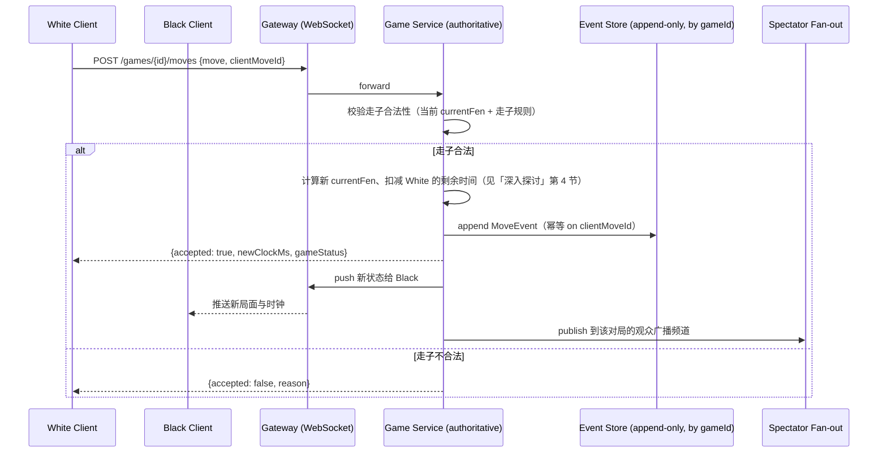

# 设计题解：在线多人对战游戏（Online Multiplayer Game，以国际象棋为例）

## 题目与范围

面试官通常这样开场："设计一个像 Lichess 或 Chess.com 那样的在线对战平台：两个玩家被匹配
到一局对弈，走子要被规则校验，双方各有一个倒计时钟，任何一方可能掉线，还可能有大量观众
围观一场热门对局。" 这句话背后真正的难点不是"存一盘棋"，而是**服务器必须是这局对弈的唯一
权威——谁赢、轮到谁走、钟表还剩多少时间，全部由服务器说了算，而不是由任何一个客户端的
本地状态决定**，同时这套权威判定还要在网络延迟和掉线面前保持公平。

值得当场问清楚的澄清问题，以及它们各自改变的设计决策：

- **是回合制（国际象棋这类）还是每秒需要处理大量状态更新的快节奏实时对战（像 FPS/MOBA）？**
  这是本题最大的分叉点。回合制里，"权威服务器"主要体现在校验走子合法性和裁定胜负；快节奏
  实时对战里，服务器要以几十到上百赫兹的频率持续模拟整个世界状态，这不是同一个数量级的
  问题（见「深入探讨」第 2 节的具体倍数对比）。本题以国际象棋为主线，因为这是多数免费
  资料实际覆盖的题目，但在权威服务器、时钟补偿等每一个关键决策点，都说明快节奏实时游戏
  会有什么不同。
- **走子延迟的容忍度是多少？** 决定要不要做客户端预测（client-side prediction）——回合制
  下，走一步棋本身就有几秒到几十秒的思考时间做缓冲，网络延迟的几十毫秒几乎不可感知，客户端
  预测的收益远不如快节奏游戏那么关键，但仍然需要"走子确认前先在本地乐观展示"这个基础体验。
- **观众规模要不要支持到几十万人围观一场热门对局（比如世界冠军赛）？** 决定要不要做「深入
  探讨」第 6 节的广播扇出，不做的话观众功能可以退化成简单的轮询。
- **掉线之后要不要允许重连继续对局，还是直接判负？** 决定「深入探讨」第 5 节的断线宽限期
  机制要不要存在——本题按允许重连设计，因为这是所有主流对战平台的真实做法，也是这道题
  最容易被面试官追问细节的地方。
- **要不要做反作弊（检测用引擎辅助）？** 决定要不要做「深入探讨」第 7 节——本题按需要做，
  因为这是竞技类对战产品无法回避的问题。

**范围内**：按分数匹配、权威走子校验与对局状态机、对局状态存储与回放、时钟与用时制式在
延迟下的公平性、断线重连与放弃判负、观众广播、统计类反作弊。**范围外**：具体的棋局分析/
引擎评估功能、锦标赛赛制编排、社交关系（好友/俱乐部）、支付与会员体系。连接管理的通用
机制（心跳、重连、会话目录）不在本题重复展开，见 [[solution-chat-messaging]]。

## 需求

**功能需求（3–5 条驱动设计的核心项）**

1. 两名玩家可以按评分（rating）被匹配到一局对弈，等待时间和匹配质量之间要有明确的权衡
   策略。
2. 每一步走子都必须经过服务器校验（合法性、将军/将死判定），任何一方看到的棋盘状态最终
   都以服务器为准。
3. 双方各自的用时制式（time control）倒计时必须在网络延迟存在的情况下保持公平——不能因为
   网络抖动就让某一方"被偷走"时间，也不能被利用来无限拖延。
4. 一方掉线后，对局不应立刻判负，需要给出合理的重连宽限期；宽限期耗尽后另一方可以选择
   继续等待、提和或直接获胜。
5. 支持观众实时围观一场对局，观众规模可能从个位数到（热门赛事）几十万。

**非功能需求（数字化）**

- **走子确认延迟**：本地乐观展示即时（0ms 感知延迟），服务器确认的权威回执 P99 < 200ms
  （同区域）——这个数字比多数即时通讯类产品更宽松，因为回合制走子之间本身有秒级的思考
  间隔，不需要像实时射击游戏那样苛求个位数毫秒。
- **一致性**：对局状态强一致——同一时刻双方看到的合法走子集合、剩余时间、胜负判定必须
  完全一致，这是竞技公平性的底线，不能用"最终一致"打折扣。
- **可用性**：进行中对局的服务目标 99.95%（一局正在进行的对弈中断，对玩家体验是灾难性的）；
  匹配入口和观众功能可以稍低（99.9%），短暂不可用可以靠客户端重试吸收。
- **持久性**：每一步走子必须先持久化（或至少写入可重放的日志）才能确认——这是断线重连和
  赛后复盘都要依赖的前提，丢失一步走子记录等同于让对局记录变得不可信。

## 容量估算

估算的核心不是"存多少棋局"，而是**并发对局数、走子事件速率，以及它们和"一场真正的实时
游戏"比起来低了几个数量级**——这个对比决定了权威服务器要用什么频率运转。

**基础假设**：日活用户（DAU）500 万，其中 10% 每天至少下一局，平均每人每天下 5 局：

```
games/day = 5,000,000 × 0.10 × 5 = 2,500,000
```

这个量级和 Lichess 公开披露的"每天约 150 万到 200 万局对弈"是同一数量级（见「来源与
延伸」），可以作为本设计假设合理性的一个交叉验证。

**走子事件速率**：假设一局平均 70 步（半回合，plies，混合了快棋/超快棋/慢棋后的平均值）：

```
moves/day = 2,500,000 × 70 = 175,000,000
avg move QPS = 175,000,000 / 86,400 ≈ 2,025.5
peak move QPS(×3 晚间高峰系数) ≈ 6,076.4
```

**并发对局数**：假设一局平均持续 8 分钟（480 秒，混合各种用时制式后的平均值）：

```
concurrent games(avg) = 2,500,000 × 480 / 86,400 ≈ 13,889
concurrent games(peak, ×3) ≈ 41,667
concurrent players(peak) = 41,667 × 2 ≈ 83,333
```

这个峰值并发玩家数和 Lichess 公开披露的"日常稳定维持 10 万+并发玩家"同一数量级（本设计
假设的 DAU 比 Lichess 真实规模小一些，绝对值略低符合预期）——这是第二个交叉验证，用来
确认容量估算没有算出一个荒谬的数字（比如把走子频率算成几秒一次这种不现实的密度）。

**单局内的走子密度**：

```
一局内平均走子间隔 = 480s / 70 ≈ 6.86 秒/步
```

这个数字很重要：**它说明为什么回合制游戏的权威服务器不需要持续模拟**——一局对弈里，服务器
平均每 6.86 秒才需要处理一次走子事件，绝大部分时间里这局的服务端状态是"空闲等待输入"，
而不是像下一节要对比的快节奏实时游戏那样需要以几十上百赫兹的频率连续模拟。

**对局状态存储**：假设最终棋谱记录（走子序列 + 元数据）平均 800 字节：

```
final_store/year = 2,500,000 × 365 × 800B ≈ 730 GB
三副本 ≈ 2,190 GB
```

**用于回放的事件日志**：每步走子的完整事件（走法、服务器时间戳、双方剩余时间）平均
40 字节/事件，一局 70 步：

```
event_log/game = 70 × 40B = 2,800 B
event_log/year = 2,500,000 × 365 × 2,800B ≈ 2,555 GB
三副本 ≈ 7,665 GB
```

对比 Lichess 公开披露的"MongoDB 里存了超过 120 亿局对弈"，按同样的 800B/局估算，量级
在近 10 TB——和 Lichess 真实数据库的体量同处 TB 级，进一步交叉验证了单局存储量假设没有
离谱。**结论**：和信息流一类系统不同，这道题的存储字节数始终是个位数到两位数 TB/年，从来
不是这道题的瓶颈——真正的瓶颈是**并发对局数量下，每一局都要求强一致、低延迟的独立状态机**，
这是容量估算里最值得强调的对比。

## 核心实体与 API

**实体**

- **Player**：`id, rating, ratingDeviation`——评分采用 Glicko-2 一类的系统，`rating`
  之外额外维护一个不确定度（deviation），新玩家或久未对弈的玩家不确定度更高，直接影响
  匹配宽窗的初始状态（见「深入探讨」第 1 节）。
- **Game**：`id, whiteId, blackId, timeControl, status(active/finished/aborted),
  currentFen, whiteClockMs, blackClockMs, lastMoveAt`——权威状态的核心，`currentFen`
  是当前局面的规范化表示，不是靠重放全部走子实时算出来的（见「高层设计」）。
- **MoveEvent**：`gameId, ply, move, serverTimestamp, clockAfterMs`——不可变的追加事件，
  是对局回放和赛后复盘的数据源，也是断线重连时重建客户端状态的依据。
- **MatchmakingTicket**：`playerId, rating, ratingWindow, createdAt`——排队中的匹配请求，
  `ratingWindow` 随排队时长增长（见「深入探讨」第 1 节）。

**API**

```
POST   /matchmaking/tickets       {timeControl}
                                   → {ticketId}，匹配成功后通过推送通知 gameId
DELETE /matchmaking/tickets/{id}  取消排队
POST   /games/{id}/moves          {move, clientMoveId}
                                   按 clientMoveId 幂等 → {accepted, newClockMs, gameStatus}
GET    /games/{id}                → 当前权威状态快照（用于重连后的状态重建）
WSS    /games/{id}/stream         走子与时钟的实时推送（对局双方与观众共用同一个推送通道，
                                   见「深入探讨」第 6 节）
POST   /games/{id}/resign
POST   /games/{id}/draw-offer
```

**故意不做的**：不允许客户端直接写入 `currentFen` 或时钟字段——这两个字段永远只能由服务器
根据校验通过的 `MoveEvent` 推导，客户端提交的走子只是一个"意图"，被接受与否、时间怎么扣，
完全由服务器决定；不支持"撤回已确认的走子"这个操作（只能通过提和/认输结束对局，避免破坏
状态机的单调性）；不在这个 API 层暴露反作弊的判定细节（见「深入探讨」第 7 节，检测结果走
独立的、面向管理端的接口）。

## 高层设计



**权威路径**：Game Service 持有每局对弈的权威状态（`currentFen` + 双方剩余时间），走子
请求先经过合法性校验，通过后才追加写入 Event Store 并回执——**先持久化、后确认**，这和
即时通讯里"先持久化后 ACK"的红线是同一个原则（见 [[solution-chat-messaging]]）。Event
Store 用宽列/文档存储（Cassandra/MongoDB 一类），按 `gameId` 分区，因为一局对弈内部的
走子必须严格有序、跨对局之间完全独立，不需要任何跨对局事务。

**每局一个状态机**：每局对弈的权威状态由恰好一个逻辑上的单线程 actor（或等价的单分区
状态机）持有，同一局的走子请求在这个 actor 内部串行处理——这直接排除了"两步几乎同时到达
的走子谁先谁后"这类竞态问题，不需要额外的分布式锁。Lichess 的真实实现（见「来源与延伸」）
正是给每局对弈一个独立的 actor 实例，把可变的对局状态放在进程内存里而不是共享堆上，本
设计采用同一个思路。

**观众路径**：走子确认后，Game Service 把新状态发布到该对局专属的广播频道，Gateway 把它
推给所有订阅这局的观众连接。日常规模下这条路径和"推给对局双方"没有本质区别，只是订阅者
从 2 个变成 N 个；但当 N 达到几十万（热门赛事）时，这变成一个和直播评论同构的扇出问题，
见「深入探讨」第 6 节和 [[solution-live-comments]]。

## 深入探讨

### 按分数扩窗匹配（widening rating window matchmaking）

**问题**：如果匹配严格要求"评分差在 ±100 以内才能配对"，排队等待时间会随在线人数和评分
分布双重影响——冷门时段或评分分布的尾部（评分极高或极低的玩家），可能长时间找不到符合
窗口的对手；但如果一开始就用很宽的窗口，又会让实力悬殊的对局频繁发生，破坏匹配质量。

**方案一：固定窄窗口**。匹配质量高，但在玩家基数不够大的时段/评分段，排队时间不可控，
可能长达数分钟甚至更久。

**方案二：固定宽窗口**。排队时间短，但牺牲匹配质量，高分段玩家可能被配到明显较弱的对手，
损害竞技体验和评分系统本身的准确性（评分更新假设对局双方实力接近）。

**方案三（本设计采用）：窗口随等待时长线性扩大**。玩家入队时窗口是 ±100，此后每等待 2
秒，窗口两端各扩大 50：

```
扩到 ±200 需要等待 (200-100)/50 × 2 = 4 秒
扩到 ±400 需要等待 (400-100)/50 × 2 = 12 秒
扩到 ±600 需要等待 (600-100)/50 × 2 = 20 秒
```

短等待时间下保持严格的匹配质量，长时间找不到对手时逐步放宽，用等待时间换匹配质量，而不是
在两者之间做一次性的固定取舍。评分本身的不确定度（`ratingDeviation`）越高（新玩家、久未
对弈的玩家），初始窗口也应该更宽——因为这类玩家的评分本身就不够可信，严格窗口对他们意义
不大。

### 权威服务器与走子校验：回合制和快节奏实时游戏的同与不同

**问题**：无论回合制还是快节奏实时游戏，"服务器是唯一权威、绝不信任客户端上报的世界状态"
这条原则完全一样——Riot 在 Valorant 的网络架构文章里把这句话原文写成"a server must never
trust a client's view of the world"（见「来源与延伸」）。但两类游戏对服务器**运转频率**
的要求差了几个数量级，这是候选人最容易混淆、也最容易被面试官用来考察"是否真的理解权威
服务器这个概念"的地方。

**回合制（本设计的国际象棋）**：容量估算算出单局内平均走子间隔约 6.86 秒——服务器绝大部分
时间处于空闲等待，只在收到一次走子请求时才做一次工作量很小的计算（合法走子生成 + 将军/
将死判定），不需要任何固定频率的循环。

**快节奏实时游戏（对比，参考 Valorant 的公开网络架构）**：服务器必须以固定频率（Valorant
是 128 tick/秒，即每 7.8125 毫秒推进一次世界状态）持续模拟，不论这段时间里有没有玩家输入。
按容量估算的走子密度换算：

```
实时游戏事件速率 / 回合制走子速率 = 128 / (1/6.86) ≈ 878 倍
```

也就是说，同样一局对弈占用服务器的"活跃处理频率"，实时游戏比回合制高出近三个数量级——这
就是为什么 Valorant 需要专门把单帧处理时间优化到约 2.3 毫秒，才能让一个 CPU 核心在
7.8 毫秒的 tick 窗口内塞下三局并发游戏，而一台国际象棋对局服务器可以用极低的空闲开销
同时持有成千上万个"大部分时间在睡觉"的对局 actor。

**延迟处理上的分野**：回合制下，走一步棋本身有秒级的思考间隔，网络延迟的几十毫秒几乎
不影响体验，本设计的做法是客户端提交走子后立刻本地乐观展示（不等待服务器确认），但**不**
需要像快节奏游戏那样做完整的客户端预测 + 服务器回滚重放（client-side prediction +
server reconciliation，Gabriel Gambetta 的 Fast-Paced Multiplayer 系列对此有完整推导，
见「来源与延伸」）——因为回合制走子一旦提交就不会被"预测错误"影响下一步的连续手感。快节奏
游戏里，Valorant 的开枪判定走的是"客户端上报自己开火时刻在本地时间线上看到的世界状态，
服务器据此回退（rewind）到那个时刻做命中判定"这种时间线同步式的滞后补偿——这类机制在
回合制里没有对应物，因为回合制不存在"连续世界状态"需要被回退。

### 对局状态存储与用于回放的事件日志

**问题**：`Game` 实体的 `currentFen` 是权威状态，但如果只存最新局面，掉线重连、赛后复盘、
争议仲裁都没有历史可查；如果把每一步都当成完整对局记录重复存储，容量估算里的存储量会
不必要地膨胀。

**方案（本设计采用）**：`Game` 表只存**当前**权威状态（用于快速读取"现在棋盘长什么样"），
完整历史走在一条独立的、按 `gameId` 分区的追加日志（`MoveEvent`）里——这是典型的"当前状态
表 + 事件日志"分层，`Game.currentFen` 本质上是这条事件日志的一个物化视图，可以从
`MoveEvent` 序列完全重建。容量估算把两者分开算：最终棋谱记录约 730 GB/年（三副本约
2,190 GB），完整逐步事件日志约 2,555 GB/年（三副本约 7,665 GB）——量级都在个位数 TB，
不是这道题的瓶颈，但两者服务的目的不同：前者支撑"浏览历史对局列表"这类轻量查询，后者
支撑断线重连时重建客户端状态、逐步回放、以及赛后对争议走子的仲裁。

### 用时制式在延迟下的存活：服务器时钟与走子级滞后补偿

**问题**：如果服务器严格按"收到走子请求的那一刻"来计时，网络延迟会实打实地从玩家的思考
时间里被扣掉——走子请求在网络上多花 300 毫秒，这 300 毫秒的延迟就变成了玩家自己的时间
损失，玩家会感觉"我的网络卡了，结果我的钟被偷走了"，这在快棋/超快棋这类用时本就很紧张的
制式下尤其不公平。

**方案一：完全信任客户端上报的思考用时**。玩家体验最公平，但客户端可以谎报"我只想了 0.1
秒"来变相作弊，破坏了"服务器是唯一权威"这条底线——这个方案在信任模型上不成立。

**方案二（本设计采用）：服务器计时为准，叠加一个固定的走子级滞后补偿（lag
compensation）**。服务器仍然以自己收到走子请求的时间戳为准来扣减玩家剩余时间——这保持了
权威性，不给客户端谎报的空间；但每一步走子扣减的时间会先减去一个小的固定补偿值（比如
100–200 毫秒这个量级，本设计的假设值，用来吸收正常的网络抖动，不代表任何具体平台的真实
参数），超出补偿值的部分才真正从玩家的钟里扣除。这个思路和 Gambetta 在 Fast-Paced
Multiplayer 系列里讨论的"服务器为权威时间源、但预留一点缓冲来吸收正常延迟"是同一类设计
哲学的回合制版本——核心都是"服务器仍然说了算，只是愿意为可预期的网络延迟留一点余量"，
区别只在于快节奏游戏里这个余量作用在世界状态的时间线回退上，这里作用在时钟扣减上。

### 断线重连与被放弃的对局

**问题**：一方掉线后，直接判负对偶发的网络抖动（比如 Wi-Fi 短暂重连）过于严厉；但完全不
设时限地等待，又让恶意"卡对方"（故意断网拖延，利用对手不愿放弃胜利的心理不去认输）成为
可能的骚扰手段。

**方案（本设计采用）**：每局对弈维护一个独立于双方剩余时间的"断线宽限池"——玩家掉线后，
这段离线时长从宽限池里扣，而不是从对局本身的思考用时里扣（避免把网络问题和棋局用时混为
一谈）；宽限池耗尽后，对手被赋予"继续等待 / 提和 / 直接判负对手"的选择权，而不是系统自动
认定结果。宽限池的初始额度应当**随用时制式变长而变长**——一局用时几十分钟的慢棋值得给
更长的重连窗口，一局用时几十秒的超快棋则不然，否则一次掉线足以毁掉整局对弈的公平性。这
条机制和 Chess.com 真实经历过的"服务器过载导致大量玩家掉线"事故（见「瓶颈、故障与演进」）
说明的是同一个道理：断线处理不是一个可以事后补的边角功能，用户基数越大，单位时间内真实
发生的掉线绝对数量就越可观。

### 观众规模化：从单局广播到直播评论同款的扇出问题

**问题**：日常一局对弈只有个位数观众，Game Service 直接把每次走子广播给这几个订阅者毫无
压力；但一场世界冠军赛级别的对局可能同时吸引几十万观众订阅同一个 `gameId` 的广播频道——
这时候"每次走子都要推给频道内全部订阅者"，本质上和直播评论里"一条评论要广播给同一场直播
的全部观众"是同一个扇出放大问题，只是这里的广播事件（走子）频率低得多（容量估算给出
6.86 秒一次，远低于直播评论的评论产生速率）。

**方案（本设计采用）**：复用 [[solution-live-comments]] 里验证过的架构——按 `gameId`
分区的广播总线 + 网关层的连接扇出，而不是让 Game Service 自己维护几十万条长连接。由于
走子事件本身的速率远低于直播评论（这里是个位数事件/分钟级，不是持续的评论流），不需要
直播评论方案里的"采样/限速"这道降级策略——观众规模带来的压力主要在连接数和扇出宽度上，
不在事件产生速率上，这是两道题看似同构、实则瓶颈不同的地方。

### 反作弊

**问题**：对战类竞技产品最典型的作弊是借助外部引擎辅助决策——这和在线判题题里的代码抄袭
或多账号完全是另一类问题，需要统计而非规则匹配的检测手段，而且检测本身天然带有不确定性，
不能简单地"发现即封号"。

**方案（本设计采用）**：采用统计模型思路，学术上最有代表性的是 Ken Regan 提出的"内在表现
评分"（Intrinsic Performance Rating，IPR，见「来源与延伸」）——把一名玩家一局或一段时间内
走子质量的分布，和该玩家官方评分下"正常应有的走子质量分布"做比较，差异转换成 z-score
这样的统计显著性指标，差异越大、越不可能是巧合，可疑程度越高。Chess.com 和 Lichess 是否
公开了各自具体的检测算法参数，目前没有可靠的第一手资料（这一点本身也说明了检测细节保密
是这类系统的通行做法，公开参数等于给作弊者提供规避指南）——本设计只采纳"统计可疑度打分，
触发人工复核而非自动定论"这个结构性原则，和「深入探讨」第 7 节代码抄袭检测的处理方式
是同一个道理：自动化系统输出的是一个排序好的复核队列，不是最终判决。

## 瓶颈、故障与演进

**热点与倾斜**：一场热门赛事的单一 `gameId` 是最典型的读侧热点——几十万观众订阅同一个
广播频道，这和「深入探讨」第 6 节讨论的问题是同一件事；写侧热点相对少见，因为走子写入
天然按 `gameId` 均匀分散，不存在类似"名人账号"那样天然倾斜的分布。

**故障域（真实案例）**：Chess.com 在用户量快速增长期间公开记录过一次真实的服务器过载
事故——日活用户在一个月内从约 700 万涨到超过 1,100 万，单日新增注册一度达到 403,000，
导致两类典型故障：数据库过载引发的 502 错误，以及负责实时对局的 Live Server 过载导致
大量玩家掉线（见「来源与延伸」）。这次事故最终推动 Chess.com 把原本单体的 Live Server
重写为可以跨多台机器水平扩展的分布式服务，并对数据库做分片拆分——这是一个很好的反例，
说明"每局一个 actor"这类单机内存状态设计如果背后只有一台服务器兜底，用户基数一旦跨过
某个量级就会成为单点故障，必须尽早规划成可以跨机器水平扩展、状态按 `gameId` 分片的架构，
而不是等到过载事故发生后才补救。

**其他故障模式**：
- **Event Store 不可用**：正在进行的对局无法确认新走子，客户端应展示"连接中"而不是让
  玩家误以为走子已经生效；服务恢复后从最后一次成功写入继续。
- **观众广播通道故障**：对局本身（双方玩家的权威状态和走子确认）不受影响，只是观众看到
  的画面暂时停滞，恢复后观众端可以用 `GET /games/{id}` 拉取当前权威快照补齐差距，这和
  信息流设计里"排行榜/缓存故障时退化到重建"是同一类降级思路。
- **匹配服务不可用**：新对局无法生成，但所有进行中的对局不受影响，因为匹配服务和 Game
  Service 是两个独立的故障域。

**10 倍演进**：DAU 从 500 万到 5,000 万，峰值并发对局从约 4.2 万到约 41.7 万，单一的
Event Store 集群和广播总线不再够用，需要按 `gameId` 哈希分片到多个物理隔离的集群——这
和信息流设计里"inbox 缓存按 user_id 物理隔离"是同一个模式，只是分片键从 `user_id` 换成
`gameId`。观众广播路径在这个规模下会更频繁地遇到「深入探讨」第 6 节描述的单场超大规模
观赛事件，需要提前预留类似直播评论方案里的降级开关，即便日常不需要用到。

**100 倍演进**：如果要支持真正的快节奏实时对战玩法（题目澄清阶段讨论的分叉），架构不能
简单复用——权威服务器需要从"事件驱动、按需计算"转向「深入探讨」第 2 节描述的固定频率
tick 循环，服务器容量规划的单位也从"并发对局数"变成"每核心能同时承载多少个 tick 循环"，
这是两类游戏在 100 倍规模下路径彻底分岔的地方，不是简单的参数调大。

## 面试官会追问什么

**中级（mid）**
- "为什么走子请求要经过服务器校验，客户端自己校验合法性不行吗？" 客户端校验只能防止
  UI 层面的误操作，无法防止恶意客户端直接伪造非法走子请求；服务器是唯一权威，任何判定
  都不能依赖客户端自己的诚实。
- "掉线的玩家应该立刻判负吗？" 不应该，需要一个和对局本身用时脱钩的断线宽限池，宽限期后
  才把选择权交给对手，而不是系统自动判定。

**高级（senior）**
- "匹配窗口为什么要随等待时间扩大，而不是一开始就用一个折中的固定宽度？" 固定宽度是在
  "匹配质量"和"等待时间"之间做一次性取舍，无法同时在两端都表现好；随等待时间扩大的窗口
  让系统在短等待时保持高质量，只在确实找不到对手时才牺牲质量换时间。
- "回合制游戏的权威服务器和实时射击游戏的权威服务器，本质上是同一个东西吗？" 核心原则
  相同（绝不信任客户端上报的世界状态），但运转频率差几个数量级——回合制按需触发，实时
  游戏需要固定频率的 tick 循环，这直接决定了单机能承载的并发对局/游戏数量差多少个数量级。

**参谋级（staff）**
- "如果要把这套系统从纯回合制扩展到同时支持快节奏实时对战模式，架构里哪些部分能复用，
  哪些必须重做？" 匹配、断线重连宽限池、事件日志与回放、观众广播这几层的设计模式可以
  复用；但权威状态机必须从事件驱动改造成固定频率 tick 循环，这不是加个参数就能兼容的
  改动，需要为两类游戏维护两套不同的 Game Service 运行时。
- "Chess.com 那次过载事故如果发生在你的设计里，'每局一个 actor 放在进程内存里'这个决策
  会不会本身就是问题所在？" 会，如果这些 actor 全部只运行在一台服务器上、没有做到可以
  跨机器水平扩展和按 `gameId` 分片，那么"单进程内存状态"这个为了避免分布式锁而做的简化
  设计，就变成了整个系统的单点故障——这正是驱动 10 倍演进部分重新设计的原因。

## 常见错误

- 把权威服务器简单等同于"服务器也做一遍校验"，没意识到真正的红线是"客户端上报的世界
  状态永远不可信"，被追问"如果客户端直接发一个'已将死'的最终状态呢"答不上来。
- 完全不考虑断线重连，默认掉线就判负，被追问"正常的 Wi-Fi 抖动怎么办"才意识到需要一个
  独立于对局用时之外的宽限机制。
- 混淆回合制和实时游戏的服务器架构，把"每秒 128 次 tick 循环"这种实时游戏的做法直接套用
  到回合制上，或者反过来低估了实时游戏对服务器频率的要求。
- 观众功能设计成"每个观众一条数据库查询轮询最新状态"，在观众规模到几万时才发现这是一个
  和直播评论同构的扇出问题。
- 时钟设计上完全信任客户端上报的用时，或者完全不给网络延迟留余量，两个极端都不成立。

## 五分钟讲法

I'd frame this as a system where the server is the single source of truth for everything
that matters competitively — the board state, whose turn it is, and how much time is left
on each clock — and every design decision traces back to never trusting what a client
reports about the game state. Matchmaking pairs players by rating with a window that starts
tight, around plus or minus 100, and widens by 50 points every two seconds of wait, trading
match quality for wait time only when a tight match genuinely can't be found quickly. Each
game is owned by its own single-threaded actor that serializes every move request for that
game, so two near-simultaneous moves never race, and every move gets appended to an
immutable per-game event log before the server ever confirms it — that log is also what
reconstructs state on reconnect and lets a game be replayed later. Because chess has
seconds of thinking time between moves — my estimate works out to under seven seconds
between moves on average in an active game — the server only does work when a move
actually arrives, unlike a fast-paced real-time game that has to simulate the world at a
fixed tick rate, on the order of a hundred times a second, whether or not anything
happened; that's nearly three orders of magnitude more server work per unit time for the
same concurrent game count, and it's the single biggest thing that changes if you swap
chess for something like a shooter. The clock itself is decremented by server-observed
elapsed time rather than anything the client reports, with a small fixed compensation
absorbed before time actually comes off a player's clock, so ordinary network jitter
doesn't get charged against a player's thinking time. Disconnection is handled through a
grace pool separate from the game clock itself, scaled to the time control, after which the
opponent — not the system — decides whether to wait, offer a draw, or claim the win.
Spectating a viral game is structurally the same fan-out problem as a live-comment stream,
just at a much lower event rate, so it reuses that broadcast architecture rather than having
every game service instance hold tens of thousands of its own long-lived connections. And
anti-cheat leans on a statistical model — comparing a player's move quality against what
their rating would predict, flagging outliers by significance — that feeds a review queue
rather than an automatic ban, the same principle as plagiarism detection in a very
different domain: automated suspicion routes to a human, it doesn't hand down a verdict.

## 来源与延伸

- [Lichess — lila（GitHub）](https://github.com/lichess-org/lila)：Lichess 完全开源，
  这是它的主服务代码本身，用 Scala 编写，模块化单体架构，每局对弈由一个 AsyncActor 实例
  持有可变状态、串行化并发走子。官方与社区文档披露其日常稳定维持超过 10 万并发玩家、
  MongoDB 里存了超过 120 亿局对弈。本文「容量估算」用这两个数字交叉验证了本设计假设
  （DAU 500 万、每日 250 万局）算出的并发玩家数和存储量级没有偏离真实系统的数量级；
  「高层设计」里"每局一个 actor"的设计直接采用了它的思路。
- [Chess.com — An Update Regarding Our Server](https://www.chess.com/blog/CHESScom/an-update-regarding-our-server)
  （Chess.com 官方博客，一手资料）：记录了一次真实的过载事故——月活跃用户从约 700 万涨到
  超过 1,100 万，单日新增注册峰值 403,000，导致数据库过载（502 错误）和 Live Server
  过载（大量掉线），最终推动把单体 Live Server 重写为分布式水平扩展服务并对数据库分片。
  本文「瓶颈、故障与演进」直接引用这次事故说明"每局一个 actor 放在单机内存里"这类简化
  设计必须尽早规划成可以跨机器分片，而不是等过载后才补救。
- [Riot Games Technology Blog — Peeking into VALORANT's Netcode](https://www.riotgames.com/en/news/peeking-valorants-netcode)：
  一手工程博客，明确写出"a server must never trust a client's view of the world"，并
  披露 128 tick/秒的服务器模拟频率、通过时间线同步做滞后补偿（客户端上报开火时刻的本地
  时间线，服务器据此回退判定命中）、以及优化到约 2.3 毫秒的单帧处理时间使一个 CPU 核心
  能容纳三局并发游戏。本文「深入探讨」第 2 节用这组数字和本设计自己算出的回合制走子密度
  做了量化对比（约 878 倍的事件速率差异），而不是停留在"实时游戏比回合制更费资源"这种
  定性描述。
- [Gabriel Gambetta — Fast-Paced Multiplayer（系列文章）](https://www.gabrielgambetta.com/client-server-game-architecture.html)：
  客户端预测、服务器状态回放（reconciliation）、实体插值、滞后补偿这一整套快节奏多人
  游戏网络技术的经典免费教程。本文「深入探讨」第 4 节把它讨论的"服务器为权威时间源、
  但为可预期延迟预留缓冲"这一设计哲学，迁移到了回合制用时制式的滞后补偿上，并明确指出
  两者的作用对象不同（世界状态时间线 vs. 时钟扣减）。
- [Kenneth Regan — 内在表现评分（Intrinsic Performance Rating）相关公开资料](https://cse.buffalo.edu/~regan/personal/JuneCLarticleKWR.pdf)：
  学术界对国际象棋统计类反作弊检测最具代表性的方法，把玩家走子质量的分布和其官方评分下
  "应有"的质量分布相比较，用统计显著性（z-score）量化可疑程度。本文「深入探讨」第 7 节
  采纳其"统计打分驱动人工复核而非自动定论"的结构性原则，同时明确说明 Chess.com/Lichess
  各自的具体检测参数并未公开，不作为本设计的引用依据。
