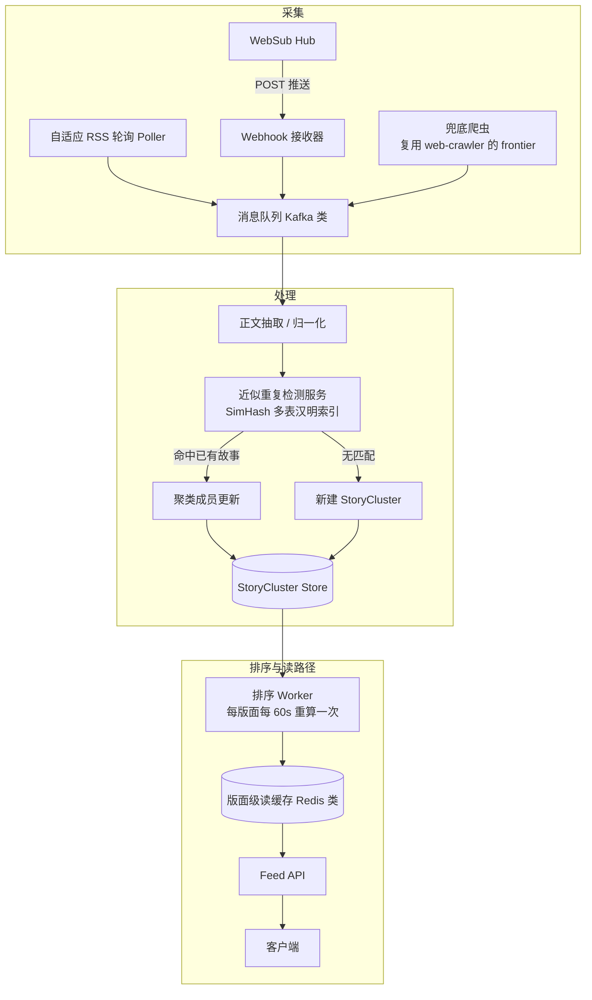

# 设计题解：新闻聚合器（News Aggregator，Google News 一类）

## 题目与范围

面试官通常这样开场："设计一个新闻聚合器：从大量新闻发布方持续拉取文章，识别出哪些文章报道
的其实是同一件事，把它们聚成一个"故事（story）"，再给用户呈现一个持续更新、按重要性排序的
信息流。"这句话背后真正的难点不是"抓网页存下来"，而是**输入源的数量级和行为都极不均匀（几十
万个发布方，更新频率横跨几个数量级），而输出必须是一份看起来"权威"的、去重后的排序结果，
容不得同一件事在信息流里出现十几次**。

值得当场问清楚的澄清问题，以及它们各自改变的设计决策：

- **覆盖的发布方规模级别是多少，是不是都有可靠的 RSS/API？** 如果只对接几百个有合作关系的
  大型发布方，直接轮询即可；本题按"几十万个发布方，大多数没有正式合作、只能靠公开 RSS 或
  兜底爬取"来做，这决定了采集层必须组合多种拉取/推送机制（见「深入探讨」第 1 节）。
- **去重/聚类要不要跨语言、跨地区识别"同一件事"？** 决定聚类的主管道是不是必须限定在单一
  语言内运作，跨语言关联是不是一个独立的次级机制（见「深入探讨」第 6 节）。
- **新鲜度要求有多严格——突发新闻要在多久内出现在信息流里？** 决定采集层能不能只靠轮询，
  还是必须引入推送机制。
- **排序是纯编辑式的全局排序，还是要做个性化？** 本题只做面向一个（地区、语言）版面
  （edition）共享的编辑式排序，不做个性化——这决定了排序结果本身可以被缓存和共享，而不是
  每个用户独立计算（见「深入探讨」第 5 节）。
- **要不要支持用户主动按关键词搜索历史新闻？** 不需要——全文关键词检索是一个独立的搜索引擎
  问题，见 [[solution-search-engine]]，本题只做"呈现当下重要的事"，不做"查任意历史事件"。

**范围内**：从海量发布方采集内容（轮询、推送、兜底爬取）、近似重复检测与故事聚类、新鲜度与
质量的排序、按地区/语言分版、读路径与缓存。**范围外**：全文关键词搜索（见
[[solution-search-engine]]）、个性化推荐、评论/社交互动、发布方后台管理界面、机器翻译本身
的实现（跨语言关联只使用轻量的结构化信号，不做全文翻译）。

## 需求

**功能需求（驱动设计的 3–5 条）**

1. 系统能从几十万个发布方持续采集新文章，覆盖有标准 RSS/推送能力和完全没有的两类发布方。
2. 报道同一事件的多篇文章被识别并聚合成一个"故事"，而不是在信息流里各自独立出现。
3. 信息流按新鲜度与质量（被多少独立来源报道、来源权威度）的组合排序，而不是纯时间倒序。
4. 用户能看到一个故事有哪些来源在报道，而不只是一篇被选中的代表文章。
5. 同一份排序结果按（地区、语言）版面区分，不同版面可以有不同的头条。

**非功能需求（数字化）**

- **新鲜度**：突发新闻从被采集到出现在信息流里，目标 P99 < 2 分钟。
- **信息流更新周期**：一个版面的排序结果允许有一个有界的陈旧窗口，目标 ≤ 60 秒——这不是
  "实时"，而是一个刻意选择的、可缓存的新鲜度预算（见「深入探讨」第 5 节）。
- **采集可用性**：99.9%——采集层故障的代价是"暂时看不到新内容"而不是数据损坏，可以容忍
  短暂降级。
- **去重准确性**：宁可漏判（两篇确实报道同一事件的文章暂时没被聚到一起，用户看到两条），
  也不能错判（把两件不相关的事误聚成一个故事）——错误合并对用户的信任伤害远大于偶尔的
  重复展示。
- **一致性**：最终一致——同一时刻两个用户看到同一版面的信息流允许有几十秒的先后差异，但
  聚类结果（哪些文章属于同一个故事）一旦确定，不能在用户已经看到的会话内违反直觉地被拆散。

## 容量估算

估算的核心不是"存多少篇文章"，而是**发布方更新频率的幂律分布如何决定采集成本，以及读写比
如何决定要不要缓存排序结果**——这两个数字直接对应「深入探讨」第 1 节和第 5 节的设计选择。

**基础假设**：30 万个发布方，平均每个发布方每天产出 8 篇文章。

```
articles_per_day = 300,000 × 8 = 2,400,000
write QPS(avg) = 2,400,000 / 86,400 ≈ 27.8
write QPS(peak, ×4，重大事件/时区叠加造成的突发) ≈ 111.1
```

**采集侧**：如果对全部 30 万个发布方用统一的固定间隔（5 分钟）轮询：

```
naive_polling_QPS = 300,000 / 300 = 1,000
```

按发布方更新频率分层（5% 高频通讯社类源，约 2 分钟更新一次；20% 日更博客类源，约 6 小时
更新一次；75% 低频长尾源，约 3 天更新一次），采集间隔按各自观测到的更新间隔的一半设置：

```
高频层  QPS = 300,000×0.05 / 120   = 125.0
日更层  QPS = 300,000×0.20 / 21,600 ≈ 5.6
长尾层  QPS = 300,000×0.75 / 21,600 ≈ 10.4
adaptive_polling_QPS ≈ 125.0 + 5.6 + 10.4 = 141.0
reduction = 1,000 / 141.0 ≈ 7.1x
```

**这是第一个决定架构的数字**：自适应轮询把采集请求量压低约 7.1 倍，且这个比例会随着长尾
发布方占比越高而越明显——这正是「深入探讨」第 1 节选择"按观测频率自适应轮询 + 推送 + 兜底
爬取"组合方案而不是统一轮询的理由。

**存储**：假设每篇文章抽取后正文约 3,000 个字符（英文为主的正文，UTF-8 编码下约等于 3,000
字节；非拉丁字符占比高的语言，同样字符数的字节数会更高，本设计按英文为主的假设估算），加上
约 500 字节元数据：

```
bytes_per_article ≈ 3,000 + 500 = 3,500 字节
storage/day = 2,400,000 × 3,500 ≈ 8.4 GB
storage/year ≈ 8.4GB × 365 ≈ 3,066 GB ≈ 3.07 TB
```

相比「深入探讨」要讨论的近似重复检测索引（每篇文章一个 8 字节 SimHash 指纹，一年约 7 GB），
文章正文本身才是存储的主要部分，但即使如此，3 TB/年 的量级也远小于典型社交媒体系统的存储
需求——**这道题的瓶颈不在存储字节数，而在采集请求量和聚类计算量**。

**读侧**：假设 5,000 万日活，平均每天 2 次会话，每次会话刷新 5 屏：

```
reads/day = 50,000,000 × 2 × 5 = 500,000,000
read QPS(avg) = 500,000,000 / 86,400 ≈ 5,787
read : write ≈ 5,787 : 27.8 ≈ 208 : 1
```

**这是第二个决定架构的数字**：208:1 的读写比虽然不如社交信息流的 1,200:1 那么极端，但依然
足以说明——如果每次读请求都现场对全部活跃故事重新打分排序，会有大量重复计算；应该让排序结果
可以被同一版面下的所有读者共享缓存（见「深入探讨」第 5 节），而不是照搬 [[solution-news-feed]]
里"按用户预计算收件箱"的写时扇出模型——本设计不做个性化，共享缓存已经足够。

**活跃聚类规模**：假设每个故事平均被 6 家发布方报道：

```
clusters/day ≈ 2,400,000 / 6 = 400,000
```

## 核心实体与 API

**实体**

- **Publisher**：`id, feed_url, hub_url(可选), lang, region, discovery_method(rss|websub|crawl),
  polling_interval_sec, last_polled_at, etag/last_modified` ——一个发布源，`polling_interval_sec`
  由「深入探讨」第 1 节的自适应算法持续调整。
- **Article**：`id, publisher_id, canonical_url, title, extracted_text, lang, published_at,
  fetched_at, simhash_fingerprint, cluster_id` ——一篇被采集的文章，一旦写入不可变；发现
  内容有误只能重新抓取产生新版本并重新走聚类，而不是原地修改（见「常见错误」）。
- **StoryCluster**：`id, lang, representative_article_id, member_article_ids[],
  corroboration_count, first_seen_at, last_updated_at` ——一个"故事"，由近似重复检测持续
  维护成员关系（见「深入探讨」第 2、3 节）。
- **Edition**：`region, lang` ——排序的作用域；同一个 StoryCluster 可以在多个 Edition 里
  有不同的排序分数（见「深入探讨」第 4、6 节）。

**API**

```
POST /internal/ingest/rss-poll-result     {publisher_id, articles[]}
                                           轮询 worker 上报新发现的文章，按 canonical_url
                                           幂等写入。
POST /internal/websub/callback/{publisher_id}
                                           WebSub hub 按 W3C 规范先发一次 GET 做订阅验证
                                           （回显 hub.challenge），验证通过后用 POST 推送
                                           新内容到这个回调地址（见「深入探讨」第 1 节）。
POST /internal/ingest/crawl-result        {publisher_id, article}
                                           兜底爬虫管线（复用 [[solution-web-crawler]] 的
                                           frontier/politeness 机制）上报的抓取结果。
GET  /api/v1/feed?edition=&category=&cursor=
                                           返回某个版面的排序故事列表。
GET  /api/v1/stories/{cluster_id}?edition= 单个故事详情：代表文章 + 该版面下的排序分数。
GET  /api/v1/stories/{cluster_id}/sources?cursor=
                                           分页返回该故事的全部佐证来源文章。
POST /api/v1/publishers                   管理员注册新发布源，按 feed_url 幂等。
```

**故意不做的**：不支持任意关键词的全文检索（见 [[solution-search-engine]]）；不支持用户
关注/订阅单个发布方（本题只做共享的编辑式排序，不做个人社交图谱）；不支持对已采集文章的正文
做原地修改（内容更新只能通过重新抓取产生新记录，触发重新聚类，保持 Article 不可变）。

## 高层设计



**写路径**：三种采集机制（自适应轮询、WebSub 推送、兜底爬取，见「深入探讨」第 1 节）都把
新发现的文章写入同一个日志式消息队列（Kafka 类），因为三种来源的到达速率极不均匀（推送可能
瞬间到达一批，轮询按各自间隔到达），需要队列吸收这种不规则性，并允许下游处理服务独立于采集
速率横向扩展。正文抽取/归一化后，近似重复检测服务（技术选型是**内存驻留的定制索引**，因为
每次判重都要做低延迟的汉明距离候选查找，见「深入探讨」第 2 节）决定这篇文章是加入已有故事
还是新建一个。

**读路径**：排序 Worker 不在读请求路径上现场计算，而是按固定周期（60 秒，对齐「需求」里的
陈旧窗口预算）为每个版面重新计算排序结果并写入共享的读缓存（**内存 KV 存储，Redis 类**）；
Feed API 只读这个缓存，读 QPS 因此和排序计算的成本完全解耦（见「深入探讨」第 5 节）。

## 深入探讨

### 采集：自适应轮询、WebSub 推送与兜底爬取的组合

**问题**：几十万个发布方的更新行为天差地别——统一的轮询间隔要么因为设得太密而在长尾静态
站点上浪费请求，要么因为设得太松而错过真正的高频来源，而且轮询本身永远有"上次抓取和这次
抓取之间发生的更新，最坏要等一整个轮询间隔才被发现"这个结构性延迟。

**方案一：统一固定间隔轮询**。实现简单，但如「容量估算」所示，统一 5 分钟轮询需要 1,000
QPS，其中绝大部分请求打在几乎不更新的长尾站点上，而真正的高频来源（如通讯社）如果更新间隔
短于 5 分钟，反而还是跟不上。

**方案二（本设计采用）：三种机制组合**。
(a) **自适应轮询**：持续追踪每个发布方观测到的更新间隔，把轮询间隔设为观测间隔的一半（限制
在 2 分钟到 6 小时之间），并用条件请求（HTTP 的 `ETag`/`Last-Modified`，未变化时收到 304
而不是完整正文，代价只是一次 TCP 往返）让"确认没有新内容"这件事本身很便宜。
(b) **WebSub 推送**：对支持 WebSub 的发布方，按 W3C WebSub 规范作为订阅方（subscriber）
向发布方声明的 hub 订阅：hub 先对回调地址发一次 GET 请求做挑战验证（回显 `hub.challenge`
参数确认订阅方确实拥有这个回调地址），验证通过后，发布方一旦有新内容，hub 直接向回调地址
发 POST 推送——这把原本"最坏等一个轮询周期"的延迟压到接近实时，且完全不需要为这些发布方
安排轮询。
(c) **兜底爬取**：对既没有可用 RSS 也不支持 WebSub 的发布方（或者 RSS 长期返回错误/内容
和页面不一致），直接复用 [[solution-web-crawler|网络爬虫]] 已经解决过的礼貌调度、URL
frontier 和"按估计变化频率重新抓取"机制——差别只在于这里的 frontier 种子是已知的发布方
域名列表，而不是从种子网址出发的开放式发现。

**数字**：见「容量估算」，自适应轮询把采集请求量从统一轮询的 1,000 QPS 压到约 141.0 QPS，
降低约 7.1 倍；这个比例会随着长尾发布方占比升高而进一步扩大，因为长尾层本身就是这个混合
方案里被压缩得最多的那一层。

### 近似重复检测：Shingling + MinHash + LSH banding，还是 SimHash + 多表汉明索引

**问题**：同一个事件会被几十到几百家发布方用不同措辞报道，精确文本哈希去重只能抓住一字不差
的转载，抓不住改写、删减导语或换了标题的转载——但对每篇新文章和当天全部文章做两两精确相似度
比较，计算量随文章数平方增长，在「容量估算」240 万篇/天的规模下不可行。

**方案一：Shingling + MinHash 签名 + LSH banding**（Broder 提出的经典技术）。把文章正文
切成重叠的 k 词滑动窗口（shingle），用一组 n 个独立的哈希置换分别取每个 shingle 集合的
最小哈希值，拼成一个 n 维签名——两篇文章签名中相同位置取值相等的比例，是它们 shingle 集合
Jaccard 相似度（resemblance）的无偏估计。Broder 自己的论文披露，要精确估计相似度，"sketch"
需要"几百字节"（three to eight hundred bytes）每篇文档；为了避免对全部文章做两两比较，
LSH banding 把签名切成 b 个宽度为 r 的 band，只要两篇文章在至少一个 band 上完全相同就
被标记为候选对，交给精确复核。取 b=16、r=8（签名长度 n=128）时，候选概率
`P(candidate) = 1-(1-s^r)^b` 随真实相似度 s 变化：

```
s=0.5  → P ≈ 6.1%   （弱相似对被过滤掉，不进候选）
s=0.65 → P ≈ 40.4%
s=0.7  → P ≈ 61.3%
s=0.8  → P ≈ 94.7%  （真正的近似重复几乎必被召回）
```

50% 候选概率对应的临界相似度约 0.67——这是一条陡峭的 S 型曲线，弱相似对基本被过滤，强相似
对基本被召回。代价是签名本身的存储：n=128、每个哈希值 4 字节，签名约 512 字节/篇。

**方案二（本设计采用）：SimHash + 多表汉明距离索引**（Charikar 提出随机超平面（random
hyperplane）技术，Manku/Jain/Sarma 在 Google 生产环境验证）。用一组随机超平面对文章的
加权特征（shingle 或词）做符号投影，把整篇文章压缩成**一个** 64 位指纹——两篇文章越相似，
指纹在汉明距离（Hamming distance）意义上差得越少，而不需要像方案一那样保留一整个多维签名。
Google 公开披露，在他们 80 亿网页规模的语料上，Broder 式 shingle 指纹需要 24 字节/文档，
而 SimHash 的 64 位（8 字节）指纹就够用——单篇文档的指纹体积只有方案一 512 字节签名的
约 1/64。

**取舍**：本设计选择方案二，直接原因是内存footprint——「容量估算」里 72 小时活跃聚类窗口
约 720 万篇文章，方案二每篇 8 字节，指纹索引约 58 MB；换成方案一的 512 字节签名，同样规模
要约 3.7 GB，而这个索引必须常驻内存才能支撑「深入探讨」第 3 节要求的低延迟增量聚类查找。
方案一在需要任意相似度阈值或非对称包含关系查询时更灵活，但本设计只需要一个"这篇文章是不是
已有某个故事的近似重复"的快速安全检查，不需要那种灵活性。

**方案二在本设计规模下的具体参数**（沿用 Google 论文描述的方法，但按本设计自己的语料规模
重新计算，而不是照搬 Google 8B 网页规模的参数）：72 小时活跃窗口 720 万篇文章，
`d = log2(7,200,000) ≈ 22.78`；取 64 位指纹切成 6 个约 11 位的块，从中选 2 块作为每张表
的前导位（`C(6,2) = 15` 张表，`p_i ≈ 22` 位），平均每次探测返回候选指纹数：

```
candidates_per_probe ≈ 2^22.78 × 2^-22 ≈ 1.7
```

作为对照，Google 论文披露他们在 80 亿页（`d=34`）规模下用 20 张表（6 个约 11 位的块选 3
块，`p_i≈31-33` 位）把每次探测的候选数压到约 8——语料规模更小时，用同样的方法可以用更少的
表把候选数压到更低，这个具体的表数量和候选数都是本设计按自己的语料规模重新算出来的，不是
照抄 Google 论文的参数。

### 故事聚类的增量维护

**问题**：文章不是批量到达的，而是持续流入的——判断一篇新文章属于哪个故事不能是"每来一篇
就对当天全部文章重新跑一次聚类"；同时，两个早期各自独立建立的故事，有时后来才发现其实报道
的是同一件事（比如一条早期通讯社简讯和一篇后来措辞完全不同的深度报道）。

**方案一：批量重新聚类**。定期（比如每小时）对活跃窗口内的全部文章重新跑一次完整聚类。
实现简单，不需要增量逻辑，但同一个突发事件如果被多家发布方在同一个批次窗口内报道，会在这
一整个窗口内都以多个独立故事的形式出现在信息流里——而这恰好是一个突发故事流量最大的时刻。

**方案二（本设计采用）：增量分配**。新文章的指纹到达时，直接用「深入探讨」第 2 节的多表
汉明索引探测是否存在汉明距离在 k 以内的已有指纹；命中则把这篇文章作为佐证成员并入已有
StoryCluster（`corroboration_count` 加一，直接影响排序，见第 4 节），代表文章只有在
佐证数跨过一个重新评选阈值时才更新（避免故事刚开始积累来源时代表文章频繁跳动）；没有命中
则新建一个 StoryCluster。另外用一个低优先级的后台任务，定期检查时间上相近、规模较小的
故事对，在其中一个积累出足够有区分度的指纹佐证后做回溯性合并——这是一个刻意接受的一致性
妥协：一篇文章可能短暂待在"错误的（未合并的）"故事里，但这个窗口有界且修复成本低，好过让
用户在故事真正开始展示之前一直等一次全量重新聚类。

**数字**：延续「容量估算」的约 40 万个故事/天，增量分配对每篇新文章的成本由第 2 节的约
1.7 个候选/探测决定，而不是随当天语料总量增长——这正是选择汉明索引方案而不是从零重新聚类
的原因。

### 新鲜度 vs 质量：排序函数与佐证信号

**问题**：纯时间倒序会让任何未经证实的单一来源内容和被广泛证实的重大报道享有完全相同的曝光
（这个失败模式比 [[solution-news-feed]] 讨论的社交时间线更严重，因为社交时间线里"未经证实"
不是主要风险，这里却是）；纯按佐证来源数量排序又会让一条上午就已经被大量报道的旧闻长期压制
一条刚开始发酵、还没来得及被广泛报道的真正新故事。

**方案一：纯时间倒序**。不需要排序逻辑，但任何单一来源的未经证实内容会立刻获得和被广泛证实
的重大报道相同的展示位置。

**方案二：纯佐证数量排序（不做时间衰减）**。过滤掉了单一来源的噪音，但一条早上就已经被
大量报道的旧闻会持续压制一条真正新出现、佐证数还没追上来的新故事，直到后者也积累出可比的
佐证数为止——那时它往往已经不再是"新"闻了。

**方案三（本设计采用）**：`score = 时间衰减(age) × log(1 + 佐证来源数) × 来源权威度`。
时间衰减用指数衰减（半衰期可按版面/品类调整，通用新闻取 6 小时），佐证数取对数是为了让"从
1 个来源涨到 2 个"和"从 50 个来源涨到 51 个"对分数的边际影响不同——已经被广泛报道的故事
不会因为佐证数继续线性堆高而无限压制新故事。取 6 小时半衰期计算两个具体候选故事：

```
衰减(age_h) = 0.5^(age_h/6)
衰减(0h)=1.0   衰减(6h)=0.5   衰减(12h)=0.25   衰减(24h)=0.0625

故事 A：2 小时前发布，1 个来源，来源权威度 0.9
  score_A = 0.5^(2/6) × log(1+1) × 0.9 ≈ 0.495

故事 B：10 小时前发布，12 个佐证来源，平均权威度 0.6
  score_B = 0.5^(10/6) × log(1+12) × 0.6 ≈ 0.485
```

两者分数几乎打平（比值约 0.98）——这正是方案三刻意要的效果：一条被广泛佐证的旧故事能和
一条更新但佐证尚少的故事竞争，而不是被任何一个信号单方面压制。

### 读路径与缓存：服务一个每分钟都在变的信息流

**问题**：[[solution-news-feed|信息流与时间线]]已经讲过读写比悬殊时如何靠预计算和缓存
降低读路径成本，本题的读写比（约 208:1，见「容量估算」）虽然不如那道题的 1,200:1 极端，
但排序分数本身会因为「深入探讨」第 4 节的时间衰减而持续变化——即使没有一篇新文章到达，一个
版面的排序结果也在随时间漂移，缓存不能只在"有写入发生"时才失效。

**方案一：不缓存，每次请求现场对活跃故事重新打分排序**。任何时刻都精确，但在约 5,787
QPS 的读峰值下，意味着几乎每个请求都要重新给「深入探讨」第 3 节里约 40 万个/天的活跃故事
重新算一遍分——同一个版面下并发的读者在重复付出几乎完全相同的计算。

**方案二（本设计采用）**：排序 Worker 按固定周期（60 秒，对齐「需求」的陈旧窗口预算）为
每个（地区、语言）版面重新计算一次排序结果，写入共享读缓存（**内存 KV 存储**，作用和
[[solution-news-feed|信息流]]里的收件箱缓存类似，但这里缓存的 key 是版面而不是单个用户，
因为排序结果是同版面用户共享的，不像社交信息流那样按用户个性化）；读请求直接从缓存返回，
读 QPS 因此和排序计算成本完全解耦。代价是任何用户看到的排名相比"此刻重新计算的结果"最多
陈旧 60 秒——这是一个有界、已知、可调的陈旧窗口，而不是缓存永远不过期或者每次都要现场
全量计算这两个极端。

### 按地区与语言分版

**问题**：同一件事在一个国家/语言可能是头条，在另一个可能完全不相关或需要不同的佐证数量
才配得上头条位置；而「深入探讨」第 2 节的近似重复检测本身在设计上就不跨语言——指纹是从
shingle/词特征算出来的，两篇不同语言描述同一事件的文章产生的 shingle 集合和 SimHash
指纹完全不相关，这是构造上的必然，不是需要修的 bug。

**方案一：每个（地区、语言）完全独立的管道和索引**。隔离干净，但一个全球性重大事件在自己
语言发布方较少的版面里永远得不到任何跨语言信号——本地佐证数量不足，即使这件事在其他语言里
已经被大量报道。

**方案二（本设计采用）**：聚类和 SimHash 指纹索引本身继续严格按语言分开（这是正确性要求，
不是优化项，因为指纹本身就是从语言相关的 token 算出来的），但增加一个轻量的跨语言关联步骤——
只对已经跨过单语言佐证阈值（比如 ≥5 个来源）的故事运行，使用不依赖机器翻译的结构化信号
（共享的通讯社标签、各语言独立抽取出的命名实体重叠）把描述同一事件的不同语言故事关联成一个
"全球故事"记录。排序仍然按版面独立计算（第 4 节的 score 用该版面自己的发布方数据算），但
跨语言关联让一个版面本地的佐证数可以从"全球故事"的显著性里借到一点加成，而不是要么完全共享
佐证数（会让大语种版面的体量压过所有其他版面的排序）要么完全不共享（会让真正的全球性事件在
覆盖较少的版面里长期不可见，直到本地报道自己追上来）。

## 瓶颈、故障与演进

**热点与倾斜**：一条突发新闻会在短时间内涌入大量佐证文章，如果 `corroboration_count` 是
单行计数器，并发写会互相争用；应该用分片计数器或按到达顺序追加的日志，定期合并成最终值，
而不是让所有并发到达的佐证更新争抢同一行。另一个热点是轮询调度本身：如果调度没有做抖动
（jitter），大量发布方的固定间隔会在同一秒对齐触发，「容量估算」里平均 1,000 QPS 的统一
轮询方案如果全部集中在每个 5 分钟窗口的第一秒触发，瞬时 QPS 会冲到 `300,000/1 = 300,000`，
是平均值的 300 倍——调度必须把每个发布方的轮询时刻随机打散在自己的间隔窗口内。

**故障域**：

- **推送/轮询接收层不可用**：WebSub 推送失败按 hub 自己的重试策略重试；轮询本身在下一个
  调度周期自然恢复，代价是这段时间内的新鲜度回退到轮询间隔的量级——发布方自己保留原始内容，
  本系统随时可以补抓，没有永久数据丢失。
- **近似重复检测索引不可用**：降级为"每篇新文章各自成为独立故事"（牺牲去重质量，不牺牲
  可用性）——信息流会暂时出现重复条目而不是完全无法展示新内容，索引恢复后台任务重新合并。
- **排序 Worker/读缓存不可用**：读路径退化为「深入探讨」第 5 节方案一的现场重新计算，
  延迟上升但不整体不可用。
- **单个发布方抓取/解析持续失败**：需要按发布方做熔断隔离，一个格式损坏的 RSS 源不能占用
  共享轮询 worker 池的容量或让处理进程崩溃拖累其他发布方。

**10 倍演进**：发布方从 30 万到 300 万（或日活提升到 10 倍）。自适应轮询的压缩比例结构上
不变，但热门故事的并发佐证写入热点在绝对数值上更严重，分片计数器/追加日志从"可选优化"变成
"必须项"。近似重复检测索引在活跃窗口文章数增长 10 倍后需要相应扩大表数量或放宽每次探测的
候选数上限——这是「深入探讨」第 2 节同一方法的重新调参，不是架构变化。

**100 倍演进**：完全全球化规模下，「深入探讨」第 6 节里"轻量结构化信号做跨语言关联"这个
次级机制可能不再够用，需要一个更系统性的跨语言语义关联（例如基于多语言文本向量的相似度
检索），而不再只是本设计里描述的命名实体/通讯社标签重叠这种轻量启发式——这是明确的架构
升级点，而不是本设计范围内可以简单调参解决的问题。

## 面试官会追问什么

**中级（mid）**
- "如果同一篇文章被同一个发布方通过 RSS 轮询和 WebSub 推送各自上报一次会怎样？" 按
  `canonical_url`（或发布方自己的文章 id）幂等写入，重复上报只是一次无操作的 upsert，
  不会产生重复的聚类成员。
- "为什么不直接对文章全文做精确哈希去重？" 精确哈希抓不住改写导语、换标题或做了轻微编辑的
  转载——而这正是通讯社稿件被多家发布方转载时的常见形式，恰恰是这道题最需要抓住的重复。

**高级（senior）**
- "MinHash/SimHash 会不会把两篇完全不相关、只是措辞碰巧相似的文章误判成同一个故事？"
  shingle 本身保留了局部词序结构（不是纯词袋），能过滤掉大部分主题无关但用词相似的误判，
  但仍需要一个轻量的二次校验（比如发布时间接近程度、独立抽取出的命名实体是否重叠）才能
  最终确认合并，因为相似度高不等于报道的是同一件事。
- "轮询间隔算法会不会被发布方'操纵'（比如故意频繁发几篇空文章骗取更短的轮询间隔）？" 需要
  给观测到的更新频率设一个硬性下限（轮询间隔不能低于某个楼板值）和每个发布方的总轮询预算
  上限，不能让观测信号本身无限制地反向决定资源分配——这和「深入探讨」metrics 设计里"基数
  配额必须是准入时的硬限制，不能只靠事后观测"是同一类防御。

**参谋级（staff）**
- "如果这道题从'呈现真实世界发生了什么'变成'要和刻意刷佐证数量的恶意发布方博弈'，架构要不要
  变？" 现在的佐证计数假设的是彼此独立的发布方多样性；真实系统需要给发布方的"独立性"本身
  建模（识别共享所有权或照抄同一份通讯社通稿的发布方网络），否则"12 个来源"可能只是"同一份
  通稿的 12 份复制"——这是叠加在聚类机制之上的信任/关系图谱问题，聚类本身解决不了。
- "如果要给一个新语言/新地区快速冷启动一个版面，等不及自然流量攒够独立发布方怎么办？" 可以
  用「深入探讨」第 6 节的跨语言关联，在新版面自己的佐证阈值不够时，临时借用"全球故事"的
  显著性作为一个明确标注的过渡态排序依据，而不是展示一个几乎空的信息流，直到当地发布方
  自然增长到能独立支撑排序。

## 常见错误

- 把"新鲜度"简化成纯时间倒序，没意识到这会让任何未经证实的单一来源内容和被广泛证实的报道
  获得完全相同的展示权重。
- 用精确文本哈希做去重，被追问"如果标题被编辑改了几个字呢"答不上来。
- 把 MinHash 签名和 SimHash 指纹混为一谈，说不清楚本设计为什么选单指纹的汉明索引而不是
  多维签名的 LSH banding——尤其说不出两者具体的内存占用差距（本设计场景下约 8 字节 vs
  约 512 字节/篇）。
- 给全部发布方用同一个固定轮询间隔，没意识到发布方更新频率本身是幂律分布，统一间隔在两端
  都不是最优解。
- 只讨论"抓取"，没意识到大规模场景下拉取（自适应轮询）和推送（WebSub）应该组合使用，而
  不是二选一；也没提到完全没有 feed 的长尾发布方需要一条独立的兜底爬取路径。

## 五分钟讲法

This is a news aggregator where the core tension is that hundreds of thousands of publishers
update at wildly different, power-law-distributed frequencies, so a single fixed polling
interval either wastes requests on quiet long-tail sites or misses genuinely fast-moving
ones — adaptive polling that sets each feed's interval from its own observed update rate
cuts polling load by about seven times in my estimate, and I layer WebSub push on top for
publishers that support it and a crawling fallback, reusing the same frontier and politeness
machinery a general web crawler needs, for publishers with no usable feed at all. The second
core problem is that dozens of publishers cover the same event in different words, so
near-duplicate detection can't be exact-text matching; I compute a single 64-bit SimHash
fingerprint per article using random hyperplane rounding rather than a multi-value MinHash
signature, specifically because at my working corpus size the SimHash index costs about
58 megabytes versus roughly 3.7 gigabytes for the MinHash alternative, and that index has
to stay in memory for fast incremental cluster assignment as articles arrive continuously
rather than in batches. Ranking combines exponential time decay with a log-dampened
corroboration count so a widely-corroborated older story can compete with a fresher,
still-thinly-sourced one instead of either signal dominating outright — a worked example
comes out nearly tied between a two-hour-old single-source story and a ten-hour-old story
with twelve corroborating sources. On the read side the ratio of reads to writes is much
lower than a social feed's, but the ranking itself keeps drifting even without new writes
because of time decay, so instead of feed fan-out I run a background ranking pass every
sixty seconds per region-and-language edition and cache the shared result, decoupling read
latency from ranking cost with a bounded, known staleness window. Editions stay clustered
strictly per language, because the fingerprint itself is computed from language-specific
text and can't match across languages by construction, but a lightweight secondary linking
step connects same-event clusters across languages once each has enough independent
corroboration, so a globally significant story isn't invisible in a smaller-language
edition just because local coverage hasn't caught up yet.

## 来源与延伸

- [Identifying and Filtering Near-Duplicate Documents](https://cs.brown.edu/courses/cs253/papers/nearduplicate.pdf)
  （Andrei Z. Broder，AltaVista，第一方作者论文）：定义了 shingle（连续词窗口/q-gram）、
  用最小独立置换族（min-wise independent permutations）估计 resemblance 的 MinHash 技术，
  并披露了真实的生产经验——用几百字节的"sketch"对超过 3,000 万篇文档做相似度聚类（50% 以上
  resemblance 判定），聚类耗时与 `m log m` 成正比而不是 `m^2`；到 1999 年中，AltaVista
  已经日爬超过 2,000 万页。本题解「深入探讨」第 2 节直接引用了论文披露的"几百字节/文档"
  sketch 体积作为方案一的成本基准，并用它和方案二（SimHash）的 8 字节指纹做对比，得出
  本设计选择方案二的具体理由。
- [Similarity Estimation Techniques from Rounding Algorithms](https://dl.acm.org/doi/10.1145/509907.509965)
  （Moses Charikar，STOC 2002，第一方论文，ACM 官方记录）：提出了基于随机超平面
  （random hyperplane）舍入的哈希方案（即 SimHash 的理论基础），把两个特征向量的
  随机超平面哈希一致的概率和它们的夹角/余弦相似度直接关联起来。本题解「深入探讨」第 2
  节采用了这个技术构造单一定长指纹的做法，作为和 Broder 式多维 MinHash 签名相对的另一个
  方案。
- [Detecting Near-Duplicates for Web Crawling](https://static.googleusercontent.com/media/research.google.com/en//pubs/archive/33026.pdf)
  （Manku, Jain, Sarma，Google，WWW 2007，第一方论文）：披露了在 80 亿网页规模上用
  64 位 SimHash 指纹（相比 Broder 式 shingle 指纹的 24 字节/文档小得多）配合汉明距离
  k=3 判重的生产实践，以及用多张按位置换排序的表（table）解决"在线查询几毫秒内完成、
  批量查询单日十亿级吞吐"的汉明距离问题的具体设计参数（如 20 张表在 8B 规模下把每次探测
  候选数压到约 8）。本题解「深入探讨」第 2 节直接采用了论文描述的分表方法，但按本设计
  自己 720 万篇活跃文章的规模重新计算出 15 张表、候选数约 1.7 这组参数，不是照抄论文
  给 80 亿网页设计的参数。
- [WebSub (W3C Recommendation)](https://www.w3.org/TR/websub/)
  （W3C 官方规范，第一方来源）：定义了发布方通过 `rel="hub"`/`rel="self"` 声明 hub 和
  话题、订阅方发起订阅并由 hub 通过 `hub.challenge` 做挑战验证、验证通过后 hub 直接
  POST 推送新内容给订阅方回调地址的完整流程，并明确说明"发布方如何通知 hub 内容已更新"
  这一步本身不在规范范围内、由发布方和 hub 自行约定。本题解「深入探讨」第 1 节采用了
  规范描述的订阅/验证/推送流程作为混合采集方案里的推送分支，并补充了"这条推送路径和自适应
  轮询、兜底爬取如何组合分工"这一具体架构决策，规范本身只定义协议，不讨论采集系统的整体
  架构取舍。
