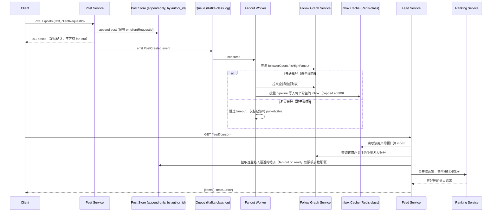

# 设计题解：信息流与时间线（News Feed & Timeline，Twitter/Facebook）

## 题目与范围

面试官通常这样开场："设计一个类似 Twitter 或 Facebook 的信息流系统：用户关注其他用户，
发帖后关注者能在自己的时间线（timeline）里看到这条帖子，并按某种顺序排列。" 这句话背后
真正的难点不是"存帖子"，而是**同一份内容要以极不对称的规模同时服务写入方（一个作者）和
读取方（成千上万个关注者），而且这个不对称比例本身在不同账号之间相差几个数量级**。

值得当场问清楚的澄清问题，以及它们各自改变的设计决策：

- **时间线是纯时间倒序还是算法排序（ranked feed）？** 纯时间倒序只需要一次归并；算法排序
  需要一整条候选生成 → 打分 → 重排的管道（见「深入探讨」第 3 节），本题按算法排序设计，
  因为这是 Twitter/Facebook 的真实产品形态，也是这道题真正的难点所在。
- **要不要支持粉丝数千万级的"名人"账号？** 决定要不要做 fan-out 策略的分流（见「深入探讨」
  第 1 节）——如果所有账号粉丝数都在几百这个量级，简单的推模型就足够了。
- **新鲜度容忍多久的延迟？** 决定异步管道的 SLA，以及缓存失效窗口能设多宽。
- **能不能删帖，删帖后已经推送出去的时间线里要不要立刻消失？** 决定是主动清除还是惰性
  过滤（见「常见错误」）。
- **这套系统要不要处理媒体（图片/视频）本身的存储和转码？** 不处理——本题假设帖子只携带
  对媒体的引用，媒体上传、转码、CDN 分发是完全独立的一道题，见 [[solution-instagram]]。

**范围内**：关注关系管理、发帖与时间线生成（fan-out）、基础的多阶段排序、分页、新鲜度与
删帖的可见性语义。**范围外**：媒体存储与转码（见 [[solution-instagram]]）、好友推荐算法、
内容审核、广告插入、评论线程（属于「Forum & Threaded Comments」）、私信（属于「Chat &
Messaging」）。

## 需求

**功能需求（驱动设计的 3–5 条）**

1. 用户可以关注/取关其他用户（单向关系）。
2. 用户发帖后，关注者能在有限延迟内在自己的主时间线（home timeline）里看到这条帖子。
3. 用户翻页浏览时间线时，顺序在持续有新帖插入的情况下保持稳定——不重复、不遗漏。
4. 系统按预测的互动概率对候选帖子排序，而不是单纯按时间倒序（ranked feed）。
5. 用户可以删除自己的帖子，删除后所有关注者的时间线里都不应该再展示它。

**非功能需求（数字化）**

- **新鲜度**：普通账号（非名人）发帖到出现在关注者主时间线里，目标 P99 < 5 秒。
- **读延迟**：`GET /feed` 接口 P99 < 200ms——这是用户每天要触发几十次的核心交互，延迟直接
  影响留存。
- **可用性分层**：读路径（浏览时间线）目标 99.99% 可用——这是产品的核心留存功能；写路径
  （发帖）目标 99.9%，短暂失败可以让客户端安全重试。
- **一致性**：最终一致，容忍时间线内容落后真实发帖状态最多 1 分钟。这不是拍脑袋定的：
  Facebook 官方文档把"最多 1 分钟陈旧"作为信息流的一致性目标（见「来源与延伸」），本题采用
  同一数字作为设计假设。
- **严格顺序的例外**：上面的"最终一致"只适用于**别人**看你时间线里出现新内容的延迟；用户
  发布自己的帖子后，必须在自己的时间线/主页里立刻看到——这是一条不能被最终一致打折扣的
  读己所写（read-your-own-write）需求，走独立路径（见「深入探讨」第 5 节）。

## 容量估算

估算的核心不是"存多少数据"，而是**读写流量的不对称比例，以及这个比例如何被"粉丝数"这一个
维度进一步放大到几个数量级**——这两层放大决定了整个架构。

**基础假设**：日活用户（DAU）2 亿；2% 的日活每天发至少一条帖子。

```
posts/day = 2×10^8 × 0.02 = 4,000,000
write QPS(avg) = 4,000,000 / 86,400 ≈ 46.3
write QPS(peak, ×5 日间峰值系数) ≈ 231.5
```

**读侧**：假设日活平均每天打开 App 8 次，每次会话翻 3 页时间线。

```
feed reads/day = 2×10^8 × 8 × 3 = 4,800,000,000
read QPS(avg) ≈ 4.8×10^9 / 86,400 ≈ 55,556
read QPS(peak, ×3) ≈ 166,667
read : write ≈ 55,556 : 46.3 ≈ 1,200 : 1
```

**这个 1,200:1 的读写比是第一个决定架构的数字**：如果每次读时间线都要实时聚合关注列表里
所有人的最新帖子（fan-out on read），55,556 QPS 的读峰值意味着系统要在读路径上为每个用户
反复做同一份聚合计算——这笔账付不起，逼出"发帖时预计算"这个方向（见「深入探讨」第 1 节）。

**粉丝分布假设**（幂律分布，这是本设计的假设，不是某平台的真实数据）：95% 的普通账号平均
150 个粉丝，4.9% 的中腰部账号平均 1 万粉丝，0.1% 的头部/名人账号平均 500 万粉丝。

```
naive 全量推送的加权平均粉丝数
= 0.95×150 + 0.049×10,000 + 0.001×5,000,000 = 5,632.5

naive fan-out 写入/天 = 4,000,000 × 5,632.5 ≈ 2.253×10^10
naive fan-out 写 QPS(avg) ≈ 260,764
```

**这是第二个决定架构的数字**：如果对所有账号都做"发帖时把 postId 写进每个粉丝的收件箱
（inbox）"，平均写 QPS 会被放大到 260,764——是原始发帖 QPS（46.3）的 5,634 倍，任何缓存/
存储层都扛不住这种放大。如果把头部 0.1% 账号从推送中剔除：

```
剔除头部后的加权平均粉丝数 = (0.95×150 + 0.049×10,000) / 0.999 ≈ 633.1
hybrid fan-out 写入/天 = 4,000,000 × 0.999 × 633.1 ≈ 2.53×10^9
hybrid fan-out 写 QPS(avg) ≈ 29,282 ，(peak ×5) ≈ 146,412
reduction = 260,764 / 29,282 ≈ 8.9×
```

只剔除 0.1% 的账号，就把写放大压低了近 9 倍——这是「深入探讨」第 1 节混合 fan-out 方案的
数字依据。

**存储**：每个用户的收件箱（inbox）缓存固定保留最近 800 条（对齐 Twitter 公开披露的真实
设计，见「来源与延伸」），每条约 20 字节（post_id + 作者 id + 打包的排序分数）：

```
inbox 总字节数 = 2×10^8 × 800 × 20 = 3.2×10^12 B = 3.2 TB
三副本 ≈ 9.6 TB
```

这个量级和 Twitter 公开披露的"150M 活跃用户占用几个 TB 内存"是同一数量级，可以作为设计
合理性的一个交叉验证（Twitter 的活跃用户基数更小，绝对值略低是符合预期的）。相比之下，
帖子元数据本身的存储微不足道：

```
帖子元数据 ≈ 500B/条 × 4,000,000/天 = 2×10^9 B/天 = 2 GB/天
一年 ≈ 730 GB，三副本 ≈ 2.19 TB
```

**结论**：这道题里存储字节数从来不是瓶颈（帖子元数据一年也就 2 TB 级），真正的瓶颈是**收件
箱缓存的内存占用（TB 级、由粉丝上限决定）和 fan-out 写放大（QPS 级、由粉丝分布决定）**——
容量估算里最该向面试官强调的正是这个对比。

## 核心实体与 API

**实体**

- **User**：`id, handle, followerCount, isHighFanout(bool)`——`isHighFanout` 是发帖时决定
  走推还是拉路径的标志位，由粉丝数阈值或运行时 fan-out 宽度动态维护（见「瓶颈、故障与
  演进」100 倍演进部分）。
- **Follow**：`followerId, followeeId, createdAt`——单向边，需要两个方向的高效查询（"谁关注
  了我"用于 fan-out，"我关注了谁"用于读时合并名人内容）。
- **Post**：`id, authorId, text, mediaRefs[], createdAt, status(active/deleted)`——source of
  truth，媒体本身只存引用，不在本设计范围内处理。
- **InboxEntry**：`userId, postId, score, insertedAt`——为普通账号预计算的收件箱条目，是一份
  **物化视图（materialized view）**，不是权威数据，可以从 Post + Follow 重建。

**API**

```
POST   /posts                    {text, mediaRefs[], clientRequestId}
                                  按 clientRequestId 幂等 → {postId}
DELETE /posts/{id}                标记 status=deleted（惰性过滤，见「常见错误」）
POST   /follows/{userId}         按 (followerId, followeeId) 幂等
DELETE /follows/{userId}
GET    /feed?cursor=&limit=      → {items[], nextCursor}
                                  cursor 是 (score, postId) 复合游标，见「深入探讨」第 4 节
GET    /users/{id}/posts?cursor= 作者自己的时间线，直接查 Post Store，按 createdAt 分页
                                  （不经过 inbox，因为这是单一分区上的简单查询）
```

**故意不做的**：不支持把多个话题聚合成"话题流"这类二级聚合；不在 API 层暴露排序权重给
客户端调节；不支持跨越大量历史帖子的批量删除（走异步后台任务，不是同步 API）；不支持"编辑"
已发布帖子的正文（只支持删除重发，避免暴露版本历史带来的复杂度）。

## 高层设计



**写路径**：`POST /posts` 只对 Post Store 做一次追加写就返回确认，不等待 fan-out 完成——
这把用户体感的"发帖成功"延迟和"粉丝能看到"延迟彻底解耦，后者通过 Queue 异步处理。Post
Store 的技术选型是**宽列/NoSQL 存储（Cassandra 一类）**，按 `author_id` 分区，因为写入
模式是简单的按作者追加，从不需要跨作者事务；作者自己浏览历史帖子也直接查这里，不经过
inbox。

**Fan-out 路径**：Queue 用**日志式消息队列（Kafka 一类）**而不是简单的任务队列，因为需要
按 partition 做水平扩展、支持 fanout worker 崩溃后从上次 offset 重放、并允许多个独立
消费者（除了 fanout，未来的通知系统等也可以订阅同一个事件）。Fanout Worker 消费事件后查
Follow Graph Service 判断账号类型：普通账号走推送，批量 pipeline 写入每个粉丝的 inbox；
名人账号完全跳过写扇出，只在自己的 Post Store 里打一个"可被拉取"的标记。

**读路径**：Feed Service 先读该用户的预计算 inbox（一次 O(1) 的 Redis 读取），再合并该
用户关注的少数几个名人账号的最新帖子（fan-out on read，但只针对极少数账号，代价可控），
交给 Ranking Service 做多阶段打分（见「深入探讨」第 3 节），最后分页返回。存储技术类是
**内存数据结构存储（Redis 一类）**做 inbox 缓存，因为需要 O(log N) 的有序集合操作、
支撑几万 QPS 的点查询，并且 inbox 本身允许丢失重建——这正符合
[[caching.strategies|Write & Read Strategies]] 里"缓存不是权威数据源"的原则。

## 深入探讨

### 推（fan-out on write）、拉（fan-out on read）与按阈值分流的混合方案

**问题**：容量估算给出两个互相矛盾的数字——1,200:1 的读写比要求把计算搬到写时做一次，
而名人账号会把这个"写时预计算"的写放大推高到 260,764 QPS（发帖 QPS 的 5,634 倍）。两个
数字不能同时满足，必须分流。

**方案一：纯 fan-out on read**。每次 `GET /feed` 都实时拉取该用户关注的所有账号的最新
帖子并合并排序。代价：读延迟正比于关注数，一个关注了 2,000 人的用户每次刷新都要发起
2,000 次（或批量但仍是大规模的）查询，在 55,556 QPS 的读峰值下彻底不可行——这是把读路径
的开销转嫁给了本该便宜的读操作。

**方案二：纯 fan-out on write**。发帖时把 `postId` 写进每一个粉丝的 inbox。代价：如
容量估算所示，加权平均粉丝数被少数头部账号拉高到 5,632.5，写放大到 260,764 QPS，超出
任何一个 Redis 集群批量写入的合理承受范围。

**方案三（本设计采用）：按阈值分流的混合模型**。给账号维护 `isHighFanout` 标志（初始
可用粉丝数阈值，如 1 万，后续见 100 倍演进里的动态化）：低于阈值的账号发帖时正常推送到
每个粉丝的 inbox；高于阈值的账号完全跳过推送，读时由 Feed Service 对用户关注的这极少数
几个名人账号做一次轻量的 fan-out on read 合并。数字上，只剔除粉丝分布里 0.1% 的账号，
就把写放大从 260,764 QPS 压到 29,282 QPS，降低了 8.9 倍，而读路径新增的开销只是"对每个
用户关注的个位数到十位数名人账号各查一次最近帖子"，远比方案一的全量实时聚合便宜。

### 名人热帖的读侧热点（hot key）

**问题**：一条名人帖子爆红后，同一个 `post_id` 会在短时间内被数百万粉丝并发拉取。如果
帖子内容缓存按 `post_id` 哈希分片，这条热帖的全部读流量会集中砸在它所在的**那一个**
分片上，其余分片完全闲置——这和分片总数无关，是单 key 热点，分片越多问题占比反而越突出。

**方案一：不做特殊处理，靠分片数量稀释**。分片再多，同一个 key 依然只落在一个分片上，
对这类"单点爆红"的热点毫无缓解——这是候选方案里最容易被误判为"已经解决"的一个，因为
平时看着分片负载均匀，直到爆款出现才暴露问题。

**方案二：在每台网关机器上加本地进程内缓存（local in-process cache）**。能分担一部分
压力，但多机本地缓存之间没有统一失效机制，热帖被删除或更新后各机器上的本地副本会在
不同时间才过期，一致性变差，而且收益依赖于单机请求量是否足够集中，不值得为这一个场景
引入的复杂度。

**方案三（本设计采用）：冗余只读缓存（redundant/replicated cache）**。对被判定为热帖
的内容，不按 `post_id` 分片，而是把同一份内容完整复制到 N 个互相独立的缓存实例上；读
请求按**请求本身**（比如客户端随机数或用户 id 取模）而不是按 `post_id` 路由到这 N 个
副本中的一个。代价是每个副本各自要向数据库回源一次（用 N 次首次回源换稳态下负载分散到
N 个分片），但换来的是热点读流量均匀摊到 N 个独立分片上，而不是全部压在一个分片上——
这正是 Facebook 信息流文档里给出的方案（见「来源与延伸」），本文采纳了同样的取舍。

### 多阶段排序：把贵模型只跑在小候选集上

**问题**：如果对每个用户候选池里的全部帖子都跑一个精细的神经网络模型打分，计算量在
2 亿日活、平均每人每天上千条候选的规模下是不可承受的：`2×10^8 × 1000 = 2×10^11` 次/天
的模型推理，这还只是保守数字。

**方案一：单一线性公式**（类似早期 EdgeRank：亲密度 × 内容权重 × 时间衰减）。计算便宜、
可解释，但天花板低——无法学习"这个用户对这一类内容的历史互动概率"这种非线性的个性化
信号。

**方案二：对全部候选跑重模型**。个性化上限高，但如上所述计算量在这个规模下不可行，
延迟也无法满足 P99 < 200ms 的读延迟目标。

**方案三（本设计采用，对齐 Meta 公开披露的真实架构）：多阶段（multi-pass）漏斗**。
Pass 0 用一个轻量模型从上千条候选里筛出约 500 条最有希望的（把绝大部分候选的计算成本
压到最便宜的一层）；Pass 1 对这约 500 条候选跑较重的多任务神经网络逐条打分排序；Pass 2
应用上下文规则做重排（比如内容类型多样性——不能连续出现 5 条视频）。这个架构的核心
杠杆是**候选集在每一层都在收窄，贵模型只跑在最后一层的小候选集上**，而不是试图用一个
模型同时兼顾筛选和精排。

### 保持时间线新鲜与便宜：有界收件箱与排序感知的分页游标

**问题一：inbox 该不该无限增长？** 一个关注了 5,000 人、且这些人平均每天发一条帖子的
重度用户，如果 inbox 不设上限，每天新增 5,000 条记录，一年后单用户的 inbox 就有
182 万条——这个量级的存储和内存代价完全配不上"用户几乎不会翻到这么早"这个事实。

**方案一：inbox 无上限，靠客户端分页兜底**。简单，但内存占用随用户关注数和时间线性
增长，容量估算部分给出的 3.2 TB（有上限时）会随着系统运行时间不断膨胀，不可持续。

**方案二（本设计采用）：inbox 固定保留最近 800 条**（对齐 Twitter 公开披露的真实设计），
超出的条目由后台低优先级任务归档到冷存储，正常读路径不会访问归档数据。这把每用户内存
占用锁死在一个常数上，不随时间增长。

**问题二：ranked feed 的分页游标怎么设计？** 如果用简单的 offset（页码）做分页，新帖
不断插入队列头部会导致翻页时页码对应的记录整体位移，产生重复或遗漏；如果用纯时间戳做
游标（如 `cursor=1699999999`），排序不是严格按时间的（是按打分排序的），用同一时间戳
下多条记录时裁剪不精确，仍会出现边界重复。

**方案三（本设计采用）：复合游标 `(score, postId)`**。分页游标携带排序分数和 post_id
两个字段，`WHERE (score, postId) < (:cursorScore, :cursorPostId)` 这类比较能在分数相同
时用 `postId` 稳定断开平局，翻页顺序与排序结果严格一致，不依赖单一维度的唯一性假设。

### 幂等性、去重与"读己所写"

**问题**：`POST /posts` 在客户端网络超时后的重试如果没有幂等保护，会导致 fan-out 把
同一条帖子写入几十万粉丝的 inbox 两次，清理代价远高于预防代价；同时，用户发布帖子后
如果要等 fan-out 完成才能在自己的主页看到，会违反"读己所写"的直觉体验。

**方案（本设计采用）**：`POST /posts` 用 `clientRequestId` 做幂等键，在 Post Store 侧
建唯一约束，网络重试直接返回同一个 `postId` 而不产生第二条记录。Fan-out 路径本身采用
**至少一次投递 + 目的端去重**（at-least-once + idempotent upsert）而不是追求端到端
恰好一次：向几十万个目标做分布式事务级别的恰好一次投递几乎不可行，而让 fanout worker
重复消费同一条消息时对 inbox 做"按 `postId` 覆盖写"而不是"追加"，天然对重复消费免疫。
"读己所写"则完全绕开 fan-out 和缓存：发帖成功后客户端直接把这条新帖插入本地渲染的
时间线最前面，作者自己的 `GET /users/{id}/posts` 也直接查 Post Store 的强一致视图，
不依赖任何异步管道或"1 分钟陈旧"的一致性预算。

## 瓶颈、故障与演进

**热点与倾斜**：读侧热点是名人帖子爆红（见深入探讨第 2 节）；写侧热点则是关注关系图上
的倾斜——某账号一夜爆红导致 Follow 表某一行/某个分片短时间内涌入大量新增关注写入。
Follow 表需要同时支持按 `followerId` 和按 `followeeId` 两个维度的高效查询和分片，只按
一个维度分片会在另一个维度上产生热分片。

**故障域**：

- **Queue 不可用**：fan-out 暂停，但发帖本身的确认不受影响（写路径与 fan-out 路径已经
  解耦），只是粉丝看不到新帖，直到队列恢复后从上次 offset 重放积压。
- **Inbox Cache 不可用**：退化为对该用户的时间线做实时 fan-out on read 重建（遍历关注
  列表逐个拉最近帖子合并），延迟从 P99 < 200ms 劣化到秒级，但功能不整体不可用。
- **Ranking Service 不可用**：退化为 inbox 里已有条目按时间倒序展示（跳过排序），体验
  下降但不影响可用性。
- **Post Store 某分区不可用**：该分区上的作者既不能发帖，也无法浏览自己的历史帖子——
  这是唯一真正的"写不可用"故障域，需要秒级自动故障转移。

**10 倍演进**：日活从 2 亿到 20 亿（接近真实 Facebook 规模）。Inbox Cache 从 3.2 TB
增长到 32 TB，单一集群不再现实，需要按 `user_id` 做物理隔离的多个独立 Redis 集群，
每个集群是独立故障域（呼应票务预订题里按 `event_id` 物理隔离热点的思路）。Fanout Worker
本身无状态，只要 Queue 的 partition 数足够多，水平扩展没有架构瓶颈。

**100 倍演进**：日活 200 亿（纯粹推演）。全局单一的 Follow 表不再可行，需要按
`followerId` 和 `followeeId` 两个维度联合分片；更重要的是，静态粉丝数阈值本身要
**动态化**——在这个规模下，一个原本"普通"的账号也可能在几分钟内因为一条帖子爆红而产生
远超阈值的 fan-out 宽度，需要运行时检测"当前这次 fan-out 的目标数量超过 X 就自动转成
pull 模式"，而不是仅凭发帖时刻的静态粉丝数一次性分类。

## 面试官会追问什么

**中级（mid）**
- "如果不做 fan-out on write，每次读时实时聚合会怎样？" 读延迟正比于关注数，在这道题
  的读 QPS 规模下不可行——见深入探讨第 1 节的具体数字对比。
- "帖子删除后，已经推送到几十万粉丝 inbox 里的条目怎么处理？" 不主动扫描删除，inbox
  条目在渲染前惰性校验 `post.status`，`deleted` 的帖子直接被过滤掉，不展示。

**高级（senior）**
- "怎么决定一个账号该不该被当作'名人'对待？" 静态粉丝数阈值是起点，但更稳健的做法是
  同时监控运行时 fan-out 宽度（见 100 倍演进），因为账号热度会突变，粉丝数本身是滞后
  指标。
- "排序模型怎么避免位置偏差（position bias）——用户点击靠前的内容不代表它真的更相关？"
  用曝光位置本身作为训练特征参与建模，而不是让"位置"和"点击率"的虚假相关直接进入标签，
  否则模型会学会"更靠前的更好"这个循环论证。

**参谋级（staff）**
- "如果一个用户自己关注了 50 万个账号（不是被关注很多），读路径怎么办？" 这是和"名人
  被关注"对称的"关注侧扇出"问题：即使每个被关注对象都很普通，读时也没法为这么庞大的
  关注列表维护完整聚合视图，需要对关注列表本身做优先级分组，先展示历史互动最高的一小
  部分关注对象，而不是遍历全部。
- "如果因为合规要求必须立刻下架一条已经大范围分发的帖子，惰性过滤够不够？" 不够——
  惰性过滤只在用户下次读到时才生效，不满足强制下架的时限要求；需要一条独立的"强制失效"
  路径，主动使已经分发到边缘缓存/CDN 层的表现层失效，而不能依赖用户下一次自然访问。

## 常见错误

- 只讲 fan-out on write，被追问"如果这个人有 500 万粉丝呢"答不上来，说明没有识别出
  粉丝分布的幂律特征才是这道题的核心难点。
- 把排序（ranking）和 fan-out 混为一谈，默认"谁先发的就该谁先出现"，没意识到 ranked
  feed 的分页游标不能只用时间戳，必须携带排序分数。
- 缓存不可用时只会说"加个更大的缓存"，给不出具体的降级路径（退化成实时 fan-out on
  read 重建）。
- 只讨论存储容量（"一年存多少 GB"），把这道题当成纯存储问题，忽略了真正的瓶颈是
  fan-out 写放大的 QPS，而不是字节数。
- 忽略幂等性，被问"客户端网络超时后重试发帖会怎样"答不上来，或者给出的方案会导致
  重复 fan-out。

## 五分钟讲法

This is a news feed system where the core tension is a huge asymmetry between how often
someone reads their timeline and how often anyone posts — roughly 1,200 reads for every
write in my estimate — which pushes me toward precomputing timelines at write time rather
than aggregating them on every read. The catch is that a naive push-to-everyone fan-out
gets dominated by a small fraction of accounts with millions of followers, inflating the
write amplification by nearly six thousand times over the raw post rate, so I split
accounts by a follower-count threshold: ordinary accounts get pushed into each follower's
capped, 800-entry inbox asynchronously through a queue, while the rare high-follower
accounts are excluded from push entirely and merged in at read time, which alone cuts the
fan-out write load by almost nine times. A viral post from one of those high-follower
accounts creates its own problem on the read side — a single hot key — so I replicate that
content across several independent cache instances and route by request rather than by
post id, trading a few redundant cache-miss reads for spreading load evenly. Ranking runs
as a narrowing funnel — a cheap model trims a thousand-plus candidates down to a few
hundred, a heavier model scores those, and a final pass applies diversity rules — so the
expensive computation only ever touches a small candidate set. Pagination for a ranked
feed can't be a timestamp alone since order isn't purely chronological, so the cursor
carries both the score and the post id to stay stable while new posts keep arriving.
Posting itself is idempotent on a client request id so retries can't double-fan-out, and a
user always sees their own new post immediately through a strongly consistent path,
independent of the one-minute staleness budget the rest of the system tolerates. At 10x
scale the inbox cache gets physically sharded by user id into independent clusters, and at
100x the follower-count threshold itself has to become adaptive, because an ordinary
account can go viral fast enough that a fixed threshold set at post time is already stale
by the time fan-out runs.

## 来源与延伸

- [Hello Interview — Design Facebook's News Feed](https://www.hellointerview.com/learn/system-design/problem-breakdowns/fb-news-feed)
  （`no-archive`，商业备考网站）：给出了完整的推/拉/混合三段式演进框架，明确提出"1 分钟
  陈旧容忍"和"冗余只读缓存解决热帖读热点"两个关键结论。本文的深入探讨第 2 节直接采纳了
  它对冗余缓存方案的描述，但在容量估算上做了更细的拆分——把"naive 全量推送"和"混合推送"
  的写 QPS 都用具体的幂律分布假设算了出来，而不是停留在定性描述"名人会造成写放大"。
- [Meta Engineering — News Feed ranking, powered by machine learning](https://engineering.fb.com/2021/01/26/ml-applications/news-feed-ranking/)：
  Meta 官方工程博客披露的真实多阶段排序架构（Pass 0 候选生成 → Pass 1 主打分 → Pass 2
  上下文多样性重排，每用户每天平均超过 1,000 条候选、Pass 0 筛到约 500 条）。本文深入
  探讨第 3 节的多阶段漏斗设计直接对齐这篇文章披露的真实结构，并补充了"如果对全部候选跑
  重模型"这一方案在本设计假设的规模下的具体计算量对比（2×10^11 次推理/天），原文没有
  给出这个反例的量化对比。
- [High Scalability — The Architecture Twitter Uses to Deal with 150M Active Users](https://highscalability.com/the-architecture-twitter-uses-to-deal-with-150m-active-users/)：
  披露了 Twitter 真实的 fan-out 服务细节：Redis 集群三副本、单用户主时间线上限 800 条、
  单次 pipeline 操作批量写入 4,000 个目标、P99 分发延迟可达 5 分钟。本文「容量估算」一节
  采用了同样的 800 条 inbox 上限作为设计假设，并用这篇文章披露的"couple TB RAM 服务
  1.5 亿用户"这一真实数字，交叉验证了本文自己算出的 3.2TB（2 亿用户假设下）量级是否
  合理；本文与这篇文章的分歧在于：本文额外把"剔除头部账号能带来多大的写放大下降"量化
  成了具体的 8.9 倍这个数字，原文没有给出这个对比。
- [donnemartin/system-design-primer — Twitter timeline & search](https://github.com/donnemartin/system-design-primer/blob/master/solutions/system_design/twitter/README.md)
  （MIT 协议的开源社区仓库，非商业课程）：给出了推（push）/拉（pull）两种 fan-out 模型
  的基础对比和 Redis 原生 list 存储时间线的思路。本文与它的分歧在于：本文没有采用它"对
  高粉丝账号完全依赖搜索合并"的做法，而是把"读时合并"限定在用户自己关注的极少数几个
  名人账号范围内，因为对普通用户而言，需要合并的名人账号数量通常是个位数到十位数，比
  全局搜索合并代价小得多。
