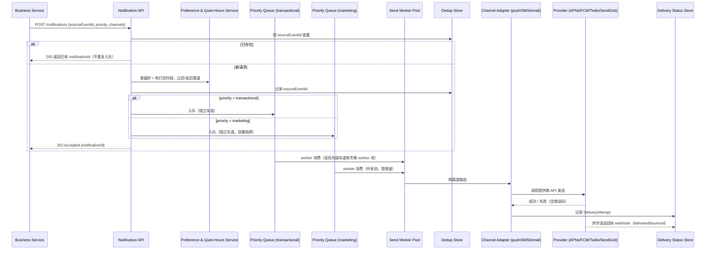

# 设计题解：通知系统（Notification System）

## 题目与范围

面试官通常这样开场："设计一个通知系统：业务方（订单、社交、营销、安全）触发事件后，系统要
把消息通过推送（push）、短信（SMS）、邮件（email）等多个渠道送达用户，并且要尊重用户的
渠道偏好和免打扰时段。" 这句话背后真正的难点不是"发一条消息"，而是**每个渠道都要经过一个
不受你控制、有自己配额和失败模式的第三方提供商，而你既要在这些配额之内把消息送出去，又要
保证一条一次性验证码（OTP）不会排在一次百万级营销活动后面**。

值得当场问清楚的澄清问题，以及它们各自改变的设计决策：

- **通知的来源是业务方直接调用 API，还是系统消费业务事件自己决定要不要发？** 决定入口是
  同步 API 还是事件驱动管道（见「高层设计」）——本题两者都支持，事务性通知走同步 API，
  行为触发的通知走事件订阅。
- **需要支持哪些渠道，各渠道的送达时效要求是什么？** 决定要不要做「优先级车道」分流
  （见「深入探讨」第 2 节）——OTP 和营销通知如果时效要求相同，就不需要分流。
- **用户能不能按通知类型精细控制偏好（例如"点赞"关邮件、"安全提醒"永远开）？** 决定偏好
  存储的粒度是"渠道级"还是"渠道 × 通知类型"这个二维矩阵（见「核心实体与 API」）。
- **同一事件短时间内触发多条通知，要不要合并（digest）？** 决定要不要做摘要合并管道
  （见「深入探讨」第 4 节）——如果每类通知天然低频，合并的收益就不大。
- **要不要做送达状态追踪和已读回执？** 决定要不要接入渠道自身的送达回执 webhook 并维护
  一张状态表（见「深入探讨」第 5 节）。

**范围内**：多渠道适配（push/SMS/email）、用户偏好与免打扰时段、按用户的速率上限与摘要
合并、优先级车道、去重与幂等发送、重试与提供商故障转移、送达状态追踪。**范围外**：通知的
内容生成/排版模板引擎的细节、站内消息中心（inbox）的展示与已读态 UI、面向业务方的自助
配置后台、跨渠道的营销效果归因分析。

## 需求

**功能需求（驱动设计的 3–5 条）**

1. 业务方可以通过同步 API 或异步事件触发一条通知，指定接收用户、模板与目标渠道（或让
   系统按偏好自动选择渠道）。
2. 用户可以为每种通知类型分别设置启用哪些渠道，并设置免打扰时段（quiet hours，按用户
   本地时区）。
3. 系统必须避免同一事件因重试而被重复发送给用户（去重与幂等）。
4. 事务性/安全类通知（如 OTP、账户异常提醒）必须优先于营销类通知送达，不能被营销大促
   活动的发送队列拖慢。
5. 单个用户在给定时间窗口内收到的非关键通知数量有上限，超限的低优先级事件被合并成摘要
   而不是逐条发送。

**非功能需求（数字化）**

- **事务性通知延迟**：OTP、支付确认一类，从触发到送达设备 P99 < 5 秒（端到端，含提供商
  网络时延）。
- **营销通知延迟**：允许分钟级到小时级完成一次大规模发送，不承诺秒级。
- **可用性**：接收通知请求的入口 API 目标 99.99%（业务方的下游依赖它不能超时）；实际
  送达渠道本身依赖第三方提供商，可用性由提供商 SLA 和本设计的多提供商故障转移共同决定。
- **至少一次送达，幂等去重**：允许提供商侧偶发重复投递，但同一逻辑通知不能因为**我方**
  重试被发送两次。
- **数据保留**：送达状态和事件日志保留 90 天，用于合规审计和送达率分析。

## 容量估算

**基础假设**：日活用户（DAU）5 亿；人均每天触发 5 条通知事件（社交互动、订单状态、
安全提醒、营销触达的总和）。

```
notifications/day = 5×10^8 × 5 = 2.5×10^9
avg QPS = 2.5×10^9 / 86,400 ≈ 28,935
peak QPS(×4 日间峰值系数，且大促会集中触发) ≈ 115,741
```

**这个 4 倍峰值系数不是拍脑袋的**：普通事件驱动通知的峰值系数通常在 2–3 倍，但营销大促
（比如"双十一开场"）会在几分钟内把百万级用户的通知请求砸进队列，这个尖峰比日常波动陡峭
得多——这正是「深入探讨」第 2 节要用独立车道隔离的原因。

**渠道分布假设**（本设计假设，不是某平台真实数据）：70% 走应用内推送（push），20% 走
应用内消息中心（不占用外部提供商配额，此处不展开），8% 走邮件，2% 走短信（短信成本最高，
只用于强提醒和无法推送到达的场景）：

```
push/day = 2.5×10^9 × 0.70 = 1.75×10^9    avg QPS ≈ 20,255
email/day = 2.5×10^9 × 0.08 = 2×10^8      avg QPS ≈ 2,315
SMS/day  = 2.5×10^9 × 0.02 = 5×10^7       avg QPS ≈ 579，peak(×4) ≈ 2,315
```

**这个短信峰值数字是第一个决定架构的数字**：Twilio 公开文档里长号码（long code）限速是
每个号码每秒 1 条消息（1 MPS），短代码（short code）限速 100 MPS（见「来源与延伸」）。
按峰值 2,315 QPS 计算：

```
需要的长号码数量 = 2,315 / 1 ≈ 2,315 个号码
需要的短代码数量 = 2,315 / 100 ≈ 24 个短代码
```

单一提供商账号下，靠加长号码去扛峰值是不现实的（几千个号码的合规与信誉管理成本极高）；
必须用短代码/多提供商池化，这是「深入探讨」第 1 节多提供商适配层要解决的第二个约束（第一
个约束是故障转移）。

**存储**：每条通知在事件日志里留一条约 300 字节的记录（用户 id、渠道、模板 id、状态、
时间戳、提供商回执 id）：

```
字节/天 = 2.5×10^9 × 300 = 7.5×10^11 B = 750 GB/天
90 天保留 = 750 × 90 = 67,500 GB ≈ 67.5 TB
三副本 ≈ 202.5 TB
```

**结论**：这道题里字节存储量是可控的（三副本 200 TB 级，用普通宽列存储即可），真正的
约束来自**外部提供商的限速配额（短信尤其明显，QPS 级）**和**发送必须在一个共享的发送
worker 池上排队、而不同优先级的通知不能互相阻塞**——容量估算里最该向面试官强调的正是这
两点，而不是"存多少 GB"。

## 核心实体与 API

**实体**

- **NotificationRequest**：`id, sourceEventId(幂等键), userId, type, priority, templateId, payload, channels[], createdAt`——业务方或事件消费者产生的原始请求，`sourceEventId`
  是去重的核心（见「深入探讨」第 3 节）。
- **UserPreference**：`userId, notificationType, channel, enabled(bool)`——渠道 × 通知类型
  的二维矩阵，而不是单一的"全局渠道开关"，因为用户对"有人评论了我"和"账号安全提醒"想要
  的渠道完全不同。
- **QuietHours**：`userId, timezone, startLocal, endLocal`——按用户本地时区存储的静默
  时段，事务性/安全类通知不受此限制。
- **DeliveryAttempt**：`id, notificationRequestId, channel, provider, status(queued/sent/
  delivered/failed/bounced), providerMessageId, attemptedAt`——每一次实际投递尝试的记录，
  是送达追踪和重试判断的依据。

**API**

```
POST /notifications                {sourceEventId, userId, type, priority,
                                     templateId, payload, channels?}
                                    按 sourceEventId 幂等 → {notificationId}
GET  /notifications/{id}/status    → {perChannelStatus[]}
PUT  /users/{id}/preferences       {notificationType, channel, enabled}
PUT  /users/{id}/quiet-hours       {timezone, startLocal, endLocal}
POST /webhooks/providers/{name}    提供商送达回执回调（delivered/bounced/failed），
                                    按 providerMessageId 关联回 DeliveryAttempt
```

**故意不做的**：不在 API 层暴露"立刻重试"的手动触发（重试完全由系统按退避策略自动
处理）；不支持业务方在请求里直接传渠道厂商的原始凭证（渠道凭证是系统侧配置，业务方只
说"要发什么"，不管"怎么发"）；不支持跨用户的批量个性化渲染放在这个同步 API 里做（大规模
营销活动走独立的批处理管道，产生的是逐条 `NotificationRequest`，而不是把"给 1000 万用户
发"当成一次 API 调用）。

## 高层设计



**写路径**：`POST /notifications` 先查去重存储（Dedup Store）确认 `sourceEventId` 没有
被处理过，再查偏好与免打扰时段决定实际要走哪些渠道（可能被过滤为 0 个——比如用户全部
渠道都关闭了这类通知），最后按优先级放入两条物理隔离的队列，立刻返回 202，不等待真正
发送完成——这把"业务方感知的确认延迟"和"用户实际收到通知的延迟"解耦，和 news feed 设计
里发帖确认与 fan-out 解耦是同一个原则（见 [[async.queues|Message Queues]]）。

**队列**：技术选型是**日志式消息队列（Kafka 一类）**，两条逻辑主题（transactional /
marketing）各自有独立的 partition 数和消费者组，物理隔离意味着营销队列即便堆积到百万
条积压，也不占用事务性队列的任何资源——这是「深入探讨」第 2 节的核心机制。

**发送与适配层**：Send Worker Pool 消费队列后，把与渠道无关的 `NotificationRequest`
翻译成每个渠道特定的调用（APNs 的 HTTP/2 请求、FCM 的 multicast 请求、Twilio 的短信
API、SendGrid 的邮件 API），技术选型是**无状态计算层**，可以按队列积压水平横向扩展；
限速和熔断在适配层针对每个提供商单独维护（见「深入探讨」第 1 节）。

**送达追踪**：提供商的异步 webhook 回执（送达确认、退信、设备已卸载等）写入 Delivery
Status Store，技术选型是**宽列存储（Cassandra 一类）**，按 `notificationId` 分区，因为
写入模式是简单的按通知追加状态变更，查询模式是"给我这条通知在每个渠道上的完整状态"。

## 深入探讨

### 多提供商适配层：配额、失败语义各不相同，还要支持故障转移

**问题**：push 走 APNs 和 FCM，SMS 走 Twilio，email 走 SendGrid——四个提供商有四套完全
不同的限速规则、错误码语义和 payload 限制（APNs 常规通知 payload 上限 4 KB，超限返回
`413 PayloadTooLarge`；FCM 的 `time_to_live` 默认最长 28 天，超时未送达的消息按
`collapse_key` 折叠，同一设备最多同时保留几个不同 collapse key 的消息；Twilio 短代码
限速 100 MPS，账号级限速由历史发送峰值决定；这些都是各自官方文档的规则，见「来源与
延伸」）。如果每个渠道适配器各自硬编码一套重试和限速逻辑，新增一个提供商（比如给某个
国家换一家短信网关）就要重新实现一遍。

**方案一：直接在业务逻辑里调用各提供商 SDK**。最快能跑起来，但提供商特有的错误码
（APNs 的 `Unregistered` 410、FCM 的无效 token、Twilio 的号码格式错误）会散落在业务代码
各处，无法统一做退避、熔断和跨提供商的故障转移决策。

**方案二（本设计采用）：统一的 Channel Adapter 接口 + 每提供商独立的限速器和熔断器**。
适配层对上暴露统一接口（`send(channel, payload) -> DeliveryResult`），对下按提供商各自
维护一个令牌桶限速器（例如短信提供商按 100 MPS 配置)和一个熔断器；提供商特有的错误码在
适配层内部被归一化成有限的几种语义（`permanent_failure`——如 token 失效，不再重试；
`transient_failure`——限速或超时，按退避重试；`success`）。当某个提供商的熔断器打开
（错误率超过阈值），同渠道如果配置了备选提供商（例如短信同时接了两家网关），适配层
自动切换到备选提供商，而不需要业务逻辑感知这次切换。

**数字**：以指数退避为例，首次失败后按 `2^n` 秒重试（1, 2, 4, 8, 16 秒，5 次尝试共
31 秒）为 transient failure 的默认策略；超过 5 次仍失败且备选提供商也不可用，则该次
投递标记为 `failed`，如果是事务性通知会触发告警而不是静默丢弃。

### 优先级车道：让一次营销大促不拖慢一条 OTP

**问题**：如果事务性通知和营销通知共用同一条发送队列，考虑一次营销活动触达 1 亿用户，
共享 worker 池吞吐量假设为 30,000 条/秒：

```
drain_time = 100,000,000 / 30,000 ≈ 3,333 秒 ≈ 55.6 分钟
```

如果一条 OTP 恰好在这次大促批量入队之后才产生，用纯 FIFO 队列，它要排在这 1 亿条营销
消息后面，最坏情况延迟接近 56 分钟——而 OTP 的延迟目标是 P99 < 5 秒，晚 56 分钟的验证码
等于验证码功能完全不可用。

**方案一：给营销通知限速，让它自己变慢**。能缓解下游提供商配额压力，但如果营销通知和
事务性通知还是同一条队列，即使营销发送变慢，队列里排在 OTP 前面的营销消息数量不变，
OTP 仍然要等前面的消息被一条条消费掉。

**方案二（本设计采用）：物理隔离的优先级车道**。事务性通知（`priority=transactional`）
和营销通知（`priority=marketing`）从入队开始就是两条独立的 Kafka 主题，各自有独立的
partition 集合和独立的 consumer group；事务性车道额外配置一个专属的小型 worker 池，
即使营销车道因为大促堆积到百万级，事务性车道的消费吞吐完全不受影响，OTP 排队延迟只取决
于事务性车道自身的瞬时负载（通常远低于营销车道）。渠道适配层的限速器也按车道分别维护
令牌桶——营销通知触达提供商限速上限时被节流的是营销车道的令牌桶，不影响事务性车道。

**权衡**：物理隔离车道意味着要为事务性车道预留一部分专属 worker 容量，即使在没有营销
大促的时段这部分容量也不能完全挪给营销车道用——这是用一部分资源利用率换取尾延迟隔离，
对于验证码这类会直接影响登录转化率的场景，这个权衡是值得的。

### 幂等发送与去重：sourceEventId、至少一次投递、去重窗口

**问题**：业务方的事件消费者、Notification API 的客户端重试、Kafka 消费者的 at-least-
once 语义，三个环节都可能导致同一个逻辑通知被处理两次。如果没有去重，同一条"你的订单
已发货"可能被推送三次，用户体验很差；对于短信这种按条计费的渠道，重复发送还直接产生
额外成本。

**方案（本设计采用）**：业务方在触发通知时必须提供一个业务语义唯一的 `sourceEventId`
（例如"订单 123 状态变更为已发货"这个事件本身的 id，而不是每次 HTTP 请求生成一个新
UUID——这一点和支付幂等键"每个操作意图一个 key"是同一原则，见
[[correctness.idempotency|Idempotency]]）。Notification API 在 Dedup Store 上对
`sourceEventId` 做唯一约束的原子写入；写入成功才继续入队，写入冲突（已存在）直接返回
已有的 `notificationId`，不产生第二条队列消息。去重窗口的保留时长必须覆盖所有下游环节
里最长的重试/排队窗口：

```
Twilio 消息队列保留时长 = 10 小时（Twilio 官方文档所述上限）
APNs 高优先级通知的合理存储时长假设 = 1 小时
dedup_window = max(10h, 1h) + 1h 安全余量 = 11 小时
```

由 Twilio 文档里最长的下游队列窗口（10 小时）决定了去重窗口至少要 11 小时，短于这个
窗口会在提供商侧的延迟重试触发时把本该去重的请求当成"新"请求处理。Kafka 消费者重复
消费（rebalance 后重新拉取未提交 offset 的消息）也不会造成重复发送——Send Worker 在
真正调用提供商 API 前会再查一次 `DeliveryAttempt` 是否已存在该 `notificationId` + 渠道
的成功记录，这是消费者侧的第二层幂等保护，采用的是"至少一次投递 + 目的端去重"而不是
追求端到端恰好一次（与 news feed 设计里 fan-out 的去重原则相同）。

### 用户级速率上限与摘要合并（digesting）

**问题**：一条帖子在一小时内收到 500 个赞，如果每个赞都单独触发一条"某某赞了你的帖子"
通知，作者一小时内收到 500 条推送，这不是"及时"而是骚扰，也白白消耗了推送提供商的配额
和用户设备的通知栏空间。

**方案一：不做合并，靠用户手动关闭通知类型**。简单，但用户要么忍受骚扰，要么彻底关掉
这类通知——彻底关闭意味着即使只有 1 个赞这种确实想被告知的情况也收不到。

**方案二（本设计采用）：按通知类型配置的时间窗口摘要合并**。低优先级、可合并的通知类型
（点赞、关注等社交互动类）在进入发送队列前先落一个短 TTL 的聚合窗口（比如 10 分钟一个
窗口）；同一用户、同一聚合键（比如"这条帖子的点赞"）在窗口内的多次触发只会在窗口结束时
产生一条"共 N 人赞了你的帖子"的摘要通知，而不是 N 条：

```
undigested = 500 条/小时
digested = 60 分钟 / 10 分钟一个窗口 = 6 条/小时（每个窗口至多一条摘要）
reduction = 500 / 6 ≈ 83.3 倍
```

事务性通知永远不进入这条合并管道——"你的验证码"和"订单已发货"必须逐条即时送达，摘要
合并只适用于业务方在请求里标注为可合并的低优先级类型。

### 用户偏好与免打扰时段：谁在什么时候能被打扰

**问题**：一次全球营销活动如果不考虑时区，在某个固定的服务器时间统一发送，会有大量用户
在自己的深夜时段被推送打扰。假设免打扰时段是本地 22:00–08:00（10 小时），且用户分布
近似覆盖全部 24 个时区：

```
quiet_hours_fraction = 10 / 24 ≈ 41.7%
```

不做时区感知调度的全球广播，理论上会有约 41.7% 的目标用户处于自己的免打扰时段——这个
比例大到不能被忽略。

**方案（本设计采用）**：`QuietHours` 按用户本地时区存储；营销类通知（可延迟）在过偏好
过滤这一步查询目标用户当前是否处于免打扰时段，如果是，则把这条 `NotificationRequest`
延迟入队到该用户本地时间 08:00（用一个按到期时间排序的延迟队列或数据库定时扫描实现），
而不是直接丢弃——用户依然会收到，只是被推迟到合适的时间。事务性/安全类通知不查询免打扰
时段，永远立即发送，因为"账号异常登录提醒"这类通知的价值恰恰在于打断，延迟等价于失效。

## 瓶颈、故障与演进

**热点与倾斜**：写侧热点是单条爆款内容（一篇帖子在几分钟内产生几十万条点赞通知的触发
事件）——这正是摘要合并要解决的问题，合并键（聚合键）需要按"目标内容"而不是"目标用户"
做一次预聚合，否则聚合逻辑本身在触发端就会成为热点。读侧热点是极少数提供商账号的限速
桶——如果所有短信流量共享同一个 Twilio 账号级限速桶，一次促销短信的爆发会把这个账号的
限速桶耗尽，连累同一账号下的验证码短信（这也是「深入探讨」第 2 节车道隔离要在适配层
限速器这一级也分车道维护的原因，而不只是队列层面隔离）。

**故障域**：

- **某个渠道的提供商整体不可用**（比如 APNs 大规模故障）：该渠道的适配器熔断器打开，
  停止无谓重试，Send Worker 转而对配置了备选提供商的渠道做故障转移；没有备选提供商的
  渠道（多数团队只接一家 APNs）该渠道的通知会持续排队等待恢复，其他渠道不受影响，因为
  队列和 worker 按渠道解耦。
- **队列不可用**：Notification API 的入队写入失败，API 返回 5xx，业务方按自己的重试
  策略重试——由于 `sourceEventId` 幂等，业务方重试是安全的，不会产生重复通知。
- **偏好/免打扰服务不可用**：为了不阻塞事务性通知的送达，事务性通知在偏好服务不可用时
  跳过偏好检查、直接按默认全渠道发送（宁可多发一条重要通知，不可漏发）；营销通知则反向
  降级为暂缓发送，等偏好服务恢复后再补发，因为营销通知漏发的代价远低于违反用户免打扰
  设置的代价。
- **Dedup Store 不可用**：为了不阻塞发送，允许暂时跳过去重检查（接受短暂窗口内可能重复
  发送的风险），而不是让整个通知系统因为去重存储故障而完全停摆——这是可用性优先于严格
  去重的一次显式权衡。

**10 倍演进**：日活从 5 亿到 50 亿。峰值 QPS 从约 11.6 万涨到约 115.7 万，单一 Kafka
集群的 partition 数需要相应增长，且短信这类提供商配额型渠道会先于计算资源成为瓶颈——
需要接入更多短信网关做横向的账号池化（而不只是纵向加号码），并且每个提供商账号的限速
桶需要按国家/地区做更细粒度的拆分，避免一个地区的促销耗尽另一个地区的验证码配额。

**100 倍演进**：日活 500 亿（纯粹推演）。集中式的单一 Notification API 不再现实，需要
按用户 id 做入口层的地理分片，让欧洲用户的请求就近处理、不必跨大洋访问；偏好和免打扰
服务的数据也需要跟着做同样的地理分片，因为大多数查询都是"这个用户"的单点读取，天然适合
按用户分片而不需要跨分片查询。

## 面试官会追问什么

**中级（mid）**
- "如果营销通知和事务性通知不分车道会怎样？" 见深入探讨第 2 节——共享队列下 OTP 最坏
  情况要排在整个营销批次后面，延迟以分钟甚至小时计，而不是目标的 5 秒内。
- "用户重复点了两次'发送验证码'按钮会怎样？" `sourceEventId` 由业务方在生成验证码事件
  时确定（同一次验证码请求同一个 id），Dedup Store 唯一约束保证不会发出两条。

**高级（senior）**
- "免打扰时段和延迟发送队列怎么保证真的在用户本地时间 08:00 触发，而不是漂移？" 延迟
  队列需要用一个可靠的到期扫描机制（时间轮或按到期时间排序的索引扫描），而不是让每条
  消息单独 sleep 到目标时间——后者在百万级延迟消息的规模下无法扩展。
- "多提供商故障转移会不会导致同一条通知被两个提供商各发一次？" 故障转移决策发生在
  Send Worker 拿到 `transient_failure` 之后、再次调用备选提供商之前，同一次
  `DeliveryAttempt` 只会有一个提供商处于"进行中"状态；如果原提供商的失败响应其实是
  网络超时但消息已经送达（provider-side 的模糊状态），备选提供商的重发可能导致用户
  收到两条——这是本设计承认的一个残余重复风险，只能靠渠道自身的去重能力兜底（比如 FCM
  的 `collapse_key`），不能在我方完全消除。

**参谋级（staff）**
- "怎么给一个新渠道（比如站内弹窗）接入这套系统，改动量有多大？" 只需要新增一个实现
  Channel Adapter 接口的适配器和这个渠道自己的限速器配置，队列、去重、优先级车道、偏好
  过滤这些核心管道完全不用动——这是统一适配层接口设计要达到的目标。
- "如果某个国家的短信合规要求（比如需要用户二次确认订阅）和别国不同，怎么在不改核心
  管道的前提下支持？" 把合规规则下沉到偏好过滤这一层，作为"这个国家的这个通知类型默认
  是否需要显式订阅"的一条策略数据，而不是在业务逻辑或适配层里写死 if-country 分支。

## 常见错误

- 把"重试"和"幂等"当成同一件事，只加了重试却没有 `sourceEventId` 去重，结果重试本身
  制造了重复发送。
- 优先级车道只在文档里说"营销的优先级低"，但实现上还是一条队列加一个优先级字段——一条
  队列里排在前面的低优先级消息不会因为后面来了高优先级消息就自动让路，必须是物理隔离的
  队列或独立的消费者池。
- 免打扰时段用服务器所在时区或 UTC 判断，而不是按用户本地时区，导致对某些地区的用户
  形同虚设。
- 只讨论"发送成功"，没有设计送达状态追踪，被追问"用户说没收到通知，你怎么排查"答不
  上来。
- 混淆"限速"（提供商配额层面的节流）和"频率上限"（用户体验层面的每用户通知条数上限），
  把两者用同一套令牌桶实现，导致一个用户的通知被合并逻辑处理却仍然受到与提供商配额
  无关的限制，或者反过来。

## 五分钟讲法

This is a notification system where every channel — push, SMS, email — routes through a
third-party provider with its own rate limits and failure semantics, and the central
tension is that a single shared send queue lets a marketing blast to a hundred million
users starve a time-sensitive OTP that needs sub-five-second delivery. My estimate shows
why: with a shared worker pool doing thirty thousand sends a second, draining a
hundred-million-message campaign takes about fifty-six minutes, which is fatal for a login
code. So I physically separate transactional and marketing traffic into independent
queues with independent consumer pools and independent per-provider rate-limit buckets,
so a marketing surge never touches the transactional lane's throughput. Idempotency comes
from a business-meaningful sourceEventId deduplicated with a unique-constraint write before
a request ever reaches the queue, with the dedup retention window sized to the longest
downstream retry window I could find documented — Twilio's ten-hour message queue — plus
margin. For low-priority social notifications like likes on a popular post, I batch them
into a short aggregation window instead of sending one notification per event, which in a
worked example collapses five hundred likes an hour into six digest notifications. Quiet
hours are evaluated per user in their local timezone, deferring marketing sends but never
delaying transactional ones, because a security alert that arrives late has already failed
its purpose. Each channel adapter normalizes a provider's specific error codes into a
small set of permanent-versus-transient outcomes, backs off exponentially on transient
failures, and fails over to a backup provider when one channel's circuit breaker trips —
without the core queueing, dedup, or priority logic ever knowing which provider is behind
a channel.

## 来源与延伸

- [Setting Up a Remote Notification Server (Apple Developer)](https://developer.apple.com/library/archive/documentation/NetworkingInternet/Conceptual/RemoteNotificationsPG/CommunicatingwithAPNs.html) —
  APNs 官方文档：payload 4 KB 上限、`apns-priority`/`apns-expiration`/`apns-collapse-id`
  语义、`410 Unregistered` 等错误码。本文的提供商归一化错误语义（permanent/transient）
  直接对照这些官方错误码设计；本文未涉及的是 APNs 具体的并发流数量上限（文档本身也说
  随证书/token 使用方式和服务端负载变化，没有给出固定数字）。
- [Set the Lifespan of a Message (Firebase Cloud Messaging)](https://firebase.google.com/docs/cloud-messaging/customize-messages/setting-message-lifespan) —
  FCM 官方文档：`time_to_live` 默认与最大值均为 4 周（2,419,200 秒），`ttl=0` 时未能
  立即送达的消息被丢弃而不存储。本文的去重窗口计算没有采用这个 4 周数字（那是消息
  可以被提供商保留多久，不是我方需要去重多久），两者是不同的时间窗口，容易被混淆。
- [Understanding Twilio Rate Limits and Message Queues](https://support.twilio.com/hc/en-us/articles/115002943027-Understanding-Twilio-Rate-Limits-and-Message-Queues) —
  Twilio 官方文档：长号码 1 MPS、短代码 100 MPS 的限速规则，以及消息在队列中最长保留
  10 小时。本文「深入探讨」第 3 节的去重窗口（11 小时）直接由这个 10 小时数字推出。
- [Air Traffic Controller: Member-First Notifications at LinkedIn](https://www.linkedin.com/blog/engineering/messaging-notifications/air-traffic-controller-member-first-notifications-at-linkedin) —
  LinkedIn 工程博客：按 member id 分区的流处理架构（Samza + Kafka + RocksDB 本地状态），
  "5 Rights" 决策框架，上线后将某类推送的 P90 端到端延迟从约 12 秒降到约 1.5 秒。本文
  没有采用 LinkedIn 这种把排序/去重/偏好判断都做成一个统一"决策引擎"的架构，而是把
  队列隔离、去重、偏好过滤拆成独立组件，取舍是牺牲一部分联合优化能力换取每个组件可以
  独立演进和替换（比如单独换短信提供商不影响去重逻辑）。
- [design-notification-service (algomaster.io)](https://algomaster.io/learn/system-design-interviews/design-notification-service) —
  商业刷题站的通知系统walkthrough，仅作为思路参照，未引用其具体表述。
