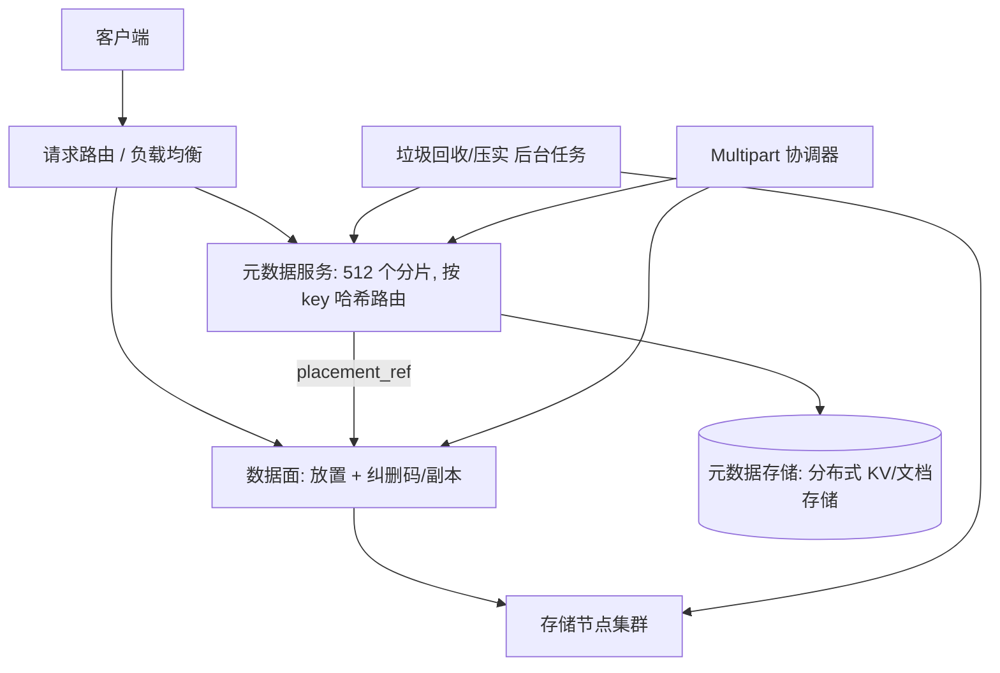

# 设计题解：对象存储（Object Storage，S3-class）

## 题目与范围

面试官通常这样开场："设计一个 S3 那样的对象存储：客户把任意大小的二进制对象放进
"桶"（bucket），用一个字符串 key 存取，系统要能撑到 EB（exabyte）级容量、单个
桶里几十亿个 key。"这句话背后的难点不是"存文件"，而是**元数据（谁拥有哪个 key、
它在哪、多大）和数据本身（那些字节）必须作为两套规模完全不同、扩展方式完全不同的
子系统分别设计**——元数据是海量小记录、要求低延迟强一致；数据是海量大字节、要求
高吞吐高耐久，两者混在一个系统里任何一边都会拖垮另一边。

值得当场问清楚的澄清问题，以及它们各自改变的设计决策：

- **对象能不能部分更新？** 不能——本题遵循真实对象存储的语义：PUT 整体替换对象，
  没有"往文件中间写"这回事（[[storage-object-vs-filesystem]]）。这决定了大对象只能
  用分片上传拼出来，而不是像块存储那样随机写。
- **耐久性目标是多少个 9？** 决定用副本还是纠删码、跨几个故障域（见「深入探讨」
  第 3 节）。本题目标：单对象年丢失概率不超过百万分之一量级——这是一个比营销数字
  更保守、也更容易被算术验证的目标，理由见「容量估算」。
- **一个桶里能有多少 key，List 操作要多快？** 决定元数据服务要不要按 key 前缀分片、
  以及 List 是不是天然分页操作（见「深入探讨」第 5 节）。
- **删除之后空间要不要立刻释放？** 不需要——真实系统都是异步回收（见「深入探讨」
  第 6 节），这决定了容量规划必须把"待回收但还占着盘"的部分算进去。

**范围内**：元数据服务与数据面的分离、数据放置、副本与纠删码的耐久性算术、
multipart 上传、十亿级 key 的列举、删除与覆盖对象的垃圾回收。**范围外**：跨区域
（cross-region）复制的具体协议、生命周期规则引擎（转冷/过期）的实现细节、访问控制
与加密密钥管理、对象存储之上的湖仓格式（Parquet/Iceberg）本身。

## 需求

**功能需求（驱动设计的 4 条）**

1. 客户创建桶，用任意字符串 key 在桶内 PUT/GET/DELETE 对象，对象大小从几字节到
   数十 TB 不等。
2. 支持按前缀列举（List）一个桶的 key，桶可能有数十亿个 key。
3. 大对象支持分片上传（multipart），任一分片失败只需重传该分片，不必重传整个对象。
4. 覆盖或删除对象后，旧版本的物理空间最终被回收，但回收不需要在请求返回前完成。

**非功能需求（数字化）**

- **耐久性**：单对象年丢失概率量级为百万分之一或更低——具体算术和失效模型见
  「容量估算」。
- **可用性**：读路径 99.99%；耐久性优先于可用性——**丢字节不可逆，暂时读不到可以
  重试**，这是对象存储和缓存类系统在优先级上的根本区别（[[storage-s3-numbers]]）。
- **延迟**：小对象首字节 P99 < 200ms；大对象吞吐由并行度决定，不是单连接延迟决定
  （见「深入探讨」第 4 节）。
- **写一致性**：GET/List 在任何 PUT（包括覆盖）之后立刻可见——不是最终一致，是
  强一致（[[storage-s3-conditional-writes]]）。
- **列举吞吐**：一个十亿级 key 的桶，按前缀过滤的分页列举，单页延迟 P99 < 100ms。

## 容量估算

**总量与对象数**（假设：全系统存 1 EB 逻辑数据，平均对象大小 256KB，覆盖从几 KB
的缩略图到几十 GB 的备份文件的混合工作负载）：

```
对象数 = 1e18 / 262144 ≈ 3.81×10^12（约 3.8 万亿个对象）
```

**请求量**（假设：日均 PUT 50 亿次、GET 500 亿次、DELETE 5 亿次，读写比 10:1，
峰值/均值 4×）：

```
平均 PUT QPS = 5e9 / 86400 ≈ 57,870
平均 GET QPS = 5e10 / 86400 ≈ 578,704
平均 DELETE QPS = 5e8 / 86400 ≈ 5,787

峰值 PUT QPS ≈ 231,481
峰值 GET QPS ≈ 2,314,815
```

这两个数字**驱动元数据服务的分片数**：S3 的官方性能文档给出一个分区好的 key 前缀
能扛 3,500 PUT/COPY/POST/DELETE 或 5,500 GET/HEAD 每秒（来源见「来源与延伸」）。
用这个基准反推：

```
支持峰值 PUT 需要的分片数 ≈ 231,481 / 3,500 ≈ 66
支持峰值 GET 需要的分片数 ≈ 2,314,815 / 5,500 ≈ 421
```

取较大值并留出增长余量，本设计的元数据服务规划为 **512 个分片**（2 的幂，便于用
哈希做一致性路由）。这个数字直接反驳了"对象存储元数据可以随便放一个数据库"的直觉：
421 这个下限已经说明元数据服务本身就是一个需要分片的分布式系统，不是数据面的附属品。

**元数据总量**（假设每个对象的元数据——key、版本号、大小、ETag、存储类型、放置
指针——占 200 字节）：

```
元数据总量 = 3.81×10^12 × 200B ≈ 763 TB
```

763TB 无法塞进单机数据库，这是「深入探讨」第 1 节里元数据服务本身要走分布式路线
的直接依据。

**副本 vs 纠删码的物理存储量**（1 EB 逻辑数据）：

```
三副本：物理存储 = 1 EB × 3 = 3 EB
纠删码 RS(10,4)（10 数据分片 + 4 校验分片，扩展系数 14/10 = 1.4）：
  物理存储 = 1 EB × 1.4 = 1.4 EB
节省 = 3 EB − 1.4 EB = 1.6 EB
```

这 1.6 EB 的差异就是「深入探讨」第 3 节要解释的：为什么大规模对象存储几乎都在暖数据
（warm data）上用纠删码而不是三副本。

**Multipart 上传的分片数**（一个 500GB 的对象，用 100MB 分片）：

```
分片数 = 500×1024MB / 100MB = 5,120
```

5,120 在 S3 文档给出的每次上传最多 10,000 分片的上限之内（来源见「来源与延伸」），
说明 100MB 是这个对象大小下的合理分片粒度；分片太小（比如 5MB 最小值）会让 5,120
变成 102,400，超过上限。

**列举一个十亿级 key 的桶**（假设 ListObjectsV2 类接口每页最多返回 1,000 个 key，
这也是 S3 文档给出的分页上限）：

```
一次全量列举需要的页数 = 10×10^9 / 1,000 = 10,000,000 页
```

一千万页顺序拉取即使每页 50ms 也要接近 6 天——这个数字直接说明"全量顺序 List"
从来不是给交互式查询用的操作，只能是离线批处理或者要求调用方用前缀做并行拆分
（见「深入探讨」第 5 节）。

**垃圾回收的规模**（假设对象平均生命周期使日均 5 亿次删除保持稳定）：

```
年删除对象数 = 5×10^8 × 365 ≈ 1,825 亿
年删除的逻辑字节量 = 1,825 亿 × 256KB ≈ 47.8 PB
年需要回收的物理字节量（RS(10,4)，1.4×）≈ 47.8 × 1.4 ≈ 67.0 PB
```

67PB/年不是一个可以"顺手做"的后台任务量级，这是「深入探讨」第 6 节里垃圾回收要
做成持续运行、限速、可监控的独立子系统的直接依据。

## 核心实体与 API

**核心实体**

- **Bucket**：`name`, `region`, `versioning_enabled`, `default_storage_class`。
- **Object**：`bucket`, `key`, `version_id`, `size`, `etag`, `storage_class`,
  `placement_ref`（指向数据面的放置组/条带），`created_at`, `tombstoned`
  （逻辑删除标记，见「深入探讨」第 6 节）。
- **MetadataShard**（内部实体）：`shard_id`, `key_range`, `backing_store`——元数据
  服务按 key 哈希或字典序范围分片，见「深入探讨」第 1 节。
- **PlacementGroup / Stripe**（内部实体）：`stripe_id`, `scheme`
  （`replication` 或 `erasure(k,m)`），`fragment_locations[]`——数据实际落在哪些
  存储节点上，见「深入探讨」第 2、3 节。
- **MultipartUpload**：`upload_id`, `bucket`, `key`, `parts[{part_number, etag,
  size}]`, `initiated_at`——对象在 `CompleteMultipartUpload` 成功前不存在。
- **CompactionJob**（内部实体）：`job_id`, `shard_or_volume_id`,
  `reclaimed_bytes`, `status`——垃圾回收的执行单元。

**API**

```
PUT /{bucket}/{key}
  headers: If-None-Match: *          # 仅当 key 不存在时创建
           If-Match: <etag>          # 仅当当前版本匹配时覆盖（CAS）
  body: 对象字节（≤5GiB；更大的对象走 multipart）
  → 200 {etag}

GET /{bucket}/{key}
  headers: Range: bytes=...
  → 200 / 206 {body}

DELETE /{bucket}/{key}
  → 204                              # 写一条墓碑；物理回收异步进行，见第 6 节

GET /{bucket}?prefix=&continuation-token=&max-keys=1000
  → 200 {keys[], next_continuation_token, is_truncated}   # 游标分页，key 字典序

POST /{bucket}/{key}?uploads                       # CreateMultipartUpload
  → 200 {upload_id}
PUT /{bucket}/{key}?partNumber=N&uploadId=          # UploadPart
  → 200 {etag}
POST /{bucket}/{key}?uploadId=                      # CompleteMultipartUpload
  body: {parts: [{part_number, etag}, ...]}
  → 200 {etag}                       # 原子性：这一步成功前，对象整体不存在
DELETE /{bucket}/{key}?uploadId=                    # AbortMultipartUpload
```

**刻意不在 API 里的东西**：没有"往对象中间某个偏移量写字节"的接口——PUT 永远整体
替换（[[storage-object-vs-filesystem]]）；没有目录/文件夹的创建或重命名接口——key
是扁平字符串，"文件夹"只是 UI 对公共前缀的展示幻觉，重命名一个"文件夹"在真实语义
上是重新 PUT 每一个 key；DELETE 不返回"已物理释放多少字节"，因为那个数字在请求
返回时还不存在。

## 高层设计



**请求路径走查**：

1. 客户端的请求先到路由层，按 `hash(bucket, key)` 决定归属的元数据分片。
2. 元数据服务查询/写入该 key 的元数据记录（存在、大小、放置指针、版本），这一步
   要求低延迟、强一致——它是整个请求路径里唯一必须同步完成的"小记录事务"。
3. **PUT**：元数据服务先接受写入意图，数据面把字节写成一个条带（副本或纠删码
   分片，见第 2、3 节），写入的所有分片/副本确认后，元数据服务原子性地把新版本
   置为"当前版本"——这一步就是 If-Match 条件写的落地点
   （[[storage-s3-conditional-writes]]）。
4. **GET**：元数据服务返回当前版本的放置指针，数据面按指针直接读对应的存储节点，
   支持按 Range 只读取需要的字节范围（[[storage-multipart-ranged-io]]）。
5. **DELETE**：元数据服务把当前版本标记为墓碑（tombstone），请求立刻返回；物理
   字节的清理完全不在这条路径上，由后台压实任务异步完成（第 6 节）。

存储技术选型：元数据服务用支持范围查询和强一致事务的分布式 KV/文档存储（因为
List 需要按 key 字典序扫描一段范围，纯哈希表做不到）；数据面用专门的对象/blob
存储引擎，针对顺序大字节写入和纠删码/副本管理优化，而不是通用文件系统——这正是
[[storage-object-vs-filesystem]]里说的、对象存储放弃"通用文件系统语义"换来的
简单性与规模。

## 深入探讨

### 元数据服务与数据面的分离

**问题**：如果元数据（谁拥有哪个 key）和数据（那些字节）用同一套存储引擎管理，
两者对存储系统的要求会互相拖累——元数据要求低延迟的小记录随机访问和范围扫描，
数据要求高吞吐的大字节顺序写入，用同一套引擎优化其中一个会牺牲另一个。

真实系统都做了这个分离，只是分层的名字不同：Facebook 的 Haystack 把系统拆成
**Directory**（记录每张照片在哪个 volume、能不能直接从 CDN/缓存拿到）、**Cache**
（吸收热点读）、**Store**（真正持久化的字节，按 volume 文件组织，每个 volume
里所有照片的元数据压缩到能装进内存，把随机的文件系统查找变成一次内存查找 + 一次
顺序磁盘读）三层（Beaver et al., 2010，见「来源与延伸」）；Windows Azure Storage
把系统拆成 **Partition Layer**（管理可扩展的索引、事务顺序、强一致性）和
**Stream Layer**（把数据当作有序的存储块流，负责跨节点复制与容错）两层（Calder
et al., 2011，见「来源与延伸」）。命名不同，但结构是同一个：一层管"在哪、是什么、
版本号"，一层管"这些字节本身怎么可靠地落盘"。

本设计的元数据服务对应 Haystack 的 Directory/Azure 的 Partition Layer：按 key
哈希分成 512 个分片（容量估算已经算出这是峰值 QPS 下限的必要分片数），每个分片
是一个支持范围查询的小型强一致存储；数据面对应 Haystack 的 Store/Azure 的 Stream
Layer：只关心"给定一个放置指针，把字节写到哪些节点、用什么冗余方案"，完全不关心
key 的语义。这种分离带来的好处是两层可以独立扩容：桶数量和 key 数量增长只需要
加元数据分片，总字节量增长只需要加存储节点，两者的增长曲线通常并不同步。

### 数据放置：从一致性哈希到 CRUSH

**问题**：给定一个对象（或它的一个纠删码分片），应该存到哪些物理存储节点上？
这个决定既要均匀分布负载，又要在节点增减时尽量少地搬动已有数据。

- **简单哈希取模**：新增/删除一个节点时几乎所有对象都要重新映射，等价于集群范围
  的数据大迁移。
- **一致性哈希**：只有 ~1/N 的对象在节点变化时需要重新映射，是通用分布式存储的
  标准解法。
- **CRUSH**（Ceph 采用）：不查任何中心化的位置表，而是根据一个描述集群拓扑的
  层级化 cluster map，对每个对象的 id 做确定性伪随机计算，直接算出它应该落在
  哪些节点上——客户端和存储节点都能独立计算出同一个答案，不需要一次网络往返去
  查"这个对象在哪"。拓扑变化（加节点、减节点、整机架下线）只影响 cluster map 里
  被改变的那一支，其余对象的映射保持不变（Weil et al., 2006，见「来源与延伸」）。

本设计采用 CRUSH 风格的放置：元数据服务只存一个"放置组 id"，不存具体的节点列表，
具体节点由数据面按当前的 cluster map 实时算出。好处是加一批新存储节点不需要更新
763TB 元数据里任何一条记录的放置指针——cluster map 变了，同一个放置组 id 算出的
节点集合自然跟着变。代价是每次读写都要做一次放置计算，比直接查表多一点 CPU 开销，
但换来了元数据服务和物理拓扑的解耦。

### 副本 vs 纠删码：耐久性算术

**问题**：给定同样的单盘年故障率，副本和纠删码谁更耐久、谁更省存储？这不能凭直觉，
必须算。

**失效模型（本节的算术全部基于这个模型，且明确这是一个简化模型）**：假设每块盘
的年故障率（AFR）独立同分布，取 Backblaze 2025 年度报告的实测值 **1.36%**
（来源见「来源与延伸」）；假设一年内的故障是否发生互相独立（忽略同一机架/同一
批次盘的相关故障，也忽略故障后到修复完成之间的窗口——真实系统靠持续后台巡检和
修复把窗口压到远小于一年，所以下面算出的概率是**保守的上界快照**，不是真实
MTTDL）。在一个由 N 个分片（副本或纠删码分片）组成、最多能容忍 F 个分片同时失效
的条带（stripe）里，条带在一年内丢失的概率是"N 个分片中有超过 F 个同时失效"的
二项分布尾概率：

```
三副本（N=3，容忍 2 个失效，全部 3 个同时坏才算丢）：
  P_丢失/年 ≈ 2.52×10^-6

纠删码 RS(10,4)（N=14，容忍 4 个失效，5 个以上同时坏才算丢）：
  P_丢失/年 ≈ 8.41×10^-7

纠删码 EC:4/16（N=16，容忍 4 个失效，同 MinIO 默认配置）：
  P_丢失/年 ≈ 1.79×10^-6
```

**反直觉的结果**：RS(10,4) 用的存储只有三副本的 1.4/3 ≈ 47%，但在这个简化模型下
反而**更耐久**（8.41×10⁻⁷ < 2.52×10⁻⁶，低了约 3 倍）。原因看主导项就清楚：三副本要丢
数据只需 3 块盘同时坏，概率是 p³ ≈ 2.5×10⁻⁶；RS(10,4) 要 14 块里至少 5 块同时坏，主导项
是 C(14,5)·p⁵ ≈ 2002 × 4.7×10⁻¹⁰ ≈ 9.3×10⁻⁷。条带变宽让组合数放大了两千倍，但多出来的
两个 p 因子（p ≈ 1.36%，每个约 1/74，合计约 1/5400）压过了它。也就是说，决定尾概率的是
**能容忍的同时失效的绝对个数**，不是校验分片占的比例。这正是
真实系统敢于用远低于 3× 的存储倍数、同时不牺牲耐久性的数学基础。

按这个模型换算到规模：假设每个条带覆盖约 1GB 逻辑数据（接近 f4 论文用的分片粒度），
1 EB 数据大约是 10 亿个条带，三副本方案预期每年约 2,515 个条带级丢失事件，
RS(10,4) 约 841 个——**这两个数字本身不是真实系统的耐久性指标**（真实系统靠远
小于一年的修复窗口和跨故障域的关联性隔离把数字压低好几个数量级，这也是 AWS 宣称
S3 单对象年耐久性达到 99.999999999%、即约 10⁻¹¹ 量级的原因，来源见「来源与延伸」），
它们只用来说明"宽条带纠删码在相同或更低存储成本下不比三副本差，甚至能更好"这个
结构性论证，不能作为本设计自身的耐久性承诺。

真实系统印证了"用适度宽的纠删码替代三副本"这条路线：Facebook 的 f4 把 Haystack
的三副本 + RAID-6（有效倍数 3.6×）换成 RS(10,4)（单区域有效倍数 2.8×，配合跨
区域的 XOR 编码进一步降到 2.1×），在报告的部署规模上，从 65PB 逻辑数据中省下了
53PB 物理存储（Muralidhar et al., 2014，见「来源与延伸」）；Windows Azure Storage
用局部重构码（Local Reconstruction Code，LRC）而不是普通 Reed-Solomon：
LRC(12,2,2) 把 12 个数据分片分成 2 组各 6 个，每组算 1 个局部校验，再算 2 个全局
校验，总共 16 个分片，存储倍数 16/12 ≈ 1.33×，和普通 12+4 的纠删码存储倍数几乎
一样，但重构单个丢失的数据分片只需要读同组内的 6 个分片，而不是普通纠删码要读的
全部 10～12 个——**局部性优化的是修复时的读放大，不是存储倍数本身**，这是耐久性
算术之外，真实系统在纠删码参数选择上的第二个维度。

### Multipart 上传

**问题**：一个几十 GB 到几十 TB 的对象，不可能等它完全传完才在服务端可见，也不能
一次网络故障就要求从头重传。

Multipart 把对象切成若干分片（本设计限定 5MiB～5GiB 一片，最多 10,000 片，这与
真实系统的公开限制一致，来源见「来源与延伸」），分片可以并行上传、独立重试；
所有分片确认后客户端调用一次"完成"，服务端原子性地把这些分片拼装、注册成一个
对外可见的对象——在这一步之前，客户端已上传的分片对 GET/List 完全不可见，不存在
"对象一半可见"的中间状态（[[storage-s3-conditional-writes]]的强一致性同样适用
于这一步）。

容量估算算过：一个 500GB 对象用 100MB 分片切成 5,120 片，在 10,000 片的上限内。
分片大小是一个真实的调优参数：分片太大，单片失败重传代价高、并行度低；分片太小，
逼近 10,000 片上限，且每片独立的 HTTP 开销（连接建立、元数据记录）开始主导总成本。
失败的分片上传如果从不清理，会一直占用存储却不出现在任何最终对象里——本设计要求
对未完成的 multipart 会话设置生命周期上限，超时自动触发 AbortMultipartUpload，
否则这类"孤儿分片"会在长期运行中持续泄漏存储。

### 列举十亿级 key 的桶

**问题**：一个桶几十亿个 key，"把它们都列出来"这个操作本身就是一个规模问题，
不能假设它能在一次调用里完成，也不能假设它足够便宜到可以频繁调用。

元数据既然按 key 哈希分成 512 个分片（第 1 节），朴素的按字典序范围扫描就做不到
了——哈希分片让相邻的 key 分散在不同分片上，没有任何一个分片持有"某个前缀下所有
key"的连续区间。真实对象存储的 List 语义要求按 key 的**字典序**返回，这意味着
元数据的物理组织不能是纯按哈希分片，至少要在支持范围查询的那一层（例如按 key
的字典序做范围分片，而不是哈希分片）维护一个可扫描的有序索引——这是和「深入探讨」
第 1 节"按哈希分片换负载均匀"的设计选择的直接冲突，真实系统的解法是用范围分片
（而不是哈希分片）做 List 索引，代价是负载均衡要额外处理"某个前缀突然写入暴增"
这种范围分片天然容易出现的热点。

在此基础上，List 天然是分页操作：每页返回有限数量的 key（本设计上限 1,000 个，
容量估算算出十亿级 key 的桶全量列举要一千万页），调用方用 `continuation_token`
翻页。这个限制直接决定两件事：其一，"统计一个桶里有多少 key"不应该通过全量 List
计数实现（一千万次调用的延迟和成本都不可接受），而应该在写路径上维护增量计数器；
其二，需要并行扫描全量 key（比如做一次全量数据校验）的场景，必须按前缀把扫描拆成
多个并行的 List 任务，而不是单线程翻页。真实系统的官方性能指南也建议按前缀并行化
读写以获得线性扩展的吞吐（来源见「来源与延伸」）。

### 覆盖与删除对象的垃圾回收

**问题**：DELETE（或覆盖旧版本）必须立刻返回，但物理磁盘空间的回收——尤其是纠删码
条带里某个分片对应的字节——通常不能在同一个请求里同步完成，那回收什么时候发生、
怎么发生？

最直接的做法——DELETE 时立刻原地擦除对应字节——在真实存储引擎里几乎不可行：
对象的物理字节可能和其他还活着的对象共享同一个底层文件/条带（正是为了避免"每个
对象一个文件"带来的海量小文件开销），原地擦除做不到，而且会让删除操作的延迟和
磁盘 I/O 模式绑死。真实系统的解法是**先标记后回收**，和 LSM 存储引擎处理删除的
思路是同一套（[[storage-tombstone-deletes]]）：DELETE 只是把元数据里的记录标成
墓碑（tombstone），请求立刻返回；真正回收空间靠一个独立的后台压实
（compaction）任务——Facebook Haystack 的做法是具体的先例：一个 Store 机器压实
一个 volume 文件时，把还活着的 needle（未被标记删除、未被覆盖的记录）复制到一个
新文件里，跳过所有已删除或重复的记录；压实进行期间新的删除请求同时写入新旧两个
文件，压实扫到文件末尾后原子性地把内存结构和文件都切换到新文件（Beaver et al.,
2010，见「来源与延伸」）。这个"复制活对象、跳过死对象、原子切换"的模式，和
LSM 树的 compaction（[[storage-compaction-strategies]]）是同一个思路在对象存储
层面的重现。

容量估算算过，这个后台过程在 1EB 规模的系统里一年要回收约 67PB 物理字节——量级
大到不可能是"顺手做"的辅助任务，必须是一个有独立资源预算、可监控、可限速的子
系统：既不能因为回收太慢导致"已删除"的数据占着盘拖累容量规划，也不能因为回收
太猛去抢占正常读写请求的磁盘 I/O 带宽。

## 瓶颈、故障与演进

**热点与倾斜**：

- **key 前缀热点**：如果客户用递增时间戳或顺序数字做 key 前缀（例如
  `2026-09-20/log-000001`），所有新写入会集中落在元数据服务里管理该前缀范围的
  少数几个分片上，即使总分片数有 512 个也没用——真实系统的官方指南明确指出这类
  顺序前缀是常见的自伤配置。修复方式是把哈希后的短前缀（如 key 的哈希值前 4 位）
  混入 key 里，强制写入打散到多个分片/前缀。
- **纠删码条带修复期间的额外读放大**：一个节点失效后，重建其上的每个分片都需要
  读同一条带里的其他 K 个分片（LRC 类方案把这个数字降到组内的一部分，见第 3 节）。
  节点故障率越高、条带越宽，重建期间对幸存节点的额外读流量越大，这是"条带宽度"
  和"耐久性"之外，纠删码参数选择的第三个维度——修复带宽。

**组件故障与降级**：

- **单个元数据分片故障**：只影响它负责的那部分 key 空间；如果该分片本身也做了
  副本（元数据存储自身的高可用是另一层，不等同于数据面的副本/纠删码），故障切换
  是分片内部的领导者选举，不波及其余 511 个分片。
- **单个存储节点/机架/AZ 故障**：CRUSH 风格的放置（第 2 节）本身就要求条带的
  分片分散在不同故障域，单节点或单机架故障只导致该条带临时降级到"容忍失效数减一"
  的状态，靠后台重建补齐，不影响该条带的可读性（只要失效数不超过 F）。
- **垃圾回收积压**：如果压实任务的处理速度长期低于删除产生的墓碑速度，物理占用
  会持续增长而不反映在"逻辑已删除"的用量里——这是一个隐藏的容量规划风险，需要
  独立监控"待回收字节数"这个指标，而不是只看"逻辑已用容量"。
- **Multipart 会话堆积**：客户端上传中断后从不调用 Complete 或 Abort，分片会
  一直占用存储——需要生命周期规则自动清理超时未完成的会话（见第 4 节）。

**10 倍与 100 倍演进**：

```
10x：逻辑数据 10 EB，RS(10,4) 物理存储 14 EB，元数据总量 ≈ 7.6 PB
     峰值 GET QPS ≈ 2,314.8 万，需要的元数据分片数 ≈ 4,209（→ 规划为 4,096）
100x：逻辑数据 100 EB，RS(10,4) 物理存储 140 EB，元数据总量 ≈ 76.3 PB
```

10 倍规模下，元数据分片数从 512 涨到约 4,096，这不只是"多开几个分片"——763TB
到 7.6PB 的元数据本身的元数据（分片路由表）也要重新设计，单层哈希路由可能不够，
需要引入一层间接寻址（分片再分组）；同时纠删码条带修复的总字节量随物理存储线性
增长到 14EB 量级，后台修复网络本身要单独扩容，否则一次机架级故障的修复时间会
被拖到不可接受的量级。100 倍规模下，单一存储技术栈很难覆盖所有对象的访问模式，
真实系统这时候会按访问频率分层（热/温/冷/归档），把纠删码参数、副本数、甚至物理
介质（SSD/HDD/磁带）都按层单独设计——这已经超出本题范围，但是它自然的下一步。

## 面试官会追问什么

**中级（mid）**

- "两个客户端同时 PUT 同一个 key，最终谁赢？"——默认是后写覆盖前写（last-writer-
  wins），没有隐式加锁；如果业务需要"只有我看到的还是最新版本才允许覆盖"，必须
  显式用 `If-Match` 做乐观并发控制（[[storage-s3-conditional-writes]]）。
- "DELETE 返回成功之后，为什么存储用量没有立刻下降？"——DELETE 只写了一个墓碑，
  物理回收是异步压实任务做的（第 6 节）。

**高级（senior）**

- "想把纠删码方案从 RS(6,3) 换成 RS(10,4)，已有的数据怎么办？"——新写入的条带
  用新方案；已有条带留在旧方案上，由后台任务按容量或访问频率优先级逐步用新方案
  重新编码，两种方案的条带在系统里长期共存，不是一次性停机迁移。
- "纠删码的条带要跨机架做还是跨可用区（AZ）/跨地域做，怎么选？"——跨机架能防
  单机架故障，延迟低；跨 AZ/跨地域能防整个数据中心级灾难，但重建时的跨域带宽
  和延迟成本高得多——f4 用单区域 RS(10,4) 加跨区域 XOR 编码的组合正是在这两者
  之间找的折中（第 3 节）。

**资深（staff）**

- "十亿级 key 的桶，怎么支持"某前缀下大概有多少对象"这类近实时统计，而不必每次
  扫全表？"——在写路径上对每个前缀维护增量计数器（写入时 +1、删除时 -1），查询
  时直接读计数器，而不是在查询时做一次 O(key 数) 的扫描。
- "元数据服务自己的持久化用什么存储引擎，能不能就用这套对象存储系统自己存自己的
  元数据？"——不行，这是循环依赖：元数据服务需要的是低延迟、强一致的小记录事务
  和范围查询能力，这和数据面为大字节吞吐优化的引擎是两种完全不同的存储形态
  （第 1 节），元数据服务通常用专门的分布式 KV/文档存储或数据库引擎，而不是
  这套系统本身对外提供的对象接口。

## 常见错误

- **把对象存储当文件系统用，指望部分写/追加**：PUT 永远整体替换对象，需要"追加"
  语义的场景（日志）应该攒够一批再整体写一个新对象，而不是反复覆盖同一个 key
  （[[storage-object-vs-filesystem]]）。
- **用连续递增前缀（时间戳、自增 ID）做 key**：把所有新写入压到元数据服务的同一
  个分片或同一个 key 前缀，触发限流；正确做法是把哈希值混入前缀打散写入热点。
- **把 DELETE 当成立刻释放物理空间的操作**：容量规划如果只看"逻辑已删除"而不看
  "待回收字节数"，会低估实际磁盘占用（第 6 节）。
- **大对象只用单个 PUT 上传**：容易撞到单次请求的大小上限，且一旦失败要从头
  重传整个文件；应该用 multipart 分片上传（第 4 节）。
- **凭"存储倍数越小=越不耐久"的直觉比较副本和纠删码**：真正决定耐久性的是条带
  能容忍的同时失效数相对总分片数的关系，不是简单的存储倍数比较——第 3 节的算术
  证明宽纠删码可以同时更省存储、更耐久。
- **想在十亿级 key 的桶上做一次性全量 List 来统计数量**：List 是分页操作，全量
  扫描的调用次数和延迟在这个规模下都不可接受；统计类需求应该在写路径上用增量
  计数器实现（第 5 节）。

## 五分钟讲法

I'd split this into two subsystems with very different scaling profiles: a metadata
service that tracks which key maps to which physical placement, and a data plane that
actually stores bytes durably. At 1 exabyte of logical data with a 256KB average
object size, that's about 3.8 trillion objects and roughly 763TB of metadata alone, so
the metadata service has to be sharded — using S3's published per-prefix throughput
numbers, sustaining peak GET traffic needs on the order of 400+ shards, so I'd plan for
512. Placement uses a CRUSH-style scheme: instead of the metadata service storing a
literal list of nodes per object, it stores a placement-group id, and both clients and
storage nodes compute the actual node set deterministically from a shared cluster map,
so adding capacity doesn't require rewriting any metadata records. For durability, I'd
default to wide erasure coding like Reed-Solomon(10,4) over triple replication — it
uses only 1.4x storage instead of 3x, and a simplified binomial failure model using a
real 1.36% annual drive failure rate actually shows it's more durable too, because what
matters is the absolute number of simultaneous failures a stripe tolerates, not the raw
storage multiplier. Large objects go through multipart upload — independent, retryable,
parallel parts that only become one visible object on an atomic completion call, never
half-visible. Listing a multi-billion-key bucket has to be a paginated, prefix-
parallelizable operation, not a single call, and deletes are tombstones — physical
reclamation happens through an asynchronous background compaction process, the same
shape as LSM-tree compaction, because at this scale garbage collection alone can be
tens of petabytes a year and needs its own throttled, monitored budget. At 10x scale,
the metadata shard count and the erasure-coding repair bandwidth both need to grow
structurally, not just by adding more of the same boxes.

## 来源与延伸

- [Finding a Needle in Haystack: Facebook's Photo Storage](https://www.usenix.org/legacy/event/osdi10/tech/full_papers/Beaver.pdf)
  （Beaver, Kumar, Li, Sobel, Vajgel, OSDI 2010）—— Directory/Cache/Store 三层
  分离、按 volume 组织字节并把元数据压进内存、以及 delete 标记 + compaction 回收
  空间的第一手描述。本题「深入探讨」第 1 节和第 6 节的机制直接来自这篇论文，取舍
  差异是本题用哈希分片的元数据服务而不是 Haystack 按 volume 组织的 Directory。
- [f4: Facebook's Warm BLOB Storage System](https://www.usenix.org/system/files/conference/osdi14/osdi14-paper-muralidhar.pdf)
  （Muralidhar et al., OSDI 2014）—— RS(10,4) 纠删码、有效副本倍数从 3.6× 降到
  2.8×/2.1× 的真实数字，以及 65PB 逻辑数据省下 53PB 物理存储的部署规模。本题
  「深入探讨」第 3 节的耐久性算术用这篇论文的编码参数做例子，但耐久性概率本身是
  本题按 Backblaze 的 AFR 自行计算的简化模型，不是论文里的数字。
- [Windows Azure Storage: A Highly Available Cloud Storage Service with Strong Consistency](https://azure.microsoft.com/en-us/blog/sosp-paper-windows-azure-storage-a-highly-available-cloud-storage-service-with-strong-consistency/)
  （Calder et al., SOSP 2011，及后续 Huang et al., USENIX ATC 2012 的纠删码篇）
  —— Partition Layer/Stream Layer 的元数据-数据分离，以及局部重构码 LRC(12,2,2)
  的参数。本题第 1 节的两层架构和第 3 节的 LRC 存储倍数计算（16/12）都以这篇及其
  后续论文为依据。
- [CRUSH: Controlled, Scalable, Decentralized Placement of Replicated Data](https://ceph.com/assets/pdfs/weil-crush-sc06.pdf)
  （Weil et al., SC 2006）—— 用伪随机哈希对层级化 cluster map 计算放置、不查
  中心化位置表、拓扑变化只影响局部映射的算法本身。本题第 2 节采用这个思路但没有
  实现 CRUSH 论文里针对不同故障域权重的完整规则语言，是一个简化版本。
- [Best practices design patterns: optimizing Amazon S3 performance](https://docs.aws.amazon.com/AmazonS3/latest/userguide/optimizing-performance.html)
  （AWS 官方文档）—— 每个分区好的前缀 3,500 PUT/COPY/POST/DELETE 或 5,500
  GET/HEAD 每秒、无前缀数量上限的说法的来源。本题「容量估算」和「深入探讨」第 5
  节的分片数推导直接用这两个数字，但 512/4,096 这样的具体分片规划是本题自己的
  设计选择，不是 AWS 的真实内部实现。
- [Backblaze Drive Stats for 2025](https://www.backblaze.com/blog/backblaze-drive-stats-for-2025/)
  （Backblaze 官方博客）—— 本题「深入探讨」第 3 节耐久性算术里用的年故障率（AFR）
  1.36% 的实测来源，取自 Backblaze 自己运营的数十万块盘的真实故障统计，而不是
  厂商标称值。
- [Amazon S3 quick facts / multipart upload limits](https://docs.aws.amazon.com/AmazonS3/latest/userguide/qfacts.html)
  （AWS 官方文档）—— 单对象最大 48.8TiB、multipart 单次最多 10,000 分片、分片
  5MiB–5GiB 的具体数字来源，本题「深入探讨」第 4 节的算术直接采用这些上限；第 5
  节用到的 ListObjectsV2 单页最多 1,000 个 key，来自 [ListObjectsV2 API 参考](https://docs.aws.amazon.com/AmazonS3/latest/API/API_ListObjectsV2.html)
  这个独立页面。
- [Data protection in Amazon S3](https://docs.aws.amazon.com/AmazonS3/latest/userguide/DataDurability.html)
  （AWS 官方文档）—— "设计为 99.999999999% 耐久性、99.99% 可用性"、跨至少 3 个
  可用区冗余存储的原文表述。本题「深入探讨」第 3 节引用这个数字作为真实系统达到的
  耐久性量级，明确区分于本题自己用简化二项分布模型算出的、量级低得多的条带丢失
  概率——两者不是同一个东西，差距的原因（持续修复窗口远小于一年、故障域隔离）在
  正文中说明。
