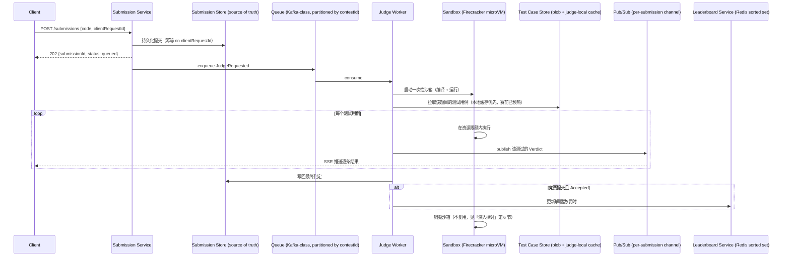

# 设计题解：在线判题系统（Online Judge，以 LeetCode / Codeforces 为例）

## 题目与范围

面试官通常这样开场："设计一个像 LeetCode 或 Codeforces 那样的在线判题系统：用户提交代码，
系统在后台运行并返回通过/失败的结果；系统还要支持限时竞赛（contest），竞赛期间有一块实时
更新的排行榜。" 这句话背后真正的难点不是"跑代码"本身，而是**这段代码来自匿名互联网用户、
完全不可信，系统必须在几乎为零的沙箱逃逸容忍度下，把它跑在和其他所有租户共享的机器集群
上**，而且这一切还要在一场竞赛开考的那一分钟内经受住成千上万人同时提交的冲击。

值得当场问清楚的澄清问题，以及它们各自改变的设计决策：

- **是"随时可提交的练习模式"，还是"固定时间开考的竞赛模式"，还是两者都要？** 竞赛模式引出
  开考瞬间的提交洪峰和排行榜问题（见「深入探讨」第 3、5 节）；纯练习模式的负载相对平滑，
  不需要为一分钟内的爆发式扩容单独设计。本题两者都覆盖，因为竞赛模式是这道题真正的难点
  所在。
- **要不要支持多种语言（C++/Java/Python/Go…）？** 决定沙箱镜像的数量和编译步骤的复杂度，
  但不改变沙箱选型本身——本题假设支持主流的 6–8 种语言。
- **测试用例对用户是完全隐藏，还是有一部分"样例"公开？** 决定 API 要不要暴露"用示例测试
  快速自测"这个动作，也决定判题结果要不要携带具体的失败输入（见「常见错误」）。
- **要不要处理代码抄袭 / 查重？** 决定要不要做「深入探讨」第 6 节的相似度检测管道——本题
  按需要做设计，因为这是竞赛类产品无法回避的问题。
- **允许用户看到自己代码在别人机器上跑得比别人慢多少吗（性能类题目的严格计时）？** 决定
  计时要不要做到"跨主机公平"这个程度（见「深入探讨」第 2 节）。

**范围内**：单次提交的编译与沙箱执行、资源限额与公平计时、提交队列与开考瞬间的弹性伸缩、
测试用例存储与结果流式返回、竞赛实时排行榜、代码作弊与滥用防护。**范围外**：题目内容本身
的编写与审核工作流、讨论区/题解社区、以人事考核为目的的远程面试编程环境（这类系统的信任
边界和延迟要求不同，是另一道题）、题目难度的自动分级算法。

## 需求

**功能需求（3–5 条驱动设计的核心项）**

1. 用户提交代码后，系统编译并针对一组测试用例运行，返回逐条测试的判定结果（Accepted /
   Wrong Answer / Time Limit Exceeded / Memory Limit Exceeded / Runtime Error / Compile
   Error）。
2. 每次执行必须被限定在明确的 CPU 时间、内存和进程数上限内，超限即判负，且限制必须对所有
   提交公平——不能因为宿主机当时繁忙就让某次提交"冤枉地"超时。
3. 竞赛模式下，用户在开考后的固定窗口内提交，系统维护一块按解题数/罚时排序的实时排行榜。
4. 任意一次代码执行都不能读到本次提交之外的任何数据——既不能读到测试用例本身的隐藏部分，
   也不能读到其他用户的提交或宿主机上的任何残留数据。
5. 系统能检测明显的作弊与滥用行为（代码抄袭、多账号、提交洪泛攻击）并标记或限流，而不是
   完全依赖事后人工审查。

**非功能需求（数字化）**

- **隔离强度**：沙箱逃逸的容忍度是零——这是一条安全红线，不是可以用"绝大多数情况下没问题"
  来打折扣的可用性指标，直接决定「深入探讨」第 1 节的沙箱选型。
- **判题延迟**：练习模式下单次提交从入队到返回完整结果 P99 < 10 秒；竞赛模式下允许因为
  队列排队而略慢，但排队本身要对用户可见（"已入队，前面还有 N 个"），而不是让用户盯着一个
  没有反馈的转圈。
- **计时公平性**：同一份代码在系统繁忙和空闲时段的判定结果（AC/TLE）应当一致——这比"绝对
  数值精确"更重要，直接推动「深入探讨」第 2 节里"按 CPU 时间而非墙钟时间判罚"的选择。
- **可用性**：判题管道目标 99.9%（练习模式短暂降级可以接受重试）；但竞赛期间的排行榜和
  提交入口目标更高——开考的那一分钟如果整体不可用，对参赛体验是灾难性的，需要专门的预热
  设计（见「深入探讨」第 3 节）。
- **持久性**：每次提交的源码、逐条测试结果、最终判定必须持久化存档，不因判题管道故障而
  丢失——这是申诉、复核、赛后系统测试重判的前提。

## 容量估算

估算的核心不是"存多少字节"，而是**开考那一分钟的提交洪峰需要多少并发沙箱容量，以及这个
数字和平时的常态负载差多少个数量级**——这个比例决定了要不要做赛前预热式扩容。

**竞赛场景假设**：一场周赛有 10 万注册参赛者，其中 80% 会在开考时真正到场：

```
到场参赛者 = 100,000 × 0.8 = 80,000
```

**平均提交速率**：假设赛程 105 分钟，每位到场选手全程平均提交 8 次（多道题、每题因 WA/TLE
反复重交）：

```
总提交数 = 80,000 × 8 = 640,000
赛程秒数 = 105 × 60 = 6,300 秒
平均提交 QPS = 640,000 / 6,300 ≈ 101.6
```

**开考瞬间的爆发**：开考后前 5 分钟，多数选手会先攻最简单的第一题，假设到场选手中 50%
会在这 5 分钟内至少提交一次：

```
爆发窗口提交数 = 80,000 × 0.5 = 40,000
爆发窗口秒数 = 5 × 60 = 300 秒
爆发 QPS ≈ 40,000 / 300 ≈ 133.3
```

**这个爆发 QPS 是第一个决定架构的数字**，但真正驱动"要准备多少台沙箱"的不是 QPS 本身，
而是**利特尔法则（Little's Law）**换算出的并发占用：如果每次提交从拿到沙箱到跑完全部
测试平均耗时 4 秒（编译约 1 秒 + 运行数十个测试用例约 3 秒），则爆发期间需要的并发沙箱数：

```
爆发期并发沙箱需求 = 133.3 × 4 ≈ 533 个
```

对比赛前的常态背景流量（假设平时练习模式平均 8 QPS）：

```
常态并发沙箱需求 = 8 × 4 = 32 个
scale_factor = 533 / 32 ≈ 16.7
```

**这是第二个决定架构的数字**：从常态到开考瞬间，需要的并发沙箱容量在几分钟内跳变近 17
倍。如果依赖基于 CPU 利用率触发的被动式（reactive）自动伸缩，云厂商从"检测到负载升高"到
"新主机拉起并可用"通常要几分钟，而这轮爆发在 60 秒内就已经到来——这个时间差逼出「深入
探讨」第 3 节的预热式（pre-warmed）伸缩方案。

**测试数据存储**：假设题库共 5,000 道题，每题平均 80 个测试用例，每个用例（输入+期望
输出）平均 5KB：

```
原始测试数据 = 5,000 × 80 × 5KB = 2,000,000 KB ≈ 2 GB
三副本 ≈ 6 GB
```

**结果流式返回的带宽**：爆发窗口内 4 万次提交，每次提交平均产生 15 条逐测试用例的判定
事件，每条事件约 150 字节：

```
爆发窗口总流式数据量 = 40,000 × 15 × 150B = 90,000,000B = 90 MB
平均流式吞吐 = 90MB / 300s = 300 KB/s
```

**结论**：和信息流一类系统不同，这道题里存储字节数和网络带宽从头到尾都不是瓶颈（测试
数据只有个位数 GB，流式返回的带宽只有几百 KB/s）——真正的瓶颈是**计算并发度**，而且这个
并发度需求在竞赛开考的一分钟内从个位数陡增到五百多，这正是容量估算里最值得向面试官强调
的对比。

## 核心实体与 API

**实体**

- **Problem**：`id, title, timeLimitMs, memoryLimitMb, languages[]`——题目元数据与限额，
  限额按题目而非全局设置，因为不同题目的合理时间/内存差异很大。
- **TestCase**：`id, problemId, kind(sample/secret), inputRef, expectedOutputRef`——
  区分公开样例和隐藏测试，对齐 ICPC/Kattis 题目包格式里 `data/sample` 与 `data/secret`
  的划分（见「来源与延伸」），本身只存对象存储里的引用，不内联大文件。
- **Submission**：`id, userId, problemId, contestId?, code, language, clientRequestId,
  status, createdAt`——权威记录，判题状态机的主体。
- **Verdict**：`submissionId, testCaseId, result, timeUsedMs, memoryUsedKb`——每条测试
  用例的独立判定，允许流式追加。
- **ContestParticipant** / **LeaderboardEntry**：`contestId, userId, solvedCount,
  penaltyTime, lastAcceptedAt`——竞赛排名的物化视图，可以从 Submission + Verdict 重建。

**API**

```
POST   /submissions              {problemId, code, language, contestId?, clientRequestId}
                                  按 clientRequestId 幂等 → {submissionId, status: "queued"}
GET    /submissions/{id}         → {status, queuePosition?, verdicts[]}（轮询兜底）
GET    /submissions/{id}/stream  SSE，逐条测试用例结果推送
POST   /contests/{id}/register   报名，需在开考前完成（用于「深入探讨」第 3 节的预热容量估算）
GET    /contests/{id}/leaderboard?cursor=   → {entries[], nextCursor}
GET    /problems/{id}/samples    仅返回公开样例，不返回隐藏测试
```

**故意不做的**：不提供"直接给我一个 shell"这类通用代码执行接口——每次执行都必须绑定一个
`problemId`，输入输出边界由题目定义，这本身就是权限最小化的一部分；不支持提交后修改代码
（只能撤回重交，避免竞态判定）；不在 API 层暴露宿主机的任何调度细节（哪台机器跑的、和谁
共享主机）；不支持无限频率的轮询豁免——`GET /submissions/{id}` 本身也要限流，鼓励客户端
走 SSE。

## 高层设计



**写路径**：`POST /submissions` 只对 Submission Store 做一次持久化写就返回，不等待判题
完成——这把"提交已被系统接收"和"判题已经跑完"两个事件彻底解耦，后者交给 Queue 异步驱动。
Submission Store 用宽列/文档存储（Cassandra/DynamoDB 一类），按 `userId` 或 `contestId`
分区，因为写入模式是简单追加，查询也总是"某用户的提交历史"或"某场竞赛的全部提交"这两种
之一，不需要跨用户事务。

**判题路径**：Queue 用日志式消息队列（Kafka 一类），按 `contestId` 分区而不是随机分区，
这样同一场竞赛的提交会集中落在少数几个 partition 上，Judge Worker 消费时对该竞赛的测试
用例有更高的本地缓存命中率——这是 [[async.queues|Message Queues]] 里"消费者局部性"的
直接应用。Judge Worker 池从队列拉取任务、启动沙箱、拉取测试用例、逐条执行，并把每条测试
的判定结果实时发布到一个以 `submissionId` 为 key 的 pub/sub 频道，供 SSE 层转发给客户端。
沙箱选型（见「深入探讨」第 1 节）是这条路径上最关键的技术决策，因为它同时决定了安全边界
和每台宿主机能承载的并发密度。

**读路径 / 排行榜**：竞赛排行榜维护在内存数据结构存储（Redis 一类）的有序集合
（sorted set）里，score 是"解题数、罚时"的复合排序键，只在一次 Accepted 判定发生时更新，
客户端定期拉取物化好的分页结果，而不是每次任意一条提交状态变化都往所有观众推送重排——这
和排行榜本身的读远多于"影响排名的写"（只有 Accepted 才算数，Wrong Answer 不改变排名）
这一点是一致的。

## 深入探讨

### 隔离机制选型：容器、gVisor、Firecracker microVM 与 seccomp/nsjail

**问题**：待执行的代码来自匿名互联网用户，必须假设它是恶意的——会尝试逃逸沙箱、探测宿主机
文件系统、发起网络请求外传数据，或者单纯地用 fork bomb 拖垮整台机器。隔离机制的选择要在
"隔离强度"和"启动延迟 + 单机密度"之间权衡，而这道题的爆发式负载（见容量估算）对密度尤其
敏感。

**方案一：普通容器（namespaces + cgroups + runc）**。启动通常在几十到上百毫秒，单机可以
跑上千个容器，但容器和宿主机共享同一个内核——容器内进程发起的系统调用最终由宿主机内核
本身处理，一旦内核存在未修补的提权漏洞，逃逸后直接拿到宿主机权限。对匿名、高对抗性的公开
提交场景，这个信任边界太薄。

**方案二：gVisor（用户态内核拦截系统调用）**。gVisor 的 Sentry 组件拦截应用发出的全部
系统调用，在用户态自己实现一遍，不直接把它们转发给宿主机内核——这把攻击面从"整个宿主机
内核"收窄到"Sentry 自己实现的那一部分"，官方文档也说明 CPU 密集型代码（这正是判题代码的
典型特征）基本没有额外开销，开销主要出现在系统调用密集/IO 密集的工作负载上（见「来源与
延伸」）。代价是 gVisor 依然和宿主机共享同一个内核（用于自己的运行），不是一个独立的
硬件级边界，隔离强度介于容器和真实虚拟机之间。

**方案三（本设计采用）：Firecracker microVM，逐提交一个**。Firecracker 用 KVM 起一台
极简的硬件虚拟化虚拟机，NSDI'20 论文和 AWS 官方博客给出的数字是：启动时间 < 125ms、每个
microVM 的内存开销 < 5MiB，单机可以打包上千个 microVM（见「来源与延伸」）。它提供的是
硬件虚拟化级别的边界——逃逸需要突破 KVM 本身，而不是应用层的系统调用过滤——这是对匿名
提交场景唯一"零容忍沙箱逃逸"要求下站得住脚的强度。启动延迟和内存开销都足够低，不会拖累
容量估算里"爆发期 533 个并发沙箱"这个数字的可行性（几台裸金属主机就能同时承载这个量级）。

**方案四：seccomp-bpf + Linux namespaces（如 Google 的 nsjail）**。用 seccomp-bpf 白名单
过滤系统调用、配合 namespaces 和 cgroups 做资源与视图隔离，完全不需要启动一台虚拟机，
延迟比方案一更低。但本质上和方案一同属"共享宿主机内核"这一类——nsjail 官方定位是"轻量级
进程隔离工具"，不是一个独立的安全边界。学术竞赛沙箱 isolate（被 IOI 官方的 CMS 系统采用，
见「来源与延伸」）走的是同一条路线：namespaces + cgroups，没有虚拟机层。这类方案在参赛者
经过身份验证、规模较小、对抗性较低的场域（校内赛、机构内部工具）性价比很高，但不适合本题
"匿名公开提交、规模可以到十万人竞赛"的信任模型。

**结论**：对外部匿名提交（练习模式 + 公开竞赛），逐提交一个 Firecracker microVM，用完
即销毁（见第 6 节）；对内部可信工具（比如题目作者自己上传测试用例时跑的校验器，见第 4
节），用更轻的容器/nsjail 路径换取更低的延迟，因为这部分的执行者是被信任的题目维护者而
不是匿名用户。

### 资源限额与公平计时

**问题一：该按墙钟时间（wall-clock time）还是 CPU 时间判 TLE？** 如果按墙钟时间，同一份
代码在宿主机繁忙、CPU 被其他沙箱抢占时会因为纯粹的调度延迟而超时，即使它自己消耗的 CPU
周期完全没变——这违反"计时公平性"的非功能需求：同一份代码在不同时段应该得到相同的判定。

**方案（本设计采用）**：主判据用 cgroup 的 `cpu.stat` 累计 CPU 时间而不是墙钟时间，这样
判定只取决于代码本身的计算量，不取决于宿主机当时有多繁忙。但仍然需要一个远高于 CPU 限额
的墙钟时间硬上限（例如 CPU 限额的 3–5 倍）作为兜底——否则一份代码可以通过大量 `sleep`
或者等待一个永远不会就绪的网络连接，几乎不消耗 CPU 却无限期占用一个沙箱槽位，变相拖垮
「深入探讨」第 3 节里算出的并发容量。

**问题二：内存超限和进程数爆炸怎么处理？** 内存直接由 cgroup 的内存子系统限额并在超限时
触发 OOM kill，判为 Memory Limit Exceeded。更隐蔽的是 fork bomb 类攻击——代码不消耗多少
单个进程的内存或 CPU，而是疯狂 fork 子进程耗尽宿主机的进程表和调度器容量。cgroup 的 pids
控制器可以直接限制一个 cgroup 内允许存在的进程/线程总数（比如上限 32），这个限制和 CPU/
内存限额相互独立，必须同时配置，否则"合规的 CPU 和内存占用、失控的进程数"这种组合会绕过
前两道限额直接打垮宿主机。

### 开考瞬间的提交洪峰：队列与预热式弹性伸缩

**问题**：容量估算给出两个互相矛盾的数字——常态背景流量只需要约 32 个并发沙箱，但开考
后的爆发窗口需要约 533 个，16.7 倍的跳变发生在不到一分钟内。被动式自动伸缩（根据 CPU
利用率或队列深度触发扩容）在检测到负载升高、调度新主机、完成启动之间通常有几分钟的控制
回路延迟——这个延迟比爆发本身到来的速度还慢，等新容量上线时,用户已经在盯着"排队中"看了
几分钟。

**方案一：只依赖被动式自动伸缩**。实现简单，对未知的、不可预测的流量尖峰是唯一选择，但
对这道题不成立——控制回路延迟晚于爆发到达的速度，会在开考瞬间造成大量提交排队积压，直接
违反"判题延迟"的非功能需求。

**方案二（本设计采用）：预热式（pre-warmed）容量 + 被动式兜底**。这道题的特殊之处在于
**开考时间和报名人数都是提前已知的**——不是要去预测一个未知的尖峰，而是去响应一个已经在
日历上的确定性事件。系统在开考前若干分钟（比如 T-5min）按报名人数触发一次定时的批量扩容，
把 Judge Worker 池预热到容量估算算出的约 533 个并发沙箱这个量级，让爆发到来时容量已经
就绪；被动式自动伸缩仍然保留，用来吸收预热容量之外的额外波动（比如某道题格外简单、实际
爆发比预期更猛）。这把"能不能扛住开考瞬间"从一个被动反应的问题，变成一个可以提前规划、
提前验证的调度问题。

### 测试用例存储与结果流式返回

**问题一：测试数据该放在判题的热路径上，还是放在单独的存储层？** 每次判题都要读测试用例
的输入和期望输出，如果每次都直接打到对象存储（S3 一类），网络往返延迟会叠加到每一条测试
用例的执行时间上，在容量估算给出的爆发并发度下放大成明显的排队延迟。

**方案（本设计采用）**：对象存储作为测试数据的权威来源（source of truth），按题目 id
分区；Judge Worker 主机本地维护一份按题目 id 索引的 NVMe 缓存，赛前预热阶段（和上一节的
容量预热同时进行）主动把当场竞赛涉及的全部题目测试数据拉到每台参与判题的主机本地，判题
时直接读本地缓存，不经过网络。这个设计沿用了 ICPC/Kattis 题目包格式里"样例测试
（`data/sample`）与隐藏测试（`data/secret`）分离、并配套输入校验器（input validator）"
的结构约定（见「来源与延伸」）——校验器本身也在沙箱里跑，属于第 1 节里"内部可信工具用
更轻量隔离"的那一类。

**问题二：结果该轮询还是推送？** 轮询频率快会浪费大量无意义的请求（大多数轮询会发现状态
没变），频率慢又会让用户觉得"结果卡住了"，尤其是当一次提交要跑几十个测试用例、逐条结果
陆续产生的时候。

**方案（本设计采用）**：Judge Worker 每完成一条测试用例的判定，就把结果发布到一个以
`submissionId` 为 key 的 pub/sub 频道，客户端通过 SSE（Server-Sent Events）订阅，边跑
边看到逐条结果。这里选 SSE 而不是 WebSocket，是因为这条链路只需要服务器向客户端单向推送
——客户端不需要在判题过程中往回发消息——完全符合 [[networking.realtime|Realtime
Delivery]] 里"不要为不需要的双向通道支付连接开销"的取舍；仍然保留 `GET
/submissions/{id}` 作为轮询兜底，服务不支持 SSE 的客户端环境。

### 实时排行榜

**问题**：竞赛排行榜要按"解题数、罚时"复合排序，实时反映场上几万名选手的最新状态，但绝
大多数排名变化只发生在前几页——大多数观众只关心榜首附近和自己所在的名次区间。

（本设计只描述排行榜的机制，具体实现留给专门的排行榜设计题——这里只覆盖它如何嵌入到判题
系统里。）

**方案（本设计采用）**：排行榜维护在 Redis 一类的内存有序集合里，score 是"解题数、罚时"
编码成的单一可排序值，只在一次 Accepted 判定产生时才更新（Wrong Answer / TLE 等不影响
排名，不触发写）——这把排行榜的写入量锁定在"总 Accepted 数"这个远小于总提交数的量级上。
客户端定期拉取一页物化好的结果，而不是每次任意名次变化都主动推送给所有在线观众，避免了
"几万人同时在线、每次有人 AC 就要给所有人推一次"这种典型的广播放大问题。很多竞赛格式会在
赛程最后一段时间冻结排行榜的公开展示（只在内部继续计分，结束后统一揭晓），这是一个和具体
公司实现无关的、普遍存在的赛制设计选择，用来保留最后阶段的悬念，而不是这道题独有的技术
约束。

### 作弊与滥用

**问题**：竞赛类产品面对的滥用不只是"代码本身是否安全"，还包括代码抄袭、批量小号刷分、
和把提交接口当成免费计算资源打洪泛攻击这三类，性质完全不同，需要三条独立的应对路径。

**方案（本设计采用）**：

- **代码抄袭**：同一题目、同一时间窗口内的提交两两做结构相似度比较（比如对代码做抽象
  语法树层面的归一化后比较，而不是逐字符比较，抵抗简单的改名换行），超过阈值的配对标记
  给人工复核，而不是自动封号——自动化判定的误报代价（错误处罚一个巧合的、大家都会写的
  标准解法）远高于漏判的代价。
- **多账号刷分**：靠单一信号很难可靠判定，需要设备指纹、IP 段聚类、账号创建时间和行为
  模式的组合信号，触发限流或人工审查，而不是靠某一个阈值一刀切封禁。
- **提交洪泛 / 把判题当免费算力**：按账号和按 IP 同时限流提交速率；Queue 本身也天然提供
  背压——洪泛提交会先在队列里排队，而不会直接压垮 Judge Worker 池，这是「高层设计」里
  "写路径和判题路径解耦"这个决定的一个额外收益。
- **沙箱残留数据泄露**：每个 Firecracker microVM 只服务一次提交，跑完立刻销毁，绝不复用
  给下一次提交——这直接排除了"上一个租户在文件系统或内存里留下的痕迹被下一个租户读到"
  这类跨提交信息泄露，而第 1 节里选择 Firecracker 而不是更慢的传统虚拟机，很大一部分原因
  正是它的启动和销毁足够便宜，"用完即弃"才不会成为性能负担。

## 瓶颈、故障与演进

**热点与倾斜**：竞赛开考瞬间，几乎全部到场选手会在很短时间内请求同一道第一题的测试数据
——如果测试数据缓存没有提前预热（见「深入探讨」第 4 节），这会变成对象存储和判题主机之间
网络链路上的热点；判题队列如果只有极少数分区，也会因为某场竞赛占满全部消费者而挤压其他
并发竞赛或练习流量的判题延迟。

**故障域**：

- **Queue 不可用**：提交本身仍能被 Submission Service 持久化并返回"已接收"，只是判题
  被暂停，直到队列恢复后从上次 offset 继续消费——用户体验是"结果迟迟不出现"，而不是提交
  丢失。
- **Judge Worker 池大面积故障**：队列持续积压，判题延迟从秒级劣化到分钟级，但已入队的
  提交不会丢失，恢复后按顺序继续处理。
- **Leaderboard Service 不可用**：排名展示退化为最后一次成功物化的快照，判分本身不受
  影响，因为排名是从 Accepted 判定事件重建的物化视图，不是权威数据源；恢复后可以从
  Submission + Verdict 重放重建。
- **Test Case Store（对象存储）不可用**：如果判题主机本地已经预热了当场竞赛的测试数据，
  短暂的对象存储故障不影响正在进行的竞赛，只影响冷启动的新判题主机加入——这是本地缓存
  预热设计带来的一个额外韧性收益。

**10 倍演进**：注册参赛人数从 10 万到 100 万，爆发期并发沙箱需求从约 533 跳到约 5,300。
单一的判题队列分区方案不再够用，需要按"付费/严格计时敏感的竞赛"和"免费练习流量"做物理
隔离的独立队列与 Judge Worker 池，避免一场爆满的竞赛把其他租户的判题挤到后面去——这和
信息流设计里"按 `user_id` 做物理隔离的多集群"是同一类思路，只是隔离维度从用户换成了
租户类型。

**100 倍演进**：如果要支持"多题目、多语言的大规模在线编程教育平台"这种更接近日常持续
负载而非脉冲式竞赛负载的场景，预热式伸缩的价值会下降（负载本身更平滑，被动式自动伸缩
足够），但隔离机制的选型不会变——Firecracker microVM 依然是应对匿名任意代码执行的正确
边界，变化的只是"要不要为一次已知的、日历上的事件提前规划容量"这一层调度策略。

## 面试官会追问什么

**中级（mid）**
- "为什么不能直接用 Docker 容器跑用户提交的代码？" 容器和宿主机共享内核，逃逸后直接危及
  宿主机；对匿名、高对抗性的公开提交场景，这个隔离强度不够，需要 Firecracker 这样的硬件
  虚拟化边界。
- "TLE 应该按墙钟时间判还是 CPU 时间判？" CPU 时间，否则宿主机繁忙时会冤枉正确的代码；
  但仍需要一个宽松得多的墙钟时间硬上限防止用 sleep 占位。

**高级（senior）**
- "开考瞬间的容量该怎么准备？被动式自动伸缩为什么不够？" 因为控制回路延迟（几分钟）晚于
  爆发到达的速度（一分钟内），需要利用"开考时间和报名人数已知"这个特性做预热式扩容，被动
  式伸缩只作为兜底。
- "怎么防止 fork bomb 这类不消耗 CPU/内存配额、但靠进程数量拖垮宿主机的攻击？" cgroup 的
  pids 控制器独立于 CPU/内存限额之外单独限制进程数上限，三类限额必须同时配置。

**参谋级（staff）**
- "如果要同时运营多场并发竞赛，怎么防止一场爆满的竞赛把其他竞赛的判题挤到后面？" 需要
  按租户（竞赛/练习）做队列和 Judge Worker 池的物理隔离，而不是共享一个全局队列靠优先级
  字段软隔离——软隔离在真正的资源争抢下不可靠。
- "代码抄袭检测的假阳性代价很高（错误处罚一个巧合的标准解法），怎么设计才不会变成自动
  封号系统？" 把相似度检测的输出当作"排序好的复核队列"而不是自动判决，人工复核吸收假阳性
  代价，这是检测系统和处罚系统解耦的一个具体案例。

## 常见错误

- 只讨论"怎么跑代码"，没有意识到隔离强度本身是一条安全红线而不是普通的架构权衡，被追问
  "如果沙箱被攻破怎么办"答不上来。
- 用墙钟时间判 TLE，被追问"如果宿主机当时很忙呢"才意识到同一份代码在不同时段判定结果
  会不一致。
- 把开考瞬间的容量问题当成普通的自动伸缩问题来解，忽略了"开考时间和报名人数是已知的"这个
  关键特性，从而错过预热式扩容这个更简单也更可靠的方案。
- 只讨论存储容量（"测试数据存多少 GB"），忽略了这道题真正的瓶颈是并发沙箱数量，而不是
  字节数。
- 完全没有提到 fork bomb 或进程数限制，只配置了 CPU 和内存限额。
- 把代码抄袭检测设计成自动封号，没有考虑假阳性代价。

## 五分钟讲法

I'd frame this as a system where the hardest constraint isn't throughput, it's trust — the
code comes from anonymous users and has to run with essentially zero tolerance for sandbox
escape, so I isolate every submission in its own Firecracker microVM, which boots in under
125 milliseconds and adds under 5MiB of memory overhead, giving me a real hardware
virtualization boundary instead of a shared-kernel container boundary, cheap enough to
throw away and rebuild for every single submission. Timing has to be measured as CPU time
from a cgroup rather than wall-clock time, or the same code gets different verdicts
depending on how busy the host happens to be, though I still cap wall-clock time
separately to stop a submission from sleeping its way past the CPU limit, and I cap process
count independently to block fork bombs that don't even touch the CPU or memory quotas.
The capacity story is really about one number: at contest start, roughly 80,000 arriving
contestants push burst throughput to about 133 submissions a second, and applying Little's
Law with a four-second average judge time means I need around 530 concurrent sandboxes
within the first minute, versus roughly 30 in steady state — nearly a 17x jump that a
reactive, CPU-triggered autoscaler is too slow to catch. Since the contest start time and
registrant count are both known in advance, I pre-warm that worker capacity a few minutes
ahead of the bell instead of waiting for load to trigger scaling. Test data lives in object
storage but gets pulled onto local NVMe on every judge host during that same pre-warm
window, so the hot path never pays a network round trip, and per-test verdicts stream back
over SSE as they complete rather than making the client poll. The leaderboard only updates
on an Accepted verdict, not on every submission, which keeps its write volume far below the
raw submission rate. Abuse has three separate shapes that need three separate defenses —
AST-level similarity checks that route suspicious pairs to human review rather than
auto-banning, device and IP clustering for multi-accounting, and per-account rate limits
backed by the queue's natural backpressure for flooding — and none of them share a
mechanism with sandbox isolation, which is a security boundary, not an abuse-detection
signal.

## 来源与延伸

- [Hello Interview — Design LeetCode](https://www.hellointerview.com/learn/system-design/problem-breakdowns/leetcode)
  （`no-archive`，商业备考网站）：给出了"容器 + 队列 + Redis 排行榜"这套面向 LeetCode
  规模（几十万用户）的基础架构，明确建议用容器而非 VM，理由是成本和延迟。本文与它的分歧
  在于：本文认为容器与宿主机共享内核的隔离强度，对"匿名公开提交、可能达十万人竞赛"这个
  信任模型不够，选择了更强的 Firecracker microVM 边界，并用 NSDI 论文和 AWS 官方数字
  论证了这个选择在启动延迟和密度上依然可行；本文也把它笼统提到的"自动伸缩"具体化成了
  利特尔法则驱动的预热式扩容这一个更精确的方案。
- [AWS Open Source Blog — Announcing Firecracker](https://aws.amazon.com/blogs/opensource/firecracker-open-source-secure-fast-microvm-serverless/)
  与 [Firecracker: Lightweight Virtualization for Serverless Applications（NSDI'20 论文）](https://www.usenix.org/system/files/nsdi20-paper-agache.pdf)：
  官方给出 < 125ms 启动时间、< 5MiB 每 microVM 内存开销、单机可打包上千 microVM 的第一手
  数字。本文「深入探讨」第 1 节的沙箱选型直接建立在这组数字上，并用它反过来验证容量估算
  里"爆发期约 533 个并发沙箱"在少数几台裸金属主机上是可行的。
- [gVisor 官方文档 — Performance Guide](https://gvisor.dev/docs/architecture_guide/performance/)：
  说明 gVisor 的 Sentry 拦截系统调用的开销主要落在系统调用密集/IO 密集型负载上，CPU
  密集型代码基本不受影响。本文用这一点解释了为什么 gVisor 是容器和 Firecracker 之间的
  一个合理中间选项，但因为它仍与宿主机共享内核、不是独立的虚拟化边界，本文最终没有把它
  选为对外匿名提交的默认方案。
- [google/nsjail（GitHub）](https://github.com/google/nsjail)：Google 自己的轻量级进程
  隔离工具，用 namespaces + cgroups + seccomp-bpf（通过 Kafel 语言描述策略）。本文把它
  归类为和容器同一信任等级的方案，适合本设计里"内部可信工具"（如测试用例校验器）而非
  匿名公开提交。
- [ioi/isolate（GitHub）](https://github.com/ioi/isolate)：IOI 官方 CMS（Contest
  Management System）采用的学术竞赛沙箱，同样基于 namespaces + cgroups、不引入虚拟机层。
  本文与它的分歧在于应用场域：isolate 面向身份已验证、规模较小的校园/机构竞赛，本设计面向
  匿名公开、可达十万人规模的竞赛，因此在隔离强度上选择了更重的 Firecracker 而不是直接
  照搬 isolate 的路线。
- [ICPC/Kattis — Problem Package Format（legacy-icpc spec）](https://icpc.io/problem-package-format/spec/legacy-icpc.html)：
  官方规定测试数据按 `data/sample` 与 `data/secret` 分离，并要求输入校验器（input
  validator）对每份输入执行校验（退出码 42/43 表示成功/失败）。本文「核心实体与 API」和
  「深入探讨」第 4 节的测试用例存储结构直接采用了这个划分。
