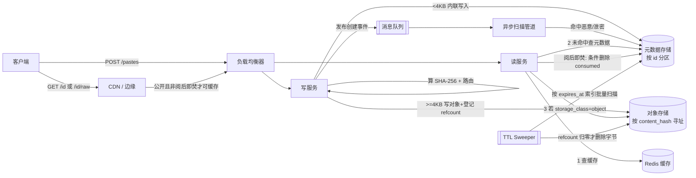

# 设计题解：粘贴分享服务（Pastebin）

## 题目与范围

面试官通常这样开场："设计一个像 Pastebin 或 GitHub Gist 那样的文本粘贴分享服务：用户粘贴一
段文本（代码、日志、配置），系统生成一个短链接，任何拿到链接的人都能看到这段文本；粘贴可以
设置过期时间。" 表面上这题和 [[solution-url-shortener|URL 短链接]] 长得很像——都是"生成一个
短 id，映射到一份内容，靠短链接分发"——但真正的难点完全不同：URL 短链接里被映射的是一个几十
字节的字符串，内容本身几乎不占地方，整道题几乎全部在"读路径怎么扛住 100:1 的重定向流量"；
Pastebin 里被映射的是**内容本身**——从几十字节的代码片段到几兆字节的日志转储，这份 payload
的大小、如何存、多久过期、谁能看，才是这道题的骨架。短码生成本身反而是抄近路的地方——可以
直接复用 URL 短链接同一套方案。

值得当场问清楚的澄清问题，以及它们各自改变的设计决策：

- **粘贴内容有多大？分布是怎样的？** 决定存储分层——只按平均大小算存储量会算错（见「容量
  估算」），必须按大小分桶（bucket）分别估算，因为字节数几乎总是被极少数大文件主导。
- **要不要支持私有/不可列出（unlisted）/密码保护的粘贴？** 决定短码要不要额外的熵
  （entropy）保证不可枚举（见「深入探讨」第 3 节）——纯公开粘贴用短码完全没问题，因为链接
  本身就是唯一的分发渠道，没有"猜中即泄露"这个顾虑。
- **粘贴要不要支持"阅后即焚"（burn-after-reading）？** 决定读路径要不要一次原子的"读取并
  销毁"操作，以及这类粘贴能不能被 CDN 缓存（见「深入探讨」第 6 节）。
- **要不要做语法高亮渲染？** 决定是服务端同步渲染、客户端异步渲染，还是二者的混合（见「深
  入探讨」第 4 节）——这不是锦上添花的功能，做错了会拖垮读路径延迟。
- **匿名粘贴要不要做内容审查（恶意软件、泄露的密钥）？** 决定要不要在写路径后面挂一条异步
  扫描管道，以及命中后怎么处置（见「深入探讨」第 5 节）。

**范围内**：文本粘贴的创建与读取、公开/不可列出/密码保护三种可见性、过期与清理、语法高亮
的基本处理、恶意内容与密钥泄露的检测与下架、阅后即焚。**范围外**：多人协作实时编辑同一份
粘贴（那是 [[solution-google-docs|Google Docs]] 的问题）、版本历史/多文件粘贴集合（Gist 的
"多文件 + revision"模型是一个独立的扩展面，本题只处理单文件、不可变的粘贴）、账号体系与社交
功能（收藏、关注）。

## 需求

**功能需求（驱动设计的 3–5 条）**

1. 用户提交一段文本（可匿名），系统返回一个短链接；任何拿到链接的人访问该链接都能看到原文。
2. 粘贴可以设置过期时间（预设选项或永不过期），过期后不可再访问。
3. 粘贴可以设置为公开、不可列出（有链接才能访问，但不出现在任何列表/搜索里）或密码保护。
4. 粘贴可以设置"阅后即焚"：被读取（通常是第一次）之后即不可再访问。
5. 系统检测并处置包含恶意软件特征或泄露密钥的粘贴，提供下架（takedown）入口。

**非功能需求（数字化）**

- **写延迟**：`POST /pastes` p99 < 300ms（含内容哈希计算、大小路由、元数据与对象写入）。
- **读延迟**：原始内容 `GET /{id}/raw` p99 < 150ms；带语法高亮的渲染页面 p99 < 400ms——两者
  分开定目标，因为高亮渲染的成本结构和纯读取完全不同（见「深入探讨」第 4 节）。
- **可用性**：读路径目标 99.95%，写路径目标 99.9%。读路径目标**低于** URL 短链接文章里的
  99.99%——这不是本题偷懒，而是结构性的：一条粘贴链接通常只被知情的一小群人访问，不是
  被大规模转发/嵌入到广告和社交卡片里的公共基础设施，短暂不可用影响的用户面小得多。
- **持久性**：已确认写入的粘贴内容目标 11 个 9（99.999999999%）——这是对象存储这一存储技
  术类别的标准持久性等级，不是本题额外承诺的。
- **大小上限**：匿名粘贴 1MB，认证用户 25MB——区分两档不是营收策略（这里不讨论付费墙），
  而是把「容量估算」里占 2% 条数、贡献 84% 字节的大文件档，限定成一个需要登录、因而更容易
  追责（滥用/审计场景下可关联到账号）的行为，同时把匿名、无门槛的写路径的最坏单请求大小
  钳制在 1MB，让写延迟预算（含哈希计算）在匿名场景下更容易保证。
- **一致性**：创建者提交后立刻能看到自己的粘贴（读己所写），后续其他读者可以接受短暂的最终
  一致（跨区域复制延迟内）；阅后即焚的"读取并销毁"必须是全局线性一致的单次操作（见「深入
  探讨」第 6 节），这是本题里唯一一处不能退让到最终一致的读路径。

## 容量估算

**写入规模**：假设该服务每天新增 **200 万条粘贴**。

```
平均写 QPS = 2,000,000 / 86,400 ≈ 23.1
峰值写 QPS（3× 峰值系数）≈ 69.4
```

**读取规模**：和 URL 短链接不同，粘贴链接通常发给一个明确的小群体（贴到工单、聊天群、代码
评审里），不是被广泛转发反复点击的公共入口。假设平均每条粘贴一生被读取 5 次，且这些读取里
绝大多数集中在创建后的 1 天内（收到链接的人很快就会点开）：

```
一天新增粘贴一生产生的读取总量 ≈ 2,000,000 × 5 = 10,000,000 次
按 1 天的活跃窗口摊薄 → 稳态日读取量 ≈ 10,000,000
平均读 QPS ≈ 10,000,000 / 86,400 ≈ 115.7
峰值读 QPS（3×）≈ 347.2
读写比 ≈ 10,000,000 / 2,000,000 = 5:1
```

**这个 5:1 是这道题和 URL 短链接（100:1）之间最重要的一个数字差异**：URL 短链接里一条链接
可能被嵌入广告、社交卡片、二维码，被成千上万个互不相识的人反复点击，读流量和写流量可以相差
两个数量级；Pastebin 里内容通常只发给知情的小圈子，读放大远没有那么夸张。这个差异直接决定
了缓存策略的侧重点——URL 短链接把几乎全部精力放在"扛住读流量"，本题的精力必须分给"存储
分层"和"过期回收"，读路径的绝对压力小得多（虽然单条爆款粘贴仍然可能局部爆炸，见「瓶颈、
故障与演进」）。

**存储估算：按大小分桶，不能只算"平均大小"。** 粘贴的大小分布是长尾的——绝大多数是几 KB
的代码片段，极少数是几 MB 的日志转储，如果只用一个笼统的"平均大小"乘以条数，会严重低估真实
的字节量（也会掩盖"按数量决策"和"按字节决策"应该是两件不同的事）。按数量分三档估算：

```
片段档（snippet）：85% 的粘贴，平均 1.5 KB   → 170 万条/天，2.61 GB/天
日志档（log）：    13% 的粘贴，平均 80 KB    → 26 万条/天， 21.30 GB/天
大文件档（large）：  2% 的粘贴，平均 3 MB    →  4 万条/天，125.83 GB/天

按条数加权的平均大小 ≈ 74.9 KB
每天新增总字节量 ≈ 149.7 GB/天
```

**只占 2% 条数的大文件档贡献了当天新增字节量的 84%**——这是本题容量估算里最容易被忽视、也
最影响架构的一个结论：如果按"条数"设计缓存和存储分层，会得出"绝大多数粘贴都很小"的印象而
低估存储压力；如果按"字节"设计，会发现真正的存储成本几乎完全由长尾里的大文件决定。这正是
下面「核心实体与 API」里按大小路由存储、以及选择对象存储而不是把所有内容塞进一张关系表的
根本原因——不是因为总量大（149.7 GB/天并不大），而是因为大小分布的形状要求两种截然不同的
读写模式。

**长期存储**：假设 70% 的粘贴设置了有限过期（平均生命周期 10 天），30% 永不过期。5 年后：

```
持久档累计字节数 ≈ 149.7 GB/天 × 30% × 1,825 天 ≈ 81.98 TB
过期档稳态字节数（Little's Law：稳态存量 = 到达速率 × 平均驻留时间）
  ≈ 149.7 GB/天 × 70% × 10 天 ≈ 1,048 GB
5 年总存储（复制/纠删码前）≈ 83.03 TB
乘以对象存储典型纠删码开销 ~1.5× ≈ 124.5 TB
```

这个量级——百 TB 级——正是对象存储（S3 类）这一存储技术类别的设计目标：无限水平扩展、按 GB
计价、原生支持超大对象的分片上传。这和 URL 短链接选 NoSQL 的论证方式不同：URL 短链接的
912GB 数据量本身单机也能装下，选 NoSQL 是因为访问模式；这里选对象存储，字节量本身就已经是
决定性论据——[[storage.object|Object Storage & Separation]] 存在的理由正是"大或冷的数据默认
放object storage"。

**元数据存储**：只统计元数据行（不含内联小内容），5 年累计约 11 亿行 × 250 字节/行 ≈
277 GB；把 4KB 以下的小粘贴内联存进元数据行（见下）再叠加约 1.45 TB，元数据存储总占用约
1.7 TB——比对象存储层小两个数量级，可以用一个能水平扩展的小型宽表/键值存储承载，而不需要
和对象存储用同一套技术。

**缓存内存**：只缓存 4KB–256KB 这个区间（覆盖片段档 + 日志档，按条数占 98%），并只保留最近
2 天创建的粘贴（覆盖绝大多数读取集中发生的窗口）：约 392 万条 × 11.9 KB（该区间加权平均大
小）≈ **47.8 GB**——比 URL 短链接的 500MB 缓存大近百倍，因为这里缓存的是内容本身而不是一个
几十字节的字符串；这也是"blob 是 payload"这个差异在缓存层面的直接体现。大文件档（>256KB，
仅占 2% 条数但占 84% 字节）**刻意不进缓存**，一律直接走对象存储/CDN 签名 URL，避免几 MB 的
对象把缓存内存的性价比拖垮。

## 核心实体与 API

**实体**

- **Paste**（元数据行，主键 `id`）：`id`、`owner_id`（可空，匿名创建为空）、`visibility`
  （public / unlisted / private）、`password_hash`（可空，仅 private 时有值）、`language`
  （可空，用户指定或写入时自动探测）、`size_bytes`、`storage_class`（inline / object）、
  `inline_content`（仅 `size_bytes` ≤ 4KB 时有值，直接内联在这一行里）、`content_hash`
  （SHA-256，始终计算，仅 `storage_class = object` 时用作对象存储的寻址键）、`created_at`、
  `expires_at`（可空 = 永不过期）、`burn_after_reading`（布尔）、`consumed`（布尔，配合阅后
  即焚的原子条件删除）、`status`（active / quarantined / deleted）。
- **Blob**（仅 `storage_class = object` 的粘贴才有，主键 `content_hash`）：`size_bytes`、
  `refcount`（有多少条 Paste 引用这份字节内容）、`storage_uri`。**只对公开粘贴做内容寻址
  去重**——原因见「深入探讨」第 1 节的隐私推论。
- **ScanResult**（异步扫描管道产物）：`paste_id`、`scanner`（secret-detector / malware-yara /
  hash-blocklist）、`verdict`（clean / suspect / malware / secret）、`confidence`、
  `action_taken`。

**API**

| 方法 & 路径 | 参数 | 响应 | 幂等性 | 分页 |
|---|---|---|---|---|
| `POST /api/v1/pastes` | `content`（必填）、`language`（可选）、`visibility`（public/unlisted/private，默认 unlisted）、`password`（private 时必填）、`expires_in`（TTL 预设或 null=永不过期）、`burn_after_reading`（可选布尔）、Header `Idempotency-Key` | `201 {id, url, expires_at}` | 用 `Idempotency-Key` 防止客户端重试重复创建 | 无 |
| `GET /{id}` | 路径参数、`?password=`（private 时） | `200` 渲染后的 HTML 页面（含语法高亮容器）；密码错/缺失 `401`；不存在/已过期/已焚毁 `410 Gone` | 天然幂等，**除非** `burn_after_reading=true`——此时第一次成功读取会让后续所有读取都返回 `410` | 无 |
| `GET /api/v1/pastes/{id}/raw` | 同上 | `200` 纯文本（`Content-Type: text/plain`），供 CLI（如 `curl`）直接拉取 | 同上，阅后即焚语义同样适用 | 无 |
| `DELETE /api/v1/pastes/{id}` | 需 owner 鉴权 | `204` | 幂等（删除已删除的返回 204） | 无 |
| `POST /api/v1/pastes/{id}/report` | `reason` | `202 Accepted`（进入人工/自动复核队列） | 按 IP 限流，非幂等但可重复提交 | 无 |

**刻意不放进 API 的东西**：粘贴内容的编辑/修订历史——粘贴一旦创建即不可变，"编辑"在客户端
表现为创建一条新粘贴，这样才能让 `content_hash` 寻址和缓存失效逻辑保持简单，不用处理
"同一个 id 下内容变了、缓存怎么失效"这个问题；多文件粘贴集合（Gist 式）——这是一个独立的
数据模型扩展，不影响本题要解决的存储分层/过期/隐私核心问题；实时协作编辑——见「题目与范围」
的范围外说明。

## 高层设计



**写路径**：客户端 `POST /pastes`；写服务先对内容计算 SHA-256（25MB 内容在 500MB/s 的单核
哈希吞吐假设下约 50ms，落在写延迟预算内），再按大小路由：小于 4KB 直接把内容内联写进元数据
行本身，避免为占大多数的小粘贴多付一次到对象存储的网络往返；大于等于 4KB 则写入对象存储，
元数据行只保存指向它的 `content_hash` 指针。写服务随后异步发布一条创建事件到消息队列，触发
恶意软件/密钥泄露扫描（见「深入探讨」第 5 节）——扫描不阻塞返回给客户端的 201 响应，这和
[[solution-url-shortener|URL 短链接]]里"点击分析异步化、不占用重定向关键路径"是同一个设计
哲学：把非必要的校验/统计移出关键路径，只在关键路径上做"能不能安全返回"这一件事。

**读路径**：`GET /{id}` 或 `/raw`；如果粘贴是公开的且未设置阅后即焚，CDN 边缘节点可以直接
缓存整段响应；否则（私有/密码保护/阅后即焚）请求必须绕过 CDN、直接回源（`Cache-Control:
no-store`），因为这三类粘贴的正确性依赖服务端在每次请求时做一次实时判断（密码校验、消费
状态检查），被边缘缓存住会直接破坏语义。回源后读服务走 cache-aside：先查 Redis（只缓存
4KB–256KB 且创建于最近 2 天内的内容），未命中查元数据存储；如果 `storage_class = object`，
再去对象存储取字节（或者返回一个指向对象存储/CDN 的签名 URL，由客户端直接下载，从而不让
大文件的字节流经读服务本身）。若 `burn_after_reading=true`，这次读取本身要对元数据行做一次
条件更新（`UPDATE ... SET consumed=true WHERE id=? AND consumed=false`），只有这次条件更新
成功的那个请求才算真正"读到"内容，其余并发请求视为迟到，返回已销毁（见「深入探讨」第 6
节）。

## 深入探讨

### blob 即 payload：元数据存储与对象存储怎么分工，内容寻址去重的隐私代价

**问题**：URL 短链接里被映射的字符串本身不值一提，所有复杂度都在"怎么服务重定向"；这里被
映射的内容本身可能从几十字节到几 MB，如果统一用一种存储技术，两端都会吃亏——全部塞进关系
表/宽表会让大文件拖慢整个存储的 I/O 特征；全部塞进对象存储会让 85% 的小粘贴每次读写都多付
一次对象存储的网络往返（首字节延迟通常是几十毫秒量级，比行存储的个位数毫秒高一个数量级）。

**方案**：按大小分层。小于 4KB 的内容直接内联存进元数据行（多数宽表/文档存储单行大小上限
通常有几百 KB 的余量，4KB 的内容占用可以忽略）；大于等于 4KB 的内容路由到对象存储，元数据
行只保留一个指针。这不是拍脑袋的阈值——它对应"容量估算"里片段档（85%，均值 1.5KB）几乎全部
落在阈值以内，而日志档、大文件档（合计 15%，但占约 98% 的字节量）几乎全部落在阈值以外，阈值
选在两档的自然分界附近。

**内容寻址去重及其隐私推论**：大于等于 4KB 的对象以 `content_hash`（SHA-256）作为对象存储
的主键而不是随机生成的 blob id，天然获得去重——两个用户粘贴完全相同的字节内容（同一段流行
的日志格式、同一份开源代码片段）只存一份物理字节，`refcount` 记录引用数，删除时只有 refcount
归零才真正释放对象存储空间（见第 2 节）。但**这个机制只对公开粘贴启用**，原因是两个隐私
代价：

1. **存在性预言（existence oracle）**：如果攻击者已经掌握某份敏感内容（比如一份被盗的密钥
   文件），他可以计算它的哈希，然后通过"创建一条内容完全相同的粘贴，观察写入耗时"来推断
   系统里是否已经有人贴过一模一样的内容——因为去重命中时写路径只需要把 `refcount` 加一，
   不需要真正上传字节，响应会明显快于一份真正的大文件写入。这是一个基于耗时的旁路
   （side-channel），即使攻击者读不到私有粘贴的内容，也能确认"某个人贴过这份东西"。
2. **删除不等于擦除**：如果用户 A 删除了自己的（本应私密的）粘贴，但另一个用户 B 的粘贴
   恰好引用了同一份去重后的字节（`refcount` 未归零），底层字节并不会被真正抹除——这对一个
   承诺"私有内容可以被删除"的产品是不可接受的语义漏洞。

因此本设计把去重范围限定在公开粘贴——公开内容本来就没有"是否存在"的保密需求，去重带来的
存储收益（长尾重复内容，例如反复被粘贴的报错堆栈、常见配置片段）可以放心拿；私有/不可列出/
密码保护的粘贴即使字节完全相同也各自独立存储，用可预期的存储成本换取"删除即真正释放、
无法被存在性旁路探测"这两条隐私保证。

### 过期与回收：TTL 索引 + 批量 Sweeper，而不是懒删除或全表扫描

**问题**：粘贴可以设置过期时间，过期后既要在读路径上立刻拒绝访问，又要最终把对应的存储
（元数据行 + 可能引用的对象存储字节）真正回收掉，不能让存储无限增长。

**方案一：纯懒删除（lazy deletion）**——只在读时检查 `expires_at`，从不主动清理。实现最简单，
永远不会因为清理作业本身出故障；但过期后不再被访问的粘贴永远占着存储，5 年后"持久档"和
"应该已经过期但没人读所以没触发检查"的行会混在一起，无法区分，存储成本只增不减。

**方案二（选用）：TTL 排序索引 + 批量 Sweeper。** 元数据存储维护一个按 `expires_at` 排序的
二级索引（或按到期日分桶，类似延迟队列的时间轮思路），后台 Sweeper 进程定期（例如每分钟）
扫描"已经过期"的那一段索引区间，逐条处理：先删除元数据行，如果该行引用了对象存储（
`storage_class=object`），对相应 `content_hash` 的 `refcount` 减一，归零才真正对对象存储发
起删除。按「容量估算」的假设（70% 粘贴设置有限过期，平均生命周期 10 天，创建量 200 万条/
天），**稳态下每天到期的行数约为 140 万行，平均 Sweeper 删除速率约 16.2 行/秒**，3 倍峰值下
约 48.6 行/秒——比写路径的峰值 69.4 QPS 还低，说明 Sweeper 完全不是这道题的性能瓶颈，它存在
的意义是"存储正确性"（不让存储无限增长），不是吞吐问题。

**读路径的防御性二次检查**：即使 Sweeper 因为故障暂时停摆，读服务在每次返回内容前都会独立
再检查一次 `expires_at`（不依赖行是否已被物理删除）——这意味着 Sweeper 中断只会导致存储
"该删没删、占地方"，不会导致**已过期的内容被错误地提供给读者**。这是把"正确性"和"资源回收
效率"这两件事解耦的关键设计——见「瓶颈、故障与演进」里 Sweeper 故障的降级分析。

**为什么不用纯粹的懒删除加一个粗暴的每日全表 `DELETE WHERE expires_at < NOW()`**：没有
`expires_at` 索引的全表扫描，在 11 亿行的元数据存储上代价是 O(全部数据)，且会和正常读写流量
抢 I/O；而按 `expires_at` 排序的索引让每次 Sweep 只需要触达"这一批恰好到期"的行，代价随过期
行数线性增长，和总数据量无关。

### 私有/不可列出/密码保护粘贴：短码的熵要按真实攻击预算来算

**问题**：公开粘贴的短码可以直接复用 [[solution-url-shortener|URL 短链接]]同款的 7 位
Base62（62⁷ ≈ 3.52×10¹² 种组合，约 41.7 bit）方案——因为公开内容本来就打算被任何拿到链接的
人看到，短码可枚举与否不影响安全模型。但不可列出（unlisted）和密码保护的私有粘贴，短码
**本身就是唯一的访问控制**（unlisted 没有额外密码，"链接即密钥"），如果沿用 41.7 bit 的短
码，其安全性只等同于一个中等强度的密码，经不起大规模枚举扫描。

**方案：按真实攻击预算计算所需熵。** 假设一个资源充足的攻击者维持 **100,000 次/秒** 的持续
猜测速率（已经计入常规按 IP 限流被绕过、借助大规模僵尸网络的悲观假设），持续攻击 **10 年**
（约 3.15×10⁸ 秒），总尝试次数 `N ≈ 3.15×10¹³`；假设系统任意时刻有 `M = 5,000万` 条存活的
私有/不可列出粘贴。攻击者的目标不是猜中某一个特定目标，而是**扫描到任意一条**存活的私有
内容（用于批量捞取可能泄露的密钥/内部信息），命中概率近似为 `P(命中) ≈ N × M / 2^bits`：

```
7 字符 Base62（现有公开短码方案）：  41.7 bit → P(10 年内命中任意一条) 远大于 1
14 字符 Base62：                    83.4 bit → P ≈ 1.27×10⁻⁴（不够）
16 字符 Base62（本设计选用）：       95.3 bit → P ≈ 3.31×10⁻⁸
```

本设计对私有/不可列出粘贴使用 **16 位 Base62 随机 id**（不是计数器递增，必须是密码学安全
随机数生成），把"10 年持续攻击扫中任意一条"的概率压到 3.3×10⁻⁸ 量级，同时保持对**单个特定
目标**的猜测概率低至约 6.6×10⁻¹⁶（`N / 62^16`）——即使攻击者已经知道某一条粘贴大致的创建
时间窗口，也无法通过枚举重新找回一个已经"忘记"链接的具体粘贴。密码保护的粘贴可以沿用同一套
高熵 id 方案，密码校验作为第二层防线（并对校验请求做失败次数限速，防止针对已知 id 的密码
在线暴力破解）。

### 语法高亮与渲染成本：为什么真正的问题是尾延迟，不是集群 CPU

**问题**：粘贴内容大多是代码或日志，产品体验上几乎必须做语法高亮。直觉上"每次读取都在服务
端同步渲染"最简单，但要判断这是否可行，需要算清楚它到底贵在哪。

**先算聚合成本**：假设一个基于正则的词法高亮器单核吞吐约 2MB/s（这是本设计的假设，不是对
任何具体产品的实测断言）。按「容量估算」里缓存命中区间（4KB–256KB）的加权平均大小
11.9KB、峰值读 QPS 347.2 计算，峰值总字节吞吐约 4.14MB/s，只需要约 **2.07 个核**持续运行——
在这个读流量规模下，服务端同步高亮的**集群级 CPU 成本几乎可以忽略**，这和直觉相反，值得在
面试里明确算出来而不是想当然地断言"高亮很贵"。

**真正的问题是单次请求的尾延迟**：对一条 3MB 的大文件档粘贴做同步高亮，在同样 2MB/s 的假设
下需要约 **1.5 秒**——远超 400ms 的渲染页 p99 预算，会让这一条请求本身直接超时，而这类请求
不是极端个例（大文件档占条数 2%、字节量 84%，是本设计明确要支撑的一档）。

**方案**：客户端渲染为默认路径——读服务只返回原始文本，语言标签在写入时探测一次并缓存进
元数据行（避免每次读都重新猜测语言），浏览器端用 JS 高亮库在客户端本地渲染，把高亮的 CPU
成本转移给请求方而不是集中在服务端机群上，纯文本响应本身仍然可以享受「高层设计」里描述的
CDN 缓存。只有当粘贴小于某个尺寸阈值（例如与内联阈值一致，4KB）时才在写入时一次性预渲染
服务端 HTML 并缓存渲染结果——这类粘贴数量大但每条渲染成本很低，预渲染一次、之后所有读取
复用，好处最大；大文件档不做服务端预渲染，避免把"1.5 秒尾延迟"这个问题从读路径转移到写
路径上（写路径本身也有 300ms 的延迟预算）。

### 滥用：恶意软件与密钥泄露、扫描管道与下架

**问题**：匿名、免注册的文本发布入口天然是恶意软件配置（C2 地址、混淆后的脚本）和意外泄露
密钥（API key、私钥、数据库连接串）的高发地——这不是本题可以选择性忽略的边缘情况，而是产品
必须在写路径之外单独设计的一整条管道。

**方案**：写服务返回 201 之后，异步发布创建事件到消息队列，触发一条独立的扫描管道，包含至
少三类检测器：（1）基于正则 + 校验位/结构特征的密钥检测器（例如特定前缀加校验和的云服务
密钥格式、PEM 私钥头），命中即高置信度；（2）基于熵的通用密钥探测（长随机字符串在文本中出
现，配合上下文关键词如 `password=`、`secret=`），置信度中等，进入复核队列而不是直接下架；
（3）已知恶意样本的哈希黑名单/特征库匹配。检测结果写入 `ScanResult`；高置信度命中（如结构
化密钥、哈希黑名单）自动把粘贴状态置为 `quarantined`（读路径对该状态一律返回 410，无论是否
过期），中低置信度命中进入人工/自动复核队列，不自动下架，避免误伤。

**扫描管道和内容寻址去重的协同**：一旦某份恶意内容的 `content_hash` 被确认加入黑名单，之后
任何写入命中同一个哈希的请求都可以在写路径本身被立即拦截（哈希比对是常数时间的查表操作），
不需要再等异步扫描——这是"公开内容按内容哈希去重"这个机制在第 1 节讨论存储收益之外的第二个
好处：一次确认的恶意样本，之后所有重复投放都能被写路径直接挡下，而不用每次都重新跑一遍
完整的扫描管道。

**下架与损害限界**：`POST /pastes/{id}/report` 提供人工举报入口，按 IP 限流防止滥用举报本身
成为攻击面；一旦确认下架，本设计**诚实地承认**下架无法撤销"内容已经公开过的事实"——如果
泄露的凭据已经在被公开访问的窗口内被第三方抓取（爬虫、镜像站），下架只能阻止之后的访问，
不能追回已经泄露的部分。因此更现实的止损顺序是：下架原文 → 把 `content_hash` 计入黑名单
（挡住重复投放）→ 若能确认所有者，触发通知（提示其凭据可能已经泄露，需要立刻轮换）——
"能做的是限制未来暴露面，不是撤销已经发生的暴露"，这是一个真实产品会给出的答案，而不是
假装下架能让泄露从未发生过。

### 阅后即焚（burn-after-reading）：为什么它必须是一次原子操作，还必须绕开缓存

**问题**：阅后即焚要求"内容被读取一次之后，任何人（包括原读者自己）都无法再次读到它"。这
听起来像是"读完就删"，但两个并发的读请求几乎同时到达时，如果读取和删除是两个独立步骤
（先返回内容、再异步删除），两个请求都可能在删除生效前读到"未销毁"的状态，破坏"只读一次"
的承诺——这和 URL 短链接里自定义别名的并发唯一性问题是同一类竞态（TOCTOU，check-then-act），
解法思路也相同：把判断和动作合并成存储层的一次原子条件操作。

**方案**：读服务对元数据行执行一次条件更新——`UPDATE pastes SET consumed = true WHERE id = ?
AND consumed = false`——只有真正让这一行状态从 false 翻转到 true 的那一个请求，才被允许把
内容返回给调用方；同一时刻并发到达的其他请求，条件更新影响行数为 0，一律视为"已销毁"处理
（返回 410），即使它们在时间上几乎同时发出。这一步必须发生在能保证线性一致的那个存储位置
（该粘贴所属分片/主副本），不能在某个区域的只读副本或缓存层上做判断，否则不同区域可能各自
认为自己是"第一次读取"。

**必须绕开 CDN 缓存**：常规公开粘贴的读路径刻意让 CDN 缓存原始内容以降低回源压力（见「高层
设计」），但阅后即焚的粘贴**绝不能**被 CDN 缓存——如果第一次读取的响应被边缘节点缓存下来，
后续所有"应该被拒绝"的读取会直接从缓存返回内容，完全绕过了源站的条件更新逻辑。因此阅后即
焚的粘贴请求必须携带 `Cache-Control: no-store`，强制每一次读取都回源，用放弃缓存收益换取
"只读一次"这个语义能被正确执行——这是本题里第二处（继第 2 节的隐私考量之后）主动放弃默认
缓存策略换取正确性的地方，值得在面试里明确讲出这个取舍，而不是笼统地说"缓存能加就加"。

## 瓶颈、故障与演进

**热点与倾斜**：基线设计的整体读：写比只有 5:1，远没有 URL 短链接那么读密集，但这不代表单条
内容不会局部爆红——一条被贴到 Hacker News 或大型群聊里的日志/代码粘贴，短时间内的单键读
QPS 可以远高于系统整体峰值。应对方式和 URL 短链接一致：请求合并（single-flight）避免缓存
过期瞬间的惊群效应，以及超过阈值后把该 key 复制到多个缓存节点分摊压力——但和 URL 短链接不
同的是，这里的热点机制不是常驻开销（因为多数粘贴根本读不到需要复制的量级），而是按需触发
的，因为基线读：写比本来就低得多。写侧的倾斜风险是滥用机器人短时间内疯狂创建粘贴（常常是
相同或高度相似的恶意 payload）——按 IP/账号限流兜底，且内容寻址去重的写路径 fast-path（
第 5 节）让"疯狂重复投放同一份内容"的实际存储/扫描成本很低。

**各组件故障时怎么退化**：

- **对象存储不可用**：只影响 `storage_class = object` 的粘贴（按条数只占 15%，但占约 98% 的
  字节量）——85% 的内联小粘贴完全不受影响，因为它们的内容就在元数据行里，从不依赖对象存储。
  这是"按大小分层存储"带来的隔离性，和 URL 短链接里"KGS 挂了不影响重定向"是同一类设计收益。
- **元数据存储某分区不可用**：多副本自动故障转移，短暂的该分区写不可用可以接受（粘贴一旦
  创建内容不可变，读请求从任一健康副本读到的都是正确数据）。
- **缓存整体不可用**：cache-aside 优雅降级，所有请求穿透到元数据存储/对象存储；需要熔断和
  局部限流防止穿透流量打垮后端，和 URL 短链接的缓存故障处理方式一致。
- **扫描管道积压或宕机**：写路径完全不受影响（扫描本来就是异步、不在写请求的关键路径上），
  但新写入的粘贴要更久才会被扫描到——延长了恶意内容的曝光窗口。缓解方式是给积压长度设置
  告警阈值，超过阈值时可以选择性提高高置信度规则（如密钥正则）在**写路径同步执行**的比例
  （只做便宜的正则/校验位检查，不做完整的异步管道），用轻量同步检查缩短最坏情况下的曝光
  时间，而不是无限期依赖异步管道追上积压。
- **Sweeper 停摆**：过期粘贴的物理清理延迟，但读路径的独立二次 `expires_at` 检查（第 2 节）
  保证已过期内容不会被错误地提供给读者——Sweeper 故障是"存储浪费"问题，不是"正确性"问题，
  这个区分本身就是设计要刻意保证的性质。

**10 倍演进（写 231/694 峰值 QPS，读 1,157/3,472 峰值 QPS，5 年存储约 1.25 PB）**：对象存储
在这个量级依然轻松胜任（PB 级是它的设计常态）；元数据存储需要跨区域部署，比照 URL 短链接
的做法，按区域切分不相交的 id 区间；公开粘贴的读流量开始出现类似 URL 短链接式的"爆款效应"
——基线设计里因为读：写比低而不需要常驻的热点键复制、请求合并机制，在这个量级需要重新变成
默认开启的路径，而不再是按需触发。

**100 倍演进（写 2,314/6,944 峰值 QPS，读 11,574/34,722 峰值 QPS，5 年存储约 12.5 PB）**：
元数据存储必须完全按区域分片，每个区域独立的 id 区间和独立的 Sweeper 实例——单一全局 Sweeper
扫描一条全局 TTL 索引会成为瓶颈，需要按分片各自维护本地 TTL 索引、各自清理；内容寻址去重
对公开粘贴的存储收益在这个量级会明显放大（相同的报错堆栈、常见配置片段在总条数越大时重复
概率越高），去重带来的存储节省比例预计随总量增长而不是保持不变。

## 面试官会追问什么

**中级（mid）**

- "为什么小粘贴要内联存进元数据行，而不是所有内容统一走对象存储？" 答：85% 的粘贴远小于
  4KB，统一走对象存储会让它们每次读写都多付一次到对象存储的网络往返（首字节延迟通常比行
  存储高一个数量级）；阈值选在片段档和日志档的自然分界附近。
- "公开粘贴用 7 位短码，私有粘贴为什么要用完全不同的方案？" 答：公开短码可枚举无所谓，因为
  内容本来就打算公开；私有/不可列出粘贴里短码本身就是唯一的访问控制，必须按真实的攻击预算
  算出所需熵（本设计算出 16 位 Base62 ≈ 95.3 bit），而不是沿用一套为完全不同的安全模型设计
  的短码方案。

**高级（senior）**

- "如果读写比不是基线假设的 5:1，而是因为某条粘贴在社交网络爆红变成局部的 50:1 甚至更高，
  系统哪里会先顶不住？" 答：不是聚合系统吞吐，而是那一条内容对应的单个缓存节点/对象存储
  key 的访问速率；解法是重新引入 URL 短链接式的请求合并和热点键复制，本设计里这套机制是
  按需触发而非常驻，因为基线负载不需要它。
- "内容寻址去重能省不少存储成本，为什么只对公开粘贴做，私有粘贴不做？" 答：去重会引入两个
  隐私代价——基于写入耗时的存在性旁路（能推断出"有人贴过同样的内容"），以及"删除不等于
  擦除"（其他引用同一份字节的粘贴还在，物理内容不会真正消失）；这两条对声称"私密"的内容都
  是不可接受的语义漏洞，所以只对没有保密诉求的公开内容启用。

**资深（staff）**

- "阅后即焚在多区域部署下，怎么保证真的只被读一次，而不是每个区域各读一次？" 答：读取并
  销毁的条件更新必须发生在该粘贴所属分片的线性一致主副本上，不能在区域级的只读副本或缓存
  层判断；这意味着阅后即焚的粘贴要接受一次额外的跨区域路由延迟，这是本设计里刻意为一小
  部分流量放弃"就近读"以换取正确性的地方，其余常规读取完全不受影响。
- "扫描管道漏检了一条包含真实凭据的粘贴，凭据已经被抓取，事后怎么限制损害面？" 答：下架
  原文、把内容哈希计入黑名单挡住重复投放、若能确认所有者则触发通知要求轮换凭据——但要诚实
  地承认已经公开过的内容一旦被第三方抓取或镜像，下架无法把已经发生的暴露收回，能做的只是
  限制未来的暴露面，这是任何一个匿名发布平台都要面对的现实，而不是可以靠架构设计彻底消除
  的风险。

## 常见错误

- **把这道题当成"给文本内容的 URL 短链接"直接照搬同一套缓存架构**，而不重新推导读写比——
  本题的读：写比结构性地远低于 URL 短链接（5:1 对比 100:1），真正的难点在存储分层和过期
  回收，不在扛读流量。
- **只用"条数加权平均大小"估算存储**，忽视字节量几乎总是被长尾里的少数大文件主导（本题
  仅 2% 的条数贡献了 84% 的字节量）——按条数做的容量估算和按字节做的容量估算会得出完全不同
  的结论，必须分开算。
- **过期清理写成不带索引的全表扫描 `DELETE WHERE expires_at < NOW()`**，在千万到十亿行的
  元数据存储上会和正常流量抢 I/O；应该维护一个按 `expires_at` 排序的索引，让 Sweeper 只
  触达真正到期的那一批行。
- **私有/不可列出粘贴复用和公开粘贴一样的短短码**，让"不可列出"退化成"可枚举"，完全违背
  产品对这类粘贴的隐私承诺——必须单独按攻击预算计算所需熵。
- **对内容寻址去重不加区分地应用到所有可见性**，忽视了存在性旁路和"删除不等于擦除"这两条
  隐私代价对私有内容是不可接受的。
- **把语法高亮做成服务端同步渲染却不设大小上限**，聚合 CPU 成本可能确实不高，但单个大文件
  的同步渲染延迟会直接击穿读路径的延迟预算，这是"平均代价低"掩盖"尾部代价高"的典型陷阱。
- **把阅后即焚实现成"先读、再异步删"两步**，在并发读取下无法保证真正只读一次；必须是存储
  层的一次原子条件操作，并且这类响应不能被 CDN 或任何中间层缓存。

## 五分钟讲法

I'd frame this as a cousin of the URL shortener with a completely different center of
gravity: there the mapped value is a few bytes and the whole problem is serving redirect
traffic; here the mapped value is the payload itself, ranging from a one-kilobyte snippet
to a multi-megabyte log dump, so the hard problems are storage layering, expiry, and
privacy rather than raw read throughput — in fact the read-to-write ratio here is only
about 5-to-1, nowhere near the shortener's 100-to-1, because a paste link usually goes to
a known small audience rather than getting embedded broadly. I split storage by size: small
pastes under 4KB get inlined directly in the metadata row to skip an extra network hop,
while anything larger routes to object storage keyed by content hash, which gives free
deduplication — but only for public pastes, because deduplicating private content creates
a timing side-channel that reveals whether specific content already exists, and means
deleting one paste doesn't actually erase bytes another paste still references. Expiry is
handled by a TTL-sorted index and a batch sweeper rather than a full-table scan, and the
read path independently re-checks expiration so a sweeper outage causes wasted storage, not
incorrect serving. Private and unlisted pastes get a much higher-entropy random id than
public ones — I computed roughly 95 bits of entropy against a sustained hundred-thousand
guesses-per-second attacker over a decade, since for those pastes the link itself is the
only access control. Syntax highlighting turns out to be cheap in aggregate but dangerous
in the tail — a large paste rendered synchronously can take over a second — so it defaults
to client-side rendering with server-side pre-rendering only for small pastes. And
burn-after-reading has to be a single atomic conditional update at the paste's authoritative
shard, with caching disabled for that response, or concurrent readers can race past the
"read once" guarantee.

## 来源与延伸

- **[donnemartin/system-design-primer — Pastebin](https://github.com/donnemartin/system-design-primer/blob/master/solutions/system_design/pastebin/README.md)**
  （CC-BY）：最早被广泛引用的开源模板，给出了"元数据表 + 对象存储"的基本分工和一套 DAU→QPS
  的估算范式。本文沿用了它"内容单独存、元数据单独存"的骨架，但用条数/字节分桶重新做了容量
  估算（该文按单一平均大小估算，掩盖了长尾对字节量的主导作用），并补充了它完全没有涉及的
  隐私（去重旁路）、阅后即焚、高熵私有 id 三个维度。
- **[Pastebin.com — API 文档 / FAQ](https://pastebin.com/doc_api)**：作为真实产品的一手文档，
  给出了免费账户的可见性分级（公开/不可列出/私有）和到期时间预设选项，本文的 `visibility`
  枚举和 `expires_in` 预设直接参照了这个真实产品的划分；不同之处在于 Pastebin.com 的具体
  大小限制（免费账户 512KB，付费 10MB）是账户等级驱动的产品策略，本文没有照搬这两个具体
  数字，而是按「容量估算」里的大小分桶重新推导了 4KB 内联阈值和 256KB 缓存阈值这两个真正
  驱动架构决策的数字。
- **[PrivateBin — 项目主页](https://privatebin.info/)**：一个真实存在、开源的"零知识"粘贴
  服务，其客户端加密（浏览器内 AES-256-GCM 加密、密钥放在 URL fragment 里不发给服务端）和
  阅后即焚选项证明了这道题里"私有内容需要不同于公开内容的处理方式"不是本文臆造的顾虑，而
  是已经有真实产品在生产环境解决的问题。本文没有采用它的客户端零知识加密方案（那会让服务端
  完全无法做语法高亮和恶意内容扫描，与本题"扫描泄露密钥/恶意软件"的功能需求直接冲突），
  而是选择服务端可见内容、以高熵随机 id 加访问控制作为私有粘贴的防线，这是本文和 PrivateBin
  在隐私模型上的主要分歧点，值得在文中明确指出。
- **[GitHub Docs — About large files on GitHub](https://docs.github.com/en/repositories/working-with-files/managing-large-files/about-large-files-on-github)**：
  虽然讲的是仓库文件而非 Gist，但它给出的分级限制思路（25MiB 浏览器上传 / 50MiB 警告 /
  100MiB 硬性拒绝）为"要不要给不同大小设不同的处理路径"提供了一个可参照的真实产品先例，
  本文借用了这种"分级而不是单一阈值"的思路，但具体数字（4KB 内联、1MB/25MB 的匿名/认证
  上限）是本题按自己的容量估算和延迟预算独立推导的，与 GitHub 的数字没有对应关系。
