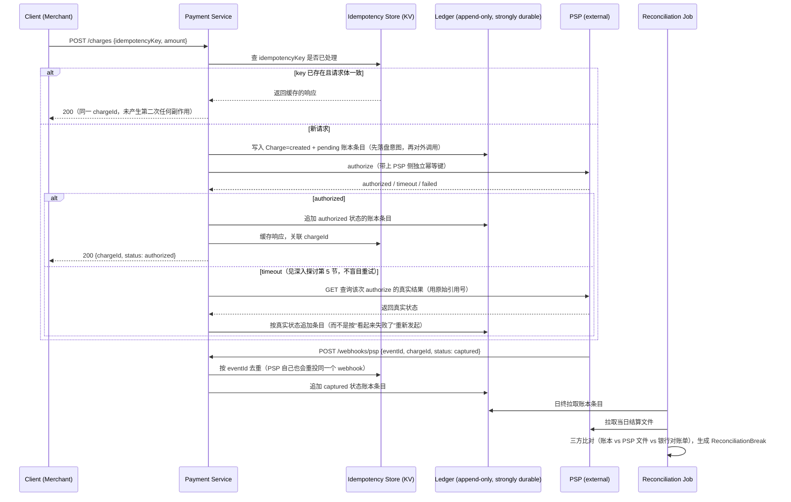

# 设计题解：支付系统（Payment System）

## 题目与范围

面试官通常这样开场："设计一个支付系统：商户可以对客户的卡发起收款，收款通过一家第三方
支付服务商（PSP，Payment Service Provider，如 Stripe/Adyen）完成，系统要记录每一笔资金
移动，并且这些记录最终要能和 PSP、银行对上账。" 这句话背后真正的难点不是"调用一个第三方
API"，而是**这条调用链上的每一环——客户端重试、我们自己的服务重启、PSP 的 webhook 重
投——都可能让同一笔钱被移动两次，而钱和普通数据不同，多算一次不是"脏数据"，是真实的财务
损失**。

值得当场问清楚的澄清问题，以及它们各自改变的设计决策：

- **是直连单一 PSP，还是要在多家 PSP 之间做路由/故障转移？** 本题按单一 PSP 集成设计，
  多 PSP 编排（按成功率/费率路由、故障转移）是一个独立的正交问题，只在「面试官会追问
  什么」里提及。
- **授权（authorize）和交割（capture）是否分离？** 决定状态机的状态数和"资金预留但未过账"
  这个中间态怎么在账本里表示（见「深入探讨」第 2 节）；本题按两阶段设计，因为这是真实
  PSP（Stripe/Adyen）的通用语义。
- **退款、拒付（chargeback）在不在范围内？** 退款在范围内（是账本要处理的又一种反向资金
  移动）；拒付的仲裁流程（提交证据、PSP 仲裁）不在范围内，只讨论拒付发生后账本如何记录。
- **要不要支持多币种？** 不支持——本题假设商户和客户使用同一结算币种，跨币种清算是独立
  的一道题（涉及汇率锁定时点、汇兑损益账户），只在「常见错误」里提示这是范围收窄的地方。
- **对账（reconciliation）要不要做成实时的？** 不需要——本题按 T+1 日终批量对账设计，因为
  这是真实支付行业的通用节奏（PSP 的结算文件本身就是按日出的）。

**范围内**：幂等发起收款、双录（double-entry）账本、退款、T+1 三方对账、失败与超时语义。
**范围外**：多 PSP 路由与故障转移、拒付仲裁流程、多币种清算、欺诈风控模型、发票与计费
周期（属于订阅计费，是独立的一道题）。

## 需求

**功能需求（驱动设计的 3–5 条）**

1. 商户可以发起一笔收款（`authorize` + `capture`），客户端网络重试不能造成重复扣款。
2. 每一笔资金移动（收款、退款、平台抽成、PSP 手续费）都在账本里留下不可篡改的记录，账本
   任何时刻都能推导出每个账户的余额。
3. 商户可以对一笔已完成的收款发起退款（全额或部分），退款同样必须幂等。
4. 系统按日与 PSP 的结算文件、银行对账单做三方对账，自动匹配的记录之外的差异要能被人工
   排查。
5. 商户和内部财务系统可以查询任意一笔收款的当前状态和账户余额。

**非功能需求（数字化）**

- **正确性优先于可用性**：这是这道题和其他系统设计题的根本区别——宁可让一次收款请求
  失败，也不能让账本记错。收款路径允许 P99 < 3s 的用户可感知延迟，但**任何一条写入路径
  在不确定 PSP 侧结果时，绝不能靠"重试"来猜测状态**（见「深入探讨」第 5 节）。
- **可用性分层**：收款路径目标 99.95%（比信息流这类内容型产品低，因为收款失败对用户是
  显式、可重试的错误，而不是静默丢内容）；账本读（余额查询）目标 99.99%，因为它同时服务
  商户仪表盘和内部对账，中断会掩盖资金问题。
- **一致性**：账本写入是**线性一致**的——同一笔收款的状态转移（created → authorized →
  captured）必须有全局唯一顺序，不能出现"退款先于收款生效"这种乱序；账本读（余额查询、
  商户仪表盘）允许最终一致，容忍秒级陈旧。
- **持久性**：账本条目一旦写入即不可变、需要多副本持久化——账本是这个系统里唯一"零容忍
  丢失"的数据，其余（如商户仪表盘的缓存视图）都可以从账本重建。
- **对账时限**：T+1 日终结算文件到达后，目标 4 小时内完成自动匹配，未匹配差异进入人工
  排查队列。

## 容量估算

本设计假设这是一个中等规模的电商/市场平台的支付层，服务平台上的商户处理买家收款，**假设
年交易量 12 亿笔**（这是本设计的假设，不是任何真实公司的披露数据）。

```
charges/day = 1,200,000,000 / 365 ≈ 3,287,671
avg QPS = 3,287,671 / 86,400 ≈ 38.05
peak QPS (×6，结账流量的日内高峰 + 大促日常规倍数) ≈ 228.31
```

**这个 QPS 本身不大**，支付系统的容量估算的真正杠杆不在这里，而在**账本条目的展开倍数和
存储的强持久性要求**：

```
每笔收款产生的账本条目 = 4
  （借：客户待清算 clearing；贷：商户应付 payable；贷：平台手续费收入；借：PSP 手续费支出）
entries/day = 3,287,671 × 4 ≈ 13,150,685
```

**这是第一个决定架构的数字**：13,150,685 条/天看起来不算多，但每一条都要求**强持久化、
不可变、多副本**——和信息流里"缓存丢了可以重建"的 inbox 条目完全不同，这里没有"重建"这
回事，条目本身就是权威数据源。按每条 250 字节估算（`account_id` + `charge_id` +
`amount` + `currency` + 时间戳 + 幂等键引用等定长字段）：

```
bytes/day = 13,150,685 × 250 ≈ 3.29×10^9 B ≈ 3.29 GB/天
bytes/year ≈ 1.2×10^12 B ≈ 1.2 TB/年
三副本 ≈ 3.6 TB/年
```

**这是第二个决定架构的数字**：1.2 TB/年在字节数上完全不是瓶颈（比信息流题里的收件箱缓存
小两个数量级），**真正的约束是这 1.2 TB 里没有一个字节可以丢、可以改**——这直接排除了
"缓存类存储、允许丢失重建"的技术选型，逼出「深入探讨」第 2 节的追加写（append-only）
账本设计。

**幂等键存储**：本设计假设幂等键（idempotency key）保留 24 小时去重窗口（这是本设计的
假设，Stripe 等 PSP 的官方文档描述了"键 + 缓存的响应"这一机制本身，但未公开其具体窗口
时长，见「来源与延伸」）。按每天的请求量估算：

```
每 key 存储 = 64B（key 本身）+ 500B（缓存的响应快照）= 564B
24 小时窗口内 key 数 ≈ charges/day ≈ 3,287,671
storage ≈ 3,287,671 × 564 ≈ 1.85×10^9 B ≈ 1.85 GB
```

幂等键存储是 GB 级，用一个内存型 KV 存储（Redis 一类）即可覆盖，**不是容量瓶颈**，但它的
延迟直接叠加在收款路径的 P99 里，必须和账本写分开部署，见「高层设计」。

**结论**：这道题的容量估算和信息流类完全不同——QPS 和字节数都不高，真正驱动设计的是
**账本条目的强持久性/不可变性要求**和「深入探讨」第 4 节里会算到的**单一热点账户的写
并发**，而不是总吞吐或总存储。

## 核心实体与 API

**实体**

- **Merchant**：`id, settlementAccountId, feeSchedule`——收款的归属方。
- **Charge**：`id, merchantId, amount, currency, status(created/authorized/captured/
  failed/refunded), idempotencyKey, pspReference, createdAt`——一次收款尝试的权威记录，
  `status` 是一个只能单向前进的状态机（见「深入探讨」第 1 节）。
- **LedgerAccount**：`id, type(customer_clearing/merchant_payable/platform_fee_revenue/
  psp_fee_expense), ownerId`——账本里的记账主体，本身不存余额，余额永远是推导值。
- **LedgerEntry**：`id, accountId, chargeId, amount(有符号), createdAt, journalId`——
  账本里唯一的权威数据，**追加写、不可变**；同一个 `journalId` 下的所有 `LedgerEntry`
  之和必须为零（双录不变量，见「深入探讨」第 2 节）。
- **IdempotencyRecord**：`key, merchantId, requestHash, chargeId, cachedResponse,
  expiresAt`——把一次客户端请求和它产生的结果绑定，用于安全重试。
- **ReconciliationBreak**：`id, chargeId, source(psp_file/bank_statement), kind(timing/
  true_break), status, ageDays`——三方对账里未能自动匹配的差异。

**API**

```
POST   /charges                  {merchantId, amount, currency, paymentMethodToken,
                                   idempotencyKey}
                                  按 (merchantId, idempotencyKey) 唯一约束幂等
                                  → {chargeId, status}
POST   /charges/{id}/capture     {amount?}  部分交割也按 idempotencyKey 幂等
POST   /charges/{id}/refund      {amount, idempotencyKey}
GET    /charges/{id}             → 当前状态（强一致，直接查 Charge 记录）
GET    /accounts/{id}/balance    → 推导的余额（允许秒级陈旧，见容量估算的一致性要求）
POST   /webhooks/psp             PSP → 我们的回调，PSP 自己也会重投，端点本身必须幂等
                                  （按 PSP 的事件 id 去重，不能假设 webhook 只到一次）
```

**故意不做的**：不提供直接写账本条目的 API——账本条目只能由内部的收款/退款/对账流程产生,
绝不接受外部直接输入，防止绕过双录不变量；不支持一个 API 里同时改多个商户的账户（跨商户
的资金移动只能通过两笔独立收款+两笔独立记账完成）；不支持客户端指定"立即结算到银行"（结算
节奏由 T+1 批处理统一控制，不做按需加速，避免把外部银行接口的延迟耦合进收款路径）。

## 高层设计



**写路径**：`POST /charges` 先查幂等存储，命中直接回放缓存响应，绝不重复执行任何有副作用
的步骤；未命中则**先把"意图"写入账本（pending 状态），再对外调用 PSP**——这个顺序是
故意的：如果调用 PSP 后进程崩溃，恢复时账本里已经有一条"我们打算做这件事"的记录可供对账
和人工核实，而不是这次尝试彻底消失、无迹可查。账本本身用**支持强一致写入、多副本同步复制
的关系型存储（PostgreSQL/Spanner 一类）**，因为需要在同一个数据库事务里保证一个
`journalId` 下的多条 `LedgerEntry` 要么全部写入要么全不写入（原子性）——这正是
[[correctness.ledger|Ledgers & Reconciliation]] 里"双录不变量在写时强制"这条原则。

**幂等路径**：Idempotency Store 用**独立部署的内存 KV 存储（Redis 一类）**而不是复用账本
数据库，因为它的读写模式（高频点查、短 TTL）和账本（低频追加写、永久保留）完全不同，混用
会让账本数据库承担不必要的高频小请求负载,直接违反
[[correctness.idempotency|Idempotency]] 里"幂等键存储要能撑住重试风暴"的要求。

**对外调用路径**：Payment Service 调 PSP 时永远带上一个独立于我们自己 API 幂等键的
**PSP 侧幂等键**（大多数 PSP 原生支持,见「来源与延伸」），这样即使我们自己的记录丢失,
重放同一个 PSP 幂等键也不会在 PSP 侧产生第二次实际扣款——这是双层幂等，而不是把全部信任
都押在我们自己这一层。

**读路径**：`GET /accounts/{id}/balance` 不查询实时聚合，而是查一个从账本条目异步物化的
余额投影（snapshot + 增量重放,见「深入探讨」第 2 节),允许秒级陈旧,换取商户仪表盘和内部
报表不需要每次都扫全量账本条目。

## 深入探讨

### 幂等发起支付：一次收款如何被安全地重试

**问题**：从客户端到 PSP 之间至少有三层可能重试——客户端网络超时后前端自己重试、负载均衡
器对无响应请求重试、PSP 的 webhook 因为我们的端点超时而重投。如果这条链路上任何一环没有
幂等保护，同一笔钱可能被移动两次，而这类 bug 往往只在生产环境的真实重试场景下才暴露。

**方案一：只在我们自己的 API 层做幂等，PSP 调用本身不带幂等键。** 客户端重试 `POST
/charges` 时我们能正确去重，但如果我们自己的进程在"已经调用了 PSP、还没来得及记录结果"
这个窗口内崩溃，恢复后的重试逻辑看到的是"没有记录",只能选择盲目重新调用 PSP——这正是
双重扣款的经典成因。

**方案二：我们自己的 API 幂等 + PSP 调用本身也带独立幂等键（本设计采用）。** 两层幂等键
职责不同：客户端幂等键保护"客户端到我们"这一段（缓存并回放响应,不重复执行任何副作用）；
PSP 侧幂等键保护"我们到 PSP"这一段（即使我们自己的状态丢失,重放同一个 PSP 幂等键,PSP
也只会返回它已经处理过的结果,而不会二次扣款)。Stripe 官方工程博客把这个机制描述为
"客户端生成一个 ID,服务端把它和这次操作的状态关联起来;如果响应本身丢失了,服务端直接
回放缓存的成功结果,而不是重新执行"（见「来源与延伸」)——这正是方案二里 PSP 侧幂等键
在我们和 PSP 之间复现的同一个模式。

**把整条收款流程拆成可恢复的步骤**：光有幂等键还不够——如果整个"调 PSP、写账本、发通知"
被当成一个不可分割的黑盒,一次崩溃后到底该从哪一步续上是不清楚的。Airbnb 工程博客描述
了一种做法：把每个支付工作流拆成一个由**可重试、幂等的步骤组成的有向无环图（DAG）**,
每一步职责单一、可独立重试,系统崩溃后从最后一个已完成的步骤继续,而不是整体重来（Airbnb
称这套框架为 Orpheus；据其博客披露,这一设计支撑了官方所称的"五个九"支付一致性——这个
具体数字转引自检索到的报道摘录,未直接核实原文全文,此处仅作为"分步幂等 DAG 这一模式在
生产环境被验证过"的旁证,不作为可精确复现的目标值）。本设计采用同样的分步思路：`created
→ authorized → captured` 每一步都是一次独立的、幂等的账本写入 + 外部调用,而不是一个
横跨多次网络调用的单一事务。

### 双录账本与余额推导：为什么账本条目必须追加写、不可变

**问题**：一笔收款要同时影响至少四个账户（客户待清算、商户应付、平台手续费收入、PSP
手续费支出）。如果用"可变余额列 + 每次交易原地更新"来实现,一次只更新了一半账户的部分
写入（进程崩在两次 `UPDATE` 之间）会让总账无声地失衡,而且没有任何历史轨迹可以用来发现
这个问题——这正是容量估算里强调"这 1.2 TB 里没有一个字节可以丢、可以改"背后的原因。

**方案一：可变余额列,每次交易原地 `UPDATE`。** 读取余额是 O(1),实现最简单,但没有审计
轨迹——一旦总账对不上,没有历史记录可以用来定位是哪一笔交易出的问题;并发更新还需要跨多个
账户行的分布式锁,而这些账户可能分布在不同的分片上。

**方案二（本设计采用）：追加写的双录（double-entry）账本,余额永远是推导值。** 每次资金
移动写入一组 `LedgerEntry`,同一个 `journalId` 下所有条目之和必须为零,这个不变量在写入
事务里强制检查而不是事后审计。账本条目本身**永不更新、永不删除**——一笔错误的收款不是
被修改,而是用一笔方向相反的**冲正分录（reversing entry）**去抵消它,原始记录连同冲正
记录都保留,天然形成审计轨迹。Stripe 官方工程博客描述其内部账本"把资金移动建模成不可变
事件,余额是推导出来的,而不是作为可变的权威状态存储"（见「来源与延伸」）;Square 的
Books 服务同样披露"除了 books 表本身的当前余额字段外,其余表只有插入语句,没有更新语句"
(约 20TB 数据规模,团队仅 3 名工程师维护,见「来源与延伸」);Uber 官方博客披露其内部支付
平台把每笔资金移动建模为不可变的"Money Order",要求"任意一次资金移动里的全部记账条目之
和必须为零",一笔已写入的 order"不能以任何形式被修改",调整只能通过再开一笔新 order 完成
(见「来源与延伸」)——三家公司的独立披露收敛到同一个结构,本设计采用同样的不变量。

**余额怎么算**：如果每次查询余额都要重放该账户从诞生以来的全部条目,在高频账户上会越来越
慢。本设计定期（如每小时）为每个账户持久化一个余额快照,当前余额 = 最近快照 + 快照之后的
条目重放,快照本身只是缓存,随时可以从完整的条目历史重新计算——这是把
[[correctness.ledger|Ledgers & Reconciliation]] 里"balance 是推导值"这条原则落到具体
的存储设计上。

### 三方对账：账本、PSP 结算文件与银行对账单

**问题**：即使账本内部的双录不变量从未被打破,它描述的也只是"我们**认为**发生了什么"——
一条 webhook 丢失、一次重试逻辑的 bug、一笔我们没有记录的 PSP 手续费调整,都会让账本和
外部世界的真实资金流动悄悄分叉,而这种分叉不会触发任何内部一致性检查,因为账本自己内部
看起来完全平衡。

**方案一：只和 PSP 的结算报告做两方对账。** 能发现"我们记录的和 PSP 记录的对不上"的问题
（比如 webhook 丢失导致我们漏记了一笔退款）,但**完全信任 PSP 报告本身是对的**——如果
PSP 侧的报告有错,或者 PSP 承诺的资金实际没有按时到账,两方对账发现不了。

**方案二（本设计采用）：账本、PSP 结算文件、银行对账单三方比对。** 账本↔PSP 文件这一对
捕获"我们记的和 PSP 说的是否一致";PSP 文件↔银行对账单这一对捕获"PSP 说的钱是否真的
到账了"（这一对是两方对账完全覆盖不到的,如果 PSP 自己出错或延迟结算,只有对着银行流水
才能发现）;账本↔银行这一对补上"每一笔到账的现金是否都能在账本里找到对应分录"（例如
我们从未入账的汇兑价差、手续费调整）。不匹配的差异按**时间类**（在途,清算窗口内自然
清零,只陈化观察不告警）和**真断差**（需要人工排查,排查后用一笔新的冲正分录处理,绝不
直接改原始记录）两类分桶处理。

**数字**：按容量估算里 3,287,671 笔/天的收款量,PSP 每日结算文件大致同一数量级的行数。
本设计设定 T+1 结算文件到达后 4 小时内完成自动匹配、目标自动匹配率 99.99% 作为设计目标
（这是本设计的目标值,不是任何真实公司披露的匹配率）：

```
breaks/day = 3,287,671 × (1 − 0.9999) ≈ 329
```

329 笔/天的人工排查量,是这套系统给对账团队排的队列容量下限——这个数字直接决定排查团队
的编制和排查工具要不要做批量分类,而不是留到运营阶段才发现。

### 热点账户与批处理：一个账户如何扛住远超单行锁上限的并发

**问题**：容量估算算出的平台手续费收入账户,每一笔收款都会给它记一笔贷方分录,峰值并发
写入这**同一个账户**的速率就是整个系统的收款峰值 QPS——按容量估算,当前规模下是 228.3
次/秒,10 倍演进后是 2,283 次/秒。如果余额是一个同步维护的物化列,所有并发写入都要在这
一行上串行化,这个账户会成为和系统整体规模脱钩的一个独立瓶颈:即使把收款服务和账本数据库
按商户分片,手续费账户依然只有一个,分片对它没有帮助。

**方案一：不为它维护同步余额,只追加分录,余额异步推导。** 因为平台手续费账户不需要在
写入时强制"不能透支"这类约束（它只进不出,没有余额下限的不变量要在写时检查),完全可以
放弃同步余额,把写入变成无锁追加——这是本设计对**手续费账户**采用的方案,足够简单且成立
的前提是这个账户没有实时余额约束要在写时强制。

**方案二：把账户拆成多个哈希路由的子账户,汇总时求和。** 对没有"单一身份"要求的聚合类
账户（如手续费账户）同样适用,但如果这个高频写入的账户本身是一个**具体商户/用户的真实
余额账户**（比如「深入探讨」第 4 节讨论之外、真实存在的"单个超高频商户"场景),拆成子
账户会破坏这个账户"就是一个余额"的语义,对外展示时还要重新聚合,复杂度转嫁到了读侧。

**方案三：批量攒批处理（batching）,把短时间窗口内对同一账户的多次操作合并成一次原子
读-改-写。** Uber 官方工程博客披露了这一模式在生产环境的真实数字：传统的逐个请求同步
处理,读账户状态、查历史、更新、记审计日志四步加总单次操作需要 130–370 毫秒,在这个延迟
下无法达到"单账户 30 次/秒以上"的吞吐目标;改成 250 毫秒的批处理窗口后,同一账户在窗口
内的全部操作只需要**一次**读和**一次**写(不随批大小增加),窗口内单次操作的摊销延迟降到
8–20 毫秒,从而稳定支撑住 30+ 次/秒的单账户更新速率——这正是"某一个具体账户的写入频率
超过单行锁能扛住的上限"这一问题在真实系统里的解法(见「来源与延伸」)。

**本设计的选择**：手续费类聚合账户用方案一（无锁追加、异步推导);如果未来出现一个必须
维护实时、强一致余额的超高频具体账户(既不能拆分身份、又不能放弃同步余额),采用方案三的
批处理模式,而不是方案二——因为批处理保留了"这就是一个账户"的语义完整性,子账户拆分不
保留。

### 超时歧义与重试语义:PSP 调用超时之后到底该不该重试

**问题**：调用 PSP 的 `authorize` 请求可能在三个不同的时间点超时,而这三种情况需要完全
不同的处理:(1)请求还没到达 PSP——安全重试;(2)PSP 已经处理完成、扣款已经发生,只是
响应在返回路上丢失了——**绝不能盲目重试**,否则会造成第二次真实扣款;(3)我们收到了 PSP
的成功响应,但在把结果写进账本之前进程崩溃了——需要恢复,而不是当作失败处理。这三种情况
从客户端视角看完全一样(都是"没收到响应"),但正确的处理方式完全相反,区分不出来正是双重
扣款类生产事故的直接成因。

**方案一：把任何超时都当作失败,直接重新发起一次新的 authorize 调用,靠 PSP 侧幂等键
兜底去重。** 依赖 PSP 的幂等实现完全覆盖我们的重试场景——如果重试发生在 PSP 侧幂等窗口
过期之后,或者这次调用根本没有正确携带 PSP 侧幂等键(比如一个不支持幂等键的老接口),这个
假设会静默失效,后果是真实的双重扣款,而不是一个容易在日志里发现的错误。

**方案二（本设计采用）：把超时当作"未知",永远不对一个可能已经生效的 mutating 调用直接
重试；改为调用 PSP 提供的查询类接口,用原始的引用号问清楚真实状态,再据此决定下一步。**
在对外发起 `authorize` 之前,先把"即将发起这次调用"这个意图写进账本(pending 状态,见
「高层设计」),这样即使进程在等待 PSP 响应期间崩溃,恢复后看到的是一条"曾经尝试过、结果
未知"的记录,走查询路径而不是当作"从未发生过"重新发起。Stripe 官方工程博客把这一恢复
模式描述为:服务端在响应本身丢失时"直接回放这次操作已经处理过的结果",本质就是把"要不要
重试"这个决策权交给对状态的查询,而不是交给客户端的猜测(见「来源与延伸」)。

## 瓶颈、故障与演进

**热点与倾斜**：平台手续费账户是天然的写热点（见深入探讨第 4 节，峰值 228.3 次/秒的
并发贷方写入集中在一个账户上）；此外，单一超大商户（例如平台上 GMV 占比极高的头部商户）
会在商户维度产生类似的倾斜，如果账本按 `merchant_id` 分片，这个商户所在的分片会承担
远超平均值的写负载。

**故障域**：

- **PSP 不可用**：收款请求进入 `pending` 状态，不盲目重试也不假装失败——展示给用户"处理
  中"，由后台按退避策略重试 `authorize`，直到 PSP 恢复或超过业务定义的失效时限后转为
  `failed` 并通知客户端重新发起。
- **账本数据库写入失败**：整个系统**fail closed**——账本写入失败时,即使 PSP 侧已经
  authorized,也不能把这次收款标记为成功展示给用户,因为一旦事后崩溃,没有账本记录就没有
  任何依据核实这笔钱的下落；这是本设计里唯一"宁可让用户体验到失败,也不能记错账"的地方,
  呼应「需求」里"正确性优先于可用性"这条非功能需求。
- **幂等存储（Redis 一类）不可用**：退化为直接查 `Charge` 表的唯一约束做去重（牺牲一部分
  延迟，因为要打到主存储而不是内存 KV），功能不整体不可用。
- **对账 Job 延迟或失败**：不影响收款路径（对账完全离线）,但断差会持续累积、陈化时间
  变长,需要告警而不是静默重试到下一天。

**10 倍演进**：年交易量从 12 亿到 120 亿。收款峰值 QPS 从 228.3 升到 2,283.1，平台手续费
账户的写入速率同步升到这个量级——单行锁在这个速率下已经明确扛不住，必须从「深入探讨」
第 4 节的"无锁追加"进一步引入 Uber 式批处理，把短窗口内的多次写合并成一次原子读改写。
账本存储从 3.6 TB/年（三副本）升到 36 TB/年，单一账本数据库实例不再现实，需要按
`merchant_id` 做水平分片，每个分片独立维护自己的双录不变量（跨分片的资金移动，例如平台
向多个商户批量付款，退化为多笔独立的单分片收款，而不是一个跨分片事务）。

**100 倍演进**：年交易量 1,200 亿（纯粹推演）。T+1 日终批量对账不再可行——一次全量三方
比对要处理的行数是当前的 100 倍，很可能来不及在下一个结算文件到达前跑完；对账需要从
"每日批量全量 diff"改造成**增量流式比对**：账本和 PSP 事件都作为一条不断追加的日志，
对账服务持续消费两条日志、增量维护匹配状态，而不是每天重新扫一遍全量数据。全局的财务
报表（跨商户、跨分片的总账）也不再能直接查询账本本身，需要有一条独立的分析管道把分片后
的账本条目汇总成派生视图——这正是账本驱动的对账体系（`design-payment-ledger.md`）里已经
指出的"账本是追加日志，报表是从它派生的视图"这条原则在支付场景下的延伸。

## 面试官会追问什么

**中级（mid）**
- "如果客户端网络超时后重试 `POST /charges`，怎么保证不重复扣款？" 按
  `(merchantId, idempotencyKey)` 唯一约束去重，命中直接回放缓存响应，不重新调用 PSP——
  见深入探讨第 1 节。
- "退款和收款用同一套幂等机制吗？" 是，退款同样有自己的 `idempotencyKey`，且账本里退款
  是一笔独立的、方向相反的分录，而不是修改原收款记录。

**高级（senior）**
- "如果 PSP 的 webhook 因为我们的服务当时不可用而丢失了怎么办？" 不能只依赖 webhook——
  webhook 是通知机制而不是权威数据源，需要有一条定期对账/轮询 PSP 状态的兜底路径，
  webhook 只是让这条兜底路径的延迟从"下一次对账周期"缩短到"近实时"。
- "手续费账户的写热点怎么发现？在容量估算阶段就能看出来，还是要等生产环境压测？" 只要
  意识到"这个账户出现在每一笔交易里"，用总收款 QPS 直接代入就能算出来（见深入探讨第 4
  节），不需要等生产环境暴露问题——这是容量估算阶段就该做的推理，而不是运维阶段的事后
  发现。

**参谋级（staff）**
- "账本本身要不要做成分布式账本（区块链式）？" 不需要——区块链解决的是"多个互不信任的
  参与方之间如何达成共识"，而这里账本的权威方只有我们自己一家，用普通的强一致关系型
  存储加审计轨迹就能达到同样的不可篡改效果，代价却低得多；区块链在这道题里是过度设计。
- "如果要支持多币种，双录不变量怎么变？" 双录的"总和为零"不能跨币种直接相加，需要在
  每一次涉及汇率转换的分录里额外记一对"汇兑损益"账户，把汇率波动本身也作为一笔可审计的
  资金移动记下来，而不是让它悄悄消失在换算误差里——这是超出本题范围但结构上一致的扩展。

## 常见错误

- 只讲"用一个 `idempotency_key` 字段"就以为幂等问题解决了，被追问"如果调 PSP 超时了
  呢"答不上来，说明没有意识到我们自己的 API 幂等和对 PSP 的调用幂等是两层不同的保护
  （见深入探讨第 1 节）。
- 把余额设计成一个可变列，靠"记得同时改两边"来维持双录不变量，而不是在写入事务里强制
  校验——这类设计在压力测试下发现不了问题，只有在生产环境的并发写入 + 部分失败下才会
  显形。
- 只做账本和 PSP 的两方对账，遗漏银行这一方，被问"如果 PSP 报告说钱到账了，但银行账户
  里没收到呢"答不上来。
- 把对账当成事后补救的运营工具，而不是设计的一部分——没有在容量估算里算出断差队列的
  规模（见深入探讨第 3 节），导致排查团队的编制和工具是生产事故之后才补的。
- 谈到热点账户只会说"加缓存"或"加索引"，给不出"为什么这一个账户的写入速率和系统整体
  QPS 脱钩、脱钩到什么数量级"的具体推理。

## 五分钟讲法

This is a payment system where the central tension is that every layer of the call chain —
client retries, our own service restarts, the PSP's webhook redelivery — can move real
money twice, so idempotency has to exist at two independent layers: our own API key that
caches and replays a response, and a separate idempotency key we pass to the PSP itself, so
even if our own state is lost, replaying that key against the PSP returns its cached result
instead of charging again. Before calling out to the PSP at all, I write the intent into the
ledger as a pending entry, so a crash mid-call leaves a durable trace to recover from instead
of nothing. The ledger itself is append-only double-entry: every money movement posts a set
of entries that must sum to zero, entries are never updated, corrections are new reversing
entries, and balances are always derived from a snapshot plus replay rather than stored as
mutable truth — that's the only way a systemic bug shows up as an imbalance instead of
silently corrupting two account rows independently. A timeout talking to the PSP is treated
as unknown, never as failure — I never blindly retry a mutating call, I query the PSP's own
status endpoint using the original reference and let that answer drive the next step, because
retrying blindly is the single most common way real systems double-charge. Internal
consistency alone isn't enough, so I reconcile three ways — ledger against the PSP's
settlement file, the PSP's file against the bank statement, and the bank against the ledger —
because the middle comparison is the only one that catches the PSP's own report being wrong.
One account, the platform fee account, gets touched by every single charge, so its write rate
tracks the whole system's peak QPS regardless of how anything else is sharded; since it has
no overdraft invariant to enforce synchronously, entries are appended lock-free and its
balance is derived asynchronously rather than maintained as a hot, serialized row. At ten
times the volume that account's write rate crosses into territory where a single row can't
keep up at all, which is where a real production system would move to short-window batching
of same-account operations rather than either forcing a row lock or fragmenting the
account's identity across shards.

## 来源与延伸

- [Stripe — Designing robust and predictable APIs with idempotency](https://stripe.com/blog/idempotency)
  （工程博客，一手来源）：描述了客户端生成幂等键、服务端把它和请求状态关联、响应丢失时
  直接回放缓存结果而不是重新执行这一机制的原始设计动机。本文与它的分歧在于：原文没有
  公开具体的去重窗口时长或存储实现细节，本文把 24 小时窗口和存储大小（约 1.85 GB/天）
  明确标注为本设计自己的假设，而不是转述 Stripe 的实现。
- [Stripe — Ledger: Stripe's system for tracking and validating money movement](https://stripe.dev/blog/ledger-stripe-system-for-tracking-and-validating-money-movement)
  （工程博客，一手来源）：披露了把资金移动建模为不可变事件、余额永远推导而非存储为
  可变状态的真实生产系统设计，以及把"发现记账差异"当作一个持续测量的指标而不是事后
  排查这一做法。本文「深入探讨」第 2 节直接采用了同样的不可变事件模型，并补充了具体的
  条目展开倍数（每笔收款 4 条分录）和存储量级（1.2 TB/年）计算，原文停留在架构描述
  层面，没有给出这类量化。
- [Uber — Building High Throughput Payment Account Processing](https://www.uber.com/us/en/blog/high-throughput-processing/)
  （工程博客，一手来源）：披露了单账户高频更新问题的真实解法——250 毫秒批处理窗口、
  批内单次操作 8–20 毫秒、每批只需一次读一次写（与批大小无关）、由此支撑住 30+
  次/秒的单账户更新速率，对照逐个同步处理需要 130–370 毫秒/次而无法达标。本文「深入
  探讨」第 4 节直接引用这组数字作为"批处理是热点账户的第三种解法"的真实依据，并补充了
  为什么本设计的手续费账户不需要这一方案（因为它没有实时余额不变量）而一个具体的高频
  账户会需要。
- [Uber — Zero-Sum by Design: 10 Years of Uber's Payments Platform](https://www.uber.com/us/en/blog/ubers-payments-platform/)
  （工程博客，一手来源）：披露了 Uber 内部支付平台 Gulfstream 把资金移动建模为不可变
  "Money Order"、要求任意一次移动的全部记账条目之和为零、一笔已写入的 order 不能被
  修改（调整只能通过新的 order）的真实设计，与 Stripe 和 Square 的独立披露收敛到同一个
  双录不变量。本文用这篇文章作为"三家公司独立收敛到同一结构"论证里的第三个数据点。
- [Square — Books: an immutable double-entry accounting database service](https://developer.squareup.com/blog/books-an-immutable-double-entry-accounting-database-service/)
  （工程博客，一手来源）：披露了 Square 内部账本服务的具体规模（约 20 TB 数据，仅
  3 名工程师维护）和"除当前余额字段外的表只有插入语句、没有更新语句"这一实现细节，是
  三份一手来源里唯一给出具体团队规模和存储规模的一篇。本文与它的分歧在于：Square 的
  文章没有讨论幂等提交，本文把幂等发起（深入探讨第 1 节）和账本不可变性（第 2 节）
  作为两个独立但互补的机制分别讨论，而不是把幂等当作账本设计的一部分。
- [Airbnb Engineering — Avoiding double payments in a distributed payments system](https://medium.com/airbnb-engineering/avoiding-double-payments-in-a-distributed-payments-system-2981f6b070bb)
  （工程博客，一手来源，`no-archive` 因页面对自动抓取有访问限制，人工可正常阅读）：
  描述了把支付工作流拆成一组可独立重试、幂等步骤组成的有向无环图（DAG）这一编排思路。
  本文「深入探讨」第 1 节采用了同样的分步幂等思路应用到 `created → authorized →
  captured` 状态机上；文中提到的具体一致性指标转引自第三方摘录、未直接核实原文全文，
  本文只把它当作"这一模式在生产环境被验证过"的旁证，不作为可复现的目标值。
