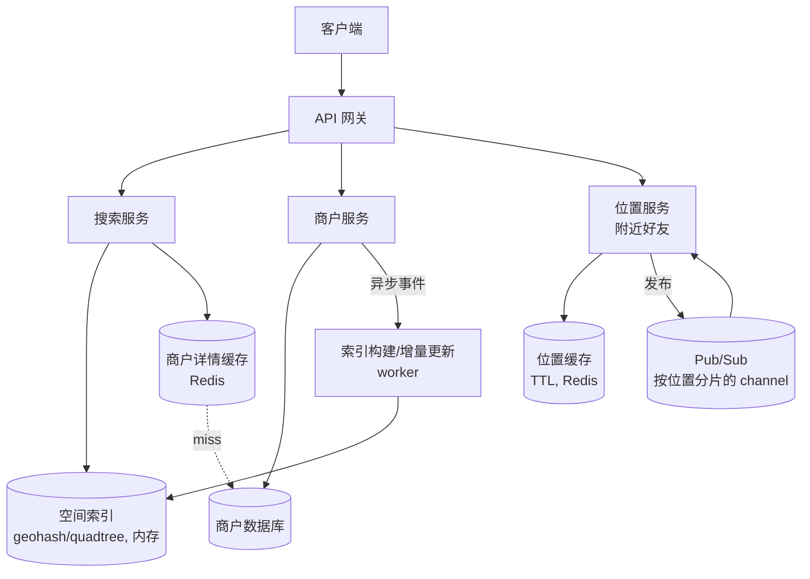

# 设计题解：邻近搜索（Proximity & Nearby Search，Yelp）

## 题目与范围

面试官通常这样开场："设计一个类似 Yelp 的邻近搜索系统：用户在某个位置发起搜索，系统返回
附近若干公里内的商户（餐厅、商店），可以按类别过滤，按距离或综合评分排序。" 这句话背后的
真正难点不是"存商户"，而是**在一个几乎不写入的数据集上，把二维空间距离查询变成能命中
索引的一维范围查询**——普通的 B 树索引（[[storage.relational.indexing|Indexing]]）只能
在单一维度上做范围扫描，纬度和经度必须先被"拍平"成一个可排序的键，才能用上索引的全部优势。

值得当场问清楚的澄清问题，以及它们各自改变的设计决策：

- **被搜索的对象是静止的还是移动的？** 商户地址几乎不变（一年可能改一次），但如果这道题
  还要覆盖"附近的好友"（好友的位置随手机移动，每隔几十秒刷新一次），索引的更新策略要完全
  不同——见「深入探讨」第 4 节。本题解两者都覆盖，但以静止对象为主线。
- **返回结果按纯距离排序，还是按距离和评分的综合分排序？** 综合排序意味着"最近的 K 个"
  这件事本身就不再是一个纯粹的几何问题，需要先圈出一个候选集，再在候选集内部排序——
  见「深入探讨」第 3 节。
- **搜索半径是用户指定还是系统自适应？**（比如城市中心默认 1 公里，郊区默认 10 公里）
  决定了空间索引的分辨率要不要按人口密度自适应，这正是 geohash（等宽网格）和四叉树
  （quadtree，密度自适应网格）之间取舍的核心。
- **商户信息更新的实时性要求多高？** 决定索引是可以做批量重建，还是必须支持在线增量更新。
- **要不要支持"附近的朋友们同时在线"这种双向、持续刷新的场景？** 决定是否需要为移动对象
  单开一条实时推送链路，而不是复用商户搜索的只读缓存路径。

**范围内**：按位置 + 半径 + 类别过滤搜索商户、按距离排序、商户信息的增删改、附近好友
（moving data）的最小可行设计。**范围外**：全文搜索与评论相关性排序（属于
[[solution-web-crawler|搜索引擎]] 一类问题的子集）、真正的车辆调度与行程状态机
（[[solution-ride-hailing|Ride Hailing]] 单独一题，两题共享空间索引的选型逻辑，但接下来
不会重复推导——移动对象在这道题里只以「附近好友」这个轻量场景出现）、地图瓦片渲染与路径
规划（属于「Maps & Navigation」）。

## 需求

**功能需求（驱动设计的 3–5 条）**

1. 用户提交 (纬度, 经度, 半径, 可选类别) 发起搜索，系统返回半径内匹配的商户列表。
2. 结果默认按距离升序排列；支持按"距离 + 评分"的综合分重排。
3. 商户可以被创建、编辑地址/类别/营业状态、下线（软删除，从搜索结果中消失但历史评论保留）。
4. （附加场景）用户可以看到好友列表中当前在附近的人，好友位置每隔一段时间刷新。
5. 支持分页：同一次搜索翻页时，结果不因为索引重建或商户增删而重复或跳漏。

**非功能需求（数字化）**

- **读延迟**：`GET /search` 接口 P99 < 200ms——这是用户每次打开 App 就会触发的首屏交互。
- **写延迟**：商户信息更新不要求实时可见，最终一致，容忍落后 < 5 分钟即可（批量重建索引
  的窗口）。
- **可用性**：读路径（搜索）目标 99.95%——搜索不可用直接等价于 App 不可用；写路径
  （商户管理后台）目标 99.9%。
- **一致性**：商户位置索引是最终一致；附近好友的位置是"尽力而为的新鲜度"（best-effort
  freshness），本题解将其明确设计为有界陈旧（bounded staleness，见容量估算）而不是强一致，
  因为好友位置的价值随时间迅速衰减，强一致带来的协调开销完全不值得。
- **规模**：见下一节容量估算，这一节的数字直接决定索引能不能整个放进内存。

## 容量估算

**流量侧（真实数据锚定 + 显式假设）**

Yelp 在 2024 年第四季度的 SEC 文件中披露：App 月活跃设备（monthly unique devices）约
2,859.5 万，桌面月活约 4,034.1 万，移动网页月活约 6,398.7 万（见「来源与延伸」）。本题解
只取 App 月活作为设计锚点，并显式声明后续都是**本设计的假设**，不是 Yelp 的真实运营数字：

```
MAU(app)              = 28.6M                      （SEC 文件，2024 Q4）
假设 DAU/MAU           = 20%                         （本设计假设，本地生活类 App 的常见区间）
假设 人均每日搜索次数    = 3
假设 峰值/均值 倍数      = 4x                         （饭点时段高度集中，比社交类 App 更陡）
```

<!-- computed via python3 -c -->
```
DAU                    = 28.6M × 20%        = 5,719,000
日均搜索总数            = DAU × 3            = 17,157,000
平均搜索 QPS            = 17,157,000 / 86400 ≈ 199
峰值搜索 QPS            = 199 × 4            ≈ 794
```

这个数字决定的设计取舍：**峰值不到 1,000 QPS，任何一台现代服务器都能扛住**——瓶颈从来
不在"搜索服务能不能扩容"，而在"空间索引结构本身能不能返回正确又快的结果"。这是这道题和
新闻流一类题目的本质区别：不是流量大到必须分片，而是**几何计算本身不天然适配关系型索引**。

**存储侧**

Yelp 同一份文件披露"已认领商户地点"（claimed local business locations）约 773.6 万个
（见「来源与延伸」）。这是一个下限——真实平台上还有大量未认领、由系统抓取生成的商户条目。
本题解**假设**总索引商户规模是已认领数的 3 倍，取整为 2,000 万：

```
商户记录字段：business_id(8B) + geohash(11B) + name(32B) + category(4B)
             + lat/lon(2×8B) + address(64B) + phone(15B)
             + rating_avg(4B) + rating_count(4B) + 其他开销(30B)
             = 188 字节/记录

总存储        = 2,000万 × 188B ≈ 3.76 GB
geohash 索引项 = (11+8)B × 2,000万 ≈ 0.38 GB
```

**这一步的结论比数字本身重要**：3.76GB 的商户全量数据，加上不到 0.4GB 的空间索引，
**整个索引可以完整放进单台机器的内存**，甚至可以在每个搜索服务实例上都保留一份本地
副本。多数关于这道题的讨论直接假设"必须分布式分片"，但在真实的 Yelp 体量下这并不成立——
分片带来的跨分片合并开销，往往比索引放不下内存造成的问题更大。只有当商户规模再涨
2–3 个数量级（比如把 Yelp 换成"全球所有 POI"）时，分片才是必需品，见「瓶颈、故障与演进」。

**附近好友（moving data）的量级**

```
假设 峰值并发共享位置用户比例 = DAU 的 2%
峰值并发用户数         = 5,719,000 × 2%     = 114,380
假设 位置刷新间隔       = 15 秒（比商户搜索更频繁，因为对象在移动）
位置更新写 QPS         = 114,380 / 15       ≈ 7,625

假设 平均好友数         = 150，其中 10% 同时在线 = 15 个在线好友/用户
上限通知 QPS（未做地理过滤前）
                     = 114,380 × 15 / 15   ≈ 114,380
```

7,625 QPS 的位置写入和最坏情况 114,380 QPS 的原始通知量，比商户搜索的 794 QPS 峰值高
一到两个数量级——这正是移动对象和静止对象在这道题里彻底不同的地方：**商户索引的瓶颈是
存储和查询结构，好友位置的瓶颈是写入速率和扇出（fan-out）**。真正的调度级"高频位置写入 +
强竞争匹配"场景（比如网约车）比这个还要再高一到两个数量级，留给
[[solution-ride-hailing|Ride Hailing]] 专门处理。

## 核心实体与 API

**实体**

- `Business`：`id, name, category, lat, lon, geohash, address, phone, rating_avg,
  rating_count, status(active/closed), updated_at`
- `SpatialIndexEntry`：`geohash_prefix, business_id`（geohash 方案）或
  `quad_node_id, business_id`（quadtree 方案）——两者互斥，取决于实现选型
- `User`（附近好友场景）：`id, lat, lon, last_seen_at, sharing_enabled`
- `FriendEdge`：`user_id, friend_id`（假设已存在于社交图谱服务中，不在本题范围内重新设计）

**API**

```
GET  /v1/search?lat=&lon=&radius_km=&category=&cursor=&limit=
  → { results: [{business_id, name, distance_m, rating_avg, category}], next_cursor }
  幂等；只读，无需幂等键。分页游标是 (geohash_prefix, business_id) 的组合，而不是纯偏移量
  ——见「深入探讨」第 3 节，纯偏移量分页在候选集持续变化时会重复或跳过结果。

POST /v1/businesses
  { name, category, lat, lon, address, phone } → { business_id }
  幂等键：客户端生成的 Idempotency-Key header，防止后台误触发两次创建。

PATCH /v1/businesses/{id}
  { lat?, lon?, category?, status? } → { business_id, updated_at }
  地址变更触发异步重新计算 geohash / 迁移 quadtree 叶子节点，不阻塞这次写请求。

POST /v1/location/ping   （附近好友场景）
  { lat, lon } → 204
  写入位置缓存并设置 TTL；不返回好友列表，好友列表走独立的推送/轮询通道。

GET  /v1/friends/nearby?radius_km=
  → { friends: [{user_id, distance_m, last_seen_at}] }
  返回位置尚未过期（TTL 内）的好友；过期好友不出现在结果里，而不是返回陈旧位置。
```

**明确不做的**：不在 API 层面暴露 geohash 或 quadtree 节点 ID——空间索引的实现细节完全
是内部实现，换索引方案不应该动到客户端契约；也不做"关键词 + 位置"混合搜索排序（那是
[[solution-web-crawler|搜索/索引]]题目的领域）。

## 高层设计



**搜索路径**：客户端请求携带 (lat, lon, radius) → 搜索服务把坐标编码成 geohash（或落到
quadtree 的某个节点）→ 在内存空间索引里查出候选 business_id 集合 → 用 Haversine 公式
精确计算距离、丢弃候选集边界之外的误判点（geohash 网格边界会把"实际很近但落在相邻格子"
的商户排除在最近邻之外，必须再查询相邻格子）→ 从缓存批量取商户详情 → 排序、分页、返回。
空间索引选内存结构而不是关系型数据库索引，是因为这道题的经纬度范围查询无法被 B 树的
单维有序性直接满足——这一点在「深入探讨」第 1 节展开。

**写路径**：商户创建/更新先写主数据库（保证是系统的真相来源），再异步发一条事件触发
索引增量更新。索引更新不是同步路径的一部分——3.76GB 的数据可以整体保留一份新旧版本
双缓冲（double buffering），增量更新失败时随时回退到上一份内存快照，代价是最多几分钟的
陈旧窗口，这与"最终一致、容忍 5 分钟延迟"的非功能需求完全匹配。

**附近好友路径**：位置上报走独立的 `/location/ping`，只写入一个带 TTL 的位置缓存，不
触发任何扇出；"谁的好友在附近"是在好友查询时才计算的拉模型（pull），而不是每次有人上报
位置就主动推给所有好友的推模型（push）——这个选择和「深入探讨」第 4 节的讨论直接相关。

## 深入探讨

### Geohash 与四叉树（quadtree）：谁在处理什么问题

两者都在做同一件事——把二维坐标压缩成能建索引的一维键——但选择完全不同的权衡点。

**Geohash**：把经纬度的二进制位交替编织（interleave）成一个整数，再用 Base32 编码成
字符串。长度 6 的 geohash 精度约 ±610 米，长度 8 约 ±19 米（Wikipedia Geohash 条目，
见「来源与延伸」）。它的最大优点是**可以直接用字符串前缀匹配**：`SELECT * FROM biz WHERE
geohash LIKE '9q8yy%'` 这类查询能命中标准的 B 树索引
（[[storage.relational.indexing|Indexing]] 的最左前缀规则），不需要任何专用的空间数据库。
Redis 的 `GEOADD`/`GEOSEARCH` 命令就是把经纬度交织成 52 位整数、存进一个有序集合
（sorted set）里，用范围查询模拟半径搜索（Redis 官方文档，见「来源与延伸」）。

但 geohash 网格是**均匀的**，不管这块地方是曼哈顿中心还是内华达沙漠，同样精度长度的
网格覆盖同样大小的物理面积。曼哈顿中心一个长度 7 的格子（边长约 153 米）里可能挤了几百
个商户，沙漠里的同样大小格子可能一个商户都没有——索引结构对密度毫无感知，热点格子会让
查询退化成"扫描一个几乎和普通表一样大的分区"。

**Quadtree** 反过来：从整块地图开始，递归地把落入同一节点的商户数量超过阈值（本题解
取 500，「容量估算」按 2,000 万商户算出约 4 万个叶子节点）的区域一分为四，直到每个叶子
节点里的商户数低于阈值。这让**密度高的城市中心自动分裂出更细的网格，稀疏区域保留粗
网格**，天然匹配商户分布的长尾。代价是它是一棵真正的树，不能像 geohash 字符串那样直接
套用关系型数据库的字符串前缀索引，需要专门维护（内存中的指针结构，或者用类似 Google S2
那样把树的路径编码回一个可排序的整数）；而且插入/删除可能触发节点分裂或合并，实现比
"往 geohash 表里加一行"复杂得多。

**这道题的选择**：以读为主、商户位置几乎不变的场景下，用 quadtree（在内存里维护，定期
重建，见「高层设计」的双缓冲策略）——密度自适应带来的查询稳定性，比 geohash 实现简单
带来的工程便利更重要，尤其是当城市中心的查询量本身就是长尾里最大的那部分流量。如果这道
题换成"写多读少、增量更新是主要负载"的场景（比如给移动对象建索引），geohash 存进 Redis
有序集合的增量插入成本远低于维护一棵会分裂/合并的树——这正是第 4 节里好友位置索引选择
geohash 而不是 quadtree 的原因。

### S2 与 H3：另外两种拍平球面的方式，以及为什么工业界超越了朴素 geohash

geohash 和朴素 quadtree 都有一个共同缺陷：**网格单元的形状和大小在球面上并不是真正
均匀的**，纬度越高，同样经度跨度对应的物理距离越小，导致靠近极地的网格严重扭曲。两个
工业界方案分别用不同的方式解决它：

**Google S2** 把地球投影到一个外接立方体的六个面上，再用希尔伯特曲线（Hilbert curve，
一种能较好保持局部性的空间填充曲线）给每个面编号，最终每个"S2 cell"对应一个 64 位整数。
它支持 30 级分辨率，第 12 级的平均单元面积在 3.31–6.38 平方公里之间（Google S2 官方
文档，见「来源与延伸」）。Uber 的调度系统正是用 S2 第 12 级把全球切成分片键
（见 [[solution-ride-hailing|Ride Hailing]] 深入探讨，这道题选用 S2 是因为希尔伯特曲线
比 geohash 用的 Z 字形曲线（Z-order curve）局部性更好——Z 字形曲线在某些边界上会出现
"编码值相邻但物理位置相距很远"的跳变，希尔伯特曲线把这种跳变次数降到更低）。

**Uber 的 H3** 走了另一条路：用六边形（hexagon）而不是正方形/立方体面切分地球，一共
122 个"基础单元"覆盖全球，外加 12 个五边形来处理拓扑上无法避免的奇点（覆盖在海洋上以
减小影响）。H3 支持 16 级分辨率（0–15），每往细一级分辨率，单元面积约变为上一级的
1/7（Uber 工程博客，见「来源与延伸」）；官方分辨率表给出第 7 级平均单元面积约
5.16 平方公里、边长约 1.41 公里，第 9 级约 0.105 平方公里、边长约 201 米
（h3geo.org，见「来源与延伸」）。**六边形唯一的优势是每个单元到它的所有邻居的中心距离
都相等**——正方形网格有"上下左右"和"对角线"两种不同的邻居距离，八个邻居里有四个更远，
这在计算"最近的 K 个"或做密度平滑（比如给周边订单量做插值）时会引入系统性偏差；六边形
消除了这种偏差，代价是六边形不能像正方形那样简单地递归四等分，subdivision 的实现更复杂。

**这道题怎么选**：对纯粹的"半径内商户搜索"，S2/H3 相对 geohash+quadtree 带来的收益
主要在极地失真和边界跳变上——对一个只服务人口密集城市（几乎不涉及极地）的产品，这个
收益不足以抵消引入一整套新依赖的工程成本，quadtree 已经解决了密度自适应的核心问题。
但如果这道题的下一步是"给周边订单密度做空间插值/预测"（比如动态定价，见
[[solution-ride-hailing|Ride Hailing]]），六边形均匀邻居距离的优势就变得决定性——这是
两道题选择不同空间索引的根本原因，不是任意的实现偏好。

### 排序不是纯距离：候选集生成与重排的两阶段结构

如果结果只按距离排序，问题很简单：查询空间索引，按距离截断前 K 个。但真实产品的排序是
"距离 + 评分 + 是否在营业"的综合分，而综合分本身不满足"离得越近分数一定越高"这个单调性，
不能直接把它塞进空间索引的遍历顺序里。

这道题的做法是两阶段：**第一阶段只用空间索引圈出一个足够宽的候选集**（比如半径放大到
用户请求半径的 1.5 倍，或者固定取最近的 500 个），**第二阶段在候选集内部按综合分重排，
再截断到用户请求的分页大小**。放大候选集的半径系数不是随便定的——如果综合分里评分权重
足够高，一个评分 4.8 星但比半径边界远 20% 的商户完全可能反超一堆 3.5 星但更近的商户，
候选集必须宽到能覆盖这种反超的合理范围，同时不能宽到把整个索引都扫一遍。

分页游标也要跟着这个两阶段结构走：**不能用纯偏移量**（`OFFSET 20 LIMIT 20`），因为候选
集在两次翻页之间可能因为商户增删而变化，偏移量对应的记录会漂移，导致重复或跳漏；这道题
用 `(综合分, business_id)` 的组合游标——下一页从"综合分严格小于上一页最后一条、且
business_id 打破平局"的位置继续，这个组合天然稳定，不受候选集其余部分变化的影响，这和
[[solution-news-feed|信息流]]处理排序分页的方式是同一个模式。

### 附近好友：移动对象如何逼着索引放弃"批量重建"

商户索引可以整体重建再原子替换（双缓冲），是因为写入率低到几分钟重建一次完全负担得起。
好友位置做不到——「容量估算」算出峰值 7,625 QPS 的位置写入，如果还想用批量重建的
quadtree，重建窗口内的位置早就过期了。这道题因此**为移动对象单开一条路径**，而不是
往商户搜索的索引上加一个"高频更新"分支：

- **存储**：位置写入 geohash 编码后的 (lat, lon) 到一个带 TTL 的 Redis 键（键本身就是
  `user_id`，值里带 geohash），TTL 设为刷新间隔的若干倍（比如 3 倍，允许网络抖动导致的
  漏报）——过期即视为"离线"，查询时不需要额外判断陈旧度，缓存系统的过期机制本身就是
  一致性边界。这正好对应「需求」里"有界陈旧而非强一致"的设计目标。
- **查询模型是拉（pull）不是推（push）**：只在用户主动查询"附近好友"时，才按 geohash
  前缀在好友的位置集合里做一次过滤——不是每次有人上报位置就主动通知所有好友。原因是
  平均好友数（150）乘以查询频率远小于位置上报频率，推模型的扇出成本（「容量估算」算出
  未过滤前上限 114,380 QPS）比拉模型按需计算的成本高得多；只有当产品要做"好友进入范围
  立刻弹通知"这种主动推送功能时，才值得为在线好友建一份 Redis Pub/Sub 订阅关系
  （按查询者的 geohash 前缀作为 channel key），把扇出成本从"每个用户的所有好友"降到
  "同一 geohash 前缀内互相关注的用户"。
- **索引结构选 geohash 而不是 quadtree**：Redis 有序集合的插入是 O(log N)，不需要处理
  节点分裂/合并；quadtree 面对每 15 秒一次的高频移动写入，维护树结构的开销远超它在密度
  自适应上带来的收益——这正是本节标题的答案：移动对象把"读多写少、可以批量重建"的前提
  条件直接拿掉了，索引选型也要跟着换边。

## 瓶颈、故障与演进

**热点（hot spot）**：城市中心的单个 geohash 格子或 quadtree 叶子节点，查询量可能是
郊区同精度格子的几十到上百倍。缓解手段是给热点格子的候选集加一层本地缓存（缓存"这个
geohash 前缀 + 类别过滤条件"的候选 ID 列表，而不是每次都重新遍历索引），命中率高是因为
同一个格子里的搜索请求，参数分布高度集中在少数几个类别组合上。

**空间索引服务整体不可用**：搜索直接返回错误比"退化成扫全表"更糟——扫 2,000 万条记录
毫无并发保护地打到主数据库上，会连带拖垮商户服务和索引构建 worker 的写路径。正确的降级
是保留最近一次成功加载的索引快照继续服务（哪怕商户数据已经陈旧几十分钟），只在快照本身
损坏时才整体不可用；这是「高层设计」里双缓冲设计的直接收益——旧快照永远在，切换失败可以
原地回滚。

**商户数据库不可用**：搜索路径本身不直接依赖商户数据库（候选集来自内存索引，详情来自
缓存），只有缓存穿透（miss）时才会打到数据库；数据库短暂不可用时，缓存里已有的商户仍能
正常搜到，只是新商户和刚更新的信息会暂时缺失或陈旧——这是"读路径的可用性目标比写路径
高"这条非功能需求在架构上的直接体现。

**索引构建 worker 故障**：增量更新停止，商户信息陈旧但不影响可用性（旧快照继续服务）；
需要监控"索引落后主数据库多久"这个滞后指标，而不是只监控 worker 进程是否存活——进程
活着但消费者卡在一个损坏事件上不推进，是比进程崩溃更隐蔽的故障模式。

**10 倍演进**（2 亿商户，接近全球所有零售/餐饮 POI 的量级）：3.76GB 的假设按比例变成
约 38GB，单机内存已经装不下，必须按地理区域做分片（比如按国家/大区分片，每个分片一个
独立的 quadtree），查询先按用户坐标路由到分片，再在分片内部走同样的两阶段排序；跨分片
边界的查询（用户站在两个分片交界处）需要向相邻分片广播查询并合并结果，这时候 S2/H3
这类"分辨率越低、跨分片路由越省"的层级索引开始比朴素按国界分片更划算，因为可以直接用
更粗的层级单元做分片键，边界查询只需要多问相邻的几个单元而不是相邻的整个国家分片。

**100 倍演进**（附近好友场景，用户规模涨到与 Yelp 搜索同一数量级）：拉模型的按需计算
在查询高峰会退化成对位置缓存的密集随机读，这时候需要把"好友是否在附近"的判断从查询时
计算改成写时增量维护——用户上报新位置时，只对其"好友集合中与新 geohash 前缀有订阅关系"
的那一小撮人做增量重算，而不是每次查询都扫一遍全部好友，这就是推模型在高负载下反过来
比拉模型便宜的临界点，架构需要随规模在两者之间切换而不是固守某一个。

## 面试官会追问什么

**中级**：geohash 的字符串前缀为什么能保证空间局部性？（回答要点：交替编织的二进制位
使得共享前缀越长的两个 geohash，对应的物理区域重叠或相邻的概率越高，但要点出这只是
概率性质，不是严格保证——边界情况下相邻的物理点可能有完全不同的前缀。）

**高级**：如果商户搜索要支持"沿途"查询（用户在移动，比如开车经过时查附近加油站），
索引和 API 要怎么变？（回答要点：单次半径查询变成沿一条路径的多次查询流，客户端应该
做节流——只在移动超过某个距离阈值后才发起新查询，而不是按固定时间间隔轮询；服务端可以
用请求坐标的 geohash 前缀做短 TTL 缓存，相邻请求大概率落在同一个或相邻的候选集里。）

**资深（staff）**：候选集的"放大半径系数"（第 3 节两阶段排序里的 1.5 倍）应该是写死的
常量，还是应该按类别或城市动态调整？（回答要点：不同类别的评分分布方差不同——评分区分度
低的类别（比如便利店，大家都是 3.5–4 星）放大系数可以很小，因为距离本身已经是主要的
区分因子；评分区分度高的类别（比如餐厅）需要更大的放大系数才能让高分商户有机会反超。
这本质是一个可以离线用历史点击率数据校准的超参数，不是架构决策，但候选集生成和排序
分离的两阶段结构必须先存在，这个校准才有意义。）

## 常见错误

- **把 geohash 当成"能算出精确距离"的工具**：geohash 前缀匹配给出的只是候选集，两个
  geohash 前缀相同不代表两点真的接近，前缀不同也不代表点不接近（网格边界问题）——必须
  再用 Haversine 公式在候选集内部精确计算距离，很多候选人直接跳过这一步。
- **忘记查询相邻网格**：只查询用户坐标所在的那一个 geohash 格子，会漏掉那些"物理上很
  近但恰好落在隔壁格子"的商户——正确做法是查询以用户坐标为中心的 3×3（或按半径决定
  的更多）个相邻格子。
- **用纯偏移量分页排序结果**：候选集会随着索引重建或商户增删变化，`OFFSET` 对应的
  位置跟着漂移，导致用户翻页时看到重复或缺失的商户——见「深入探讨」第 3 节的组合游标。
- **把附近好友的位置缓存设计成永久有效、靠客户端主动通知"我下线了"来清除**：客户端
  可能崩溃或网络中断而从不发送"下线"事件，导致大量幽灵在线状态；必须用 TTL 让陈旧
  数据自然过期，而不是依赖一个不可靠的显式清除信号。
- **索引重建时直接原地更新，而不是构建好整份新索引再原子切换**：重建过程中如果服务
  同时在读旧索引的一部分、新索引的另一部分，会返回不一致（部分陈旧、部分是新数据）
  的结果集，双缓冲加一次原子指针切换是标准解法。

## 五分钟讲法

I'd design this around one core insight: business locations barely change, so I can afford
to precompute a spatial index and rebuild it in the background, while the search traffic
itself — a few hundred QPS at Yelp's scale — is not the bottleneck at all. The hard part is
turning a two-dimensional distance query into something an ordinary index can serve. I'd
compare geohash, which interleaves lat/lon bits into a sortable string and plugs straight
into a B-tree, against a quadtree, which adaptively subdivides based on business density so
crowded city centers get finer cells than empty ones. I'd pick a quadtree for the read-heavy,
low-churn business index, kept fully in memory since even twenty million businesses fit in a
few gigabytes, and rebuilt with double-buffering so a bad rebuild never takes production down.
For ranking, I'd split it into two stages — use the spatial index only to generate a wide
candidate set, then re-rank that candidate set by a blended score of distance and rating,
with a composite cursor for stable pagination. For the "nearby friends" variant, where
locations move every few seconds instead of staying still for months, I'd switch to a
TTL-based geohash cache with a pull model, because that write pattern breaks every assumption
that made batch-rebuilt quadtrees cheap in the first place. At ten times the scale I'd shard
geographically and lean on a hierarchical index like S2 or H3 so cross-shard boundary queries
stay cheap.

## 来源与延伸

- https://en.wikipedia.org/wiki/Geohash — Geohash 的精确编码规则和精度表（长度 6 约
  ±610 米，长度 8 约 ±19 米），本题解「深入探讨」第 1 节直接引用了这份精度数据；与本
  题解不同的地方在于：本题解把精度表换算成了"曼哈顿中心一格挤几百个商户"这种密度失衡
  的具体后果，而不是停留在编码算法本身。
- https://redis.io/docs/latest/commands/geoadd/ — Redis 官方文档，说明 `GEOADD`/
  `GEOSEARCH` 把经纬度交织成 52 位整数存入有序集合、用范围查询模拟半径搜索的实现方式，
  本题解「深入探讨」第 4 节用它作为"geohash 更适合高频写入的移动对象"这一结论的具体
  实现依据；原文没有讨论好友场景，是本题解把它接到了这个场景上。
- https://www.uber.com/en-EG/blog/h3/ — Uber 官方工程博客，说明 H3 用 122 个基础单元 +
  12 个五边形覆盖全球、16 级分辨率、六边形邻居距离一致这几个核心事实，本题解「深入
  探讨」第 2 节的 H3 部分直接依据这篇文章；与本题解不同的地方在于：本题解补充了"六边形
  均匀邻居距离"具体在哪类计算（密度插值/动态定价）里才真正决定性，原文只泛泛提到
  "优化定价和调度"。
- https://h3geo.org/docs/core-library/restable — H3 官方分辨率表，本题解引用了第 7、9
  级的精确面积和边长数字；本题解只摘取了和这道题密度对比相关的两级，完整表格覆盖 0–15
  级更细。
- https://www.hellointerview.com/learn/system-design/problem-breakdowns/yelp — Hello
  Interview 对这道题的付费拆解，给出了 100M 日活、1000 万商户的规模假设和搜索延迟
  < 500ms 的目标；与本题解不同的地方在于：本题解用 Yelp 真实披露的月活和已认领商户数
  作为锚点重新推导了容量估算，而不是采用一个未说明来源的整数规模。
- https://bytebytego.com/guides/proximity-service — ByteByteGo 的邻近服务设计指南，
  给出了 geohash 编码的 SQL 前缀查询写法和"网格密度不均"这一局限性的定性描述；与本
  题解不同的地方在于：本题解给出了 quadtree 作为密度自适应的具体替代方案并用数字
  比较了两者的索引项开销，原文止步于指出问题、未展开量化的替代方案对比。
