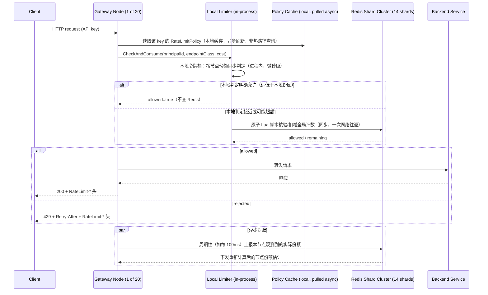

# 设计题解：分布式速率限制器（Distributed Rate Limiter）

## 题目与范围

面试官通常这样开场："设计一个速率限制器（rate limiter），保护一个 API 平台不被任何单个
调用方压垮——每个 API key 有自己的配额，这个配额要在几十台网关（gateway）实例上一致地
执行，而且限流本身加的延迟要小到用户感觉不到。" 这句话背后的难点不是"怎么数请求"（单机
用一个令牌桶就能做），而是**同一份配额状态要被几十台彼此独立的机器同时读写，读写路径
还要塞进一个几毫秒的延迟预算里，并且这套系统自己的存储层出故障时，不能把整条 API 拖下水**。

值得当场问清楚的澄清问题，以及它们各自改变的设计决策：

- **限流的键是什么？** 认证用户/API key，还是 IP？未认证端点（登录、注册）必须有 IP 兜底，
  但 IP 限流本身两头都错：CGNAT 会把成千上万合法用户挤在一个 IP 后面（假正），僵尸网络又
  会把流量摊到成千上万个 IP 上（假负）。本题假设所有需要强保护的端点都要求认证，因此以
  API key 为主键，IP 限流只作未认证端点的兜底层。
- **要不要区分突发（burst）和持续（sustained）两种限制？** 只做单一窗口无法同时表达"允许
  短时间内的合理突发"和"长期平均不能超标"——决定「深入探讨」第 2 节要不要跑两个独立的
  限流器。
- **限流失败要不要算错误？** 决定「深入探讨」第 4 节的失败策略：拒绝请求时用 429 还是
  上游语义。
- **单个端点是不是都算一次请求？** 一次批量导出可能是一次昂贵的数据库全表扫描，一次
  `GET /ping` 几乎零成本——决定「深入探讨」第 3 节要不要按请求成本加权计数，而不是单纯
  数请求条数。
- **计数存储要不要跨地域强一致？** 不要求——本题只讨论单一区域内的多网关部署；跨区域
  的全局限流（比如"这个 key 全球总共只能 1000 req/s"）需要额外的跨区域聚合层，在「瓶颈、
  故障与演进」的 100 倍演进里简单提及，不展开设计。

**范围内**：per-key/per-endpoint 配额的算法选择、跨网关节点的分布式执行、配额存储层
故障时的降级策略、拒绝时的响应语义。**范围外**：认证/鉴权本身（属于「Authentication &
Identity Service」）、DDoS 防护和 WAF 规则、跨地域全局强一致限流、计费与用量统计
（这是一个下游消费者，不是本题要建的系统）。

## 需求

**功能需求（驱动设计的 3–5 条）**

1. 每个 API key 有独立的速率配额，同时支持"短时突发上限"和"长期持续上限"两层约束。
2. 配额在多台网关实例上强制执行，效果等价于一个全局单一限流器，允许小幅近似误差。
3. 除了 per-key 限制，还要支持 per-endpoint 限制（不同端点成本不同，昂贵端点单独限流），
   以及一条保护整个平台的全局限制（防止所有 key 的流量加总打垮后端）。
4. 请求被拒绝时返回标准化的响应（状态码 + 头部），让客户端知道何时可以重试，而不是把
   限流误判成普通错误。
5. 配额存储层（下称"计数器存储"）不可用时，API 平台的核心可用性不能受影响。

**非功能需求（数字化）**

- **延迟预算**：限流检查本身给网关加的 P99 延迟 **< 2 ms**——这是本题的硬约束（对齐
  drill 的场景），因为限流只是请求路径上的一环，网关还要做认证、路由，留给后端的时间
  才是用户真正感知的延迟。
- **吞吐**：网关集群整体承载 **100,000 req/s 均值**，20 台网关节点，日间峰值系数 3
  （见容量估算）。
- **准确度**：允许近似——在配额附近小幅超发（over-admit）是可接受的工程权衡，只要
  超发幅度有界且可预期；**绝对不允许因为限流本身的实现缺陷导致 API 整体不可用**。
- **可用性分层**：限流这一层本身的可用性目标低于 API 主路径——计数器存储故障时，宁可
  暂时放宽限流也不能让主路径的可用性目标（99.95%+）被拖累。

## 容量估算

这道题的估算对象不是存储字节数，而是**限流检查本身要吃掉多少延迟预算、以及计数器存储
要扛多少次原子操作**——这两个数字决定了"能不能每次检查都同步查一次中心存储"。

**基础假设**：平台有 500 万个注册 API key；网关集群均值 100,000 req/s，日间峰值系数 3。

```
peak QPS = 100,000 × 3 = 300,000 req/s
```

**每个请求要过几道限流检查？** 本设计要求 per-key 持续限制、per-key 突发限制、
per-endpoint 限制三层都要过，一次请求触发 3 次限流判定：

```
限流检查/s（峰值） = 300,000 × 3 = 900,000 次/s
```

**这是第一个决定架构的数字**：如果每次检查都同步走一次到中心存储（Redis 一类）的网络
往返，900,000 次/s 需要的存储吞吐远超单实例能力。假设单个 Redis 分片在跑原子 Lua 脚本
（读状态、计算补充令牌、判断、写回）时，保守只能稳定吃下约 100,000 次/s 这类操作
（这是本设计给自己留的工程假设，不是某个基准测试的真实数字）：

```
所需分片数（无冗余） = ceil(900,000 / 100,000) = 9
所需分片数（1.5× 冗余headroom） = ceil(900,000 / 100,000 × 1.5) = 14
```

**这是第二个决定架构的数字**：2 ms 的延迟预算里，一次同城（same-AZ）Redis 往返正常情况下
大约 0.3–0.5 ms（本设计假设，取决于具体网络环境），看似有余量，但这是**同步串行**在关键
路径上的一次外部依赖——一旦 Redis 侧出现连接池排队、GC 停顿或瞬时抖动，P99 尾延迟很容易
吃穿整个 2 ms 预算。这个矛盾（想要精确 → 必须同步查中心存储 → 同步查询本身就是尾延迟
风险）是「深入探讨」第 1 节要解决的核心问题。

**每个网关节点的负载**：20 台网关平均分担流量：

```
单节点均值 QPS = 100,000 / 20 = 5,000
单节点峰值 QPS = 300,000 / 20 = 15,000
```

**存储对比（决定算法选择的数字）**：假设 sustained 限制是每 key 100 req/s，用 60 秒
滑动窗口表达，窗口内最多放行 100×60=6,000 个请求；burst 限制是每 key 1 秒窗口内 200 个
请求。如果用**滑动窗口日志（sliding window log）**——为窗口内每个请求都存一条时间戳
（8 字节整数）：

```
sustained 层：6,000 条 × 8B = 48,000 B/key
burst 层：   200 条 × 8B = 1,600 B/key
5,000,000 key 合计 = (48,000 + 1,600) × 5,000,000 ≈ 248,000,000,000 B ≈ 248 GB
```

而如果用**滑动窗口计数器（sliding window counter）**或**令牌桶**——每个 key 每层只存
一个常数大小的状态（两个计数器或 token 数+时间戳，估算 50 字节含 key 本身的存储开销）：

```
15,000,000 个计数器（500万 key × 3 层）× 50B ≈ 750,000,000 B ≈ 0.75 GB
三副本 ≈ 2.25 GB
```

**结论**：滑动窗口日志比计数器近似多用约 **331 倍**内存（248GB / 0.75GB ≈ 331），这不是
一个可以靠加机器抹平的差距——这正是「深入探讨」第 2 节选择常数空间算法而不是日志算法的
量化依据。真正稀缺、决定架构的不是存储字节数（哪怕 248GB 云内存价格也不算天价），而是
**中心存储每秒能扛多少次原子操作**——这决定了本题到底要不要、以及在多大比例上走同步
中心化路径。

## 核心实体与 API

**实体**

- **Principal**：被限流的主体，`id`（API key 或已认证用户 id）、`tier`（付费等级，决定
  配额档位）。IP 只在未认证路径上临时充当 principal。
- **RateLimitPolicy**：`principalTier, endpointClass, sustainedLimit, sustainedWindowSec,
  burstLimit, burstWindowSec, costWeight`——一条策略同时定义 sustained 和 burst 两层，
  `costWeight` 是该端点每次调用消耗的配额单位（见「深入探讨」第 3 节），默认 1。
- **BucketState**：`principalId, tierKey(sustained|burst), tokens/count, lastRefillTs`——
  是限流器自己的运行时状态，不是业务数据，允许丢失后重建为"满配额"（对新 key 宽松，
  对老 key 不惩罚）。
- **GatewayNode**：`nodeId, localShareEstimate`——每个网关节点在混合方案里持有的"本地
  份额"估计值（见「深入探讨」第 1 节），是缓存而不是权威状态。

**API**（内部服务接口，网关在处理业务请求前调用，不是终端用户直接访问的公开 API）

```
CheckAndConsume(principalId, endpointClass, cost=1)
  → { allowed: bool, remaining: int, resetAt: timestamp,
      limitedBy: "sustained" | "burst" | "endpoint" | "global" }
  幂等？否——每次调用都是一次真实的配额消耗，重试会重复扣配额，这是设计意图
  （客户端网络超时后重试，本就应该再消耗一次配额，而不是被幂等键保护）。

GetPolicy(principalTier, endpointClass) → RateLimitPolicy
  网关本地缓存该结果，避免每次请求都查策略存储。

PUT /admin/policies/{principalTier}/{endpointClass}   更新限流策略（管理接口，非热路径）
```

**故意不做的**：不在 `CheckAndConsume` 里暴露"跳过限流"的旁路参数（避免被业务代码滥用
绕过保护）；不支持单次调用同时检查多个 principal（避免把限流服务变成通用查询接口）；
不在这一层做计费或用量统计的持久化（那是下游订阅这条检查结果事件流的另一个系统）。

## 高层设计



**写路径（限流判定本身）**：本设计不是"要么全同步查中心存储，要么全本地独立"的二选一，
而是分层——每个网关节点持有一份**动态调整的本地份额**（初始为 `limit / 20` 的静态切分，
随后按观测到的真实流量分布周期性重新估算，见「深入探讨」第 1 节）。绝大多数请求只要没有
接近本地份额上限，判定完全在进程内完成，零网络往返，天然满足 2 ms 预算；只有当本地状态
显示"可能已经或接近超过全局配额"时，才退化成一次同步的 Redis 原子操作做精确核验。这个
"本地优先、按需回源"的结构，是让 900,000 次/s 的检查量不必每次都打到 Redis 分片集群
的关键。

**存储技术选型**：BucketState 用**内存数据结构存储（Redis 一类）**而不是关系型数据库，
因为需要极高频的原子读改写（INCR/Lua 脚本）、亚毫秒延迟，并且这份状态本身允许丢失重建
（不是权威业务数据）——这与 [[caching.strategies|Write & Read Strategies]] 里"缓存不是
数据源"的原则一致。RateLimitPolicy 本身变更频率极低（人工配置），用普通配置存储 + 网关
本地缓存 + 异步推送/轮询刷新即可，不走热路径。

**读路径**：本题里"读"就是限流判定本身（CheckAndConsume），已经在写路径里讲完，没有
独立于写的只读查询路径。

## 深入探讨

### 本地独立执行、中心同步执行与"本地优先 + 按需回源"的混合方案

**问题**：容量估算给出的矛盾——2 ms 延迟预算下，同步查中心存储的尾延迟风险；但纯本地
独立执行又没有一个全局真相，配额会在节点间被错误切分或被绕过。

**方案一：纯中心化同步执行**。每次 `CheckAndConsume` 都同步查询 Redis 原子递减，
全局精确。代价：900,000 次/s 的操作量需要至少 14 个分片（含冗余）常年在线，且把 Redis
的可用性和尾延迟直接串进每一次请求的关键路径——这正是 Stripe 公开描述的实际做法（见
「来源与延伸」），他们用集中式 Redis 存储令牌桶状态，接受这个同步开销换取精确性。

**方案二：纯本地独立执行**。每个节点各自维护 `limit/20` 的静态本地配额，互不通信。代价：
如果某个 key 的流量因为客户端连接粘性（sticky routing）、DNS 缓存等原因集中打到少数几个
节点，这些节点会在全局配额远未用完时就错误拒绝（under-admission）；反过来，如果本地配额
不做切分而是每个节点各自允许到全局上限，20 个节点理论上能把全局配额过量执行到 20 倍
（over-admission）——两个方向的误差都不可接受。

**方案三（本设计采用）：本地优先执行 + 周期性对账重新估算份额**。每个节点从静态均分
（`limit/20`）出发，但每 100ms 把本节点观测到的真实请求分布上报给 Redis 侧的聚合逻辑，
重新计算并下发各节点应得的份额（流量集中的节点分到更大份额，冷节点分到更小份额）；本地
判定绝大多数时候不触网，只在状态显示"逼近本地份额上限"时才发起一次同步 Redis 核验。这
把 900,000 次/s 的理论检查量压到只有"逼近上限"的那一小部分真正打到 Redis，同时把误差
限制在一个 100ms 的对账窗口内——Cloudflare 公开披露的类似近似方案（不是完全相同的架构，
但同属"近似 + 周期对账"思路）在真实流量上测得的整体误判率只有 **0.003%**，平均估计值与
真实值偏差约 **6%**（400M 请求、27 万来源的抽样，见「来源与延伸」），说明近似方案在生产
环境里精度损失是可接受的。

### 滑动窗口日志、滑动窗口计数器与令牌桶：为什么常数空间赢

**问题**：容量估算算出滑动窗口日志比计数器近似多耗费约 331 倍内存（248GB vs 0.75GB），
这道题必须在"完全精确"和"近似但常数空间"之间选边。

**方案一：滑动窗口日志**。为窗口内每个请求存一条时间戳，精确知道任意时刻窗口内的真实
请求数，不存在边界误差。代价：单 key 内存随限流窗口大小和限额线性增长，如估算所示，
500 万 key、两层限制，合计约 248GB——这个量级本身不是不能承受，但它随 key 数和限额线性
增长，且每次判定要清理过期时间戳（O(窗口内请求数)的操作），在 900,000 次/s 的检查量下
CPU 开销也不便宜。

**方案二：固定窗口计数器（fixed window）**。O(1) 空间，单个整数 + 窗口起始时间。代价：
窗口边界会出现双倍突发——一个 key 可以在上一个窗口的最后 1 毫秒打满限额，紧接着在下一
窗口的第 1 毫秒再打满一次限额，短时间内实际通过量是限额的近 2 倍，这是教科书级别的已知
缺陷，不适合本题"突发要可控"的要求。

**方案三（本设计采用）：滑动窗口计数器**（sustained 层）+ **令牌桶**（burst 层）。滑动
窗口计数器保留当前窗口和上一窗口两个计数器，`估计速率 = 当前窗口计数 + 上一窗口计数 ×
（滑动窗口与上一窗口的重叠比例）`——O(1) 空间（每 key 两个整数），代价是假设请求在上一
窗口内均匀分布，边界误差小且有界，这正是 Cloudflare 生产环境采用并公开验证过误差范围的
方案。令牌桶专门处理 burst 层，因为它天然允许"桶内积攒的令牌一次性花完"这种短时突发，
同时长期速率仍被补充速率钳制在限额内——两种算法分别对应"长期平均要精确控制"和"允许
克制的突发"这两个不同诉求，不是同一个算法能同时最优的两件事。

### 多层配额与按成本加权：不是所有请求都算"一次"

**问题**：per-key 限制只解决"这个调用方用了多少次接口"，回答不了"一次昂贵的批量导出和
一次 `GET /ping` 该不该算同一次配额消耗"，也回答不了"某个 key 的流量正常，但所有 key
加起来是否会打垮后端整个集群"。

**方案（本设计采用）：三层配额并行生效，请求必须同时通过全部适用层**。① **per-key
sustained/burst**——如高层设计与容量估算所述；② **per-endpoint 按成本加权**——每个
`endpointClass` 在 `RateLimitPolicy` 里带一个 `costWeight`，例如一次简单 `GET` 消耗
1 个配额单位，一次触发全表扫描的批量导出消耗 50 个单位，这样"10 次导出"和"500 次简单
查询"对同一个 key 的配额账本产生同样的压力，配额真正对齐的是"占用的后端资源"而不是
"请求条数"；③ **全局 fleet 限制**——不挂在任何单一 key 上，而是限制整个网关集群在单位
时间内放行的总请求数，防止"每个 key 都刚好在自己配额之内，但所有 key 加总仍然远超后端
承载能力"这种全员达标却整体过载的场景。三层任何一层触发拒绝，`CheckAndConsume` 的
`limitedBy` 字段标出是哪一层，方便客户端和运维区分"你自己超额了"还是"整个平台在保护
自己"。

### 失败策略：为什么同一个系统里不同层要有不同的答案

**问题**：计数器存储（Redis 分片集群）整体或部分不可用时，限流判定该怎么办——"打不开
就放行"（fail-open）还是"打不开就拒绝"（fail-closed），两个方向都有真实公司在用，且
理由都站得住。

**方案一：fail-closed**。Redis 不可达时拒绝所有请求。理由（这类方案的支持者常给出）：
限流故障往往和真实的流量高峰同时发生——如果偏偏在最需要保护的时候放开限流，后端可能被
瞬间打垮，代价比暂时拒绝一部分合法流量更大。

**方案二（本设计对 per-key/per-endpoint 层采用）：fail-open**。Redis 不可达时，限流
判定退化为纯本地静态份额（无对账、无精确核验），不拒绝任何原本会通过本地判定的请求。
Stripe 公开的设计原则是"限流代码本身的 bug，或者 Redis 故障，都不应该影响到请求"（见
「来源与延伸」）——因为限流器保护的是"公平性"和"成本可预测"，不是系统本身的生死线，
牺牲一点公平性远好于把一个可用性问题伪造成限流问题。

**本设计的取舍是分层不对称的**：per-key/per-endpoint 这两层的目的是公平性，采用
fail-open，与 Stripe 的取舍一致；但**全局 fleet 限制**这一层的目的是保护后端不被打垮，
它的判断不完全依赖 Redis（本地节点各自也持续追踪自己转发出去的请求量，即使集中式配额
账本失联，每个节点仍知道自己放行了多少)，因此在 Redis 完全失联的极端情况下，退化为
"每个节点按自己过去观测到的份额继续限流"，而不是无条件放开——这与 Stripe 架构里"限流
器可以 fail-open，但负责纪律的 fleet-usage load shedder 和 worker-utilization
shedder 这两层必须持续生效"是同一个思路：**离用户越近、目的是公平性的那一层，故障时
偏向可用性；离后端保护越近、目的是自保的那一层，故障时偏向保守**。Stripe 公开的运营
数据能看出这套分层防御的实际形态：request-rate limiter 每月拒绝的请求量以百万计，
concurrent-request limiter 每月约 12,000 次，而作为最后防线的 worker-utilization
shedder 每月只触发约 100 次——越靠后的防线触发频率越低，说明前面的层大多数时候已经
把问题挡住了。

## 瓶颈、故障与演进

**热点与倾斜**：单个 key 的全部流量总是哈希到 Redis 分片集群里固定的那一个分片（本设计
的分片键是 `hash(principalId)`），一个异常活跃的 key（例如某个客户端把重试风暴打到自己
名下）会让它所在的那一个分片承受远高于平均值的原子操作量，其余分片闲置——这和名人热帖的
读侧热点是同一类问题：加分片数量本身不解决单 key 热点，需要给该 key 单独加一层"本地
静态硬上限"兜底，不依赖它所在分片的实时响应。

**故障域**：

- **单个 Redis 分片不可用**：只影响哈希到该分片的那部分 key，其余分片照常工作；受影响
  的 key 退化为本地纯静态份额执行（见失败策略深入探讨）。
- **整个 Redis 集群不可用**：per-key/per-endpoint 判定全部退化为本地静态份额，允许的
  总量可能短暂偏离全局精确值，但 API 主路径完全不受影响；全局 fleet 限制退化为"各节点
  按历史观测份额自治"，仍对后端提供基本保护。
- **策略配置存储不可用**：网关继续使用本地缓存的旧策略，新的限流规则变更暂时不生效，
  不影响已有规则的执行。
- **网关节点本身故障**：无状态，负载均衡器摘除故障节点即可，本地份额重新在存活节点间
  按新的对账周期重新估算，不需要人工介入。

**10 倍演进**：均值 QPS 从 100,000 到 1,000,000。峰值检查量从 900,000 次/s 涨到
9,000,000 次/s，所需 Redis 分片数（1.5× 冗余）从 14 涨到 135——分片数量本身的运维复杂度
（135 个独立故障域的监控、扩缩容）开始成为比"计算量"更突出的问题，需要引入自动化的分片
拓扑管理，而不是手工维护哈希表。滑动窗口日志方案在这个量级下的内存开销也会从 248GB
线性涨到 2.48TB，进一步印证常数空间算法在这个题目上不是锦上添花，而是规模化的前提。

**100 倍演进**：均值 QPS 到 10,000,000，理论所需分片数涨到 1,350。这个规模下，单一
扁平的"按 principalId 哈希到全局分片集群"架构本身开始不现实——运维、跨可用区网络成本、
单一集群的爆炸半径都不再可控，需要转向**分层限流**：每个区域/可用区先做本地近似限流
（本地节点 + 区域内小规模 Redis 集群），只有当需要全局精确配额（比如企业客户的合同级
配额）时才做低频的跨区域异步对账，牺牲"任意两个节点之间毫秒级一致"换取"避免任何单一
中心组件成为全局瓶颈"——这与 Cloudflare 按 PoP（接入点）就近处理、不追求跨 PoP 强一致
的真实架构是同一个方向。

## 面试官会追问什么

**中级（mid）**
- "令牌桶和滑动窗口计数器有什么区别，什么场景选哪个？" 令牌桶允许在长期平均之内做突发
  消费（桶里攒的令牌可以一次花完）；滑动窗口计数器不额外允许突发，只在近似意义上平滑
  窗口边界的双倍突发问题——本题两个都用，各自负责 burst 层和 sustained 层。
- "限流拒绝时应该返回什么？" 429 状态码 + `Retry-After` + `RateLimit-*` 头部；返回一个
  普通 500 会让客户端把限流当瞬时故障立刻重试，反而把被丢弃的负载变成自造的重试风暴。

**高级（senior）**
- "如果所有网关节点都直接同步查 Redis，2ms 延迟预算还够吗？" 关键在于同步查询是不是
  在**每一次**请求的关键路径上——本设计只在本地判定逼近份额上限时才回源，多数请求走
  进程内判定，同步开销只出现在少数边界情况，而不是全部 900,000 次/s 的检查。
- "per-key 限制正常，但后端还是被打垮了，为什么？" 说明只做了 per-key 限制，没做全局
  fleet 限制——所有 key 各自都没超额，但加总流量超过后端总容量，这是"个体合规、整体
  过载"的经典场景，见深入探讨第 3 节。

**参谋级（staff）**
- "怎么决定一个 Redis 分片什么时候需要拆分？" 不能只看平均 QPS，要看单 key 热点——如果
  某个分片的负载集中在少数几个 key 上，加分片数量本身不解决问题，需要给这些 key 单独
  做本地硬上限或专属分片。
- "全局 fleet 限制和 per-key 限制的失败策略为什么不一样？" 因为它们保护的目标不同：
  per-key 保护的是公平性（可以 fail-open，牺牲一点公平性换可用性），fleet 限制保护的是
  后端不被打垮（需要更保守的退化路径，即使中心配额存储失联也不能无条件放开）。

## 常见错误

- 把"限流"和"负载丢弃（load shedding）"混为一谈，以为一个通用的"请求太多就拒绝"组件
  能同时做公平性配额和过载自保——两者触发条件、失败策略、优先级排序完全不同。
- 只讲单机令牌桶算法，被追问"20 台网关怎么共享这一份配额"答不上来，说明没意识到这道题
  真正的难点是分布式一致性和延迟预算的矛盾，而不是算法本身。
- 无脑选"全部同步查中心 Redis"，却算不出这会给 2ms 延迟预算带来多大风险，也说不出中心
  存储需要多少分片才能扛住峰值检查量。
- 只讨论 per-key 限制，忽略全局 fleet 限制，遇到"每个 key 都没超额但后端还是崩了"这类
  追问时无法自圆其说。
- 中心存储故障时的降级方案含糊其辞地说"加个本地缓存兜底"，说不清楚本地兜底和中心状态
  之间的对账频率、以及这个频率如何限定近似误差的上界。

## 五分钟讲法

This is a distributed rate limiter for an API platform where the central tension is a two
millisecond latency budget colliding with the need to share one logical quota across twenty
gateway nodes. A fully centralized design, synchronously checking a Redis-class store on
every request, gives exact enforcement but puts a network round trip and that store's tail
latency directly on the request path, and at peak traffic it needs on the order of a dozen
shards just to keep up with the check volume. So I use a local-first hybrid: each node
starts with a static share of the quota, checks purely in-process for the common case, and
only falls back to a synchronous store lookup when its local state looks close to its share
of the limit; nodes periodically reconcile their observed traffic split so a node that's
absorbing more of a hot key's traffic gets reassigned a bigger local share. For the
algorithm itself, a sliding window log is exact but its memory scales linearly with the
limit and window size — in my estimate it costs over three hundred times more memory than a
constant-space sliding window counter at the same scale — so I use the counter
approximation for the sustained limit and a token bucket for the burst limit, since only the
token bucket's bucket-of-saved-tokens naturally expresses "spend a burst now, average stays
capped later." Quotas stack in three layers — per-key, cost-weighted per-endpoint so an
expensive bulk export doesn't count the same as a cheap read, and a global fleet limit that
catches the case where every key is individually within budget but the sum overwhelms the
backend. Failure policy is asymmetric on purpose: the per-key and per-endpoint layers fail
open, because their job is fairness and losing that briefly beats an availability incident,
while the fleet-protection layer keeps degrading gracefully off each node's own recent
observations even if the central store is completely unreachable, because its job is
self-protection, not fairness. At ten times the load the shard count for exact backing
enforcement grows from about a dozen to well over a hundred, which turns shard-topology
management itself into the bottleneck; at a hundred times the load a single flat
hash-to-shard architecture stops being operable at all, and the design shifts to regional
approximate limiting with only occasional, low-frequency cross-region reconciliation for the
few quotas that truly need to be global.

## 来源与延伸

- [Stripe — Scaling your API with rate limiters](https://stripe.com/blog/rate-limiters)
  （Stripe 工程博客，一手来源）：披露了 Stripe 生产环境真实使用的四层防御——request-rate
  limiter（令牌桶，Redis 集中存储）、concurrent-requests limiter、fleet-usage load
  shedder（为关键操作预留固定比例的机器）、worker-utilization load shedder（最后一道
  防线），并给出了"限流代码本身的 bug 或 Redis 故障都不该影响请求"这条 fail-open 原则，
  以及三层的真实月度拒绝量级（request-rate 以百万计、concurrent-requests 约 12,000、
  worker-utilization 约 100）。本文「深入探讨」第 4 节的分层不对称失败策略直接对齐这篇
  文章披露的架构，并补充了"为什么公平性层可以 fail-open 而自保层不能"这条本文自己给出的
  论证，原文没有展开这一层因果关系。
- [Cloudflare — Counting things: A lot of a different things](https://blog.cloudflare.com/counting-things-a-lot-of-different-things/)
  （Cloudflare 工程博客，一手来源）：详述了滑动窗口计数器的近似公式，并给出了在 4 亿
  请求、27 万来源的真实抽样上测得的误判率（0.003%）和平均误差（约 6%），是"近似算法在
  生产环境够用"这一判断的直接证据。本文在「深入探讨」第 2 节采用了同样的滑动窗口计数器
  公式，但把它和令牌桶做了针对 burst/sustained 两层的分工，而不是像原文那样只讨论单一
  限流场景。
- [Hello Interview — Distributed Rate Limiter](https://www.hellointerview.com/learn/system-design/problem-breakdowns/distributed-rate-limiter)
  （`no-archive`，商业备考网站）：给出了 API 网关放置、Redis 分片按一致性哈希扩展、以及
  fail-closed 的论证角度（"限流故障往往和真实流量高峰同时发生"）。本文与它的分歧在于
  失败策略——本文采用分层不对称的 fail-open/保守退化组合（对齐 Stripe 的真实做法），而不是
  它建议的整体 fail-closed；本文也用具体算出的检查量（900,000 次/s）和分片数（14）替代了
  它给出的"1M req/s、100M DAU"这类更抽象的场景设定。
