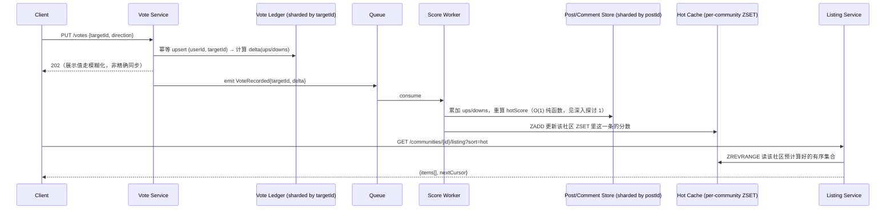

# 设计题解：论坛与嵌套评论（Forum & Threaded Comments，Reddit）

## 题目与范围

面试官通常这样开场："设计一个类似 Reddit 的论坛：用户在不同的社区（subreddit）里发帖，
其他用户对帖子和评论投票，评论可以无限嵌套回复，首页和社区页按某种"热门"顺序展示帖子。"
这道题和 [[solution-news-feed|信息流]] 长得像——都要解决"写一次、被很多人读"的排序问题——
但驱动架构的核心矛盾完全不同：信息流的内容按"你关注了谁"个性化到每个用户，这里的内容按
"你在哪个社区"公共化到该社区的全体订阅者；信息流的难点是给几亿用户各自维护一份预计算列表，
这里的难点是给一份**共享**列表选一个能在高频投票下便宜重算的排序公式，以及给一棵可以无限
深、单条帖子下可能长到几万条回复的评论树选一个存储模型。

值得当场问清楚的澄清问题，以及它们各自改变的设计决策：

- **"热门"是按时间衰减打分，还是纯粹按票数？** 纯票数排序会让老帖子永远压着新帖子——一
  篇发布一年前有 10 万赞的帖子会永远排在今天发布的所有内容前面。本题假设产品需要时间衰减的
  热度打分（见「深入探讨」第 1 节），这也是 Reddit 的真实产品形态。
- **评论要不要支持无限深度嵌套？** 决定评论树的存储模型选型（见「深入探讨」第 3 节）——如果
  深度被产品限死在比如 3 层，邻接表配合固定层数展开就够了；本题按无限深度设计，因为这是这道
  题真正的难点所在。
- **投给的票能不能反悔（改票/取消票）？** 决定投票要不要做成幂等的状态型记录而不是追加型的
  事件流（见「深入探讨」第 2 节）。
- **显示的票数要不要和排序真正用的票数完全一致？** 决定要不要做"投票模糊化"（vote fuzzing）
  这类反刷票手段——本题假设产品允许两者不同（见「深入探讨」第 2 节）。
- **要不要处理内容审核（moderation）？** 要——这是论坛类产品区别于纯信息流产品的另一个真实
  难点（见「深入探讨」第 5 节）。

**范围内**：社区内发帖与投票、时间衰减的热度排序、嵌套评论树的存储与分页、评论内部按"最佳"
排序、热门列表的缓存、基础的内容审核（移除/锁定）。**范围外**：社区/用户的创建与发现（见
[[solution-search-engine]]）、跨社区的全站聚合热门（如 r/all，见「瓶颈、故障与演进」100
倍演进部分，属于 [[solution-top-k]] 的问题域）、私信、除投票计数外的用户声望/徽章体系、
广告投放。

## 需求

**功能需求（驱动设计的 3–5 条）**

1. 用户在某个社区下发帖；帖子出现在该社区的列表里，可按热门（hot）/最新（new）/最佳（top）
   排序。
2. 用户对帖子或评论投出赞成/反对票；同一用户对同一目标的投票是幂等的，可以改票或撤票，
   不会被重复计两次。
3. 用户可以回复一篇帖子或回复另一条评论，形成任意深度的嵌套评论树；同一层的兄弟评论可以
   独立按"最佳"（best）/最新/争议（controversial）重新排序。
4. 社区的"热门"列表按时间衰减的投票分数排序，新投票到来后要能便宜地更新排名，不需要对
   整个列表做全量重算。
5. 版主（moderator）可以移除/锁定本社区内的帖子或评论；被移除的内容即使已经进了缓存，也
   不应该继续出现在任何公开列表里。

**非功能需求（数字化）**

- **读延迟**：`GET /communities/{id}/listing` 和取评论两个接口 P99 < 200ms——和信息流一样，
  这是用户每天触发几十次的核心交互。
- **排名新鲜度**：一次投票到它反映在热门列表排序里的延迟，目标 P99 < 5 秒——这个数字比
  [[solution-news-feed]] 采用的"1 分钟"信息流陈旧容忍更紧，因为这里要重排的是同一份公共
  列表，任何一次投票的效果全社区所有人立刻共享，容错窗口更小。
- **评论可见延迟**：评论提交到对其他读者可见，目标 P99 < 2 秒——比投票更紧，因为一段对话
  里迟迟看不到自己刚发的回复，体验上比"排名慢半拍"更容易被注意到。
- **可用性分层**：读路径（浏览列表、读评论）99.99%；写路径（发帖、投票、评论）99.9%。
- **一致性的两条轨道**：评论树的**结构**（父子关系）必须强一致——绝不能丢一条评论或把它
  挂错父节点；投票**计数**允许最终一致，而且允许**展示值和排序真正使用的值不同**（见「深入
  探讨」第 2 节）——这不是缺陷，是这道题里唯一一处刻意引入的不一致，用来对抗刷票脚本。

## 容量估算

**基础假设**：日活用户（DAU）1 亿。

**读侧（决定列表缓存怎么设计）**：假设日活平均每天打开 6 次，每次浏览 4 页列表，每页 25 条：

```
listing reads/day = 1×10^8 × 6 × 4 = 2.4×10^9
read QPS(avg) = 2.4×10^9 / 86,400 ≈ 27,778
read QPS(peak, ×3) ≈ 83,333
impressions/day（曝光的帖子条目数）= 2.4×10^9 × 25 = 6×10^10
```

**投票与评论（从曝光量推导，而不是凭空设一个人均票数）**：假设每 100 次曝光里有 2 次被
投票、0.1 次被评论——这两个比例的差距本身就说明投票的操作成本远低于评论：

```
votes/day = 6×10^10 × 0.02 = 1.2×10^9
vote QPS(avg) = 1.2×10^9 / 86,400 ≈ 13,889 ，peak(×6，投票在爆款出现时的突发性比阅读更强) ≈ 83,333
comments/day = 6×10^10 × 0.001 = 6×10^7
comment QPS(avg) = 6×10^7 / 86,400 ≈ 694 ，peak(×5) ≈ 3,472
```

反推交叉验证：1.2×10^9 票 / 1×10^8 DAU ≈ **人均每天投 12 票**——和"平均每天刷几屏、
顺手点几个赞踩"的直觉量级吻合，说明曝光→投票率这条链路推出来的数字没有脱离常识。

**发帖（独立于曝光的假设，因为发帖是曝光量的因，不是果）**：假设 2% 的日活每天发至少
一条帖子：

```
posts/day = 1×10^8 × 0.02 = 2,000,000
post QPS(avg) ≈ 23.1 ，peak(×5) ≈ 115.7
```

三个写入量级之间的比例：`votes : comments : posts ≈ 600 : 30 : 1`——**这个递减梯度本身
就是这道题和信息流题的第一个分野**：信息流的写放大来自"一次发帖要不要推给几百万粉丝"，
这里完全没有粉丝概念，写放大来自"同一份内容的赞踩比评论便宜 20 倍、比发帖便宜 600 倍"，
逼出的是"投票路径要单独扛住全站最高的写 QPS"这个设计重点（见「深入探讨」第 2 节），而不是
扇出问题。

**存储**：投票需要一条可幂等改票的账本记录（userId + targetId + targetType + direction +
updatedAt，约 30B）；评论均值约 350B（正文 + 元数据）；帖子均值约 1000B。

```
votes 账本 = 1.2×10^9 × 30B = 3.6×10^10 B/天 = 36 GB/天，一年三副本 ≈ 39.4 TB
comments   = 6×10^7  × 350B = 2.1×10^10 B/天 = 21 GB/天，一年三副本 ≈ 23.0 TB
posts      = 2×10^6  × 1000B = 2×10^9  B/天 = 2 GB/天， 一年三副本 ≈ 2.2 TB
```

**热门列表缓存——这是和信息流最悬殊的一个对比**：假设站内约 15 万个活跃社区（量级上接近
Reddit 2018 年披露的约 13.8 万活跃 subreddit，见「来源与延伸」），每个社区的热门列表缓存
只需要保留排名前 1,000 的帖子，每条 20B（post_id + 打包分数，和信息流 inbox 条目同一量级）：

```
per-community 缓存总量 = 150,000 × 1,000 × 20B = 3×10^9 B = 3 GB，三副本 ≈ 9 GB
```

这个数字之所以震撼，是因为它和 [[solution-news-feed]] 算出的 3.2 TB 收件箱缓存相差
约 **1,067 倍**——不是因为这里的内容更少，而是因为**这份缓存是按社区分摊、被订阅者共享
读取的，不需要为每个用户各存一份**；DAU 涨 10 倍，这份缓存几乎不会变大（它只随社区数量
增长，不随用户数量增长），这是「瓶颈、故障与演进」10 倍演进部分要展开的关键点。

## 核心实体与 API

**实体**

- **Community**：`id, name, createdAt, subscriberCount`——发帖和列表查询的边界，也是评论
  之外唯一的"分区维度"。
- **Post**：`id, communityId, authorId, title, bodyRef, createdAt, status(active/removed),
  ups, downs, hotScore`——`ups/downs/hotScore` 是从 Vote 账本推导出的物化字段，不是权威
  数据，可以从 Vote 表重建。
- **Comment**：`id, postId, parentId(nullable，null 表示顶层评论), authorId, body, createdAt,
  status, depth, ups, downs, confidenceScore`——按 `postId` 分区存储（同一帖子下的评论
  物理上放在一起，见「深入探讨」第 3 节），`parentId` 是邻接表里唯一的树结构指针。
- **Vote**：`(userId, targetId, targetType[post|comment]) -> direction(-1|0|1), updatedAt`——
  幂等投票账本，主键就是幂等键本身（见「深入探讨」第 2 节）。
- **ModAction**：`id, targetId, moderatorId, action(remove/approve/lock), reason, createdAt`——
  追加写（append-only）的审核审计日志，独立于 `Post.status`/`Comment.status`（见「深入
  探讨」第 5 节）。

**API**

```
POST   /communities/{id}/posts        {title, body|url, clientRequestId}
                                       幂等 on clientRequestId → {postId}
POST   /posts/{id}/comments           {parentId?, body, clientRequestId}
                                       幂等 → {commentId}
PUT    /votes                         {targetId, targetType, direction}
                                       幂等 upsert on (userId, targetId, targetType)
                                       → {displayScore}（模糊化后的展示值，见深入探讨 2）
GET    /communities/{id}/listing?sort=hot|new|top&cursor=&limit=
                                       → {items[], nextCursor}
GET    /posts/{id}/comments?parentId=&sort=best|new|controversial&cursor=&limit=
                                       → 只取某一层（默认 parentId=null 即顶层）的子评论，
                                       每条附带 childCount，客户端据此渲染"加载更多"
DELETE /posts/{id} | DELETE /comments/{id}
                                       作者自删：正文替换为 tombstone，保留树位置
POST   /mod/{targetId}/remove         {reason}  版主操作，独立鉴权，写 ModAction
```

**故意不做的**：不提供一次性拉取整棵评论树的接口（大帖子必须分页，见深入探讨第 3 节）；不
保证展示的票数和排序内部用的票数逐位相等；不支持批量投票；不在这一层暴露跨社区聚合的全站
热门（那是 100 倍演进要讨论的问题）。

## 高层设计



**写路径**：`PUT /votes` 只对 Vote Ledger 做一次幂等 upsert 就返回，不等待热度分数或缓存
更新完成——这把"投票确认"和"排名可见"解耦，后者通过 Queue 异步处理，和
[[solution-news-feed]] 发帖与 fan-out 解耦的思路一致。Vote Ledger 的技术选型是**宽列/
NoSQL 存储**，按 `targetId` 哈希分片（不是按 `userId`），因为高频查询只有"这个目标当前
票数是多少"和"这个用户对这个目标投过什么"两种，两者都天然携带 `targetId`，不需要像信息流
的 Follow 表那样为两个独立方向各建一套分片。

**打分路径**：Score Worker 消费 `VoteRecorded` 事件，用纯函数重算目标的 `hotScore`（不
需要遍历全站——见深入探讨第 1 节），写回 Post/Comment Store 并对该内容所属社区的 Hot
Cache（**内存有序集合存储，Redis 一类**）做一次 `ZADD`。Post/Comment Store 按 `postId`
分片（评论和它所属的帖子物理上共享分片），因为读评论树时几乎总是"给定一个 postId，要它
下面的评论"，从不需要跨帖子查询。

**读路径**：Listing Service 直接读该社区的 Hot Cache 有序集合分页返回——这是一次 O(log N)
的范围查询，不需要像信息流那样为每个请求做任何合并计算，因为这份缓存本身就是**共享**的，
不是按用户个性化的。

## 深入探讨

### 排序公式：热度（hot）分数是纯函数，几乎不需要后台重算

**问题**：如果热度排序只按票数（`ups - downs`）算，一篇一年前攒了 10 万票的老帖子会永远
压住今天所有的新内容——需要把"新鲜"也计入分数，但如果做法是"每隔 N 分钟对全站所有帖子
重算一次分数"，重算成本正比于帖子总数，且新投票和下一次重算之间必然有排名滞后窗口。

**方案一：纯票数排序**。简单，但没有时间维度，不满足"热门应该偏向新内容"这条产品直觉。

**方案二：后台定时全量重算**（类似 [[solution-top-k]] 里榜单的周期性刷新思路）。能纳入
时间因素，但对这道题不必要——热度分数如果设计成时间的**纯函数**，压根不需要定时任务。

**方案三（本设计采用，对齐 Reddit 开源过的排序代码，见「来源与延伸」）**：

```
score  = ups - downs
order  = log10(max(|score|, 1))
sign   = +1 / -1 / 0，取决于 score 的符号
seconds = created_at - epoch          # epoch 是一个固定的历史时间点
hot    = sign × order + seconds / 45000
```

这个公式的关键性质是：`hot` 只由该帖子自己的 `(ups, downs, created_at)` 决定，**不含
"当前时间"**——分数不会随时钟走动而自然衰减，只有新投票发生时才需要重算，而且重算只影响
这一条记录（一次 `ZADD`，O(log N)），不牵动其他任何帖子。这就是「高层设计」里 Score
Worker 不需要定时任务的原因。

`45000` 这个常数换算成小时是 `45000/3600 = 12.5` 小时——也就是说，净票数每多一个数量级
（乘以 10），相当于在这个公式里"买到"了 12.5 小时的新鲜度优势。这给了候选人一个可以当场
心算的直觉：一篇票数是另一篇 10 倍的帖子，大约能在热门榜上多"续命"半天。

**"最佳"（best）用于评论排序，是 Wilson 置信区间下界，不是平均分**。如果评论按
"赞 / (赞+踩)" 这个比例排序，2 赞 0 踩（比例 100%）会排在 6 赞 1 踩（比例 85.7%）前面——
可以直接算出来：

```python
avg(2,0) = 1.0 ; avg(6,1) ≈ 0.857   # 平均分排序：2/0 排在 6/1 前面
```

这不合理——小样本的 100% 不该压过大样本的 85.7%。Reddit 用的是 Wilson 得分区间下界
（80% 置信度，`z=1.281551565545`），同样两组数据算出来：

```python
confidence(2,0)  ≈ 0.549
confidence(6,1)  ≈ 0.622   # 现在 6/1 排到了 2/0 前面，纠正了小样本的过度自信
```

这正是 Evan Miller 那篇经典文章（见「来源与延伸」）论证的核心：置信区间下界惩罚的是"样本
太小、不确定"，而不是简单地"票数差"或"比例"。"争议"（controversial）排序则反过来奖励
"票数接近 1:1 且总量大"的内容：`magnitude^balance`，`balance` 是较小票数与较大票数的
比值，`500 赞 500 踩` 算出来是 `1000^1.0 = 1000`，`5 赞 5 踩` 只有 `10^1.0 = 10`，量级
差 100 倍，正确反映了"势均力敌但体量小的争论不该和体量大的并列"。

### 高写入速率下的计票：幂等投票、单键热点与故意模糊的展示值

**问题**：容量估算给出全站投票峰值 83,333 QPS，但这不是均匀撒在几十亿个目标上的——一篇
正在爆红的帖子会在短时间内吸走远超平均的投票份额，形成和 [[solution-news-feed]] 名人热帖
读热点对称的一个**写热点**：

```python
# 假设该帖子吸走全站峰值投票的一部分
0.5%  → 417 votes/sec 落在一个目标上
5%    → 4,167 votes/sec
50%（极端情况）→ 41,667 votes/sec
```

**方案一：对该目标的 `ups`/`downs` 做单行原子自增**（Redis `HINCRBY` 或数据库行锁）。
在 0.5%~5% 的常见量级下完全够用（个位数千次/秒），但极端的 50% 场景逼近单个 Redis
实例吞吐上限的量级（本题解沿用本题库其它题目采用的假设：单实例约 10 万~18 万 QPS 量级，
见 [[solution-news-feed]] 的类似讨论），安全边际会被压得很薄。

**方案二（本设计采用于极端场景）：把该目标的计数拆成 N 个子计数器分片求和**。把
41,667 QPS 拆到 16 个子键上，单键降到约 2,604 QPS——和 `flash-sale`/`news-feed` 两道题
里"单个不能被分片稀释的 key 需要冗余/拆分"的思路是同一族解法，区别只在于投票允许**最终
一致地求和**（读时把 N 个子计数器加起来，误差在几十毫秒内可接受），不像库存扣减那样要求
严格的单一真相。

**幂等性**：`Vote` 表的主键就是 `(userId, targetId, targetType)` 本身——同一个用户对
同一个目标的第二次投票请求（无论是网络重试还是真的改票）都是对同一行的一次 upsert，不是
追加。应用一次投票时算出的是**相对上一次存的方向的 delta**（例如用户从"赞成"改成"反对"，
delta 是 `ups -1, downs +1`），这样"同一票被算两次"这种错误在结构上就不可能发生，完全不
需要客户端额外传一个 idempotency key——`(userId, targetId)` 这个自然键本身就是幂等键。

**投票模糊化（展示值 ≠ 排序真值）**：展示给用户的票数可以和内部排序真正使用的票数不同——
对外返回的 `displayScore` 加入一个小幅、和目标绑定的伪随机扰动，而 `hot`/`confidence` 的
计算永远用账本里的真实 `ups/downs`。这条设计选择结构性地提高了"通过反复刷新页面精确读出
每一票的实时增减"这类刷票脚本的探测成本，同时排序结果完全不受影响，因为两者读的是不同的
字段。这是本设计自己的假设，不是某个具体平台公开过的确切扰动幅度。

### 嵌套评论树的存储模型：邻接表、物化路径、闭包表与预计算 blob

**问题**：评论可以无限嵌套，一篇热帖可能几小时内涌入 5 万条评论，平均嵌套深度 6 层。要
选一种存储，既要支持"给定一条评论，取它按分数排序的直接子评论"（渲染一层），也不能让写
放大到不可承受。

```python
viral_comments = 50_000
avg_depth = 6
comment_tree_bytes = 50_000 × 350B ≈ 17.5 MB       # 邻接表：一行一条评论
closure_table_rows ≈ 50_000 × 6 = 300,000          # 闭包表：祖先-后代对，约 6 倍行数
```

**方案一：邻接表（adjacency list，`parentId` 指针）**。写入 O(1)（插入一行）；渲染某一层
的子评论靠 `(parentId, score)` 复合索引做一次范围查询，也是 O(log N + K)；缺点是"取整棵
子树"需要递归查询或多次往返。

**方案二：物化路径（materialized path，如 `"1.4.22.103"`）**。取子树可以用一次前缀匹配
的范围扫描（`path LIKE '1.4.%'`），但路径字符串本身不携带排序分数，"取某一层按分数排序
的子评论"仍然需要额外的二级索引——也就是说，物化路径能替代的正是邻接表已经用一个索引解决
的问题，却额外引入了"路径字符串随深度增长、极少数场景下需要重写"的复杂度，对这道题不划算。

**方案三：闭包表（closure table，存全部祖先-后代对）**。查询任意子树或任意祖先链路都是
O(1) 索引查找，不需要递归；代价是写放大——每插入一条评论要写 `depth` 行（上面算出约 6
倍），50,000 条评论的帖子闭包表膨胀到 30 万行。这笔代价对"读多写少、子树查询频繁"的场景
（比如权限继承树）划算，但对这道题不划算，因为本题最常见的读操作根本不是"取整棵子树"，
而是"取某一层的一页"，邻接表配合索引已经原生支持。

**方案四：预计算的树 blob（把一篇帖子的评论树整体渲染成一份缓存好的结构，整份写入/整份
读出）**。对几十条评论的普通帖子非常划算——一次读取拿到完整可渲染的结构；但对 5 万条评论
的爆款帖子，每来一条新评论都要对这份不断增长的 blob 做读-改-写，写放大和锁竞争随帖子热度
上升而上升，正好在最需要它快的时候最慢。

**本设计采用**：**邻接表**作为评论的权威存储（source of truth），`(postId, parentId,
score)` 复合索引支持"给定父节点，取按分数排序的一页子评论"；对**顶层评论数量不多的普通
帖子**（远低于 5 万这个量级），额外维护一份"默认视图"的渲染缓存（方案四的小规模版本）加速
首屏渲染；超过阈值的顶层评论数量则放弃整帖缓存，改为纯粹依赖索引的分页——这正是"加载更多
评论"按钮在深/宽评论树上必须存在的结构性原因，而不是产品设计上的将就。

### 热门列表的缓存：按社区共享，而不是按用户各存一份

**问题**：容量估算已经给出结论——按社区共享的热门缓存只有 3 GB（三副本 9 GB），比信息流
按用户各存一份的 3.2 TB 收件箱缓存小约 1,067 倍。但"共享读"本身带来一个信息流没有的新
问题：一个社区的热门列表被这个社区的**全体订阅者**共享读取，如果某个社区（或某条帖子）
突然爆红，读流量会集中砸在**一个** Redis 键（该社区的 ZSET）上，而不是像信息流那样分散
在几亿个各自独立的用户收件箱上。

**方案一：不做特殊处理**。分片再多，同一个社区的 ZSET 始终只在一个分片上，爆红社区的读
流量无法被分片数量稀释——和 [[solution-news-feed]] 里"名人热帖读热点"是同一类问题，只是
这里的热点单位从"一条帖子"变成了"一个社区的整份列表"。

**方案二（本设计采用，复用信息流同一节的解法）**：对被判定为高流量的社区，把它的热门 ZSET
**冗余复制**到 N 个独立缓存实例，按请求（不是按社区 id）路由。因为单个社区的缓存体积本来
就只有 20KB（1,000 条 × 20B），复制 N 份的绝对成本可以忽略——这也是"按社区共享"这个设计
选择带来的额外好处：热点缓解的复制成本和信息流不在一个量级上。

假设站内约 15 万个社区里，头部 1%（约 1,500 个）承担了大部分的发帖和投票流量（本题的幂律
假设，不是某平台的真实披露数据）——缓存策略只需要对这 1,500 个社区做冗余复制和更积极的
预热，其余约 14.85 万个低流量社区可以用普通的单副本 + 懒加载/过期驱逐即可，不值得为它们
预留常驻内存。

### 审核（moderation）：为什么审核的写路径要和公开读路径物理隔离

**问题**：版主移除一条内容后，它不能继续出现在任何缓存的热门列表里，但审核操作本身（尤其
是自动审核规则引擎的批量扫描）如果直接争用给公开读流量服务的同一套缓存/存储资源，会在
审核系统繁忙时拖慢面向全体用户的核心读路径——这是产品上不能接受的。

**方案一：审核操作直接同步更新 Hot Cache 里的条目**。简单，但让审核系统的写入和 Score
Worker 的投票写入共享同一条更新路径，一次批量的自动审核扫描（比如对某个话题做全量重新
分类）会和正常的投票驱动更新互相排队。

**方案二（本设计采用）**：审核操作写入独立的 `ModAction` 追加日志（**强一致**，不同于
投票计数的最终一致），并把目标的 `status` 置为 `removed`；这条状态变更通过和「深入探讨」
第 2 节**同一条**"分数变更 → 更新缓存"的异步管道传播（把"被移除"当成一种特殊的分数变更：
`hotScore = -∞`，等价于把这条内容从任何 `ZREVRANGE` 结果里挤出去），复用同一套 P99 < 5
秒的新鲜度预算，而不是另起一套单独的失效机制。自动规则引擎（对新提交内容做关键词/频率
类的轻量检查）跑在提交路径上、异步于用户看到"发布成功"的响应；人工复核队列消费同一批
`ModAction` 候选，但物理上是独立的存储和消费者组，扫描量再大也不会挤占投票驱动的那条
队列的资源。

## 瓶颈、故障与演进

**热点与倾斜**：读侧热点是爆红社区/爆红帖子的公共列表被集中读取（深入探讨第 4 节）；写侧
热点是单个目标的投票写入（深入探讨第 2 节）；两者都源于同一个根因——注意力集中在极少数
内容上，解法也因此对称（冗余复制 vs 分片求和）。Vote Ledger 是全站单表峰值 QPS 最高的表
（83,333），按 `targetId` 哈希分片；因为查询模式只依赖 `targetId`（不像信息流 Follow
表要同时支持两个方向），不需要为第二个查询维度单独设计分片键。

**故障域**：

- **Queue/Score Worker 不可用**：投票确认不受影响（写路径和打分路径已解耦），但热度排名
  停止更新，直到积压重放；用户体感是"我的赞踩生效了，但排名没变化"，不是"投票失败"。
- **Hot Cache 不可用**：因为这份缓存单个社区只有 20KB，整份缓存合计不过几 GB，可以直接
  退化为从 Post/Comment Store 按物化的 `hotScore` 列做一次索引查询（`ORDER BY hotScore
  DESC LIMIT`）——这条退化路径在信息流题里不可行（3.2TB 的收件箱没法临时全量重建），但
  在这里可行，是"按社区共享、体积小"这个设计选择换来的直接好处。
- **Comment Store 某分片不可用**：该分片上的帖子既不能读评论也不能发评论，其他帖子完全
  不受影响（按 `postId` 分片的隔离性）。
- **审核系统不可用**：只影响"移除/锁定"操作本身的处理速度，不影响正常的发帖/投票/浏览，
  因为审核用的是独立的存储和队列（深入探讨第 5 节）。

**10 倍演进**：DAU 从 1 亿到 10 亿。**关键结构性事实**：热门列表缓存几乎不随 DAU 增长——
它只随社区数量增长，不随用户数量增长，10 倍 DAU 如果社区数量只涨到 30 万，缓存也只是
从 3GB 涨到 6GB，仍然微不足道；真正线性增长的是投票/评论/发帖的写 QPS 和 Vote Ledger 的
存储量，需要给 Vote Ledger 和 Comment Store 都增加分片数。头部社区自己的写 QPS 也可能
突破单分片承受范围，需要对个别超大社区做物理隔离（专属分片），呼应深入探讨第 2 节里对
单个爆红目标做分片计数的思路，只是把"目标"从一条帖子换成一整个社区。

**100 倍演进**（纯粹推演）：DAU 100 亿。这时候"给定一个社区，取它的热门列表"已经不是
瓶颈——真正的新问题是**跨社区的全站聚合热门**（类似 r/all）：不能对 15 万甚至更多个社区
的 ZSET 做一次全量 union 再排序，这在规模上变成了一个近似的重击元素（heavy hitter）聚合
问题，架构上应该复用 [[solution-top-k]] 的做法（sketch 近似结构 + 只对候选头部社区做
二次精确归并），而不是在这道题里重新发明一遍。

## 面试官会追问什么

**中级（mid）**
- "如果热度分数不是纯函数，而是靠后台定时任务重算所有帖子，会有什么问题？" 成本正比于
  帖子总数，且新投票和下次重算之间存在滞后窗口；本设计把它做成纯函数正是为了绕开这类
  周期性全量重算（周期性重算适合 Top-K 这类天然需要全量扫描的场景，不适合这里）。
- "帖子被删除后，之前的投票和评论还要不要保留？" 计数保留用于统计，但通过 `status` 和
  `hotScore = -∞` 把内容从任何公开列表里挤出去，不是物理删除记录。

**高级（senior）**
- "投票模糊化会不会影响排序结果本身？" 不会——模糊只作用于对外展示的字段，`hot` 和
  `confidence` 的计算永远读账本里的真实 `ups/downs`，这是两条独立的读路径。
- "某一层子评论特别多（比如一级评论就有 10 万条）怎么分页？" 见深入探讨第 3 节：按
  `(parentId, score)` 索引做游标分页，绝不整树加载；超过阈值就放弃整帖渲染缓存。

**参谋级（staff）**
- "如果要支持跨社区的全站热门（r/all），架构要怎么变？" 不能对全部社区的 ZSET 做全量
  union，需要转向近似的重击元素聚合，是 [[solution-top-k]] 的问题域，见 100 倍演进。
- "审核系统怎么防止误删导致的合规/申诉纠纷？" 需要一条独立于业务表状态字段的、强一致的
  追加式审计日志（`ModAction`），记录谁在什么时间因为什么理由做了什么操作，这条日志的
  写入不能被"投票计数最终一致"的性能优化连带影响。

## 常见错误

- 只讲"按赞踩差排序"，被追问"一篇 1 小时内 10 赞 0 踩的帖子和一篇 24 小时前发布、有 1000
  赞 50 踩的帖子谁该排前面"答不上来——说明没有意识到热度需要同时吃进票数的数量级和时间。
- 把"帖子排序"和"评论内部排序"混为一谈，忘记同一棵评论树里每一层的兄弟节点要各自独立
  排序，而不是给整棵树拍出一个全局排名。
- 用简单的"赞 / (赞+踩)" 比例给评论排"最佳"，不知道小样本的完美比例在直觉上必须打折——
  这正是 Wilson 置信区间要解决的问题。
- 假设投票天然幂等，因为前端做了防抖处理——没意识到幂等性必须由服务端的主键设计（自然
  键 `(userId, targetId)`）保证，前端防抖只是减少请求量，不是正确性的来源。
- 把审核当成纯粹的离线批处理，答不出"如果一条内容因合规原因必须立刻从所有公开列表消失"
  这类强制下架的时限要求需要复用哪条失效路径。

## 五分钟讲法

This is a forum system where the core structural difference from a follow-based feed is that
content lives inside communities and is read by everyone subscribed to that community, not
fanned out per follower — so instead of a huge per-user inbox cache, I only need one small
cached ranked list per community, and in my estimate that's about three gigabytes total across
a hundred fifty thousand communities versus terabytes for a per-user design. The ranking score
itself, hot, is a pure function of a post's own vote count and creation time with no dependency
on the current clock, so a new vote only ever triggers recomputing and re-inserting that one
post into its community's sorted set — there's no background job scanning the whole site.
Comments needed a Wilson-score-style confidence bound rather than a raw average, because a
two-vote post with zero downvotes shouldn't outrank a six-vote post with one downvote just
because its ratio looks perfect on a tiny sample. For the comment tree itself I store an
adjacency list keyed by parent id with a composite index on parent and score, because the
dominant read pattern is "give me one sorted page of a node's direct children," not "give me
an entire subtree," which is what would justify the extra write cost of a closure table. Votes
are idempotent by construction because the natural key is the user and the target together, so
a retry is just another upsert, and the value shown to users is deliberately allowed to diverge
from the value the ranking function actually uses, which raises the cost of scripting exact
vote counts without touching correctness of the ranking itself. A single post going viral
creates a write hot key on its vote counter the same way a celebrity post creates a read hot
key in a feed system, and I handle it the same way in spirit — sharding the counter under
extreme concentration rather than trying to spread it across more physical nodes, since more
shards can't dilute traffic to one logical key. Moderation runs on its own append-only audit
log and its own queue so a large automated re-scan never contends with the vote-driven update
path that ordinary users depend on for a responsive front page.

## 来源与延伸

- [reddit-archive/reddit — `r2/r2/lib/db/_sorts.pyx`](https://github.com/reddit-archive/reddit/blob/master/r2/r2/lib/db/_sorts.pyx)
  （Reddit 2008 年开源过的原始代码库，非商业课程）：给出了 `hot`、`_confidence`、
  `controversy` 三个排序函数的精确实现，包括本文直接引用的常数（`45000` 秒的时间衰减
  除数、`z=1.281551565545` 的 80% 置信度）。本文与它的区别在于：源码本身只给出实现，
  没有解释"为什么是纯函数、为什么不需要后台重算"这一层架构含义，这是本文「深入探讨」
  第 1 节补充的论证。
- [Evan Miller — How Not To Sort By Average Rating](http://www.evanmiller.org/how-not-to-sort-by-average-rating.html)：
  给出了 Wilson 得分区间下界公式的推导和它相对"简单平均"、"赞减踩之差"两种朴素排序方法
  的优势论证。本文在「深入探讨」第 1 节用具体的 `(2,0)` 对比 `(6,1)` 算出了两种排序方法
  给出相反结论的例子，这个具体对比不是原文给出的，是本文为了让抽象论证可验证而补充的。
- [Hacker News 讨论帖：Hacker News 排序公式](https://news.ycombinator.com/item?id=1781013)
  （对已公开的 Arc 源码 `news.arc` 中排序逻辑的讨论，非商业备考网站）：给出了 Hacker
  News 自己的排序公式 `(points - 1) / (age_hours + 2)^gravity`（`gravity = 1.8`）——
  一个用"随时间不断变大的分母"做连续衰减的方案，和 Reddit "分数是创建时刻的纯函数、只
  在有新票时才重算"的方案形成一组真实存在的架构分歧。本文选择了 Reddit 的做法，因为
  连续衰减意味着即使没有新投票，所有帖子的相对排名理论上也在每一秒变化，需要更频繁地
  重新拉取或重算列表才能保持"热门"顺序准确；本文没有采用 Hacker News 这种"随时间连续
  衰减"的方案。
