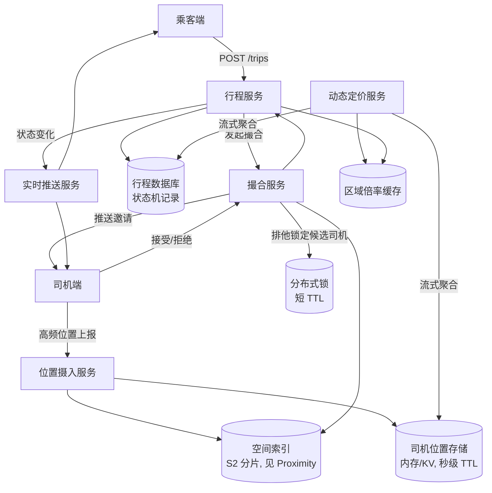

# 设计题解：网约车（Ride Hailing，Uber）

## 题目与范围

面试官通常这样开场："设计一个类似 Uber 的网约车系统：乘客发起叫车请求，系统找到一个
附近的司机并撮合成交，司机接单后按状态推进行程直到完成。" 这句话表面上和
[[solution-proximity|邻近搜索]]共享同一个子问题——"找到附近的对象"——但这道题真正的
难点完全不同：邻近搜索里的商户几乎不动、几乎不写；这里**司机位置每几秒钟写一次，撮合
必须在秒级完成，而且同一个司机在同一时刻绝不能被撮合给两个乘客**。空间索引的选型两道
题可以共用同一套结论（见 [[solution-proximity|Proximity]]），本题解不重复推导，把全部
篇幅放在邻近搜索题目里不存在的三件事上：**高频位置写入的摄入管道、强竞争下的撮合、以及
一次叫车从发起到结束的完整状态机**，外加建立在状态机之上的动态定价（surge）。

值得当场问清楚的澄清问题，以及它们各自改变的设计决策：

- **撮合失败（比如司机拒单或超时未响应）之后，系统要不要自动尝试下一个候选人？**
  决定撮合服务是一次性广播还是一个需要重试和超时管理的状态机——见「深入探讨」第 2 节。
- **同一个司机在被邀请撮合的几秒钟内，能不能同时收到另一单的邀请？** 决定要不要引入
  显式的排他锁，还是可以靠乐观并发检测事后处理——见「深入探讨」第 2 节，这是本题除了
  空间索引之外最容易被面试候选人忽略的正确性问题。
- **动态定价要不要实时反映到还没接单的乘客的报价上？** 决定定价是查询时计算还是提前
  按区域预计算好、查询时直接读——见「深入探讨」第 4 节。
- **要不要处理司机端和乘客端网络中断、App 崩溃这类异常路径？** 决定行程状态机要不要
  为"卡在某个中间态"设计显式的超时兜底，而不只是设计"正常路径"的状态转移。
- **要不要支持多种车型/拼车？** 本题解假设单一车型、点对点行程，不做拼车（pooling）——
  拼车会把撮合从"一对一匹配"变成"路径规划 + 组合优化"，是完全不同量级的问题。

**范围内**：司机位置的高频摄入、撮合算法与并发正确性、行程状态机、动态定价的机制。
**范围外**：空间索引结构本身的选型推导（见 [[solution-proximity|Proximity]]）、路径
规划与 ETA 计算（属于「Maps & Navigation」）、支付与账务对账、拼车与多方订单编排
（属于「Food & Grocery Delivery」一类问题）。

## 需求

**功能需求（驱动设计的 3–5 条）**

1. 司机端持续上报位置；乘客发起叫车请求时，系统能在附近候选司机中撮合出一个。
2. 撮合是排他的：同一个司机在同一时刻只能被绑定到一单行程，不能被撮合给两个乘客。
3. 一单行程要经过请求→撮合→司机接单→到达上车点→行程中→完成→支付 这几个状态，每个
   状态转移都要能被双端（乘客/司机）客户端可靠观察到。
4. 高峰时段供不应求的区域要自动上调价格（surge），抑制部分需求、激励司机进入该区域。
5. 撮合失败（司机拒单、超时未响应）要能继续尝试下一个候选人，而不是让乘客的请求直接
   落空。

**非功能需求（数字化）**

- **撮合延迟**：从乘客发起请求到确定一个司机，目标 P99 < 10 秒——这个数字比
  [[solution-proximity|邻近搜索]]的 200ms 读延迟宽松得多，因为撮合允许多轮尝试，但
  必须比"乘客愿意等待"的心理阈值短得多。
- **一致性**：撮合的排他性要求强一致——两个并发请求绝不能都撮合到同一个司机；行程状态
  机的其余状态转移可以是最终一致（比如乘客端看到"司机已到达"的通知延迟几百毫秒可以
  接受，但"司机被重复派单"不可以接受）。这正是
  [[distributed.consistency|Consistency Models]]里"不同操作可以承诺不同一致性级别"
  这条原则在真实系统里的具体体现，不是整个系统只有一个一致性等级。
- **位置新鲜度**：司机在地图上显示的位置允许落后真实位置几秒，但用于撮合决策的位置
  不能落后太久，否则会把"已经离开这片区域的司机"撮合给乘客。
- **可用性**：撮合服务目标 99.95%；行程状态查询目标 99.99%（乘客和司机在行程中随时
  可能查询当前状态，这个路径不可用会造成大量客服工单）。
- **实时下发**：司机端和乘客端都要能在几乎不轮询的前提下，秒级收到状态变化的推送——
  这是[[networking.realtime|Realtime Delivery]]的直接应用场景（长连接而不是轮询）。

## 容量估算

**流量侧（真实数据锚定 + 显式假设）**

Uber 在 2025 年第四季度的财报中披露：单日完成的行程数超过 4,000 万次，当季度月活跃
平台消费者（MAPC）2.02 亿，月活跃司机与骑手（drivers and couriers）970 万
（investor.uber.com，见「来源与延伸」）。本题解取"超过 4,000 万次/天"的下限口径作为
设计锚点，后续换算全部是**本题解的假设**：

```
日行程数（下限）        = 40,000,000
平均叫车请求 QPS        = 40,000,000 / 86400        ≈ 463
假设 峰值/均值倍数       = 3x（晚高峰在全球时区叠加后不如单一城市尖锐，取比商户搜索
                              更保守的倍数）
峰值叫车请求 QPS        = 463 × 3                    ≈ 1,389
```

1,389 QPS 的撮合请求本身不难扛——难的是**每一次撮合都要对候选司机做排他锁定**，QPS
数字决定的不是"要不要分片"，而是"排他锁的粒度必须多细，才能让 1,389 QPS 的锁竞争
不互相拖慢"，见「深入探讨」第 2 节。

**司机位置摄入侧**

```
月活司机与骑手（真实数据） = 9,700,000
假设 峰值同时在线比例      = 15%（大促/早晚高峰同时在线的司机远少于月活总数）
峰值同时在线司机数         = 9,700,000 × 15%          = 1,455,000
假设 位置上报间隔          = 4 秒（比邻近搜索里静止商户的更新频率高两个数量级，因为
                                  对象在移动且撮合决策直接依赖位置新鲜度）
峰值位置上报 QPS          = 1,455,000 / 4              ≈ 363,750
```

363,750 QPS 的位置写入比 1,389 QPS 的撮合请求高两个数量级——**这正是这道题和邻近搜索
题目最根本的量级差异**：邻近搜索里"写"是几乎不存在的背景噪音，这里"写"（位置上报）是
比"读"（叫车请求）大两个数量级的主负载。这个不对称直接决定了架构：位置摄入必须走一条
完全独立于撮合请求路径的高吞吐管道（见「高层设计」），不能让两者共享同一个同步请求-
响应路径。

**存储侧**

```
行程记录字段：trip_id(16B) + rider_id(8B) + driver_id(8B) + state(4B)
             + 四个时间戳(4×8B=32B) + 起点经纬度(16B) + 终点经纬度(16B)
             + 车费(8B) + surge 倍数(4B) + 路线引用(8B) + 其他开销(20B)
             = 140 字节/记录

日行程存储量  = 40,000,000 × 140B ≈ 5.6 GB/天
年行程存储量  ≈ 5.6GB × 365      ≈ 2.04 TB/年（行程记录本身，不含路线原始轨迹）

位置上报（原始流）：driver_id(8B) + 时间戳(8B) + lat/lon(4B+4B) = 24 字节/条
按峰值在线司机数、4 秒间隔粗略估算的日上报条数（说明：这是把峰值负载当成全天常量的
上限估算，只用来说明量级，不是真实日总量）
             ≈ 1,455,000 × (86400/4) × 50%（全天平均在线率相对峰值打五折）
             ≈ 157.1 亿条/天
原始位置流日存储量（若全部持久化）
             ≈ 157.1亿 × 24B ≈ 377 GB/天
```

**这一步的结论比数字本身重要**：原始位置流一天的数据量（约 377GB）是行程记录一天
数据量（5.6GB）的 60 多倍——**位置数据根本不应该被当成需要长期持久化的记录**，只应该
进一系统的热路径存储（TTL 很短的内存/KV 存储），只有稀疏采样（比如每 30 秒或每次状态
转移时的一个路点）才值得写进行程的持久化记录里。把两者混为一谈、用同一套存储策略处理
位置流和行程记录，是这道题里比空间索引选型更容易被忽略的容量陷阱。

## 核心实体与 API

**实体**

- `Trip`：`id, rider_id, driver_id, state, requested_at, matched_at, pickup_at,
  started_at, completed_at, pickup_loc, dropoff_loc, fare_cents, surge_multiplier`
- `DriverStatus`：`driver_id, current_loc, status(offline/online/en_route/on_trip),
  updated_at`（高频更新，独立于 `Trip` 存储，见「高层设计」）
- `MatchAttempt`：`trip_id, driver_id, offered_at, responded_at, outcome
  (accepted/declined/timed_out)`——记录每一轮撮合尝试，用于「深入探讨」第 2 节的
  排他锁和重试逻辑
- `SurgeZone`：`zone_id(H3 单元), multiplier, computed_at`

**API**

```
POST /v1/trips
  { rider_id, pickup_loc, dropoff_loc } → { trip_id, state: "matching",
    estimated_fare_range }
  幂等键：客户端生成的 Idempotency-Key，防止网络重试导致同一个乘客被创建两次
  行程；报价先给一个区间而不是精确数字，因为精确车费依赖最终撮合到的司机和实际路线。

POST /v1/trips/{id}/driver-response
  { driver_id, accept: bool } → { trip_id, state }
  只有当前被邀请的司机的响应有效；迟到的响应（撮合已经超时转给下一个候选人）返回
  409 Conflict，而不是静默成功——见「深入探讨」第 2 节的排他锁语义。

PATCH /v1/trips/{id}/state
  { event: "arrived" | "started" | "completed" } → { trip_id, state }
  只允许状态机合法的下一状态转移；非法转移（比如还没接单就标记完成）返回 409。

POST /v1/driver-location
  { driver_id, lat, lon } → 204
  高频端点，走独立的摄入管道（见「高层设计」），不经过 `Trip` 相关的数据库事务。

GET /v1/trips/{id}
  → { trip_id, state, driver_loc?, eta?, fare_cents? }
  乘客/司机端轮询兜底用；正常路径走长连接推送（见「深入探讨」第 3 节）。
```

**明确不做的**：不在 API 层面暴露撮合算法内部用的空间索引单元 ID；不做拼车相关的
多乘客/多路点接口；车费的精确路线计算（依赖地图服务）不在这个 API 的职责内，只返回
一个区间估计。

## 高层设计



**位置摄入路径**：司机端高频（约 4 秒一次）上报位置，直接写入一个独立的、秒级 TTL 的
内存/KV 存储，同时更新空间索引里该司机所属的单元（S2 或 H3，选型逻辑与
[[solution-proximity|Proximity]]共享，本题解直接复用其结论：分层单元索引比朴素 geohash
更适合"按区域分片 + 边界查询便宜"这个需求）。这条路径**完全不经过行程数据库**——363,750
QPS 的写入如果打到一个需要强一致事务保证的关系型数据库，会立刻成为整个系统的瓶颈，而
位置数据本身的价值随时间迅速衰减，用不上事务保证。

**撮合路径**：乘客发起请求 → 行程服务在行程数据库里创建一条 `matching` 状态的记录（这
一步需要事务保证，绝不能丢）→ 撮合服务查询空间索引得到候选司机列表 → 按距离/评分排序，
对排名第一的候选司机尝试排他锁定（见「深入探讨」第 2 节）→ 通过实时推送服务把邀请发给
该司机 → 司机响应（接受/拒绝/超时）→ 接受则行程状态机推进到 `accepted`，拒绝或超时则
释放锁定、尝试下一个候选人。

**行程状态查询路径**：正常情况下双端都保持一条长连接，状态变化由行程服务主动推送
（[[networking.realtime|Realtime Delivery]]），而不是客户端轮询；`GET /trips/{id}`
只作为长连接断开时的兜底。

**动态定价路径**：与撮合请求路径完全解耦，是一条独立的流式聚合管道，持续消费位置流
和行程流，按区域（H3 单元）计算供需比，写入一个乘客端和撮合服务都能快速读取的倍率
缓存——见「深入探讨」第 4 节展开这个选择的原因。

## 深入探讨

### 高频位置摄入：为什么这是这道题独有的负载，而不是邻近搜索的简单升级

「容量估算」算出峰值位置上报 QPS 约 363,750，比撮合请求的峰值 QPS 高两个数量级。这个
差异不是"数字更大"这么简单，它改变了整条摄入路径该用什么存储和保证级别：

- **不能用支持事务的关系型数据库承接原始写入**：位置更新没有"发生了就不能丢"的语义
  ——丢一次 4 秒后的下一次更新自然覆盖，事务保证在这里买不到任何东西，却要为每次写入
  付出锁和日志的代价。摄入路径应该走一个只做"覆盖式写入"的存储（内存 KV，键是
  `driver_id`），不需要历史版本、不需要事务。
- **摄入速率和空间索引的更新速率必须解耦**：司机换单元格（比如穿过一个 S2 边界）时才
  需要更新空间索引，绝大多数位置更新只是同一个单元格内部的坐标微调，不触发索引结构
  本身的变化——如果每次位置上报都触发一次索引更新操作，索引的写放大会比实际需要的高
  一到两个数量级。
- **和邻近搜索的本质区别**：[[solution-proximity|邻近搜索]]里"写"（商户信息变更）是
  背景噪音，可以用分钟级批量重建 + 双缓冲切换来处理；这里"写"（位置上报）本身就是
  主负载，批量重建的思路完全不适用，索引必须支持真正的增量原地更新，这也是为什么两道
  题在"移动对象"这个子问题上会分别选出不同的更新策略（本题解直接复用
  [[solution-proximity|Proximity]]"附近好友"一节的 TTL + 增量更新结论，不重新推导）。

### 撮合下的强竞争：为什么必须显式加锁，而不是靠乐观重试兜底

这是本题除了位置摄入之外最容易在候选人回答里被轻描淡写带过的正确性问题：**同一个司机
在几乎同一时刻，完全可能被两个不同的撮合请求同时选中**——两个乘客在同一片区域几乎同时
叫车，撮合服务查询空间索引后，两次查询都把这个司机排进候选列表的第一位，这不是极端
情况，在密度不高的时段反而更容易发生（候选池本身就小）。

**为什么乐观并发（先各自撮合，最后用版本号冲突检测）在这里不够好**：乐观并发的前提是
"冲突很少见，检测到了重试代价可以接受"。但这里的代价不对称——如果两个撮合流程都先把
"邀请已发给司机"这件事推送出去，司机端会收到两条互相矛盾的邀请，用户能直接感知到这个
错误，而不是一个可以静默重试掩盖的内部状态。

**这道题的做法是显式的短 TTL 分布式锁**：撮合服务选定候选司机后，先尝试对
`driver_id` 加一把 TTL 很短（几秒，覆盖司机响应邀请所需的最长时间）的排他锁，加锁
成功才发邀请；加锁失败（说明这个司机已经被另一个撮合流程锁住）直接跳到候选列表的下
一位，不等待、不重试同一个司机。TTL 短是关键——锁不依赖显式释放来保证系统不会卡死：
司机响应超时或客户端崩溃，锁最多在 TTL 后自动过期，下一个撮合请求才能重新拿到这个
司机，这比"依赖一个可能永远不会到达的显式释放信号"可靠得多。`MatchAttempt` 记录这一
轮撮合的结果，`driver-response` 接口对迟到的响应返回 409（这个候选人已经不再是当前
锁的持有者），而不是接受一个可能造成重复绑定的迟到接受。

### 实时状态下发：长连接为什么在这里比在邻近搜索里重要得多

[[solution-proximity|邻近搜索]]里"位置新鲜度"只影响一次性的查询结果，轮询完全够用；
这道题里乘客和司机都要在行程进行中**持续**观察对方位置和状态变化，轮询要么频率不够
（体验差、司机图标一卡一卡移动），要么频率足够但把请求量再乘上一个常数，直接重新制造
出「容量估算」里已经很紧张的负载问题。

[[networking.realtime|Realtime Delivery]]里讨论的三种方案在这道题里的取舍：长轮询
（long polling）每次响应后都要重新建立连接，在司机位置这种持续高频更新的场景下，
重连开销本身就会成为新的负载来源；Server-Sent Events（SSE）是单向的，够用于"乘客
被动接收司机位置更新"，但司机端需要双向通信（响应邀请、上报位置），单向协议要么
退化成"SSE 收 + 独立 HTTP 请求发"两条通道，要么直接选支持双向的方案；这道题选
WebSocket，因为司机端天然需要双向，统一用一种连接协议也简化了实时推送服务本身的
实现——不需要为乘客端和司机端维护两套不同的连接管理逻辑。代价是 WebSocket 连接本身是
有状态的，实时推送服务的水平扩展要按连接做一致性哈希路由，断线重连要处理"重连后从哪
个状态开始补发"这个问题，这也是为什么 `GET /trips/{id}` 兜底接口必须存在——断线期间
错过的推送，重连后靠一次主动拉取补齐，而不是假设推送不会丢。

### 动态定价：为什么按区域预计算而不是按请求实时计算

Uber 官方工程博客披露，真实的动态定价管道是一条流式管道：从 Kafka 摄入行程和供需数据，
用 Flink 做流式聚合计算每个六边形（H3 单元）区域的价格倍率，写入一个供查询快速读取的
键值存储（Uber 工程博客，见「来源与延伸」）；H3 本身把地球切成 122 个基础单元、16 级
分辨率，每细一级面积约为上一级的 1/7，第 8 级平均单元面积约 0.737 平方公里
（h3geo.org，见「来源与延伸」）——这个粒度大致对应一个街区到几个街区的范围，足够细到
能区分"这条街供需紧张、隔壁街正常"，又不会细到让每个单元的样本量小到统计不稳定。

**为什么不在每次叫车请求时才实时计算供需比**：供需比的计算需要聚合这个区域最近一段
时间窗口内的司机位置和未完成订单数，如果每次请求都重新做这次聚合，1,389 QPS 的峰值
请求会转化成 1,389 QPS 的聚合计算，而这个聚合结果在几秒钟的时间尺度上根本不会有明显
变化——绝大多数计算都在重复上一次请求的答案。把计算和查询解耦，用流式管道持续更新
一份"区域→倍率"的缓存，查询时只是一次哈希表读取，是把"这个信息变化很慢、但查询很
频繁"的场景转成读优化的标准手法，和[[solution-proximity|邻近搜索]]里商户索引"写少
读多、批量重建"的道理同源，只是这里的"批量重建"换成了持续运行的流式计算。

**为什么用六边形而不是矩形网格做定价区域**：这是
[[solution-proximity|Proximity]]"S2 与 H3"一节里"六边形到所有邻居的中心距离相等"这
个性质第一次在本题解里真正决定性的地方——矩形网格里对角相邻的单元比边相邻的单元距离
更远，用矩形网格计算"这个区域和周边区域的供需梯度"会带有一个和网格方向绑定的系统性
偏差；六边形网格的所有邻居距离一致，梯度计算不需要额外修正这个偏差，这正是 Uber 选择
六边形而不是矩形作为定价区域基本单元的几何原因。

## 瓶颈、故障与演进

**撮合服务热点**：机场、体育馆散场这类瞬时高需求区域，短时间内叫车请求集中在一个很小
的空间范围内，候选司机池却增长得慢得多（司机需要时间开车过去），撮合服务在这类区域会
出现"候选列表频繁为空、需要跨单元扩大搜索半径"的情况——这不是撮合服务本身的性能问题，
扩大搜索半径的逻辑必须存在，且要能感知"当前单元候选枯竭"这个信号，而不是死等一个不会
出现的近距离候选人。

**位置摄入存储不可用**：撮合服务查询空间索引时如果拿不到实时位置，不能整体拒绝撮合
请求——正确的降级是退回上一次已知位置（容忍新鲜度进一步下降），撮合仍然发生，只是
候选司机的实际位置可能已经有一些漂移，比完全不能叫车好得多；这和
[[solution-proximity|邻近搜索]]里索引重建失败时"回退到旧快照而不是整体不可用"是同一
个降级原则。

**分布式锁存储不可用**：如果锁存储整体故障，退回到"无锁"直接撮合会重新引入司机重复
绑定的风险，这里没有安全的降级——正确做法是撮合服务本身对这一小段时间内的撮合请求
排队等待锁存储恢复，宁可撮合延迟变长，也不能让排他性这个正确性保证消失。

**行程状态机卡在中间态**：司机 App 崩溃或网络中断，行程可能永远停在 `accepted` 状态
不再推进——这需要一个显式的超时兜底：状态机的每个"等待对方动作"的状态都要配一个
超时，超时后自动转移到一个明确的失败/重试状态（比如重新触发撮合、或提示乘客联系
客服），而不是让行程无限期悬挂在一个没人会再更新的状态里。

**10 倍演进**（日行程数涨到 4 亿）：位置摄入 QPS 相应涨到接近 360 万，单一摄入集群
撑不住，需要按地理区域分片摄入管道和空间索引——分片键直接复用 S2/H3 的分层单元 ID，
这正是[[solution-proximity|Proximity]]"10 倍演进"一节讨论的同一种分片方式，本题解
不重复展开，唯一的区别是这里分片还要考虑撮合请求和位置摄入必须路由到同一个分片，
否则撮合服务每次查询都要跨分片合并候选列表。

**100 倍演进**（全球所有主要城市同时达到当前 Uber 的密度）：动态定价的流式聚合管道
本身可能成为瓶颈——每个区域独立聚合可以水平扩展，但跨区域的"价格连续性"约束（相邻
区域倍率不能跳变太大，否则用户会在区域边界上感知到明显不公平）需要额外一层跨分片的
平滑计算，这时候动态定价从"纯粹的按区域独立聚合"演进成"局部聚合 + 全局平滑"两阶段
管道，类似[[solution-proximity|邻近搜索]]里候选生成和排序拆成两阶段的思路，但这里
拆分的是流式计算而不是查询路径。

## 面试官会追问什么

**中级**：为什么司机位置上报不直接写行程数据库？（回答要点：位置更新没有"不能丢"的
语义，事务保证买不到任何东西却要付出锁和日志的代价；位置摄入的写入量比行程记录高两
个数量级，混在一起会让整个行程数据库的写路径被位置流拖垮。）

**高级**：如果要支持"预约用车"（乘客提前几小时预定），撮合逻辑要怎么变？（回答要点：
撮合从"立即从当前在线司机里选"变成"承诺一个未来时间窗口"，需要一个独立的预约队列和
提前触发撮合的调度器，而不是让预约请求和实时请求共享同一条撮合路径——实时请求需要
秒级响应，预约请求的撮合时机本身就是可以规划的，两者的延迟目标和重试策略完全不同。）

**资深（staff）**：动态定价的倍率应该由撮合服务同步查询，还是应该在撮合请求发起之前
就已经确定？（回答要点：如果撮合过程本身会改变最终匹配到的司机、进而改变实际路线和
车费，那么在撮合完成前给乘客的只能是一个区间估计；倍率本身应该在乘客发起请求的那一刻
从缓存里读一次并锁定，而不是在撮合的每一轮候选尝试之间反复重新查询——否则乘客可能会
因为撮合多试了几个候选人、恰好跨过了缓存的下一次刷新窗口，看到报价在等待过程中无法
解释地变化，这是一个纯粹的产品体验问题，但根源是把定价查询放在了撮合循环内部而不是
循环外部一次性锁定。）

## 常见错误

- **把位置摄入和撮合请求放在同一条数据库事务路径上**：位置更新的量级比撮合请求高
  两个数量级，混在一起会让整个系统的瓶颈变成"数据库能不能扛住位置写入"，而不是撮合
  逻辑本身。
- **用乐观并发处理撮合的排他性**：候选人容易假设"冲突很少见，检测到了重试就行"，但
  撮合的代价不对称——一旦邀请已经推给司机，冲突就已经变成用户能感知的错误，必须在
  推送邀请之前就用显式短 TTL 锁把候选人锁定，而不是事后检测冲突。
- **忽略行程状态机里"等待对方动作"的状态缺少超时兜底**：只设计正常路径的状态转移，
  没有为司机/乘客 App 崩溃、网络中断这类异常路径设计显式超时，导致行程可能无限期卡在
  中间态。
- **每次撮合请求都实时计算动态定价倍率**：供需比在秒级时间尺度上变化很慢，如果每次
  请求都重新聚合，1,389 QPS 的撮合请求会转化成同样量级的聚合计算负载，而这个计算在
  绝大多数请求之间的结果并没有变化。
- **用矩形网格计算供需梯度**：矩形网格对角相邻和边相邻的单元距离不同，用它计算"这个
  区域和周边的供需差异"会带有一个和网格朝向绑定的系统性偏差，六边形网格没有这个问题。

## 五分钟讲法

The core tension in this design is that driver location updates arrive at roughly two orders
of magnitude higher throughput than ride requests, so I'd split the system into a
high-throughput location ingestion path that writes straight into a short-TTL store with no
transactional guarantees, and a much lower-throughput matching path that does need strong
correctness guarantees. The hardest part isn't finding nearby drivers — that reuses the same
spatial-index reasoning as any proximity search — it's that two concurrent ride requests can
legitimately pick the same driver as their top candidate, so I'd use a short-TTL exclusive
lock on the driver before sending an invitation, falling through to the next candidate if the
lock is already held, rather than relying on optimistic conflict detection after the fact. The
trip itself is a state machine, and every state that waits on the other side's action needs an
explicit timeout, or a crashed app leaves a trip stuck forever. Both riders and drivers need a
persistent connection for near-real-time updates rather than polling, with a REST endpoint as
a fallback for reconnects. Surge pricing is a separate streaming pipeline that aggregates
supply and demand per geographic cell on a Kafka-to-Flink pipeline and writes a
region-to-multiplier cache, because recomputing it inside every matching request would just
repeat the same expensive aggregation for results that barely change over a few seconds. At
ten times the scale, both the ingestion pipeline and the spatial index shard geographically,
using the same hierarchical cell IDs as the shard key so matching and ingestion route to the
same shard.

## 来源与延伸

- https://investor.uber.com/news-events/news/press-release-details/2026/Uber-Announces-Results-for-Fourth-Quarter-and-Full-Year-2025/default.aspx
  — Uber 官方投资者关系页面披露的 2025 年第四季度财报，本题解「容量估算」直接引用了
  "单日完成行程数超过 4,000 万次"、"月活跃平台消费者 2.02 亿"、"月活跃司机与骑手
  970 万"这几个数字作为容量估算的真实锚点；与本题解不同的地方在于：财报本身不涉及
  任何工程架构，本题解把这些商业指标换算成了位置摄入 QPS、撮合请求 QPS 和存储量的
  具体架构结论。
- http://highscalability.com/blog/2015/9/14/how-uber-scales-their-real-time-market-platform.html
  — 对 Uber 2015 年一场工程分享的整理，披露了 DISCO 撮合系统把供给和需求拆成独立
  服务、用 Google S2 第 12 级（单元面积 3.31–6.38 平方公里）做地理分片键、司机每
  4 秒上报一次位置等具体架构事实。本题解把它作为"历史上报道过的架构"引用，而不是
  当作 Uber 当前生产架构的权威描述——与本题解不同的地方在于：本题解独立推导了在
  当前披露的司机规模下，同样的 4 秒上报间隔会产生多大的摄入 QPS，原文没有给出这个
  换算。
- https://www.uber.com/gh/en/blog/uber-dynamic-pricing/ — Uber 官方面向用户的动态
  定价说明页面，确认了"路线时长、交通状况和实时供需比"是定价的输入因素、以及周五
  周六晚高峰这类典型触发场景。与本题解不同的地方在于：本题解补充了"为什么定价管道是
  流式预计算而不是按请求实时计算"这一架构层面的论证，原文只面向消费者解释定价现象
  本身，不涉及任何工程实现。
- https://h3geo.org/docs/core-library/restable — H3 官方分辨率表，本题解引用了第 8
  级单元的平均面积（约 0.737 平方公里）作为动态定价区域粒度的具体参照；这份表格和
  [[solution-proximity|Proximity]]引用的是同一份原始数据源，但本题解摘取了不同的
  分辨率级别，服务于"定价区域大小"这个不同的设计问题。
- https://www.hellointerview.com/learn/system-design/problem-breakdowns/uber — Hello
  Interview 对这道题的深入拆解，给出了撮合并发正确性（用短 TTL 分布式锁防止同一
  司机被重复绑定）、Kafka 排队削峰、以及用 Temporal/Step Functions 这类持久化执行
  框架处理超时重试的思路。本题解在锁机制的核心判断上与它一致，但用真实披露的 Uber
  规模数据重新推导了摄入 QPS 和撮合 QPS 的具体数字，而不是采用一个未说明来源的
  "10 万并发请求"规模假设。
- https://www.karanpratapsingh.com/courses/system-design/uber — Karan Pratap Singh
  的系统设计课程对这道题的拆解，给出了微服务拆分（客户、司机、撮合、行程、支付、
  通知）和 gRPC 优先于 REST 的服务间通信建议。与本题解不同的地方在于：本题解没有
  展开服务间通信协议的选型（不是这道题最容易出错的地方），而是把篇幅集中在撮合并发
  正确性和位置摄入的负载不对称上，这两点在该课程里只是一带而过。
