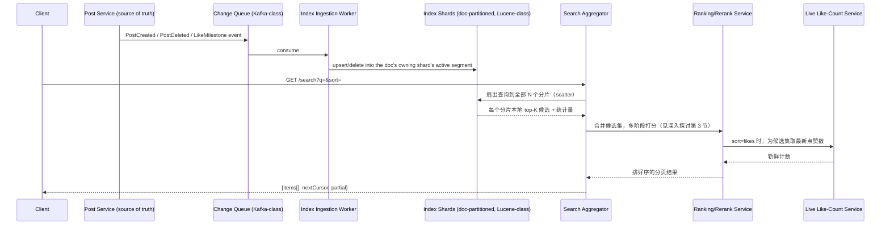

# 设计题解：搜索引擎与站内内容搜索（Search Engine & Post Search）

## 题目与范围

面试官通常会用两种口径之一开场："设计一个通用网页搜索引擎（像 Google）"，或者"设计一个
社交网络内的帖子搜索功能（像 Facebook 的站内搜索），用户可以按关键词搜帖子，并按相关性、
发布时间或点赞数排序"。这两个题面共享同一个核心引擎——**倒排索引（inverted index）的
构建、分片、近实时更新与并发查询服务**——差异主要在内容的来源和排序信号上：网页是被
爬虫抓取来的（抓取本身属于 [[solution-web-crawler|Web Crawler]] 的范围，这里只处理"页面
已经到手之后怎么建索引、怎么查"），排序依赖链接结构和内容质量；站内帖子是应用自己写入的
（发帖、点赞是已有写路径的一部分），排序更依赖新鲜度和互动信号，并且经常需要"按相关性 /
按时间 / 按点赞数"三种排序模式互相切换。本题解以后者（站内帖子搜索）为主线给出完整的容量
与深入设计，在高层设计和深入探讨里穿插通用网页搜索在规模和分片策略上的差异。

值得当场问清楚的澄清问题，以及它们各自改变的设计决策：

- **内容来源是应用内写入还是外部抓取？** 决定索引的"入口"是内部事件流（发帖/点赞的变更
  事件）还是一条独立的抓取管道；本题按前者设计，后者见 [[solution-web-crawler]]。
- **排序只要相关性，还是要支持"按时间 / 按点赞数"显式切换？** 决定是否需要在倒排索引之外
  再维护按其他维度排序的辅助结构（见「深入探讨」第 4 节）。
- **新内容多久必须可搜到？** 决定近实时索引管道的延迟预算（见「深入探讨」第 2 节）。
- **要不要支持多词组合查询（AND / 短语）？** 决定倒排索引是否需要位置信息（positional
  index）以支持短语匹配，以及查询时的候选集求交（intersection）成本。
- **搜索结果要不要个性化？** 不做——本题假设结果对所有用户一致，个性化排序信号属于更大的
  推荐系统范畴，不在本题范围内。

**范围内**：倒排索引的构建与分片策略、查询扇出（fan-out）与长尾延迟、近实时索引（分段与
合并）、多阶段排序、按新鲜度/点赞数排序在不断变化的语料上如何保持正确。**范围外**：网页
抓取本身（见 [[solution-web-crawler]]）、拼写纠错与查询自动补全（见 typeahead 一题）、
个性化排序、广告插入、跨语言分词的语言学细节。

## 需求

**功能需求（驱动设计的 3–5 条）**

1. 用户输入关键词，系统返回包含这些词（或其组合）的帖子/文档列表。
2. 新发布的内容在有限延迟内变得可被搜到。
3. 结果默认按相关性排序，用户可以显式切换为按发布时间倒序或按点赞数倒序。
4. 支持翻页浏览结果，且在语料持续变化（新帖不断加入、点赞数不断变化）时分页保持稳定。
5. 已删除的内容不应再出现在搜索结果里。

**非功能需求（数字化）**

- **查询延迟**：`GET /search` 的 P99 < 300ms——这是用户交互式操作，比信息流的被动刷新对
  延迟更敏感，任何单次查询都不能因为等待某个慢分片而整体拖垮。
- **新鲜度**：普通帖子发布到可被搜到，目标 P99 < 10 秒；这个数字不是拍脑袋定的，是「深入
  探讨」第 2 节里给近实时索引管道各环节分配延迟预算的直接输入。
- **可用性**：读路径（查询）99.95%；写路径（索引更新）99.9%，短暂积压可以后补。
- **一致性**：索引是源数据的最终一致衍生视图，容忍索引落后源数据最多与新鲜度目标同一量级
  （10 秒级），但用户查看自己刚发的帖子必须能立刻看到（读己所写，见「深入探讨」第 3 节）。

## 容量估算

**基础假设**（本设计的假设，不代表任何真实公司的数字）：日活用户（DAU）5 亿；5% 的日活
每天至少发一条帖子，人均 1.3 条；8% 的日活每天至少发起一次站内搜索，人均 2.5 次查询；
每条帖子平均获得 8 个点赞。

```
posts/day = 5×10^8 × 0.05 × 1.3 = 32,500,000
write QPS(avg) = 32,500,000 / 86,400 ≈ 376.2 ，peak(×4) ≈ 1,504.6

likes/day = 32,500,000 × 8 = 260,000,000
like QPS(avg) ≈ 3,009.3 ，peak(×4) ≈ 12,037

queries/day = 5×10^8 × 0.08 × 2.5 = 100,000,000
search QPS(avg) ≈ 1,157.4 ，peak(×5，查询比发帖更突发) ≈ 5,787
```

**索引存储**：每条帖子平均 18 个可索引词项（term），每个倒排表条目（postId + 词频/位置
压缩后）约 12 字节：

```
bytes/post(仅倒排表) = 18 × 12 = 216 B
索引增长 = 32,500,000 × 216 = 7.02×10^9 B/天 ≈ 7.02 GB/天
5 年可搜索窗口的总倒排表大小 ≈ 7.02GB × 365 × 5 ≈ 12.81 TB（单份）
三副本 ≈ 38.4 TB
```

**这个 12.81TB 是第一个决定架构的数字**：如果单个分片节点合理承载约 400GB 索引（留出
段合并所需的磁盘余量），需要 `12.81TB / 400GB ≈ 32` 个逻辑分片才能装下 5 年语料——这个
分片数直接决定了「深入探讨」第 1 节里查询扇出宽度的量级。作为对照，如果把同一套架构套用
到通用网页搜索（语料假设 200 亿网页，网页文本更长，人均可索引词项约 800，其余假设不变），
索引总量会膨胀到约 192TB（单份），需要约 480 个分片——**扇出宽度从 32 变成 480，不是同一
个数量级的问题**，这也是本题解为什么要把两种题面的分片数字都算出来对比，而不是只讲一种
规模。

**结论**：和信息流一题类似，这里的瓶颈不是存储字节数本身（12.81TB 用现在的硬件不算大），
而是**查询要在多少个分片之间扇出、以及扇出宽度如何被语料规模放大**——这决定了长尾延迟，
是本题解「深入探讨」第 1 节的核心数字来源。

## 核心实体与 API

**实体**

- **Document**（在站内搜索场景里就是 Post 的投影）：`id, authorId, text, createdAt,
  likeCount, status(active/deleted)`——权威数据仍然是发帖系统里的 Post，Document 是索引
  侧的投影，字段是索引和排序需要的最小集合。
- **Term**：词项本身及其倒排表的入口指针；词项到分片的映射规则见「深入探讨」第 1 节。
- **PostingEntry**：`docId, termFrequency, positions[]`——一个词项在一篇文档里的出现记录，
  是倒排表的基本单元，位置信息用于支持短语查询。
- **LikeMilestoneEvent**：`postId, likeCount`——不是每次点赞都产生的事件，只在点赞数跨越
  里程碑（见「深入探讨」第 4 节）时才产生，是索引更新管道的输入之一，而不是点赞本身的
  写路径。

**API**

```
GET  /search?q=&sort=relevance|recency|likes&cursor=&limit=
                                  → {items[], nextCursor, partial: bool}
                                  partial=true 表示有分片未在预算内响应（见「瓶颈」一节）
GET  /search/suggest?prefix=      不在本题范围内，见 typeahead 一题
```

**故意不做的**：不提供任何直接"把一篇文档写入索引"的客户端 API——索引只能通过内部的变更
事件管道（见高层设计）间接更新，杜绝了应用直接双写索引导致的漂移（呼应
[[storage.search|Search Indexes]] 里"索引不是权威数据源"的原则）；不支持模糊匹配/拼写
纠错（这是独立的语言学功能，通常和 typeahead 共享一套查询日志基础设施）；不在 API 层
暴露"跳过某个分片"这类调试参数给客户端。

## 高层设计



**写/索引路径**：Post Service 是唯一权威数据源，发帖、点赞不直接触碰索引，而是通过变更
事件（change event）异步流入 Change Queue，再由 Index Ingestion Worker 消费并写入对应
分片的活跃段（segment）。这条路径和 [[storage.search|Search Indexes]] 里"索引是衍生视图、
用 CDC 保持同步"的结论完全一致——本题解把这条通用原则具体化为：Post Service 发出的不是
数据库层面的 binlog，而是应用层定义好的领域事件（`PostCreated`/`LikeMilestone`），语义
更清晰，也更容易在事件里附带只有应用层才知道的信息（比如判断某条点赞是否跨越了里程碑）。

**查询路径**：Search Aggregator 收到查询后，向全部 N 个分片做 scatter-gather（本题采用
**按文档分片（document-partitioned）**而非按词项分片，理由见「深入探讨」第 1 节），每个
分片在本地倒排表上求交、打分，返回本地 top-K；Aggregator 合并全部分片的候选、交给 Ranking
Service 做多阶段重排（见深入探讨第 3 节），如果排序模式是"按点赞数"，还要向 Live Like-Count
Service 取候选集的最新点赞数做最终精排（见深入探讨第 4 节）。存储技术类是**倒排索引引擎
（Lucene/Elasticsearch 一类）**做分片本身，因为需要原生支持倒排表的求交、打分和近实时刷新；
**内存数据结构存储（Redis 一类）**做 Live Like-Count 的点查询，因为点赞数是一个高频更新、
低延迟点读的计数器，不适合放在搜索引擎的段结构里频繁重写。

## 深入探讨

### 按文档分片还是按词项分片：查询扇出宽度与长尾延迟

**问题**：倒排索引要分布到多台机器上，有两种正交的切法。**按文档分片**：每个分片持有一
部分文档的完整倒排表，一次查询必须问遍全部分片（因为任意分片都可能持有匹配的文档）。
**按词项分片**：每个分片只持有一部分词项的倒排表，一次查询只需要问持有查询词的那几个
分片。这两种切法的代价完全不对称，需要用真实数字算清楚。

**方案一：按词项分片**。一个 3 词查询理论上只用问最多 3 个分片——扇出窄，平均延迟低。
但词频服从幂律分布（Zipf's law）：假设词表大小 20 万，按 Zipf 分布估算，最高频词项占全部
查询词流量的份额约为 `1/H(200000) ≈ 7.8%`（`H(V)` 是调和数），而如果把 20 万个词项均匀
切成 20 万个单词项分片，每个分片"公平"应得的流量份额只有 `1/200000 = 0.0005%`——最热词项
所在的分片实际承受的流量是"公平"份额的约 **15,645 倍**。这不是可以靠加分片缓解的问题：
再切细词表，热词依然只落在它自己的那个分片上，此方案在词频高度倾斜的真实语料上会持续
产生无法消除的热点分片，且这个热点会随时间漂移（热门话题变化），运维上极难长期维稳。

**方案二（本设计采用）：按文档分片**。牺牲扇出宽度——32 个分片（站内搜索规模）或 480 个
分片（网页搜索规模）——换来**负载在分片间天然均匀**：任何一个查询、任何一个词，请求量都
均匀落在全部分片上，不存在"某个分片因为某个词太热而单点过载"的问题。代价是长尾延迟：用
`P(至少一个分片超预算) = 1-(1-p)^n` 建模（p 是单个分片响应超过延迟预算的概率，这个模型
来自 Jeff Dean 与 Luiz André Barroso《The Tail at Scale》里对扇出放大长尾的经典分析，本文
用自己的分片规模重新代入计算），取 `p=0.01`（假设）：

```
n=32（站内搜索）  → P(整体查询命中长尾) = 1-0.99^32  ≈ 27.5%
n=480（网页搜索） → P(整体查询命中长尾) = 1-0.99^480 ≈ 99.2%
```

网页搜索规模下，**几乎每一次查询都会遇到至少一个慢分片**——这正是「深入探讨」下一节要
解决的问题，而不是通过收窄扇出宽度（换回方案一）来解决，因为方案一的热点问题比长尾问题
更难运维。

### 用对冲请求（hedged request）把扇出放大的长尾摁回去

**问题**：上一节算出网页搜索规模下 99.2% 的查询会遇到至少一个慢分片，如果 Aggregator
死等全部 480 个分片返回，P99 查询延迟事实上等于"最慢那个分片的延迟"，扇出越宽这个问题
越严重，和分片数量成正比恶化，与分片总容量、机器数量无关——加机器不能修复这个问题。

**方案一：设置总超时，超时后放弃未返回的分片**。简单，但直接丢失那些分片持有的结果，
返回结果不完整（对应 API 里的 `partial: true`），且没有真正解决延迟问题，只是把"变慢"
换成了"变不准"。

**方案二（本设计采用）：对冲请求**。Aggregator 在原始请求发出后，等待一小段时间（比如
本分片集群历史 P50 延迟），如果某个分片还没有返回，就向该分片的一个独立副本发送第二次
（对冲）请求，两个请求谁先回来用谁的结果。假设对冲请求与原始请求的"慢"是相互独立事件
（简化假设），一个分片"两次请求都慢"的概率是 `p_hedge = p×p = 0.0001`，重新代入长尾公式：

```
n=480, p_hedge=0.0001 → P(整体查询命中长尾) = 1-0.9999^480 ≈ 4.7%
```

从 99.2% 降到约 4.7%，代价是额外发出的对冲请求带来的略微更高的整体资源消耗——这正是
《The Tail at Scale》论文提出的核心取舍："不追求消除延迟波动本身，而是用少量冗余请求把
波动的尾部摁下去"。本题解在原论文的定性结论之上，用自己的分片规模把降低幅度具体算了
出来。

### 多阶段排序：把昂贵的重排模型只跑在小候选集上

**问题**：一个常见两词查询（假设每个词覆盖语料的 2%）在 5 年语料（约 593 亿篇文档）里
按独立性假设求交，候选集约 `5.93×10^10 × 0.02^2 ≈ 2,372.5 万`篇——如果对这 2,372.5 万个
候选每一个都跑一次昂贵的重排模型，按平均 1,157.4 QPS 的查询量折算，相当于每秒要跑约
**274.5 亿次**模型推理，这个数量级和信息流一题里"对全部候选跑重模型"同样不可承受，而且
这里的候选集比信息流场景还大出好几个数量级。

**方案（本设计采用）：候选生成 → 轻量打分 → 重排的漏斗**。第一层是纯粹的倒排表求交，
不涉及模型，产出上千万候选；第二层用廉价的词频/位置类信号（比如经典的 BM25）把候选收窄
到约 2,000 条；第三层只对这约 2,000 条里、每个分片贡献的本地 top-K 合并后剩下的约 100
条跑重排模型。按这个漏斗折算，重排模型的调用量降到约每秒 11.57 万次——比"对全部候选跑
重模型"降低约 **237,250 倍**。这个结构和信息流一题的多阶段漏斗是同一个原理（候选集
逐层收窄、昂贵计算只碰最后一层的小候选集），但触发收窄的手段不同：信息流靠"关注关系"
天然限定候选池大小，搜索靠"倒排表求交 + 轻量打分"分两步收窄一个起点大得多的候选池。

### 在不断变化的语料上按点赞数排序：里程碑批处理与即时精排

**问题一：点赞是高频事件，不能每次点赞都触发一次排序索引更新。** 按容量估算，点赞
QPS 均值约 3,009、峰值约 12,037，如果排序索引（比如一个按点赞数排序的结构）在每次点赞
时都同步更新一次条目位置，写放大会直接和点赞事件数量 1:1 绑定，且这个写入还要维持有序
结构的插入/调整成本，代价远高于倒排索引本身的写入。

**方案（本设计采用）：里程碑批处理（milestone batching）**。只在一条帖子的点赞数跨越
2 的幂次（1, 2, 4, 8, 16, …）时才产生一次 `LikeMilestoneEvent` 去更新排序索引，而不是
每次点赞都更新。一条最终获得 10 万个赞的爆款帖子，用这种方式只需要 `⌊log2(100000)⌋+1
= 17` 次索引更新，而不是 10 万次——降低约 **5,882 倍**；一条获得 8 个赞（本设计的平均值）
的普通帖子，也只需要 4 次更新而不是 8 次，普通帖子的收益虽小，但爆款帖子（点赞集中爆发、
恰恰是排序索引压力最大的场景）收益最大，这正是这个方案划算的地方——代价随流量集中度
自适应下降。

**问题二：里程碑之间，排序索引里的点赞数是陈旧的，可能导致排序错误（一条刚过 128 赞的
帖子暂时还显示在 64 赞的位置）。** 如果直接把陈旧计数展示给用户，"按点赞数排序"这个功能
本身就不可信。

**方案（本设计采用）：过取 + 即时精排**。按 `sort=likes` 查询时，先从（可能陈旧的）排序
索引里取 top-2K 候选（K 是要展示的条数的两倍，留出重排后名次变化的余量），再向 Live
Like-Count Service（实时计数器，见高层设计）批量取这 2K 条的最新点赞数，用新鲜计数做
最终排序后再截取 top-K 返回。这样陈旧的只是"进入候选集"这一步的粗筛，展示给用户的排序
永远基于最新数据——用一次小范围的实时读取，换回排序索引省下来的绝大部分写入开销。

## 瓶颈、故障与演进

**热点与倾斜**：读侧热点是「深入探讨」第 1 节分析的词频倾斜（已经通过按文档分片规避）；
写侧热点是点赞事件对单条爆款帖子的集中冲击（已经通过里程碑批处理压低）。此外，多词查询
本身的候选集大小也会倾斜——常见词组合（比如两个高频词）产生的候选集远大于罕见词组合，
Ranking Service 需要对"轻量打分"这一层设置候选数量上限，而不是假设所有查询的候选集大小
是同一个量级。

**故障域**：

- **个别索引分片不可用**：Aggregator 在预算内收不到该分片响应，标记 `partial: true`
  返回其余分片的结果，而不是让整个查询失败——这是"多数结果好过没有结果"的取舍，牺牲
  召回率换可用性。
- **Change Queue 或 Index Ingestion Worker 不可用**：索引更新暂停，新发布内容临时不可
  搜到，但已有索引的查询完全不受影响；恢复后从上次消费位点重放积压事件，新鲜度延迟
  升高但不产生数据错误。
- **Live Like-Count Service 不可用**：`sort=likes` 退化为直接使用排序索引里的（可能陈旧
  的）点赞数，不做即时精排，体验下降（排序可能不是最新的）但功能不整体失败；`sort=
  relevance` 完全不受影响，因为它不依赖这个服务。
- **Ranking Service 不可用**：退化为只用倒排表求交 + 轻量打分（漏斗的前两层）的结果，
  跳过重排层，相关性排序质量下降但查询本身仍然可用。

**10 倍演进**：DAU 从 5 亿到 50 亿。按容量估算的线性关系，索引总量从约 12.81TB 增长到
约 128.1TB，分片数从 32 增长到约 320——仍然远低于网页搜索规模算出的 480，说明按文档
分片这个选择本身有相当的扩展空间。但当分片数进一步逼近网页搜索的量级时，词频倾斜带来的
问题会以另一种形式回来：即使按文档分片，如果某个分片恰好持有了异常多与某个热门话题相关
的文档，该分片的查询命中率（而非查询流量）也会偏高，需要在分片间做基于内容特征的再平衡，
而不是假设纯随机分片永远均匀。

**100 倍演进**：DAU 500 亿（纯粹推演），单一 Aggregator 层扇出到成百上千个分片本身成为
瓶颈——需要引入类似 Facebook Unicorn 的**分级聚合（vertical aggregator）**架构：先把
分片分组成若干"垂直集群"，每组内部先做一次本地聚合，再由顶层聚合器合并各组的结果，把
一次全量 scatter-gather 拆成两层更窄的扇出，用层级结构而不是单层更宽的扇出去吸收持续
增长的分片数。

## 面试官会追问什么

**中级（mid）**
- "为什么不直接查数据库做 `LIKE '%keyword%'`？" 全表扫描的代价和文档数成正比，倒排索引
  把"文档包含哪些词"预先算好、按词组织，查询代价从"扫全部文档"降到"查这几个词的倒排表
  再求交"。
- "分页翻到很后面会发生什么？" 深结果访问需要每个分片都计算并返回更靠前的全部结果再被
  丢弃，代价随深度和分片数同时增长——这正是 [[storage.search|Search Indexes]] 里深分页
  问题的具体体现，修复方式是基于排序字段的游标（`search_after` 一类），而不是 offset。

**高级（senior）**
- "按词项分片真的完全不能用吗？" 不是完全不能，而是在词频高度倾斜的真实语料上运维代价
  太高；对词表本身高度均匀（比如纯数字 ID 类查询）的场景，按词项分片仍然是合理选择，
  取舍应该基于实际词频分布测出来，而不是教条地二选一。
- "对冲请求会不会让系统总负载翻倍？" 不会翻倍——只有响应超过等待阈值的那一小部分请求
  才触发对冲，阈值设在历史 P50 附近时，触发对冲的比例本身就被限定在一个小数目，额外负载
  远小于总流量的 2 倍。

**参谋级（staff）**
- "词频分布本身会随时间漂移（今天的热词明天可能冷下去），按文档分片是不是就完全不用管
  倾斜了？" 按文档分片规避的是"词项路由"层面的倾斜，但内容层面的语义倾斜依然存在（见
  100 倍演进），需要持续监控分片间的查询命中率分布，而不是假设分片策略选对了就一劳永逸。
- "如果要同时支持网页搜索和站内搜索两种语料，索引要不要合并？" 不应该合并成一个索引——
  两者的写入模式、新鲜度要求、排序信号完全不同（爬虫批量写 vs. 应用实时写，链接权威度
  vs. 互动新鲜度），合并只会让两边都无法各自优化，正确做法是两套独立的分片集群，在
  产品层做联合查询时再做一次跨集群的结果混合（blending）。

## 常见错误

- 把倒排索引当成主数据库来设计，试图让它支持强一致的多文档事务——[[storage.search|Search
  Indexes]] 里已经指出索引应该被当成可重建的衍生视图，本题在这基础上进一步要求：客户端
  永远不能直接写索引，只能通过变更事件间接更新。
- 只讲"分片"两个字，答不出按文档分片和按词项分片的具体代价对比，被追问"那查询扇出宽度
  是多少"时给不出数字。
- 把"按点赞数排序"想象成排序索引永远和真实点赞数同步，忽略了高频计数器和排序结构的
  更新代价完全不是一个量级，给不出任何降低写放大的机制。
- 把长尾延迟问题简单归咎于"某台机器慢"，用加机器解决，没意识到扇出宽度本身在放大这个
  概率，且对冲请求这类"用少量冗余换尾延迟"的手段没有被考虑进设计。
- 深分页直接用 `offset`/`page` 参数，被问"翻到第 5000 页会怎样"答不上来。

## 五分钟讲法

This is a search system built around one core idea: an inverted index that maps terms to
the documents containing them, sharded and kept fresh as new content arrives. I partition
the index by document rather than by term — every shard holds a slice of the full corpus —
because term-based partitioning concentrates traffic on whichever terms are currently
popular, and with a realistic Zipfian term-frequency distribution a single hot term can
overload its shard by roughly fifteen thousand times the average share, a problem sharding
more finely never fixes. The cost of document partitioning is a wide fan-out — every query
touches every shard — which at web scale pushes the probability that at least one shard
misses its latency budget to over ninety percent. Rather than narrowing the fan-out back
down, I address that with hedged requests: reissue a slow shard's query to a redundant
replica after a short wait, which drops that miss probability by roughly twentyfold. New
content never gets written to the index directly; it flows through an asynchronous change
event pipeline from the system of record, so the index stays a rebuildable derived view.
Ranking is a narrowing funnel — inverted-index intersection produces millions of raw
candidates, a cheap term-frequency score trims that to a couple thousand, and an expensive
reranker only ever touches the last few hundred, cutting reranker calls by roughly five
orders of magnitude versus scoring everything. Sorting by like count on a corpus where likes
arrive far faster than reasonable index writes can absorb is handled by only updating the
sort index at power-of-two like-count milestones, then over-fetching twice the requested
page and re-scoring it against live counts before returning — so the sort index can be
cheap to maintain while what users see is never stale. A single unavailable shard degrades
to a partial result flag rather than failing the whole query, and at web scale a single
flat scatter-gather aggregator itself becomes the bottleneck, calling for a tiered
aggregation layer instead of one ever-wider fan-out.

## 来源与延伸

- [Hello Interview — Design Facebook Post Search](https://www.hellointerview.com/learn/system-design/problem-breakdowns/fb-post-search)
  （`no-archive`，商业备考网站）：给出了站内帖子搜索的完整需求切分（按关键词搜索、按时间/
  点赞排序）和"用 Redis 倒排索引 + 双索引（时间序 list、点赞数 sorted set）"的具体实现
  思路，也提出了"点赞更新按里程碑批处理、查询时过取再精排"的方向。本题解与它的分歧在于：
  本题解把里程碑批处理的写放大下降幅度用具体的对数公式算了出来（爆款帖子约 5,882 倍
  降低），并把分片策略的选择从"用 Redis 现成结构"延伸到了"按文档还是按词项分片"这个更
  底层、和语料规模强相关的问题，Hello Interview 的方案没有展开这一层。
- [Meta Engineering — Under the Hood: Indexing and ranking in Graph Search](https://engineering.fb.com/2013/03/14/core-infra/under-the-hood-indexing-and-ranking-in-graph-search/)：
  披露了 Facebook Unicorn 索引框架把索引切成多个"垂直（vertical）"、每个垂直内部再分片、
  由聚合器逐层合并结果的真实架构。本题解「瓶颈、故障与演进」的 100 倍演进部分采用了同一个
  分级聚合思路，用来解决单层 scatter-gather 在分片数持续增长时自身成为瓶颈的问题；原文
  没有给出量化的分片数或延迟数字，本题解的具体分片数、长尾概率都是本题解自己按容量估算
  重新算出的。
- [Elastic — Near real-time search](https://www.elastic.co/guide/en/elasticsearch/reference/current/near-real-time.html)：
  官方文档说明 Elasticsearch 默认每 1 秒做一次 refresh，缓冲的文档写入新的内存段后才对
  查询可见。本题解在「需求」一节把站内搜索的新鲜度目标定在 P99 < 10 秒，比 Elasticsearch
  默认的 1 秒刷新间隔更宽松，因为本题解的新鲜度预算还要覆盖变更事件从 Post Service 传到
  Ingestion Worker 的排队延迟，不是单纯的刷新间隔；分段与合并的具体机制见
  [[storage.search|Search Indexes]] 域内的相关卡片，本文不重复。
- [Barroso & Dean — The Tail at Scale](https://www.barroso.org/publications/TheTailAtScale.pdf)
  （*Communications of the ACM*, 2013）：提出了扇出放大长尾延迟的模型和对冲请求（hedged
  request）作为缓解手段。本题解直接使用了论文提出的"扇出放大长尾"这一结构性论点和"对冲
  请求降低尾概率"这一机制。论文自己的例子是：单台服务器只有 1% 的请求慢于 1 秒，一次请求
  扇出到 100 台时，就有 1 − 0.99¹⁰⁰ ≈ 63% 的用户请求慢于 1 秒；在一个 BigTable 基准里，
  等 10 毫秒仍未返回就发对冲请求，把 99.9 分位延迟从 1,800 毫秒降到 74 毫秒，只多发约 2%
  的请求。本题解「深入探讨」第 1、2 节用的是同一个模型，但数字按本设计自己的分片规模
  （32 和 480）和假设的 `p=0.01` 重新计算。
