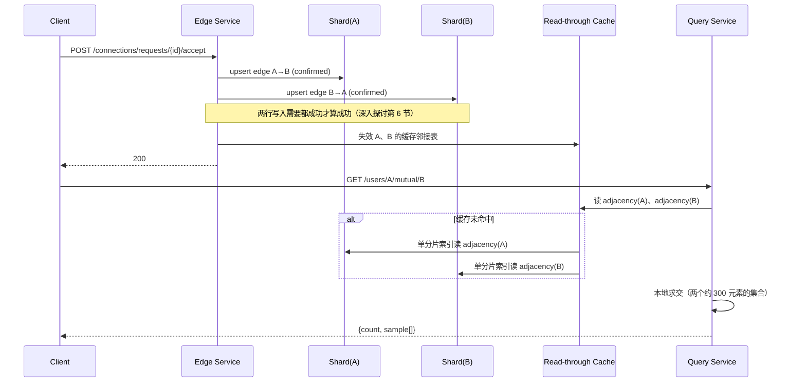

# 设计题解：社交关系图谱与好友检索（Social Graph & Friend Search）

## 题目与范围

面试官通常这样开场："设计一个存储数十亿用户之间好友关系的系统：支持查两个人是不是好友、
共同好友有多少、'可能认识的人'推荐，以及两个人之间隔了几度关系。" 这道题和
[[solution-news-feed|信息流]]、[[solution-reddit|论坛]]表面上都在"存关系、做聚合"，
但驱动这道题的核心矛盾不是写放大或排序刷新频率，而是**一条逻辑上无向的关系，物理上要以
两条独立的有向记录存在两个不同的分片上，任何跨越多个用户的查询都要在"每个用户自己的邻接表
在哪个分片上完全可预测"和"两个人的邻接表大概率不在同一个分片"之间做取舍**。这道题的读写比
比信息流还悬殊——好友关系一旦建立，会被反复读（好友列表、共同好友、推荐）很多年，但新增
关系的频率远低于对已有关系的查询频率。

值得当场问清楚的澄清问题，以及它们各自改变的设计决策：

- **"好友"是双向对等关系，还是像 Twitter 那样的单向关注？** 决定边是不是需要"双向一致"这一
  整套机制（见「深入探讨」第 6 节）——单向关注关系不存在"两个方向必须同时成立"的问题，
  信息流那道题已经处理过。本题按双向对等的"好友"关系设计，因为这是本题真正的难点所在。
- **"隔了几度"要精确算，还是给个近似值就够？** 决定要不要做全量精确最短路径（见「深入
  探讨」第 3 节）——精确全量预计算在这个规模下不可行，本题假设产品可以接受"在线、有界深度、
  找不到就返回'超过 N 度'"这种近似语义。
- **除了"好友"，还要不要支持别的边类型（关注、拉黑）？** 决定要不要做类型化边的二级索引
  （见「深入探讨」第 5 节）——本题假设要支持，因为这是真实产品的常见需求，也是这道题和
  单纯"好友图"教科书版本的区别。
- **两个用户之间的最短路径，要不要把路径本身（沿途都是谁）返回，还是只要一个数字？** 决定
  双向 BFS 要不要保留回溯指针——本题两者都支持，但只在按需查询时才付出保留路径的代价。

**范围内**：好友关系的建立/移除、直接好友查询、共同好友、好友的好友（二度关系）候选生成、
按需的最短路径/分隔度查询、类型化边的检索、读穿缓存与分片一致性。**范围外**：好友推荐的
排序模型（本题只讨论候选生成的扇出算术，不讨论用机器学习给候选打分）、基于关系图的内容
分发（那是 [[solution-news-feed]] 的问题域）、图上的内容检索/关键词搜索（见
[[solution-search-engine]]）、群组/社区结构。

## 需求

**功能需求（驱动设计的 3–5 条）**

1. 用户可以发起并接受好友请求，建立一条双向对等的好友关系；也可以移除已有的好友关系。
2. 给定一个用户，能分页查询他的直接好友列表。
3. 给定两个用户，能查询他们的共同好友（交集）。
4. 给定一个用户，能生成"好友的好友"候选集，用作"可能认识的人"这类推荐的输入（本题只做
   候选生成，不做排序）。
5. 给定两个用户，能在有界的搜索深度内查询他们之间的最短路径（"分隔度"），超出深度返回
   近似结果而不是无限期搜索。

**非功能需求（数字化）**

- **直接好友查询延迟**：P99 < 100ms——这是几乎每次打开一个人主页都会触发的读操作，在
  关键路径上。
- **共同好友/候选生成延迟**：P99 < 300ms——涉及跨分片的多个邻接表读取和本地求交，比单
  用户查询稍贵，但仍在交互式延迟预算内。
- **最短路径查询延迟**：P99 < 1s——这是一个不在每次页面加载都触发的、用户主动发起的
  查询，可以接受比其它读路径更宽松的延迟预算。
- **写延迟**：好友关系的建立/移除 P99 < 200ms。
- **可用性分层**：读路径 99.99%（几乎所有产品页面都依赖好友关系数据）；写路径 99.9%。
- **一致性**：一条好友关系物化成两行有向记录，**两行要么都存在、要么都不存在**——这是
  本题唯一一处需要跨分片强一致的地方（见「深入探讨」第 6 节）；除此之外，好友列表的读取
  允许短暂的缓存陈旧（几秒量级），不需要每次都读最新写入。

## 容量估算

**基础假设**：日活用户（DAU）1 亿，每个用户平均 300 个好友（本题解自己的假设，不是某个
平台公开披露的真实数字）。

**存储**：好友关系逻辑上无向，但为了让"查 A 的好友"和"查 B 的好友"都是单分片的 O(1) 操作，
物理上存成两行有向记录：

```
无向边数 = 1×10^8 × 300 / 2 = 1.5×10^10   （十五亿量级，符合题目"数十亿条边"的要求）
有向邻接表行数 = 1×10^8 × 300 = 3×10^10
单行 24B（srcId 8B + dstId 8B + 边类型/状态/时间戳打包 8B）
存储总量 = 3×10^10 × 24B = 7.2×10^11 B = 720 GB，三副本 ≈ 2.16 TB
```

这个数字本身不大——这是这道题和信息流、论坛两道题最大的架构性差异：**这里存的是原始边，
不是任何形式的预计算聚合**，720GB 这个量级用一个中等规模的分片集群就能装下，容量估算里
真正该讨论的不是字节数，而是"跨用户查询要touch 几个分片"这件事（见「深入探讨」第 1 节）。

**读侧（决定缓存和查询路径设计）**：假设每个日活用户平均每天浏览 10 个主页（含自己的）：

```
直接好友查询/天 = 1×10^8 × 10 = 1×10^9
avg QPS ≈ 11,574 ，peak(×3) ≈ 34,722

共同好友查询（假设 60% 的主页浏览是看别人，触发"共同好友"展示）
= 1×10^9 × 0.6 = 6×10^8
avg QPS ≈ 6,944 ，peak(×3) ≈ 20,833

"可能认识的人"候选生成（假设每天 6 次打开 App，其中 20% 的会话会刷到这个入口）
= 1×10^8 × 6 × 0.2 = 1.2×10^8
avg QPS ≈ 1,389 ，peak(×3) ≈ 4,167
```

**写侧**：假设 0.5% 的日活每天有一次加好友/删好友的动作：

```
edge 写入/天 = 1×10^8 × 0.005 = 500,000
avg QPS ≈ 5.8 ，peak(×5) ≈ 28.9
读:写 ≈ 11,574 : 5.8 ≈ 2,000 : 1
```

这个每天 50 万条的新增边，比存量的 150 亿条边小了近五个数量级——这是符合预期的，不是
矛盾：存量边是多年累积的结果，这里估算的是**稳态下每天新增**的边，两者是完全不同量纲的
数字，不能拿日增量去反推图"多少天长成现在的样子"。**2,000:1 的读写比**是这道题第一个
决定架构的数字：这么低的写量级意味着即便给边写入加一层跨分片强一致的保护（见深入探讨
第 6 节），代价也完全负担得起——这和 [[solution-reddit]] 里投票写路径必须为了几万 QPS
的量级放弃强一致、只能做最终一致，是同一类权衡在不同参数下的两个相反结论。

**最短路径查询**（假设 0.5% 的主页浏览会触发"我们是怎么认识的"这类查询）：

```
= 1×10^9 × 0.005 = 5,000,000/天
avg QPS ≈ 57.9 ，peak(×3) ≈ 173.6
```

## 核心实体与 API

**实体**

- **User**：`id`——本题只关心图结构本身，用户的其它属性不在范围内。
- **Edge**：`(srcId, dstId, edgeType[friend|follow|blocked], state[pending|confirmed],
  createdAt)`——权威数据，双向对等关系物化成两行（`(A,B)` 和 `(B,A)`），`edgeType` 支持
  同一张存储上共存多种关系（见「深入探讨」第 5 节）。
- **AdjacencyCache**：`userId -> [neighborId...]`（按 `edgeType` 再分桶）——读穿缓存里的
  物化视图，可以从 Edge 表任意时刻重建，不是权威数据。

**API**

```
POST   /connections/requests          {targetUserId, clientRequestId}
                                       幂等创建一条 state=pending 的边 → {requestId}
POST   /connections/requests/{id}/accept
                                       幂等地把两行边都置为 state=confirmed
DELETE /connections/{userId}          移除与该用户的边（两行一起移除）
GET    /users/{id}/connections?type=&cursor=&limit=
                                       分页取直接好友（或按 type 过滤的其它类型边）
GET    /users/{a}/mutual/{b}          → {count, sample[]}  共同好友
GET    /users/{a}/suggestions?limit=  → 好友的好友候选集（只做生成，不做排序）
GET    /users/{a}/path/{b}?maxDepth=  → {degree, path[]} 或 {degree: ">maxDepth"}
```

**故意不做的**：不提供一次性返回某用户"全部二度关系"的接口（候选集必须分页/限流，见深入
探讨第 2 节）；不承诺跨地域的强一致边可见性（只承诺同地域读己所写）；不支持无上限深度的
路径查询（超过 `maxDepth` 直接返回近似结果，而不是无限期搜索，见深入探讨第 3 节）。

## 高层设计



**写路径**：加好友需要**同时**在 A 的分片和 B 的分片各写一行——这是这道题里唯一需要跨
分片写协调的地方，选型上用一个轻量的跨分片事务（两阶段提交或等价的补偿机制）而不是接受
"先写一行、异步补另一行"的最终一致做法，原因是容量估算已经证明写量级只有个位数到几十
QPS，跨分片协调的开销完全负担得起，不像论坛题里投票写入那样量级太大付不起强一致的代价。
Edge 表的技术选型是**分片关系型/宽列存储**，按 `srcId` 哈希分片（见「深入探讨」第 1
节），因为查询模式几乎总是"给定一个用户，取他的邻接表"，单分片索引查询就够。

**读路径**：Query Service 优先读**读穿缓存**（内存数据结构存储，Redis 一类），未命中
才回落到 Edge 表的分片索引读——这正符合
[[caching.strategies|Write & Read Strategies]]"缓存不是权威数据源、可随时从源重建"的
原则，而这里能这样做的底气来自容量估算：整张图只有 720GB，缓存的是**原始边**而不是任何
需要重新计算的聚合，一次未命中的代价只是一次单分片点查询，不是像 [[solution-news-feed]]
的收件箱那样需要重新聚合关注列表（见「深入探讨」第 4 节）。

## 深入探讨

### 邻接存储与分区：按用户 ID 哈希，以及为什么图分区很难

**问题**：Edge 表要怎么分片？"查一个用户的直接好友"要求单分片可解析；"查两个用户的共同
好友"或"从 A 走到 B"这类跨用户查询则天然要跨越多个用户各自所在的分片——分片方案决定的
是后一类查询要 touch 多少个分片。

**方案一（本设计采用）：按 `userId` 哈希分区（[[distributed.partitioning.schemes|Hash
vs Range]]里的哈希分区）**。负载均匀可预测，"取用户 A 的邻接表"永远是单分片操作。代价是
一个用户的 300 个好友大概率分布在几十个不同的分片上，但这个代价被限定住了——**共同好友
查询只需要 touch 2 个分片**（A 所在的一个、B 所在的一个），因为要做的事情是"整取 A 的
邻接表、整取 B 的邻接表、本地求交"，而不是"对 A 的每个好友单独发一次查询"；真正会让扇出
失控的是「深入探讨」第 3 节的多跳路径搜索，不是这里的两用户查询。

**方案二：按社区/地理位置做分区（把关系紧密的用户物理上放在同一个分片）**。理想情况下能
让大多数好友关系落在同一分片内，减少跨分片查询；但这需要先解出一个"图的最小割"式的分区
问题——在十亿节点量级上，最优图分区本身是 NP 难问题，而且社交图谱持续变化（每天 50 万条
新增边），任何静态分区方案都会随着图的演化不断腐化，需要反复重新分区/迁移数据，这个持续
维护成本远超它节省下来的查询成本。`donnemartin/system-design-primer`（见「来源与延伸」）
提到"按地理位置分片，因为好友通常住得近"这个直觉，但它同样要面对这个问题：一个用户的
连接不只是地理邻近的朋友，还有大学同学、异地的家人、工作关系——这些关系天然跨越任何单一
的地理/社区划分，所谓"关系紧密的用户"在真实社交图谱里从来不是干净可分割的。

**结论**：本设计选方案一，把"跨用户查询要 touch 几个分片"这个代价显式地限定在"查询里
涉及几个不同的用户"这个可控的数字上，而不是试图靠一个会随时间腐化的静态分区方案去消除
这个代价。

### 共同好友与二度好友：扇出算术

**问题**：给定一个平均 300 个好友的用户，"好友的好友"如果朴素地展开，候选集大小是多少？

```python
naive_fof = 300 × 300 = 90,000   # 未去重、未排除已是好友的人
```

9 万这个数字看起来吓人，但**这不是要查询 9 万次**——这是「深入探讨」第一节已经说明的：
取到 A 的邻接表（1 次分片查询，约 300 条），再对这 300 个好友**批量**取各自的邻接表
（300 次并发的单分片索引查询，可以按目标所在分片分组批处理，不是 300 次串行往返），本地
去重、排除已经是 A 好友的人、排除 A 自己，得到的候选集实际大小远小于 9 万（真实社交图谱
里朋友圈高度重叠，即"三角闭合"——A 的很多朋友彼此也是朋友，去重后的唯一二度好友数通常是
这个乘积的一个零头，但本题不假设一个具体的去重比例，因为这依赖真实图的聚类系数，不是
可以脱离数据推算的数字）。API 层因此**不提供**一次性返回全部候选集的接口（见「核心实体
与 API」），因为即便去重后，这仍然是一个"取 300 个人的邻接表再求并集"这种量级的操作，
必须限流分页，而不是同步一次性算完返回。

共同好友的算术简单得多，因为只涉及两个用户，不是一个用户的全部好友：两个约 300 元素集合
的交集，`O(300+300)` 用哈希集合求交是毫秒级操作，这也是为什么它的延迟预算（P99<300ms）
比二度好友候选生成更宽松反而更快命中的原因——共同好友的成本和好友数量成正比但很小，二度
好友的成本和好友数的平方成正比，两者不是一个量级的问题。

### 最短路径与"分隔度"：双向 BFS，以及为什么不能预计算全量最短路径

**问题**：给定两个用户，他们之间隔了几层关系？朴素的单向广度优先搜索（BFS）从 A 出发，
按跳数扩展，第 `d` 跳时探索过的节点数大约是分支因子的 `d` 次方：

```python
b = 300  # 平均好友数当分支因子
depth 1: 300
depth 2: 90,000
depth 3: 27,000,000
depth 4: 8,100,000,000     # 已经超过全站 1 亿用户总数
```

第 4 跳就已经"探索"了 81 亿人次（考虑到重复访问，实际去重后不会真的碰到 81 亿个不同
节点，但对全站只有 1 亿用户的图来说，这个探索量意味着几乎要碰一遍整张图），而真实社交
图谱两个随机用户之间的平均距离并不小——Facebook 官方研究（2016 年，见「来源与延伸」）
在 15.9 亿用户的真实图上估算出平均距离约 4.57 跳（"三个半人"的间隔），说明 4 跳左右的
距离是很典型的查询场景，不是极端情况。

**方案一：从 A 单向 BFS，扩展到 B**。如上所示，第 4 跳的探索量级已经逼近全图规模，在
在线查询的延迟预算内不可行。

**方案二（本设计采用）：双向 BFS**——同时从 A 和 B 各自扩展，两个方向相遇即找到路径。
对距离为 `d` 的两个用户，两个方向各只需要扩展到 `d/2` 跳：

```python
distance 4: 单向需探索 ~8.1×10^9；双向只需 2×300^2 = 180,000   # 约 4.5 万倍的差距
distance 6: 单向 ~7.3×10^14；双向 2×300^3 = 5.4×10^7          # 差距更悬殊
```

指数的底数不变、指数减半，带来的是数量级的差距而不是常数倍的优化——这是双向 BFS 在这道
题里几乎是唯一可行选项的原因，而不是众多可选优化里的一个。

**为什么不预计算全量最短路径表**：1 亿用户的全量用户对数是 `1×10^8 × (1×10^8-1)/2 ≈
5×10^15`——即便每对只存 1 个字节也是几 PB，而且图每天有新增边、任何一条边的变化都可能
影响大量用户对之间的最短路径，维护这样一张表的更新成本比按需查询本身还要贵得多。Facebook
自己在估算"全站平均分隔度"这个单一统计量时，用的也不是精确的全量最短路径计算，而是基于
Flajolet-Martin 概率计数的近似算法（HyperANF 一类，通过 Apache Giraph 批量跑一次全图，
见「来源与延伸」）——**这印证了本设计的判断：即便是离线场景下算一个全局统计量，业界也不
用精确算法，更不用说在线场景下对任意一对用户做实时精确查询**。本题因此把"最短路径"设计
成一个有界深度（`maxDepth`）的按需双向 BFS，超出深度直接返回近似结果，而不是试图让它
精确或者预先算好。

### 读穿缓存：为什么这张图能整体放进缓存，而信息流的收件箱不能

**问题**：要不要在 Edge 表前面加一层缓存？加多大？

**方案一：只缓存"热"用户的邻接表**（类似只缓存活跃用户）。能省内存，但需要一套热度判定
和淘汰策略，且"冷"用户被查询到时仍然要回源，收益和复杂度的比例不明显。

**方案二（本设计采用）：读穿缓存（read-through cache）覆盖全图**。容量估算已经给出
底气：全图原始边只有 720GB（三副本 2.16TB），缓存版本（更紧凑的按邻居 ID 打包格式，
16B/条）总共约 480GB（三副本 1.44TB）——这个量级完全可以整张图常驻内存，不需要区分
冷热。**这是和 [[solution-news-feed]] 最根本的不同**：信息流的收件箱缓存存的是"给这个
用户预先算好排序的内容列表"，一次未命中意味着要重新聚合关注列表里所有人的最新帖子（一个
真正昂贵的计算）；这里缓存的是**原始边**，一次未命中只是一次单分片索引点查询，代价是
毫秒级的，不是"重新计算"级别的。TAO（Facebook 的生产图存储，见「来源与延伸」）公开披露
的 96.4% 整体缓存命中率印证了同一个道理：图查询的重复率很高（热门用户的邻接表会被很多
不同的查看者反复请求到），缓存不需要做得很精巧就能拿到高命中率。

### 类型化边的二级索引：不止是"好友"

**问题**：如果 Edge 表同时存"好友""关注""拉黑"三种边类型，"取用户 A 的全部好友"（排除
关注和拉黑）如果直接扫 `(srcId)` 索引再过滤 `edgeType`，会在类型分布不均时扫到大量不需要
的行。

**方案一：单一 `(srcId)` 索引，查询时应用层过滤 `edgeType`**。实现简单，但索引本身不能
帮忙裁剪掉不需要的类型，退化成"多读、少要"。

**方案二（本设计采用，架构上对齐 Facebook Unicorn 论文披露的做法，见「来源与延伸」）**：
按 `(edgeType, srcId)` 建二级索引，每个 `(类型, 用户)` 组合对应一份**倒排列表
（posting list）**——这本质上和 [[solution-search-engine]] 里"关键词到文档 ID 列表"的
倒排索引是同一个数据结构，只是这里的"关键词"是"某种边类型 + 某个用户"，"文档"是邻接的
另一个用户。Unicorn 论文披露的真实规模是数十亿节点、万亿级边，每天数十亿次查询，一次
简单查询（比如"点赞过某内容的人"）平均约 11ms，更复杂的组合查询延迟可达数百毫秒——本
设计不需要 Unicorn 那种通用的多阶段聚合算子集合（`Apply`、
`WeakAnd` 等，用于支持"点赞了 X 的人里我的好友有哪些"这类多跳组合查询），但它验证了
"把类型化边建模成倒排索引的词项"这个思路在生产环境里是成立的。

### 一条边两个方向的一致性：为什么这里选择跨分片强一致，而不是异步补齐

**问题**：好友关系存成两行（`A→B` 和 `B→A`），写入如果不是原子的，一次部分失败会留下
不对称的边——A 的好友列表里有 B，B 的好友列表里却没有 A。

**方案一：只同步写一个方向，另一个方向异步补齐**（发一个事件，消费者写第二行，配合一个
定期扫描"孤立单向边"的对账任务修复漏网的情况）。吞吐更高、可用性更好，是 TAO 论文披露
的真实生产系统处理跨地域复制时使用的模式（同地域读己所写、跨地域异步、允许短暂陈旧，见
「来源与延伸」），但会引入一个用户短暂看到不对称好友关系的窗口。

**方案二（本设计采用）：跨分片强一致写入（两阶段提交或等价的补偿事务）**。两行同时成功
或同时失败，绝不出现中间态。这里选它，不是因为它天然更"正确"（方案一配合对账最终也
正确），而是因为容量估算已经算出好友写入的峰值只有约 29 QPS——在这个量级下，跨分片
协调的额外延迟和复杂度完全负担得起，用强一致直接消除"暂时不对称"这类边界情况，比维护
一套对账/修复管道更简单。这个选择只在**这个写入量级**下成立：如果这张表以后要承载更
高频的边类型（比如把"点赞"也建模成一条边，参考 [[solution-reddit]] 里投票的写入量级），
就需要重新评估，转向方案一。

## 瓶颈、故障与演进

**热点与倾斜**：图上最大的倾斜来自度数极高的节点——一个公众人物/机构账号可能有远超
300 的连接数（数万到数十万），它所在分片上这一行"逻辑记录"对应的物理数据量远大于普通
用户，分页读取它的邻接表、以及它作为"共同好友"查询里一方出现时，都会比普通用户贵得多。
处理方式和 [[solution-news-feed]] 对名人账号的处理是同一个思路的变体：对这类高连接度
账号的边单独存储/分片，读取时分页而不是整取。

**故障域**：

- **读穿缓存不可用**：退化为直接查 Edge 表的分片索引——因为全图本身不大、一次未命中
  只是一次点查询，退化路径的延迟劣化是毫秒到十几毫秒级别，不是信息流那种"退化成实时
  fan-out 重建"级别的劣化（深入探讨第 4 节）。
- **某个分片不可用**：只影响邻接表落在该分片上的用户——他们自己的好友列表读写不可用，
  同时任何"以他们为一方"的共同好友/路径查询也会失败或返回部分结果；不影响其它分片上的
  用户。Facebook Unicorn 论文按"结果 ID"而不是按"查询词"分片索引，是为了在个别机器
  故障时能返回部分结果而不是彻底失败（见「来源与延伸」），这条设计哲学同样适用于这里的
  多跳查询服务。
- **最短路径查询服务不可用**：这是一个非核心的按需功能，失败直接返回不可用，不影响
  好友列表、共同好友这些更高频、更核心的读路径。

**10 倍演进**：DAU 从 1 亿到 10 亿。邻接存储涨到约 21.6 TB（三副本），读穿缓存涨到约
14.4 TB——仍然可以整图缓存，但已经接近需要重新评估"要不要只缓存活跃用户"的临界点（和
[[solution-reddit]] 里"只对头部 1% 社区做冗余复制"是同一类取舍，只是触发的规模临界点
更高，因为这里缓存的是廉价的原始边而不是排序结果）。共同好友/二度好友的批量邻接表读取
天然水平扩展（每个查询独立，互不干扰），不需要架构变化。

**100 倍演进**（纯粹推演）：DAU 100 亿，逼近 TAO 论文披露的"十亿级读/秒"这一真实量级
（见「来源与延伸」）。这时候即便是有界深度的在线双向 BFS 也可能不够快，设计会进一步向
"绝大多数分隔度查询走近似/预计算的粗粒度分桶结果（比如只回答'2 度以内 / 2-4 度 / 4 度
以上'这种粗粒度分类，而不是精确跳数），只有极少数需要精确路径的查询才走完整的在线双向
BFS"演进——这和 Facebook 自己在全站统计量上使用近似算法、而不是在任何规模下都追求精确
计算，是同一个方向上更进一步。

## 面试官会追问什么

**中级（mid）**
- "两个用户的共同好友查询，为什么不是 O(用户总数)？" 因为它只涉及两个用户各自的邻接表
  （各约 300 个），取到之后本地求交是 O(300+300)，和全站用户总数无关。
- "为什么好友列表要分页，不能一次性返回？" 因为度数分布有长尾——极少数账号的连接数远超
  平均值，不设分页会让个别请求的响应体大小和延迟失控。

**高级（senior）**
- "按 `userId` 哈希分片后，一个用户的好友分散在很多分片上，会不会让共同好友查询变得很
  贵？" 不会——贵的是"对某个用户的每一个好友单独发查询"这种操作（那是二度好友候选生成
  的量级），共同好友只 touch 参与查询的两个用户各自所在的分片，和好友分散在多少个分片上
  无关。
- "如果最短路径查询的调用量突然暴涨（比如产品推了一个'你们的关系'功能到每个主页），
  设计要怎么应对？" 这会把一个原本低频、非核心的查询变成核心路径的一部分，需要重新评估
  是否要为最短路径结果加一层缓存/预计算的近似分桶（见 100 倍演进），而不是继续假设它
  永远是稀疏调用。

**参谋级（staff）**
- "如果要把'点赞'也建模成一条边（写入量级从每天 50 万条变成 [[solution-reddit]] 里
  那种几十亿票/天），第 6 节选的跨分片强一致写入还成立吗？" 不成立——那个选择的前提是
  写入量级足够小，协调成本负担得起；写入量级涨到那个数量级后需要转向异步补齐 + 对账的
  最终一致模式，和论坛题投票计数的选择趋同，这正说明"选强一致还是最终一致"不是一次性的
  架构判断，而是随写入量级变化会翻转的判断。
- "图分区完全不做，只按用户哈希，是不是放弃了所有局部性优化的可能？" 不是完全放弃——
  可以在不做全局最优分区的前提下，对已知的强关联子图（比如同一个公司/学校批量导入的
  用户）做局部的物理共置提示，只是不追求全局最优解，因为全局最优图分区本身就是 NP 难
  问题且会随图演化持续腐化。

## 常见错误

- 把共同好友查询想象成要遍历一个用户的每一个好友去逐一核对，没意识到它只是两个邻接表的
  一次本地求交。
- 把二度好友候选生成的 `friends × friends` 乘积直接当成最终结果返回，没有去重、没有
  排除已经是好友的人、也没有意识到这是一个需要分页而不是一次性返回的量级。
- 单向 BFS 从一端出发找最短路径，答不出"为什么双向 BFS 快得多"这个问题背后具体的数量级
  差距。
- 试图预计算全量最短路径表，没有算过全量用户对的数量级（`10^8` 级用户对应
  `~5×10^15` 对）。
- 把图分区当成一次性能解决的问题，忽视了社交图谱持续变化，任何静态分区方案都会随时间
  腐化，需要持续维护成本。

## 五分钟讲法

This is a social graph design where the core tension isn't write amplification or ranking
freshness — it's that a logically undirected friendship has to live as two directed rows on
two different shards, and every query that spans more than one user has to reckon with that.
I hash-partition the edge store by user id so that fetching any single user's direct
connections is always a single-shard operation, and I deliberately don't try to solve graph
partitioning by co-locating densely connected users, because optimal graph partitioning is
NP-hard at this scale and a social graph changes daily, so any static partition would decay
immediately. Mutual friends between two people is cheap precisely because it only touches two
shards regardless of how large either person's friend list is — you fetch both adjacency lists
and intersect them locally. Friends-of-friends is a different story: the naive product of two
average friend counts is around ninety thousand candidates, which is why that endpoint has to
be paginated rather than returned in one call. Shortest path is the hardest read here — a
single-direction breadth-first search from one person explodes exponentially with distance,
touching a number of nodes close to the whole graph by the fourth hop, while a bidirectional
search meeting in the middle only needs the square root of that work, which is the difference
between infeasible and sub-second. I don't precompute all-pairs shortest paths at all — the
number of user pairs is astronomically larger than the number of edges, and even the real
research computing average degrees of separation at scale used an approximate, offline
algorithm rather than exact distances, which is exactly why this design treats shortest path
as an online, depth-bounded, best-effort query instead of something to precompute. Because
this store holds raw edges rather than a precomputed ranked view, the entire graph is cheap
enough to keep warm in a read-through cache — a cache miss just costs one indexed point read,
not a recomputation, which is the opposite situation from a personalized feed's inbox. And
because edge writes here are rare — a couple of thousand times rarer than reads — I can afford
a strongly consistent, cross-shard write for the two directions of an edge, a trade I'd
reconsider the moment this store had to carry a much higher-frequency edge type.

## 来源与延伸

- [donnemartin/system-design-primer — Design Facebook's Friend Search](https://github.com/donnemartin/system-design-primer/blob/master/solutions/system_design/social_graph/README.md)
  （MIT 协议的开源社区仓库，非商业课程）：给出了按 `PersonServer` 分片、`LookupService`
  做用户到分片映射、双向 BFS 找最短路径的基础框架，并提出了"按地理位置分片，因为朋友
  通常住得近"的直觉。本文与它的分歧在于：本文没有采用按地理位置分片，而是论证了图分区
  在数十亿边规模下的维护代价（NP 难 + 持续腐化）超过它节省的查询成本，选择了更简单的
  按用户哈希分片，并把"跨用户查询贵不贵"重新表述成"查询涉及几个不同用户"而不是"分片
  方案好不好"。
- [Bronson et al. — TAO: Facebook's Distributed Data Store for the Social Graph（USENIX
  ATC 2013）](https://www.usenix.org/conference/atc13/technical-sessions/presentation/bronson)：
  披露了 Facebook 真实图存储的对象/关联（object/association）数据模型、按 id 分片、
  leader/follower 缓存分层、跨地域异步复制、以及"十亿级读/秒、96.4% 整体缓存命中率、
  99.8% 请求是读"这些生产数字。本文「深入探讨」第 4 节用它的缓存命中率佐证"图查询重复率
  高、缓存不需要做得很精巧"，第 6 节用它披露的跨地域异步复制模式作为本设计"强一致写入"
  选择的对照组——本文的分歧在于：本文选择的写入量级（约 29 QPS 峰值）远低于 TAO 服务的
  真实规模，所以能负担得起 TAO 为了性能而放弃的强一致性。
- [Curtiss et al. — Unicorn: A System for Searching the Social Graph（VLDB 2013）](https://www.vldb.org/pvldb/vol6/p1150-curtiss.pdf)：
  把社交图谱建模成按边类型和源节点 ID 组织的倒排索引，按结果 ID（而不是按查询词）分片
  以在个别机器故障时优先返回部分结果，披露了数十亿节点、万亿级边、每天数十亿次查询、
  简单查询平均约 11ms 延迟的真实规模。本文「深入探讨」第 5 节直接采用了它"类型化边即倒排索引词项"
  的建模方式，但没有实现它完整的多阶段聚合算子集合（`Apply`、`WeakAnd` 等），因为本题
  范围内的查询（共同好友、二度好友候选、最短路径）不需要那种通用的组合查询能力。
- [Twitter — FlockDB](https://github.com/twitter-archive/flockdb)（Twitter 开源的图
  存储，非商业课程）：同样把边存成正向和反向两行，披露了 2010 年 4 月的真实生产数字
  （130 亿条边、峰值 2 万写/秒、10 万读/秒）。本文与它的区别在于：FlockDB 明确不支持
  多跳遍历（文档里写明这是非目标），而多跳的最短路径查询正是本题「深入探讨」第 3 节的
  核心难点，本文必须在 FlockDB 划定的范围之外单独设计这一部分。
- [Facebook Research — Three and a Half Degrees of Separation](https://research.facebook.com/blog/2016/2/three-and-a-half-degrees-of-separation/)：
  在 15.9 亿用户的真实图上，用基于 Flajolet-Martin 的近似算法（而不是精确的全量最短路径
  计算）估算出平均分隔度约 4.57 跳。本文「深入探讨」第 3 节直接引用这个方法论作为"即便
  是离线的全站统计量，业界也不追求精确计算"的证据，支撑本设计把在线最短路径查询设计成
  有界深度、近似语义的理由。
