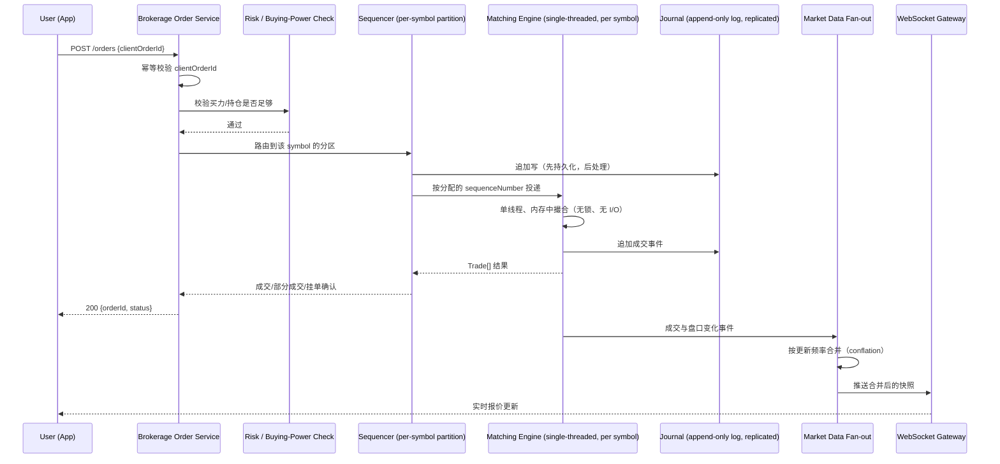

# 设计题解：股票交易所与经纪商（Stock Exchange & Trading，Robinhood）

## 题目与范围

面试官通常这样开场："设计一个股票交易系统——用户能查看实时报价、下单买卖股票，订单
最终按价格和时间被撮合成交。" 这句话背后其实压着两道完全不同的题：**交易所本身**（如何
对同一支股票的所有订单做出一个所有人都认的撮合结果）和**它前面的零售经纪商**（如何让几百
万普通用户安全、实时地接触到这个交易所）。这两层的正确性模型截然相反——交易所那一侧，
"错误"意味着两笔本该成交的订单没有以唯一确定的顺序成交，是**确定性（determinism）**问题；
经纪商这一侧，"错误"意味着一笔钱或一股股票凭空出现或消失，是**账本正确性（ledger
correctness）**问题。分不清这两层，是这道题最容易踩的坑。

值得当场问清楚的澄清问题，以及它们各自改变的设计决策：

- **我是在设计交易所本身，还是交易所前面的经纪商，还是两者都要？** 决定整道题的重心。本文
  两者都覆盖，因为这是市面上七个独立来源共同教的完整版本，也是面试官默认的期待——多数候选
  人只会设计经纪商，答不出撮合引擎内部，这恰恰是拉开差距的地方。
- **撮合要不要支持多种订单类型（市价单、限价单、止损单）？** 决定订单状态机的复杂度；本题
  支持市价单（market）和限价单（limit），止损单（stop）作为限价单在触发价被突破时自动转化
  为限价单处理，不引入新的核心机制。
- **一次下单允许跨越多少个价位成交？** 决定撮合算法是否需要处理部分成交（partial fill）——
  本题必须支持，因为限价单在流动性不足时天然会分批成交。
- **要不要做做市商/流动性提供的特殊路径？** 不做——把所有参与者（包括做市商）都当作普通的
  限价单提交者，不单独建模做市商的报价义务，这是真实交易所的简化但不影响本题的核心难点。
- **经纪商是自己撮合，还是把订单路由到外部交易所（就像 Robinhood 的真实模式）？** 决定经
  纪商是"订单路由器"还是"交易所前台"——本题采用路由模式：经纪商自己不撮合，把订单转发给
  第 1 部分设计的交易所（或多个外部交易所），这也是本题标题里"Robinhood"的含义所在。

**范围内**：单交易所内单个撮合引擎的确定性顺序、订单簿数据结构、序列化（sequencing）与
复制、行情（market data）分发、经纪商的订单路由、实时报价推送、买力（buying power）风控、
幂等下单。**范围外**：跨交易所的智能路由算法（smart order routing 的具体择优逻辑）、期权
与衍生品、做市商报价义务、监管清算与结算（T+1 清算流程本身）、反洗钱与合规审查、K 线与
历史行情的存储引擎设计（属于时序数据存储的独立问题）。

## 需求

**功能需求（驱动设计的 5 条）**

1. 用户可以对任意上市股票提交市价单或限价单（买/卖），可以撤单（未成交部分）。
2. 同一支股票的所有订单按照**价格优先、价格相同则时间优先**（price-time priority）的规则
   撮合成交，且对所有参与者产生完全一致、可重放的成交结果。
3. 用户能看到该股票近实时的最新成交价和五档买卖盘口（level-2 摘要）。
4. 经纪商在把订单转发给交易所之前，必须校验用户的买力（现金或可用股票余额）是否足够，
   且不能出现"扣了钱但订单丢了"或者"订单成交了但没扣钱"的情况。
5. 客户端网络重试不能导致同一笔意图被重复提交为两笔独立订单。

**非功能需求（数字化）**

- **确定性优先于速度**：撮合结果必须是一个可重放、单一权威顺序下的确定性函数——这是比延迟
  更硬的约束，任何优化都不能牺牲它。
- **撮合延迟**：单笔订单从进入撮合引擎入口队列到产生成交事件，目标在**个位数到两位数微秒
  （microsecond）级**——这不是经纪商 APP 的响应时间指标，是撮合引擎内部处理时延，见「容量
  估算」。
- **报价新鲜度**：经纪商 APP 里展示的报价，从交易所产生成交到用户设备上刷新，目标 P99 < 1
  秒（这是零售场景的体验目标，不是专业交易终端的目标）；盘中报价必须满足监管要求的
  **全美最优买卖价（National Best Bid or Offer，NBBO）**，即成交价不能劣于所有交易所
  当前最优买卖价中的最优者，这是经纪商侧撮合路由必须遵守的外部约束，不是本设计可以
  权衡的性能指标（见「来源与延伸」Robinhood 关于报价来源的说明）。
- **订单确认延迟**：用户点击"下单"到 APP 显示"已提交"，目标 P99 < 300ms。
- **可用性**：撮合引擎所在交易时段目标 99.99%（单一交易所在开盘时段停摆是监管事件）；
  经纪商的报价展示路径目标 99.9%，短暂降级（报价延迟几秒）比彻底不可用更能接受。
- **一致性**：账本（现金与持仓）强一致，绝不允许双花或丢失更新；行情分发允许最终一致，
  客户端可能短暂看到落后几百毫秒的报价，这是本题唯一允许"不精确"的地方。

## 容量估算

这道题的容量估算要分两层算：**交易所撮合引擎**（订单量级远小于直觉，但对倾斜和延迟极度
敏感）和**经纪商行情分发**（读写比被"一个报价对多少订阅者"这一个维度放大到极端量级，
结构上和信息流的粉丝扇出问题同源，但数字完全不同）。

**交易所侧假设**（本设计的假设，不代表任何真实交易所的实际数字）：上市股票 8,000 支；
全市场峰值订单消息速率 300,000 条/秒（开盘瞬间的极端值）。

```
peak_total_orders_per_sec = 300,000
avg_total_orders_per_sec = 300,000 / 5 ≈ 60,000   # 日内峰均比假设为 5，与信息流题解同一假设口径
```

**这个 300,000 本身不是瓶颈——瓶颈在于它如何在 8,000 支股票之间分布**。按幂律倾斜假设：
最热门 1%（80 支）股票占 40% 订单量，中部 9%（720 支）占 40%，其余 90%（7,200 支）占 20%：

```
top1%   每支股票订单速率 = 300,000×0.4 / 80   = 1,500.0 /秒
next9%  每支股票订单速率 = 300,000×0.4 / 720  =   166.67 /秒
rest90% 每支股票订单速率 = 300,000×0.2 / 7,200 =    8.33 /秒
```

**这是第一个决定架构的数字**：LMAX（一家真实的零售交易平台）公开披露其单线程业务逻辑处理
器（Business Logic Processor）在专用硬件上实测可达每秒 600 万笔订单（见「来源与延伸」）。
拿这个真实基准和上面算出的"最热门股票每秒 1,500 笔"相比：

```
headroom = 6,000,000 / 1,500 = 4,000×
```

即使是全市场最热门的股票，单线程、单核心的撮合吞吐相对于它的实际负载仍有 **4,000 倍**
的冗余空间。这个数字直接推翻了候选人最常见的直觉——"股票撮合一定要分布式并行才能扛住"——
真相恰恰相反：**每支股票的撮合计算量小到可以在单核心里轻松跑，真正的工程难点是"保证同一支
股票的所有订单只被一个地方、按一个顺序处理"，而不是"算力不够"**（见「深入探讨」第 1 节）。

**存储与复制**：撮合引擎按追加写日志（journal）记录每一条输入事件（订单、撤单）用于重放
与复制，每条消息按本设计假设取固定长度二进制编码约 40 字节（symbol id + 价格 + 数量 +
方向 + 序列号，不含变长字段——这是本设计的假设，不是任何具体交易所协议的实测值）：

```
每日日志字节数（按均值速率、6.5 小时交易时段）
= 60,000/秒 × 23,400 秒 × 40B ≈ 56.16 GB/天
一年（252 个交易日）≈ 14.15 TB
三副本 ≈ 42.46 TB
```

这个量级不大，说明**存储从来不是交易所侧的瓶颈**，真正的成本是三个副本之间"谁是权威、
故障后如何在毫秒级切换"这件事（见「深入探讨」第 2 节）。

**经纪商侧假设**：日活用户 1,500 万，覆盖看盘、下单两种行为。

```
peak_order_submit（开盘后 60 秒内的下单峰值窗口，2% 日活参与）
= 15,000,000 × 0.02 / 60 秒 = 5,000.0 单/秒

avg_order_submit（全天均值：20% 日活当天下单、人均 1.5 单，按 6.5 小时交易时段摊）
= 15,000,000 × 0.20 × 1.5 / 23,400 秒 ≈ 192 单/秒

peak : avg = 5,000 / 192 ≈ 26×
```

**这是第二个决定架构的数字**：下单流量的峰均比约 26 倍（全天下单的人里，有十分之一挤在开盘后第一分钟），且峰值集中在开盘后极短的
窗口内——这意味着经纪商的下单路径必须按峰值（5,000/秒）而不是均值容量规划，任何"按平均
负载做容量规划"的设计在开盘时都会立刻过载。

**报价分发的量级更极端**：假设一支热门股票被 15,000,000 × 10% = 1,500,000 个用户加入
自选股或持仓关注：

```
朴素做法：每次成交都单独推给每个订阅者
= 该股票 tick 速率(1,500/秒，取自上面 top1% 每支股票订单速率) × 1,500,000 订阅者
= 2,250,000,000 条/秒 ≈ 22.5 亿条/秒（对一支股票！）

合并（conflation）：把推送速率限制在人眼可感知的刷新率，比如 4 次/秒/客户端
= 4 × 1,500,000 = 6,000,000 条/秒

降低倍数 = 2,250,000,000 / 6,000,000 = 375×
```

**这是第三个决定架构的数字**：不做合并（conflation）直接透传交易所的原始 tick 速率给每个
订阅者，会把一支热门股票的推送量级推到十亿级/秒，这在任何推送基础设施上都不可行；把推送
频率限制在固定的、与原始 tick 速率无关的人眼可感知刷新率上，代价是牺牲每一笔中间成交的
可见性（用户看不到每一笔 tick，只看到合并后的快照），换来 375 倍的降低——这是「深入探讨」
第 3 节行情分发架构的数字依据。

**结论**：撮合引擎的算力和存储都远低于直觉印象中的量级，真正的瓶颈是——交易所侧：**同一
支股票必须被单一权威顺序处理**这件事本身带来的架构约束（而不是算力）；经纪商侧：**下单
路径的峰均比**和**行情分发的推送量级**这两个数字。

## 核心实体与 API

**实体**

- **Instrument**：`symbol, tickSize, lotSize, status(open/halted/closed)`——`tickSize`（最小
  报价单位）和 `lotSize`（最小成交单位）是撮合引擎拒绝非法价格/数量的依据。
- **Order**：`id, accountId, symbol, side(buy/sell), type(market/limit), price, qty,
  filledQty, status(new/partially_filled/filled/canceled/rejected), sequenceNumber,
  clientOrderId`——`sequenceNumber` 是撮合引擎分配的全局递增序号，是"确定性顺序"这条核心
  约束的唯一权威依据。
- **OrderBook**（交易所内部状态，不直接对外暴露为实体）：每支股票一份，按价位组织的买 /
  卖两棵有序结构，见「深入探讨」第 1 节。
- **Trade**：`id, symbol, buyOrderId, sellOrderId, price, qty, sequenceNumber, timestamp`——
  一次撮合产生的成交记录，是不可变的事实。
- **Account**：`id, cashBalance, buyingPower, positions[]`——经纪商侧的账本主体，
  `buyingPower` 由现金、可用保证金、未结算持仓共同推导，见「深入探讨」第 4 节。
- **LedgerEntry**：`accountId, type(cash/position), delta, refTradeId`——不可变的复式记账
  条目，替代"直接改余额列"，呼应 [[correctness.ledger|账本与幂等]] 的原则。

**API**

```
# 经纪商对外 API
POST   /orders   {symbol, side, type, price?, qty, clientOrderId}
                  按 clientOrderId 幂等 → {orderId, status}
DELETE /orders/{id}                       请求撤单（异步确认，见深入探讨第 4 节）
GET    /orders/{id}                       查询订单状态
GET    /quotes/{symbol}                   查询单次快照（轮询用，非主路径）
WS     /quotes/stream?symbols=            订阅式实时推送（主路径，见高层设计）
GET    /accounts/{id}/buying-power        查询当前可用买力

# 交易所内部 API（撮合引擎对上游序列化层暴露）
submitOrder(sequenceNumber, order) -> Trade[] | Reject
cancelOrder(sequenceNumber, orderId) -> Ack | Reject
```

**故意不做的**：不在 API 层暴露订单簿的完整深度（只给五档摘要，全深度是专业终端的产品，
不是零售 APP 的范围）；不支持"修改价格"（改价在真实交易所语义上等价于撤单重下，因为改价
会改变其在价格-时间优先级里的位置，直接暴露给用户容易误解）；不支持跨交易所的原子性下单
（"同时在两个交易所各下一半"是应用层的编排，不是这道题撮合引擎的职责）。

## 高层设计



**下单与撮合路径**：用户下单先到经纪商的 Order Service，做 `clientOrderId` 幂等校验和买力
校验（这两步都在经纪商侧完成，不占用撮合引擎的时间预算），通过后按 `symbol` 路由到对应的
**序列化分区（sequencer partition）**——技术选型是**日志式序列化组件（类似 LMAX
Disruptor 或 Kafka 单分区）**，因为它的唯一职责是给同一支股票的所有输入事件分配一个全局
递增、不可篡改的顺序号，这个顺序号之后成为撮合结果确定性和可重放的唯一依据。序列化之后，
事件**先追加写入日志（journal），再投递给撮合引擎**——顺序不能反过来，否则撮合引擎处理完
但还没落盘时崩溃，重启后无法重放出同一个结果。

**撮合引擎本身**：每支股票绑定一个专用的单线程撮合引擎实例，完全在内存中运行，不做任何
磁盘或网络 I/O（I/O all done elsewhere，这是 LMAX 架构的核心原则），因为容量估算已经证明
单线程的算力对单支股票的负载有数千倍冗余，引入多线程并发反而会带来锁竞争和不确定的调度
顺序——这恰好是"确定性优先于速度"这条非功能需求下最省心的选择。

**行情分发路径**：撮合引擎产生的成交和盘口变化事件先经过 Market Data Fan-out 层做合并
（conflation），技术选型是**发布订阅消息层（pub/sub，Kafka-class 广播 + 按连接分片的
WebSocket 网关）**，因为它需要支撑千万级并发订阅连接、支持按 symbol 做兴趣分组，并且允许
消息丢失重建（下一次快照会覆盖，呼应
[[caching.strategies|Write & Read Strategies]] 里"缓存/推送层不是权威数据源"的原则）。

## 深入探讨

### 订单簿数据结构：O(1) 的增、删、撮合

**问题**：撮合引擎每支股票要在微秒级预算内完成"新订单加入订单簿"、"撤单从订单簿移除"、
"和对手方最优价位撮合"这三个操作，且必须严格维持价格-时间优先级。

**方案一：用一棵按价格排序的平衡树（如红黑树）存全部订单**。插入/删除是 O(log N)，对于
挂单数上万的深度订单簿，log N 虽然不大，但树的旋转操作涉及指针重排和额外的比较开销，在
微秒预算下这些"看似便宜"的常数因子会累积成不可忽视的延迟，且同一价位内多笔订单的时间
优先级还需要额外维护。

**方案二（本设计采用）：价位数组/哈希表 + 每个价位一条双向链表**。买卖两侧各维护一个从
最优价位开始索引的数据结构（价格范围有限且 `tickSize` 离散，可以用数组或哈希表按价格直接
索引到价位桶），每个价位桶内部是一条按到达顺序排列的双向链表。新订单加入：O(1) 定位价位桶
+ O(1) 链表尾部插入；撤单：订单本身持有指向链表节点的指针，O(1) 直接摘除；撮合：买卖两侧
各自维护"当前最优价位"指针，取双方最优价位链表的表头（最早到达的订单）成交，成交完或对方
资金/数量耗尽后指针移动到下一价位——全程没有排序或树重平衡，每个操作都是常数时间，这正是
撮合引擎能在微秒级预算内稳定运行的数据结构基础。

### 单一权威顺序与复制：故障后如何不丢确定性

**问题**：撮合引擎是单线程、单实例的，但"单实例"意味着单点故障——如果这个进程或它所在的
机器挂了，不能既要不丢单，又要保证故障转移后接手的实例产生和原来完全一样的后续状态。

**方案一：撮合引擎直接写数据库做状态持久化，故障后从数据库恢复**。每次状态变更都要等待
数据库确认，把微秒级预算的操作拖慢到数据库 I/O 的毫秒级往返，直接违反延迟目标。

**方案二：多个撮合引擎实例对同一支股票同时接单，用分布式锁协调**。锁协调本身引入了不确定
的调度顺序和网络往返延迟，且违反"单线程无锁"这一享受微秒级延迟的前提，等于把问题绕了一圈
又绕回锁竞争。

**方案三（本设计采用，对齐 LMAX 架构和 Jane Street 公开披露的交易所设计）：单一活跃实例 +
被动副本通过重放日志追赶**。日志（journal）在每笔输入事件被撮合引擎处理**之前**就已经
持久化并复制到至少一个备用节点（见「高层设计」的顺序：先 Journal 后 Matching Engine）；
备用节点被动订阅同一份日志流，在本地重放出和主实例完全一致的内存状态，不参与撮合决策。
主实例故障时，一个备用节点接管为新的活跃实例，因为它的内存状态是通过重放同一份确定性输入
序列得到的，天然和原主实例故障前的状态一致，不需要额外的状态同步协议。LMAX 公开披露其
生产环境采用两个撮合引擎实例在主数据中心加一个灾备站点的第三个实例这种布局，故障切换发生
在毫秒级；Jane Street 公开的交易所设计"How to Build an Exchange"里也采用同构的"活跃 +
被动副本监听全部输出、故障时立刻接管"模式（见「来源与延伸」）。这个方案的关键洞察是：
**确定性重放**把"复制"问题从"两个节点怎么对同一个状态达成共识"简化成了"两个节点怎么对
同一份输入日志的内容达成共识"——后者是一个更简单、有大量成熟实现（见
[[distributed.consensus|Consensus]]）的问题。

### 行情分发：合并（conflation）与扇出树，而不是逐笔透传

**问题**：容量估算给出的数字很直接——一支热门股票朴素透传给百万级订阅者会产生 22.5 亿条
消息/秒，这在任何单一组件上都不可行，必须分层降速。

**方案一：给每个用户单独维护一条从撮合引擎到客户端的直连推送**。连接数随用户数线性增长，
且每条连接独立承担全部 tick 速率，完全没有利用"同一支股票的订阅者想看的是同一份数据"这个
事实——是最直观但最不可扩展的方案。

**方案二（本设计采用）：合并（conflation）+ 按 symbol 分组的扇出树**。撮合引擎产生的原始
tick 事件先进入一层合并缓冲区，按固定周期（如 250ms，对应约 4 次/秒的人眼可感知刷新率）
把同一 symbol 在这个周期内的所有变化压缩成一条"最新快照"消息，超出这个刷新率的中间状态被
丢弃而不重传（这正是允许最终一致、允许短暂陈旧的报价新鲜度需求换来的空间）；这条压缩后的
消息再通过按 symbol 分片的发布订阅层广播给挂在若干个 WebSocket 网关上的订阅连接。容量估算
已算出这一层把推送量级从 22.5 亿条/秒压到 600 万条/秒，降低 375 倍，且这个降低倍数与原始
tick 速率无关（原始速率越高，节省的倍数越大），这正是合并层价值的来源——它把"客户端能消费
多快"和"交易所产生数据多快"这两件事解耦开。

### 幂等下单与买力校验：不能多扣钱，也不能多占单

**问题**：客户端网络超时后的重试如果没有防护，可能导致同一笔下单意图产生两笔独立订单，
占用两倍买力甚至实际成交两次；同时，"校验买力"和"提交订单"如果不是原子的，两个并发请求
可能都读到同一份"账户还有余额"的快照，一起通过校验，一起提交，实际总占用超出账户余额。

**方案一：先扣款占用买力，再提交订单，失败了再退款**。看似简单，但"扣款成功、提交订单
失败、退款也失败"的组合会导致买力被错误冻结却查不出原因，且两步之间的窗口期仍然可能被
并发请求穿透。

**方案二（本设计采用）：`clientOrderId` 幂等键 + 账户行级条件更新占用买力**。`POST
/orders` 携带客户端生成的 `clientOrderId`，经纪商侧在 Order 表对它建唯一约束，网络重试
直接返回已创建订单的状态而不产生第二条记录——这与 [[correctness.idempotency|幂等性]] 的
标准模式一致。买力占用则用单语句条件更新（呼应
[[solution-ticket-booking]] 里"座位状态机"一节采用的同一类单语句条件写模式，但这里条件
判断的是数值余量而不是状态枚举）：

```sql
UPDATE accounts
SET buying_power = buying_power - :orderNotional,
    reserved = reserved + :orderNotional
WHERE id = :accountId AND buying_power >= :orderNotional;
```

受影响行数为 1 表示占用成功，为 0 表示买力不足，直接拒单——判断"是否足够"和"扣减"在同一
条语句里原子完成，不存在"先查后扣"之间的竞态窗口。订单最终成交、部分成交或被交易所拒绝时，
再用一笔不可变的 `LedgerEntry` 把"预占用"转成"实际扣减"或"释放回余额"，账本只做追加，不
做原地覆盖，这样任何一笔资金变化都可追溯到唯一一条成交或取消事件。

## 瓶颈、故障与演进

**热点与倾斜**：交易所侧的热点就是容量估算里算出的头部 1% 股票——它们的单核算力冗余虽然
仍有数千倍，但序列化分区如果按 `symbol` 哈希简单分片，某个分区如果恰好落了几支热门股票，
会在分区级别产生不均衡；经纪商侧的热点是同一支热门股票的报价订阅——已经在「深入探讨」
第 3 节用合并层解决。

**故障域**：

- **某支股票的撮合引擎实例崩溃**：只影响这一支股票，被动副本重放日志接管，故障切换目标
  毫秒级（对齐 LMAX 和 Jane Street 公开披露的做法），其余股票的撮合完全不受影响——这是
  "每支股票独立进程"这个设计选择换来的隔离性。
- **序列化/日志层不可用**：新订单无法被分配序列号，交易所对该分区暂停接单（宁可拒绝新单
  也不能破坏"单一权威顺序"这条硬约束），直到日志层恢复；已经落盘但未处理的事件在恢复后
  按原顺序重放，不丢失也不重复。
- **行情分发层（合并层或 WebSocket 网关）不可用**：不影响撮合和账本的正确性，只影响用户
  能不能看到最新报价——退化为客户端定期轮询 `GET /quotes/{symbol}` 快照接口，延迟从秒级
  劣化到几秒，但下单路径不受影响。
- **经纪商风控/买力校验服务不可用**：必须直接拒绝新下单（不能跳过买力校验直接放行），
  这是唯一"宁可牺牲可用性也不能牺牲正确性"的路径。

**10 倍演进**：股票数从 8,000 到 8 万（覆盖全球更多市场），全市场峰值订单速率假设同比例
增长到 300 万/秒。单个序列化分区的吞吐仍然远低于 Disruptor 一类无锁环形缓冲区的实测能力
（见「来源与延伸」，量级在千万到上亿次操作/秒），瓶颈不在序列化吞吐本身，而在于要把 8 万
支股票合理分配到更多的序列化分区和撮合引擎进程上，避免单个分区恰好聚集了多支热门股票。

**100 倍演进**：全市场峰值订单速率到 3,000 万/秒（纯粹推演）。这个规模下，"一支股票绑定
一个撮合引擎实例"仍然成立（因为单股票负载远没有达到单线程算力上限），真正要重新设计的是
**行情分发的合并层本身**——固定周期合并（如本设计的 250ms）在订阅者数量本身也增长 100 倍
后，扇出树的分支因子需要动态调整，且需要按用户的实际关注深度（是否持有该股票、是否设置了
价格提醒）做订阅优先级分级，而不是对所有订阅者一视同仁地按同一刷新率推送。

## 面试官会追问什么

**中级（mid）**
- "为什么不能简单地给撮合引擎加多线程来提速？" 容量估算已经证明单线程对单支股票的负载有
  数千倍冗余，多线程带来的锁竞争和不确定调度顺序，换来的收益远小于它牺牲的确定性。
- "行情推送丢了几条 tick 要紧吗？" 不要紧——合并层本来就设计成允许中间状态被覆盖，客户端
  只关心收到的是不是最新快照，不关心是否收到过全部中间过程。

**高级（senior）**
- "同一支股票的订单量如果突然因为突发新闻暴涨十倍，会发生什么？" 单个撮合引擎的算力冗余
  在头部股票上是 4,000 倍，短期十倍的流量突增仍在这个冗余范围内，不会成为撮合瓶颈；真正
  承压的是序列化分区如果和其他热门股票共享同一个分区，以及行情分发合并层的推送量。
- "为什么买力占用要用条件更新而不是应用层的读-改-写？" 因为读-改-写之间存在窗口期，两个
  并发请求可能读到同一份余额快照，都通过校验；条件更新把判断和写入压缩进数据库的单条语句
  原子执行，不存在这个窗口。

**参谋级（staff）**
- "确定性重放的前提是撮合逻辑本身必须是纯函数——如果撮合引擎的某次发版引入了依赖系统时钟
  或随机数的逻辑，会发生什么？" 重放会在不同节点上产生不同结果，故障转移后的备用节点状态
  和原主节点不一致——这是这个架构模型对"撮合逻辑必须确定性"这条约束的隐藏要求，任何依赖
  非确定性输入（系统时钟、随机数、外部服务调用）的逻辑都必须被显式排除在撮合引擎之外，
  作为输入事件的一部分预先确定下来。
- "经纪商把订单路由到外部交易所时，如果外部交易所的确认迟迟不来，账本应该处于什么状态？"
  不能猜测结果——订单进入一个显式的"未决（in-doubt）"状态，既不算成交也不算失败，由一个
  独立的对账（reconciliation）流程定期和交易所的回执做核对来收敛，这和外部支付网关不可用
  时的处理模式同构（见 [[problems.commerce.payment-system|Payment System]]）。

## 常见错误

- 只设计经纪商这一侧，把"撮合"简化成一句"调用交易所 API"，答不出撮合引擎内部的数据结构
  和确定性顺序是怎么保证的——这正是本题区分候选人深度的核心。
- 把撮合引擎设计成多线程/多实例并行处理同一支股票，没有意识到这会破坏价格-时间优先级的
  确定性，即使加了锁也只是让不确定性变得"看起来更安全"。
- 谈到高可用就默认"加几个副本负载均衡"，没有意识到撮合引擎的副本是被动重放而非主动分摊
  负载——两者的复制目的完全不同。
- 报价推送直接对齐撮合引擎的原始 tick 速率，被追问"一支热门股票会不会把某个推送节点打
  爆"答不上来，说明没有算过朴素透传的量级。
- 把"买力校验"和"实际扣款"混为一谈，忽略了两者之间需要一个显式的"预占用"状态来防止部分
  成交或订单被拒绝后余额算错。

## 五分钟讲法

This splits into two halves with opposite correctness models: the exchange itself, where
correctness means every participant agrees on one deterministic order of matches, and the
brokerage in front of it, where correctness means the ledger never creates or loses money.
Inside the exchange, each symbol gets its own single-threaded, in-memory matching engine —
that sounds naive, but a real benchmarked system handles six million orders per second on
one thread, while even my hottest symbol only sees about fifteen hundred, a four-thousand-
times margin, so the real problem was never raw compute. The order book itself is price
buckets indexed directly by price with a doubly-linked list per bucket, giving constant-time
add, cancel, and match instead of a balanced tree, which matters at a microsecond budget.
Durability comes from journaling every input event before it's matched and letting a passive
replica replay that same log to reconstruct identical state, so failover is replaying
deterministic input rather than running a consensus protocol on internal state. On the
brokerage side, the read-write asymmetry is brutal: naively pushing every tick to every
subscriber of a popular stock would be over two billion messages a second, so a conflation
layer caps the push rate to a fixed, perception-limited refresh rate independent of how fast
the exchange is actually ticking, cutting that by roughly 375x. Order submission is
idempotent on a client-generated id, and buying power is reserved through a single
conditional update on the account row rather than a read-then-write, closing the race window
where two concurrent orders could both pass a balance check. At 10x scale the bottleneck
isn't matching throughput, which still has enormous headroom — it's spreading more symbols
across more sequencer partitions so hot symbols don't collide on the same one; at 100x, the
conflation layer itself needs to become adaptive rather than pushing every subscriber at the
same fixed rate.

## 来源与延伸

- [Martin Fowler — The LMAX Architecture](https://www.martinfowler.com/articles/lmax.html)：
  披露了真实交易平台 LMAX 的核心架构——单线程业务逻辑处理器在实测硬件上达到每秒 600 万笔
  订单、生产环境跑两个撮合实例加一个灾备站点、故障切换和整体重启（不到一分钟）的具体数字。
  本文「容量估算」和「深入探讨」第 2 节直接采用了这个 600 万笔/秒的基准，用它和本设计假设
  的每支股票峰值负载做对比算出 4,000 倍冗余这个数字，原文没有做这个针对"单支股票"场景的
  换算。
- [LMAX Disruptor 技术文档与基准](https://lmax-exchange.github.io/disruptor/disruptor.html)：
  披露了 Disruptor（环形缓冲区 + 单写者原则）相对传统阻塞队列的实测数字——三阶段流水线下
  平均延迟 52 纳秒 vs 阻塞队列的 32,757 纳秒，吞吐在现代硬件上可达每秒过亿次操作。本文
  「瓶颈、故障与演进」的 10 倍演进部分引用这组数字说明序列化层本身的吞吐远非瓶颈，原文
  的基准是通用无锁队列场景，不是专门针对股票交易的测量，本文在使用时明确了这一点。
- [Jane Street Blog — How to Build an Exchange](https://blog.janestreet.com/how-to-build-an-exchange/)：
  披露了 Jane Street 内部撮合引擎 JX 的真实设计——单一活跃撮合引擎搭配一个被动副本通过
  可靠组播监听全部输出，故障时近乎瞬时接管。本文「深入探讨」第 2 节把这个模式和 LMAX 的
  日志重放模式并列作为同一类"确定性重放优于共识协商内部状态"思路的两个独立真实印证；本文
  与该文章的分歧在于：本文额外把"为什么这比状态共识更简单"归结为
  [[distributed.consensus|Consensus]] 里"对输入日志达成共识"和"对内部状态达成共识"两个
  问题难度不同，原文没有做这个层面的抽象对比。
- [Robinhood — Using Market Data](https://robinhood.com/us/en/support/articles/using-market-data/)：
  Robinhood 自己的支持文档，披露了它的报价来源于 Nasdaq Last Sale（盘中）或另类交易系统
  ATS（盘后），常规交易时段展示 Nasdaq Bid/Ask（QBBO），盘后/夜盘可能有最长 15 分钟延迟，
  并明确成交必须满足监管要求的全美最优买卖价（NBBO）。本文「需求」一节把 NBBO 列为报价
  新鲜度需求之外的独立监管约束，直接采用了这份文档披露的机制；本文与它的分歧在于：这份
  文档只说明经纪商如何**获取**报价，没有涉及经纪商如何把报价**分发**给百万级订阅者，
  后者是本文「深入探讨」第 3 节自己建立的合并（conflation）模型，原文没有给出。
- [Hello Interview — Design Robinhood](https://www.hellointerview.com/learn/system-design/problem-breakdowns/robinhood)
  （`no-archive`，商业备考网站）：把这道题定义为"两个正交子系统"——一个有损、软实时的
  报价广播，一个强一致、可审计的订单与账本路径，并用幂等键、复式记账账本、saga 三个概念
  串起经纪商侧的正确性。本文采纳了同样的"两个正交子系统"框架来划分交易所与经纪商的边界，
  但没有采用它给出的具体容量数字（它自设的读写比等假设是这个网站自己的估算示例，本文的
  容量估算一节完全独立重新计算，见上文）。
- [System Design School — Robinhood (Stock Trading) System Design](https://systemdesignschool.io/problems/robinhood/solution)
  （`no-archive`，商业备考网站）：明确把经纪商定位为"面向外部交易所的订单路由器而非撮合方"，
  并把"向海量并发用户广播实时报价"列为核心深入探讨点，但对撮合引擎内部——本题真正的难点
  ——基本没有展开。本文用「高层设计」和「深入探讨」第 1、2 节补上了这一整块，这正是本文
  与它最大的分歧所在。
