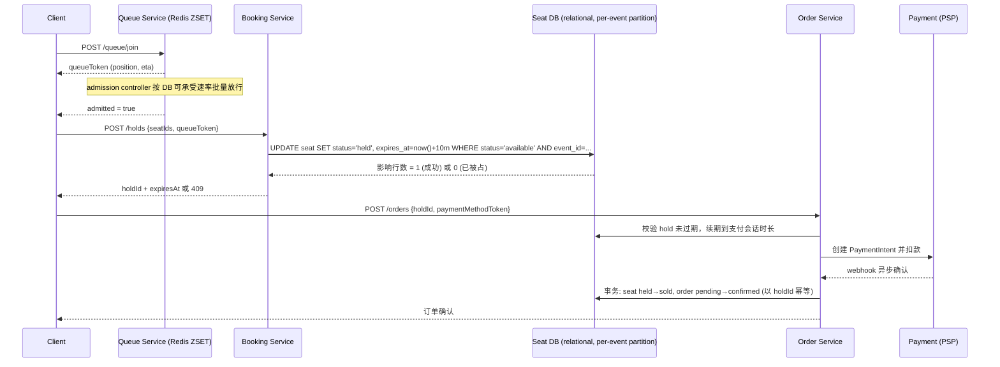

# 设计题解：票务预订系统（Ticket Booking / Ticketmaster）

## 题目与范围

面试官通常这样开场："设计一个像 Ticketmaster 一样的票务系统：用户能浏览演出、挑选座位、
把座位锁定几分钟去付款，付款成功前这个座位不能被别人抢走。" 这句话里已经藏着这道题真正的
难点——不是"卖票"，而是"在同一时刻有几十万人盯着同一批座位时，如何保证每个座位只卖给一个
人"。

值得当场问清楚的澄清问题，以及它们各自改变的设计决策：

- **是划位（assigned seating）还是通用入场（general admission, GA）？** 如果是 GA，库存
  是一个数字，天然适合"原子递减"，这其实是「Flash Sale & High-Contention Inventory」那道题
  的模型；如果是划位，库存是几万个不同的对象，每个都要被唯一分配，数据模型和并发策略完全不
  同（见「深入探讨」第 5 节）。本题按划位场馆设计，因为这是 Ticketmaster 的真实场景，也是
  这道题真正的难点所在。
- **是否要处理"验证粉丝"（verified fan）预售和分批开售？** 决定入口是否需要资格校验层，
  以及排队系统要不要支持"分批放行"而不是一次性开闸。
- **峰值量级是体育馆级（几万人抢几千个座位）还是全网级（上千万人抢一场演出）？** 决定要不
  要上虚拟排队厅（virtual waiting room）——如果峰值只有几倍于日常流量，简单限流可能就够了。
- **要不要防黄牛（bot/scalper）？** 决定入口要不要做验证码、设备指纹、单用户购票上限。
- **退款、转赠、二级市场在不在范围内？** 决定订单状态机要多复杂。

**范围内**：演出与场馆浏览、座位图与实时可售状态、选座占座（hold）、支付确认、占座超时自
动释放、大型演出的虚拟排队。**范围外**：具体的黄牛检测算法（只设计限流和排队框架，检测策
略本身是另一个课题）、支付网关内部实现（复用一次性扣款、幂等键这类通用结论，不重新设计
PSP）、门票入场检票/二维码核销、动态定价、转售与二级市场。

## 需求

**功能需求（驱动设计的 3–5 条）**

1. 用户浏览演出、场馆座位图，看到每个座位当前是否可售。
2. 用户选定一个或多个座位，系统短暂"占座"（hold），在占座有效期内其他人看不到这些座位为
   可售。
3. 用户在占座有效期内完成支付，座位状态变为已售，生成订单和电子票。
4. 占座超时未支付，座位自动释放为可售，不需要人工介入。
5. 面对超高需求的演出，用户在能选座之前先进入虚拟队列，按顺序放行。

**非功能需求（数字化）**

- **绝不超卖**：任意时刻，一个座位最多只有一个有效的 held 或 sold 状态——这是唯一不能妥协
  的正确性约束，其余都可以为它让路。
- **占座延迟**：从提交选座到收到占座结果，P99 < 300ms（用户体感"抢没抢到"的等待感）。
- **占座有效期（hold TTL）**：10 分钟，业界惯例，给用户足够时间填完支付表单，又不会让座位
  长期"僵死"。
- **可用性分层**：浏览/排队路径目标 99.95% 可用（开售当天），占座/支付这条写路径宁可短暂
  返回"该座位已被占用"（409）也不能牺牲一致性——可用性预算优先花在读路径上。
- **订单持久性**：一旦订单确认，必须达到类似云对象存储的耐久度量级（不少于 3 副本同步/半
  同步复制），绝不能在确认后丢单——这是钱和法律责任。
- **峰值弹性**：系统要能承受比日常均值高 100–400 倍的入口流量脉冲。这个数字不是拍的：
  2022 年 Taylor Swift *Eras Tour* 预售当天，Ticketmaster 官方公告称产生了 **35 亿次系统
  请求，是此前峰值的 4 倍**（见「来源与延伸」）。把"日常峰值的 4 倍"当作单次异常大促的下限
  假设，是这道题里少数几个有真实数据支撑、不用自己拍脑袋的数字。

## 容量估算

估算分两层，这是本题最容易被面试官追问出破绽的地方：**用户看到的入口流量**和**真正打到
数据库的写入流量**，两者相差可能两个数量级，中间靠虚拟队列削峰。

**场景假设**：一个能容纳 5 万座位的体育场级场馆，开售第一分钟涌入 100 万用户抢这 5 万个
座位。

- **座位竞争比**：100 万 / 5 万 = **20:1**——平均每个座位有 20 个人在抢。但这是平均数，
  前排/正中等热门区域的竞争比会高出一个数量级（见深入探讨第 5 节）。
- **未经队列削峰的写 QPS**：如果 100 万人在开售后 10 秒内同时提交选座请求，理论峰值约为
  **10 万 QPS** 的条件更新（conditional update）打向座位表。但这些写分散在 5 万个不同的行
  上，单行的真实竞争只是"20 个并发事务抢一行"，不是"10 万 QPS 打一行"——这个区分决定了瓶颈
  不是行级锁竞争本身，而是数据库整体能扛住多少行级写入。假设单个关系型数据库实例（如托管
  Postgres）在这种简单条件更新下能承受量级为每秒几千到一万行更新（这是本设计的假设，不是
  某厂商的官方数字），那么 10 万 QPS 已经远超单实例承受力。
- **虚拟队列放行速率**：把入口流量整形为放行速率，例如 3,000–5,000 admits/秒喂给占座服务，
  5 万个座位在数分钟内分批放开——这个数字来自"数据库能扛住多少"，而不是"用户想多快挤进去"，
  是本题里"容量估算直接决定架构决策"的核心例子：**没有这个数量级落差，就不需要虚拟队列，
  一个简单限流器就够了。**
- **读 QPS**：读路径要按**全平台最坏情况**估，而不是上面那一场的 100 万人：假设一次顶级开售让全平台有 1,000 万并发用户盯着座位图刷新（CockroachDB 对这次真实
  事故的技术复盘给出的数字是 1,400 万同时在线的用户和 bot，见「来源与延伸」），如果客户端
  每 3 秒轮询一次，读 QPS ≈ 1,000 万 / 3 ≈
  **330 万 QPS**。这比写路径的 3,000–5,000 QPS 高出近三个数量级，**读写比约 700:1**——这个
  比例决定了读路径必须走缓存 + 服务器推送，绝不能让浏览请求碰主库（见深入探讨第 4 节）。
- **存储**：座位元数据 5 万行 × 约 200 字节/行 ≈ 10MB/场；一年 2 万场演出 ≈ 200MB 座位元
  数据，完全不是问题。订单数据：年售 5,000 万张票 × 约 500 字节/条 ≈ 25GB/年。**存储量级
  在这道题里从来不是瓶颈，竞争和峰值并发才是**——这个对比值得在面试里主动说出来，说明你分
  清了"数据大"和"并发高"是两种完全不同的挑战。
- **带宽**：一个 5 万座位场馆的座位图 JSON/SVG 若为 200KB，峰值 10 万用户首次加载会产生
  约 20GB 的突发带宽，必须由 CDN/对象存储分发静态座位几何数据，不能让应用服务器现算现传。

## 核心实体与 API

**实体**

- **Venue**：`id, name, seatCount, seatmapUrl`（座位几何数据存对象存储 + CDN，不放数据库）。
- **Event**：`id, venueId, performerId, startTime, onSaleAt, status`。
- **Seat**：`id, eventId, section, row, number, priceTier, status(available/held/sold), holderId, expiresAt`——**一票一行**，是本设计最核心的建模决定（对比见深入探讨第 5 节）。
- **Order**：`id, userId, eventId, seatIds[], amount, status(pending/charging/confirmed/refunding/refunded), paymentIntentId, idempotencyKey`。
- **QueueTicket**：`userId, eventId, joinedAt, admittedAt(nullable), token`——虚拟队列的凭证，不是库存保留。

**API**

```
GET  /events/{id}/seatmap                 座位几何 + 分区聚合可售数（CDN 缓存，弱一致）
POST /events/{id}/queue/join              加入虚拟队列，按 (userId,eventId) 幂等 → {queueToken}
GET  /events/{id}/queue/status?token=..   → {position, etaSeconds, admitted}
POST /events/{id}/holds                   {seatIds[], queueToken, clientRequestId}
                                           需要已放行的 queueToken；clientRequestId 做网络重试幂等
                                           → {holdId, expiresAt} 或 409（座位已被占）
DELETE /holds/{holdId}                    主动释放
POST /orders                              {holdId, paymentMethodToken}
                                           按 holdId 幂等：重复调用只返回同一个订单，不会重复扣款
GET  /orders/{id}                         轮询订单状态
POST /webhooks/payment                    PSP 异步回调，按 PSP 事件 id 去重
```

**幂等性的两层含义**：`POST /holds` 用 `clientRequestId` 防的是"网络超时后客户端重试"这种
瞬时故障——同一个请求 ID 在 hold 还没过期前重放，返回同一个 hold；但 hold 一旦真正过期，
**同一个 `clientRequestId` 的重放不会"复活"它**，服务器会重新走一次条件更新逻辑。`POST
/orders` 用 `holdId` 做幂等键，保证 PSP webhook 或客户端的重复调用绝不会产生第二笔扣款。

**故意不做的**：座位锁不暴露成通用的"锁任意资源"原语，只服务座位这一种资源；一次 hold 内
不支持"换座"（只能整体释放重新选）；不提供批量跨多个 event 的 hold；座位图不分页（单个
JSON blob，gzip 后走 CDN，因为场馆座位数是有界的几万级，分页收益不大反而增加客户端复杂度）；
事件创建、票价配置等管理端 API 由另一个服务负责，不在这个设计里。

## 高层设计



**浏览/搜索路径**：客户端先拿静态座位几何（CDN + 对象存储，不经过任何应用服务器），再叠加
一层"可售状态"的弱一致缓存（Redis，键 `event:{id}:seat:{id} → status`，由 hold/release/sold
事件异步更新）。存储技术类是**只读缓存 + CDN**，选它是因为这条路径的读写比高达 700:1，任
何打数据库的方案在峰值都会先于写路径崩溃。

**排队路径**：Queue Service 用 Redis Sorted Set，`score = 加入时间戳`，一个 admission
controller 周期性 `ZPOPMIN` 批量放行，放行结果写成一个带 TTL 的 `admitted:{eventId}:{userId}`
标记。存储技术类是**内存数据结构存储（Redis）**，因为队列位次查询（`ZRANK`）和批量出队
（`ZPOPMIN`）都是 O(log N)，且队列状态本身允许丢失重建（最坏情况用户重新排队一次），不需
要关系型数据库的持久化保证。

**占座/支付路径**：Booking Service 直接对 Seat DB 做条件更新，Seat DB 是**单主关系型数据
库，按 event_id 分区**。选它是因为这条路径需要"同一行只被一个事务修改成功"的原子性保证，
这正是关系型数据库行级锁/MVCC 天然提供的能力（参见
[[distributed.transactions.isolation|Isolation Levels & Anomalies]]：`UPDATE ... WHERE
status='available'` 这种单语句条件更新，在标准的读已提交（read committed）隔离级别下就足
够安全——第二个并发事务的 `WHERE` 子句会在第一个事务提交后重新求值，不会读到过期的
`available`，所以不需要把整个隔离级别提到可串行化（serializable）。但如果 hold 逻辑退化成
"先 `SELECT` 查可用座位列表，再对其中一个做 `INSERT`"这种两步操作，就会重新引入经典的写偏斜
（write skew）异常，必须靠显式行锁或可串行化隔离才能堵住）。Order Service 与 PSP 交互后写回
同一个 Seat DB，用 saga 模式做补偿（见深入探讨第 3 节）。

## 深入探讨

### 座位状态机与"不超卖"的原子性

**问题**：在 20:1（热门区域可能几百:1）的竞争比下，`available → held` 这次状态转移必须
对每个座位恰好成功一次。

**方案一：跨请求持有数据库行锁**（`SELECT ... FOR UPDATE`，锁一直持有到用户填完支付表单）。
代价：锁可能被持有 5–10 分钟，占满连接池；用户中途关闭浏览器时锁不会自动释放；多座位
选择顺序不一致时有死锁风险。这是明显不该用的方案，但面试中常被第一反应提出。

**方案二：状态字段 + 后台清理任务**。给 Seat 加 `status` 和 `expires_at`，后台 cron 周期性
把过期的 held 座位重置为 available。代价：cron 触发间隔和真实过期时刻之间有窗口，窗口期内
座位"看起来被占着"但其实已经过期，造成不必要的 409；cron 本身故障会让座位永久卡死。

**方案三（本设计采用）：单语句条件更新 + 惰性过期判断**。不依赖任何后台任务来"释放"座位，
而是让每一次占座尝试自己判断目标座位是否过期：

```sql
UPDATE seats
SET status = 'held', holder_id = :uid, expires_at = now() + interval '10 minutes'
WHERE id = :seatId
  AND (status = 'available' OR (status = 'held' AND expires_at < now()));
```

这条语句在单个事务里原子地完成"判断可用性"和"写入新状态"，数据库的行级写锁在语句执行期间
自动短暂持有，不需要应用层显式加锁；受影响行数为 1 表示抢到，为 0 表示没抢到（要么真的被
别人占着，要么座位不存在）。配合复合索引 `(event_id, status, expires_at)`，一个低优先级的
后台任务仍然定期归档长期停留在 held-but-expired 状态的行，但它只是做清理和统计，不承担正确
性职责——正确性完全由这条条件更新语句保证。为什么可以只用读已提交而不是可串行化：因为这是
对**同一行**的条件写，不是"读一组行、决定要不要写另一行"的模式，不存在写偏斜发生的前提。

### 虚拟队列：把峰值流量整形成数据库能吃下的速率

**问题**：容量估算给出的落差是两个数量级——100 万/分钟的入口流量，数据库合理承受的写吞吐
只有几千 QPS。不解决这个落差，数据库会先于任何锁竞争问题被压垮。

**方案一：只做限流器，超额直接拒绝（429）**。简单，但用户体验是不断刷新硬闯——每次 429 都
换来更快的重试，形成惊群效应（thundering herd），而且手快的脚本天然占优，对普通用户不公平。

**方案二：把选座请求塞进一个 FIFO 消息队列（如 SQS/Kafka）顺序处理**。保证顺序，但用户看
不到自己的排队位置，如果消费速率没有和数据库真实吞吐对齐，只是把拥塞往后挪了一步，且没有
"资格"概念——排上号不代表座位还在。

**方案三（本设计采用）：显式虚拟候机厅**。用户先调用 `queue/join` 拿到一个 token，进入 Redis
Sorted Set（score = 加入时间），一个独立的 admission controller 按下游 Seat DB 当前能承受的
速率周期性 `ZPOPMIN` 批量放行，放行后的用户才能调用 `/holds`。这个方案的关键价值不只是"节
流"，而是把速率控制从每个 Booking Service 实例里抽出来，集中成一个可观测、可反馈调节的控制
回路——可以直接用 Seat DB 的实时延迟或 hold 成功率作为放行速率的反馈信号，负载升高就自动放
慢放行。数量级：排队 Sorted Set 承载 100 万元素、每元素约 100 字节，约 100MB，单 Redis 实例
轻松承受；放行速率取 3,000–5,000 admits/秒，与容量估算里数据库能扛住的写吞吐同一量级。

### 支付与占座的编排：saga、幂等与"付款中座位过期"的竞态

**问题**：hold 有 10 分钟 TTL，但支付网关本身有延迟、重试、异步 webhook，如果 hold 在支付
确认前过期，会出现"钱扣了但座位没了"或者更糟的"重复扣款"。

**方案一：支付发起后座位就不再过期，出问题靠人工/客服兜底**。等于放弃了"绝不超卖"这条核心
约束在极端情况下的保证，不可接受。

**方案二：hold TTL 固定不变，支付完成时二次校验座位状态，不通过就自动退款**。基本可行，但
仍有一个临界窗口：PSP 在 hold 恰好过期的瞬间确认扣款成功，此时座位可能已经被系统释放并卖
给了排在后面的人，产生"已扣款但没座位"的用户投诉——这正是 Hello Interview 的题解里点出的
同一类 edge case。

**方案三（本设计采用）：hold 续期 + saga 编排 + 幂等确认**。用户进入支付页时，把该 hold 的
`expires_at` 续到支付会话允许的最大时长（例如 15 分钟），并把"占座 → 扣款 → 确认"实现成一
个 saga：`reserve`（已完成）→ `charging`（调用 PSP）→ `confirmed`（一个数据库事务里同时把
seat 从 held 改成 sold、order 从 pending 改成 confirmed，用 `holdId` 做幂等键防止 webhook
重复触发导致的二次确认）。如果扣款失败，或者 confirm 阶段发现 hold 已经因为清理任务被回收，
触发补偿事务自动退款。PSP 的每个 webhook 事件 id 在 Order 表上有唯一索引，重复投递只会命中
"已处理"分支直接幂等返回，不会重复执行状态转移逻辑。

### 读路径：座位图的高并发展示与"眼看着变灰"的体验一致性

**问题**：容量估算给出约 330 万 QPS 级别的座位图读请求，同时用户希望"座位被别人占了"能尽快
反映到自己屏幕上——延迟越大，用户点击已失效座位的无效尝试越多，反过来又给写路径添乱。

**方案一：客户端轮询**（每几秒 `GET /seatmap`）。峰值下轮询本身就是最大的流量来源，且几秒
延迟导致大量"点了才发现已经没了"的写请求。

**方案二：只读缓存 + 更短的轮询间隔**。比方案一省一些，但缓存过期的瞬间仍会有失效风暴
（cache stampede），且延迟依然是秒级。

**方案三（本设计采用）：服务器推送**（SSE 或 WebSocket），初始快照来自缓存，之后 hold/
release/sold 事件按 event_id 分主题广播给正在查看该场次的所有连接。座位状态变化延迟可以压
到百毫秒级，避免轮询放大流量。代价是要维护千万级长连接的网关层，需要按 event_id 分片扇出
（fan-out）。配合前端"乐观展示、悲观提交"：允许用户点击一个刚变灰的座位，但真正的裁决在
`/holds` 同步返回，返回 409 就在 UI 上立刻回滚——这说明为什么写路径可以保持强一致而读路径
能放宽：读路径给错一次信息的代价只是一次重试，不是数据错误。数量级：即使 1,000 万人围观同
一个 event，广播的消息产生速率等于写路径的 hold/release/sold 事件速率（几千/秒），一条消息
扇出给千万订阅者是网关水平扩展的问题，不是消息产生速率的问题。

### 座位级库存 vs 数量级库存：两个题目本质不同的并发模型

**问题**："Ticket Booking" 常被和「Flash Sale」混为一谈。如果是通用入场（GA）门票，库存
就是一个整数，自然想法是原子递减（`Redis DECR` 或 `UPDATE stock=stock-1 WHERE stock>0`）；
但一旦是划位场馆，本质是"几万个不同对象各自要被唯一分配"，原子递减模型完全不适用——一个
计数器无法告诉用户具体买到了哪个座位。

**方案一：沿用数量原子递减，座位在后台异步批量分配**。写路径退化成对单行计数器的高吞吐递
减，理论吞吐更高；但用户体验变差（不能选座），且"扣了数量但分配座位失败"需要额外的补偿
逻辑，实际上更复杂。

**方案二（本设计采用）：一票一行 + 状态机**。天然支持选座 UI 和逐座追踪，是本设计从一开始
就选定的模型（见「核心实体与 API」）。代价是最热门的少数座位（前排、正中）竞争比会远高于
平均值——假设前墙/VIP 区 200 个座位对应 50 万人抢，单点竞争比可达 **2,500:1**，此时哪怕条
件更新本身是原子的，也会产生海量 409。应对办法是把"用户指定唯一座位号"改成"用户提交一批候
选座位，服务器在其中任选一个可用的返回"，把竞争从"同一行"打散成"同一批任意 N 行中选一行"，
显著降低无效竞争——这是本设计在面试追问里给出的降级方案，而不是默认方案，因为它牺牲了用户
对具体座位的选择权。

## 瓶颈、故障与演进

**热点与倾斜**：热门座位竞争比可达数百甚至上千比一（见深入探讨第 5 节）；更根本的是，一场
爆款演出的 `event_id` 本身就是一个热 key——即使 Seat DB 按 `event_id` 分片，这一个爆款演出
的全部流量仍然集中在**它自己所在的那一个分片**上，水平分片对"单场演出内部"的热点毫无稀释
作用，真正缓解热点靠的是虚拟队列的入口限速和"候选座位组"这类打散单点竞争的技巧，而不是指
望分片本身消化压力。

**故障域**：
- **Redis（队列/缓存）不可用**：排队服务应当 fail closed——暂停放行新用户进入占座阶段，保
  护 Seat DB，而不是 fail open 全部放行导致数据库过载；已放行用户的占座请求走 Seat DB 的条
  件更新，不依赖 Redis，所以"不超卖"不受影响，只是座位图变陈旧，退化到轮询兜底。
- **Seat DB 主库不可用**：写路径完全停摆——这是唯一一致性来源，不能静默降级，需要秒级自动
  故障转移（如托管 Postgres 的自动 failover，RTO 目标 < 30 秒）；读路径可以继续用缓存的陈
  旧快照撑几分钟。
- **PSP 抖动/超时**：订单卡在 `charging` 状态，靠一个超时补偿任务定期扫描并对账
  （reconcile），给"支付中"一个比 hold TTL 更长但仍然有限的超时（如 15–20 分钟），超时后
  自动退款并释放座位，同时进入人工兜底队列处理边界情况。
- **admission controller 单点**：它本身是一段集中的限速逻辑，需要做成无状态或主备切换（位
  次和放行状态存 Redis/数据库而不是进程内存），防止重启后重算的位次和已发出的 token 冲突。

**10 倍演进**：从单场馆 5 万座到平台级同一天有数十场热门演出同时开售。Seat DB 和队列都要按
`event_id` 做**物理隔离**（独立的数据库分片/独立的 Redis 队列实例），而不是共享一张大表加
索引，防止一场爆款演出的热点拖垮所有其他演出的用户体验。

**100 倍演进**：从单一票务平台大促到"整个行业级大促日"，多个热门演出叠加，类似电商大促。
这时候队列、限流网关本身要做成无状态且能水平弹性扩容的层；唯一有状态、不能被拆分的仍然是
每场演出自己的 Seat DB 分区——针对已知的少数几个最热门演出，提前做专属过配（over-
provision）比依赖自动弹性扩容更可靠，因为弹性扩容的反应速度追不上"开售第一分钟"这种脉冲。

## 面试官会追问什么

**中级（mid）**
- "如果没有虚拟队列，直接放所有人进来选座，会发生什么？" 写路径 QPS 远超数据库吞吐，大量
  超时和无效重试风暴，用户体验极差，但只要条件更新本身是原子的，不会超卖——这个问题在考
  察你能不能分清"体验问题"和"正确性问题"。
- "座位占用超时之后怎么处理？" 惰性过期：每次条件更新的 `WHERE` 子句里判断 `expires_at`，
  不依赖精确的定时触发；后台清理任务只做归档和统计，不承担正确性职责。

**高级（senior）**
- "如何防止黄牛用脚本批量占座？" 队列入口做设备指纹/验证码，单用户同时持有的 hold 数上限，
  同 IP/同支付方式的频率限制，可疑 token 进人工审核队列——这是一个持续对抗的过程，不是一次
  性方案。
- "支付确认的 webhook 重复到达怎么处理？" 用 PSP 事件 id 或 `holdId` 做幂等键，在 Order
  表上加唯一约束，重复 webhook 命中已确认状态直接幂等返回，不会二次执行确认逻辑。

**参谋级（staff）**
- "如果座位图做成乐观 UI（点击就变灰，不等服务器确认），怎么保证用户不会到支付页才发现抢
  不到？" 允许乐观展示，但真正的占座 API 必须同步返回结果，409 立刻在 UI 回滚，永远不让用
  户带着"假成功"的 hold 进入支付页；也可以讨论候选座位组降低无效点击率。
- "如果 Seat DB 要跨区域部署以降低延迟，一致性怎么保证？" 每场演出只在一个区域有单一写入
  点（就近开售所在市场），跨区域只做异步复制的只读副本；不允许多主写同一场演出的座位表，
  因为这本质上是一个需要可串行化保证的单资源竞争问题，多主写会退化成需要分布式共识的重量
  级方案，收益（更低的跨区域写延迟）配不上代价。
- "怎么用压测验证这个设计能扛住 35 亿次请求级别的峰值？" 结合历史真实开售的 QPS 曲线做混
  沌工程式压测，非高峰期用影子流量重放，并对 admission controller 的放行速率做闭环反馈压
  测，而不只是对固定端点做静态 QPS 压测。

## 常见错误

- 把这题当成「Flash Sale」的数量递减模型来做，却同时要求前端能选具体座位——逻辑在数据建模
  阶段就自相矛盾（见深入探讨第 5 节）。
- 用跨请求持有的行锁（`SELECT FOR UPDATE`）横跨"选座到支付完成"的整个用户等待过程，被追问
  "用户直接关掉浏览器 5 分钟会怎样"时答不上来。
- 只设计了"给每个座位加一把分布式锁"，却完全忽略入口流量本身的数量级问题——虚拟队列常常
  被完全遗漏，只在被明确问"如果一千万人同时点进来呢"才现场补上。
- 把"排队通过"和"抢到座位"混为一谈，没讲清楚 admission 只是获得进入占座阶段的资格，不是库
  存保留。
- 忽略支付这一步的幂等性和 hold 续期，画一个"payment service"方框就不再展开，支付回调重复、
  超时、hold 过期竞态完全没考虑。
- 通篇"用缓存""用队列"却给不出具体的 TTL、竞争比、QPS 数字，论证停留在堆砌名词，没有到达
  "为什么是这个数字"的层次。

## 五分钟讲法

This is an assigned-seating ticket booking system, so the core challenge is not "how many
tickets are left" but "which one of tens of thousands of distinct seats does this user get,"
and I keep that distinction front and center throughout. Every seat is one row with a status
of available, held, or sold; the available-to-held transition is a single atomic conditional
UPDATE, so correctness never depends on an application-level lock. The hardest number in this
problem is the gap between entry traffic and what the seat database can actually absorb — a
popular on-sale can see a million requests a minute against a database that only handles a
few thousand row updates a second, so a virtual waiting room sits in front of booking and
throttles admission to whatever the database can sustain, using a Redis sorted set for
position and a feedback-driven admission controller. Reads are a completely different
problem: hundreds of times more volume than writes, so seat-map views are served from cache
and CDN with server-sent updates, never the primary database, while writes stay strongly
consistent because a wrong read just costs a retry, not a double-sold seat. Payment is
orchestrated as a saga — reserve, charge, confirm — with the hold extended during checkout and
every confirmation idempotent on the hold id, so a duplicate webhook can never double-charge
or double-sell. Under 10x load I split the database and the queue per event so one blockbuster
show can't starve every other show's users, and at 100x I over-provision the handful of known
hot events in advance rather than trusting autoscaling to react inside the first minute of an
on-sale.

## 来源与延伸

- [Hello Interview — Design a Ticket Booking Site Like Ticketmaster](https://www.hellointerview.com/learn/system-design/problem-breakdowns/ticketmaster)（`no-archive`，商业备考网站）：
  给出了一个完整的题解框架，包括"数据库状态字段 + Redis 分布式锁"作为最终推荐方案。本文与
  它不同的地方在于：本文把 Redis 锁和 Seat DB 视为需要维护一致性的两套真相来源，因此更倾向
  只用数据库原生条件更新作为唯一真相来源、Redis 只做展示层缓存（见深入探讨第 1 节），避免
  双写窗口期问题。
- [System Design School — Ticketmaster (Ticket Booking) System Design](https://systemdesignschool.io/problems/ticketmaster/solution)（`no-archive`，商业备考网站）：
  强调"强一致性只用在占座这一个写点，浏览路径可以完全弱一致"，以及座位库是唯一真相来源、
  可用性缓存永远不是——本文采纳了这个划分原则，并在容量估算和高层设计两节里展开了具体数字。
- [CockroachDB — Technical takeaways from the Taylor Swift/Ticketmaster meltdown](https://www.cockroachlabs.com/blog/taylor-swift-ticketmaster-meltdown/)：
  对 2022 年真实故障的技术复盘，指出根因是未被提前识别的瓶颈在流量集中涌入时级联失败，并
  给出"提前做容量规划、主动找瓶颈、做混沌工程演练"的建议——本文在「面试官会追问什么」的
  staff 级问题里吸收了这个"用混沌工程验证峰值弹性"的思路。
- [Ticketmaster Business — Taylor Swift | The Eras Tour Onsale Explained](https://business.ticketmaster.com/press-release/taylor-swift-the-eras-tour-onsale-explained/)：
  Ticketmaster 官方对这次事件的数字披露（350 万预注册、150 万人拿到验证码、35 亿次系统请
  求、4 倍历史峰值、超过 200 万张票单日售出），本文「需求」和「容量估算」两节里所有关于这
  场真实事件的数字都来自这份公告，而不是猜测。
