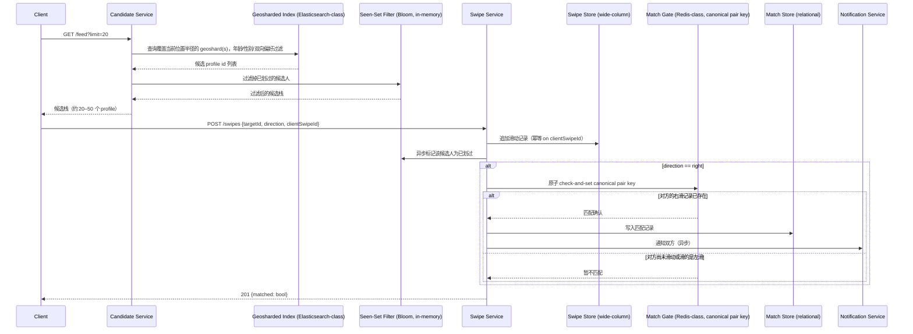

# 设计题解：约会与匹配（Dating & Matching，Tinder）

## 题目与范围

面试官通常这样开场："设计一个类似 Tinder 的约会应用：用户设置偏好和位置，系统展示一叠
附近符合偏好的候选人，用户左右滑动（swipe）表示喜欢或不喜欢，双方互相喜欢即成为一次
匹配（match）。" 这句话背后的真正难点不是"存用户"，而是**候选人集合本身是一个不断收缩、
不能重复的查询结果**——同一个用户永远不应该被再次展示给你，而滑动这个动作本身又是所有
交互里最高频、最廉价的一个，一次匹配的判定必须在两个几乎同时发生的写入之间恰好触发一次，
不多不少。

值得当场问清楚的澄清问题，以及它们各自改变的设计决策：

- **匹配判定要不要强一致？** 如果 A 和 B 在几毫秒内互相右滑，系统必须让至少一方立刻看到
  "配对成功"的画面，这排除了"靠后台定时任务扫描、最终一致地发现遗漏的匹配"这类方案——见
  「深入探讨」第 4 节。
- **要不要支持用户把当前位置切换到别处（类似 Tinder 的 Passport 功能）？** 这决定候选人
  索引要不要处理"文档在毫秒级内被并发移动"这类一致性问题——见「深入探讨」第 5 节。
- **排序是纯距离+活跃度，还是要预测长期关系质量？** 决定排序管道的复杂度和「深入探讨」
  第 6 节要不要引入学习模型。
- **划过的记录允许撤回吗？** 直接决定 seen set（已划过集合）要不要支持精确删除——
  Bloom filter 原生不支持删除，这条需求单独就能否决"纯 Bloom filter"方案，见「深入探讨」
  第 2 节。
- **要不要处理机器人、虚假账号和骚扰？** 决定「深入探讨」第 7 节的范围；本题解覆盖检测
  信号和限流机制，不覆盖人工审核流程和法律合规细节。

**范围内**：候选人 feed 的地理与偏好过滤查询、seen set 排除已划过用户、swipe 高频写入、
互相喜欢的 exactly-once 匹配检测、用户移动后候选 feed 的陈旧处理、基础的公平性与排序、
基础的滥用防御。**范围外**：匹配后的聊天（属于 [[solution-chat-messaging]]）、推送通知的
投递机制（属于 [[solution-notification-system]]）、照片存储与内容审核、付费订阅与
Super Like 之类的商业化功能。

## 需求

**功能需求（驱动设计的 3–5 条）**

1. 用户设置偏好（年龄范围、性别偏好、最大距离）和当前位置，用于过滤候选人。
2. 用户能看到一叠按地理位置和偏好过滤过的候选人，逐个左右滑动表示喜欢/不喜欢。
3. 已经被划过的用户（无论方向）永远不会再出现在同一个用户的候选 feed 里。
4. 双方互相右滑后，系统恰好一次通知双方"匹配成功"——不重复、不遗漏。
5. 用户切换当前位置后，候选 feed 在合理延迟内反映新的地理范围。

**非功能需求（数字化）**

- **feed 读延迟**：`GET /feed` P99 < 300ms——这是用户每次打开 App 后立刻触发的交互，
  延迟直接影响是否继续使用。
- **swipe 写延迟**：`POST /swipes` P99 < 150ms——用户会连续快速滑动，写入路径的任何卡顿
  都会被直接感知为"划不动了"。
- **匹配判定的一致性**：强一致、exactly-once。这条不能打折扣——"两个人互相喜欢却都没被
  通知"和"同一次匹配被通知了两次"都是不可接受的产品缺陷，二者都不是"最终一致"能兜底的
  问题，因为没有后续读操作会主动去发现"该发生但没发生"的通知。
- **seen set 排除的正确方向**：允许极小概率把一个没划过的候选人误判成"可能划过"从而少
  展示一次（假阳性，安全方向），绝不允许把一个已经划过的用户误判成"没划过"从而重复展示
  （假阴性，不可接受）——这个不对称性直接决定「深入探讨」第 2 节选哪种数据结构。
- **可用性分层**：候选 feed 读路径 99.95%；swipe 写路径 99.9%，短暂失败允许客户端重试
  （幂等保护见「核心实体与 API」）。

## 容量估算

**基础假设（本设计的假设，不是 Tinder 的真实数据）**：日活用户（DAU）1,000 万；平均每个
活跃用户每天滑动 150 次。

```
swipes/day = 10,000,000 × 150 = 1,500,000,000
swipe QPS(avg) = 1,500,000,000 / 86,400 ≈ 17,361
swipe QPS(peak, ×3 日间峰值系数) ≈ 52,083
```

**交叉验证**：Tinder 自己的工程博客（2019）披露"每天超过 20 亿次 Swipe 功能调用"（见
「来源与延伸」），和这里算出的 15 亿/天是同一数量级——考虑到披露时间和用户基数增长，这个
量级差异符合预期，可以作为假设合理性的一个交叉验证，而不是精确对照。

**这是第一个决定架构的数字**：容量估算部分默认关系型主库（single relational primary）
在简单条件更新下的现实承受能力是每秒几千行（这是本设计的假设，与本题解库里其他涉及条件
更新的设计——如票务预订、秒杀——共享同一假设）。52,083 相对 3,000 这个假设上限超出约
17.4 倍：

```
写放大比 = 52,083 / 3,000 ≈ 17.4
```

单个关系型主库无法承受这个写峰值，这直接把 swipe 写入推向**宽列存储（wide-column，
Cassandra 一类）**，按 `swiping_user_id` 分区——这正是「深入探讨」第 3 节的数字依据。

**右滑与匹配**：假设右滑（喜欢）占全部滑动的 20%，其中 6% 会撞上对方也曾经右滑过自己
（这两个比例都是本设计的假设，用于说明"匹配判定"这条路径本身的负载，不是从"日活的百分之
几"和"全天的百分之几"这种可能互相矛盾的口径里拼出来的——它们是同一个滑动漏斗上先后两次
筛选，后一个百分比的分母就是前一个的结果，不会比整体更大）：

```
right swipes/day = 1,500,000,000 × 0.20 = 300,000,000
right-swipe QPS(avg) ≈ 3,472，(peak ×3) ≈ 10,417

matches/day = 300,000,000 × 0.06 = 18,000,000
match QPS(avg) ≈ 208，(peak ×3) ≈ 625
```

**这是第二个决定架构的数字**：匹配判定的原子检查（见「深入探讨」第 4 节）发生在**每一次
右滑**上（要检查对方是否已经右滑过自己），而不是只发生在confirmed matches上，所以真正
的负载驱动数字是右滑峰值 10,417 QPS，不是匹配峰值 625 QPS。用 Redis 官方公布的单实例
基准（裸机、不开 pipelining，`SET` 约 180,180 请求/秒，与本题解库其他设计共享同一基准）
去对比：

```
安全边际 = 180,180 / 10,417 ≈ 17.3x
```

17.3 倍的边际远比秒杀设计里 1.8 倍的边际健康——这不是巧合，而是因为匹配判定的负载本身
（几千到一万 QPS 量级）比秒杀那种"全网同时抢一件商品"低了一到两个数量级。这个对比本身
就是一个值得在面试里主动提出的判断：**不是所有"原子操作"场景都需要为热 key 做特殊设计，
先算出安全边际，边际厚的时候朴素方案就够用**。

**交叉验证**：Tinder 自己的工程博客披露"全球累计超过 300 亿次匹配"（不是"每天"，是
一个里程碑式的累计数字）。按这里算出的 1,800 万匹配/天粗略估算，五年累计约
1,800万×365×5 ≈ 328.5 亿——和披露的"300 亿+"量级相符，可以作为假设合理性的一个粗略
交叉验证（真实增长曲线显然不是常数，这里只做数量级校验，不是精确对账）。

**Seen set 的规模**：假设一个重度用户已经用了 3 年，`heavy_user_lifetime_swipes = 150 ×
365 × 3 = 164,250`。这是「深入探讨」第 2 节里 Bloom filter 和索引侧过滤两个方案对比的
关键输入数字。假设累计注册用户 1 亿，平均每个注册用户（含大量沉默账号）一生滑动 3,000
次：

```
total_swipe_edges = 100,000,000 × 3,000 = 3×10^11
```

对比两种存储该关系的方式：

```
显式存储（宽列存储，8 字节用户 id）：
  3×10^11 × 8B = 2.4×10^12 B = 2.4 TB

Bloom filter（目标假阳性率 0.1%，最优 bits/element ≈ 14.38）：
  3×10^11 × 14.38 bits / 8 = 5.39×10^11 B ≈ 0.539 TB

存储降低倍数 = 2.4 / 0.539 ≈ 4.45x
```

**这是第三个决定架构的数字**：Bloom filter 把 seen set 的存储压到显式存储的约 1/4.45，
但（如「需求」一节强调的）它原生不支持删除，这决定了它不能单独作为 source of truth，
必须和一份支持精确删除的存储搭配——见「深入探讨」第 2 节。

**存储**：swipe 记录（swiper_id + target_id + direction + timestamp + 幂等键摘要，约
40 字节）：

```
swipes/year = 1,500,000,000 × 365 = 5.475×10^11
raw bytes/year = 5.475×10^11 × 40B = 2.19×10^13 B = 21.9 TB
三副本 ≈ 65.7 TB
```

**结论**：这道题里真正的瓶颈不是字节数（21.9 TB/年对宽列存储不算大），而是**两个 QPS
数字**——swipe 写入峰值 52,083（逼出宽列存储和按滑动者分区）和右滑检查峰值 10,417（决定
匹配判定走 Redis 原子网关而不是关系型事务，见「深入探讨」第 4 节）——以及**seen set 的
存储形态选择**（Bloom filter 省 4.45 倍空间，但不能单独承担删除语义）。

## 核心实体与 API

**实体**

- **User**：`id, prefs(ageMin, ageMax, interestedIn[]), currentLocation(lat, long),
  homeGeoshard, lastActiveAt`。
- **CandidateIndexDoc**：与 User 一一对应，写入地理分片索引（geosharded search index）
  的文档——`userId, age, gender, interestedIn[], lat, long, isActive`。是一份**物化视图**，
  可以从 User 重建，不是权威数据。
- **Swipe**：`swiperId, targetId, direction(like/pass), createdAt, clientSwipeId`——
  `clientSwipeId` 是幂等键，防止客户端重试产生重复写入。
- **Match**：`pairKey(canonical min/max), userAId, userBId, matchedAt, status`——
  `pairKey` 由两个用户 id 按固定规则排序拼接而成，保证同一对用户无论谁先滑，落在同一个
  key 上。
- **SeenSetEntry**（逻辑存在，不是独立的用户可见实体）：`userId, targetId, seenAt`——
  精确存储在宽列存储里，作为 Bloom filter 假阳性兜底和"撤回滑动"删除语义的 source of
  truth。

**API**

```
POST   /profile              {prefs...}                        更新偏好，幂等 upsert
POST   /location              {lat, long}                       更新当前位置，可能触发
                                                                  候选 feed 失效（见深入
                                                                  探讨第 5 节）
GET    /feed?limit=20         → {candidates[]}                  返回预计算好的候选栈，
                                                                  不接受客户端传入的 lat/
                                                                  long——避免客户端伪造
                                                                  位置绕过服务端已知的
                                                                  seen set 计算
POST   /swipes                {targetId, direction,
                                clientSwipeId}
                               → {matched: bool}                 按 clientSwipeId 幂等
DELETE /swipes/{swipeId}      仅限时间窗口内撤回最近一次滑动，
                               需要精确 seen set 支持删除
GET    /matches?cursor=       → {items[], nextCursor}            已匹配列表，分页
```

**故意不做的**：不支持不带位置的"全球候选人搜索"；不在 API 层暴露排序权重给客户端调节；
不支持一次请求里对多个 target 批量滑动（保持每次一个 target，简化幂等键和限流粒度）；不
支持"把已发送的滑动方向从右滑改成左滑"（只能在窗口内撤回重新划，避免和已经触发的匹配
通知产生竞态——已经通知过的匹配不能被事后"撤销"）。

## 高层设计



**候选人生成路径**：Candidate Service 先查**地理分片搜索索引（Elasticsearch 一类）**，
在覆盖当前位置半径的 geoshard 内按年龄、性别偏好做过滤——地理分片的索引结构本身（如何把
经纬度拍平成可分片的键）属于 [[solution-proximity|邻近搜索]] 的范围，这里复用同一套
S2/geohash 机制，不重复展开。取到候选人 id 列表后，交给 Seen-Set Filter 排除已经划过的
用户（见「深入探讨」第 2 节），结果作为一叠候选栈预先计算好、缓存起来，`GET /feed` 命中
的是这份缓存而不是每次都重新查询索引——这是因为（见「容量估算」）每次候选栈能覆盖约 20
次滑动，读写比只有 1:20，实时查询的代价可以摊到这 20 次滑动上，不需要 news feed 那种
"发帖时预计算"的强 fan-out，只需要一个简单的"栈快耗尽时重新拉取"策略。

**Swipe 写路径**：`POST /swipes` 写入**宽列存储（Cassandra 一类）**，按 `swiperId`
分区——这个选型直接来自容量估算：单个关系型主库的条件更新上限（假设几千/秒）扛不住
52,083 的滑动写峰值，而宽列存储的顺序追加写吞吐可以水平扩展。同一次写入异步触发 Seen-Set
Filter 更新（不阻塞 swipe 的写确认），保证响应延迟不被 Bloom filter 更新拖慢。

**匹配判定路径**：只有右滑才会触发对 Match Gate（**内存数据结构存储，Redis 一类**）的
原子 check-and-set，用 canonical pair key 保证无论谁先滑、谁后滑，两次滑动都落在同一个
key 上——这是 [[distributed.consistency|Consistency Models]] 里"用单点强一致换正确性，
但把这个单点缩小到最小必要范围（一个 key，而不是全表）"这一思路的具体应用。匹配确认后，
持久化记录写入**关系型存储**（匹配记录量远低于滑动记录，关系型的事务语义和易查询性在这里
比宽列存储的运维简单性更划算），通知走独立的 [[solution-notification-system|通知系统]]，
不阻塞匹配判定本身的返回。

## 深入探讨

### 候选人 feed：地理与偏好双向过滤的两阶段查询

**问题**：候选人 feed 不是"最近的 N 个用户"这么简单——它必须同时满足地理约束（在最大
距离内）和偏好约束，而且偏好必须是**双向**的：只展示"我想看的性别"是不够的，还必须排除
"对方并不想被我这类人看到"的候选人，否则会产生大量无意义的滑动（划到根本不会匹配的对象）
和更差的用户体验。

**方案一：先查地理索引拿到候选人列表，再在应用层过滤偏好**。实现简单，但如果地理索引
返回的候选人集合本身很大（比如密集城市里几万人在同一个 geoshard），应用层要遍历过滤掉
大部分不符合偏好的人，浪费了地理索引已经缩小范围的成果，且候选人集合的"有效密度"（真正
双向匹配偏好的比例）在人口结构不均衡的地区可能很低，导致一次查询拿到的有效候选人不够填满
一屏。

**方案二（本设计采用）：把偏好过滤下推到地理索引的同一次查询里**。地理分片索引（见
[[solution-proximity|邻近搜索]]）的搜索引擎本身支持布尔查询（bool query），把年龄区间、
性别偏好、双向"我想看你、你也想被我看到"的条件和地理半径过滤在同一次索引查询里一起表达，
索引只返回真正双向兼容的候选人。这样"地理"和"偏好"不是查询管道里的两个阶段，而是**同一
个查询的两组过滤条件**，充分利用索引本身的过滤能力，而不是先粗筛再精筛。

**真实系统的数字**：Tinder 自己的工程博客披露，他们的推荐场景把搜索半径限制在 100 英里
以内，最初用单一 Elasticsearch 集群、默认 5 个分片，随着数据量增长遇到高 CPU 利用率和
高基础设施成本；改造后按地理位置切分出 40–100 个 geoshard（用 Google S2 库的 Hilbert
曲线保持空间局部性，Level-7 约 45 英里、Level-8 约 22.5 英里的cell粒度），使同一次查询
只需命中覆盖该查询半径的少数几个 geoshard，测量到**生产环境下这套地理分片索引能处理
20 倍于单一索引方案的计算量**（见「来源与延伸」）。本设计沿用同一个"按地理位置切分索引、
只查询覆盖当前半径的分片"思路，把 20 倍这个数字作为地理分片相对单一索引方案的收益的现实
参照,但不把 Tinder 的具体分片数或用户规模当作本设计的假设——本设计的 DAU 和 geoshard
数量需要按「容量估算」里的规模重新计算。

### Seen set：划过的人必须消失——Bloom filter、宽列精确集合与索引侧过滤

**问题**：候选人 feed 必须排除该用户已经划过的所有人（无论当初是左滑还是右滑）。这个
排除集合（seen set）的规模随用户使用时长线性增长——「容量估算」算出一个用了 3 年的重度
用户，seen set 大小已经到 164,250。排除操作发生在**每一次候选人 feed 生成**里，必须够快。

**方案一：索引侧过滤**——把候选人的地理/偏好查询和"排除已划过 id 列表"合并成一次索引
查询（如 Elasticsearch 的 `must_not terms` 子句）。Elasticsearch 默认把 `terms` 查询的
词项数上限设为 `index.max_terms_count = 65,536`（见「来源与延伸」）。而「容量估算」算出
一个 3 年的重度用户 seen set 已经有 164,250 条——**超出默认上限约 2.5 倍**，查询会直接
失败或需要不断调大这个配置、以更差的查询性能为代价。这个方案对轻度用户可用，对本设计
需要覆盖的重度用户群体在数字上就已经不成立。

**方案二：宽列存储里为每个用户维护一份精确的 seen set**，查询候选人时先批量查一次该用户
的完整集合，在应用层或作为 `IN` 查询条件排除。精确、支持删除（撤回滑动可以直接删掉一行）
——但如「容量估算」算出的，全量存储该关系需要约 2.4 TB（8 字节 id、3×10^11 条边），是
Bloom filter 方案的 4.45 倍。

**方案三（本设计采用，与方案二搭配）：每用户一个 Bloom filter，缓存在内存数据存储
（Redis 一类）里，候选人生成时先过 Bloom filter，只有 Bloom filter 判定"可能没划过"的
候选人才进入候选栈**。Bloom filter 只在"假阳性"方向出错（可能把一个没划过的人误判成
"可能划过"从而漏掉），永远不会在"假阴性"方向出错（不会把已经划过的人误判成"没划过"）——
这正好符合「需求」一节定义的安全方向。假阳性的代价可以精确算出：一次候选人生成会先从
地理索引里筛出几千个候选人，目标假阳性率设为 0.1% 时，每次生成大约漏掉"千分之几"个本该
展示、结果被误判排除的候选人——在候选池有几千人的规模下完全可以忽略，用来换取存储降低
4.45 倍是划算的。但 Bloom filter 本身不支持删除（`DELETE /swipes/{id}` 这个撤回接口没法
只靠它实现），所以真正的 source of truth 仍然是宽列存储里的精确集合，Bloom filter 是
定期从精确集合重建的**只读加速层**，这也是为什么方案二不能被完全省略——它不是被方案三
替代，而是被方案三包住，各自负责自己擅长的方向：宽列存储负责正确性和删除，Bloom filter
负责把绝大多数查询挡在便宜的一层。

### Swipe 写入：全设计里最高频、也最该便宜的路径

**问题**：滑动是用户最频繁的交互，「容量估算」算出的峰值写入 QPS 是 52,083，是同一容量
估算里 feed 读峰值（2,604）的约 20 倍——这和大多数题解库里"读多写少"的常态相反,原因是
一次候选栈能覆盖约 20 次滑动，读的成本被分摊了，而每一次滑动都必须单独确认写入成功。

**方案一：直接写关系型数据库**，用一次条件更新或简单 INSERT 记录滑动。简单、事务语义好，
但「容量估算」已经算出峰值写入超出关系型主库假设上限（几千/秒）约 17.4 倍，任何单一
关系型主库都扛不住,除非引入复杂的分片方案。

**方案二（本设计采用）：写入宽列存储（Cassandra 一类），按 `swiperId` 分区**。滑动写入
模式是简单的按用户追加写，从不需要跨用户事务，天然契合宽列存储面向写优化的存储引擎（如
commit log + memtable + SSTable 的写路径）。按 `swiperId` 分区还带来一个直接的读侧好处：
"用户 A 是否已经划过用户 B"这类点查询可以定位到单一分区完成，不需要跨分区扫描——这个
访问模式和「深入探讨」第 2 节的 seen set 精确存储共享同一个分区键设计。

**幂等性**：`POST /swipes` 用 `clientSwipeId` 做幂等键，网络超时后的客户端重试不会产生
第二条滑动记录，也不会让 Match Gate 的 check-and-set 被同一次滑动触发两次——这一点和
「深入探讨」第 4 节的 exactly-once 匹配判定互相依赖：如果滑动本身不是幂等的，匹配判定
再原子也没用。

### 互相喜欢的判定：exactly-once 匹配检测

**问题**：A 和 B 在几毫秒内先后右滑对方，两次写入几乎同时到达系统。如果两次写入各自独立
检查"对方是否已经右滑我"，可能出现两次检查都发生在对方的写入完成之前，导致两边都判定
"暂不匹配"，最终双方互相喜欢却都没有被通知——这是「需求」一节明确排除的产品缺陷,原因是
没有后续的读操作会主动重新发现这次"该发生却没发生"的匹配。

**方案一：关系型事务**——用 `BEGIN; SELECT ... FOR UPDATE; 检查反向滑动是否存在;
COMMIT` 包住整个判定过程,靠行锁保证同一对用户的两次滑动不会交错。正确，但吞吐上限就是
「容量估算」里假设的关系型条件更新上限（几千/秒），而驱动这条路径的真实负载是右滑峰值
10,417 QPS——已经超出这个假设上限约 3.5 倍,在峰值时段会开始排队甚至超时。

**方案二：有序日志（Kafka 一类）按 pairKey 做分区，用一个下游的流处理器维护匹配状态**。
利用 Kafka"同一个 key 的消息总是进入同一个 partition"的特性，保证同一对用户的两次滑动
被同一个消费者按顺序处理，天然避免了竞态。正确性没问题，但引入了消费延迟——匹配的确认
和通知不再和滑动的 HTTP 响应同步,而「需求」一节要求用户在划出决定性的第二次右滑后立刻
看到"配对成功"的画面，这是产品体验的核心一环，不能接受额外的异步延迟。这个方案在别的
设计里（如需要强顺序保证但不要求同步返回结果的场景）是合理选择，只是不适合这道题对"立刻
看到匹配"的延迟要求。

**方案三（本设计采用）：内存数据存储（Redis 一类）上的原子 check-and-set，作用在
canonical pair key 上**。把两个用户 id 按固定规则（比如数值更小的排在前面）拼接成一个
唯一的 `pairKey`，用一条 Lua 脚本或原生的条件写命令，在一次原子调用里"检查对方的右滑
是否已经记录、如果没有则记录自己这一次、如果已经记录则返回匹配确认"。这保证了无论谁先
划、谁后划,两次滑动看到的都是同一个 key 上的同一份状态,不存在中间态。「容量估算」算出
这条路径相对 Redis 官方单实例基准的安全边际约 17.3 倍，在当前规模下单实例就足够，不需要
像秒杀设计那样为单一热 key 做冗余复制——这也是为什么两道题都用了同一类存储、却在"要不要
特殊处理热 key"这件事上给出不同结论：**先算边际，边际厚的时候不需要额外复杂度**。匹配
确认后，持久化的匹配记录异步写入关系型存储，通知异步发出——这两步都不需要和 check-and-set
本身在同一个事务里，因为"匹配已经发生"这件事只要在 Redis 网关这一步原子地确定下来，
后续的记录和通知即使短暂延迟或重试，也不会产生第二次"匹配"判定。

### Feed 预计算与陈旧：用户移动之后怎么办

**问题**：候选栈是预先计算好并缓存的（见「高层设计」），这带来了新闻推荐一类系统都要
面对的陈旧（staleness）问题：用户如果切换了位置（比如使用 Tinder 的 Passport 类型功能
把自己"传送"到另一个城市），旧的候选栈里全是原位置附近的人，必须失效并重新生成；而在
地理分片索引里，这意味着这个用户的索引文档要从旧的 geoshard 迁移到新的 geoshard。

**方案一：不做特殊处理，让候选栈自然过期**（TTL 到期后重新生成）。实现最简单，但用户
切换位置到候选栈自然过期之间的这段时间里，看到的全是无关地区的候选人，体验很差,尤其是
"传送到另一个城市"这种一次性、意图明确的动作，用户期望立刻看到新地区的人。

**方案二（本设计采用）：`POST /location` 主动触发候选栈失效，但只在位置变化超过一个
阈值（比如跨越 geoshard 边界，或者离上次计算候选栈时的位置超过若干英里）时才触发**。
细粒度的位置抖动（GPS 噪声、同城内小范围移动）不应该每次都重新计算候选栈，这个阈值让
候选栈只在真正需要的时候重新生成，避免为"用户在同一栋楼里走动"这种噪声反复触发昂贵的
索引查询。

**一致性的真正难点在索引迁移本身**：Tinder 自己的工程博客描述了这个问题——同一个用户
的文档要从旧 geoshard 的索引里删除、写入新 geoshard 的索引，这两步操作不是原子的，如果
在毫秒级内发生多次位置切换（比如用户来回切换 Passport 目的地），可能出现文档同时存在于
两个 geoshard、或者两边都没有的中间态。他们采用的解决方案是：**用 Kafka 按用户 id 分区
保证同一个用户的多次位置变更消息按顺序被同一个消费者处理**，避免了乱序导致的"文档漂移"；
同时，因为 Elasticsearch 是近实时（near real-time）搜索引擎——写入先进内存缓冲区，
"refresh"后才变得可搜索,"flush"后才落盘——如果索引迁移直接用 Reindex API，可能读到
还没 refresh 的旧状态,他们改用会强制触发 refresh 的 Get API 完成"先读后写"的迁移,以
保证强一致（见「来源与延伸」）。本设计采用同样的顺序保证机制：位置变更事件按用户 id
分区写入有序日志，消费者顺序处理索引迁移，并在迁移前对目标文档做一次强一致读，避免因为
乱序或读到陈旧状态产生"人在这里、索引却认为在别处"的不一致。

### 公平性与排序：新用户冷启动和曝光贫富差距

**问题**：如果候选人排序纯粹按"最近注册"或"最近活跃"排列,容易形成马太效应——已经获得
更多曝光、更多右滑的用户会持续排在更靠前的位置（因为排序信号本身就是历史互动数据），
新注册用户和历史互动数据少的用户长期得不到曝光,体验变差后更容易流失,进一步减少了这些
用户可用的互动数据,形成恶性循环。

**方案一：纯粹按活跃度和历史互动率排序**。对已经积累了数据的用户效果好，但对新用户和
互动数据稀疏的用户不友好，冷启动阶段几乎拿不到曝光。

**方案二（本设计采用）：新用户boost + 曝光配额相结合**。新注册用户在前 N 次候选人生成
里获得一个临时的排序加权（boost），确保能进入足够多其他用户的候选栈、积累初始的互动
数据；同时给每个用户设置一个每日曝光配额的下限（即使历史互动率低，也保证不会被完全挤出
候选池），避免排序算法把互动数据稀疏的用户长期锁在曝光下限以下。这不是要否定"按互动
质量排序"这个大方向——对已经有数据的用户,排序仍然应该反映真实的互动概率——而是给"数据
不足"这个特殊状态一个明确的、有时限的例外规则，避免赢家通吃变成系统性的结构问题而不是
纯粹的用户选择结果。

### 滥用与信任安全：机器人、骚扰与虚假账号

**问题**：自动化脚本可以用来批量注册虚假账号、对真实用户进行骚扰式的批量右滑（刷曝光）、
或者用来爬取候选人数据。这类滥用如果不加控制，会直接污染 seen set、排序信号和匹配质量，
让真实用户的体验变差。

**方案一：只靠账号注册时的验证（手机号/邮箱）挡住虚假账号**。能挡住最粗糙的批量注册，
但挡不住"账号是真实的、行为是异常的"这类滥用——比如一个真实账号用脚本以远超人类操作
速度连续右滑上千人。

**方案二（本设计采用）：注册验证 + 行为速率限制 + 异常模式检测的组合**。滑动写路径（见
「深入探讨」第 3 节）本身就适合加一层按用户维度的速率限制（如 [[traffic.rate-limiting]]
一类机制)，正常人类操作的滑动间隔有下限，远超这个速率的滑动模式可以被识别并限流,而不
需要先判断"这个账号是不是机器人"这种更难的问题——直接限制"任何账号在这个速率之上的行为
都不被信任"，把检测的复杂度从"识别身份"降低到"识别速率异常"。对于批量注册，除了注册时
的验证，还可以监控同一批新账号之间的行为相似度（比如大量新账号在极短时间内对同一小撮
候选人做出完全一致的滑动模式）——这类结构性异常比逐个判断单个账号是否可疑更容易在数据
层面被发现。这一节不覆盖具体的机器学习检测模型和人工审核流程，那属于一个独立的信任与
安全系统，这里只覆盖这道题的设计里应该预留的检测接口和限流位置。

## 瓶颈、故障与演进

**热点与倾斜**：地理分片索引本身的负载倾斜见 [[solution-proximity|邻近搜索]]；本题
特有的倾斜是**时区导致的 geoshard 负载不均**——同一个 geoshard 内的用户通常处在相邻
时区，Tinder 自己的工程博客披露不同 geoshard 之间在同一时刻的请求量峰值差异可以超过
10 倍（见「来源与延伸」）。他们的解法不是手动把负载均衡的 geoshard 组合分配到物理机器
上（这是一个 NP 难问题，而且每次重新分片都要重新计算），而是**把每个 geoshard 的副本
随机分布到物理主机上**——统计学期望下，随机分布本身就能把不同时区的峰值错峰效果摊平到
每台物理机上，不需要为负载均衡单独设计复杂的调度算法。

**故障域**：

- **地理分片索引某个 geoshard 不可用**：该分片覆盖地区的用户暂时拿不到新的候选人，
  已经预计算好的候选栈仍然可用，不影响正在滑动的用户,只影响候选栈耗尽后的下一次刷新。
- **Match Gate（Redis 网关）不可用**：右滑写入仍然可以被 Swipe Store 接受（写路径和
  匹配判定路径解耦），但匹配判定本身暂停——需要在恢复后有一个补偿扫描,对不可用窗口期内
  的右滑重新做一次 check-and-set,避免永久丢失窗口期内本该发生的匹配。
- **Seen-Set Filter（Bloom filter 缓存）不可用**：退化为直接查询宽列存储里的精确集合
  （见「深入探讨」第 2 节），延迟上升但不产生错误的候选人（不会重复展示已划过的用户）。
- **Swipe Store 某分区不可用**：该分区上的用户既不能滑动,也无法查询自己的 seen set——
  这是唯一真正的"写不可用"故障域,需要秒级自动故障转移。

**10 倍演进**：日活从 1,000 万到 1 亿。右滑检查峰值从 10,417 增长到 104,167 QPS，相对
Redis 单实例基准（180,180）的安全边际从 17.3 倍收窄到约 1.73 倍——这个数字已经逼近
秒杀设计里"1.8 倍边际必须靠准入控制兜底"的危险区间,此时需要把 Match Gate 从单实例升级
成按 `pairKey` 哈希分片的 Redis 集群，用多个分片分摊负载，就像秒杀设计在 100 倍规模下
需要把不同 SKU 的库存 key 分散到不同分片一样。宽列存储的 swipe 写入本身无状态水平扩展，
不构成瓶颈。

**100 倍演进**：日活 10 亿（纯粹推演）。地理分片索引需要远超 40–100 个 geoshard，
geoshard 之间的迁移（用户跨分片移动）频率也线性增长，「深入探讨」第 5 节里按用户 id
分区的有序日志需要按比例扩容分区数；Match Gate 需要几十个分片才能把右滑检查峰值（约
1,040,000 QPS）分摊到每个分片的安全边际以内。更重要的是,Bloom filter 的目标假阳性率
在这个规模下需要重新评估——「容量估算」里 0.1% 的假阳性率是在候选池几千人的规模下算出
"可忽略"的，如果候选池规模也跟着增长十倍，同样的假阳性率会漏掉十倍的候选人，需要相应
调低目标假阳性率（用更多 bits/element 换回同样的"可忽略"水平）。

## 面试官会追问什么

**中级（mid）**
- "为什么每次划的时候不直接查数据库看看对方划过没有？" 这正是候选人 feed 预计算和 seen
  set 要解决的问题——见「深入探讨」第 1、2 节,实时查询在这个 QPS 规模下代价太高。
- "如果两个人同时互相右滑，谁先收到匹配通知？" 不重要——`pairKey` 上的原子 check-and-set
  保证无论谁先到，第二个到达的写入会发现第一个的状态并触发匹配,通知双方是对称的,不存在
  "谁先谁后"的产品语义。

**高级（senior）**
- "Bloom filter 假阳性率怎么选？" 不是拍脑袋定一个数字，而是要先算出候选池规模,用
  "候选池规模 × 假阳性率"算出每次生成大概会漏掉多少候选人，再判断这个数字相对候选池规模
  是否可以接受——见「容量估算」的具体算法。
- "地理分片和用户偏好过滤为什么要在同一次索引查询里做，而不是分成两步？" 分两步会让第一步
  返回的候选人集合失去精确性，第二步在应用层过滤时可能筛掉大部分结果,导致一次查询拿到的
  有效候选人不够填满一屏——见「深入探讨」第 1 节。

**参谋级（staff）**
- "如果匹配判定的 Redis 网关整个集群短暂不可用，业务上能不能接受'匹配判定短暂中断,过后
  补偿扫描'，还是必须实时？" 这是可用性和一致性之间的真实权衡——完全不允许中断意味着
  匹配判定这条路径需要比其余路径高得多的可用性目标（可能要多机房容灾），而接受短暂中断
  加补偿扫描,只要求扫描窗口内没有第二次错误匹配（幂等)、且用户能接受几分钟到几十分钟的
  匹配通知延迟。这个权衡没有唯一答案，需要看产品对"实时配对"这个体验的重视程度。
- "公平性排序的新用户 boost，会不会被恶意注册大量新账号刷曝光？" 会——这正是「深入
  探讨」第 7 节滥用防御要覆盖的场景之一,新用户 boost 和滥用检测不是互相独立的两个子系统,
  boost 机制本身天然是滥用检测需要重点监控的一个攻击面。

## 常见错误

- 只讲地理索引，被追问"两个用户同时右滑怎么保证只匹配一次"答不上来,说明没有意识到匹配
  判定是一个独立于候选人生成的、需要单独设计原子性的子问题。
- 把 seen set 简单地当成"数据库里一个已划过 id 的列表查询"，没有算出重度用户的规模会
  直接撞上索引查询的词项数上限（见「深入探讨」第 2 节的 Elasticsearch 65,536 上限）。
- 认为 Bloom filter 可以完全替代精确存储，忽略了"撤回滑动"这类需要删除语义的功能需求
  会直接否定纯 Bloom filter 方案。
- 只讨论存储容量，没有意识到这道题的真正瓶颈是滑动写入和右滑检查两个 QPS 数字，而不是
  字节数——21.9 TB/年对宽列存储不算大问题。
- 把"读多写少"的直觉套用到这道题上，没有算出滑动写峰值实际上是候选栈读峰值的约 20 倍。

## 五分钟讲法

This is a dating app where the core tension is that the candidate pool for any given user
has to keep shrinking — everyone already swiped, in either direction, must never come back
— while the swipe action itself is the highest-frequency, cheapest write in the whole
system, about twenty times more frequent than fetching a new batch of candidates, which
flips the usual read-heavy assumption on its head. I generate candidates by pushing both
the geo radius filter and the bidirectional preference filter down into the same
geosharded search index query, rather than filtering in two separate passes, and I
precompute a stack of roughly twenty to fifty candidates per user so most swipes don't
need a fresh query at all. For the seen set, a Bloom filter compresses the exclusion list
by about four and a half times over storing it explicitly, and since it only ever errs in
the safe direction — occasionally hiding a candidate that was never actually swiped, never
the reverse — it's a safe fast path, but because it can't support deletion, it sits in
front of an exact wide-column store that remains the source of truth and backs the undo-
swipe feature. Swipe writes themselves go to a wide-column store sharded by the swiping
user, because the computed write peak is roughly seventeen times past what a single
relational primary can sustain. Match detection is the trickiest correctness problem: two
people swiping right on each other within milliseconds must trigger exactly one
notification, so I use an atomic check-and-set on a canonical pair key in an in-memory
store rather than a relational transaction, which would already be running past its
sustainable throughput at this swipe volume, or an ordered log, which would add
asynchronous latency the product can't accept for the instant "it's a match" moment. When
a user teleports to a new location, the candidate stack invalidates past a distance
threshold, and the underlying document move between geographic shards is ordered by a
per-user partitioned log to avoid the document drifting into an inconsistent state during
concurrent location changes.

## 来源与延伸

- [Geosharded Recommendations Part 1: Sharding Approach](https://medium.com/tinder-engineering/geosharded-recommendations-part-1-sharding-approach-d5d54e0ec77a) ——
  Tinder 工程博客。给出了候选人地理分片的真实动机（单一 Elasticsearch 索引在规模增长下
  CPU 利用率和成本失控）、S2/Hilbert 曲线的选型理由、40–100 个 geoshard 的经验值和
  20 倍计算容量提升的实测结果。本题解「深入探讨」第 1 节直接引用这些数字作为真实系统的
  参照,但不把 Tinder 的具体规模当作本设计的假设。
- [Geosharded Recommendations Part 2: Architecture](https://medium.com/tinder-engineering/geosharded-recommendations-part-2-architecture-3396a8a7efb) ——
  同一系列。披露了"同一 geoshard 内的用户通常处在相邻时区、不同 geoshard 峰值请求量差异
  可超过 10 倍"这一发现，以及用随机分布副本到物理机替代手动负载均衡的解法——本题解
  「瓶颈、故障与演进」一节直接采用同一个解法。
- [Geosharded Recommendations Part 3: Consistency](https://medium.com/tinder-engineering/geosharded-recommendations-part-3-consistency-2d2cb2f0594b) ——
  同一系列。披露了跨 geoshard 迁移文档时的一致性问题（Elasticsearch 近实时搜索的
  buffer/refresh/flush 语义、用 Kafka 按 key 分区保证顺序、用 Get API 强制 refresh 后
  再迁移）。本题解「深入探讨」第 5 节的用户位置迁移一致性设计直接对应这篇文章的方案，
  与本文不同的地方在于：本文额外强调了"位置抖动阈值"这一层——原文没有讨论要不要为每次
  GPS 抖动都触发迁移，这是本设计补充的一层过滤。
- [Taming ElastiCache with Auto-discovery at Scale](https://medium.com/tinder/taming-elasticache-with-auto-discovery-at-scale-dc5e7c4c9ad0) ——
  Tinder 工程博客。披露了"每天超过 20 亿次 Swipe 功能调用、全球累计超过 300 亿次匹配"
  的真实规模数字（本题解「容量估算」用作交叉验证），以及 Redis 缓存旁路（cache-aside）
  架构和 ElastiCache 故障转移的运维细节——本题解没有覆盖故障转移客户端实现细节，因为
  那属于基础设施运维范畴，不是这道题的核心难点。
- [Elasticsearch: Terms query](https://www.elastic.co/guide/en/elasticsearch/reference/current/query-dsl-terms-query.html) ——
  Elastic 官方文档。确认 `terms` 查询默认上限 `index.max_terms_count = 65,536`，本题解
  「深入探讨」第 2 节用这个数字和算出的重度用户 seen set 规模（164,250）对比，论证纯
  索引侧过滤方案在这道题的规模下不成立。
