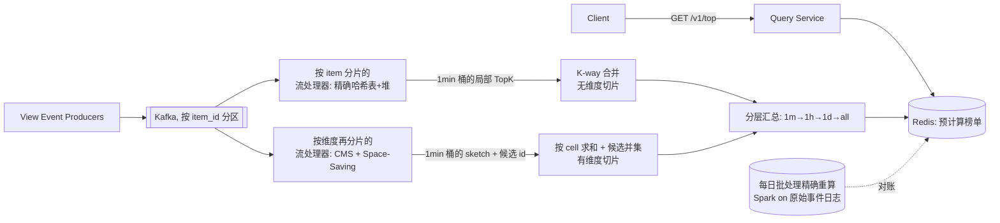

# 设计题解：实时热门榜与 Top-K 统计（Top-K & Trending / Heavy Hitters）

## 题目与范围

面试官通常这样开场："设计一个大规模内容平台的『热门榜』：给定任意一个时间窗口（比如过去
1 分钟、1 小时、1 天，或者从上线至今），返回观看/点击次数最高的 K 个内容。" 这道题表面上
是一个排序问题，真正的难点是**在无法为每个 item 保存精确计数的规模下，用有界内存给出一个
误差可控、可证明的近似答案，并且要同时维护好几种时间粒度、可能还要按维度切片**。

值得当场问清楚的澄清问题，以及它们各自改变的设计决策：

- **结果必须精确，还是允许有界误差？** 如果面试官要求绝对精确，题目退化成"如何把一个巨大
  的精确计数表做得足够快"（见「深入探讨」第 1 节的哈希表方案在什么规模下失效）；一旦接受
  有界误差，才轮到计数摘要（sketch）登场，本题按后者设计，因为这是这道题真正有意思的部分。
- **要同时支持哪些时间粒度？** 1 分钟、1 小时、1 天、全量这四档粒度的答案必须同时可查，而
  不是"来一个窗口大小就现算一次"——这决定了必须做分层聚合（见「深入探讨」第 4 节）。
- **要不要按维度切片（国家、内容类别）？** 决定聚合层是按 item 分片还是按维度分片，这两种
  分片方式下"如何正确合并"是完全不同的问题（见「深入探讨」第 5 节）。
- **计数的 key 是封闭集合（视频 id）还是开放集合（搜索词文本）？** 后者基数无上限，任何为
  每个不同 key 分配内存的结构都可能被攻击者用大量不同字符串撑爆，这是选择有界内存结构而
  不是"更大的哈希表"的根本原因，不只是省内存那么简单。
- **要不要处理刷量/反作弊？** 不处理——去重和防刷是计费级点击聚合问题的核心（见
  [[solution-ad-click-aggregation]]），本题只要求"观看计数尽量准确、误差有数学界"，不要求
  对抗性场景下的正确性。

**范围内**：多粒度滑动窗口的 Top-K 查询、精确计数与近似计数（Count-Min Sketch、
Space-Saving/Misra-Gries）的取舍、跨分片正确合并出全局结果。**范围外**：计费级去重与
exactly-once（见 [[solution-ad-click-aggregation]]）、内容推荐排序（这是排序模型问题，不是
计数问题）、下架内容的法务/审核流程。

## 需求

**功能需求（驱动设计的 4 条）**

1. 对预先定义好的几档时间窗口（1 分钟、1 小时、1 天、全量累计）分别查询 Top-K（K ≤ 1000）
   最多观看的内容，返回 item id 和估计观看次数。
2. 系统持续消费全量观看事件流，近实时更新每个窗口的榜单，而不是离线批处理一次。
3. 支持按维度切片查询（例如"某个国家的 Top-K"、"某个内容类别的 Top-K"），维度和窗口可以
   组合。
4. 已下架或被删除的内容必须从结果中排除，即使其历史计数仍然很高。

**非功能需求（数字化）**

- **查询延迟**：`GET /top` 读的是预计算好的榜单，P99 < 50ms。
- **新鲜度**：一个 1 分钟窗口关闭后，其榜单结果 P99 在 5 秒内可查询到；更粗粒度窗口的新鲜度
  可以更宽松（1 小时窗口 P99 < 30 秒），因为它们由更细粒度的桶汇总得到，不需要独立地追新鲜度。
- **准确性（近似计数的误差界）**：任何返回给用户的估计计数，其误差必须有可证明的数学界，
  且这个界要在设计里显式算出来，不是"经验上够用"——本题稍后会展示为什么这条要求本身就
  排除了"随便选一个 sketch 大小"的做法。
- **可用性**：读路径（首页/发现页展示热门榜）目标 99.99%；写路径（事件摄入）目标 99.9%。
- **一致性**：最终一致，近似计数在设计的误差界内即视为"正确"；不要求强一致或可审计
  （与 [[solution-ad-click-aggregation]] 的计费场景形成对比）。

## 容量估算

**流量：** 假设 DAU = 3 亿，平均每用户每天产生 200 次观看事件（短内容平台的刷屏场景）。

```
daily_views = 3e8 * 200 = 6e10（600 亿次/天）
avg_qps     = 6e10 / 86400 ≈ 694,444/s
peak_qps    = avg_qps * 3（日间峰值系数）≈ 2,083,333/s
```

每条事件约 120 字节（item_id 8B + user_id 8B + 时间戳 8B + 地理/设备/来源等元数据约 96B）：
每天原始摄入 `6e10 * 120 ≈ 7.2 TB`，峰值带宽 `2,083,333 * 120 ≈ 2.5×10^8 B/s ≈ 2 Gbps`——这个
数字决定了摄入层至少要用消息队列做缓冲和分区，不能让单机直接扛峰值。

**为什么"先定窗口内的总量 N，再定误差参数 ε"是不可跳过的一步：** Count-Min Sketch 的绝对
误差是 `ε × N`（N 是该窗口内的事件总量，推导见「深入探讨」第 2 节），**同一个 ε 在不同粒度
的窗口下误差完全不同**：

| 窗口 | N | ε=1e-4 绝对误差 | ε=1e-5 绝对误差 | ε=1e-6 绝对误差 |
|---|---|---|---|---|
| 全量/天（N=6×10^10） | 6×10^10 | 6,000,000 | 600,000 | 60,000 |

用 `python3 -c "w=lambda e: -(-2.718281828/e//1); print(w(1e-4), w(1e-5), w(1e-6))"` 算出对应
宽度 `w = ⌈e/ε⌉` 分别是 27,183 / 271,829 / 2,718,282，深度 `d = ⌈ln(1/δ)⌉`（取 δ=1e-3 时
d=7）。用 4 字节计数器，内存分别是 `27183*7*4=761,124B≈0.76MB`、`7.61MB`、
`2718282*7*4=76,111,896B≈76.1MB`。**如果为了省内存图省事选了 ε=1e-4，全天窗口的绝对
误差是 600 万次观看**——这比大多数"热门"内容一整天的观看量还大，榜单会完全不可信。本设计
在"全量/天"这一档粒度上选 **ε=1e-6, δ=1e-3**（76.1MB，绝对误差 6 万次），因为热门内容
一天的量级通常在千万级以上，6 万次的绝对误差换算成相对误差 <1%；`ε` 选多大，本质上是拿
"这一档窗口里最小的候选 item 大概有多少次观看"倒推出来的，不是拍脑袋。

**存储：** 内容目录假设 8000 万个 item 当天有过观看（假设，非真实平台数据）。若用精确哈希表
保存全天每个 item 的精确计数：每条记录 `item_id(8B) + count(8B) + 哈希表桶/指针开销
(~40B) = 56B`，`8×10^7 * 56 ≈ 4.48GB`——单机内存能放下，但见「深入探讨」第 1 节，这个数字
在加上多维度切片后会失控。

## 核心实体与 API

**核心实体**

- `Item`：`id`、`category`、`region`、`publishedAt`、`isActive`（下架标记，`false` 时从所有
  榜单里强制排除，即使计数结构里还留着它的痕迹）。
- `ViewEvent`（摄入层的原始记录，不对外暴露）：`itemId`、`userId`、`ts`（事件时间）、
  `region`、`category`、`sourceSurface`。
- `WindowBucket`（内部聚合状态，不对外暴露）：`dimensionKey`（如 `global` 或
  `country:US|category:sports`）、`granularity`（`1m|1h|1d|all`）、`bucketStart`、底层的
  sketch/候选集合。
- `TopKResult`：`dimensionKey`、`granularity`、`generatedAt`、`entries: [{itemId, rank,
  estimatedCount}]`、`errorBound`（这一档粒度当前配置下的绝对误差上界，让调用方知道两个
  估计值相差多少以内不代表真实排名不同）。

**API**

- `GET /v1/top?granularity={1m|1h|1d|all}&k={≤1000}&dim={global|country:US|category:sports}`
  → `TopKResult`。只读、幂等，可整体缓存（key 是 `granularity+dim`，不含用户身份）。
- `POST /v1/admin/exclude {itemId}`（内部管理接口，非公开）：把一个 item 加入下架名单，
  立刻在服务层过滤掉，不需要等计数结构里的痕迹过期。

**故意不做的**：没有"查询任意 item 在全网的精确排名"接口——那是另一个问题（单点精确查询
需要为该 item 补一次精确统计，而不是从近似结构里反推排名）；没有任意起止时间的自定义窗口
查询，只支持预先定义好的几档粒度，因为分层聚合（见「深入探讨」第 4 节）只对固定粒度成立；
没有客户端上报计数的写接口——计数只能来自内部事件流，杜绝伪造。

## 高层设计



- **摄入**：`Kafka`，256 个分区，按 `item_id` 哈希分区，保证同一个 item 的所有事件落在同
  一个分区——这是「深入探讨」第 5 节里"精确合并"的前提，不是随手的分片策略。
- **无维度切片的路径**：既然分区就是按 item 分的，每个分区里的 item 集合互不相交，分区内
  用普通**哈希表 + 大小为 K 的最小堆**维护精确计数（见「深入探讨」第 1 节），跨分区合并只是
  K 路归并，没有近似误差。
- **有维度切片的路径**：一个维度（如"国家=US"）的事件横跨所有 item 分区，无法用同一个
  item_id 分区方案覆盖，因此这条路径的流处理器改成按 `(维度, item_id 子哈希)` 再分片，每个
  子分片各自维护 **Count-Min Sketch**（计数）+ **Space-Saving**（候选 item 发现），用
  [[async.streaming.processing|Stream Processing]] 里讲的窗口/水位线机制驱动 1 分钟一个的
  tumbling bucket；跨子分片合并靠 CMS 的可加性（见「深入探讨」第 2、5 节）。
- **分层汇总**：1 分钟桶按 cell 求和滚动成 1 小时、1 天、全量（见「深入探讨」第 4 节），
  结果写入 `Redis`，`Query Service` 只读缓存，不现算。
- **对账（轻量提及，不是本题重点）**：每日跑一次基于原始事件日志的精确批处理（Spark），
  和流式结果的 `all`/`1d` 档对比，超出误差界的告警——完整的"流批对账"机制属于计费场景，
  详见 [[solution-ad-click-aggregation]]。

## 深入探讨

### 1. 精确计数：哈希表 + 堆，以及它在什么规模下失效

最直接的做法：每个 item 一个精确计数器（哈希表 `item_id -> count`），同时维护一个大小为 K
的最小堆，每次计数更新后与堆顶比较、O(log K) 替换。单个 item 分区（8000 万 item / 256 分区
≈ 312,500 个 item）精确算：`312,500 * 56B ≈ 17.5MB`，完全不是问题——**在按 item 分区、
单一维度、单一窗口粒度的场景下，精确哈希表 + 堆是对的方案，不需要上近似结构**。

它在两个方向上失效：

- **维度切片乘法效应**：一旦要同时支持"200 个国家 × 50 个类别"这样的切片，每个切片组合都
  要维护一份计数结构。假设每个切片-每分钟窗口下活跃 item 数是 1 万（假设），
  `200*50=10,000` 个切片组合，`10,000 * 10,000 * 56B = 5.6GB`——这只是*一个时刻*的内存
  快照，还没算上要同时维护 4 档窗口粒度；切片数一旦涨到几万，精确哈希表的内存直接线性
  失控，而这些切片大多数流量很小，为了给"日本 · 体育类"这种长尾组合也留一份 4.48GB 量级
  的精确表是不划算的。
- **开放基数的 key**：如果计数的对象不是封闭的 item 目录而是搜索词文本，哈希表大小和"见过
  多少个不同字符串"成正比，没有上界——攻击者只要不断构造新字符串就能把这张表撑爆，这不是
  内存优化问题，是可用性问题。

这两条共同指向：**只要"计数结构的数量"或"key 的基数"不受你控制，就必须换成内存大小与
基数无关的近似结构。**

### 2. Count-Min Sketch：用可控的过计数换固定内存，以及它为什么能跨节点相加

**结构：** 一个 `d × w` 的计数器矩阵，`d` 个成对独立哈希函数，每个哈希函数把 key 映射到
`[1, w]`。更新时对每一行 `j`，`count[j, h_j(item)] += 1`；查询时取 `min_j count[j,
h_j(item)]`——取最小值是为了对冲某一行发生哈希碰撞时的过计数。

**误差界（Cormode & Muthukrishnan, 2005，定理 1）：** 给定参数 `(ε, δ)`，取
`w = ⌈e/ε⌉`，`d = ⌈ln(1/δ)⌉`（`e` 是自然对数的底）。估计值 `â_i` 满足：**`a_i ≤ â_i`**
（永远不低估，因为碰撞只会让计数变大），且**以至少 `1-δ` 的概率，`â_i ≤ a_i + ε·‖a‖₁`**，
其中 `‖a‖₁` 是这个窗口内的事件总量 `N`。空间是 `O(w·d)`，与不同 key 的个数（基数）**无关**
——这正是它能解决第 1 节"开放基数"问题的原因。

沿用容量估算里的选择：`ε=1e-6, δ=1e-3` 给出 `w=2,718,282, d=7`，4 字节计数器，
`2,718,282*7*4 = 76,111,896B ≈ 76.1MB`（`python3 -c "import math;
w=math.ceil(math.e/1e-6); d=math.ceil(math.log(1/1e-3)); print(w,d,w*d*4)"`）。对比第 1 节
的 8000 万 item 精确哈希表 4.48GB，同一档窗口用 CMS 缩小到约 1/59。

**可加性（这是它能跨分片合并的根本原因）：** CMS 的更新规则对每个 cell 都是线性加法
（`count[j,h_j(i)] += c`），所以两个用**同一组哈希函数**独立维护的 CMS，逐 cell 相加得到的
结果，和把两路数据流合并成一路再喂给同一个 CMS 得到的结果完全一样——这是论文原文强调的
性质（"sketches...are typically linear functions of their input...easy to compute...by
casting them as computations on their sketches"）。1 分钟桶滚动成 1 小时、跨子分片合并，
都是靠这条性质，不需要重新扫一遍原始事件。

**代价：** CMS 只能回答"这个已知 key 的计数是多少"，不能回答"计数最高的 key 是哪些"——
它不能枚举。要拿到 Top-K，还需要一份候选 key 列表，这是下一节 Space-Saving 的活。

### 3. Space-Saving / Misra-Gries：有界候选集合，以及它的命中保证

**算法（Metwally, Agrawal, El Abbadi, 2005）：** 只保留 `m` 个计数器。新元素到达：如果它
已被监控，直接自增；如果没被监控，找到当前计数最小的被监控元素，**用新元素替换它**，新
计数器的值设为 `旧最小值 + 1`，并记录这次替换带来的过计数上界 `ε_i =` 旧最小值（用于事后
判断某个元素的排名是否"确定"，而不只是估计）。

**保证（定理 3）：** 不假设任何特定数据分布，只要 `m ≥ 1/ε`，**任何真实频次
`f_i > ε·N` 的元素，一定会出现在最终的候选集合里**——这是"零漏报"保证，不是概率保证，
Count-Min Sketch 没有这条（CMS 只保证已知 key 的计数误差有界，但从不承诺"漏掉的 key 一定
不重要"）。

反推参数：假设希望保证捕获到任何全天观看量 ≥ 50 万次的 item（这是一个基于"K=1000 时第
1000 名大概率不会低于这个量级"的设计假设，不是真实平台数据），`ε = 500,000 / 6×10^10 =
8.33×10^-6`，`m ≥ 1/ε = 120,000` 个计数器（`python3 -c "print(500_000/6e10,
1/(500_000/6e10))"`）。每个计数器 `item_id(8B)+count(8B)+ε_i(8B)+Stream-Summary 链表/桶
指针(~16B)=40B`，总内存 `120,000*40=4.8MB`——比第 1 节的精确哈希表 4.48GB 小约 933 倍，
同时仍然对"哪些 item 值得关心"给出确定性保证，这是它和 CMS 的分工：**CMS 负责"这个 key
的计数是多少、且可以跨节点相加"，Space-Saving 负责"哪些 key 值得问"**。

**它不能像 CMS 一样简单相加：** 两份 Space-Saving 摘要各自只认识自己见过的"值得监控"的
`m` 个元素，直接合并两份摘要（例如把两边计数器按 key 相加）不满足和"先合并原始流再跑一遍
Space-Saving"相同的保证——一个元素可能在分片 A 里从未挤进监控集合（因为 A 里比它热的
元素太多），但把两个分片的真实频次加起来后其实是全局候选。因此本设计只用 Space-Saving
的**候选 id 集合**做跨分片合并（取并集，是一个安全的超集），真正的计数交给 CMS 的 cell 
求和结果去查（见第 5 节）。

### 4. 同时维护几档窗口粒度：分层聚合，而不是各算一遍

四档粒度（1 分钟、1 小时、1 天、全量）如果各自独立地从原始事件流重新统计，等于把摄入
流量重复处理 4 次。本设计只在**最细粒度（1 分钟 tumbling window）**上直接消费事件，用
[[async.streaming.processing|Stream Processing]] 的窗口/水位线机制关闭桶，之后完全靠
**cell 级求和的滚动汇总**得到粗粒度：

- 1 小时 = 60 个 1 分钟桶的 CMS 按 cell 相加（`O(w·d)` 的一次加法，不重新扫事件）。
- 1 天 = 24 个 1 小时桶再相加；全量 = 每天的桶持续累加进一个长期 CMS。

这对 CMS 成立（上节的可加性），**对 Space-Saving 不成立**：粗粒度的候选集合不能靠合并细
粒度的候选集合摘要本身得到和"直接对粗粒度原始数据跑一遍 Space-Saving"相同的保证。折衷
方案：粗粒度窗口的候选集合 = 细粒度窗口候选集合的并集（并集是安全超集，可能包含一些
在粗粒度下其实不再是候选的 item，多查几次 CMS 而已，不影响正确性）＋ 一次针对这批候选
在合并后的 CMS 上重新排序取 Top-K。

### 5. 跨分片合并出全局 Top-K：两种分片方式，两种合并方式

这是这道题最容易出错、也最容易被面试官追问细节的地方，取决于「高层设计」里两条路径：

- **按 item_id 分区（无维度切片）**：分区之间的 item 集合**互不相交**，一个 item 的全部
  事件永远落在同一个分区，所以**每个分区本地的精确 Top-K 列表就是它对这些 item 的最终
  结论**，全局 Top-K 只是对 `S` 个分区各自的长度为 K 的有序列表做一次 **K 路归并**——没有
  近似误差，复杂度 `O(S·K·log S)`，`S=256, K=1000` 时是几十万次比较，毫秒级。**常见的错误
  做法**是不按 key 分区（比如轮询分片），这样同一个 item 的计数会分散在多个分片上，每个
  分片单独看它都排不进本地 Top-K，K 路归并会漏掉它——这不是归并算法的问题，是分片策略从
  根上就错了。
- **按维度再分片（有维度切片）**：同一个维度（如"国家=US"）的流量因为量太大还要再切分成
  多个子分片，这些子分片看到的是**同一个维度下互相重叠的 item 集合**（不是互不相交），
  所以不能简单地把各子分片的局部 Top-K 列表拼起来当结果——一个 item 完全可能在每个子分片
  上都不够热到进入该子分片的局部候选集合，但把所有子分片的份额加起来却是全局热门（例如
  一个内容被平均分散地在 8 个子分片上各刷了 1000 次，没有一个子分片单独把它排进候选集合，
  但全局是 8000 次）。正确做法：**每个子分片各自跑 Space-Saving 拿到候选 id 集合，取并集
  作为"值得问"的候选池；同时各子分片的 CMS 按 cell 相加得到这个维度的合并 CMS；用合并
  CMS 查询候选池里每个 id 的估计计数，按估计计数排序取前 K**。候选池的"零漏报"保证
  （第 3 节定理 3）加上 CMS 的可加性（第 2 节），共同保证了：**只要某个 item 在至少一个
  子分片上的份额超过了那个子分片的局部 ε 阈值，它就一定进了候选池**；而合并 CMS 给出的
  计数又满足第 2 节的误差界。这个条件不是自动成立的——如果一个 item 被极端均匀地切成
  比任何子分片的局部阈值都更薄的很多份（比第 3 节反推出的 `ε=8.33×10^-6` 对应的单分片
  份额还要薄），它在任何一个子分片上都不会被监控到，候选池并集也会漏掉它，这是这个方案
  相对"按 item_id 分区、无近似误差"路径的真实代价：**它不是绝对保证，是把"漏掉"的概率
  从"分片数任意大就必然发生"压低到"需要一个相当极端的均匀切分才会发生"**，选更小的 ε
  （更多 Space-Saving 计数器）能进一步压低这个风险，但不能把它变成 0——这一点和
  item_id 分区路径的精确保证是本质不同的，选择有维度切片的路径时要明确接受这个权衡。

## 瓶颈、故障与演进

**热点 item（skew）：** 按 item_id 哈希分区意味着一个突然爆红的内容，它的全部事件永远落在
同一个分区——分区内的流处理器会成为热点，其余 255 个分区却很闲。缓解手段是对探测到的热
key 做加盐（例如 `item_id + rand(0,15)` 生成 16 个子 key，事件按子 key 再打散到多个分区，
计数时再把 16 份精确子计数相加），这本质上是把"按 item 分区无近似误差"的路径临时退化成
"按维度再分片、cell 求和合并"的路径，只在检测到热点时触发，避免所有 item 都承担加盐带来
的多一次合并开销。

**流处理器故障：** [[async.streaming.processing|Stream Processing]] 的 checkpoint 机制
（周期性快照算子状态 + 输入位点）让节点重启只需要重放"最近一次 checkpoint 之后"的那段
事件，而不是从头重放整个窗口；这要求上游 `Kafka` 有足够长的保留期覆盖最坏情况下的重启+
追赶时间。

**Redis/serving 层故障：** 服务层只读缓存，缓存不可用时退化为"返回上一次成功写入的快照 +
`staleness` 标记"，而不是直接报错——对一个热门榜产品，稍微旧一点的榜单远好于空白页。

**10 倍演进（事件量 6×10^11/天，峰值 QPS 约 2083 万/s）：** CMS/Space-Saving 的内存只随
`1/ε` 线性增长、与 item 基数无关，如果要保持同样的绝对误差目标，只需要把 `ε` 缩小 10 倍
（宽度 `w` 变成约 2721 万，单个 CMS 内存约 761MB），仍然是可接受的量级；真正的瓶颈变成
「深入探讨」第 5 节里"cell 求和"合并这一步的扇入——子分片数会跟着流量线性增长，一个中心
节点直接接收几千个子分片的 CMS 做逐 cell 相加会成为新的单点，需要把合并从"扁平扇入"改成
"树形分层合并"（子分片先在机架/可用区内部两两合并，再往上一级合并），道理和 1 分钟桶滚动
成 1 小时窗口完全一样，只是合并的维度从时间换成了拓扑。

**100 倍演进：** 需要跨地域部署时，直接把所有地域的原始事件汇总到一处再合并 CMS 会消耗
大量跨地域带宽；改为每个地域先算出本地域的合并结果（CMS + 候选池），只在跨地域这一跳
传输"小得多"的候选池和对应 CMS（前文算过一个子分片的 CMS 只有几十 KB 到几 MB 量级），
跨地域链路的开销可以压低一个数量级以上，代价是全局榜单相对单地域实时性会多出一个地域间
同步周期的延迟。

## 面试官会追问什么

**中级：** "如果 K 从 1000 涨到 1 万，哪里会先出问题？" ——堆和候选池的大小是 `O(K)`
量级的，1 万依然很小，真正先顶不住的是 Space-Saving 里 `m` 和 `ε` 的关系：要保证"第 1 万名
以内一定进候选池"，需要按第 1 万名的期望频次重新反推更小的 `ε`（更多计数器），量级仍然可控，
但不再是"随手设个 m"。

**高级：** "为什么不干脆所有维度切片都精确算，反正现代机器内存很大？" ——不是内存放不下
一份精确表，而是内存要为**笛卡尔积**（维度组合数 × 窗口粒度数）里的每一份精确表付费，
这个数字随着产品加维度（先是国家，后面可能加设备类型、语言……）指数增长，而近似结构的
内存开销和维度组合数只是线性关系，且每份都很小。

**资深/Staff：** "Count-Min Sketch 和 Space-Saving 各自的误差保证性质不同（前者是概率性的
上界、后者是确定性的候选命中保证），能不能只用一个结构？" ——单独用 CMS 拿不到候选枚举
能力；单独用 Space-Saving 拿不到跨分片"精确相加"的性质（第 3 节）。工程上两者配合，本质是
在"能枚举"和"能合并"这两个各自都做不到全部的性质之间做拼接，这个拼接本身才是这道题的
核心设计决策，而不是选哪个数据结构。

## 常见错误

- **选 `ε` 不看 `N`**：CMS 的绝对误差是 `ε·N`，同一个 `ε` 用在"1 分钟窗口"和"全量窗口"上
  误差相差几个数量级（见「容量估算」的表）；先算清楚每一档窗口的 `N`，再倒推 `ε`，不要
  全局共用一个数字。
- **把局部 Top-K 列表直接拼接/截断当全局结果**：只有在分片之间 key 集合互不相交时才成立
  （按 item_id 分区）；一旦分片之间有重叠（按维度再分片），必须走候选池并集 + 合并计数
  重新排序的路径（第 5 节），否则会系统性漏掉"分散但整体很热"的 item。
- **把 Space-Saving 摘要当成可以像 CMS 一样逐 cell 相加的结构**：它不是——它只保证
  "自己见过的候选集合"里的命中，合并多份摘要时只能取候选 id 的并集，不能直接把计数器
  加起来当作合并后的精确估计。
- **窗口粒度各自独立从原始流重新统计**：见「深入探讨」第 4 节，4 档粒度会让摄入流量被
  重复消费 4 次；应该只在最细粒度上消费原始事件，粗粒度靠 cell 求和滚动得到。
- **忘记下架内容的过滤是服务层的事，不是计数结构的事**：从 CMS/Space-Saving 里"删除"一个
  已经被记过的 item 并不容易（这两种结构都不支持安全的删除操作），正确做法是服务层在
  返回结果前按 `Item.isActive` 过滤，而不是试图让计数结构忘记它。

## 五分钟讲法

I'd design this as two counting paths that share one insight: memory has to be bounded
independent of item cardinality, but the way I get correctness back depends entirely on
how I partition the stream. First, I capacity-plan from DAU and views-per-day into daily
and peak QPS, then compute, for each window granularity, the total event volume N that
window will see — because the Count-Min Sketch's error bound is epsilon times N, and
picking one epsilon for every granularity is the single most common mistake on this
problem. For the simple case with no dimension slicing, I partition ingestion by item ID,
so each shard owns a disjoint set of items and can keep an exact hash map plus a
size-K heap — merging shard results is then a lossless K-way merge, no sketch needed.
For dimension-sliced queries, where shards necessarily see overlapping item sets, I move
to Count-Min Sketch for counts — because its linear update rule makes it exactly
mergeable across shards and across time buckets by summing cells — paired with
Space-Saving for candidate discovery, because it gives a deterministic guarantee that any
item above a frequency threshold survives into the monitored set, something Count-Min
Sketch alone cannot do since it can't enumerate keys. I roll up windows hierarchically —
one-minute tumbling buckets summed into hours, days, and all-time — so raw events are
only ever processed once. And I handle hot items by salting their partition key once
detected, and handle failures through the stream processor's own checkpointing so
recovery only replays the gap since the last snapshot, not the whole window.

## 来源与延伸

- [Design Amazon's sales rank by category feature](https://github.com/donnemartin/system-design-primer/blob/master/solutions/system_design/sales_rank/README.md)
  —— 用 MapReduce 批处理做同一类问题的对照组：它把"每小时更新一次的类目内 Top 排行"当成
  离线批处理问题，写结果进 SQL 索引表。本题假设了近实时新鲜度（P99 秒级）而不是小时级，
  这是两者路线分叉的根本原因：批处理不需要 sketch，近实时才需要。
- [Top-K & Trending problem breakdown](https://www.hellointerview.com/learn/system-design/problem-breakdowns/top-k)
  —— 同样讨论了从精确计数升级到 Count-Min Sketch 的路径；本题在此基础上把 Space-Saving
  的确定性候选保证单独拿出来当第三个结构，并把"按 item 分区 vs 按维度分区"两种合并方式的
  正确性论证写清楚，这两点是它没有展开的部分。
- [An Improved Data Stream Summary: The Count-Min Sketch and its Applications](https://dsf.berkeley.edu/cs286/papers/countmin-latin2004.pdf)
  （Cormode & Muthukrishnan）—— 本题「深入探讨」第 2 节的误差界（定理 1）和可加性论证
  直接来自这篇论文；论文本身覆盖的点查询/区间查询/内积查询比本题用到的更广。
  <!-- no-archive: n/a，学术论文，非商业备考网站 -->
- [Efficient Computation of Frequent and Top-k Elements in Data Streams](https://www.cse.ust.hk/~raywong/comp5331/References/EfficientComputationOfFrequentAndTop-kElementsInDataStreams.pdf)
  （Metwally, Agrawal, El Abbadi）—— 本题「深入探讨」第 3 节的 Space-Saving 算法与定理 3
  的命中保证来自这篇论文；论文里还给出了 Zipf 分布下更紧的界（定理 4）以及和 Sticky
  Sampling、Lossy Counting、GroupTest 的对比，本题没有展开后者。
