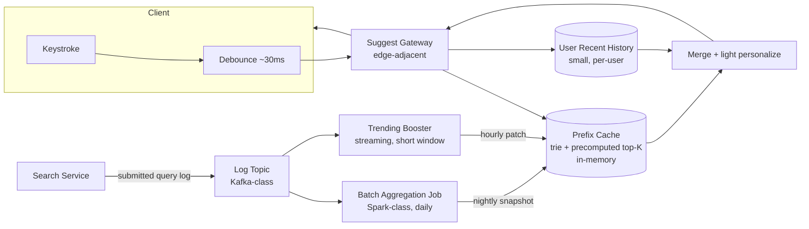

# 设计题解：输入联想与自动补全（Typeahead & Autocomplete）

## 题目与范围

面试官通常这样开场："设计一个像搜索框那样的输入联想功能：用户每敲一个字符，界面立刻弹出
一组按流行度排序的补全建议，延迟小到用户完全感觉不到卡顿。" 这道题的难点不在"怎么找出
以某个前缀开头的词"——这本身是教科书级的字符串问题——而在于**把它压到几十毫秒、还要在
几万 QPS 的按键级请求量下持续保持新鲜**：任何在请求路径上现算候选、现排序的方案都会在
这个延迟和流量的组合下崩溃，逼着几乎全部工作被挪到离线管道里提前算好。

值得当场问清楚的澄清问题，以及它们各自改变的设计决策：

- **补全建议来自历史查询词，还是来自站内实体（人名/公司名/商品名）？** 两者的离线数据源
  不同：前者聚合自查询日志，后者直接来自实体表本身、且新实体创建后要求几乎立刻可被联想到
  （参考 LinkedIn Cleo 的做法，见「来源与延伸」）。本题以前者（通用搜索框、基于历史查询
  日志聚合的 typeahead）为主线，因为它天然带出"离线聚合与采样""趋势新鲜度"这些本题真正
  的难点；在「深入探讨」第 4 节对比后者的实时性做法。
- **要不要个性化？** 决定是否需要在全局建议之上叠加一层轻量的用户侧重排（见「深入探讨」
  第 4 节），以及这层重排该多贵。
- **前缀最短触发长度是多少？** 通常从第 2 个字符起才触发联想（1 个字符的候选集合过大、
  区分度过低），这个阈值直接影响「深入探讨」第 1 节里存储估算的基数。
- **要不要做拼写容错/模糊匹配？** 不做——本题假设精确前缀匹配，模糊匹配是一个和分词、
  编辑距离相关的独立子问题，通常和查询纠错共享基础设施，不在本题展开。
- **建议本身要不要执行搜索、返回结果？** 不需要——本题只负责"建议候选查询词"，真正执行
  搜索、返回内容是独立的一步，见 [[solution-search-engine]]。

**范围内**：前缀数据结构的选型与构建、离线聚合管道（含采样）、趋势的新鲜度、轻量个性化
叠加、端到端 sub-100ms 预算（含客户端）。**范围外**：拼写纠错与模糊匹配、搜索本身的执行
与排序（见 [[solution-search-engine]]）、趋势检测本身的计数算法细节（滑动窗口精确/近似
计数，见 problems.search.top-k）。

## 需求

**功能需求（驱动设计的 3–5 条）**

1. 用户输入一个前缀（≥2 字符）后，系统返回按流行度排序的 top-K（K 通常取 5–10）条补全
   建议。
2. 建议要反映近期趋势，不能是几周前就冻结不变的静态列表。
3. 登录用户看到的建议可以基于其个人最近的查询历史做轻度重排。
4. 已下线/不再合法的内容对应的历史查询词，不应继续出现在建议里。
5. 客户端按键触发请求需要节流（debounce），不能每敲一个字符都直接打一次后端。

**非功能需求（数字化）**

- **端到端延迟**：从用户敲下一个字符到界面渲染出建议，P99 < 100ms——这个预算必须**包含
  客户端**（debounce 等待、渲染），不是纯服务端指标，具体拆分见「深入探讨」第 5 节。
- **新鲜度**：一个突然开始流行的查询词，从开始流行到出现在建议列表里，目标 P99 < 1 小时
  ——这个数字由「深入探讨」第 3 节里批处理窗口和趋势补丁窗口共同决定，不是拍脑袋定的。
- **可用性**：读路径（建议查询）目标 99.95%，但允许优雅降级（见「瓶颈、故障与演进」）——
  联想建议消失不应该阻塞用户手动输入完整查询词后提交搜索。
- **一致性**：建议列表是从查询日志和实体数据最终一致派生出来的只读视图，不要求强一致。

## 容量估算

**基础假设**（本设计的假设，不代表任何真实公司的数字）：日活用户（DAU）3 亿；人均每天
完成 3 次搜索提交（点击"搜索"或回车）；平均一次输入会话触发约 6 次联想请求（受节流限制，
不是每敲一个字符都发一次）。

```
searches/day = 3×10^8 × 3 = 900,000,000
submit QPS(avg) ≈ 900,000,000 / 86,400 ≈ 10,417

suggest requests/day = 900,000,000 × 6 = 5,400,000,000
suggest QPS(avg) ≈ 62,500 ，peak(×5) ≈ 312,500
```

**这个 6 倍是第一个决定架构的数字**：联想请求量是真正搜索提交量的 6 倍，而且每一次都
挂在 100ms 的硬预算下——如果联想请求要触碰任何比"内存里一次 O(前缀长度) 的查找"更重的
东西（比如查一次数据库、跑一次排序模型），62,500 QPS 的均值乘以这个额外代价就完全撑不住，
这直接把设计推向"提前把每个前缀的 top-K 算好放在内存里"这个方向（见「深入探讨」第 1 节）。

**前缀结构存储**：假设历史上出现过 5,000 万个不同的查询词，平均长度 15 个字符。如果
每个查询词的每一个前缀都各自建一个 trie 节点、节点间完全不共享（最坏情况上界）：

```
最坏情况节点数 = 5×10^7 × 15 = 7.5×10^8
每节点存 top-10 候选，每条 8 字节（queryId 4B + 打包后的分数 4B）：
每节点字节数 = 10 × 8 = 80 B
最坏情况总字节数 = 7.5×10^8 × 80 = 6×10^10 B = 60 GB
```

自然语言的前缀高度共享（很多查询词共享同一个开头），本设计假设一个折算系数——实际去重后
的节点数约为最坏情况的 20%：

```
折算后节点数 ≈ 7.5×10^8 × 0.2 = 1.5×10^8
折算后总字节数 ≈ 1.5×10^8 × 80 = 1.2×10^10 B = 12 GB
```

无论用 60GB 的保守上界还是 12GB 的折算估计，**整个前缀候选结构都能完整放进一台机器的
内存**（更不用说一个小型内存集群），这是「深入探讨」第 1 节里选择"预计算 top-K 缓存"而
不是"请求时现算"的容量依据。

**离线日志规模**：以提交的搜索（而非按键级请求）作为聚合信号，每条日志记录约 80 字节
（查询文本 + 时间戳 + 元数据）：

```
日志字节数/天 = 900,000,000 × 80 = 7.2×10^10 B = 72 GB/天
7 天滚动聚合窗口 ≈ 504 GB
```

72GB/天对一个批处理框架（Spark 一类）而言是很小的规模，这个量级下**完全不需要采样**——
采样只有在规模远大于这个数字时才成为必要（见「深入探讨」第 2 节和"100 倍演进"）。

## 核心实体与 API

**实体**

- **QueryLogEntry**（写入侧，只在提交搜索时产生，不是每次按键）：`queryText, userIdHash,
  timestamp`——用户 id 做哈希/脱敏处理，只用于个性化聚合，不用于展示。
- **PrefixSuggestions**（离线产出、在线只读的物化视图）：`prefix → topK[{query, score}]`——
  这是「深入探讨」第 1 节里选定的数据结构的核心产物，不是权威数据，可以随时从查询日志
  重新聚合出来。
- **UserRecentHistory**（在线、小、可变）：`userId → recentQueries[{query, weight,
  timestamp}]`——个性化叠加层的输入，见「深入探讨」第 4 节。

**API**

```
GET  /suggest?prefix=&limit=      → {suggestions: [{text}]}
                                     不返回内部排序分数，只返回展示文本和顺序
```

真正提交搜索、执行检索是独立的接口，属于 [[solution-search-engine]] 的 `GET /search`，
本题只消费它产生的日志作为聚合信号，不重复定义。

**故意不做的**：不支持前缀之外的模糊/编辑距离匹配；不在 API 层暴露离线管道的最近刷新
时间戳给客户端；不允许客户端指定排序权重或强制个性化开关（个性化的开启与融合比例是产品
侧通过 A/B 测试标定的参数，不是每次请求可调的选项）。

## 高层设计



**读路径**：客户端在每次按键后先做节流等待（默认约 30ms，见「深入探讨」第 5 节），确认
用户短暂停止输入后才发起请求，打到部署在离用户较近的 Suggest Gateway；Gateway 直接查
内存里的 Prefix Cache 拿到该前缀预计算好的 top-K，如果请求带用户身份，再用 User Recent
History 对这 top-K 做一次轻量重排（见「深入探讨」第 4 节），合并后原路返回。这条路径上
没有任何一步触碰数据库或跑排序模型——这正是容量估算里"62,500 QPS + 100ms 预算"这个组合
唯一撑得住的形态。存储技术类是**内存数据结构存储（Redis/自研内存服务一类）**承载 Prefix
Cache，因为需要 O(前缀长度) 的点查询、且允许周期性整体重建（呼应
[[caching.strategies|Write & Read Strategies]] 里缓存本身不是权威数据源的原则）。

**离线路径**：Search Service 提交的每条查询作为日志事件发到 Log Topic；一条**批处理
管道**（Spark 一类）按天聚合 7 天窗口内的查询频次，产出新的 `prefix → topK` 快照，整体
替换 Prefix Cache（见「深入探讨」第 1、2 节）；一条独立的**流式 Trending Booster**在短
时间窗口内做近似计数，把突然升温的查询词作为增量补丁合并进 Prefix Cache，而不用等到下一
次整体批处理（见「深入探讨」第 3 节）。这两条管道分工明确：批处理负责"长期稳定的流行度
排名"，流式补丁负责"响应突发热点"。

## 深入探讨

### 前缀数据结构：现算的 trie、预计算 top-K 的 trie、还是 FST

**问题**：给定一个前缀，要在 100ms 预算、62,500 均值 QPS 的量级下返回 top-K 候选，选
哪种数据结构？

**方案一：朴素 trie，请求时现算 top-K**。trie 天然支持前缀查找（O(前缀长度) 定位到某个
节点），但节点本身只是"这里有哪些后续字符"的路标，要拿到"以这个前缀开头、最流行的 K 个
词"，需要从该节点开始做一次子树遍历（DFS），收集所有以此为前缀的词再排序取 top-K。对
一个只有 1–2 个字符的热门前缀，子树可能覆盖数万到数十万个词，每次请求都重新遍历一次这
个子树——在容量估算给出的流量量级下完全不可行。

**方案二（本设计采用）：预计算 top-K 缓存在每个 trie 节点上**。离线聚合阶段就把每个
前缀节点对应的 top-K 算好、直接存在该节点上；在线请求只需要 O(前缀长度) 走到节点、
O(K) 复制返回，不做任何排序或遍历。容量估算已经证明整个结构（最坏情况 60GB，折算后
12GB）能完整放进内存，这是这个方案在存储成本上可行的依据；代价是"新词要进入某个前缀
的 top-K"依赖离线管道的刷新周期，不是即时生效的（见「深入探讨」第 3 节如何补这个短板）。

**方案三：FST（有限状态转换机，finite state transducer）**。ES/Lucene 的补全建议器
（completion suggester）用的就是这类结构——不只共享公共前缀，还共享公共后缀，压缩率
比 trie 更高：Lucene 的一个真实例子是把一个 1,000 万文档索引里的 980 万个词项压缩进一个
69MB 的 FST，用不到 256MB 堆内存、约 8 秒构建完成（见「来源与延伸」）。但 FST 的这种
紧凑表示是靠对**排好序的静态输入**一次性构建出最小自动机换来的——原文明确指出它不支持
增量更新，任何一次修改都需要从头重新构建整个结构。这和本题"新流行的查询词要在小时级内
反映到建议里"的新鲜度要求直接冲突，所以本设计的基础在线服务层用方案二（可增量патch的
trie + 预计算缓存），把 FST 这种更省内存但只读的结构留给"周期性整体重建的只读快照"这个
更窄的场景（见"10 倍演进"）。

### 离线聚合管道与采样：从提交日志聚合，而不是按键级流量

**问题**：容量估算给出两个数字——按键级联想请求量 5,400,000,000/天，真正提交的搜索只有
900,000,000/天，前者是后者的 6 倍。用哪个作为"这个词有多流行"的聚合信号？

**方案（本设计采用）：只用提交的搜索日志聚合，不用按键级请求**。按键级请求包含大量用户
中途改主意、打错字、还没打完就切走的噪声，不是"这个查询真的流行"的可靠信号；而且它的
量级是提交日志的 6 倍，用它做聚合只会让批处理管道处理 6 倍数据却换不来更准的排名。批处理
Job（Spark 一类）按天在 7 天滚动窗口（约 504GB 日志）上做 `(prefix, query) → count`
聚合，为每个前缀产出排序后的 top-K，整体替换 Prefix Cache 里对应的条目。

**采样在什么时候变得必要**：在本题的规模下（72GB/天），批处理框架完全处理得动，不需要
采样。但假设规模增长 100 倍（见"100 倍演进"，日志膨胀到约 7.2TB/天），对全部日志做精确
聚合的成本会显著上升，这时朴素地对全部事件做统一比例的均匀采样（比如只保留 1%）会伤害
长尾：一个全国范围内一天只被搜索 50 次的小众但真实存在的查询词，在 1% 均匀采样下期望
只被采到 0.5 次，用泊松分布估算，它**有约 60.7% 的概率在采样后的日志里完全消失**——
一个真实存在的补全候选就这样从来没有机会进入 top-K。正确做法是**头部均匀采样、尾部全量
计数**：对已经确认高频的热门前缀做统一比例下采样控制处理量，对计数还很低的长尾查询词
保留全量事件，直到其计数越过某个阈值才纳入采样范围——这样牺牲的是对头部排名精度影响
很小的抖动，保留的是对长尾候选生死攸关的信号。

### 趋势的新鲜度：批处理基线之上叠加一层流式补丁

**问题**：按天运行的批处理管道天然有至多一天的滞后——一个刚开始流行的查询词，要等到
下一次批处理跑完才可能进入某个前缀的 top-K，这和"目标 P99 < 1 小时"的新鲜度需求相差
至少一个数量级。

**方案（本设计采用）：独立的流式 Trending Booster，产出增量补丁而不是替换整个快照**。
在 Log Topic 上再挂一个流式聚合作业，只在一个较短的滑动窗口（比如最近 1 小时）内做近似
计数——这个近似计数本身的具体算法（精确 vs 近似、滑动窗口的实现）属于
problems.search.top-k 覆盖的范围，本题不重复展开。这个作业只产出"哪些查询词在这个短窗口
内的热度明显超出其历史批处理基线"的一个小增量集合，作为补丁合并进 Prefix Cache 对应
前缀的候选列表里（而不是重新计算整个 top-K），代价远小于重跑一次全量批处理，能把新鲜度
从"天级"压到"小时级甚至更短"。批处理基线负责长期稳定排名，流式补丁只负责响应突发。

### 个性化：轻量的用户侧叠加，而不是给每个用户复制一整套结构

**问题**：给每个用户单独维护一份完整的、个性化排序过的前缀结构代价有多大？假设每个
用户只保留最近约 20 条查询记录（每条约 100 字节，含分数），DAU 3 亿：

```
全量 per-user 历史缓存 = 3×10^8 × 2,000 B = 6×10^11 B = 600 GB
```

600GB，是「深入探讨」第 1 节里折算后的全局前缀结构（12GB）的**约 50 倍**——而这仅仅是
"最近 20 条查询"这么小的一份历史，还没有为每个用户重建一整套独立的前缀 top-K 结构。

**方案（本设计采用）：request 时对全局候选做一次轻量重排，而不是维护 per-user 的独立
结构**。User Recent History 只保存一个很小的、每用户独立的最近查询列表；在线请求命中
全局 Prefix Cache 拿到 top-K 候选后，如果请求带用户身份，再用这个小列表对候选做一次
轻量重排（比如把用户最近搜过的相关词适度提权），而不是从头构建一套只属于这个用户的
候选集合。这和 LinkedIn Cleo 公开介绍的"network-aware"个性化思路一致：区分"全局排名"
和"个人分数"两层，分别存储、融合权重可以独立调整（见「来源与延伸」）。

### 端到端 sub-100ms 预算：预算必须包含客户端

**问题**：如果只优化服务端响应时间，"用户感觉到的延迟"可能远超 100ms——debounce
本身就是主动引入的等待，是预算的一部分，不能被忽略不计。

**方案（本设计采用）：显式拆分预算，每一跳都有配额**：

```
客户端节流（debounce）等待   ≈ 30ms   （见下方说明，这不是纯粹的成本）
网络往返（部署在边缘节点）   ≈ 15ms
Prefix Cache 查找           ≈ 5ms
个性化重排                  ≈ 10ms
客户端渲染                  ≈ 10ms
——————————————————————————
合计                        ≈ 70ms，预留 30ms 抖动余量
```

Debounce 的 30ms 看似是纯粹的延迟成本，但它同时把容量估算里的"按键级请求量"从"每敲一个
字符发一次"压到了"人均每次输入会话约 6 次"——它是**延迟预算和后端负载的联合优化**，不
是单方面的取舍。网络往返之所以能压到约 15ms，前提是 Suggest Gateway 部署在离用户地理
上较近的边缘节点，而不是集中在一个远端数据中心——这是这条 15ms 配额成立的架构前提，不是
凭空假设的网络条件。

## 瓶颈、故障与演进

**热点与倾斜**：最短触发长度（2 个字符）以下的极短前缀候选集最大、离线聚合和缓存条目
本身也最贵，这是设定最短触发长度的直接原因；一个突然爆红的前缀（比如名人相关的查询词）
会被 Trending Booster 快速推高，如果不做基本的滥用检测（同一账号/IP 短时间内对同一查询
词的重复提交不能线性计入热度计数），这个补丁机制本身可能被刷量操纵。

**故障域**：

- **Prefix Cache / Suggest Service 不可用**：客户端优雅降级为不显示联想建议，用户仍可
  手动输入完整查询词并提交搜索——联想功能的缺失不应该阻塞搜索本身。
- **批处理聚合 Job 失败或延迟**：Prefix Cache 里的候选变陈旧但仍然可用，新鲜度 SLA 被
  违反，功能不中断。
- **Trending Booster 不可用**：退化为纯批处理产出的基线排名，缺少近期热度提升，体验
  下降但不中断。
- **User Recent History 存储不可用**：跳过个性化重排步骤，直接返回全局 top-K，功能
  降级但不失败。

**10 倍演进**：DAU 从 3 亿到 30 亿，折算后的前缀结构存储从约 12GB 增长到约 120GB——依然
可以放进一台大内存机器或很小的一个内存集群，架构不需要根本性改变。这个规模下，如果某些
前缀（对应的候选集合）已经稳定不再频繁变化，可以把这部分 Prefix Cache 的子集改造成
「深入探讨」第 1 节里方案三描述的 FST 只读快照，用 FST 更高的压缩率进一步节省内存，
代价是这部分快照只能整体周期性重建，不支持增量补丁——需要按"更新频率"把 Prefix Cache
拆成"可变的热区"和"只读的冷区"两部分分别处理。

**100 倍演进**：DAU 300 亿（纯粹推演），查询日志规模膨胀到 TB/天级，必须启用「深入探讨」
第 2 节讨论的头部采样/尾部全量策略来控制批处理成本；同时单机内存已经无法装下整个前缀
结构，Prefix Cache 需要按前缀的首字符（或首 N 个字符）分片到多个节点，查询时先用前缀
本身路由到对应分片，而不再假设"全部前缀结构都在一台机器上"。

## 面试官会追问什么

**中级（mid）**
- "为什么不直接对查询日志表做 SQL 的 `LIKE 'prefix%'`？" 数据库的前缀查询即使有索引，
  也没有预先算好 top-K 排序，每次请求都要重新排序候选，而且要在线承受全部联想请求的
  实时读压力——这在 62,500 均值 QPS、100ms 预算下不可行。
- "为什么客户端要做 debounce？" 不做 debounce 意味着每敲一个字符都发一次请求，把请求量
  推高到当前设计的 6 倍以上，而这些请求里绝大多数会被用户接下来的按键立刻作废。

**高级（senior）**
- "为什么不给 FST 做增量更新？" FST 的紧凑表示依赖对整批排好序的静态输入一次性构建出
  最小自动机，插入一个新词理论上要重新计算受影响的部分，工程上通常直接整体重建更简单，
  这和"新查询词要能快速反映"的新鲜度目标冲突，所以基础在线服务层选用支持局部增量补丁
  的 trie + 缓存结构，FST 只用于可以接受整体重建延迟的只读快照场景。
- "如果几乎所有联想请求都集中命中同一个热门前缀，怎么办？" 和信息流一题里名人热帖的
  读侧热点是同一个模式：把这个热门前缀对应的缓存条目复制到多个只读副本，按请求（而非
  按前缀本身）路由分散负载。

**参谋级（staff）**
- "Trending Booster 会不会被刷量操纵？" 会——如果不对输入做基本的异常检测，同一账号或
  IP 短时间内对同一查询词的重复提交理论上可以人为把一个不热门的词推上趋势列表；需要在
  流式计数之前对这类模式做基本的频次限制或去重，而不是假设查询日志天然可信。
- "个性化权重和全局权重的融合比例怎么定？" 这是一个需要通过 A/B 实验标定的产品参数，
  不是纯架构问题；但架构上需要保证"全局分数"和"个人分数"分开存储、独立可调，不需要为了
  调整融合比例重新构建整个前缀结构。

## 常见错误

- 每次按键都直接对主查询日志表现算排序，答不出 sub-100ms 是怎么做到的。
- 把 trie 当成万能答案，没意识到"请求时对子树现算 top-K"这个朴素做法在热门短前缀上代价
  极高，必须把 top-K 预计算并缓存在节点上。
- 只讲静态预计算，完全忽略新鲜度，被问"一个新流行的查询词要多久才能出现在建议里"答不
  上来。
- 把个性化设计成给每个用户复制一整套独立的前缀结构，没有做代价对比就直接采用。
- 把"sub-100ms"完全当成纯服务端问题，忽略客户端 debounce 本身既是延迟预算的一部分、
  也是控制后端负载的手段。

## 五分钟讲法

This is a typeahead system where the central constraint is serving on the order of tens of
thousands of requests per second under a hundred-millisecond budget, with every keystroke
as a potential trigger — about six times the volume of the actual searches those keystrokes
lead to. That ratio rules out anything that computes results on the request path, so the
core decision is to precompute the top-K completions for every prefix offline and cache
them in memory, sized at roughly a dozen gigabytes after accounting for how much natural-
language prefixes share structure, which comfortably fits on a single machine. I chose a
mutable trie with a precomputed top-K cached at each node over a more memory-efficient
finite state transducer, because an FST's compactness comes from being built once from
sorted static input — Lucene's own numbers show it compressing millions of terms into tens
of megabytes, but any single insertion requires rebuilding the whole structure, which
conflicts with needing new trending queries to show up within an hour rather than after the
next full rebuild. The offline pipeline aggregates from completed search submissions rather
than raw keystroke pings, since the pings are six times noisier and mostly incomplete
signal; at much larger log volumes, naive uniform sampling would silently drop legitimate
long-tail queries — a query typed only fifty times a day has roughly a sixty percent chance
of vanishing entirely under one-percent sampling — so sampling has to apply only to the
already-popular head, while the long tail is counted exactly. Freshness for sudden trends is
handled by a separate streaming layer that patches in a small set of surging prefixes
between full batch runs, rather than waiting for the next nightly rebuild. Personalization
stays a lightweight per-request rerank against a small per-user recent-history list rather
than a duplicated structure per user, since replicating even a small history for every
active user would cost fifty times more memory than the entire global structure. And the
hundred-millisecond budget is split explicitly across the client and the server — debounce,
network, lookup, personalization, and render — because client-side debounce is not just
latency cost, it's also what keeps the request volume itself down to something the backend
can serve.

## 来源与延伸

- [Elastic — Near real-time search](https://www.elastic.co/guide/en/elasticsearch/reference/current/near-real-time.html)：
  官方文档说明 Elasticsearch 的补全建议器（completion suggester）把候选结构整体保持在
  堆内存里以换取查询速度，构建成本高、通过 refresh 机制近实时对新写入可见。本题解在
  「深入探讨」第 1 节引用了它"in-memory、构建代价高"这一权衡，但把具体的数据结构选择
  和构建/更新代价论证成了本题解自己的对比（方案一/二/三），并用自己的容量估算重新算出
  了具体的存储数字。
- [Mike McCandless — Using Finite State Transducers in Lucene](https://blog.mikemccandless.com/2010/12/using-finite-state-transducers-in.html)：
  Lucene 提交者撰写的工程博客，给出了 FST 相比 trie 额外共享公共后缀带来的压缩效果的
  真实例子（980 万词项压缩进 69MB 的 FST，8 秒构建，堆内存低于 256MB），并明确指出 FST
  的紧凑表示不支持增量更新、任何修改都要从排好序的输入整体重建。本题解「深入探讨」第
  1 节直接引用了这个具体数字和这条限制，作为"基础在线服务层不选 FST、而是把它留给只读
  快照场景"这一决策的依据。
- [LinkedIn Engineering — Cleo: the open source technology behind LinkedIn's typeahead search](https://www.linkedin.com/blog/engineering/open-source/cleo-open-source-technology-behind-linkedins-typeahead-search)：
  披露了 LinkedIn 真实的 typeahead 服务 Cleo 的做法——基于实体（会员、公司、群组等）
  而非查询日志聚合，新实体创建后几乎立刻可被联想到，服务约 1.5 亿会员，平均响应时间约
  20 毫秒，并区分"network-agnostic"（纯全局流行度）和"network-aware"（结合个人社交
  网络的个性化）两种排序。本题解与它的分歧在于：本题解的主线场景（基于历史查询日志
  聚合的通用搜索框）和 Cleo（基于实体表的联想）数据源不同，新鲜度的实现方式因此也不同
  ——本题解需要一整套离线聚合管道（因为信号来自查询日志的统计聚合），Cleo 的信号直接
  来自实体表本身的变更，不需要经过统计聚合这一步；「深入探讨」第 4 节的个性化叠加思路
  借鉴了 Cleo 公开介绍的"全局分数与个人分数分层存储、独立调权"这一原则。
