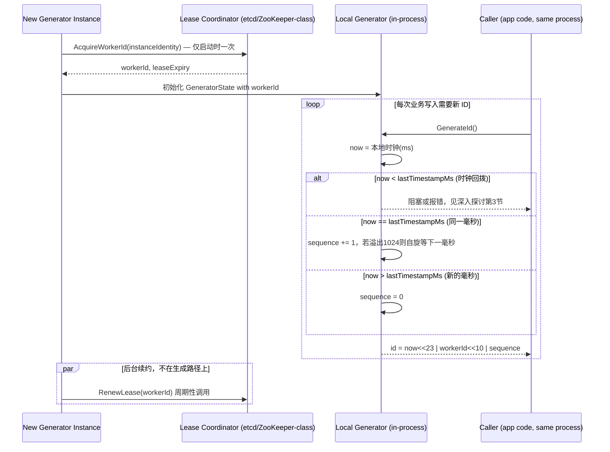

# 设计题解：唯一 ID 生成器（Unique ID Generator）

## 题目与范围

面试官通常这样开场："设计一个能生成全局唯一 ID 的服务，给公司内部各个业务系统的对象
（帖子、订单、评论、事件……）分配主键。要求 ID 大致按生成时间有序，系统要能水平扩展，
不能有单点。" 这句话背后的难点不是"怎么保证不重复"——随机数选够位数就不会撞——而是
**生成 ID 这件事本身不能在任何一次调用的热路径上依赖一个需要协调的中心组件，同时又要在
几十字节的预算内塞下"大致有序"这个看似矛盾的要求**（有序意味着信息要编码进 ID 本身，
而不是靠外部协调器保证）。

值得当场问清楚的澄清问题，以及它们各自改变的设计决策：

- **ID 必须严格递增，还是"大致按时间有序"就够？** 严格全局递增需要一个单点发号器
  （比如一个自增数据库序列），天然有吞吐上限和单点风险；"大致有序"（同一节点内严格
  递增，跨节点允许因时钟误差产生几毫秒的乱序）才能做到无协调生成——本题按后者设计，
  这是本题真正的难点所在。
- **ID 要不要对外暴露、能不能被猜测？** 决定要不要在业务语义上避免"ID 里编码的时间戳
  暴露了对象创建顺序或大致创建时间"这类信息泄漏——本题假设 ID 只作为内部主键和分页
  游标使用，不直接暴露业务含义（比如不能靠 ID 大小猜测平台总对象数）。
- **ID 要用在关系数据库的主键上吗？** 决定 ID 的字节宽度是否直接影响索引大小和写入
  局部性（见「深入探讨」第 5 节）——如果只是日志或消息的追踪 ID，这个约束就不成立。
- **生成节点的数量级和生命周期？** 是几十台长期运行的专用发号服务，还是成千上万个
  随扩缩容频繁重启的应用实例？决定「深入探讨」第 2 节的部署形态和「深入探讨」第 4 节
  worker id 该怎么分配。

**范围内**：ID 的位布局设计、无协调的分布式生成机制、时钟回拨与序列号耗尽的处理、
worker id 的分配与回收、和 UUID 方案的对比。**范围外**：具体业务对象的分库分表策略
本身（属于「Distributed Key-Value Store」和「Distributed Partitioning」相关题目）、
ID 到业务数据的映射逻辑、跨公司/跨系统的 ID 命名空间协调。

## 需求

**功能需求（驱动设计的 3–5 条）**

1. 任意两次调用生成的 ID 必须全局唯一，即使发生在同一毫秒、同一节点或不同节点上。
2. ID 大致按生成时间单调递增：同一生成节点上先生成的 ID 一定小于后生成的 ID；不同
   节点之间允许因时钟误差产生小范围乱序，但整体趋势必须是时间越晚 ID 越大。
3. 生成 ID 这一步骤本身不依赖任何跨节点的同步调用——每次生成必须能在本地完成，不受
   网络分区或另一个节点故障影响。
4. ID 用 64 位整数表示（而不是 128 位 UUID），以便直接作为关系数据库主键，减小索引
   体积、提升写入的 B 树局部性。
5. 生成节点可以水平扩展、可以因为部署滚动更新或扩缩容而频繁上下线。

**非功能需求（数字化）**

- **延迟**：单次生成的 P99 延迟 **< 1 ms**——这必须是纯本地操作，任何网络往返都不
  合格（这是本题和"分布式速率限制器"题最大的结构差异：那道题允许必要时同步查一次
  中心存储，这道题的核心约束是**生成路径上完全不允许**）。
- **吞吐**：单节点需要能承受突发写入，不能因为序列号耗尽而丢失或阻塞太久（见容量
  估算与「深入探讨」第 4 节）。
- **唯一性窗口**：ID 空间要覆盖足够长的时间跨度（数十年）才需要考虑位分配方案的
  迁移，不能几年内就把时间戳位数用完。
- **可用性**：生成服务不能有单点——任何一个生成节点故障，只影响它自己正在生成的
  ID，不影响其他节点，也不应该阻塞新节点加入。

## 容量估算

这道题的估算核心不是"每天生成多少 ID"（这个数字对现代硬件几乎从不构成压力），而是
**位预算该怎么在时间戳、节点标识、序列号三者之间分配，以及这个分配如何被"需要多少
个独立生成节点"这一个数字决定**。

**基础假设**：这是一个公司级的内部 ID 生成服务，服务于多种对象类型（帖子、订单、
事件等）；平均 20,000 ID/s，峰值系数 10（多个业务线的流量高峰叠加、加上促销/热点
事件带来的突发）：

```
peak QPS = 20,000 × 10 = 200,000 ID/s
```

**单节点吞吐上限由序列号位数决定**。如果用 12 位序列号（Snowflake 的选择），每
毫秒每节点可生成：

```
per-ms per-node = 2^12 = 4,096
per-second per-node = 4,096 × 1,000 = 4,096,000 ID/s
```

**这是第一个反直觉的数字**：平台级峰值 200,000 ID/s 远小于单节点理论上限
4,096,000 ID/s——也就是说，即使全公司所有 ID 生成需求压到一个节点上，12 位序列号
也绰绰有余，还留了 20 倍以上的余量。这说明这道题**从来不是吞吐问题**：多节点存在的
理由不是"一个节点扛不住"，而是**避免单点、避免生成路径上的跨节点/跨网络调用、以及
让每个应用实例或数据库分片就地生成、零网络跳数**。这个结论直接决定了「深入探讨」
第 1 节该怎么分配位预算——序列号位数没必要为了"更高吞吐"而占用太多，省下的位应该
换给节点标识位；本设计最终把序列号砍到 10 位（每毫秒每节点 1,024 个，即
1,024,000 ID/s，仍是现实峰值的约 5 倍），把腾出的位数用来扩大节点标识空间（见下）。

**节点标识位数由"需要多少个独立生成身份"决定，而不是由吞吐决定**。假设这个 ID
服务最终要嵌入到 5,000 个独立单元里生成（比如每个数据库逻辑分片各自生成，而不是
几十台专用发号机）：

```
所需 worker id 位数 = ceil(log2(5,000)) = 13
2^13 = 8,192 个可用身份，覆盖 5,000 个单元并留有增长空间
```

这正是 Instagram 公开选择 13 位分片 ID（而不是 Twitter Snowflake 的 10 位机器 ID）
的原因——见「深入探讨」第 1 节的详细对比。

**64 位整数 vs 128 位 UUID 的存储差异**：

```
ID/天 = 20,000 × 86,400 = 1,728,000,000
ID/年 = 1,728,000,000 × 365 = 630,720,000,000 ≈ 6.31×10^11
```

如果主键从 8 字节的 64 位整数换成 16 字节的 UUID，仅这一项差值：

```
每年多占用字节 = (16-8) × 6.31×10^11 ≈ 5.05×10^12 B ≈ 5.05 TB
三副本 ≈ 15.1 TB
```

这还只是主键本身；每一个引用这个 ID 的外键索引都会重复付出同样的额外开销——这是
「深入探讨」第 5 节里"为什么选 64 位而不是 UUID"的量化依据。

**结论**：这道题里，序列号位数的瓶颈几乎不存在（哪怕降到 10 位、每节点
1,024,000 ID/s，也仍有现实峰值约 5 倍的余量），真正该精打细算的是**节点标识位数
该给多大**（由需要多少个独立生成身份决定，不是吞吐）和**整体宽度该是 64 位还是
128 位**（由下游存储和索引成本决定）。

## 核心实体与 API

**实体**

- **SnowflakeId**（逻辑结构，不是存储实体）：`timestamp(41 bit), workerId(13 bit),
  sequence(10 bit)`——三段刚好拼满一个 64 位整数（41+13+10=64），采用「深入探讨」
  第 1 节里和 Instagram 相同的位分配。这个布局**没有**像 Twitter Snowflake 那样
  额外预留 1 位符号位（预留就会超过 64 位）：只有在 `timestamp` 字段的最高位仍是
  0 的前 2^40 毫秒（约 34.9 年，是「瓶颈、故障与演进」里 69.7 年时间戳寿命的一半）
  内，整条 64 位 ID 才保证能被当作有符号 64 位整数的非负数直接使用；这一点必须
  写进 API 文档，是比"41 位时间戳能用多久"更早到来的一条真实约束。
- **WorkerLease**：`workerId, ownerInstanceId, leaseExpiry, lastHeartbeat`——把
  8,192 个 worker id 当成一个租约池管理；这是本设计里唯一需要跨节点协调的状态，
  但只在生成节点**启动时**申请一次、后台低频续约，绝不在生成 ID 的热路径上出现。
- **GeneratorState**（每个节点进程内的本地状态，不持久化）：`workerId, lastTimestampMs,
  sequence`——用于检测同一毫秒内的序列号递增和跨毫秒的时钟回拨。

**API**

```
GenerateId(entityTypeHint?) → int64
  纯本地调用（进程内函数或同机 IPC），不是一次网络请求；entityTypeHint 只用于
  可观测性打标签，不改变 ID 结构本身。

AcquireWorkerId(instanceIdentity) → { workerId, leaseExpiry }
  生成节点启动时调用一次，向 WorkerLease 池申请一个空闲 id；失败（池耗尽）时
  节点无法启动，需要告警而不是静默退化。

RenewLease(workerId, instanceIdentity) → { leaseExpiry }
  后台周期性调用（如每 leaseExpiry/3 的间隔），不在生成路径上；租约过期未续约的
  workerId 会被回收进池子供新节点使用。
```

**故意不做的**：不支持业务方指定 ID 的具体数值（避免绕过唯一性保证）；不在生成
接口里做任何跨节点同步等待；不承诺严格全局单调（只承诺"大致有序 + 同节点严格
单调"），这个边界必须在 API 文档里明确写出来，否则调用方会误用 ID 做跨节点的
精确事件排序。

## 高层设计



**生成路径**：`GenerateId()` 是一次纯本地函数调用——读本地时钟、和上次生成的时间戳
比较、决定序列号是递增还是清零——全程没有任何网络 I/O，这就是为什么它能满足 < 1ms
的延迟目标且不受其他节点或网络状况影响。技术选型上，`GeneratorState` 不需要任何
存储技术：它是进程内存里的三个整数，随进程重启而重置（重启后从新的 `lastTimestampMs`
继续，不需要持久化历史状态，因为时间戳本身来自系统时钟，天然递增）。

**启动路径**：`AcquireWorkerId` 是本设计里唯一触碰到跨节点协调的地方，使用**分布式
协调服务（etcd/ZooKeeper 一类）**做租约管理，因为需要强一致的"同一个 workerId 同一
时刻只能被一个实例持有"保证，而这类服务正是为这种低频、强一致的协调场景设计的——
关键在于它只发生在实例启动和续约时，从来不在 `GenerateId()` 的调用路径上，所以
协调服务的可用性和延迟完全不影响 ID 生成本身的延迟和可用性。

## 深入探讨

### 位预算分配：为什么 Instagram 用 13 位分片 ID 而 Twitter Snowflake 用 10 位机器 ID

**问题**：64 位要在时间戳、节点标识、序列号三者间分配，位数此消彼长——多给一段就要
从另一段里扣。容量估算已经证明序列号的吞吐远超现实需要，那么省下的位该怎么花？

**方案一（Twitter Snowflake 的真实设计）：41 位时间戳 + 10 位机器 ID（5 位数据中心
+ 5 位机器）+ 12 位序列号**。10 位机器 ID 支持最多 1,024 个独立生成身份，这个数字
是"运行多少台专用发号服务"这个假设下的合理值——Snowflake 最初就是几十到上百台专用
daemon 组成的独立服务。

**方案二（Instagram 的真实设计）：41 位时间戳 + 13 位分片 ID + 10 位序列号**。
Instagram 没有部署一套独立的发号服务，而是**直接在每个 Postgres 逻辑分片内用
PL/PGSQL 函数生成 ID**（作为 `nextval()` 的替代实现），逻辑分片数量远大于物理机器
数量（为了未来重新分配分片到不同物理机器时不用重新分片），所以需要比 1,024 大得多
的身份空间——13 位对应 8,192 个身份。序列号从 12 位降到 10 位（每毫秒每分片上限从
4,096 降到 1,024），因为容量估算已经说明这远超单个分片实际写入速率的需要。

**方案三（本设计采用）**：跟随 Instagram 的推理路径而不是照搬 Twitter 的具体数字——
本设计假设的部署形态是"嵌入到数千个独立单元"，容量估算里 `ceil(log2(5,000))=13`
恰好落在 Instagram 的选择上，所以本设计取 41 位时间戳 + 13 位 workerId + 10 位
序列号。这个对比说明一个更一般的原则：**位预算的分配应该由"你把生成逻辑放在哪一层、
需要多少个独立身份"决定，而不是抄一个知名系统的具体数字**——如果本设计改成"几十台
专用发号机"的部署形态，10 位机器 ID 反而更合适，省下的 3 位可以还给序列号或直接
缩短总宽度。

### 生成逻辑该放在哪一层：独立发号服务 vs 嵌入式生成

**问题**：如果把 ID 生成做成一个独立的网络服务（调用方发一个 RPC 请求换一个 ID），
表面上架构更"干净"（生成逻辑集中、易于升级），但这恰恰重新引入了本题一开始就要
避免的东西——生成路径上的一次网络往返和一个新的可用性依赖。

**方案一：独立的 ID 生成微服务**，业务代码通过 RPC/HTTP 调用它换取一个 ID。代价：
每次业务写入都多一跳网络调用，这一跳的延迟和可用性直接叠加进业务写入的关键路径——
如果这个服务的某个实例过载或该可用区网络抖动，所有依赖它的业务写入都会被拖慢，
这和"分布式速率限制器"题里"同步查中心 Redis"给关键路径带来尾延迟风险是同一类问题。

**方案二（本设计采用）：把生成逻辑做成一个嵌入到调用方进程（或同机 sidecar）里的
库**，只在启动时向轻量协调服务申请 workerId，运行期间完全本地。代价是需要给每个
独立部署单元分配并管理一个 workerId（增加了运维上"谁持有哪个 id"的可见性需求），
但换来的是生成路径彻底没有网络依赖，符合 < 1ms 延迟目标，也符合"生成节点故障只
影响它自己"的可用性要求。Instagram 把生成逻辑直接下推到数据库分片内部（PL/PGSQL
函数），是这个方向更极端的版本——生成和写入在同一个数据库事务里完成，连"进程内
库调用"这一层跳跃都省了。

### 时钟回拨：本地单调性被打破时怎么办

**问题**：`GenerateId()` 依赖读本地系统时钟来产出时间戳段。[[distributed.time.clocks|
Clocks & Timestamps]] 里已经说明时间日期时钟会因为 NTP 步进而**向后跳变**——如果某次
调用读到的 `now` 小于上一次生成时记录的 `lastTimestampMs`，天真的实现会用这个更小的
时间戳继续生成，产出一个数值上可能小于（或撞上）之前已经生成过的 ID 的新 ID，直接
违反"同节点严格单调"的核心保证。

**方案（本设计采用）**：`GenerateId()` 显式比较 `now` 和 `lastTimestampMs`；一旦
检测到 `now < lastTimestampMs`，立即拒绝生成（返回错误让调用方重试，或阻塞等待
本地时钟追上 `lastTimestampMs`），而不是"将错就错"用回拨后的时间戳继续生成。假设
一次 NTP 步进让本地时钟回拨 100ms，在阻塞策略下，该节点在这 100ms 内暂停生成——
按本题平均 20,000 ID/s 的速率估算，相当于这一个节点上约 2,000 个 ID 的生成需求
在这段时间内被推迟（如果调用方能容忍短暂重试/排队，这不是丢失，只是延迟；如果不能
容忍，需要把这部分请求路由到其他节点）。这笔账说明：把"检测时钟回拨"这件小事漏掉，
换来的不是理论上的小概率问题，而是一次真实 NTP 步进（[[distributed-clock-error-
sources|Clock Error Sources]] 里提到的"步进修正"完全可能达到这个量级）就会触发的
真实故障模式。

### 序列号耗尽与 worker id 耗尽：两种不同量级的"用完了"

**问题**：这套机制里有两处"位数会不会不够用"，但量级和后果完全不同，容易被混为
一谈。

**序列号耗尽（毫秒级，几乎不会发生但必须处理）**：本设计选的 10 位序列号每毫秒每
节点最多 1,024 个 ID（对应 1,024,000/s，容量估算已算出这仍是现实峰值 200,000/s
的约 5 倍）。万一某个节点在极端瞬时突发下真的在 1ms 内用完了 1,024 个序列号，标准
做法是**自旋等待下一毫秒 tick 到来**再继续生成，而不是让序列号回绕（回绕会产生和
之前同毫秒内已发出的 ID 重复的数值）。这个等待最坏情况下也就是不到 1ms 的停顿，
代价可以接受——但比起 Twitter 原版 12 位序列号 20 倍以上的余量，本设计因为把位数
换给了 worker id，余量收窄到约 5 倍，这是「深入探讨」第 1 节里位预算权衡的直接
代价，需要在面试里主动说清楚，而不是含糊带过。

**worker id 耗尽（部署规模级，后果严重得多）**：13 位 worker id 支持 8,192 个身份，
一旦实际部署单元数量逼近或超过这个上限（比如从 5,000 涨到 100 倍演进讨论的规模），
`AcquireWorkerId` 会开始失败，新实例根本无法启动，这不是"稍等一下"能解决的问题。
必须靠 `WorkerLease` 的过期回收机制（不活跃/已下线实例的 id 及时被收回复用）来
延缓耗尽，长期看则需要规划一次位布局迁移（把 worker id 位数扩大，这不是热更新，
需要新旧 ID 空间并存的迁移期）——这是「瓶颈、故障与演进」100 倍演进部分的核心议题。

### 和 UUID 方案的对比：牺牲协调换随机性，还是牺牲随机性换协调

**问题**：本设计选的 Snowflake 风格 64 位 ID 需要一次性的 worker id 分配（哪怕只在
启动时），而 UUID 类方案理论上完全不需要任何协调——这是不是意味着 UUID 更简单、
应该优先选它？

**方案一：UUIDv4（纯随机）**。122 位随机数，生成完全本地、零协调、零状态。代价：
完全不按时间排序，作为数据库主键插入时是随机写入模式，破坏 B 树的顺序写入局部性
（UUIDv7 的 RFC 文本明确把这一点作为 v4 的已知缺点提出，见「来源与延伸」），而且
16 字节的宽度是本设计选择的 64 位整数的两倍，容量估算里已经算出这一项差值一年
就是约 5 TB 额外存储。

**方案二：UUIDv7（IETF RFC 9562 标准化的新版本）**。48 位毫秒级 Unix 时间戳 + 4 位
版本号 + 12 位 `rand_a` + 2 位变体位 + 62 位 `rand_b`，其中 `rand_a`/`rand_b` 既可以
纯随机填充，也可以按 RFC 给出的方法之一当作计数器用来保证同一毫秒内的单调性。纯
随机模式下，在本设计假设的峰值 200 ID/ms（跨全平台所有节点合计）下，74 位随机空间
（`rand_a`+`rand_b`）的生日悖论碰撞概率约为 1.05×10⁻¹⁸／毫秒，换算成一整天不间断
按这个峰值运行、连续 8,640 万个毫秒窗口都不出现任何一次碰撞的概率极高（约等于
碰撞概率乘以窗口数仍趋近于 0）——说明即使不使用计数器模式，纯随机的 UUIDv7 在这个
规模下实际不会因为随机性本身而撞车。UUIDv7 相比 UUIDv4 保留了时间戳前缀带来的排序
局部性，且完全不需要任何 worker id 分配或协调——代价是 128 位宽度仍然是本设计
Snowflake 风格 ID 的两倍，且默认的毫秒级时间戳分辨率（不使用计数器模式时）不保证
同一毫秒内的生成顺序，只保证跨毫秒的大致有序。

**本设计的选择**：坚持 64 位 Snowflake 风格 ID，因为本题的非功能需求明确要求"直接
作为关系数据库主键、控制索引宽度"（64 位在这一点上天然占优），而"启动时申请一次
worker id"这个唯一的协调点，代价远小于把主键宽度翻倍。如果场景换成"跨组织边界生成、
连启动时的一次性协调都做不到"，UUIDv7 会是更合适的选择——这正是面试里"根据场景
换答案"的地方，两个方案没有绝对的优劣，只有和约束匹配不匹配。

## 瓶颈、故障与演进

**热点与倾斜**：这套机制天然没有单一"热点"——每个 worker 独立生成，没有共享的
可变状态需要竞争。唯一的准入热点是 `WorkerLease` 协调服务在大规模同时上线（比如
一次性滚动重启数千个实例）时可能出现短时间内大量 `AcquireWorkerId` 请求，但这个
量级是"实例数"而不是"ID 生成速率"，远小于业务流量本身，通常不构成真实瓶颈。

**故障域**：

- **单个生成节点崩溃**：只影响它自己正在处理的那一次调用（调用方看到的是本地库
  调用失败，等同于进程崩溃），完全不影响其他节点的生成能力；节点重启后重新走
  `AcquireWorkerId`（如果原 workerId 租约还没过期会失败，需要等待旧租约过期或
  显式释放）。
- **Lease Coordinator 不可用**：新节点无法启动（`AcquireWorkerId` 失败），但**已经
  在运行**的节点完全不受影响——它们不需要和协调服务再通信，直到下一次续约到期。
  这是"生成路径和协调路径彻底解耦"带来的直接好处。续约失败超过租约有效期后，节点
  应该主动停止生成（避免和被误回收后分配给别人的同一个 workerId 冲突），而不是
  假装一切正常继续生成。
- **本地时钟异常**（回拨、长时间停止）：见「深入探讨」第 3 节，节点级降级（暂停
  生成），不扩散到其他节点。

**10 倍演进**：平均 QPS 从 20,000 到 200,000，峰值总量从 200,000 涨到 2,000,000。
这个总量已经超过单节点 1,024,000/s 的理论上限——但这从来不是问题，因为流量本来就
分散在数千个独立部署单元上：按 5,000 个单元平均，每节点均值不到 400/s，即使流量
分布不均，单节点也极难撞上 1,024,000/s 的上限。真正开始承压的是部署单元数量本身
——如果这一步同时伴随部署单元从 5,000 涨到接近 1 万，13 位 worker id（8,192 个
身份）会开始出现压力，需要更积极的租约回收策略（更短的心跳间隔、更快地收回下线
实例的 id），而不是立刻扩位。

**100 倍演进**：部署单元数量远超 8,192，13 位 worker id 空间本身耗尽，必须扩大
worker id 位宽——这不是一次热更新：新旧位布局并存的迁移期内，下游任何"用 ID 大小
做粗略时间排序或分页"的业务逻辑都必须能同时理解两种位布局，通常的做法是借用
时间戳段最高的若干位做一个版本标记（本设计的 41+13+10=64 布局已经用满全部 64 位、
没有预留位，所以扩位必然要从时间戳段本身借位，进一步压缩可用的时间戳跨度，
以及「核心实体与 API」提到的、比时间戳跨度更早到来的 34.9 年非负数边界）——这是
这道题里唯一一处"演进代价不能完全避免、只能规划"的地方，值得在面试里主动提出来，
而不是假装位布局可以无限期不变。

## 面试官会追问什么

**中级（mid）**
- "两个不同节点会不会生成出一样的 ID？" 不会，只要每个节点持有的 workerId 全局
  唯一（由 WorkerLease 保证）——不同节点的 `(timestamp, workerId, sequence)` 三元组
  在 workerId 这一维上天然不相交。
- "为什么不直接用数据库自增主键？" 自增主键需要所有写入经过同一个数据库实例做
  序列化，本质是一个单点发号器，无法在多个独立数据库分片间无协调地工作。

**高级（senior）**
- "序列号只有 10 位，够用吗？" 容量估算已经算出 1,024,000/s 的单节点上限仍是现实
  峰值的约 5 倍，序列号从来不是这道题的瓶颈，真正该关注位预算的是 worker id 段。
- "时钟被人为调快又调回来，会不会生成重复 ID？" 如果调快期间生成了一批"未来"时间戳
  的 ID，调回来后本地时钟会小于 `lastTimestampMs`，触发时钟回拨保护逻辑而暂停生成，
  不会生成重复 ID，但会短暂不可用——这也是为什么生产环境要对系统时钟的人为调整
  设置严格的运维门槛。

**参谋级（staff）**
- "worker id 位宽耗尽后，怎么在不停服的情况下完成位布局迁移？" 需要新旧布局共存的
  过渡期，通常靠预留的版本位或扩展时间戳段来区分，下游所有依赖"ID 单调"语义的代码
  都要在迁移期内做兼容处理，这是一次需要提前规划、涉及多个下游团队协调的迁移，
  不是生成服务自己能单方面完成的。
- "如果需要跨多个云厂商/跨公司边界生成 ID，还能用这套机制吗？" 这套机制假设"公司
  内部有一个可信的协调服务能分配 worker id"，跨组织边界这个假设通常不成立，这种
  场景更适合 UUIDv7（不需要任何跨组织协调），代价是接受 128 位宽度和较弱的同毫秒
  排序保证。

## 常见错误

- 把这道题当成"怎么保证不重复"来回答，只讲随机数位数够不够，没有意识到真正的难点
  是"生成路径不能有网络依赖"这个结构性约束。
- 序列号位数拍脑袋定得很大（比如 20 位）以为"吞吐越大越安全"，却说不出这样做要
  从时间戳或 worker id 段里扣掉多少位、以及扣掉之后 worker id 空间或时间戳跨度
  会不会不够用。
- 把"worker id 分配"这个启动时的一次性协调，和"生成 ID 本身"这个高频操作混为一谈，
  以为整个系统都依赖协调服务的实时可用性。
- 没有处理时钟回拨，或者处理方式是"忽略，继续用当前时间戳生成"，这会在 NTP 步进
  发生时真实产生违反单调性甚至重复的 ID。
- 不假思索地选 UUID 因为"零协调最简单"，没有算清楚 128 位相对 64 位在数据库主键和
  索引上的具体存储代价，也没考虑随机写入对 B 树局部性的影响。

## 五分钟讲法

This is a unique ID generator that has to produce roughly time-ordered 64-bit ids on every
single write, with zero network calls allowed on that hot path — that constraint is the
whole design. Each id packs a millisecond timestamp, a worker id, and a per-millisecond
sequence number into 64 bits, and the sequence-number budget turns out to be wildly
oversized for realistic traffic — a twelve-bit sequence gives one node over four million ids
a second, far more than any real peak — so the real question isn't throughput, it's how many
independent generator identities you need, which is what should decide how many bits go to
the worker-id field rather than copying a well-known system's exact split. I embed the
generator as a local library inside each deployment unit rather than standing up a separate
id-generation service, because a network call on every id request just reintroduces the same
kind of tail-latency dependency this design exists to avoid; the only coordination happens
once, at startup, when an instance leases a worker id from a coordination service, and
that lease is renewed in the background, never on the generation path. Clock rollback is the
sharp edge: if the local clock ever reads earlier than the last timestamp this node already
used, the generator has to refuse to produce new ids rather than silently reusing an earlier
timestamp, because that's exactly how you'd produce a duplicate or out-of-order id, and a
hundred-millisecond NTP step translates directly into that many milliseconds of paused
generation on that one node. Compared with UUIDs, this design trades a one-time worker-id
lease for a narrower 64-bit width and genuine timestamp-prefix ordering; UUIDv7 gets the
same rough time-ordering with zero coordination ever, at the cost of double the storage
footprint and weaker same-millisecond ordering unless it spends bits on a counter. At scale,
sequence exhaustion is a sub-millisecond hiccup handled by spinning to the next tick, but
worker-id exhaustion is the real long-term risk — once deployed units approach the id
space's ceiling, expanding it means running two bit layouts side by side during a migration
window, which is the one place in this design where the cost genuinely can't be engineered
away, only planned for.

## 来源与延伸

- [Twitter Engineering — Announcing Snowflake](https://blog.x.com/engineering/en_us/a/2010/announcing-snowflake)
  （Twitter/X 工程博客，一手来源）：公开了最初的位布局方案——1 位符号位固定为 0、
  41 位毫秒级时间戳（自定义纪元 1288834974657ms，对应 2010 年 11 月 4 日）、10 位
  机器标识（5 位数据中心 + 5 位机器）、12 位序列号，每毫秒每机器最多 4,096 个 id，
  以无协调、按时间大致有序为设计目标。本文档在「深入探讨」第 1 节把这套具体数字
  当作一种部署形态（专用发号机群）下的合理选择，并用 Instagram 的不同选择对比出
  "位预算该由需要多少独立生成身份决定"这条更一般的结论，而不是把 Twitter 的具体
  数字当作唯一正确答案。
- [Instagram Engineering — Sharding & IDs at Instagram](https://instagram-engineering.com/sharding-ids-at-instagram-1cf5a71e5a5c)
  （Instagram 工程博客，一手来源）：披露了 Instagram 的真实变体——41 位时间戳
  （自定义纪元 1314220021721ms，对应 2011 年 8 月 24 日）、13 位逻辑分片 ID、10 位
  序列号，用 PL/PGSQL 函数直接嵌入 Postgres 的 `nextval()` 实现，让 ID 本身的排序
  和 `created_at` 排序一致，省去单独的时间索引。本文档「深入探讨」第 2 节直接采用
  了它"把生成逻辑下推到数据层、不做独立服务"的思路作为本设计嵌入式生成的更极端
  参照系，并在容量估算里用 `ceil(log2(5,000))=13` 独立算出了和 Instagram 相同的
  位数，作为"这不是巧合，而是同一类推理"的交叉验证。
- [IETF RFC 9562 — UUID Version 7](https://www.rfc-editor.org/rfc/rfc9562.html)
  （IETF 标准文档，一手来源）：定义了 UUIDv7 的精确位布局——48 位毫秒级 Unix
  时间戳、4 位版本位、12 位 `rand_a`、2 位变体位、62 位 `rand_b`，并给出了用
  `rand_a`/`rand_b` 的组合实现同毫秒内单调性的三种方法，明确指出相比 UUIDv4 的
  改进在于"自然的时间排序"和"更好的数据库索引局部性"。本文档「深入探讨」第 5 节
  用这份规范里的位布局，独立算出了本设计场景下纯随机模式的生日悖论碰撞概率
  （约 1.05×10⁻¹⁸／毫秒），以此论证即使不使用计数器模式，UUIDv7 在这个规模下也
  不会因为随机性本身撞车——这个量化结论是本文档自己算出的，规范原文没有给出。
