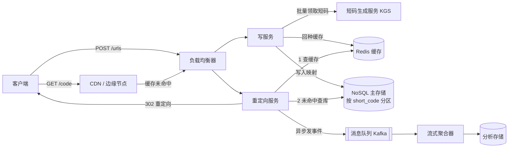

# 设计题解：短链接服务（URL Shortener）

## 题目与范围

面试官通常这样开场："设计一个类似 Bitly / TinyURL 的短链接服务：用户提交一个长网址，系统返回一个短网址；任何人访问这个短网址都会被重定向（redirect）到原始网址。"

**值得先问、并且答案会改变设计的澄清问题：**

- **谁能创建短链？匿名用户还是需要 API Key/登录？** 答案决定要不要做配额与滥用防护（abuse prevention），以及自定义别名（custom alias）的命名空间归属。本设计假设：匿名可读，创建需要 API Key（沿用 karanpratapsingh 的方案），便于按 key 限流。
- **短链要不要支持自定义别名和过期时间？** 决定数据模型要不要有「保留字/冲突检测」这一步，以及是否需要后台清理任务。本设计假设：都要支持。
- **需要精确的实时点击分析，还是允许最终一致的近似计数？** 这是全篇最重要的一个岔路——如果要求强一致、实时的点击数，写路径会被放大 100 倍，整个架构必须围绕这个约束重做。本设计假设：**允许最终一致、准实时（近似 1 分钟延迟）的分析**，这是大多数短链服务（包括 Bitly 的公开行为）的真实取舍。
- **短链的域名是不是我们自己的（我们完全控制 DNS），还是要挂靠在别人域名下？** 决定证书、DNS TTL 和边缘部署（edge deployment）是否可行。假设：域名归我们所有。

**明确排除在范围之外：** 用户账户体系与社交功能（收藏夹、团队空间）、链接内容的安全扫描（反钓鱼/恶意软件检测，只在创建时做异步排队，不在同步路径里）、AB 测试与链接变体、批量导入 API。

## 需求

**功能性需求（驱动设计的 3–5 条）**

1. 给定一个长 URL，生成一个全局唯一、不可猜测程度可接受的短码（short code），可选自定义别名。
2. 访问短链接时以最小延迟重定向到原始 URL。
3. 短链接可设置过期时间（expiration），过期后返回 410 Gone。
4. 记录点击的聚合分析（次数、大致地域、来源 Referrer），允许最终一致。
5. 防止滥用：按 API Key/IP 限流创建请求，屏蔽已知恶意域名。

**非功能性需求（数字化）**

- **可用性**：重定向路径 99.99%（每年约 52 分钟不可用），因为这是产品的核心承诺——链接必须能跳转。创建路径可用性要求更低，99.9% 即可，短暂的创建失败只会让用户重试。
- **延迟**：重定向 p99 < 100ms（不含客户端网络往返），创建 p99 < 300ms。
- **一致性**：写后立即可读（read-your-write）在创建路径上是必须的——用户创建完短链，下一秒就要能点开；但点击计数和分析允许分钟级最终一致。
- **持久性**：短链映射关系一旦创建，在设定的保留期内不能丢失（要求持久化存储 + 多副本）。

## 容量估算

以下数字是**本设计的假设**（面试中会先向面试官确认量级），不是关于 Bitly 真实流量的事实。

**写入（创建短链）**：假设每天新增 100 万（1,000,000）条短链。
平均写 QPS = 1,000,000 ÷ 86,400 ≈ **11.6 QPS**。
按创建行为白天集中、夜间稀疏，取 3× 峰值系数 → 峰值写 QPS ≈ **35 QPS**。

**读取（重定向）**：读写比 100:1 是这道题最常见、也最合理的假设（多个来源一致使用这个比例）。
→ 每天 1 亿（100,000,000）次重定向。
平均读 QPS = 100,000,000 ÷ 86,400 ≈ **1,157 QPS**。
重定向流量比创建流量更容易出现社交媒体式的尖峰（一条链接被大量转发），取 5× 峰值系数 → 峰值读 QPS ≈ **5,800 QPS**；而单条爆款链接（celebrity link）可能把一个分片（shard）的瞬时请求推到 5 万 QPS 以上——这是「热点」而不是「总量」问题，决定了必须做单键（single key）级别的缓解，而不是单纯堆总内存（见「深入探讨」）。

**这一步决定了什么**：读写比 100:1 直接决定了架构必须"读写分离"——写路径可以用一个中心化的、强一致的服务（因为 QPS 只有两位数），但读路径必须几乎完全在缓存/边缘层解决，绝不能让 5,800 QPS 打到主数据库。

**存储**：假设默认保留期 5 年。
总行数 = 1,000,000/天 × 365 × 5 ≈ **18.25 亿行**。
每行估算 500 字节（short_code 7B + long_url 平均 150B，最长截断到 2KB + owner_id 8B + 时间戳/状态标志 ~30B + 索引开销），与 karanpratapsingh 的估算方法一致。
原始存储 = 1.825×10⁹ × 500B ≈ **912 GB**，三副本（replication factor 3）≈ **2.7 TB**。

**这一步决定了什么**：不到 1TB 的原始数据量意味着**存储容量本身并不是选 NoSQL 的理由**——单机 PostgreSQL 分区表完全装得下。真正驱动选型的是访问模式（纯主键点查、无 join）和多区域写可用性，这一点会在「深入探讨」里单独论证，避免"数据大所以要 NoSQL"这种常见的错误归因。

对比：systemdesign.one 用 100M DAU 写入者、每行 2.5KB 估出 5 年 1.6PB——比本设计大约 1750 倍。差距主要来自 DAU 假设（他们把"日活用户"当成"日新增短链数"，我这里的 100 万/天更接近实际使用中真正创建短链的比例）和单行大小假设（2.5KB vs 500B）。这说明**容量估算里最敏感的变量是"每天到底有多少人真的创建短链"，而不是 DAU**——面试中一定要把这个假设单独确认清楚。

**带宽**：写入峰值 35 QPS × ~700B（长 URL + 元数据）≈ **24.5 KB/s**，可忽略。读取（源站层面，未计入 CDN 命中）峰值 5,800 QPS × ~300B（302 响应头）≈ **1.74 MB/s**——同样很小，因为重定向响应体几乎为空，真正的带宽压力在被重定向之后的目标网站，不在我们系统内。

**缓存内存**：遵循 80/20 法则，假设 1 亿次/天的重定向落在约 500 万个不同短码上（链接会被反复点击），其中 20%（100 万个热门短码）贡献 80% 的点击量。缓存这 100 万条热点记录 × 500B ≈ **500MB**——一台 Redis 主从对就够，说明这道题的缓存挑战不是"内存不够大"，而是"单个热点键"（下面会展开）。

**短码空间**：7 位 Base62（a-z, A-Z, 0-9，共 62 个字符）→ 62⁷ ≈ **3.52×10¹²** 种组合。5 年消耗 18.25 亿个，利用率仅 0.052%——短码长度短期内不需要增长。

## 核心实体与 API

**实体**

- **ShortURL**：`short_code`（主键/分区键）、`long_url`、`owner_id`（可空，匿名创建为空）、`created_at`、`expires_at`（可空）、`status`（active / expired / disabled）、`click_count`（冗余计数，最终一致，由分析管道异步更新，不参与事务）。
- **User**（可选）：`user_id`、`api_key_hash`、`created_at`——只有需要归属和限流时才需要，本设计里是轻量表。
- **ClickEvent**（分析用，写多读少）：`short_code`、`ts`、`referrer`、`ua_hash`、`geo_country`、`ip_hash`——绝不与 ShortURL 同库同事务，见深入探讨的分析管道部分。
- **ReservedAlias**：保留字/黑名单（如 `api`、`admin`），创建自定义别名时先查这张小表。

**API**

| 方法 & 路径 | 参数 | 响应 | 幂等性 | 分页 |
|---|---|---|---|---|
| `POST /api/v1/urls` | `long_url`（必填）、`custom_alias`（可选）、`expires_at`（可选）、Header: `Idempotency-Key` | `201 {short_code, short_url, expires_at}` | 用 `Idempotency-Key` 保证客户端重试不重复创建；服务端把该 key 与生成结果存 24 小时 | 无 |
| `GET /{short_code}` | 路径参数 | `302 Found`，`Location: <long_url>`；不存在返回 `404`；过期返回 `410 Gone` | 天然幂等（多次访问结果一致，除非链接被删） | 无 |
| `GET /api/v1/urls/{short_code}` | 需 owner 的 API Key | `200 {long_url, created_at, expires_at, click_count}` | 幂等 | 无 |
| `DELETE /api/v1/urls/{short_code}` | 需 owner 的 API Key | `204` | 幂等（删除已删除的返回 204 而非 404，避免重试报错） | 无 |
| `GET /api/v1/urls/{short_code}/analytics` | `?from=&to=&granularity=day` | `200 {buckets: [{date, clicks}], cursor}` | 幂等 | 用 `cursor` 做游标分页（日期范围可能很长） |

**刻意不放进 API 的东西**：批量创建（bulk create）——它会打破"创建 QPS 很低、可以强一致地走单点协调"的假设，需要单独设计；实时点击流的 WebSocket/SSE 推送——分析本来就是最终一致，没有必要为它单独开一条强实时通道；短链内容预览（抓取目标页面 OG 信息）——这是可选增值功能，放到创建后的异步任务里，不阻塞 `POST /urls` 的响应。

## 高层设计

**创建路径**：客户端 `POST /urls`；写服务先向 KGS 领取一批（batch）预生成的唯一短码（若是自定义别名，则改为对 `ReservedAlias` 表和主表做条件写/CAS 检查唯一性）；写服务把 `short_code → long_url` 写入 NoSQL 主存储，同时回种（warm）一份到缓存，避免用户创建后立刻访问却打到冷数据库；返回 201。这里选 NoSQL（宽表/键值类，如 DynamoDB、Cassandra）而不是关系型数据库，是因为访问模式从头到尾都是"给定一个主键，取一整行"，没有跨表 join，也不需要多行事务——这正是 [[storage.nosql|NoSQL Families]] 里键值/宽列族数据库存在的理由：牺牲关系查询能力换横向扩展和多区域写可用性。

**重定向路径**：客户端访问 `GET /{short_code}`；CDN/边缘节点先看本地是否有缓存（对设置了较长 TTL 的稳定链接命中率很高）；未命中则回源到重定向服务；重定向服务走 [[caching.strategies|Write & Read Strategies]] 里的 cache-aside 模式——先查 Redis，未命中再查 NoSQL 主存储并回填缓存；查到后立即返回 `302`，同时把点击事件异步（fire-and-forget）丢进 Kafka，不等分析管道处理完成才返回给用户——这是把 100:1 读写比中"1"以外的分析写入完全从关键路径（critical path）剥离的关键决策。

## 深入探讨

### 短码生成：预生成计数器 vs 哈希截断 vs 纯随机

**问题**：如何在不引入单点瓶颈、也不产生冲突（collision）的前提下，为每条长 URL 生成一个全局唯一的 7 位 Base62 短码？

**方案一：哈希 + 截断（如 MD5/SHA-256 后 Base62 编码取前 7 位）。** 优点是无状态、任何节点都能独立计算。问题是截断到 7 位后碰撞概率不可忽略——按生日悖论（birthday paradox）估算，在 3.52×10¹² 的空间里插入 18.25 亿个码，n=1.825×10⁹、N=62⁷≈3.52×10¹²，预期碰撞对数 n²/2N ≈ 4.7×10⁵：**至少发生一次碰撞是必然的**（1 − e^(−n²/2N) ≈ 100%），五年里大约会撞上四十七万次。但要分清两个量：单次插入撞上已有码的概率只是当时的填充率 n/N，到第五年末也不过 0.05%，所以重试本身几乎不花钱。真正的代价是**每一次写入都必须是条件写（不存在才插入）或先读后写**——因为你无法事先知道哪一次会撞——等于把"无状态、任何节点独立计算"的优势又还回去了。

**方案二：纯随机 + 存在性检查。** 生成随机 7 位串，写入前检查是否已存在，冲突则重试。在空间利用率低时（早期）冲突率低，但会随着填充率上升而指数恶化，且每次创建都要多一次数据库存在性检查，写路径延迟随时间推移变差——这是一个"越用越慢"的设计，不适合要长期运行的服务。

**方案三（选用）：预生成键池 / 分段计数器（Key Generation Service, KGS）。** 用一个全局单调计数器生成 0 到 3.52×10¹²-1 的数字，Base62 编码后即为短码，天然无冲突。为避免计数器成为单点瓶颈，把计数器空间预先切成不相交的区间（range），交给一个协调服务（可以是 ZooKeeper，也可以简化为在关系型数据库里用一行"下一个可用区间起点"做条件更新）按需批量（例如每批 1,000 个）分配给各个写服务实例；实例在本地消耗完一批之后再去要下一批。按峰值写 QPS 35 算，一个实例每 1000/35 ≈ 28 秒才需要找协调服务要一次新区间，协调服务的调用率低于 0.04 次/秒/实例，即使 10 倍量级（350 峰值 QPS）也只有 0.28 次/秒/实例——协调服务完全不会成为瓶颈。代价是短码单调递增、可被枚举——用一个固定密钥对计数器做可逆置换（如异或或格雷码变换）打乱表面顺序即可缓解，而不牺牲无冲突性。

### 数据模型与分区：为什么是 NoSQL，分区键怎么选

**问题**：主存储选关系型还是 NoSQL？分区键（partition key）该用原始计数器值还是别的？

如「容量估算」所说，912GB 的数据量本身单机 PostgreSQL 分区表也能装下——**单纯因为"数据大"选 NoSQL 是错误论证**。真正的论据是访问模式：每次读写都是"给一个 `short_code`，取/存一整行"，没有跨行事务、没有 join、没有范围查询（除了分析场景，但那走独立的分析存储）。这正符合 [[storage.nosql|NoSQL Families]] 中键值 / 宽列族数据库的设计初衷——用牺牲关系能力换取水平扩展的简单性和多区域主动写（active-active）能力，后者对"重定向必须 99.99% 可用"这条非功能需求很重要：NoSQL 类存储（DynamoDB Global Tables、Cassandra 多数据中心）原生支持多区域写而不需要复杂的分布式事务协调，关系型数据库做到这一点通常需要额外的中间件。

分区键如果直接用计数器的原始数值（即使做了上面提到的置换），仍然可能造成**顺序写入热点**——如果置换函数不够均匀，相邻时间创建的短码可能落在同一个物理分区，导致该分区的写入 QPS 远高于平均。缓解方式是对 `short_code` 再做一次哈希（不是对计数器，而是对最终字符串）来决定物理分区归属，读写都按这个哈希路由，从而把 18.25 亿行均匀打散到分片上；代价是失去了"按创建时间做范围扫描"的能力，但这原本就不在需求里（分析场景走独立存储）。

### 读路径缓存与热点键（hot key）保护

**问题**：5,800 QPS 的峰值读流量本身不难扛，真正难的是单条爆款链接可能把一个缓存分片瞬间推到 5 万+ QPS。

- **cache-aside**（本设计选用）：重定向服务自己管理"先查缓存、未命中查库再回填"的逻辑，符合 [[caching.strategies|Write & Read Strategies]] 里对 cache-aside 的定义——应用层拥有加载逻辑，可以按需要缓存原始行，也方便加请求合并（下面会说）。对比 read-through：把加载逻辑收进缓存层本身，优点是天然支持"并发 miss 合并"，但要求缓存组件理解数据源的形状，本设计里数据源就是简单的 KV 映射，收益不明显，选 cache-aside 更简单。
- **请求合并 / single-flight**：当同一个热点 `short_code` 在缓存刚好过期的瞬间被成千上万个请求同时命中"未命中"，如果都直接穿透到数据库（"缓存失效风暴"/thundering herd），数据库会被瞬间打垮。解法是在重定向服务内对同一个 key 的并发未命中请求做合并——只放一个请求去数据库，其余请求等待这个结果，一次数据库读服务成千上万次客户端请求。
- **热点键复制**：靠单个 Redis 分片扛一条爆款链接的 5 万 QPS 是不现实的（单机 Redis 上限大约几十万 ops/s，但那是理想情况，实际叠加网络和多租户后留给单个 key 的余量远小于这个数字）。解法是探测到某个 key 的访问频率超过阈值后，把它复制到 N 个缓存节点（例如按客户端哈希取模路由到其中一个副本），用空间换取单键的水平扩展能力，而不是指望一个物理节点。
- **布隆过滤器防穿透**：对完全不存在的短码（爬虫扫描、拼错的链接）反复查询会不断穿透到数据库。用一个布隆过滤器（Bloom filter）记录所有已存在的短码，查询先过滤器、未命中直接返回 404，避免打库——这和缓存热点是两个不同的问题：一个是"合法但访问过于集中"，一个是"根本不存在但被反复查询"。

### 分析管道：如何不让 1 份创建请求背上 100 份分析写入

**问题**：如果每次重定向都同步往 `ShortURL.click_count` 上做一次数据库自增（increment），相当于把读路径的 5,800 峰值 QPS 全部转成对主存储的写 QPS——这会直接违反"主存储写路径应该只有个位数到两位数 QPS"的设计前提，也会把重定向的 p99 延迟和数据库写延迟耦合在一起。

**方案**：重定向服务在返回 302 之后，异步地把一条极简事件（`short_code`、时间戳、来源信息的哈希）丢进 Kafka 类消息队列，完全不等待写入确认——这一步失败最多丢一条点击记录，不影响用户体验。下游一个流式聚合器按固定窗口（例如 1 分钟）批量聚合同一短码的点击数，一次性地把聚合后的增量写回 `click_count`（一次批量写而不是逐条写，把有效写 QPS 从"点击 QPS"压缩到"短码数 ÷ 窗口秒数"这个量级）。对于需要估算独立访客数（unique visitors）这类基数统计，用 HyperLogLog 这样的概率数据结构做近似计数，用可控的误差（标准误差约 0.81% 在典型实现里）换取常数级的内存占用，而不是存储每个访问者的精确集合。这一条决策直接对应"允许最终一致分析"这个需求澄清——如果面试官坚持要强一致、实时的点击数，这一整块都要重做，且会让"读写分离"的核心假设失效。

### 重定向状态码与自定义别名并发：两个容易被问倒的小决策

**302 还是 301？** 301（永久重定向）会被浏览器和中间代理缓存，之后同一客户端再也不会把请求打到源站——这看似是免费的流量削减，但代价是：一旦你想让这条短链失效、改指向或者做点击统计，浏览器缓存会让你完全失去控制，用户看到的可能还是旧的重定向结果。302（临时重定向）保证每次都会回源，从而保留了随时更改目标、下线链接、以及采集点击分析的能力。本设计选 **302 作为默认**，因为"可撤下恶意/侵权链接"和"点击分析"都是明确需求；只有当产品明确要做"永久不可变的短链"（例如发布后承诺链接内容永不变化）时才用 301，用它换取 CDN 和浏览器层面的天然流量卸载。

**自定义别名并发冲突。** 两个客户端同时请求同一个自定义别名时，如果先查后写（先 `SELECT` 判断不存在，再 `INSERT`），中间有竞态窗口，两个都可能通过检查。正确做法是用底层存储的**条件写**（DynamoDB 的 `PutItem` + `attribute_not_exists(short_code)`，或关系型数据库里 `short_code` 列的唯一索引 + 捕获唯一性冲突异常），把"检查 + 写入"合并成一次原子操作，让存储层而不是应用层来做唯一性仲裁——这是避免 TOCTOU（check-then-act）竞态的通用手法，不只适用于这道题。

## 瓶颈、故障与演进

**热点与倾斜**：如上所述，爆款链接会造成单键热点而不是整体过载，用请求合并 + 热点键复制解决；创建侧如果某个客户端脚本疯狂调用自定义别名 API 试图抢注好听的别名，会集中打在 `ReservedAlias` 表和条件写路径上，需要按 API Key 限流兜底。

**各组件故障时怎么退化**：

- **KGS/计数器协调服务挂了**：新短码分配不出来，创建路径整体失败（返回 503），但由于批量预取（每批 1,000 个），只要不是所有写实例同时耗尽本地额度，系统能容忍协调服务数分钟的不可用；**重定向路径完全不受影响**，因为它只依赖缓存和主存储，这是"读写解耦"设计带来的直接好处。
- **缓存集群整体不可用**：cache-aside 天然优雅降级——所有请求穿透到 NoSQL 主存储；问题是峰值 5,800 QPS 直接打库可能超出数据库连接池和吞吐上限，需要在重定向服务加熔断（circuit breaker）和局部限流，宁可对部分请求返回"重定向服务暂时降级、稍后重试"，也不能把数据库打垮引发级联故障。
- **NoSQL 主存储某个分区不可用**：多副本（一般 3 副本）下自动故障转移到其他副本，短暂的写不可用（该分区）可以接受，因为短码一旦创建内容不可变，读请求从任一健康副本读到的都是正确数据（不需要强一致读）。
- **分析管道（Kafka/聚合器）积压或宕机**：点击计数变得更旧，但**完全不影响重定向本身**——这正是"分析异步化"这个设计决策要保证的隔离性质：核心路径的可用性不应该依赖一个非核心组件。

**10 倍演进（写 350 QPS，读 5.8 万 QPS）**：单一区域的缓存/边缘层开始成为主要成本项；引入多区域部署，每个区域拿到不相交的计数器区间（如区域 A: 0–10 亿，区域 B: 10 亿–20 亿……），彻底消除跨区域协调；重定向逻辑下沉到边缘计算（Cloudflare Workers / Lambda@Edge），让大多数重定向永远不回源。

**100 倍演进（写 3,500 QPS，读 58 万 QPS）**：短码到长链接的映射整体复制到边缘 KV 存储（如 Cloudflare KV、DynamoDB Global Tables），源站数据库退化为"边缘缓存的最终真源 + 写入终点"，绝大多数读请求在边缘网络内部闭环，从不触达源站；分析进一步降级为**采样统计**（例如只对 1% 的点击做精确记录，其余靠采样外推），因为在这个量级下"精确到个位数的点击计数"边际价值已经远低于它占用的写吞吐。

## 面试官会追问什么

**中级（mid）**

- "如果不用计数器，直接对长 URL 做 MD5 然后取前几位当短码，会有什么问题？" 答：截断后碰撞是必然的（本题五年预期约 47 万次），虽然单次插入撞上的概率只有填充率 n/N（≤0.05%）、重试很便宜，但每次写入都得是条件写或先读后写，写路径因此变慢且变得有状态，不如预生成计数器方案干净。
- "为什么重定向用 302 而不是 301？" 答：301 会被浏览器/代理缓存导致之后的访问不再回源，从而失去修改、下线和统计这条链接的能力；302 保证每次都回源，用换来的可控性交换一点点源站流量。

**高级（senior）**

- "1 亿次/天的重定向里，缓存命中率如果只有 70% 而不是我们假设的接近 100%，数据库能扛住吗？" 答：70% 命中率意味着 30% 即约 1,740 峰值 QPS 直接打库，需要重新核算主存储的读吞吐上限和只读副本数量，这正是本设计强调"缓存命中率是隐藏假设，必须显式确认"的原因。
- "自定义别名和系统生成的短码会不会互相冲突？" 答：会，如果两者共用同一个字符空间；解法是要么给自定义别名一个前缀/独立命名空间，要么在写入时对两者做统一的条件写检查，本设计选后者以保持 URL 形态一致。

**资深（staff）**

- "计数器方案的短码是可枚举的，这是不是安全问题？" 答：如果长 URL 本身涉密（比如内部文档链接），可枚举意味着攻击者可以批量猜测短码从而发现别人的私有链接；缓解手段是对计数器输出做可逆的位打乱（而不是改用有冲突风险的哈希方案），在不牺牲唯一性保证的前提下让短码看起来不可预测。
- "多区域部署后，如果两个区域都想给同一个用户创建的自定义别名保留权限，怎么保证全局唯一？" 答：自定义别名天生是"强一致点"，不能像计数器区间那样简单地按区域切分空间；实用做法是把自定义别名的唯一性检查路由到一个跨区域强一致的小型元数据服务（数据量小，QPS 也低，可以承受额外的协调开销），而让占绝大多数流量的系统生成短码继续走无协调的区间分配方案——不要为了 1% 的场景把 99% 的路径也拖慢。

## 常见错误

- **把"数据量大"当成选 NoSQL 的理由。** 本题 5 年数据也就不到 1TB，真正的论据是访问模式（纯主键点查）和多区域写需求，说不出这一点会被面试官继续追问。
- **用哈希方案却不做碰撞处理，或者做了碰撞处理却没有算清楚碰撞概率量级。** 空口说"哈希可能碰撞，加个重试就行"是不够的，需要用生日悖论估算出大概率量级来支撑"这个方案在什么填充率下开始变差"。
- **把点击计数做成同步写主数据库。** 这是把 100:1 的读写比原样转嫁给了本该只服务两位数 QPS 的主存储，是这道题最常见的架构性错误。
- **完全没考虑短链创建的幂等性**，导致客户端网络重试会创建出多条指向同一长 URL 的短链——用 `Idempotency-Key` 或者对长 URL 做规范化后查重来处理。
- **只设计了"平均 QPS 撑得住"的系统，没意识到热点键的存在**——5,800 平均峰值 QPS 听起来不大，但一条爆款链接可以让单个缓存分片瞬间承受远高于平均值的压力，这需要专门的热点键复制/合并策略，不是简单加机器能解决的。
- **忽视了保留期与清理**：不设过期/清理策略，索引和存储会无限增长，最终拖慢所有查询；应该在设计里明确写清楚"过期即懒删除 + 后台批量清理"两套机制并存的原因。

## 五分钟讲法

I'd frame this as two very different problems glued together by one mapping table. The write path is low volume — maybe a few dozen QPS at our scale — so I use a pre-generated key pool: a global counter, base62-encoded into a 7-character code, handed out in batches of 1,000 to writer instances so no per-request coordination is needed, which sidesteps the collision problems that hashing-based approaches have once the keyspace starts filling up. The read path is the opposite: a 100-to-1 read-write ratio means redirects dominate, so I put a cache-aside layer and a CDN in front of an NoSQL store partitioned by a hash of the short code, chosen mainly because the access pattern is pure key-value lookup with no joins, not because of raw data volume. The two hardest problems are hot keys and analytics writes. A single viral link can overwhelm one cache shard, so I add request coalescing to stop thundering herds and replicate genuinely hot keys across multiple cache nodes. Click analytics would otherwise turn every redirect into a synchronous database write, so instead I fire an async event to a queue and let a stream aggregator batch the increments, accepting eventual consistency on click counts in exchange for keeping the redirect path's latency independent of the analytics pipeline. On failure, the system degrades gracefully by design: losing the counter coordinator stalls new short-code creation but never touches redirects, and losing the cache falls back to the database behind a circuit breaker rather than cascading. At ten times the scale I'd shard counter ranges per region to avoid cross-region coordination and push redirects to edge compute so most requests never reach origin at all.

## 来源与延伸

- **[karanpratapsingh/system-design — URL Shortener](https://github.com/karanpratapsingh/system-design#url-shortener)**：把计数器 + ZooKeeper 分段区间的做法讲得最系统，包括 KGS 的双表并发处理细节；本文和它一致选择了"预生成键池"而非哈希方案，但本文的容量估算用了不同的 DAU 假设（更贴近"真正创建短链的用户数"而非泛化 DAU），并补充了 KGS 调用频率的定量论证（本文算出协调服务调用率 < 0.04 次/秒/实例），这是原文没有给出的。
- **[Hello Interview — Bitly Problem Breakdown](https://www.hellointerview.com/learn/system-design/problem-breakdowns/bitly)** `no-archive`：对"计数器批量领取减少 Redis 调用"和"多区域不相交区间"的处理与本文思路一致；不同之处在于它把 Redis 计数器本身当作生成短码的唯一来源，而本文把计数器协调抽象为独立的 KGS 服务并强调它可以短暂离线而不影响重定向——本文认为这个隔离性质更值得在面试中明确讲出来。
- **[systemdesign.one — URL Shortening System Design](https://systemdesign.one/url-shortening-system-design/)** `no-archive`：提出了用布隆过滤器防止缓存穿透和用倒排索引避免同一长 URL 被重复缩短两个本文采纳的细节；但它给出的 1.6PB/5年 存储估算比本文大约 1750 倍，本文在「容量估算」一节指出这主要来自 DAU 假设和单行字节数假设的差异，而不是方法本身有问题。
- **[algomaster.io — Design URL Shortener](https://algomaster.io/learn/system-design-interviews/design-url-shortener)** `no-archive`：给出了 Snowflake 风格 64 位分布式 ID（时间戳+worker id+序列号）作为计数器方案的替代实现，本文认为这在"极高写入 QPS、需要全局时间排序"的场景下更合适，但本题写 QPS 只有个位数到两位数，引入时钟同步（NTP）依赖换来的排序能力用不上，所以本文没有采用。
- **[donnemartin/system-design-primer — Design Pastebin/Bit.ly](https://github.com/donnemartin/system-design-primer#additional-system-design-interview-questions)**：作为最早被广泛引用的开源模板，它把这道题的范围划得很克制（明确排除账户体系和内容编辑），本文沿用了它"先划清范围再谈架构"的顺序，但把它一笔带过的分析需求单独拆成了一个深入探讨小节。
