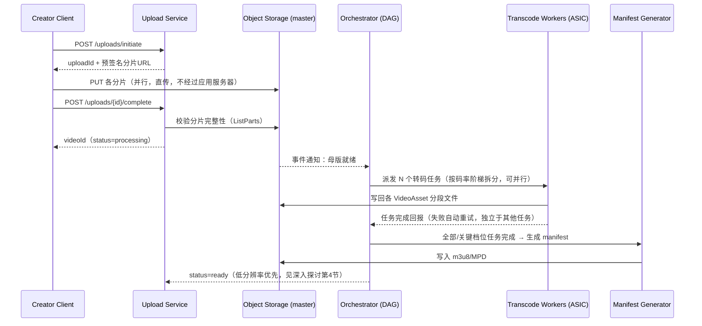
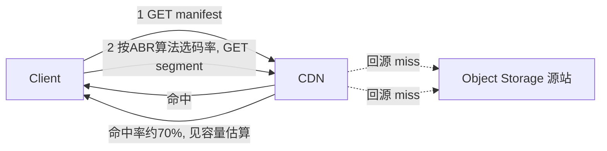

# 设计题解：视频点播流媒体系统（Video Streaming / YouTube & Netflix）

## 题目与范围

面试官通常这样开场："设计一个视频点播（video on demand, VOD）平台，创作者上传视频，
系统把它处理成可以在各种设备、各种网络条件下流畅播放的格式，全球用户都能低延迟地看到。"
这句话里藏着这道题的三个独立子系统——上传与转码流水线、自适应码率（adaptive bitrate,
ABR）分发、CDN 的成本与命中率——面试候选人最常犯的错误就是把三者混成一团来讲，而不是
分别给出各自的数据结构和取舍。

值得当场问清楚的澄清问题，以及它们各自改变的设计决策：

- **是 UGC（user-generated content，任何人可上传，如 YouTube）还是版权内容库（licensed
  catalog，只有片方/官方上传，如 Netflix）？** UGC 决定了上传路径要按数量级设计（本题按
  YouTube 场景估算），版权内容库的上传量小但单文件质量要求更高、需要人工审核和母版
  （master）管理，两者的"转码规模"这一节数字会差两个数量级。本题按 UGC 场景设计。
- **直播（live streaming）在不在范围内？** 直播是一个完全不同的题目——RTMP/WebRTC 推流
  接入、低延迟 HLS（LL-HLS）、无法预先转码只能边录边转——本题明确排除，只做点播。
- **要不要做 DRM（数字版权管理）？** 决定播放路径要不要接入许可证服务器（license
  server）和加密密钥轮换。本题假设存在一个可插拔的 DRM 层但不展开设计其密钥管理细节。
- **搜索、推荐、评论、订阅在不在范围内？** 这些都是独立的题目（对应 Search Index、News
  Feed 等其他 leaf），本题排除。

**范围内**：视频上传（含大文件、断点续传）、转码流水线（生成多分辨率/多码率的自适应
码率阶梯）、播放端的自适应码率分发、CDN 分发策略与成本结构。**范围外**：直播、搜索与
推荐、评论与社交、DRM 密钥管理内部实现、支付与创作者变现、内容审核。

## 需求

**功能需求（驱动设计的 3–5 条）**

1. 创作者能上传任意大小（数 GB 到数十 GB）的视频文件，网络中断后可断点续传。
2. 上传完成后，系统自动把原始文件转码成一组不同分辨率/码率的版本（码率阶梯，bitrate
   ladder），供不同网络条件的用户播放。
3. 观众打开一个视频即可开始播放，播放过程中客户端根据实时网络状况在不同码率之间无感
   切换（自适应码率流媒体，adaptive bitrate streaming, ABR）。
4. 观众可以跳转（seek）到视频任意位置播放，而不需要先下载之前的部分。
5. 全球用户的首帧播放延迟应尽量低，不因为源站在美国而让亚洲用户等待数秒。

**非功能需求（数字化）**

- **首帧延迟（time-to-first-frame）**：P95 < 2 秒——这是用户体感"卡不卡"的第一道门槛。
- **卡顿率（rebuffer ratio，卡顿时间/总播放时间）**：< 0.5%，行业公认的"体验及格线"。
- **转码时效**：一个 10 分钟的 1080p 视频从上传完成到最低分辨率版本可播放，目标
  < 5 分钟（先出低分辨率满足"能看"，高分辨率和多编码格式可以异步补齐，这是"先能播、
  再变清晰"的核心设计取舍，见容量估算）。
- **播放路径可用性**：99.95%+（这是产生收入/留存的路径，可用性预算向它倾斜）；上传
  路径可以接受更高延迟，但一旦确认上传成功就不能弄丢原始母版，母版存储耐久度要求与
  对象存储的标准耐久度量级看齐（不低于 99.999999999%，即"11 个 9"，这是本设计对
  [[storage.object|Object Storage & Separation]] 的耐久度假设，不是某厂商的官方承诺）。
- **上传规模（广泛流传的二手数字，本设计的假设，不是官方一手数据）**：多家数据聚合网站
  （如 Statista，见「来源与延伸」）长期报道每分钟约 500 小时视频被上传到 YouTube，较新
  的聚合来源给出的数字更高（约 720 小时/分钟）。本文没能找到一份直接给出这个数字的
  YouTube/Google 官方一手页面——YouTube 官方新闻页目前公开的一手数字是"每天超过 2,000
  万条视频被上传"（见「来源与延伸」），这是一个视频数而不是时长，无法直接换算。本题
  **明确把 500 小时/分钟当作这道题的假设起点**，用它是因为它是流传最广、最常被面试
  题解引用的量级，不是因为它有官方来源。

## 容量估算

估算分两条完全独立的路径——**写路径（上传与转码）**和**读路径（播放与分发）**——这道
题最容易在面试里被问穿的地方，就是候选人只估了一条路径就开始画架构图。

**写路径：上传与转码存储**

- 每分钟 500 小时视频上传（本设计的假设起点，取自广泛流传的二手统计，见「需求」一节
  和「来源与延伸」的说明），换算成每天 500 × 60 × 24 = **72 万小时/天**的原始视频。
- 假设创作者端上传的原始码率平均 8 Mbps（1080p 消费级编码的典型值，本设计假设），则
  原始数据量为 720,000 小时 × 3,600 秒 × 8 Mbps ÷ 8 位/字节 ≈ **2.59 PB/天**，一年约
  946 PB。这一层存储只保留一份母版，直接决定必须用对象存储而不是块存储（见「高层
  设计」）。
- **码率阶梯的存储放大**：假设阶梯为 240p/400kbps、360p/800kbps、480p/1200kbps、
  720p/2500kbps、1080p/4500kbps、4K/15000kbps 六档，再乘以两套编码格式（H.264 保证
  兼容性 + AV1/VP9 给现代设备省带宽），阶梯总码率 = 2 × (400+800+1200+2500+4500+15000)
  = 48,800 kbps，相对 8,000 kbps 的母版码率，放大倍数 = 48,800 ÷ 8,000 ≈ **6.1 倍**。
  也就是说，如果对每个上传的视频都无差别生成全套阶梯，转码产物存储一年约 5,771 PB，
  加上母版共约 **6.7 EB/年**。**这一个数字直接决定了一个核心设计决策：不能对所有视频
  都无差别生成全套阶梯**——这就是深入探讨第 4 节"长尾内容的按需转码"存在的原因，容量
  估算在这里直接卡死了一个后续架构分支。
- **转码算力**：72 万小时/天原始视频、12 个输出版本（6 档 × 2 编码族），若编码速度按
  1 倍实时率折算（软件编码器混合各档的粗略假设），需要 720,000 × 12 = 864 万核·小时
  /天，按每台机器 64 核连续跑 24 小时折算，需要 8,640,000 ÷ 24 ÷ 64 ≈ **5,625 台**纯
  CPU 编码机器。这是软件编码器的量级；Google 在 ASPLOS 2021 发表的论文《Warehouse-Scale
  Video Acceleration: Co-design and Deployment in the Wild》（自研视频编码单元 VCU/
  Argos，服务于 YouTube 规模的转码负载，见「来源与延伸」）报告的真实数字是**相对调优
  良好的非加速基线有 20–33 倍的效率提升**，不是一个单点数字。本设计出于保守，只按
  **10 倍**折算——低于论文报告区间的下限，作为"至少能做到多少"的下界假设——同样的负载
  只需 5,625 ÷ 10 ≈ **563 台**；如果按论文报告的区间直接折算，机器数量会落在
  5,625 ÷ 33 ≈ **170 台**到 5,625 ÷ 20 ≈ **281 台**之间，比本设计保守假设算出的
  563 台还要少。无论按哪个倍数，结论都成立：ASIC 加速不是锦上添花，而是把机器数量压低
  一个数量级以上，这是这道题"容量估算直接决定是否要自研硬件"的核心例子，本设计给出的
  563 台是这个结论的保守下界，不是精确预测。

**读路径：播放与 CDN 带宽**

- 假设平台日活用户（DAU）1.5 亿、人均日观看 40 分钟（本设计假设，量级参考大型视频
  平台），总观看分钟数 = 150,000,000 × 40 = 60 亿分钟/天。若观看均匀摊在 24 小时
  （保守下界），平均并发观众 = 6,000,000,000 ÷ (24×60) ≈ **417 万**；晚间高峰通常是
  均值的 3 倍左右（本设计假设），峰值并发观众 ≈ **1,250 万**。
- 取跨码率档位的加权平均带宽约 3 Mbps/路播放（多数用户落在中间档），峰值出口带宽 =
  1,250 万 × 3 Mbps ÷ 1,000,000 ≈ **37.5 Tbps**。这个数字比任何单一数据中心的出口
  带宽都大得多，**这就是为什么播放路径不能让源站直接扛流量，必须靠 CDN 边缘节点分摊**
  ——本节数字直接论证了「高层设计」里 CDN 是播放路径唯一直连用户的组件这一架构决策。
- **边缘命中率的经济账**：假设热门内容遵从长尾分布，头部 1% 的视频贡献 70% 的播放量
  （本设计假设，符合内容平台的普遍经验），只要 CDN 边缘缓存住这 1% 的内容就能吃掉
  70% 的请求，origin（对象存储 + 转码产物源站）只需要扛 30%：origin ≈ 37.5 × 0.30 =
  **11.25 Tbps**，edge ≈ 37.5 × 0.70 = **26.25 Tbps**。Netflix 官方工程博客
  《Serving 100 Gbps from an Open Connect Appliance》（2017，见「来源与延伸」）披露，
  他们把一台基于 NVMe 闪存、100GbE 网卡的 OCA 单机吞吐从早期"闪存机型受 CPU 限制在约
  40 Gbps"一路优化到**单机稳定跑满 100 Gbps**。本设计对这个已验证的峰值做 10% 保守
  折扣（生产环境很少长期跑在基准测试的理论峰值上），按每台 **90 Gbps** 计算，覆盖这
  部分边缘带宽需要 26,250 ÷ 90 ≈ **292 台**这个量级的边缘设备；如果直接按论文披露的
  100 Gbps 峰值计算，则是 26,250 ÷ 100 ≈ **263 台**。两种算法的结论一致——这个数字说明
  "自建边缘设备网络"在这个规模下是一个可以负担的固定成本，而不是遥不可及的基础设施
  投资，这是深入探讨第 3 节判断自建 CDN 是否划算的关键论据。

## 核心实体与 API

**实体**

- **Video**：`id, ownerId, title, durationSec, status(uploading/processing/ready/
  failed), masterAssetUrl, createdAt`。
- **UploadSession**：`id, videoId, totalParts, receivedParts[], expiresAt`——跟踪一次
  分片直传的进度，不是视频本身的状态。
- **VideoAsset（Rendition）**：`id, videoId, codec(h264/av1), resolution, bitrateKbps,
  segmentManifestUrl, status`——**一个 Video 对应多个 VideoAsset**，是这道题最核心的一
  对多建模决定（对比码率阶梯放大倍数，见容量估算）。
- **TranscodeJob**：`id, videoId, targetAsset, status(queued/running/done/failed),
  attempt, workerId`——转码 DAG 里的一个节点，见「高层设计」。
- **ViewSession**（可选，非本题核心）：`userId, videoId, positionSec, updatedAt`——播放
  进度，仅用于恢复播放位置，不参与本题的分发架构。

**API**

```
POST /uploads/initiate            {filename, sizeBytes, mimeType}
                                   → {uploadId, partSize, partUrls[]}（预签名直传 URL）
PUT  <partUrl>                    客户端直传对象存储，每片 5–10MB，可并行、可重试
POST /uploads/{uploadId}/complete {parts:[{partNumber, etag}]}
                                   按 uploadId 幂等 → 触发转码流水线，返回 {videoId}
GET  /videos/{id}                 → VideoMetadata，status 字段驱动前端轮询/推送
GET  /videos/{id}/manifest        → HLS 主播放列表(m3u8)/DASH MPD，CDN 强缓存
GET  /videos/{id}/segments/{seg}  → 实际分段文件，CDN 命中，几乎不打源站
POST /videos/{id}/progress        {positionSec}，覆盖写，幂等
```

**幂等性**：`complete` 按 `uploadId` 幂等——网络重试导致的重复调用只会触发一次转码流
水线，不会重复排队；`progress` 是覆盖写，天然幂等，不需要额外的去重键。**分页**：本题
不设计目录/搜索类分页 API（超出范围），manifest 和分段文件本身通过 HTTP Range/分段寻
址替代分页。

**故意不做的**：不提供"编辑已上传视频内容"的 API（重新上传即新版本）；不在这一层设计
DRM 许可证签发（假设由独立的许可证服务处理，manifest 中只携带加密标记）；`manifest` 和
`segments` 端点不做鉴权粒度到分段级别，鉴权发生在 manifest 签发的一次性令牌上，之后所
有分段请求携带同一令牌走 CDN，避免每个分段都回源鉴权。

## 高层设计

**上传与转码路径**



**播放路径**



**上传服务**是无状态的元数据协调层，真正的字节传输走客户端到对象存储的预签名直传，
不经过应用服务器——这是所有大文件上传设计的共同模式（同样出现在 File Sync 那道题），
理由是应用服务器的带宽和连接数远比对象存储昂贵，不该承担字节转发。

**转码流水线**是一个有向无环图（DAG）编排——每个目标 VideoAsset 是一个独立任务，互相
没有依赖，可以在一个 worker 集群上大规模并行，某个档位失败只需重试那一个任务，不影响
其他档位。存储技术类是**对象存储 + 无状态计算 worker 池**，选它是因为转码是"读一个大
文件、写多个中等文件"的批处理模式，天然适合按任务水平扩展，不需要有状态的机器。

**分发路径**几乎完全不接触应用服务器：manifest 和分段都是静态文件，全部通过
[[networking.cdn|CDN]] 的拉取式缓存（pull-through cache）分发——分段文件一旦生成就
不可变，缓存键就是它的 URL，不存在失效（invalidation）难题，这是视频分发比动态页面
分发容易得多的根本原因。存储技术类是 **CDN 边缘缓存 + 对象存储源站**，选它
是因为容量估算给出的 37.5 Tbps 峰值出口带宽比任何集中式数据中心都大得多，必须靠地理
上分布的边缘节点分摊，这是这道题读路径与写路径架构差异最大的地方——写路径需要编排和
状态机，读路径只需要"让请求尽量不到达源站"。

## 深入探讨

### 转码流水线编排：DAG 任务化与失败隔离

**问题**：一个视频要产出十几个不同码率/编码格式的版本，如果串行处理，一个 10 分钟
1080p 视频光转出全套阶梯就可能超过实时时长，转码时效的 5 分钟目标（见需求）完全无法
达到；如果简单地"起一个大脚本从头跑到尾"，任何一个档位失败就要整体重来。

**方案一：单一整体任务，一个 worker 顺序生成全部档位**。实现简单，但任务粒度太粗——
一个档位编码失败（比如 4K 档位遇到损坏帧）就要重跑全部，延迟不可控，也无法水平扩展到
"多台机器同时处理同一个视频"。

**方案二：按视频切分并行（把视频切成时间段，每段独立编码后再拼接）**。可以在单个视频
内部并行，缩短单档位的转码时间，但引入了"跨段码率一致性"和"拼接边界失真"的新问题——
两段独立编码的边界处可能出现关键帧不对齐、码率跳变，需要额外的拼接后处理步骤。

**方案三（本设计采用）：按目标码率/格式切分为 DAG 节点，节点间互不依赖，独立重试**。
每个 `TranscodeJob` 对应一个 `(codec, resolution)` 组合，全部节点没有相互依赖，可以
同时提交给 worker 池；某个节点失败只需要重新入队那一个任务，不影响其他已完成的档位；
manifest 生成器只在"低分辨率档位（如 360p/480p）全部就绪"后就先发布一个可播放的
manifest，高分辨率档位异步补齐后再更新 manifest——这直接实现了需求里"5 分钟内可播放"
的目标，而不需要等全部 12 个档位都转完。代价是需要一个能追踪"部分就绪"状态的编排层
（如 Temporal/Airflow 类工作流引擎），比"一个脚本从头跑到尾"复杂，但这个复杂度换来的
是转码时效和故障隔离的双重收益。

### 自适应码率阶梯：固定阶梯 vs 按标题定制（per-title encoding）

**问题**：一套"放之四海而皆准"的固定码率阶梯（如本设计容量估算里假设的 6 档）对所有
视频一视同仁，但一段静态访谈和一段快速运动的体育比赛在相同码率下的可感知质量天差地
别——固定阶梯要么在低复杂度内容上浪费码率，要么在高复杂度内容上质量不够。

**方案一：固定阶梯，所有视频套用同一组分辨率/码率组合**。实现最简单、CDN 缓存键最规整，
但 Netflix 2015 年披露的数据显示，改用内容感知的阶梯后，在相同主观质量下可以把存储和
分发成本降低 **15%–20%**（见「来源与延伸」），说明固定阶梯存在系统性的码率浪费。

**方案二：按标题定制（per-title encoding）——为每个视频跑一组测试编码，找出该视频在
每个分辨率下"码率-质量"曲线的拐点，动态选择每一档的分辨率和码率**。这是 Netflix
2015 年上线的方案，收益如上，但代价是编码前要先对每个视频做一轮凸包（convex hull）
探测编码，转码算力和延迟都要增加，只有内容量足够大、复用次数足够多（观看次数摊薄一次
性编码成本）时才划算。

**方案三（本设计采用，站在方案二基础上）：按镜头定制（per-shot/dynamic optimization）
——把视频切成镜头级别的片段，每段独立选择质量点，用拉格朗日优化在整部影片的码率预算下
分配质量**。这是 Netflix 2018 年上线的 Dynamic Optimizer，在按标题定制的基础上再省
**17.1%** 的码率（见「来源与延伸」）——安静的对话场景可以降到更低分辨率，动作场景则
把节省下来的码率要回来。本设计对高播放量的头部内容采用这一方案，因为额外的探测编码成
本能被大量观看次数摊薄；对长尾内容仍用固定阶梯或延迟到有观看需求时才做定制（见第 4 节）
——**这是这道题"深度"和"按题面写死一个方案"的分水岭**：不是选哪个技术最先进，而是按
内容的播放量决定值不值得为它多花一次编码成本。

### CDN 分发经济学：自建、第三方与 ISP 内嵌设备的取舍

**问题**：37.5 Tbps 的峰值出口带宽（见容量估算），无论走哪种方案，都不是免费的；三种
主流方案的成本结构和适用阶段完全不同，面试官在这里最常追问"什么规模该换方案"。

**方案一：完全依赖第三方商业 CDN（如 CloudFront、Akamai、Fastly）**。零基础设施投入，
按流量计费，适合冷启动阶段和长尾/低频访问内容——不需要预测流量就能弹性扩缩。缺点是
按 GB 计费的商业 CDN 在流量到 37.5 Tbps 这个量级时，单位成本显著高于自建，边际成本会
成为核心财务指标。
**方案二：自建边缘缓存设备网络，直接部署进 ISP 机房（类似 Netflix Open Connect）**。
用固定的硬件和电力成本换取近乎零边际流量成本——本设计估算约 292 台 OCA 级设备
（见容量估算）就能覆盖 70% 的边缘命中流量，是一笔在这个规模下可以负担、且长期比按量
付费 CDN 便宜得多的固定投资；代价是要说服 ISP 提供机架和电力（通常靠"减少 ISP 自己的
跨网带宽成本"这个互利论点），并且自己运维遍布全球的硬件机群。
**方案三（本设计采用，分阶段）：冷启动期用第三方 CDN，热门内容达到稳定播放量阈值后
逐步把边缘节点迁移到自建/ISP 内嵌设备，两者长期并存**。第三方 CDN 继续承接长尾内容和
新地区的弹性需求；自建网络只承接头部 1% 内容贡献的 70% 播放量（见容量估算），因为这
部分流量可预测、体量大，最值得用固定成本换边际成本。这个"二八分层"策略比"全押一种
方案"更贴近真实大规模视频平台的做法，也是面试里能体现"知道规模决定架构"的关键论证。

### 长尾内容的按需转码与存储分层

**问题**：容量估算算出，如果对每个上传视频都无差别生成全套 12 档阶梯，一年转码产物
存储约 5,771 PB，是母版存储的 6.1 倍。但视频平台的播放量分布是重尾的——大量长尾视频
可能一年也没几次播放，为它们生成 4K/AV1 这类高成本档位纯属浪费。

**方案一：所有视频上传后立即生成全套阶梯**。实现最简单，用户随时点开都是"秒级可播"的
最佳体验，但存储成本随内容量线性增长且不区分冷热，是最贵的方案。

**方案二：只在有人第一次请求某个高档位时才现场转码（完全惰性）**。存储成本最低，但
第一个请求该档位的用户要经历转码延迟（可能数十秒到几分钟），体验退化明显，而且如果
恰好是一个视频突然爆红，短时间内大量首次请求会把转码队列打满。

**方案三（本设计采用）：分层转码——上传即转出低到中档位（360p–720p，覆盖多数移动端
播放），4K 和 AV1 等高成本档位只在该视频过去 N 天的播放量超过阈值后异步补齐，补齐期间
用现有档位降级播放**。这兼顾了首播体验（永远有可播放的档位）和长尾成本控制（只有真正
有观看需求的内容才值得为它多花那 6.1 倍存储放大里最贵的部分），阈值本身是一个可以按
实际播放量分布持续调的运营参数，不是一次性写死的常量。

### 播放端启动延迟与码率切换算法

**问题**：首帧延迟目标 P95 < 2 秒，但播放端要先拿到 manifest、再决定选哪个档位、再
下载第一个分段，任何一步选错都会拖垮这个预算；同时播放中途网络抖动时，码率切换算法
选错了会导致要么频繁切换（观感闪烁）要么卡顿。

**方案一：客户端固定选择一个"安全的"低码率档位起播，不做任何网络探测**。首帧延迟最
低最可预测，但即使在网络条件很好时也起播在低画质，浪费了带宽也伤害了观感。
**方案二：纯吞吐量驱动（throughput-based）的 ABR——根据最近几个分段的下载速度直接
换算成下一段该选的码率**。反应快，但在网络抖动剧烈时容易过度反应，来回切换码率造成
观感闪烁，而且完全不看播放缓冲区（buffer）本身的健康度。
**方案三（本设计采用）：起播用一个中低档位盲选（不等待网络探测，直接开播，保首帧延
迟），播放稳定后切换到吞吐量+缓冲区双信号的混合 ABR 算法**——缓冲区水位高时即使吞吐
量估计有噪声也倾向于保守升档，缓冲区水位低时即使吞吐量看起来够也优先保安全档位防止
卡顿。这个组合把"首帧要快"和"播放中要稳"两个目标拆开给两套逻辑负责，而不是用同一套
算法覆盖两个不同阶段的需求——这是这道题在"深度"上最容易被简化掉的一环，很多候选人只
讲了播放中的 ABR，完全没意识到起播那一下需要单独设计。

## 瓶颈、故障与演进

**热点与倾斜**：单个视频爆红（如一条突发新闻视频）会让该视频的读请求在短时间内集中
到少数几个 CDN 边缘节点和对象存储的少数几个分区上，形成热 key；缓解手段是边缘节点
对热门分段做多副本复制而不是单份缓存，以及对象存储按 `videoId` 前缀做足够细的分区
避免相邻视频的元数据挤在同一个分区。上传侧的热点则来自"转码队列被突发上传洪峰打满"，
需要按优先级（如已有订阅关系的创作者优先）做队列分级，而不是纯 FIFO。

**故障域**：
- **转码 worker/编排器故障**：单个任务失败自动重试且不影响其他并行任务（见深入探讨
  第 1 节）；编排器本身应做成无状态、任务状态存外部存储，编排器重启不丢失进度。
- **CDN 边缘节点故障**：客户端和/或 DNS/Anycast 层自动路由到下一个最近节点，代价是
  一次性的缓存未命中（cache miss）回源，不是数据丢失——这是"读路径可以优雅降级"的
  例子，短暂多绕一次源站远好过播放中断。
- **对象存储源站不可用**：这是写路径的单点——母版写入必须失败即报错，绝不能静默丢弃；
  读路径可以靠 CDN 已缓存的内容继续服务一段时间，只是无法服务新上传或未缓存内容。
- **Manifest 生成器故障**：新视频无法开放播放，但已发布的视频不受影响（manifest 一
  旦生成即静态文件，CDN 长期缓存），故障影响面被天然限制在"新内容发布"这一条路径。

**10 倍演进**：从单一大区平台到多大区、多时区同时有本地化内容。转码流水线要按内容
的目标地区决定编码优先级（本地内容优先在本地区完成低档位转码），CDN 边缘节点数量线性
增长，自建边缘设备（深入探讨第 3 节）的固定成本优势进一步放大。

**100 倍演进**：直播和点播的基础设施开始融合——同一套 CDN 边缘网络既服务点播分段也
服务低延迟直播分片，转码从"文件级批处理"演进到"流式边转边发"。这时候原本"上传完成后
才触发转码"的批处理假设不再成立，需要重新设计成增量式的编码管线，这已经超出本题范围，
是直播那道题要单独处理的问题——但架构上要提前为这次收敛留好接口（如统一的分段寻址和
manifest 格式），不要让两套系统的分段格式互不兼容。

## 面试官会追问什么

**中级（mid）**
- "上传中断了怎么办？" 分片上传本身就是断点续传的基础，客户端记录已完成的分片号，
  重连后只补传缺失分片，`complete` 按 `uploadId` 幂等，重复调用不会触发第二次转码。
- "为什么不能只生成一个统一码率的视频？" 因为观众的网络条件差异极大，固定码率要么
  在弱网下频繁卡顿，要么在强网下浪费带宽/画质，这正是 ABR 阶梯存在的原因。

**高级（senior）**
- "转码任务失败率高的时候你怎么发现和处理？" 编排器按任务类型（`codec×resolution`）
  维度统计失败率，某一维度失败率异常升高触发告警而不是等用户反馈画质问题；重试要有
  上限并区分"瞬时故障重试"和"输入损坏无法恢复"两类，后者应该快速失败而不是无限重试
  拖慢整条流水线。
- "为什么播放路径几乎不经过应用服务器？" 因为 manifest 和分段都是不可变的静态产物，
  一旦生成就没有再计算的必要，CDN 能比任何应用服务器更便宜、更贴近用户地服务静态
  文件，把它们放在应用服务器背后只会白白引入一层不必要的延迟和成本。

**参谋级（staff）**
- "如果要把成本降低 30%，你会先砍哪里？" 先看长尾内容的转码档位是否过度生成
  （深入探讨第 4 节），这是存储放大倍数里最容易被优化掉的部分；其次看 CDN 自建
  vs 第三方的流量分层比例是否还停留在冷启动期的配置没有随播放量分布调整。
- "全球化到访问受限地区，架构要怎么变？" 讨论多 CDN 供应商冗余（不同地区法规和网络
  环境可能要求不同的 CDN 服务商组合）、以及本地化转码优先级（避免某个地区的内容永远
  排在全球转码队列末尾）。
- "如果要支持用户对已发布视频做非破坏性的局部替换（如替换开头的赞助片段），架构要
  怎么改？" 需要把 manifest 从"整段静态文件"改造成"可拼接的分段引用列表"，替换只重新
  生成受影响的少数分段和更新 manifest，而不是重新转码整个视频——这本质上是把"视频"
  从一个不可变对象重新建模成"分段的有序引用集合"，是对核心实体设计的一次结构性调整。

## 常见错误

- 把转码和分发混为一谈，画一个"处理服务器"就把两条完全不同瓶颈特征的路径盖过去，
  说不清楚播放路径为什么几乎不碰应用服务器。
- 假设所有视频用同一套码率阶梯，被追问"存储成本怎么控制"时给不出"长尾内容按需转码"
  这类分层方案，只会说"加机器"。
- 只讨论了转码算力，完全没算过播放路径的出口带宽，说不出为什么这道题必须依赖 CDN
  而不是自己扛。
- 把断点续传设计成"客户端重新上传整个文件、服务端做去重"，而不是分片级别的续传，
  白白浪费了已经上传成功的部分。
- 对 ABR 只讲了"客户端根据网速切码率"这一句话，说不出起播阶段和播放中阶段需要不同
  的算法目标（低延迟起播 vs 稳定播放）。
- 完全没提转码任务的失败隔离，被问"一个档位编码失败怎么办"时才现场想到要重试，
  没有把它当成设计的一部分提前规划。

## 五分钟讲法

This is a video-on-demand platform, and I split it into two paths with very different
bottlenecks: an upload-and-transcode write path, and a playback-and-distribution read
path, because conflating them is the most common mistake on this problem. On upload, the
client streams directly to object storage via presigned multipart URLs, bypassing the
application server entirely, and completion triggers a DAG of independent transcode jobs
— one per resolution-and-codec target — so a failure in one rendition never blocks the
others, and I can publish a playable low-resolution manifest within minutes while higher
renditions finish asynchronously. The capacity math is what drives the two hardest
decisions: a naive full bitrate ladder on every upload multiplies storage roughly six
times over the master, so long-tail content only gets a base ladder and expensive
renditions like 4K are generated on demand once a view-count threshold is crossed; and
peak playback egress lands in the tens of terabits per second, far beyond what any origin
can serve directly, so the entire playback path — manifest and segments alike — is
static, immutable, and served from CDN edge caches, with origin object storage only
absorbing cache misses. For distribution economics I layer two strategies: third-party
CDN for long-tail and cold-start traffic, and a self-operated edge appliance network,
Netflix-Open-Connect style, for the head of the catalog that accounts for the majority of
views, because that traffic is predictable and large enough to justify the fixed
hardware cost over a per-gigabyte bill. On the client, adaptive bitrate switching uses
one policy to start playback fast on a safe mid-tier rendition, and a different
throughput-plus-buffer hybrid policy once playback is stable, because startup latency and
mid-playback stability are different problems that shouldn't share one algorithm. At 10x
scale the CDN footprint and localization priority in the transcode queue both need to
grow with regional density; at 100x, live and on-demand infrastructure start converging,
which this design leaves room for but doesn't solve.

## 来源与延伸

- [Hello Interview — Design a Video Streaming Platform (YouTube)](https://www.hellointerview.com/learn/system-design/problem-breakdowns/youtube)
  （`no-archive`，商业备考网站）：给出了完整的上传/转码/流式播放框架，强调用
  presigned URL 直传对象存储和用 DAG 编排转码。本文与它的主要分歧在于：它把码率阶梯
  当作对所有视频统一生成的常量，本文认为容量估算（6.1 倍存储放大）足以论证必须做
  长尾分层转码（见深入探讨第 4 节），这是它没有展开的部分。
- [Netflix TechBlog — Per-Title Encode Optimization](http://techblog.netflix.com/2015/12/per-title-encode-optimization.html)：
  Netflix 官方披露按标题定制码率阶梯相对固定阶梯节省 15%–20% 存储与分发成本的真实
  数据，本文「容量估算」和「深入探讨」第 2 节的相关数字直接引用自这篇文章，而不是
  猜测。
- [Netflix TechBlog — Dynamic Optimizer: A Perceptual Video Encoding Optimization
  Framework](https://netflixtechblog.com/dynamic-optimizer-a-perceptual-video-encoding-optimization-framework-e19f1e3a277f)：
  在按标题定制的基础上进一步做按镜头定制，披露额外节省 17.1% 码率的真实数字，本文
  深入探讨第 2 节的"方案三"直接建立在这篇文章的技术之上。
- [karanpratapsingh/system-design — Netflix](https://github.com/karanpratapsingh/system-design#netflix)：
  一份免费的开源系统设计笔记集合（非付费材料的镜像），给出了 Netflix 架构的整体框架
  和术语，本文用它做交叉印证整体组件划分是否合理，但没有采用它的具体数字（它没有给
  出可验证来源的容量估算，本文的所有数字改为自己现场计算或直接引用 Netflix 官方
  博客）。
- [Google Research — Warehouse-Scale Video Acceleration: Co-design and Deployment in
  the Wild](https://research.google/pubs/pub50300/)（ASPLOS 2021 论文页，Google 官方
  一手来源）：披露自研视频编码单元（VCU/Argos）相对调优良好的非加速软件基线有
  **20–33 倍**的效率提升，是本文「容量估算」转码算力那段"ASIC 加速"数字的直接来源。
  本文与它不同的地方在于：本文出于保守只按 10 倍折算作为下界假设，并在文中明确算出
  按论文真实区间折算会得到更少的机器数（170–281 台），不把 10 倍当成论文的原始结论。
- [Netflix TechBlog — Serving 100 Gbps from an Open Connect Appliance](https://netflixtechblog.com/serving-100-gbps-from-an-open-connect-appliance-cdb51dda3b99)
  （2017，Netflix 官方一手来源）：披露把一台基于 NVMe 闪存、100GbE 网卡的 OCA 单机
  吞吐优化到稳定跑满 100 Gbps 的真实工程细节（此前的闪存机型受 CPU 限制在约
  40 Gbps）。本文「容量估算」边缘命中率一段对这个数字做了 10% 的保守折扣（90 Gbps）
  再计算所需设备数，并同时给出了不打折扣、直接用 100 Gbps 计算的对照结果。
- [Statista — Hours of video uploaded to YouTube every minute](https://www.statista.com/statistics/259477/hours-of-video-uploaded-to-youtube-every-minute/)：
  数据聚合网站长期报道的"每分钟约 500 小时视频上传"数字的来源之一，本文把它当作容量
  估算的假设起点，而不是 YouTube/Google 的官方一手数字（本文没有找到一份直接给出这
  个具体数字的官方页面）。
- [YouTube — Official Blog Press page](https://blog.youtube/press/)（YouTube 官方一手
  来源）：公开披露的一手数字是"平均每天有超过 2,000 万条视频被上传"，这是一个视频
  数量而不是时长，本文在「需求」一节里用它来说明"500 小时/分钟"这个数字缺乏对应的
  官方一手页面支撑，两者不能直接互相换算。
