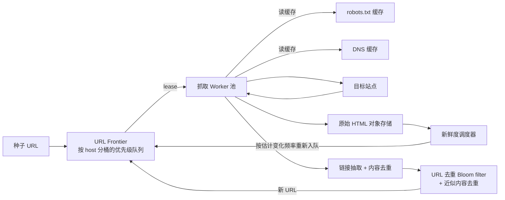

# 设计题解：网络爬虫（Web Crawler）

## 题目与范围

面试官通常这样开场："设计一个网络爬虫：从一批种子网址（seed URLs）出发，发现并抓取网页，
把内容存下来供后续搜索引擎建索引使用；要礼貌（polite），不能把小网站打垮；要能应对几十亿
级别的网页规模。" 这句话里藏着这道题真正的难点——不是"发 HTTP 请求把网页存下来"，而是"在
不知道整个网络图长什么样的前提下，让抓取顺序既尊重每个站点的承受能力，又不被少数病态网站
的链接结构（蜘蛛陷阱）拖入无限循环，还要知道该多久回来看一眼这个页面有没有变化"。

值得当场问清楚的澄清问题，以及它们各自改变的设计决策：

- **抓取的目标是什么？只要 HTML 文本，还是要渲染 JS 之后的最终页面？** 如果只抓原始 HTML，
  一个无状态的 HTTP 客户端就够了；如果要渲染 JS（单页应用类站点），每次抓取都要跑一个无头
  浏览器（headless browser），单次抓取成本高出一两个数量级，机器数量估算完全不同。本设计
  按"只抓原始 HTML，不渲染 JS"来做，这是多数搜索引擎爬虫和 Common Crawl 的真实做法。
- **是一次性批量抓取，还是需要持续增量刷新（freshness）？** 决定要不要设计新鲜度调度器，
  还是一次性跑完就结束。
- **规模是公司内部知识库这种量级，还是要逼近"抓取公众互联网一个有意义的子集"？** 决定礼貌
  约束是不是真正的瓶颈——小规模抓取几乎不会撞到单站点的抓取上限。
- **要不要处理"看起来是新页面、其实是老内容换了个 URL"（近似重复内容）？** 决定去重要不要
  做到内容层面，而不只是 URL 层面。
- **抓取结果只存原始 HTML，还是要顺带做正文抽取（boilerplate removal）？** 决定存储成本估
  算里要不要单独算一份"抽取后文本"的量级。

**范围内**：URL frontier（待抓取队列）的优先级与礼貌调度、URL 去重与近似内容去重、
robots.txt 遵从、蜘蛛陷阱识别、新鲜度（freshness）调度、抓取内容的存储。**范围外**：抓取
后的搜索引擎索引构建（倒排索引、排序算法）、渲染 JavaScript 的无头浏览器抓取管线、图片/视
频等非文本媒体的处理、反爬虫对抗（本设计站在"我们是遵守规则的爬虫"这一方，不讨论如何绕过
目标网站的反爬措施）。

## 需求

**功能需求（驱动设计的 3–5 条）**

1. 从一批种子 URL 出发，发现页面中的链接并持续扩展待抓取集合，直到达到规模目标或预算耗尽。
2. 每个站点的抓取频率不超过该站点能承受的范围（礼貌），遵守 robots.txt 声明的禁止路径。
3. 同一个 URL 不被重复抓取；内容实质相同但 URL 不同的页面能被识别为重复，避免浪费抓取预算。
4. 已抓取的页面按估计的变化频率被重新抓取，保持内容新鲜，而不是所有页面用同一个刷新周期。
5. 遇到病态的链接结构（如无限生成的日历页面）不会让爬虫陷入无限抓取同一站点的循环。

**非功能需求（数字化）**

- **礼貌是唯一不能妥协的正确性约束之一**：对任何一个目标站点，爬虫产生的请求速率必须有上
  限，且遵守其 robots.txt 声明——这比抓取覆盖率更优先，宁可少抓也不能把一个小站点打垮。
- **抓取目标**：一个抓取周期（cycle）内完成 100 亿（10 billion）个页面的抓取，周期长度 30
  天（对应一次"全量刷新"节奏；小规模的高优先级页面可以有更短的独立刷新周期，见「深入探讨」
  第 4 节）。这个数字不是真实公开数据，是本设计给自己定的目标规模（作为对比：Common Crawl
  最新一次月度快照 CC-MAIN-2026-39（2026 年 9 月）公开数据为 21.7 亿网页、压缩后 WARC 文
  件共 82.79 TiB（约合 91.03TB），见「来源与延伸」；本设计的 100 亿页目标约为这一真实单月
  快照页面数的 4.6 倍，用 `10e9 / 2.17e9` 算出）。
- **去重准确性**：URL 级去重允许极小概率的假阳性（把没见过的 URL 误判为见过，因而漏抓，
  可容忍），但不允许假阴性（把见过的 URL 误判为没见过，导致同一页面被反复抓取，浪费预算）。
- **容错**：任何一台抓取 worker 或队列节点的宕机不应该丢失已发现但尚未抓取的 URL。
- **风暴防护**：单个病态站点产生的 URL 数量不应该无限占用全局抓取预算。

## 容量估算

估算分三条相互独立、决定不同组件设计的路径：**抓取吞吐**（决定 worker 机器数）、**礼貌约
束下的并发宿主数**（决定 frontier 架构，往往比抓取吞吐更早成为瓶颈）、**去重集合规模**（决
定用什么数据结构做"见过没见过"判断）。

- **平均抓取 QPS** = 100 亿页面 ÷ 30 天 ÷ 86400 秒/天 ≈ **3,858 QPS**；假设抓取不是完全匀
  速的（有新种子批量注入、失败重试补抓等突发），峰值按平均的 2.5 倍估算（本设计的假设，未
  经真实流量验证）≈ **9,645 QPS**。
- **礼貌约束下需要同时保持在途请求的宿主数**：假设每个站点两次请求之间至少间隔 2 秒（本设
  计的保守假设——RFC 9309 并未标准化 crawl-delay，见深入探讨第 3 节），则单站点最大可持续
  QPS = 1/2 = 0.5。要达到 9,645 QPS 的峰值抓取速率，需要同时对 **9,645 ÷ 0.5 ≈ 19,290 个
  不同宿主**保持在途请求——**这个数字比抓取 QPS 本身更能决定架构**：如果假设一台抓取
  worker 用异步 I/O 能维持 5,000 个并发连接（假设），仅从"需要同时覆盖多少个不同宿主"这一
  个约束出发，就至少需要 ⌈19,290 / 5,000⌉ ≈ **4 台**worker；而如果只按原始 QPS ÷ (单机并
  发连接数 ÷ 平均请求耗时 0.5 秒 = 10,000 QPS/机) 计算，峰值 9,645 QPS 甚至不到 1 台机器就
  够——**真正决定机器数量下限的是宿主并发多样性，而不是原始吞吐**，这是本题容量估算里最容
  易被面试官用来考察候选人深度的一点。
- **存储**：假设平均每个页面的原始 HTML 大小为 100KB（这是本设计的假设，明显小于 HTTP
  Archive 统计的整页资源总重量——2025 年数据显示桌面端整页中位数达 2.86MB，但那包含图片/
  JS/字体，爬虫只抓 HTML 文本，见「来源与延伸」），一个抓取周期的原始 HTML 存储 ≈ 100 亿 ×
  100KB = **1 PB/周期**。对应的平均入库带宽 ≈ 1PB ÷ 2,592,000 秒 ≈ **3.09 Gbps**（平均），
  峰值（× 2.5）≈ **7.72 Gbps**——同样远低于单机网卡带宽量级，不是瓶颈。
- **去重集合规模**：假设发现的 URL 总数是实际抓取页面数的 5 倍（很多链接指向同一页面，或
  被过滤掉未抓取，本设计假设）= 500 亿个已发现 URL/周期；假设保留最近 3 个周期的"见过"记录
  用于跨周期去重，去重集合规模 ≈ 1,500 亿个条目。用 Bloom filter（假阳性率设为 0.1%）存储
  这个集合，位数 ≈ 2.16 万亿 bit ≈ **270GB**，需要约 10 个哈希函数——如果换成精确哈希集合
  （每条目假设 URL 字符串+开销约 40 字节），存储量会是 1,500 亿 × 40 字节 ≈ **6TB**，是
  Bloom filter 方案的 22 倍。270GB 若按 16 个分片存储，每分片约 16.8GB，可以完全放进单机
  内存，这直接决定了「深入探讨」第 2 节的去重方案选择。
- **DNS 解析 QPS**：假设 500 亿个发现的 URL 平均每 200 个共享一个宿主（假设），则一个周期
  内涉及约 2.5 亿个不同宿主；若 DNS 缓存 TTL 与周期对齐，平均 DNS 查询 QPS ≈ 2.5 亿 ÷
  2,592,000 秒 ≈ **96 QPS**——比抓取 QPS（3,858–9,645）低接近两个数量级，这个对比本身就是
  一个重要结论：**只要做好按宿主缓存，DNS 完全不会成为瓶颈，不值得为它单独设计一套复杂的分
  布式解析层**（见深入探讨第 5 节）。

## 核心实体与 API

**实体**

- **FrontierEntry**：`urlHash, url, host, priority, depth, enqueuedAt`——待抓取队列里的一
  条记录；实际物理存储按 host 分桶（见深入探讨第 1 节）。
- **Host**：`host, robotsRules, robotsCachedAt, nextAllowedFetchAt, consecutiveErrorCount`
  ——每个宿主的礼貌状态机，`nextAllowedFetchAt` 是节流的核心字段。
- **CrawlRecord**：`urlHash, canonicalUrl, status(pending/fetched/failed/skipped),
  contentHash, lastCrawledAt, nextCrawlAt, changeFrequencyEstimate, depth`——每个已知 URL
  的抓取状态与新鲜度估计。
- **PageContent**：`urlHash, rawHtmlRef(对象存储指针), contentHash, fetchedAt,
  extractedLinks[]`——抓取结果本身不直接存数据库，只存对象存储的引用。

**API**（这是一套内部控制面 API，供 frontier、抓取 worker、内容管线之间协作，不是面向终端
用户的公开 API）

```
POST /frontier/urls                        {url, priority, sourceUrl, depth}
                                             幂等：按 canonicalUrl 做去重（先过 Bloom filter），
                                             已判定"见过"则直接丢弃，不入队
GET  /frontier/lease?workerId=&max=N        租借最多 N 个当前没有在途请求的宿主上的 URL
                                             → [{urlHash, url, leaseId, leaseExpiresAt}]
POST /frontier/lease/{leaseId}/complete     {status, contentHash, extractedUrls[], nextCrawlAt}
                                             幂等：按 leaseId，租约过期后同一 leaseId 的提交被拒绝，
                                             URL 已经因超时被放回队列等待重新租借
GET  /hosts/{host}/robots                   → {disallow[], allow[], crawlDelaySeconds(nullable),
                                                cachedAt}（内部服务读缓存，不直接暴露给调用方）
GET  /pages/{urlHash}                       → {rawHtmlRef, contentHash, fetchedAt}
                                             分页：批量下载走 rawHtmlRef 对应的对象存储列表接口，
                                             不在这个 API 里重复实现分页
```

**幂等性的两层含义**：`POST /frontier/urls` 用 `canonicalUrl`（去掉追踪参数、统一大小写和
默认端口后的规范化 URL）去重，避免同一实际页面因 URL 表面差异被反复入队；`lease/complete`
用 `leaseId` 幂等，租约超时后的重复提交不会造成同一个 URL 被标记两次完成，也不会让一次真正
完成的抓取被覆盖成失败。

**故意不做的**：不提供面向公众的"提交一个 URL 立即抓取"接口（种子注入只走内部批量入口，避
免被滥用成任意目标的免费抓取服务）；不在这套 API 里做同步"抓了就返回内容"的接口（一切都是
异步经过 frontier 的租约模型）；不处理图片/视频等非文本资源的抓取；不内置排序或索引 API
（那是下游消费者的职责，明确排除在本设计范围外）。

## 高层设计



**Frontier 与抓取路径**：种子 URL 和链接抽取产生的新 URL 先经过 Bloom filter 过滤（"是否见
过"），未见过的进入按宿主分桶的优先级队列（Mercator 式设计，见深入探讨第 1 节）。抓取
worker 通过 `lease` 接口租借一批当前没有在途请求的宿主上的 URL——存储技术类是**内存中的分
桶优先级队列（如 Redis 或自研的堆结构）**，因为这条路径需要的核心能力是"高频出队入队 + 按
宿主做节流判断"，不需要关系型数据库的事务保证。

**抓取与内容路径**：Worker 先查本地/共享的 robots.txt 缓存和 DNS 缓存，确认允许抓取后发起
HTTP 请求，把原始 HTML 写入对象存储（**Blob 存储**，因为页面内容是不可变的大对象，天然适
合对象存储而不是关系型数据库），同时把内容哈希和抽取出的链接送去做去重和入队判断。

**新鲜度路径**：一个独立的调度器周期性扫描 `CrawlRecord`，根据每个页面的历史变化频率估计
（见深入探讨第 4 节）计算 `nextCrawlAt`，到期的 URL 被重新送回 Frontier——它复用同一个
Frontier 和抓取管线，只是入队的来源不同（新发现 vs 到期刷新）。

## 深入探讨

### URL Frontier：优先级和"礼貌"如何在同一个队列里共存

**问题**：Frontier 既要按优先级决定先抓哪些 URL（高价值页面优先），又要保证任意时刻对同一
个宿主最多只有一个在途请求——这两个目标如果分别用两个独立机制实现，很容易互相冲突（比如一
个宿主的所有高优先级 URL 排在队首，导致 worker 反复尝试同一个被节流的宿主而空转）。

**方案一：全局单一优先队列，worker 直接取队首**。实现最简单，但完全没有宿主隔离——一个高
产宿主的大量 URL 会持续占据队首附近的位置，worker 高频撞上同一个正处于节流冷却期的宿主，
产生大量无效的"礼貌拒绝"轮询。

**方案二：为每个已发现的宿主各建一个物理队列，worker 轮询所有队列**。天然保证了宿主隔离，
但发现的宿主数量级是 2.5 亿（见容量估算），维护 2.5 亿个物理队列并让 worker 高效轮询是不现
实的，而且这个方案没有优先级概念，同一宿主内的 URL 也没有先后顺序。

**方案三（本设计采用，源自 Mercator 论文的两层队列架构）**：一组数量较少、按优先级分桶的
**前端队列（front queues）**接收新 URL；一组数量与 worker 并发度同量级（而不是与宿主数量
同量级）的**后端队列（back queues）**，每个后端队列在任意时刻只绑定一个宿主，通过一张
"宿主 → 后端队列"的路由表分配；一个最小堆按"该宿主下次允许抓取的时间"排序，worker 只从堆顶
（最早可抓取）对应的后端队列取 URL。前端队列负责优先级排序，把 URL 分发进后端队列；后端队
列负责宿主隔离；堆负责节流调度。这个架构的关键洞察是：**后端队列的数量只需要跟 worker 的并
发抓取能力同量级（几千到几万），而不需要跟发现的宿主总数（2.5 亿）同量级**——大多数宿主在
任意时刻并没有 URL 正在被抓取，不需要为它们常驻一个物理队列。

### 去重：URL 级 Bloom filter 与内容级近似去重是两个不同的问题

**问题**："有没有见过这个 URL"和"这份内容是不是已经抓过的重复内容"是两个独立的问题——同一
篇文章常常挂在多个不同 URL 下（带不同追踪参数、镜像站点、AMP 版本），只做 URL 去重会让爬虫
反复抓取实质相同的内容，浪费抓取预算和存储。

**方案一：只做 URL 规范化 + 精确 URL 去重**。规范化（去掉追踪参数、统一大小写）能消掉一部
分表面重复，但无法识别"内容确实不同 URL 但字节级不同（例如页面里嵌了一个随请求变化的时间
戳或广告位）却在语义上是同一篇文章"这种情况。

**方案二：对每个抓到的页面做精确内容哈希（如 SHA-256），比对已有哈希集合**。能捕获字节级完
全相同的重复，但对"绝大部分内容相同、只有页脚广告或时间戳不同"这种近似重复完全无效——这类
近似重复在真实网页里占相当比例。

**方案三（本设计采用）：URL 级用 Bloom filter，内容级用近似相似度签名（如基于分词/shingle
的 simhash 或 minhash）**。URL 去重的关键约束是"绝不能漏判已见过的 URL 为未见过"（假阴性不
可接受，会导致真正的重复劳动被放行），但可以容忍极小概率把未见过的 URL 误判为见过（假阳性，
代价只是极少数新页面被跳过）——这正是 Bloom filter 的特性，用它换来「容量估算」里算出的
22 倍内存节省（270GB vs 精确集合的 6TB）。内容近似去重则用相似度签名而不是精确哈希：对页面
文本分词后取若干 shingle（连续词组）计算 minhash 签名，与最近抓取的同一宿主/相似宿主的页面
签名比较汉明距离，超过相似度阈值判定为近似重复，不再重复存储完整内容（只记录"这是某个已有
页面的近似副本"）。两种去重机制完全独立，容忍度和成本模型也不同——把它们混在一起做会两头不
讨好。

### 礼貌：robots.txt 的强制部分和非标准的 crawl-delay

**问题**：不同来源对"该多克制"这件事给出了不一致的答案。IETF 在 RFC 9309（2022 年把
robots.txt 正式标准化）里明确标准化了 `Disallow`/`Allow` 指令，但**有意排除了 `Crawl-
delay`**，理由是这个字段在真实世界里没有一致的行为约定；现实中主流爬虫的做法也确实不一致
——例如 Googlebot 完全忽略 `Crawl-delay` 字段，而 Bing 会遵守。如果本设计天真地信任每个站
点声明的 `Crawl-delay` 值作为节流依据，会在"该字段不被标准承认、各方支持不一致"这个事实面
前显得不可靠。

**方案一：完全信任站点声明的 `Crawl-delay`，没有声明就用一个全局默认值**。实现简单，但站
点声明的值可能是站长随手设的、过时的，或者根本没有；而且完全依赖一个非标准字段，行为在不
同站点间不可预测。

**方案二（本设计采用）：`Disallow`/`Allow` 规则强制遵守（这是 RFC 9309 标准化的部分，没有
商量余地）；节流速率则由爬虫自己根据观测到的目标站点响应延迟和错误率动态计算，站点声明的
`Crawl-delay`（如果存在）只作为这个动态计算的下限参考，而不是唯一依据**——具体做法：正常
响应时按一个保守的默认间隔（本设计假设 2 秒）请求，一旦观察到 5xx 错误率上升或响应延迟变长，
按指数退避（exponential backoff）拉长该宿主的下次允许抓取时间；长期稳定快速响应的宿主，如
果其声明的 `Crawl-delay` 更宽松，也不会因为默认值而被过度节流。这是本题解一个"来源之间存
在分歧，需要明确选边"的地方：RFC 9309 的立场是"不去标准化一个没有共识的行为"，本设计据此
选择不把这个非标准字段当作唯一真相来源，而是用自适应节流作为主要机制。

### 蜘蛛陷阱与新鲜度调度

**问题**：某些站点的链接结构会生成事实上无限的 URL 集合（最典型的是"下个月"链接无限递归
的日历页面，或者把会话 ID 编码进 URL 路径、每次访问都生成"新" URL 的站点），如果爬虫无差别
地跟随所有发现的链接，会被少数病态站点吃掉几乎全部抓取预算。同时，已抓取过的页面需要被重
新访问以保持新鲜，但不是所有页面都以相同频率变化，用统一的刷新周期要么浪费预算重新抓取从
不更新的页面，要么让高频更新的页面变得陈旧。

**方案一（蜘蛛陷阱）：设一个全局统一的最大抓取深度，超过就不再跟随**。简单有效，但深度阈
值不管设多少都会误伤合法的深层分页内容（比如一个论坛的历史帖子列表天然需要翻很多页），或
者放过深度不高但 URL 数量爆炸式增长的陷阱（比如日历陷阱的深度增长很慢但每层的 URL 数量线
性增加）。

**方案二（本设计采用）：每个宿主设一个每周期的抓取预算上限，同时对"URL 模式"做异常检测**
——如果在一个宿主下观察到大量结构高度相似（只有某个数字或日期参数不同）、且抓回来的内容彼
此近似重复（复用内容级去重的相似度签名）的 URL，判定为陷阱模式，对该模式下后续 URL 的入队
优先级大幅降低而不是直接拉黑（避免误伤真实的深层分页），预算耗尽的宿主本周期内不再消费新预
算，等下一周期重置。

**新鲜度方案**：不用固定周期统一刷新，而是给每个 URL 维护一个变化频率估计——如果最近几次
重新抓取都检测到内容哈希变化，缩短它的 `nextCrawlAt` 间隔；如果连续多次都没有变化，拉长间
隔（类似一个简单的衰减平均估计器）。Frontier 对到期页面的入队优先级 = 估计的重要性 ×
估计的变化概率，而不是单纯按到期时间的先后顺序，让"高价值且频繁变化"的页面天然排在"低价值
且几乎不变"的页面之前。

### DNS 在这个规模下为什么不是瓶颈

**问题**：直觉上，几千到近万 QPS 的抓取请求听起来应该需要一个同样重量级的 DNS 解析层，候
选人常常在这里过度设计（比如为 DNS 单独做分布式集群、多级缓存）。

**方案一：为 DNS 解析单独设计一套与抓取 QPS 同量级的分布式解析集群**。「容量估算」给出的
数字说明这是不必要的：按宿主缓存后的 DNS 查询 QPS 只有约 96，比抓取 QPS（3,858–9,645）低
接近两个数量级——**这条路径的规模从一开始就被"按宿主而不是按 URL 计费"这个特性压低了**（
2.5 亿个宿主对应 500 亿个 URL，平均每个宿主的 DNS 查询次数被均摊到极低水平）。

**方案二（本设计采用）：一个共享的、有 TTL 感知能力的 DNS 缓存池，容量按宿主数量（约 2.5
亿）而不是按 QPS 设计**，未命中时才发起真实解析。真正的风险不是解析吞吐，而是缓存的 IP 在
TTL 过期后失效（目标站点更换了 CNAME/IP），worker 抓取失败时应该触发一次强制刷新重试，而
不是假设 DNS 结果永久有效——用"失败驱动的刷新"而不是"更激进的 TTL 提前失效"来处理这个风险，
避免为一个本来就不是瓶颈的组件增加不必要的复杂度。

## 瓶颈、故障与演进

**热点与倾斜**：单个高产宿主（如一个大型新闻站点）即使拥有最高优先级，也会被「深入探讨」
第 1 节的节流堆限制在它自己的礼貌速率上限内——这意味着**分片和加机器都无法让一个宿主的抓
取速率超过它自己声明/观测到的承受能力**，这是和大多数"热 key 靠分片缓解"的设计不同的地方：
这里热点的解药不是架构手段，而是（如果目标站点允许）与其协商更宽松的抓取协议，或者接受它
天然就会比其他站点更新得慢一拍。Frontier 内部另一个真实热点是某个宿主的后端队列积压
（backlog）无限增长——需要对单宿主的排队 URL 数设置上限，超出的低优先级 URL 直接丢弃而不
是无限堆积占用内存。

**故障域**：
- **抓取 worker 崩溃**：它持有的租约（lease）在 `leaseExpiresAt` 后自动失效，URL 回到可被
  租借状态，不需要人工介入；由于 `lease/complete` 按 `leaseId` 幂等，即使原 worker 短暂恢
  复后仍尝试提交过期租约，也不会造成状态错乱。
- **Frontier 存储不可用**：新的 URL 无法入队、worker 无法租借新工作，整个抓取暂停，但这不
  是紧急故障——抓取本身不是实时系统，恢复后从断点继续，不存在"丢失窗口内的用户请求"这类问
  题。
- **URL 去重 Bloom filter 某个分片不可用**：应 fail open（把该分片管辖范围内的 URL 暂时当
  作"未知，需要在内容哈希阶段再核实"处理），而不是 fail closed 当作"已见过"直接丢弃——宁可
  多做一点重复抓取的浪费工作，也不能悄悄漏掉真正的新内容。
- **对象存储（原始 HTML）不可用**：抓取仍可以继续消费 Frontier（不能让整条流水线因为存储
  故障而完全停摆），但写入需要缓冲重试；如果存储长期不可用，需要对 Frontier 的租借速率做背
  压（backpressure），避免本地缓冲无限膨胀。
- **DNS 解析池退化**：worker 退回逐次未缓存解析，吞吐下降但抓取不中断，不是正确性问题。

**10 倍演进**：从每周期 100 亿页面到 1000 亿。Bloom filter 的去重集合规模不会线性增长 10
倍——因为多个周期之间发现的 URL 高度重叠（同一批网站被反复重新发现），真正的增长驱动是"净
新增的独立 URL"而不是"总抓取次数"；后端队列数量的扩容只跟 worker 并发度有关，天然线性扩容
不需要架构变化；原始 HTML 存储会接近线性增长到约 10PB/周期，需要引入分层存储（近期周期保
热存储，更早周期只保留抽取后的文本摘要或直接删除原始 HTML，只保留内容哈希用于去重判断）。

**100 倍演进**：从"一个组织级的搜索引擎抓取"到"逼近覆盖公众互联网一个有意义的子集、持续运
行"。这时候瓶颈从机器数量彻底转移到礼貌约束本身——不管加多少 worker，单个宿主的可持续抓取
速率是由目标站点、而不是本系统决定的；在这个规模下，唯一能提高整体吞吐的手段是增加**并行
可抓取的宿主数**（发现更广的网络图），而不是提高单宿主速率，这是一个从"scale up 单一维度"
转向"scale out 覆盖广度"的思路转变。

## 面试官会追问什么

**中级（mid）**
- "如果两个 worker 同时租到了同一个宿主的 URL 会怎样？" 按本设计的后端队列架构，这不应该
  发生——一个后端队列在任意时刻只绑定一个宿主且只能被一个 worker 持有；即使因为实现 bug 意
  外发生，也只是浪费一次重复抓取，内容哈希去重会在下一步识别出重复，不会破坏正确性。
- "为什么不干脆用一个全局 FIFO 队列？" 会让某个高产宿主的大量 URL 持续占据队首附近，其他
  宿主的 URL 长期得不到调度，也没有办法表达"这个宿主现在正处于节流冷却期，先跳过"这种状态。

**高级（senior）**
- "某个宿主开始大量返回 5xx 错误，你怎么处理？" 指数退避拉长该宿主的下次允许抓取时间，把它
  从活跃调度堆移到一个低优先级的"冷却观察"状态，避免持续无效请求既浪费本方资源也加重对方负
  担；错误率恢复正常后逐步放宽节流。
- "如何区分蜘蛛陷阱和真实的深层分页内容？" 不单纯看深度，而是看 URL 模式的结构相似度加上
  抓回内容的近似重复率——两者同时满足（结构像、内容也像）才判定为陷阱并降低优先级，单纯深
  度大但内容确实各不相同的分页不受影响。

**参谋级（staff）**
- "如果要同时服务'搜索引擎索引'和'内容合规下架监控'两种新鲜度要求完全不同的消费者，你会怎
  么改？" 把新鲜度调度从一个全局的"重要性 × 变化概率"函数拆成多套按消费者命名的调度策略，
  它们共享同一个 Frontier 和抓取基础设施，但各自独立计算 `nextCrawlAt` 并各自控制预算配
  额——因为两种场景对"陈旧"的代价函数完全不同（合规监控的陈旧代价可能是法律风险，搜索索引
  的陈旧代价是排名质量），不该用同一个函数描述。
- "宿主数量从 2.5 亿增长到几十亿时，后端队列的路由表和 Bloom filter 分片会不会成为问题？"
  两者都应该基于一致性哈希（consistent hashing）而不是简单取模来做路由/分片，这样扩容分片
  数量时只需要迁移一小部分 key，不需要全量重新分布——这是容量增长到需要重新分片时最容易被
  面试官用来考察候选人是否想清楚了扩容路径的问题。

## 常见错误

- 把整个系统设计成一个全局单一优先队列，完全没有对"礼貌"约束的架构支持，只在文字描述里说
  一句"我们会遵守 robots.txt"，却没有说清楚节流状态存在哪里、由谁裁决。
- 用精确哈希集合做 URL 去重，却不计算它在题目给定规模下的内存代价，规模一算才发现存不下（
  本题解算出精确集合是 Bloom filter 方案的 22 倍）。
- 把 `Crawl-delay` 当成一个必须遵守的标准字段，不知道它根本没有被 RFC 9309 标准化，各家爬
  虫的真实支持程度不一致。
- 把"没见过这个 URL"和"内容其实是重复的"当成同一个去重问题，只实现了其中一种，另一种完全
  遗漏。
- 蜘蛛陷阱只用一刀切的最大深度处理，误伤真实的深层分页内容，或者放过深度增长缓慢但 URL 数
  量爆炸的陷阱模式。
- 把 DNS 当成和抓取 QPS 同量级的瓶颈来设计一整套独立的分布式解析集群，没有算出按宿主缓存后
  DNS 查询量其实低了近两个数量级。

## 五分钟讲法

This is a distributed, polite web crawler, so the two problems that actually drive the
architecture are politeness — never overwhelming any one host — and avoiding wasted work from
duplicate URLs, duplicate content, and spider traps. I split the frontier into front queues that
express priority and a smaller number of back queues, each bound to exactly one host at a time
through a routing table, with a min-heap of per-host next-allowed-fetch-times deciding which back
queue a worker pulls from next; that's the Mercator design, and its key property is that the
number of back queues scales with worker concurrency, not with the number of hosts ever
discovered, which in my estimate is hundreds of millions. Deduplication is really two separate
problems: whether we've seen a URL before, which I answer with a Bloom filter sized for a
tolerable false-positive rate because an exact hash set would cost over twenty times the memory,
and whether two different URLs actually point at near-identical content, which needs a similarity
signature like minhash rather than an exact content hash, since trackers and mirrors change bytes
without changing meaning. Robots.txt disallow rules are non-negotiable, but crawl-delay is
explicitly not part of the standardized spec and real crawlers disagree on honoring it, so I don't
trust it as the sole throttle — the crawler adapts its own per-host rate from observed latency and
error rate instead. Spider traps get caught by combining a per-host crawl budget with pattern
detection: many structurally similar URLs whose fetched content is also near-duplicate get
demoted rather than blacklisted outright, so legitimate deep pagination isn't punished. Freshness
isn't one fixed interval for every page — I estimate each page's change frequency from its recrawl
history and prioritize the frontier by importance times estimated staleness. And a number worth
saying out loud: at this design's target scale, DNS query volume comes out to roughly two orders
of magnitude below fetch QPS once host-level caching is in place, so a crawler doesn't need a
heavyweight DNS tier — the real machine-count floor comes from how many distinct hosts must be
held in flight simultaneously under the politeness constraint, not from raw throughput.

## 来源与延伸

- [donnemartin/system-design-primer — Web Crawler solution](https://github.com/donnemartin/system-design-primer/blob/master/solutions/system_design/web_crawler/README.md)（
  免费、MIT 协议，深度题解）：给出了 links_to_crawl / crawled_links 两张表的数据模型、
  MapReduce 做大规模 URL 去重、用 Jaccard/余弦相似度做近似内容去重的思路。本文与它的区别
  在于：它把去重都当成一次性批处理问题（MapReduce 频次统计），本文把 URL 去重设计成一个持
  续运行、内存常驻的 Bloom filter（并给出了具体的位数和分片内存估算），更贴近一个持续增量
  抓取系统而不是一次性批处理作业的真实运行方式。
- [Heydon & Najork — Mercator: A Scalable, Extensible Web Crawler](https://www.cs.cornell.edu/courses/cs685/2002fa/mercator.pdf)：
  学术论文，是「深入探讨」第 1 节 URL frontier 架构（前端队列表优先级、后端队列表宿主隔离、
  按下次允许抓取时间排序的最小堆）的直接来源，也是"至多一个 worker 线程对一个宿主发起请
  求"这一礼貌约束的原始出处。本文的容量数字（后端队列数量应与 worker 并发度而不是宿主数
  同量级）是对论文架构思想的具体量化，论文本身没有给出这类数字。
- [RFC 9309 — Robots Exclusion Protocol](https://www.rfc-editor.org/rfc/rfc9309)：
  2022 年把 robots.txt 正式标准化的 IETF 文档，标准化了 `Disallow`/`Allow`，但明确没有把
  `Crawl-delay` 纳入标准。本文「深入探讨」第 3 节的节流设计——不完全信任 `Crawl-delay`、改
  用自适应节流——直接依据这份文档"有意不标准化一个没有共识行为"的立场。
- [Common Crawl — CC-MAIN-2026-39 monthly archive (2026 年 9 月，最新一次)](https://data.commoncrawl.org/crawl-data/CC-MAIN-2026-39/index.html)（工程数据，非商业备考网站）：
  公开的最新一次月度抓取存档页面，给出真实系统的对照数字——21.7 亿网页，压缩后 WARC 文件
  共 82.79 TiB（约合 91.03TB）。本文在「容量估算」开头用这组真实数字给自己设定的 100 亿
  页/周期目标做了定位：约为这一真实单月快照页面数的 4.6 倍（`10e9 / 2.17e9` 算出，不是
  笼统的"一个数量级"），避免凭空拍一个不知道大小合不合理的目标规模。
- [Hello Interview — Design a Web Crawler](https://www.hellointerview.com/learn/system-design/problem-breakdowns/web-crawler)（`no-archive`，商业备考网站）：
  给出了 SQS 前端队列 + DynamoDB 元数据 + S3 内容存储的具体技术选型，以及按域名做 Redis 分
  布式锁实现节流的思路。本文与它的不同在于：它的节流锁是"每个域名一把锁"的运行时机制，没有
  说明锁的调度和优先级如何共存；本文用 Mercator 式的前端/后端队列架构把优先级和节流放进同一
  套数据结构里统一调度，而不是锁和队列分离的两套机制。
